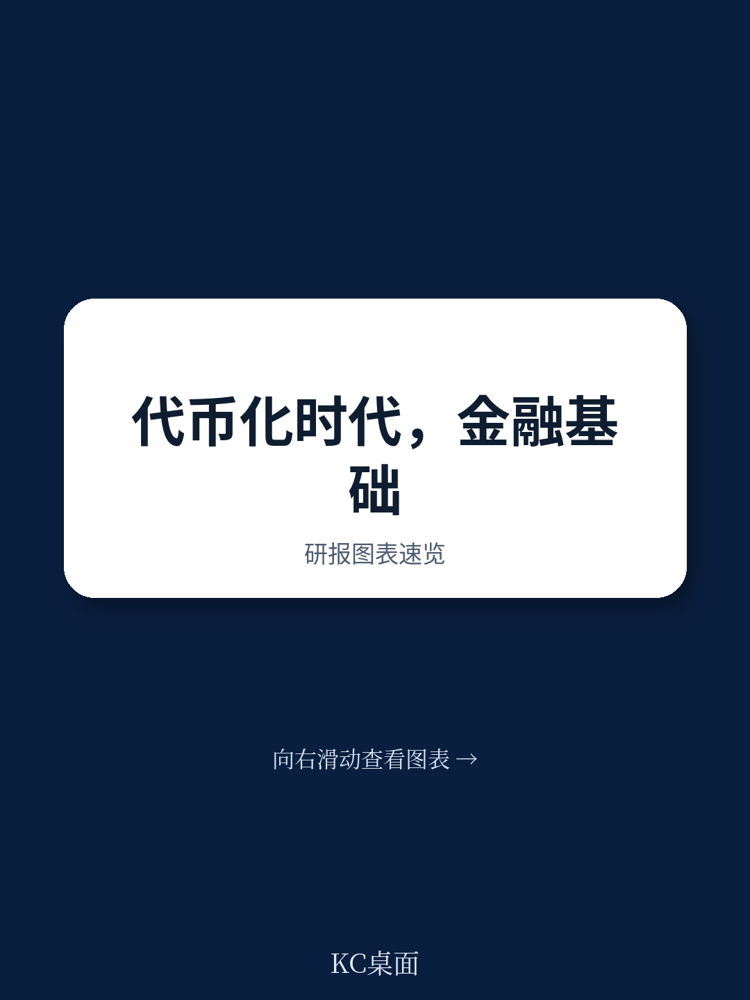
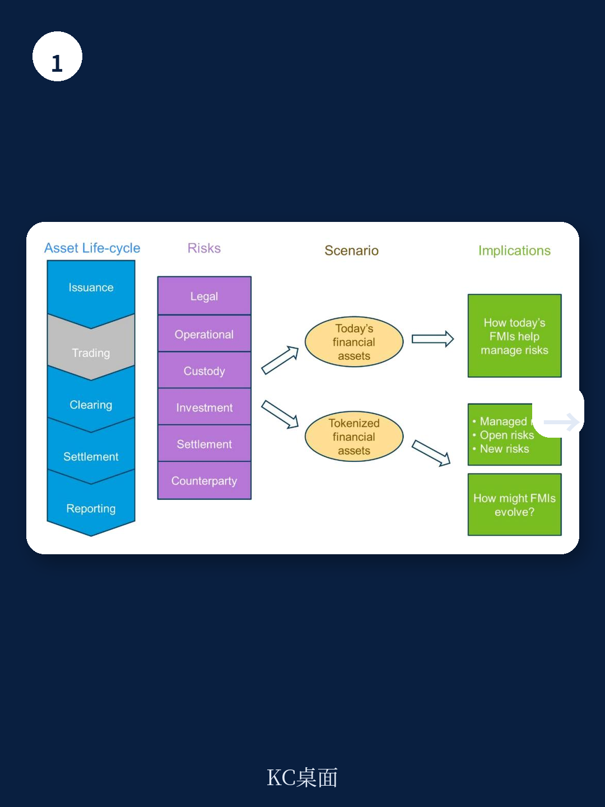
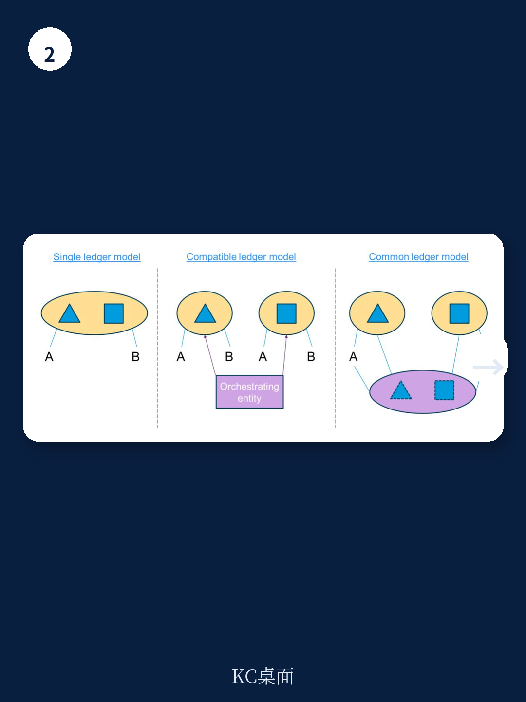

# IMF：Tokenization不会消灭金融基础设施，但会重新定义谁做什么

金融市场的代币化浪潮正在从概念验证走向实际部署。从债券发行到衍生品清算，从资产托管到交易报告，几乎每一个环节都出现了“上链”的尝试。但一个根本问题始终悬而未决：如果资产在链上发行和交易，那么中央证券存管机构、中央对手方、交易报告库这些传统金融基础设施，还有存在的必要吗？

IMF在2026年7月发布的工作论文给出了一个清晰而审慎的回答：代币化不会消灭金融基础设施，但会从根本上重新分配它们的功能。那些确定性、规则驱动、数据密集的流程——如记录保存、结算、抵押品转移和报告——可以迁移到智能合约上执行。但需要法律确定性、问责制、自由裁量权和压力下判断力的功能，仍然必须由机构来承担。

这份报告的核心判断是：最可能的终局不是去中介化，而是混合模式。代码和机构将共同提供金融稳定所需的信任、韧性和监督。这不是一个技术替代制度的故事，而是一个技术和制度重新分工的故事。

## 1. 智能合约能做什么，不能做什么，边界比想象中更清晰

报告对FMI功能的评估遵循一个简单但有力的框架：一项功能能否迁移到链上，取决于它是否满足三个条件——确定性、可自动化、不需要主观判断。

按照这个标准，报告给出了明确的划分：

**可以迁移到链上的功能**包括：资产发行和记录、所有权转移、结算中的交付对付款执行、抵押品估值和自动追缴、交易数据的标准化报告。这些功能的核心特征是规则明确、输入可验证、输出可预测。

**不能完全迁移的功能**则集中在需要法律效力或主观判断的领域：新交易的法律确认、违约管理中的自由裁量、跨账本协调、监管机构的特殊数据访问、压力情景下的保证金参数调整。这些功能依赖机构的法律地位、监管授权和人类判断力。

> **KC评论：** 这个框架的价值在于，它给出了一个具体的决策工具，而不是空谈“区块链颠覆一切”。如果你是一家CSD或CCP的技术负责人，可以用这个框架逐一评估你的功能清单，决定哪些应该自建区块链系统，哪些应该外包给公共链，哪些必须保留在传统架构中。完整报告中的Annex 2-4提供了更细颗粒度的功能拆解表，每个功能在三种不同架构模型下的可行性都有评分。

## 2. 三种架构模型决定了不同的风险和效率权衡

报告提出了一个关键的分析维度：区块链上的资产、账本和所有者之间有三种可能的架构关系。

第一种是**单一账本模型**，所有资产和所有者记录在同一个账本上。这是最接近传统CSD模式的链上版本，效率最高，但要求所有参与者接受同一个治理框架。这种模型适合主权债券或央行数字货币这类高度标准化的资产。

第二种是**兼容账本模型**，不同资产运行在不同的账本上，但通过标准化的协议实现互操作。这种模型更灵活，允许不同资产类别保留各自的治理规则，但跨账本交易需要额外的协调层，增加了复杂性和风险点。

第三种是**共同账本模型**，多个账本共享一个基础层，但各自保持独立的资产记录。这是最接近“区块链互联网”设想的模型，理论上可以实现无缝的跨资产交易，但治理冲突和版本分歧的风险也最高。

报告的核心洞见是：模型选择不仅仅是技术架构问题，更是风险分配和监管可达性的问题。在单一账本模型中，监管机构可以通过访问一个节点获得全面的交易视图；在兼容账本模型中，监管访问需要跨多个账本协调；在共同账本模型中，如果治理分歧导致账本分叉，监管的连续性可能被打破。

> **KC评论：** 这个分析框架对于正在设计代币化平台的机构来说非常实用。很多项目在起步时只考虑技术可行性，忽略了不同架构对监管合规、风险管理和业务连续性的影响。报告对每种模型的详细分析，包括Annex中按功能拆解的评分表，是决策者必须参考的路线图。完整报告中的Figure 2和Figure 3直观地展示了这三种架构的区别。

## 3. 结算风险的核心挑战：链上DvP需要现金也是代币化的

报告特别强调了结算环节的一个关键瓶颈：交付对付款机制在链上能否有效运作，取决于现金端的代币化程度。

如果证券已经代币化，但现金仍然是传统银行账户中的余额，那么DvP就需要一个链下到链上的网关。这个网关本身就是一个集中化节点，可能重新引入结算对手方风险。只有当现金也以央行数字货币或代币化商业银行存款的形式存在于同一个账本或可互操作的账本上时，真正的原子结算才能实现。

这不是一个遥远的理论问题。多个央行数字货币项目和代币化债券试点已经遇到了这个瓶颈。报告指出，即使技术上可以实现原子结算，法律上仍然需要明确：在链上完成资产转移是否具有与传统DvP同等的法律确定性？如果链上发生回滚或分叉，所有权状态如何确定？

**这些法律问题目前没有统一的国际答案。** 不同司法管辖区的证券法、破产法和合同法对链上资产所有权的认定存在显著差异。报告建议，在跨境交易中，需要明确指定适用法律和争议解决机制，这本身就是一项需要机构参与的功能。

## 4. 报告尚未完全回答的关键问题：治理风险如何定价

尽管报告对代币化环境下FMI功能的重新分配给出了系统性的分析，但有一个关键问题仍然悬而未决：**治理风险的定价和转移机制。**

在传统FMI中，治理风险由监管机构、中央对手方和存管机构的资本缓冲、保险安排和最后贷款人机制共同承担。在代币化环境中，当部分功能迁移到智能合约后，相应的治理风险并未消失，只是转移到了链上治理机制、验证者集和协议开发者身上。

这些新的风险承担者是否有足够的资本和激励来吸收损失？如果智能合约出现漏洞、验证者合谋、或者治理攻击导致资产记录被篡改，损失由谁承担？报告承认，当前的代币化平台普遍缺乏与FMI相当的风险管理框架，包括资本要求、压力测试和恢复与处置计划。

> **KC评论：** 这是报告最值得深入阅读的部分之一。它在结论中暗示，代币化FMI的风险框架可能需要重新设计，但并没有给出具体方案。这是当前政策制定者和市场参与者面临的最大盲区。完整报告对CCP在代币化环境下的保证金管理、违约拍卖和损失分配机制有更详细的讨论，这些内容对于理解治理风险的定价至关重要。

## 5. 一个实用的观察框架：用三个问题评估任何代币化FMI方案

基于报告的分析框架，决策者可以用三个关键问题来评估任何代币化FMI方案：

**第一，功能是否满足确定性条件？** 如果一项功能需要主观判断、法律解释或压力下的自由裁量，那么它不适合完全迁移到链上。适合迁移的功能应该是规则明确、输入可验证、输出可预测的。

**第二，现金端是否与资产端在同一技术栈上？** 如果资产代币化但现金没有，那么DvP的效率和安全性都会打折扣。真正高效的代币化市场需要央行数字货币或合规的代币化商业银行存款作为结算资产。

**第三，治理风险是否有明确的承担者和资本安排？** 如果链上治理失败或协议升级导致资产损失，是否有法律框架和资本缓冲来保护参与者？如果没有，那么这个方案在金融稳定意义上是不完整的。

这三个问题可以帮助快速筛选出有实质价值的代币化方案和那些仅仅在技术层面“看起来像”代币化的方案。

---

**这份报告的价值不在于预测未来，而在于给出了一个系统性的分析框架，让市场参与者和监管者能够用相同的语言讨论代币化对金融基础设施的影响。** 报告对CSD、CCP和TR功能的逐一拆解，是当前公开文献中最细致的工作之一。但正如报告自己所承认的，许多关键假设——特别是关于治理风险定价和法律确定性的假设——仍然需要实际部署的验证。

在未来的市场中，代码和机构将共同构成金融基础设施的两个支柱。问题不是哪一个会胜出，而是它们如何分工、如何协调、如何共同确保金融稳定。这份报告是理解这个新分工的起点，但远远不是终点。

如果你正在设计或评估代币化金融基础设施方案，这份报告的Annex 2-4提供了目前最完整的功能迁移对照表。加入我们的社群，每天由AI agent与人工review生成国际投行与多边机构的中文摘要与KC评论，包含完整报告解读、原始图表和数据合集，既方便喂给AI分析，也适合人工快速把握市场动态。我们每天更新约10-40页，覆盖IMF、BIS、高盛、摩根士丹利等核心机构的最新研究，帮你持续跟踪代币化金融基础设施的最新进展。

Personal reading notes and learning share only. Not investment advice.

