IMF Country Report No. 26/163

## KYRGYZ REPUBLIC

July 2026

## 2026 ARTICLE IV CONSULTATION—PRESS RELEASE; STAFF REPORT; AND STATEMENT BY THE EXECUTIVE DIRECTOR FOR KYRGYZ REPUBLIC

Under Article IV of the IMF's Articles of Agreement, the IMF holds bilateral discussions with members, usually every year. In the context of the 2026 Article IV consultation with the Kyrgyz Republic, the following documents have been released and are included in this package:

\- A Press Release summarizing the views of the Executive Board as expressed during its June 3, 2026, consideration of the staff report that concluded the Article IV consultation with the Kyrgyz Republic.

\- The Staff Report prepared by a staff team of the IMF for the Executive Board's consideration on June 3, 2026, following discussions that ended on April 1, 2026, with the officials of the Kyrgyz Republic on economic developments and policies. Based on information available at the time of these discussions, the staff report was completed on May 14, 2026.

• An Informational Annex prepared by the IMF staff.

\- A Debt Sustainability Analysis prepared by the staffs of the IMF the International Development Association.

• A Statement by the Executive Director for the Kyrgyz Republic.

The documents listed below have been or will be separately released.

Selected Issues

The IMF's transparency policy allows for the deletion of market-sensitive information and premature disclosure of the authorities' policy intentions in published staff reports and other documents.

Copies of this report are available to the public from

## IMF Executive Board Concludes 2026 Article IV Consultation with Kyrgyz Republic

## FOR IMMEDIATE RELEASE

\- The Kyrgyz Republic has sustained strong economic growth for the fourth consecutive year, but inflation is now above the central bank's target.

• Growth is expected to moderate as reexport and trade-related activities plateau.

\- The favorable economic performance provides a window of opportunity to enhance resilience, strengthen policy buffers, and support inclusive growth.

Washington, DC – June 4, 2026: The Executive Board of the International Monetary Fund (IMF) completed the Article IV Consultation for the Kyrgyz Republic. $^{1}$ The authorities need more time to consider the publication of the Staff Report prepared for this consultation. $^{2}$

The Kyrgyz Republic continues to record strong economic performance as the economy transitions from low-income status. Since 2022, expanded trade flows, robust remittance and capital inflows, and strong construction activity supported by government spending have underpinned rapid growth. Output is estimated to have grown by 11 percent in 2025. At the same time, inflation rose to 11 percent in March 2026, well above the central bank's 5–7 percent target range.

Growth is expected to moderate as recent trade-related gains fade but will be buoyed by large infrastructure projects over the medium term. Inflation is likely to remain high through 2027 before easing gradually if macroeconomic policies are tightened appropriately. After fiscal surpluses in 2023–25, the budget is projected to move into deficit in 2026, mainly because of higher public wages and capital spending. Public debt remains sustainable, but financing needs are sizable. Strong remittances and high gold prices are expected to support the external position.

Even though the Kyrgyz Republic has limited exposure to the war in the Middle East, sustained high oil prices could add to inflation pressures. With heightened global uncertainty, accelerating reforms will be key to enhance resilience, strengthen policy buffers, and support inclusive growth.

## Executive Board Assessment

Executive Directors agreed with the thrust of the staff appraisal. They welcomed the Kyrgyz Republic's rapid economic growth and declining poverty, while noting downside risks, emerging signs of overheating, and elevated inflation pressures. In this context, Directors underscored the need for careful policy recalibration, supported by Fund capacity development, to enhance resilience, strengthen buffers, and foster private sector-led inclusive growth.

Directors underscored the need to bolster the fiscal position by strengthening revenue mobilization to create space for priority infrastructure and targeted social spending, while containing expenditure on energy subsidies and wages. They called for enhancing public financial, investment, and debt management to strengthen efficiency, resilience, and fiscal sustainability. Directors also emphasized the need to fully capture quasi-fiscal operations and SOE risks, including ensuring that the operations of the Stabilization Fund are transparently reflected in fiscal reporting and risk assessments.

Directors supported maintaining an appropriately tight and data-dependent monetary policy stance until inflation durably returns to the central bank's target range. They emphasized the importance of strengthening the operational framework and encouraged the authorities to strengthen the independence of the central bank. Greater exchange rate flexibility and more diversified reserves would further enhance external resilience.

Noting rapid credit growth, high NPLs and a deepening bank–sovereign nexus, Directors called for heightened financial supervisory vigilance and capacity, focusing on a risk-based approach and proactive macroprudential measures. They also noted the need for enhanced AML/CFT measures and stronger supervision and governance of virtual asset service providers.

Directors called for ambitious structural reforms to support private sector-led growth. They agreed that priority areas include SOE reform and strengthening the business environment, competition, the rule of law, and anti-corruption. Directors supported ongoing efforts to reduce informality and labor market rigidities, invest in human capital and digital infrastructure, and harness the gains of AI. Strengthening external sector and national account statistics is essential to enhance macroeconomic surveillance.

<table><tr><td colspan="10">Table 1. Kyrgyz Republic: Selected Economic Indicators</td></tr><tr><td colspan="10">I. Social and Demographic Indicators</td></tr><tr><td>Population (in millions, 2024)</td><td colspan="2">7.3</td><td colspan="5">Gini coefficient (2023)</td><td colspan="2">0.26</td></tr><tr><td>Unemployment rate (2024)</td><td colspan="2">3.7</td><td colspan="5">Life expectancy at birth in years (2025)</td><td colspan="2">72.1</td></tr><tr><td>Poverty rate (in percent, national definition, 2024)</td><td colspan="2">25.7</td><td colspan="5">Adult literacy rate (percent of popul., 2025)</td><td colspan="2">99.6</td></tr><tr><td>Per capita GDP (in million U.S. dollars, World Bank, 2024)</td><td colspan="2">2,420</td><td colspan="5">Under-five mortality (per 1000 live births, 2025, est.)</td><td colspan="2">12.6</td></tr><tr><td colspan="10">II. Economic Indicators</td></tr><tr><td rowspan="2"></td><td>2023</td><td>2024</td><td>2025</td><td>2026</td><td>2027</td><td>2028</td><td>2029</td><td>2030</td><td>2031</td></tr><tr><td></td><td></td><td>Est.</td><td></td><td></td><td>Proj.</td><td></td><td></td><td></td></tr><tr><td colspan="10">Real Sector</td></tr><tr><td>Nominal GDP (in billions of soms)</td><td>1,334</td><td>1,583</td><td>1,976</td><td>2,342</td><td>2,761</td><td>3,204</td><td>3,645</td><td>4,108</td><td>4,607</td></tr><tr><td>Nominal GDP (in millions of U.S. dollars)</td><td>15,187</td><td>18,175</td><td>22,625</td><td>25,817</td><td>28,298</td><td>30,731</td><td>33,101</td><td>35,419</td><td>37,597</td></tr><tr><td>Real GDP (growth in percent)</td><td>9.0</td><td>11.5</td><td>11.1</td><td>6.1</td><td>5.8</td><td>6.1</td><td>5.4</td><td>5.3</td><td>5.2</td></tr><tr><td>GDP per capita (in U.S. dollars)</td><td>2,191</td><td>2,568</td><td>3,131</td><td>3,502</td><td>3,759</td><td>3,998</td><td>4,222</td><td>4,424</td><td>4,599</td></tr><tr><td>Consumer prices (12-month percent change, eop)</td><td>7.3</td><td>6.3</td><td>9.4</td><td>12.5</td><td>10.5</td><td>8.5</td><td>7.5</td><td>6.5</td><td>6.5</td></tr><tr><td>Consumer prices (12-month percent change, average)</td><td>10.8</td><td>5.0</td><td>8.2</td><td>11.7</td><td>11.4</td><td>9.4</td><td>7.9</td><td>7.0</td><td>6.5</td></tr><tr><td colspan="10">General government finances (in percent of GDP) 1/</td></tr><tr><td>Revenue</td><td>34.5</td><td>34.5</td><td>38.5</td><td>33.4</td><td>31.4</td><td>31.2</td><td>31.1</td><td>30.8</td><td>30.6</td></tr><tr><td>Of which: Tax revenue</td><td>21.9</td><td>21.7</td><td>23.0</td><td>22.6</td><td>22.6</td><td>22.6</td><td>22.7</td><td>22.6</td><td>22.5</td></tr><tr><td>Expense</td><td>26.1</td><td>25.7</td><td>26.3</td><td>27.5</td><td>25.6</td><td>25.3</td><td>25.3</td><td>25.4</td><td>25.3</td></tr><tr><td>Gross operating balance</td><td>8.4</td><td>8.8</td><td>12.2</td><td>5.8</td><td>5.8</td><td>6.0</td><td>5.9</td><td>5.4</td><td>5.4</td></tr><tr><td>Net acquisition of nonfinancial assets</td><td>6.8</td><td>6.9</td><td>9.6</td><td>9.7</td><td>9.3</td><td>9.5</td><td>8.9</td><td>8.2</td><td>8.1</td></tr><tr><td>Overall balance (net lending/borrowing) 2/</td><td>1.6</td><td>2.0</td><td>2.6</td><td>-3.8</td><td>-3.5</td><td>-3.6</td><td>-3.1</td><td>-2.8</td><td>-2.8</td></tr><tr><td>Net lending/borrowing excluding CKU railways</td><td>1.6</td><td>2.0</td><td>3.0</td><td>-2.6</td><td>-2.5</td><td>-2.6</td><td>-2.5</td><td>-2.8</td><td>-2.8</td></tr><tr><td>Primary net lending/ borrowing</td><td>2.6</td><td>3.1</td><td>3.7</td><td>-2.8</td><td>-1.9</td><td>-1.7</td><td>-1.0</td><td>-0.6</td><td>-0.4</td></tr><tr><td>Total government debt 3/</td><td>42.0</td><td>36.2</td><td>39.4</td><td>41.4</td><td>40.6</td><td>40.5</td><td>40.4</td><td>40.6</td><td>40.8</td></tr><tr><td>Of which domestic debt</td><td>10.9</td><td>11.3</td><td>15.8</td><td>14.8</td><td>13.3</td><td>12.3</td><td>12.6</td><td>16.0</td><td>18.5</td></tr><tr><td colspan="10">Monetary sector</td></tr><tr><td>Reserve money (percent change, eop)</td><td>9.9</td><td>17.5</td><td>29.7</td><td>17.2</td><td>17.2</td><td></td><td></td><td></td><td></td></tr><tr><td>Broad money (percent change, eop)</td><td>15.0</td><td>31.9</td><td>43.3</td><td>36.4</td><td>19.2</td><td></td><td></td><td></td><td></td></tr><tr><td>Credit to private sector (percent change, eop)</td><td>25.9</td><td>33.9</td><td>49.0</td><td>27.8</td><td>26.5</td><td></td><td></td><td></td><td></td></tr><tr><td>Credit to private sector (in percent of GDP)</td><td>19.8</td><td>22.4</td><td>26.7</td><td>28.8</td><td>30.9</td><td></td><td></td><td></td><td></td></tr><tr><td>Velocity of broad money 4/</td><td>2.6</td><td>2.4</td><td>2.0</td><td>1.8</td><td>1.8</td><td></td><td></td><td></td><td></td></tr><tr><td>Policy Rate 5/</td><td>13.0</td><td>9.0</td><td>11.0</td><td>...</td><td>...</td><td></td><td></td><td></td><td></td></tr><tr><td colspan="10">External sector</td></tr><tr><td>Current account balance (in percent of GDP) 6/</td><td>-44.9</td><td>-22.6</td><td>-24.4</td><td>-7.3</td><td>-7.0</td><td>-6.2</td><td>-5.7</td><td>-5.4</td><td>-5.3</td></tr><tr><td>Export of goods and services (in millions of U.S. dollars)</td><td>5,522</td><td>8,459</td><td>7,229</td><td>12,319</td><td>13,263</td><td>14,503</td><td>15,615</td><td>16,680</td><td>17,718</td></tr><tr><td>Export growth (percent change)</td><td>52.0</td><td>53.2</td><td>-14.5</td><td>70.4</td><td>7.7</td><td>9.4</td><td>7.7</td><td>6.8</td><td>6.2</td></tr><tr><td>Import of goods and services (in millions of U.S. dollars)</td><td>14,461</td><td>15,105</td><td>15,563</td><td>17,299</td><td>18,528</td><td>19,969</td><td>21,315</td><td>22,814</td><td>24,282</td></tr><tr><td>Import growth (percent change)</td><td>35.6</td><td>4.5</td><td>3.0</td><td>11.2</td><td>7.1</td><td>7.8</td><td>6.7</td><td>7.0</td><td>6.4</td></tr><tr><td>Gross International reserves (in millions of U.S. dollars) 7/</td><td>3,044</td><td>4,923</td><td>8,698</td><td>9,246</td><td>8,904</td><td>8,826</td><td>8,636</td><td>7,654</td><td>6,926</td></tr><tr><td>Gross reserves (months of next year imports, eop)</td><td>2.4</td><td>3.8</td><td>6.0</td><td>6.0</td><td>5.4</td><td>5.0</td><td>4.5</td><td>3.8</td><td>3.2</td></tr><tr><td>Gross reserves (months of next year imports adjusted for re-exports, eop)</td><td>2.4</td><td>4.0</td><td>7.3</td><td>7.3</td><td>6.5</td><td>6.1</td><td>5.5</td><td>4.6</td><td>3.9</td></tr><tr><td>External public debt outstanding (in percent of GDP)</td><td>31.1</td><td>24.9</td><td>23.6</td><td>26.6</td><td>27.4</td><td>28.2</td><td>27.8</td><td>24.6</td><td>22.3</td></tr><tr><td>External public debt service-to-export ratio (in percent) 8/</td><td>6.4</td><td>4.5</td><td>7.3</td><td>3.8</td><td>4.2</td><td>4.4</td><td>4.9</td><td>10.0</td><td>8.6</td></tr><tr><td colspan="10">Memorandum items:</td></tr><tr><td>Exchange rate (soms per U.S. dollar, average)</td><td>87.8</td><td>87.1</td><td>87.4</td><td>...</td><td>...</td><td>...</td><td>...</td><td>...</td><td>...</td></tr><tr><td>Real effective exchange rate (2010=100) (average)</td><td>116.1</td><td>121.6</td><td>127.7</td><td>...</td><td>...</td><td>...</td><td>...</td><td>...</td><td>...</td></tr><tr><td colspan="10">Sources: Kyrgyz authorities; and IMF staff estimates and projections.</td></tr><tr><td colspan="10">1/ General Government comprises the State Government, the Social Fund, and the Mandatory Health Insurance Fund (MHIF).</td></tr><tr><td colspan="10">2/ Includes loans by the State Government to State-Owned Enterprises in the energy sector.</td></tr><tr><td colspan="10">3/ Total Public and Publicly Guaranteed Debt, calculated at end-period exchange rates.</td></tr><tr><td colspan="10">4/ Twelve-month GDP over end-period broad money.</td></tr><tr><td colspan="10">5/ End-of-year rate.</td></tr><tr><td colspan="10">6/ Adjusted for re-exports as of 2026.</td></tr><tr><td colspan="10">7/ Gross International Reserves exclude reserve assets in non-convertible currencies.</td></tr><tr><td colspan="10">8/ External Public and Publicly Guaranteed Debt.</td></tr></table>

# KYRGYZ REPUBLIC

## STAFF REPORT FOR THE 2026 ARTICLE IV CONSULTATION

May 14, 2026

## KEY ISSUES

Context: The Kyrgyz Republic has sustained strong economic growth for the fourth consecutive year. The outlook, is however clouded by significant downside risks. The overall favorable economic performance provides a window of opportunity to accelerate reforms that enhance resilience, strengthen policy buffers, and make room for private sector-led growth.

## Recommendations:

\- Fiscal policy. Investment in infrastructure and human capital needs to be balanced with the creation of fiscal space and prudent debt management. In this context, stronger PFM measures and proper budget classification would enhance the efficiency and transparency of public spending. In the longer term, fiscal prospects would be safeguarded by a careful assessment of the public pension system.

\- Monetary and exchange rate policies. To bring inflation in line with the National Bank of the Kyrgyz Republic's target, the monetary policy stance may need to be tightened further should inflation not be on a firmly downward trajectory, in the context of reinforcing the independence of the central bank. The economy's resilience to external shocks would be enhanced by greater exchange rate flexibility and diversification of reserve composition.

\- Financial sector policies. The financial sector would benefit from strengthened supervisory capacity and risk monitoring.

\- Structural reforms—in particular, creating the space for private sector-led growth—remain crucial, in line with past staff advice.

\- Data adequacy. Strengthening the quality of data, especially in the external sector and in national accounts statistics, is essential.

Discussions were held during March 18–April 1, 2026 in Bishkek. The staff team comprised Dmitry Gershenson (head), Khaled Abdelkader, Nasir Rao, Jean van Houtte (all MCD), Anh Nguyen (FAD), Maksym Markevych (LEG), Farid Talishli (Resident Representative), Erkeaim Shambetova and Anvar Muratkhanov, with support from Aigerim Toigonbaeva (all Resident Representative office). Patryk Loszewski and Lilia Kadyrberdieva (OED) participated in key meetings. Nihal Haider, Elyad Shojaei, and Svetlana Zolotareva assisted from the headquarters. The mission met with central bank Governor Baketaev, Minister of Finance Suinaliev, former central bank Governor Turgunbaev, and other officials, as well as representatives of the business and diplomatic communities and development partners.

## CONTENTS

CONTEXT 4
RECENT MACROECONOMIC DEVELOPMENTS 4
OUTLOOK AND RISKS 5
POLICY DISCUSSIONS 7
A. Fiscal Policy 7
B. Monetary and Exchange Rate Policies 8
C. Financial Sector Policies 9
D. Structural Reforms 11
E. Data Adequacy 12
STAFF APPRAISAL 13
FIGURES
1. Real Sector and Social Indicators 15
2. External and Monetary Sectors 16
3. Fiscal Sector 17
4. Financial Soundness Indicators 18
TABLES
1. Selected Economic Indicators 19
2. National Accounts, 2023-2031 20
3. Balance of Payments, 2023-2031 21
4. NBKR Accounts, 2023-2027 22
5. Monetary Survey, 2023-2027 23

6. State Government Finances, 2023-2031 (in millions of soms) \_\_\_\_ 24
7. State Government Finances, 2023-2031 (in percent of GDP) \_\_\_\_ 25
8. General Government Finance, 2023-2031, GFSM 2014 Presentation 1/\_\_\_\_ 26
9. General Government Finances, 2023-2031, GFSM 2014 Presentation \_\_\_\_ 27
10. Selected Financial Soundness Indicators, 2020-2025 \_\_\_\_ 28

## ANNEXES

I. Implementation of Key Recommendations of the 2025 Article IV Consultation \_\_\_\_ 29
II. Risk Assessment Matrix \_\_\_\_ 32
III. External Sector Assessment \_\_\_\_ 38
IV. Data Issues \_\_\_\_ 42
V. Assessing Fiscal Risks in the Public Pension System of the Kyrgyz Republic \_\_\_\_ 45
VI. Artificial Intelligence Exposure and Preparedness \_\_\_\_ 51
VII. Mitigation of Cross-border Financial Integrity Risks in Kyrgyz Republic \_\_\_\_ 57

## CONTEXT

1. The Kyrgyz Republic is transitioning from low-income status. Since 2022, expanded trade flows, robust remittance and capital inflows, and strong construction activity supported by government spending have underpinned rapid growth. Real GDP expanded by 47 percent between 2021 and 2025, making the Kyrgyz Republic the third-fastest-growing economy in the world. During this period, per capita GDP in U.S. dollars doubled, reaching 3,100 in 2025.

2. The current favorable economic environment provides an opportunity to accelerate reforms. In June 2025, the authorities adopted the National Development Program (NDP) 2030. The NDP lays out the national objectives of (i) raising nominal GDP from the current US\$23 billion to at least US\$30 billion and reaching GDP per capita of US\$4,500; (ii) achieving annual GDP growth of 8 percent; and (iii) capping the unemployment rate at 5 percent. The authorities broadly agree with staff on the reform priorities to achieve these goals but prefer a longer horizon for their implementation (See Annex I).

## RECENT MACROECONOMIC DEVELOPMENTS

## 3. Signs of overheating are becoming

evident. Output is estimated to have expanded by 11 percent in 2025, owing to strong performance of the construction and trade-related sectors and sustained government spending. Reflecting the growing real wages and ample credit to the private sector, inflation has risen from 6 percent at end-2024 to 11 percent in March 2026, well above the central bank's target range (5-7 percent).

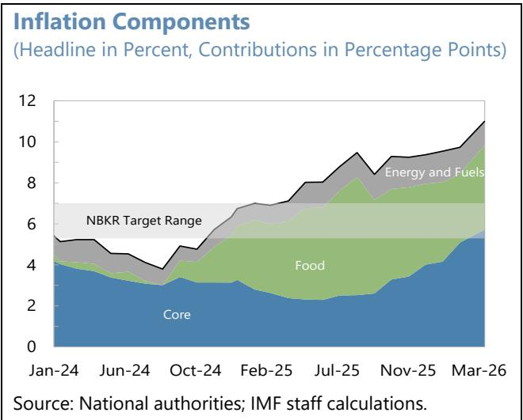

## 4. Net financing needs were large despite the fiscal surplus. The overall fiscal

surplus increased from 2.0 percent of GDP in 2024 to 2.6 percent of GDP in 2025. This reflects large non-tax revenues (10.3 percent of GDP), including proceeds from the liquidation of seized assets and profit transfer from the central bank. $^{1}$ Despite the surplus, the net financing needs were large (estimated at 8.5 percent of GDP in 2025) due to the acquisition of financial assets, mostly in the form of capital injections into SOEs, such as the State Mortgage Company, energy companies and financial institutions, including Eldik Bank.

5. The external environment remained favorable in 2025, but significant errors and omissions in the balance of payments continue to complicate the analysis. As was the case in recent years, errors and omissions remain significant (17 percent of GDP in the first three quarters of 2025), likely reflecting unrecorded trade and financial flows. $^{2}$ The current account deficit, adjusted for these unrecorded flows, is estimated to have increased from 6.4 percent of GDP in 2024 to around 7.5 percent of GDP in 2025, driven by higher imports and lower gold exports. At the same time, international reserves rose—from 4 to 6 months of imports—owing mainly to the revaluation of monetary gold holdings and to the partial conversion of the stock of non-monetary gold into monetary gold. $^{3}$

## 6. The country's first eurobond issuance established the country's standing in

international markets, at a cost. The proceeds (US\$0.7 billion or 3.1 percent of GDP) were used to recapitalize the state-owned Eldik Bank, which then lent most of the money to the Government at a favorable interest rate. The resulting funds were subsequently deposited at Eldik Bank with a view to financing energy and housing projects. $^{4}$ As a result, the downward public debt trajectory—observed since 2021—reversed, with the stock of public debt rising from 36 percent of GDP at end-2024 to 39 percent at end-2025.

7. The financial sector is small but growing fast. It is dominated by commercial banks (both state-owned and private) and virtual asset service providers (VASPs). The commercial banks are largely profitable, well capitalized, and stable, notwithstanding the sanctioning of four small banks. $^{5}$ In 2025, VASPs increased their turnover threefold—exceeding GDP—while AML/CFT supervisory resources and capacity remain limited. Moreover, the Ministry of Finance issued a first-of-its-kind stablecoin (USDKG)—in the amount of US\$50 million (0.2 percent of GDP)—to facilitate cross-border transactions. $^{6}$

## OUTLOOK AND RISKS

8. Growth is projected to decline from 11.1 percent in 2025 to 6.1 percent in 2026, reflecting the unwinding of temporary drivers that boosted activity in recent years. Re-export trade-related activities—which contributed significantly to growth since 2022—are expected to plateau, while domestic demand is expected to moderate assuming tighter macroeconomic policies aimed at containing overheating. Large infrastructure projects will continue to support activity but are not expected to fully offset the normalization of trade-related flows $^{7}$ . Starting this year, growth is projected to average around 6 percent before gradually converging to its estimated potential rate of about 5.3 percent. The fiscal deficit is projected at 4 percent of GDP in 2026, decreasing to 3 percent of GDP over the medium term, with public debt rising to 41 percent of GDP by 2031. The Debt Sustainability Analysis (DSA) indicates that public debt remains sustainable with moderate risks of external and overall debt distress (see DSA). The overall balance of payments is expected to remain in deficit, leading to a gradual reduction of the country's international reserves, with import coverage declining from 6 months in 2025 to 3 months in 2031 under current policies.

9. Inflation would be expected to return to within the central bank's target range only in 2030. With GDP growth already above potential, the planned large expenditures, and the monetary policy stance, inflation is projected to remain in double digits in 2026 and 2027 before gradually declining to under 7 percent in 2030.

10. Risks are tilted to the downside (Annex I). External risks stem from possible trade reversals, which could undermine the high growth momentum, and a fall in gold prices, which could negatively affect fiscal revenues, exports, and the value of reserves. Domestic risks include entrenched inflation and fiscal vulnerabilities. Financial integrity risks and international sanctions related to third countries could expose banks to regulatory and enforcement actions, straining correspondent relationships, increasing AMF/CFT compliance costs, and negatively impacting cross-border financial flows and trade. In the absence of a strong legal, supervisory and regulatory framework, the fast growth of virtual assets could undermine the conduct of monetary policy and the stability of the banking sector.

11. Under a severe global shock scenario, the Kyrgyz Republic would be affected directly by higher global oil prices and indirectly through trade and financial flows. While fuel supply is largely secured through existing contracts with Russia, higher global oil prices would still pass through to domestic costs and add to the already high inflation. Given that part of recent growth has been supported by re-export trade, an economic slowdown in regional trading partners could soften these trade flows and weigh on activity. Similarly, remittances and, hence, the current account balance, could come under pressure if economic conditions in labor-importing economies weaken. Overall, even though these channels could add to macroeconomic pressures, the impact is expected to be manageable.

## Authorities' Views

12. The authorities envisage that the strong growth of the last few years will continue. With the state as the engine of economic development, growth would be supported by large investment projects. The authorities are mindful of the risks posed by inflation but consider that the current monetary policy stance—together with well-anchored inflation expectations—will help maintain medium-term price stability within the 5–7 percent range and ensure macroeconomic resilience. The authorities view the war in the Middle East as a risk factor for the economy, especially in its impact on energy prices and inflation, but not as fundamentally altering the baseline at this stage.

## POLICY DISCUSSIONS

## A. Fiscal Policy

13. Creating fiscal space is key to supporting spending on infrastructure and human capital. Staff estimates that tax revenue could be raised by up to 4 percent of GDP through streamlining VAT exemptions and special tax regimes, increasing the progressivity of the personal income tax, and strengthening revenue administration. $^{8}$ Channeling a larger share of the profits of Kumtor (a state-owned gold producer) to the budget would provide additional revenues. $^{9}$ This is particularly important as expenditures (and the fiscal deficit) are projected to increase in the coming years, reflecting investment in physical and human capital and the large (2 percent of GDP) salary increase for public sector workers envisaged in 2026. In addition to its beneficial impact on debt dynamics, a gradual recalibration of fiscal spending toward a less pro-cyclical stance would help moderate demand pressures.

14. Prudent debt management is needed to preserve fiscal sustainability. Flagship infrastructure projects are being financed by concessional lending commitments from IFIs. The use of the Eurobond proceeds to recapitalize Eldik Bank, however, generated fiscal costs and entailed sustainability risks, particularly if future returns do not offset the additional debt-service obligations. Moreover, external borrowing without gradual amortization, such as the contracted eurobond, heighten rollover risks. $^{10}$

15. Stronger PFM measures and proper budget classification are needed to enhance the efficiency and transparency of public spending. A Fiscal Transparency Evaluation would help identify gaps in fiscal reporting, forecasting, budgeting, and fiscal risk management. Reform priorities include improving the targeting of social spending, operationalizing the SOE fiscal risk framework, and either strengthening the governance of the Stabilization Fund (SF) or dissolving it. $^{11}$ To better assess the underlying fiscal position, proper classification of various financing operations is essential. $^{12}$

16. Careful assessment of the public pension system would safeguard long-term fiscal prospects. While recent salary increases improve the current balance of the pay-as-you-go scheme, they imply a substantial increase in benefit payments when today's active civil servants retire and as life expectancy increases. A basic modeling exercise of public pensions shows that the pension burden (ratio of benefit payments to contributions) is slated to increase over time. The authorities need to quantify the long-term fiscal trajectory of the public pension system and its burden on the national budget (see Annex X: Assessing Fiscal Risk in the Public Pension of the Kyrgyz Republic).

## Authorities' Views

17. The authorities broadly agree with staff's assessment and reaffirm their commitment to fiscal and debt sustainability. They express confidence in maintaining a disciplined fiscal stance, supported by ongoing tax administration reforms and robust growth. The authorities do not envisage introducing a progressive personal income tax system in place of the current flat tax regime over the medium term. Non-tax revenues this year are expected to remain at last year's level. They view the SF as an extrabudgetary fund established to support the socioeconomic development of the Kyrgyz Republic. The authorities emphasize that external borrowing would be primarily associated with high-return infrastructure investments.

## B. Monetary and Exchange Rate Policies

18. The National Bank of the Kyrgyz Republic (NBKR) may need to tighten its monetary policy stance should inflation not be firmly on a declining trajectory. In 2025, the central bank raised the policy rate from 9 to 11 percent, and again to 12 percent in February 2026. The overnight deposit rate—which allows the central bank to directly remunerate banks for their liquidity—was raised as well (from 4 to 5 percent), but is too low to be fully effective, as financial conditions remain accommodative (for further discussion, see the forthcoming SIP “Beyond the Policy Rate: A Financial Conditions Perspective”). Moreover, unsterilized purchases of gold and the large transfer of central bank profits to the Treasury have added to inflation pressures. The NBKR should signal its intent to keep real interest rates positive and contain excessive credit growth. It should also take steps to enhance monetary policy transmission, including by (i) curtailing gold purchases, (ii) establishing a symmetric and narrower interest rate corridor, and (iii) using longer-maturity instruments to mop up excess liquidity. In this regard, raising the overnight deposit rate would be an important first step.

19. Strengthening the independence and governance of the NBKR remains critical to safeguard price stability. Repeated transfers of central bank profits to the budget while its capital remains below statutory thresholds risk undermining institutional credibility and the conduct of monetary policy. The authorities would be encouraged to uphold the provisions of the constitutional law governing the NBKR, discontinue regular profit transfers until capital is adequately restored, and ensure that monetary policy decisions remain fully aligned with the price stability mandate.

20. Greater exchange rate flexibility and diversification of reserve composition would enhance resilience to shocks. While international reserves have increased due to the revaluation of gold holdings, the high concentration in gold exposes the economy to commodity-price volatility.

Continued diversification of reserves and conversion of eligible gold into monetary gold would strengthen external resilience and further enhance reserve management.

21. The External Sector Assessment points to an overvaluation of the Som. It indicates that the external position of the Kyrgyz Republic in 2025 remained substantially weaker than the level implied by medium-term fundamentals and desirable policies (Annex II). Reasons include the strong domestic demand and a high import content of consumption, leading to a gradual decrease in reserves over the medium term. A more flexible exchange rate, reforms aimed at improving competitiveness, and a countercyclical fiscal stance to contain demand pressures would support the external position of the country. Restrictions on export of US dollar cash introduced in 2023 constitute an outflow CFM under the Institutional View on the Liberalization and Management of Capital Flows. $^{13}$

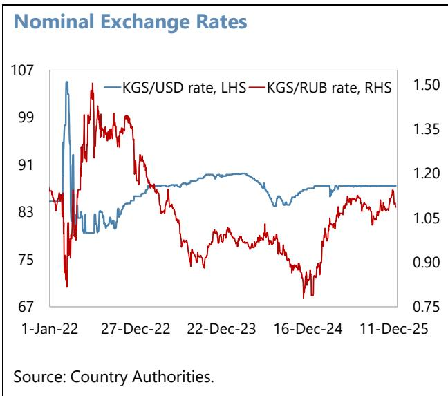

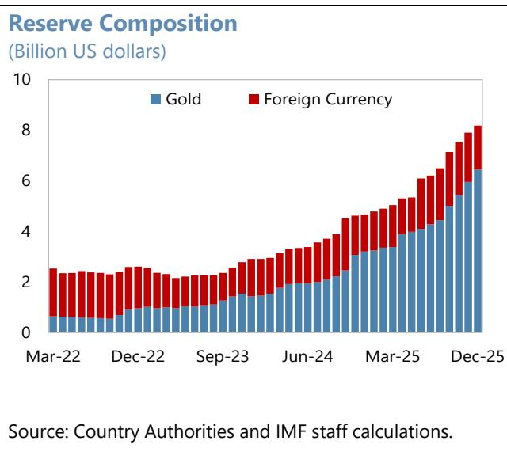

## Authorities' Views

22. The authorities reaffirmed their commitment to price stability. They consider inflation expectations to be well anchored and stand ready to implement the necessary monetary policy measures to bring inflation back to the target range of 5-7 percent within the medium-term.

## C. Financial Sector Policies

23. Supervisory vigilance is warranted in view of elevated NPLs, the rapid expansion of credit, and directed lending. At over 10 percent of total loans, NPLs remain elevated, which suggests pockets of vulnerability. Even though the credit gap is still negative, its upward trajectory implies heightened risks, especially since the surge in credit to the economy in 2025 was led by

consumer lending. $^{14}$ The authorities would be encouraged to implement (i) macroprudential regulatory measures (such as countercyclical capital buffers, limits on loan-to-value ratios, and liquidity requirements to ensure resilience to shocks); and (ii) strengthened supervisory review of credit risk management practices.

24. Directed lending by state-owned commercial banks, including for energy projects, should be discouraged. Such lending could exacerbate uncertainty around the assessments of the projects' underlying economic and financial viability, since the lending is not necessarily guided by commercial principles. The use of Eurobond proceeds to recapitalize Eldik Bank may have added unnecessary complexity to the balance sheet of the bank. Such operations should be avoided in general to allow a better assessment of the financial soundness of the state-owned commercial banks and minimize potential adverse macro-financial implications for the economy.

25. Implications for the financial sector of the sanctioning of four small banks appear limited. The NBKR has appropriately intensified its on-site inspections, while other commercial banks have responded by closer scrutiny of their lending decisions.

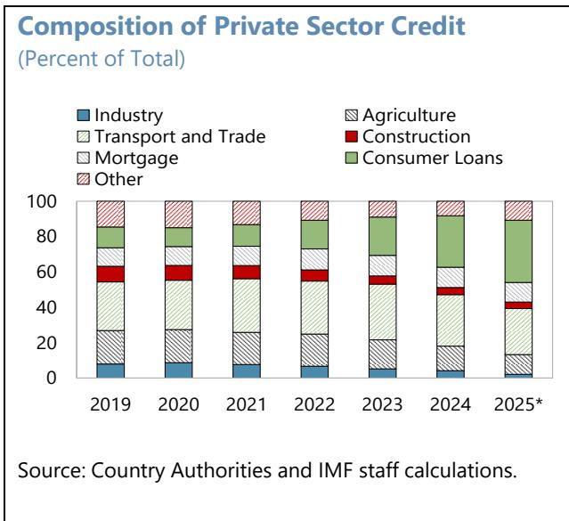

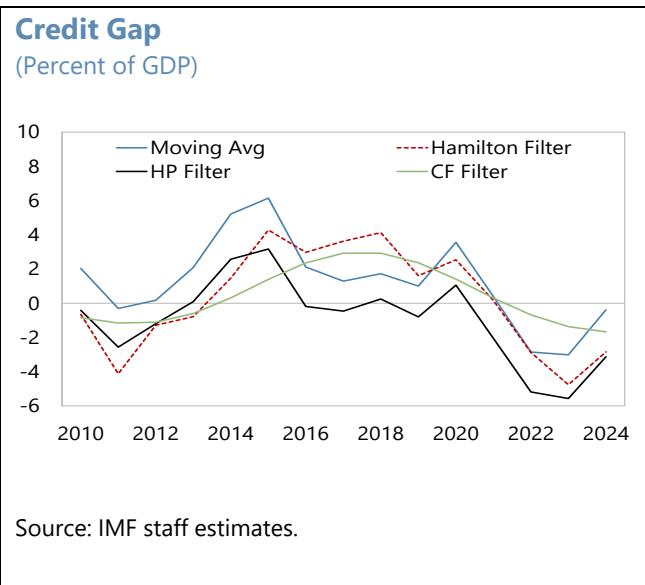

26. The fast-growing virtual assets sector, cross-border payments and trade pose new risks, requiring strengthened mitigation measures (Annex VII). The AML/CFT regulatory framework for VASPs is being strengthened, notably expanding the licensing requirements to the beneficial owners of VASPs, which should be followed by a comprehensive review of the current license-holders to ensure absence of criminal control in the sector. $^{15}$ Strengthening corporate transparency and screening of cross-border financial flows is crucial to mitigate financial integrity risks. To ensure sustainable development of cross-border trade, risk-based post-clearance

monitoring of controlled goods should be enhanced to address re-export and diversion risks. While the amount of issuance of the USDKG stablecoin is limited, additional issuances of stablecoins could undermine the NBKR's ability to conduct monetary policy. $^{16}$

## Authorities' Views

27. The authorities share staff's concerns about rapid credit growth but stress that their supervisory efforts are adequate to the task. They agree about the need to monitor the development of virtual assets in the banking sector and develop a sound regulatory response with clear institutional mandates – for banking sector stability and to limit AML/CFT concerns.

## D. Structural Reforms

## 28. Multi-pronged structural reforms are essential for sustainable growth.

\- Business environment. The authorities would be encouraged to reduce the footprint of the state in the economy by focusing more on creating an enabling environment for the private sector and less on direct interventions through SOEs. Decisive measures are needed to level the playing field for the private sector and reduce barriers to entry for potential competitors. Among the priorities are advancing tariff reforms to improve cost recovery in energy SOEs, strengthening financial performance oversight to identify emerging fiscal risks, and enhancing SOE management and transparency—and measures to promote competition and bolster private sector development. $^{17}$

\- Governance. Addressing macro-critical governance weaknesses is needed to avert macro-financial risks and spur growth. The authorities should continue implementing the 2025-2030 Anti-Corruption Strategy and strengthening the rule of law by developing the integrity vetting of judicial candidates. The asset disclosure by public officials should be enhanced by expanding the scope of published information and strengthening the verification procedures.

\- AI. Labor market exposure to generative AI is currently moderate, due in large part to the economy's relative concentration in low-automation activities in the informal sector, limiting both the risks and the potential gains. Addressing the constraints to AI adoption (such as gaps in digital infrastructure and in human capital) will require reforms in digital infrastructure, workforce skills, governance/legal frameworks and data systems (see the forthcoming annex on Measuring AI Preparedness of the Kyrgyz Republic).

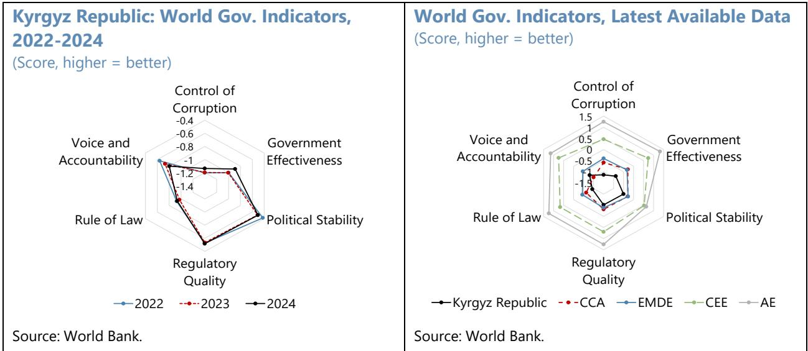

29. Reducing informality would foster inclusive growth. Establishing an unemployment insurance system—designed to operate countercyclically—would reduce reliance on informal work as a buffer against economic shocks. Complementary measures, including vocational training, job search assistance, and job placement services would improve skill matching and labor mobility—hence, supporting sustainable integration into formal employment. Expanding SMEs' access to finance would facilitate their transition to the formal sector (see forthcoming SIP on Informal Employment in the Kyrgyz Republic).

## Authorities' Views

30. The authorities view structural reforms as key to sustaining growth and protecting the most vulnerable. They stress their commitment to reducing informality, including to benefit from the potentially transformative impact of AI. The authorities aim to leverage AI technologies to enhance public service delivery and support broader socio-economic development. To this end, the authorities plan to continue strengthening the regulatory framework and investing further in digital infrastructure. They view the implementation of their 2025 anti-corruption strategy as an essential part of effective economic regulation. The authorities acknowledge the concerns about SOE competitiveness, but note the improved monitoring of associated risks.

## E. Data Adequacy

31. Data quality is broadly adequate for surveillance, but there is room for improvement. In particular, large errors and omissions in the balance of payments remain and continue to complicate staff analysis. National accounts statistics could also be improved to minimize frequent large revisions. The IMF stands ready to provide technical assistance in these areas.

## STAFF APPRAISAL

32. The Kyrgyz Republic is transitioning from its low-income status. The expansion of external trade, robust remittances and capital inflows, and strong construction activity supported by government spending have underpinned rapid growth of recent years, contributing to rising incomes and declining poverty. At the same time, stronger domestic demand pressures and external factors have elevated inflation above the NBKR's target range. In the context of rapid credit growth, strong wage increases and elevated liquidity, this points to overheating that requires a timely policy response.

33. Creating fiscal space is essential to support priority infrastructure and social spending while containing domestic demand. Additional revenue can be mobilized by streamlining VAT exemptions and special tax regimes, increasing PIT progressivity, and strengthening revenue administration.

34. Stronger public financial management (PFM) measures are needed to enhance the efficiency and transparency of public spending. Measures should focus on containing the public wage bill, gradually reducing energy subsidies, improving the targeting of social spending, and strengthening public investment management to enhance efficiency and resilience.

35. To further reinforce fiscal sustainability and policy credibility, prudent debt management, avoidance of quasi-fiscal financing, and stronger fiscal risk monitoring—especially related to SOEs—are critical. Continued efforts to enhance fiscal transparency, including comprehensive coverage of all public sector operations, would help ensure that fiscal risks are fully identified and effectively managed. In this context, the Stabilization Fund should either be dissolved or fully incorporated into the fiscal perimeter to ensure its operations are transparently reflected in fiscal reporting and risk assessments.

36. Monetary policy should remain focused on returning inflation to the NBKR's target range and anchoring expectations. With external pressures and strong domestic demand keeping inflation elevated, the recent policy rate increase is appropriate. Given persistent excess liquidity and the weak monetary policy transmission mechanism, however, strengthening the operational framework—through improved liquidity management, a narrower and more symmetric corridor, and reduced subsidized lending via state-owned banks—is essential.

Repeated profit transfers to the budget, while capital remains below statutory thresholds, risk undermining the effectiveness of monetary policy. The authorities should adhere to the central bank law and suspend regular profit transfers until capital is restored, while ensuring that policy decisions remain fully aligned with the price stability mandate.

38. Greater exchange rate flexibility and more diversified reserves would enhance resilience. Although reserves have risen due to gold revaluation, high concentration in gold increases exposure to price volatility. Continued diversification and conversion of eligible gold into monetary gold would strengthen external resilience and reserve management.

## 39. The financial sector requires strengthened supervisory capacity and risk monitoring.

Risk-based supervision should be strengthened; directed lending should be curtailed; and proactive macroprudential measures to safeguard financial stability and resilience should be considered. Efforts to enhance AML/CFT effectiveness should continue, including operationalizing the beneficial ownership registry and assessing virtual asset risks. Priorities include stronger supervision and governance of VASPs, alignment with international standards, robust financial stability safeguards, consumer protection, mitigation of illicit finance risks, and monitoring trade in controlled goods.

## 40. Structural reforms remain crucial to enhancing sustainable and inclusive growth.

Priorities include advancing SOE reform, improving the business environment and competition, strengthening the rule of law and anti-corruption efforts, and addressing informality and labor market rigidities. Continued investment in human capital and digital infrastructure, alongside improvements in governance and labor market policies, will be important to harness the gains from digitalization and AI adoption.

41. Strengthening the quality of macroeconomic statistics is essential, particularly in the areas of external sector statistics and national accounts statistics. Improved coverage, consistency, and transparency in these datasets would enhance policy analysis, support more accurate risk assessment, and strengthen overall macroeconomic surveillance.

42. Staff recommends that the next Article IV consultation be held on a standard 12-month cycle.

Sources: country authorities and IMF staff estimates.

## Figure 1. Kyrgyz Republic: Real Sector and Social Indicators

Growth outpaced comparators for the past 4 years,...  
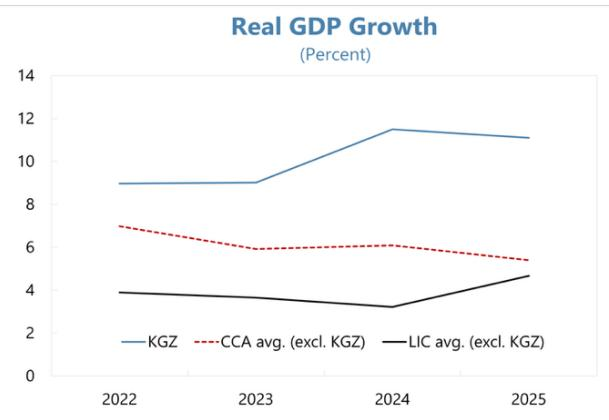  
Inflation is above target...  
...thanks to trade and construction.

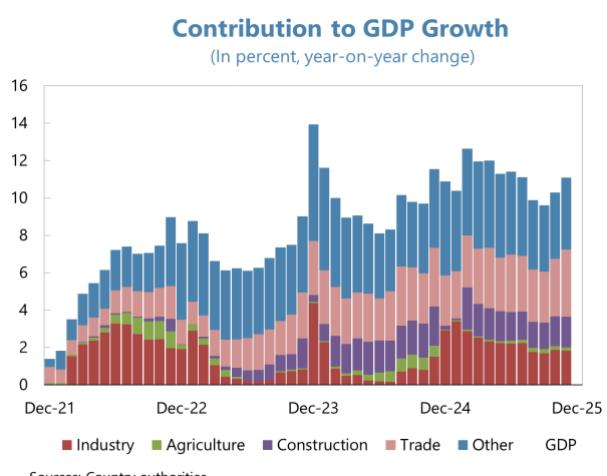

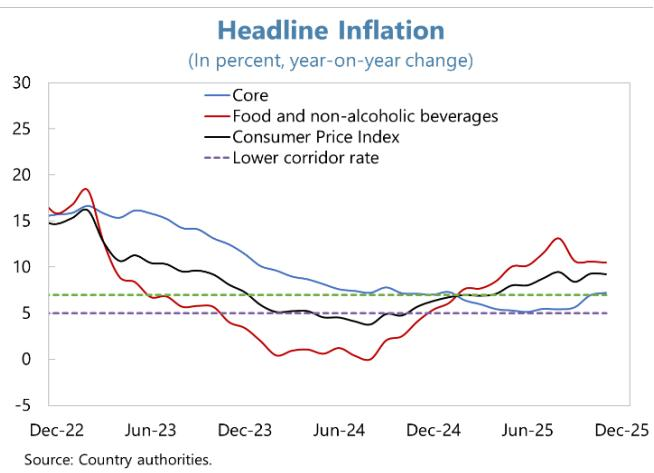  
...threatening recent poverty reduction.

Poverty Headcount Ratio at \$8.30 per day $^{1}$ (2021 PPP, in percent of the population)  
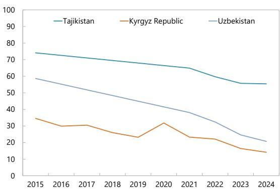  
1/ \$8.30 per day is a close approximation of the Kyrgyz national poverty rate.
Sources: World Development Indicators, World Bank, Country authorities, and IMF staff calculations.

Per capita income rose sharply in recent years...  
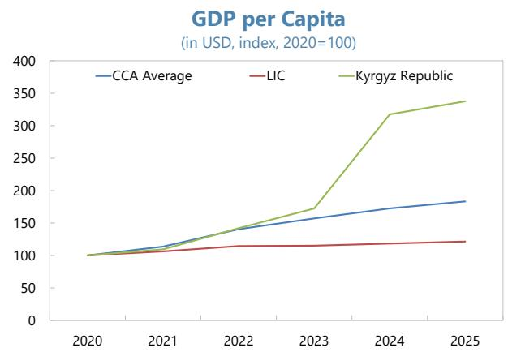  
Sources: Country authorities and IMF staff estimates.  
...as income inequality remained comparable to peers.

Income Inequality in Selected CIS and Baltic States, 2023 (Gini coefficient, 0=perfect equality, 100=highest inequality)  
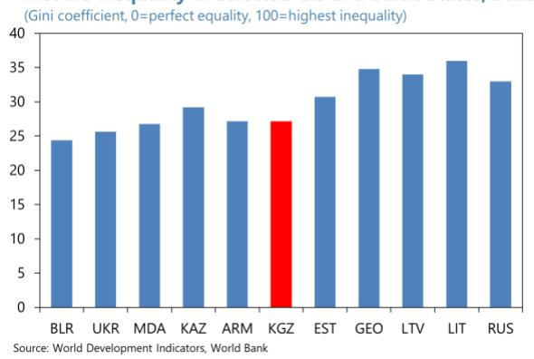

## Figure 2. Kyrgyz Republic: External and Monetary Sectors

CA deficit remains sizable...

Elements of the Current Account (In Percent of GDP)  
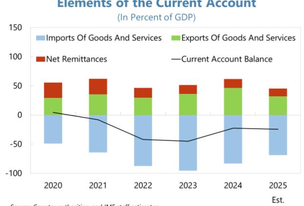

...offset by large errors and omissions.  
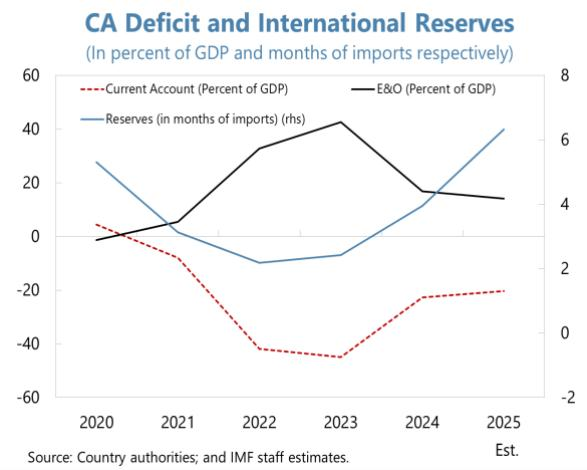  
Higher gold prices and conversion of non-monetary to monetary gold boosted reserves.

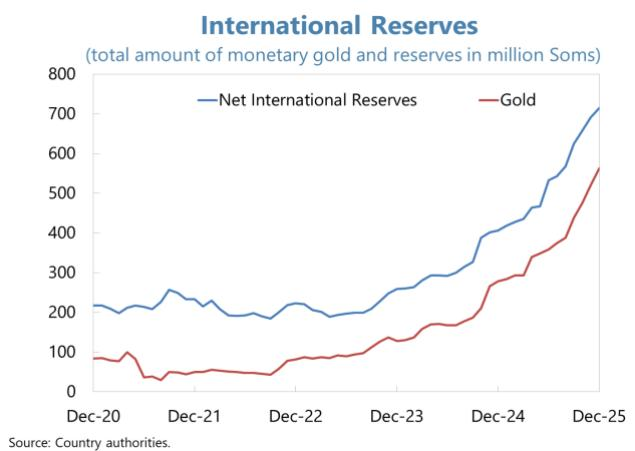  
The exchange rate appreciated in real effective terms...  
Nominal and Real Effective Exchange Rates (Base 100 - December 2009)

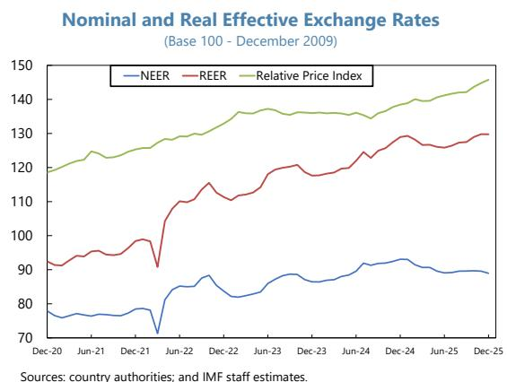  
...while interest rates remained subdued.

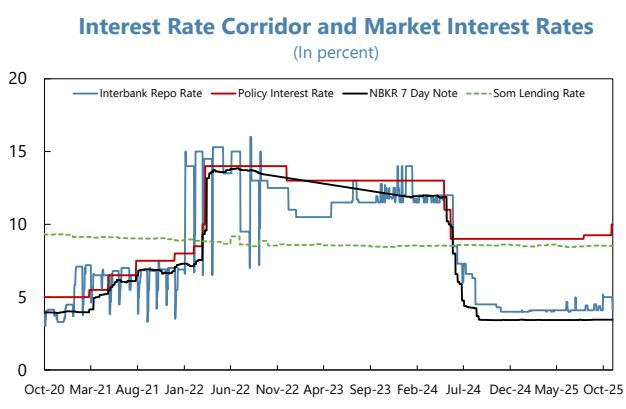

Meanwhile, money and credit continued to grow.  
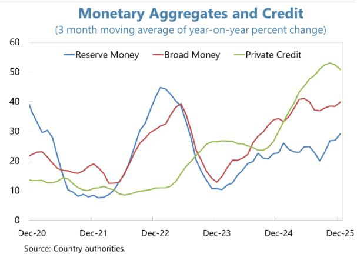

## Figure 3. Kyrgyz Republic: Fiscal Sector

Revenue is buoyed by non-tax proceeds,...

Public Revenue - General Government (In Percent of GDP)

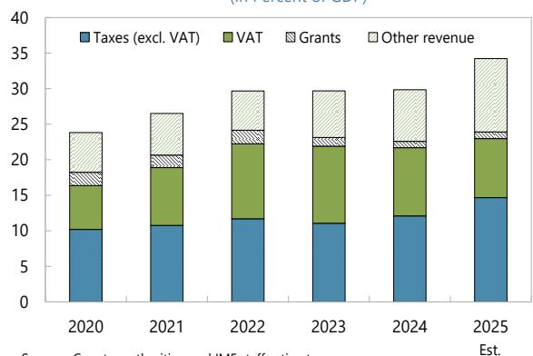  
Sources: Country authorities; and IMF staff estimates.  
...mainly current expenditure,...  
Public Expenditure - General Government (in percent of GDP)

...while expenditure increased,...

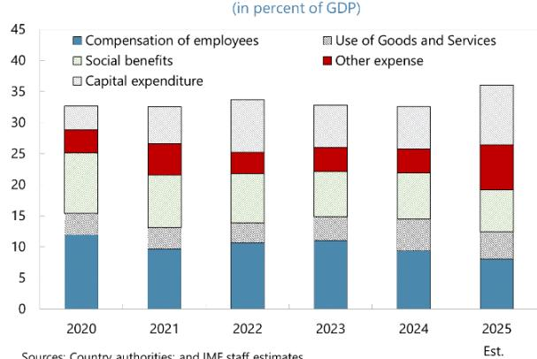  
Sources: Country authorities; and IMF staff estimates.

Current and Capital Expenditure - General Government (In percent of GDP)  
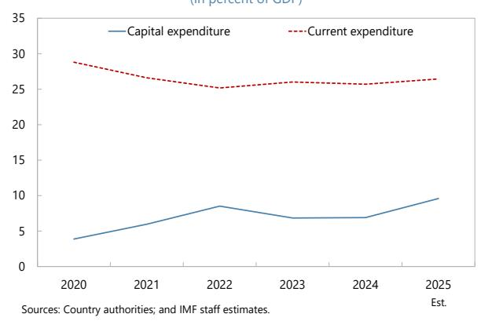

...due to a higher wage bill, which remains comparatively sizable.  
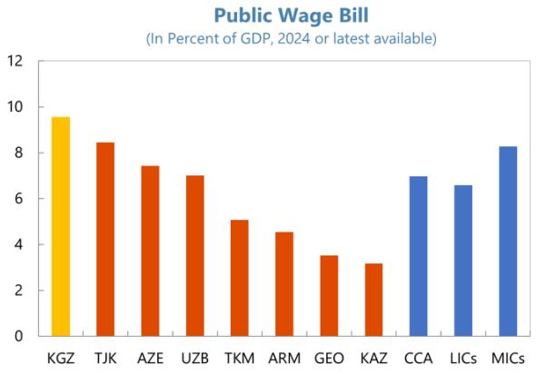  
Source: Country authorities.  
Despite the small fiscal deficit in 2025, below-the-line spending is driving sizable financing needs.

Financing Needs vs. Fiscal Deficit  
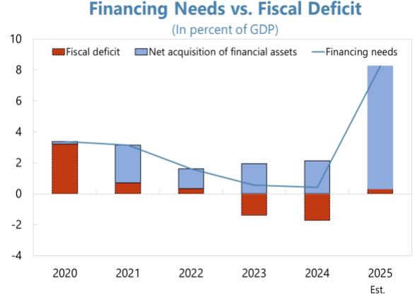  
Sources: Country authorities; and IMF staff estimates.

Total public debt grew in line with nominal GDP.  
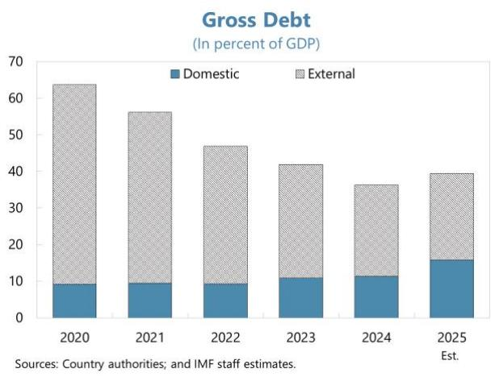

## Figure 4. Kyrgyz Republic: Financial Soundness Indicators

Kyrgyz banks are well capitalized...  
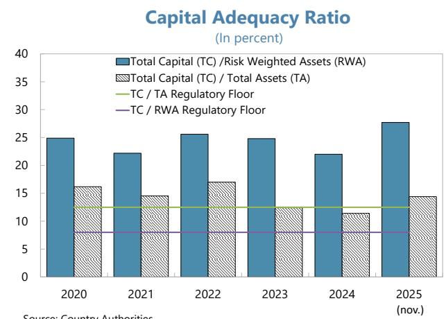  
Profitability remains strong...

...and liquid.

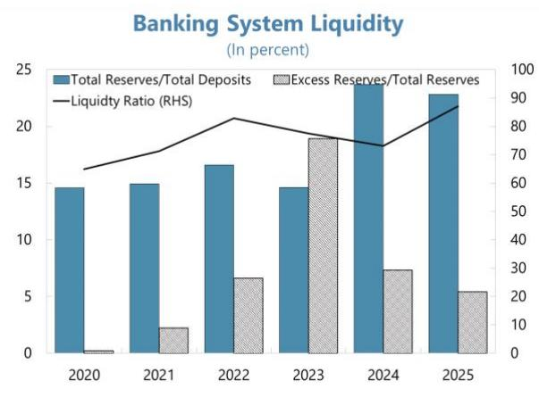  
...but NPLs are elevated.

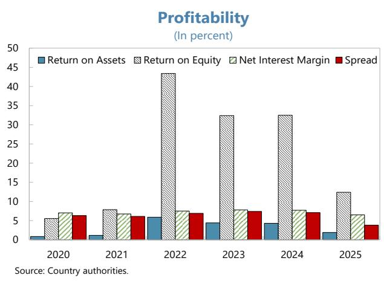  
Key indicators of banking income remained stable...

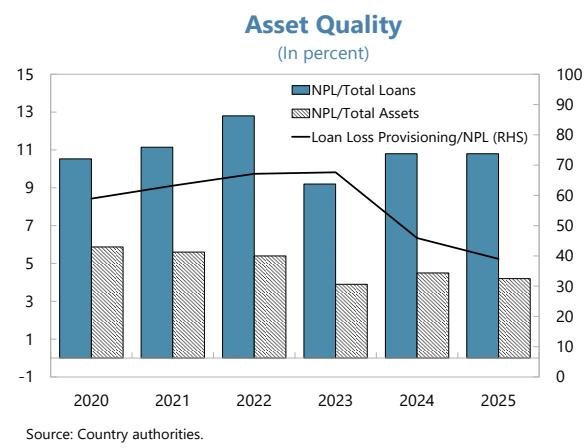  
...while FX exposure stayed at a 10-year low.

Spread and Net Interest Margin  
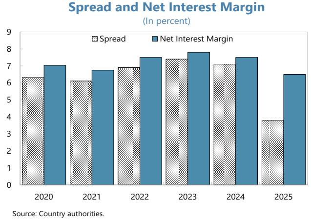

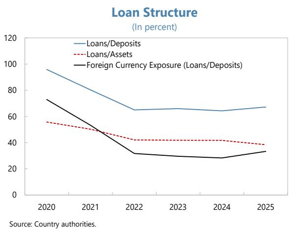

<table><tr><td colspan="10">I. Social and Demographic Indicators</td></tr><tr><td>Population (in millions, 2024)</td><td>7.3</td><td></td><td></td><td colspan="5">Gini coefficient (2023)</td><td>0.26</td></tr><tr><td>Unemployment rate (2024)</td><td>3.7</td><td></td><td></td><td colspan="5">Life expectancy at birth in years (2025)</td><td>72.1</td></tr><tr><td>Poverty rate (in percent, national definition, 2024)</td><td>25.7</td><td></td><td></td><td colspan="5">Adult literacy rate (percent of popul., 2025)</td><td>99.6</td></tr><tr><td>Per capita GDP (in million U.S. dollars, World Bank, 2024)</td><td>2,420</td><td></td><td></td><td colspan="5">Under-five mortality (per 1000 live births, 2025, est.)</td><td>12.6</td></tr><tr><td colspan="10">II. Economic Indicators</td></tr><tr><td rowspan="2"></td><td rowspan="2">2023</td><td rowspan="2">2024</td><td>2025</td><td>2026</td><td>2027</td><td>2028</td><td>2029</td><td>2030</td><td>2031</td></tr><tr><td>Est.</td><td colspan="6">Proj.</td></tr><tr><td colspan="10">Real sector</td></tr><tr><td>Nominal GDP (in billions of soms)</td><td>1,334</td><td>1,583</td><td>1,976</td><td>2,342</td><td>2,761</td><td>3,204</td><td>3,645</td><td>4,108</td><td>4,607</td></tr><tr><td>Nominal GDP (in millions of U.S. dollars)</td><td>15,187</td><td>18,175</td><td>22,625</td><td>25,817</td><td>28,298</td><td>30,731</td><td>33,101</td><td>35,419</td><td>37,597</td></tr><tr><td>Real GDP (growth in percent)</td><td>9.0</td><td>11.5</td><td>11.1</td><td>6.1</td><td>5.8</td><td>6.1</td><td>5.4</td><td>5.3</td><td>5.2</td></tr><tr><td>GDP per capita (in U.S. dollars)</td><td>2,191</td><td>2,568</td><td>3,131</td><td>3,502</td><td>3,759</td><td>3,998</td><td>4,222</td><td>4,424</td><td>4,599</td></tr><tr><td>Consumer prices (12-month percent change, eop)</td><td>7.3</td><td>6.3</td><td>9.4</td><td>12.5</td><td>10.5</td><td>8.5</td><td>7.5</td><td>6.5</td><td>6.5</td></tr><tr><td>Consumer prices (12-month percent change, average)</td><td>10.8</td><td>5.0</td><td>8.2</td><td>11.7</td><td>11.4</td><td>9.4</td><td>7.9</td><td>7.0</td><td>6.5</td></tr><tr><td colspan="10">General government finances (in percent of GDP) 1/</td></tr><tr><td>Revenue</td><td>34.5</td><td>34.5</td><td>38.5</td><td>33.4</td><td>31.4</td><td>31.2</td><td>31.1</td><td>30.8</td><td>30.6</td></tr><tr><td>Of which: Tax revenue</td><td>21.9</td><td>21.7</td><td>23.0</td><td>22.6</td><td>22.6</td><td>22.6</td><td>22.7</td><td>22.6</td><td>22.5</td></tr><tr><td>Expense</td><td>26.1</td><td>25.7</td><td>26.3</td><td>27.5</td><td>25.6</td><td>25.3</td><td>25.3</td><td>25.4</td><td>25.3</td></tr><tr><td>Gross operating balance</td><td>8.4</td><td>8.8</td><td>12.2</td><td>5.8</td><td>5.8</td><td>6.0</td><td>5.9</td><td>5.4</td><td>5.4</td></tr><tr><td>Net acquisition of nonfinancial assets</td><td>6.8</td><td>6.9</td><td>9.6</td><td>9.7</td><td>9.3</td><td>9.5</td><td>8.9</td><td>8.2</td><td>8.1</td></tr><tr><td>Overall balance (net lending/borrowing) 2/</td><td>1.6</td><td>2.0</td><td>2.6</td><td>-3.8</td><td>-3.5</td><td>-3.6</td><td>-3.1</td><td>-2.8</td><td>-2.8</td></tr><tr><td>Net lending/borrowing excluding CKU railways</td><td>1.6</td><td>2.0</td><td>3.0</td><td>-2.6</td><td>-2.5</td><td>-2.6</td><td>-2.5</td><td>-2.8</td><td>-2.8</td></tr><tr><td>Primary net lending/borrowing</td><td>2.6</td><td>3.1</td><td>3.7</td><td>-2.8</td><td>-1.9</td><td>-1.7</td><td>-1.0</td><td>-0.6</td><td>-0.4</td></tr><tr><td>Total government debt 3/</td><td>42.0</td><td>36.2</td><td>39.4</td><td>41.4</td><td>40.6</td><td>40.5</td><td>40.4</td><td>40.6</td><td>40.8</td></tr><tr><td>Of which domestic debt</td><td>10.9</td><td>11.3</td><td>15.8</td><td>14.8</td><td>13.3</td><td>12.3</td><td>12.6</td><td>16.0</td><td>18.5</td></tr><tr><td colspan="10">Monetary sector</td></tr><tr><td>Reserve money (percent change, eop)</td><td>9.9</td><td>17.5</td><td>29.7</td><td>17.2</td><td>17.2</td><td></td><td></td><td></td><td></td></tr><tr><td>Broad money (percent change, eop)</td><td>15.0</td><td>31.9</td><td>43.3</td><td>36.4</td><td>19.2</td><td></td><td></td><td></td><td></td></tr><tr><td>Credit to private sector (percent change, eop)</td><td>25.9</td><td>33.9</td><td>49.0</td><td>27.8</td><td>26.5</td><td></td><td></td><td></td><td></td></tr><tr><td>Credit to private sector (in percent of GDP)</td><td>19.8</td><td>22.4</td><td>26.7</td><td>28.8</td><td>30.9</td><td></td><td></td><td></td><td></td></tr><tr><td>Velocity of broad money 4/</td><td>2.6</td><td>2.4</td><td>2.0</td><td>1.8</td><td>1.8</td><td></td><td></td><td></td><td></td></tr><tr><td>Policy Rate 5/</td><td>13.0</td><td>9.0</td><td>11.0</td><td>...</td><td>...</td><td></td><td></td><td></td><td></td></tr><tr><td colspan="10">External sector</td></tr><tr><td>Current account balance (in percent of GDP)</td><td>-44.9</td><td>-22.6</td><td>-24.4</td><td>-7.3</td><td>-7.0</td><td>-6.2</td><td>-5.7</td><td>-5.4</td><td>-5.3</td></tr><tr><td>Export of goods and services (in millions of U.S. dollars)</td><td>5,522</td><td>8,459</td><td>7,229</td><td>12,319</td><td>13,263</td><td>14,503</td><td>15,615</td><td>16,680</td><td>17,718</td></tr><tr><td>Export growth (percent change)</td><td>52.0</td><td>53.2</td><td>-14.5</td><td>70.4</td><td>7.7</td><td>9.4</td><td>7.7</td><td>6.8</td><td>6.2</td></tr><tr><td>Import of goods and services (in millions of U.S. dollars)</td><td>14,461</td><td>15,105</td><td>15,563</td><td>17,299</td><td>18,528</td><td>19,969</td><td>21,315</td><td>22,814</td><td>24,282</td></tr><tr><td>Import growth (percent change)</td><td>35.6</td><td>4.5</td><td>3.0</td><td>11.2</td><td>7.1</td><td>7.8</td><td>6.7</td><td>7.0</td><td>6.4</td></tr><tr><td>Gross International reserves (in millions of U.S. dollars) 6/</td><td>3,044</td><td>4,923</td><td>8,698</td><td>9,246</td><td>8,904</td><td>8,826</td><td>8,636</td><td>7,654</td><td>6,926</td></tr><tr><td>Gross reserves (months of next year imports, eop)</td><td>2.4</td><td>3.8</td><td>6.0</td><td>6.0</td><td>5.4</td><td>5.0</td><td>4.5</td><td>3.8</td><td>3.2</td></tr><tr><td>Gross reserves (months of next year imports adjusted for re-exports, eop)</td><td>2.4</td><td>4.0</td><td>7.3</td><td>7.3</td><td>6.5</td><td>6.1</td><td>5.5</td><td>4.6</td><td>3.9</td></tr><tr><td>External public debt outstanding (in percent of GDP)</td><td>31.1</td><td>24.9</td><td>23.6</td><td>26.6</td><td>27.4</td><td>28.2</td><td>27.8</td><td>24.6</td><td>22.3</td></tr><tr><td>External public debt service-to-export ratio (in percent) 7/</td><td>6.4</td><td>4.5</td><td>7.3</td><td>3.8</td><td>4.2</td><td>4.4</td><td>4.9</td><td>10.0</td><td>8.6</td></tr><tr><td colspan="10">Memorandum items:</td></tr><tr><td>Exchange rate (soms per U.S. dollar, average)</td><td>87.8</td><td>87.1</td><td>87.4</td><td></td><td></td><td></td><td></td><td></td><td></td></tr><tr><td>Real effective exchange rate (2010=100) (average)</td><td>116.1</td><td>121.6</td><td>127.7</td><td></td><td></td><td></td><td></td><td></td><td></td></tr><tr><td colspan="10">Table 2. Kyrgyz Republic: National Accounts, 2023-2031(In percent)</td></tr><tr><td rowspan="2"></td><td rowspan="2">2023</td><td rowspan="2">2024</td><td>2025</td><td>2026</td><td>2027</td><td>2028</td><td>2029</td><td>2030</td><td>2031</td></tr><tr><td>Est.</td><td colspan="6">Proj.</td></tr><tr><td colspan="10">(growth rate in real terms, in percent)</td></tr><tr><td>Agriculture, Hunting, Fishing,</td><td>0.6</td><td>6.2</td><td>2.2</td><td>3.0</td><td>3.0</td><td>3.0</td><td>3.0</td><td>3.0</td><td>3.0</td></tr><tr><td>Industry</td><td>4.8</td><td>9.3</td><td>10.7</td><td>5.9</td><td>8.7</td><td>13.0</td><td>9.2</td><td>6.4</td><td>3.6</td></tr><tr><td>Construction</td><td>22.7</td><td>28.7</td><td>21.1</td><td>10.0</td><td>10.0</td><td>16.0</td><td>12.0</td><td>12.0</td><td>12.0</td></tr><tr><td>Transport</td><td>7.7</td><td>4.1</td><td>11.7</td><td>11.0</td><td>11.0</td><td>10.3</td><td>10.3</td><td>10.3</td><td>10.3</td></tr><tr><td>Communication</td><td>11.3</td><td>4.6</td><td>5.8</td><td>5.0</td><td>5.0</td><td>4.8</td><td>4.8</td><td>4.8</td><td>4.8</td></tr><tr><td>Trade</td><td>16.2</td><td>19.0</td><td>20.9</td><td>10.5</td><td>7.5</td><td>4.0</td><td>4.0</td><td>4.0</td><td>4.0</td></tr><tr><td>Other</td><td>3.6</td><td>5.7</td><td>5.5</td><td>3.0</td><td>3.0</td><td>3.0</td><td>3.0</td><td>3.2</td><td>3.5</td></tr><tr><td>Net Taxes on Products</td><td>17.9</td><td>14.7</td><td>12.1</td><td>7.0</td><td>7.0</td><td>7.0</td><td>6.0</td><td>6.0</td><td>6.0</td></tr><tr><td>Gross Domestic Product</td><td>9.0</td><td>11.5</td><td>11.1</td><td>6.1</td><td>5.8</td><td>6.1</td><td>5.4</td><td>5.3</td><td>5.2</td></tr><tr><td>Gold 1/</td><td>-3.7</td><td>-15.4</td><td>-20.0</td><td>3.7</td><td>9.4</td><td>18.3</td><td>10.5</td><td>3.6</td><td>-2.2</td></tr><tr><td>Non-Gold GDP</td><td>11.0</td><td>12.5</td><td>12.4</td><td>6.2</td><td>5.7</td><td>5.7</td><td>5.2</td><td>5.4</td><td>5.5</td></tr><tr><td colspan="10">Memorandum items: (In billions of soms)</td></tr><tr><td>Gross Domestic Product</td><td>1,334</td><td>1,583</td><td>1,976</td><td>2,342</td><td>2,761</td><td>3,204</td><td>3,645</td><td>4,108</td><td>4,607</td></tr><tr><td>Gold 1/</td><td>76</td><td>85</td><td>128</td><td>196</td><td>238</td><td>305</td><td>356</td><td>388</td><td>401</td></tr><tr><td>Non-Gold GDP</td><td>1,257</td><td>1,497</td><td>1,848</td><td>2,147</td><td>2,522</td><td>2,899</td><td>3,290</td><td>3,720</td><td>4,206</td></tr><tr><td colspan="10">Sources: Kyrgyz authorities; and IMF staff estimates and projections.1/ Staff estimates.</td></tr></table>

Table 3. Kyrgyz Republic: Balance of Payments, 2023-2031 (In millions of U.S. dollars)

<table><tr><td rowspan="2"></td><td rowspan="2">2023</td><td rowspan="2">2024</td><td>2025</td><td>2026</td><td>2027</td><td>2028</td><td>2029</td><td>2030</td><td>2031</td></tr><tr><td>Est.</td><td colspan="6">Proj.</td></tr><tr><td>Current account balance</td><td>-6,822</td><td>-4,114</td><td>-5,526</td><td>-1,875</td><td>-1,990</td><td>-1,918</td><td>-1,894</td><td>-1,919</td><td>-1,981</td></tr><tr><td>Excluding transfers</td><td>-9,133</td><td>-6,886</td><td>-8,588</td><td>-5,203</td><td>-5,662</td><td>-5,976</td><td>-6,345</td><td>-6,792</td><td>-7,267</td></tr><tr><td>Trade balance</td><td>-8,287</td><td>-6,536</td><td>-8,434</td><td>-4,993</td><td>-5,103</td><td>-5,304</td><td>-5,469</td><td>-5,837</td><td>-6,279</td></tr><tr><td>Exports, fob 1/</td><td>3,385</td><td>5,142</td><td>3,789</td><td>8,595</td><td>9,458</td><td>10,532</td><td>11,483</td><td>12,326</td><td>13,146</td></tr><tr><td>CIS countries</td><td>1,610</td><td>2,057</td><td>2,421</td><td>4,314</td><td>4,671</td><td>4,937</td><td>5,275</td><td>5,789</td><td>6,632</td></tr><tr><td>CIS countries w/o Re-exports</td><td>1,610</td><td>2,057</td><td>1,471</td><td>1,266</td><td>1,318</td><td>1,366</td><td>1,455</td><td>1,663</td><td>2,196</td></tr><tr><td>Of which: Energy products</td><td>104</td><td>164</td><td>114</td><td>115</td><td>116</td><td>119</td><td>122</td><td>126</td><td>130</td></tr><tr><td>Re-exports to CIS Countries</td><td>0</td><td>0</td><td>950</td><td>3,048</td><td>3,353</td><td>3,571</td><td>3,821</td><td>4,126</td><td>4,436</td></tr><tr><td>Non-CIS countries</td><td>1,775</td><td>3,085</td><td>1,369</td><td>4,281</td><td>4,788</td><td>5,595</td><td>6,207</td><td>6,537</td><td>6,514</td></tr><tr><td>Of which: Gold</td><td>1,284</td><td>2,506</td><td>780</td><td>3,687</td><td>4,104</td><td>4,861</td><td>5,426</td><td>5,733</td><td>5,638</td></tr><tr><td>Imports, fob</td><td>11,672</td><td>11,678</td><td>12,223</td><td>13,589</td><td>14,561</td><td>15,835</td><td>16,951</td><td>18,163</td><td>19,425</td></tr><tr><td>CIS countries</td><td>3,563</td><td>4,142</td><td>4,475</td><td>4,604</td><td>4,873</td><td>5,076</td><td>5,273</td><td>5,699</td><td>5,887</td></tr><tr><td>Of which: Energy</td><td>890</td><td>1,261</td><td>1,906</td><td>1,836</td><td>1,727</td><td>1,677</td><td>1,620</td><td>1,659</td><td>1,687</td></tr><tr><td>Non-CIS countries</td><td>8,109</td><td>7,535</td><td>7,748</td><td>8,984</td><td>9,688</td><td>10,759</td><td>11,678</td><td>12,464</td><td>13,538</td></tr><tr><td>Services</td><td>-651</td><td>-110</td><td>99</td><td>14</td><td>-163</td><td>-162</td><td>-231</td><td>-297</td><td>-285</td></tr><tr><td>Receipts</td><td>2,137</td><td>3,318</td><td>3,439</td><td>3,724</td><td>3,804</td><td>3,971</td><td>4,133</td><td>4,354</td><td>4,572</td></tr><tr><td>Payments</td><td>-2,788</td><td>-3,428</td><td>-3,340</td><td>-3,710</td><td>-3,967</td><td>-4,133</td><td>-4,364</td><td>-4,652</td><td>-4,857</td></tr><tr><td>Income</td><td>-194</td><td>-240</td><td>-254</td><td>-223</td><td>-396</td><td>-509</td><td>-645</td><td>-658</td><td>-703</td></tr><tr><td>Interest payments</td><td>-98</td><td>-116</td><td>-99</td><td>-47</td><td>-193</td><td>-292</td><td>-383</td><td>-411</td><td>-410</td></tr><tr><td>Other net income</td><td>-96</td><td>-124</td><td>-154</td><td>-176</td><td>-203</td><td>-217</td><td>-263</td><td>-247</td><td>-293</td></tr><tr><td>Current Transfers (net)</td><td>2,311</td><td>2,772</td><td>3,062</td><td>3,327</td><td>3,671</td><td>4,058</td><td>4,451</td><td>4,872</td><td>5,286</td></tr><tr><td>Of which: Private</td><td>2,306</td><td>2,750</td><td>3,026</td><td>3,307</td><td>3,655</td><td>4,045</td><td>4,438</td><td>4,860</td><td>5,273</td></tr><tr><td>Capital Account</td><td>221</td><td>155</td><td>278</td><td>264</td><td>264</td><td>287</td><td>315</td><td>332</td><td>351</td></tr><tr><td>Official</td><td>191</td><td>147</td><td>194</td><td>163</td><td>143</td><td>142</td><td>141</td><td>139</td><td>137</td></tr><tr><td>Private</td><td>30</td><td>8</td><td>9</td><td>11</td><td>13</td><td>15</td><td>18</td><td>22</td><td>26</td></tr><tr><td>Financial account</td><td>158</td><td>1,215</td><td>1,098</td><td>1,697</td><td>1,236</td><td>1,522</td><td>1,410</td><td>616</td><td>902</td></tr><tr><td>Commercial banks</td><td>-217</td><td>-320</td><td>-175</td><td>-167</td><td>-158</td><td>-150</td><td>-143</td><td>-171</td><td>-206</td></tr><tr><td>Medium- and long-term loans (net)</td><td>249</td><td>632</td><td>1,032</td><td>1,357</td><td>951</td><td>988</td><td>616</td><td>-449</td><td>-274</td></tr><tr><td>Disbursement</td><td>788</td><td>1,578</td><td>1,745</td><td>2,085</td><td>1,667</td><td>1,749</td><td>1,464</td><td>1,322</td><td>1,416</td></tr><tr><td>Public</td><td>517</td><td>1,296</td><td>1,395</td><td>1,684</td><td>1,228</td><td>1,272</td><td>951</td><td>772</td><td>833</td></tr><tr><td>Private</td><td>270</td><td>282</td><td>351</td><td>400</td><td>439</td><td>477</td><td>513</td><td>549</td><td>583</td></tr><tr><td>Amortization</td><td>-538</td><td>-946</td><td>-713</td><td>-728</td><td>-717</td><td>-760</td><td>-848</td><td>-1,770</td><td>-1,690</td></tr><tr><td>Public</td><td>215</td><td>225</td><td>413</td><td>427</td><td>372</td><td>364</td><td>409</td><td>1,294</td><td>1,177</td></tr><tr><td>Private</td><td>323</td><td>721</td><td>300</td><td>301</td><td>344</td><td>397</td><td>439</td><td>476</td><td>513</td></tr><tr><td>Foreign direct investment</td><td>151</td><td>238</td><td>340</td><td>256</td><td>168</td><td>381</td><td>603</td><td>870</td><td>979</td></tr><tr><td>Portfolio investment</td><td>0</td><td>0</td><td>0</td><td>0</td><td>0</td><td>0</td><td>0</td><td>0</td><td>0</td></tr><tr><td>Other (including SDR allocation)</td><td>0</td><td>0</td><td>0</td><td>0</td><td>0</td><td>0</td><td>0</td><td>0</td><td>0</td></tr><tr><td>Net short-term flows</td><td>-26</td><td>665</td><td>-99</td><td>251</td><td>276</td><td>303</td><td>333</td><td>367</td><td>403</td></tr><tr><td>Errors and omissions 2/</td><td>6,450</td><td>2,978</td><td>3,892</td><td>0</td><td>0</td><td>0</td><td>0</td><td>0</td><td>0</td></tr><tr><td>Overall balance</td><td>6</td><td>234</td><td>-258</td><td>85</td><td>-491</td><td>-109</td><td>-169</td><td>-971</td><td>-728</td></tr><tr><td>Financing</td><td>-6</td><td>-234</td><td>258</td><td>-85</td><td>491</td><td>109</td><td>169</td><td>971</td><td>728</td></tr><tr><td>Net international reserves</td><td>-6</td><td>-234</td><td>258</td><td>-85</td><td>491</td><td>109</td><td>169</td><td>971</td><td>728</td></tr><tr><td>Gross official reserves (-, increase)</td><td>64</td><td>-139</td><td>-3,775</td><td>-549</td><td>342</td><td>78</td><td>190</td><td>983</td><td>728</td></tr><tr><td>IMF</td><td>-71</td><td>-95</td><td>-46</td><td>-29</td><td>-25</td><td>-20</td><td>-20</td><td>-12</td><td>0</td></tr><tr><td>Exceptional financing (including arrears)</td><td>0</td><td>2</td><td>0</td><td>0</td><td>0</td><td>0</td><td>0</td><td>0</td><td>0</td></tr><tr><td>Conversion of non-monetary gold into monetary gold 3/</td><td>0</td><td>0</td><td>4,079</td><td>493</td><td>175</td><td>51</td><td>0</td><td>0</td><td>0</td></tr><tr><td>Financing gap</td><td>0</td><td>0</td><td>0</td><td>0</td><td>0</td><td>0</td><td>0</td><td>0</td><td>0</td></tr><tr><td colspan="10">Memorandum items:</td></tr><tr><td>GDP (in millions of U.S. dollars)</td><td>15,187</td><td>18,175</td><td>22,625</td><td>25,817</td><td>28,298</td><td>30,731</td><td>33,101</td><td>35,419</td><td>37,597</td></tr><tr><td>Current account balance (percent of GDP)</td><td>-44.9</td><td>-22.6</td><td>-24.4</td><td>-7.3</td><td>-7.0</td><td>-6.2</td><td>-5.7</td><td>-5.4</td><td>-5.3</td></tr><tr><td>Current account balance excluding official transfers (percent of GDP)</td><td>-45.0</td><td>-22.8</td><td>-24.6</td><td>-7.3</td><td>-7.1</td><td>-6.3</td><td>-5.8</td><td>-5.5</td><td>-5.3</td></tr><tr><td>Growth of exports of GNFS (volume, percent)</td><td>60.1</td><td>44.2</td><td>-23.1</td><td>63.4</td><td>6.4</td><td>9.2</td><td>7.8</td><td>6.9</td><td>6.4</td></tr><tr><td>Growth of imports of GNFS (volume, percent)</td><td>46.3</td><td>3.2</td><td>4.3</td><td>6.6</td><td>7.2</td><td>7.0</td><td>5.5</td><td>5.8</td><td>5.2</td></tr><tr><td>Terms of trade (goods, percentage change)</td><td>4.6</td><td>1.0</td><td>6.1</td><td>-1.6</td><td>0.5</td><td>-0.6</td><td>-0.9</td><td>-1.0</td><td>-1.0</td></tr><tr><td>Gold price (U.S. dollars per ounce)</td><td>1,943</td><td>2,387</td><td>3,440</td><td>4,930</td><td>5,116</td><td>5,175</td><td>5,175</td><td>5,175</td><td>5,175</td></tr><tr><td>External Public Debt (in millions of U.S. dollars) 4/</td><td>4,653</td><td>4,535</td><td>5,345</td><td>6,622</td><td>7,473</td><td>8,411</td><td>8,982</td><td>8,478</td><td>8,154</td></tr><tr><td>As percent of GDP</td><td>31.1</td><td>25</td><td>24</td><td>27</td><td>27</td><td>28</td><td>28</td><td>25</td><td>22.3</td></tr><tr><td>External public debt service-to-exports ratio 4/ 5/</td><td>6.4</td><td>4.5</td><td>7.3</td><td>3.8</td><td>4.2</td><td>4.4</td><td>4.9</td><td>10.0</td><td>8.6</td></tr><tr><td>Gross reserves 6/</td><td>3,044</td><td>4,923</td><td>8,698</td><td>9,246</td><td>8,904</td><td>8,826</td><td>8,636</td><td>7,654</td><td>6,926</td></tr><tr><td>In months of subsequent year&#x27;s imports</td><td>2.4</td><td>3.8</td><td>6.0</td><td>6.0</td><td>5.4</td><td>5.0</td><td>4.5</td><td>3.8</td><td>3.2</td></tr><tr><td>In months of subsequent year&#x27;s imports (adjusted for re-exports)</td><td>2.4</td><td>4.0</td><td>7.3</td><td>7.3</td><td>6.5</td><td>6.1</td><td>5.5</td><td>4.6</td><td>3.9</td></tr></table>

Sources: Kyrgyz authorities; and IMF staff estimates and projections.  
1/ Total export number includes the staff assessed re-exports for the Q4 of 2025 and outer years.  
2/ Errors and omissions for 2025 reflect the actual figure for the first three quarters of the year.  
3/ This is the amount of increase in monetary gold holdings of NBKR resulting from the conversion of NM gold and also some purchases from domestic market.  
4/ Public and publicly-guaranteed debt.  
5/ Net of rescheduling.  
6/ Valued at end-period exchange rate. Gross international reserves exclude reserve assets in non-convertible currencies.

<table><tr><td rowspan="2"></td><td rowspan="2">2023</td><td rowspan="2">2024</td><td>2025</td><td>2026</td><td>2027</td></tr><tr><td>Est.</td><td colspan="2">Proj.</td></tr><tr><td colspan="6">(In millions of soms)</td></tr><tr><td>Net foreign assets</td><td>277,568</td><td>429,572</td><td>731,533</td><td>785,927</td><td>753,932</td></tr><tr><td>Net international reserves 1/</td><td>258,986</td><td>406,015</td><td>715,136</td><td>769,530</td><td>737,536</td></tr><tr><td>Long-term foreign liabilities</td><td>-10,205</td><td>-12,905</td><td>-20,456</td><td>-20,456</td><td>-20,456</td></tr><tr><td>Other foreign assets</td><td>28,787</td><td>36,462</td><td>36,852</td><td>36,852</td><td>36,852</td></tr><tr><td>Net domestic assets</td><td>-27,622</td><td>-135,925</td><td>-350,781</td><td>-339,836</td><td>-231,079</td></tr><tr><td>Net claims on general government</td><td>-32,076</td><td>-21,401</td><td>-44,099</td><td>-33,835</td><td>-23,571</td></tr><tr><td>Of which: Total government deposits (including foreign exchange deposits)</td><td>-42,492</td><td>-42,129</td><td>-64,696</td><td>-54,432</td><td>-44,168</td></tr><tr><td>Of which: Securitized government debt</td><td>10,416</td><td>20,727</td><td>20,596</td><td>20,596</td><td>20,596</td></tr><tr><td>Claims on commercial banks</td><td>-68,193</td><td>-73,122</td><td>-118,843</td><td>-171,987</td><td>-113,493</td></tr><tr><td>Of which: NBKR notes</td><td>-54,282</td><td>-1,107</td><td>-9,654</td><td>-8,203</td><td>-7,034</td></tr><tr><td>Claims of other financial corporations</td><td>-1,608</td><td>-2,575</td><td>-2,575</td><td>-2,575</td><td>-2,575</td></tr><tr><td>Other items net 2/</td><td>74,255</td><td>-38,827</td><td>-185,264</td><td>-131,440</td><td>-91,440</td></tr><tr><td>Reserve money</td><td>249,946</td><td>293,647</td><td>380,752</td><td>446,090</td><td>522,853</td></tr><tr><td>Currency in circulation</td><td>207,251</td><td>240,425</td><td>300,778</td><td>352,393</td><td>413,032</td></tr><tr><td>Commercial banks&#x27; reserves</td><td>42,695</td><td>53,222</td><td>79,974</td><td>93,698</td><td>109,821</td></tr><tr><td>Of which: Required reserves</td><td>32,022</td><td>44,123</td><td>56,158</td><td>84,422</td><td>99,059</td></tr><tr><td colspan="6">(Contribution to reserve money growth) 3/</td></tr><tr><td>Net foreign assets</td><td>23.7</td><td>60.8</td><td>102.8</td><td>14.3</td><td>-7.2</td></tr><tr><td>Net domestic assets</td><td>-13.8</td><td>-43.3</td><td>-73.2</td><td>2.9</td><td>24.4</td></tr><tr><td>Of which: Net claims on general government</td><td>-2.6</td><td>4.3</td><td>-7.7</td><td>2.7</td><td>2.3</td></tr><tr><td>Reserve money</td><td>9.9</td><td>17.5</td><td>29.7</td><td>17.2</td><td>17.2</td></tr><tr><td>Of which: Currency in circulation</td><td>3.7</td><td>13.3</td><td>20.6</td><td>13.6</td><td>13.6</td></tr><tr><td colspan="6">Memorandum items:</td></tr><tr><td>Gross International Reserves (in millions of U.S. dollars)</td><td>3,044</td><td>4,923</td><td>8,698</td><td>9,246</td><td>8,904</td></tr><tr><td>Exchange rate, som per U.S. dollar, end of period</td><td>89.1</td><td>87.0</td><td>87.4</td><td></td><td></td></tr><tr><td colspan="6">Sources: Kyrgyz authorities; and IMF staff estimates and projections.</td></tr><tr><td colspan="6">1/ Gross international reserves exclude reserve assets in non-convertible currencies.</td></tr><tr><td colspan="6">2/ Includes holdings of non-monetary gold.</td></tr><tr><td colspan="6">3/ Contribution is defined as change of asset stock relative to previous end-year reserve money stock (in percentage points).</td></tr></table>

Table 5. Kyrgyz Republic: Monetary Survey, 2023-2027

<table><tr><td rowspan="2"></td><td rowspan="2">2023</td><td rowspan="2">2024</td><td>2025</td><td>2026</td><td>2027</td></tr><tr><td>Est.</td><td colspan="2">Proj.</td></tr><tr><td colspan="6">(In millions of soms)</td></tr><tr><td>Net foreign assets</td><td>364,037</td><td>548,853</td><td>856,315</td><td>905,208</td><td>873,214</td></tr><tr><td>Net domestic assets</td><td>146,233</td><td>124,256</td><td>108,244</td><td>410,759</td><td>695,346</td></tr><tr><td>Domestic credit</td><td>219,438</td><td>322,986</td><td>547,714</td><td>780,227</td><td>1,004,814</td></tr><tr><td>Net claims on general government</td><td>-45,259</td><td>-31,543</td><td>19,515</td><td>105,452</td><td>151,031</td></tr><tr><td>Credit to the rest of the economy 1/</td><td>264,697</td><td>354,529</td><td>528,199</td><td>674,775</td><td>853,783</td></tr><tr><td>Of which: In foreign exchange</td><td>56,839</td><td>68,368</td><td>80,714</td><td>103,113</td><td>130,467</td></tr><tr><td>Other items net</td><td>-73,205</td><td>-198,730</td><td>-439,469</td><td>-369,468</td><td>-309,468</td></tr><tr><td>Broad money (M2X)</td><td>510,269</td><td>673,109</td><td>964,559</td><td>1,315,967</td><td>1,568,559</td></tr><tr><td>Of which:</td><td></td><td></td><td></td><td></td><td></td></tr><tr><td>Broad money, excluding foreign exchange deposits (M2)</td><td>373,629</td><td>489,407</td><td>753,469</td><td>1,027,004</td><td>1,222,032</td></tr><tr><td>Currency held by the public</td><td>178,765</td><td>205,866</td><td>260,659</td><td>352,393</td><td>413,032</td></tr><tr><td>Total domestic currency deposit liabilities</td><td>194,865</td><td>283,541</td><td>492,810</td><td>674,611</td><td>809,000</td></tr><tr><td colspan="6">(Contribution to broad money growth) 2/</td></tr><tr><td>Net foreign assets</td><td>15.9</td><td>36.2</td><td>45.7</td><td>5.1</td><td>-2.4</td></tr><tr><td>Net domestic assets</td><td>-0.9</td><td>-4.3</td><td>-2.4</td><td>31.4</td><td>21.6</td></tr><tr><td>Domestic credit</td><td>9.0</td><td>20.3</td><td>33.4</td><td>24.1</td><td>17.1</td></tr><tr><td>Net claims on general government</td><td>-3.2</td><td>2.7</td><td>7.6</td><td>8.9</td><td>3.5</td></tr><tr><td>Credit to the rest of the economy</td><td>12.3</td><td>17.6</td><td>25.8</td><td>15.2</td><td>13.6</td></tr><tr><td>Other items (net)</td><td>-9.9</td><td>-24.6</td><td>-35.8</td><td>7.3</td><td>4.6</td></tr><tr><td>Broad money (M2X)</td><td>15.0</td><td>31.9</td><td>43.3</td><td>36.4</td><td>19.2</td></tr><tr><td>Of which:</td><td></td><td></td><td></td><td></td><td></td></tr><tr><td>Broad money, excluding foreign exchange deposits (M2)</td><td>8.6</td><td>22.7</td><td>39.2</td><td>28.4</td><td>14.8</td></tr><tr><td>Currency held by the public</td><td>0.5</td><td>5.3</td><td>8.1</td><td>9.5</td><td>4.6</td></tr><tr><td>Total deposit liabilities</td><td>8.1</td><td>17.4</td><td>31.1</td><td>18.8</td><td>10.2</td></tr><tr><td>Memorandum items:</td><td></td><td></td><td></td><td></td><td></td></tr><tr><td>Broad money (M2X) (12-month change, in percent)</td><td>15.0</td><td>31.9</td><td>43.3</td><td>36.4</td><td>19.2</td></tr><tr><td>Credit to the rest of the economy (12-month change, in percent)</td><td>25.9</td><td>33.9</td><td>49.0</td><td>27.8</td><td>26.5</td></tr><tr><td>Credit to the rest of the economy (in percent of GDP)</td><td>19.8</td><td>22.4</td><td>26.7</td><td>28.8</td><td>30.9</td></tr><tr><td>M2X velocity 3/</td><td>2.6</td><td>2.4</td><td>2.0</td><td>1.8</td><td>1.8</td></tr><tr><td>M2X multiplier</td><td>2.0</td><td>2.3</td><td>2.5</td><td>3.0</td><td>3.0</td></tr></table>

Table 6. Kyrgyz Republic: State Government Finances, 2023-2031 1/

<table><tr><td rowspan="3"></td><td colspan="9">(in millions of soms)</td></tr><tr><td>2023</td><td>2024</td><td>2025</td><td>2026</td><td>2027</td><td>2028</td><td>2029</td><td>2030</td><td>2031</td></tr><tr><td></td><td></td><td>Est.</td><td></td><td></td><td>Proj.</td><td></td><td></td><td></td></tr><tr><td>Taxes</td><td>292,265</td><td>343,396</td><td>454,131</td><td>529,487</td><td>623,003</td><td>725,596</td><td>827,763</td><td>929,441</td><td>1,037,771</td></tr><tr><td>Taxes on income, profits, and capital gains</td><td>75,868</td><td>100,222</td><td>147,151</td><td>172,448</td><td>202,185</td><td>237,723</td><td>272,547</td><td>305,331</td><td>337,735</td></tr><tr><td>Payable by individuals</td><td>25,164</td><td>30,104</td><td>44,645</td><td>51,636</td><td>60,426</td><td>68,983</td><td>81,843</td><td>91,094</td><td>99,528</td></tr><tr><td>Payable by corporations and other enterprises</td><td>50,704</td><td>70,118</td><td>102,506</td><td>120,812</td><td>141,759</td><td>168,740</td><td>190,704</td><td>214,237</td><td>238,207</td></tr><tr><td>Taxes on property</td><td>3,929</td><td>4,664</td><td>3,463</td><td>4,104</td><td>4,837</td><td>5,613</td><td>6,387</td><td>7,198</td><td>8,072</td></tr><tr><td>Land tax</td><td>1,263</td><td>1,526</td><td>1,584</td><td>1,877</td><td>2,213</td><td>2,568</td><td>2,922</td><td>3,293</td><td>3,692</td></tr><tr><td>Property tax</td><td>2,666</td><td>3,137</td><td>1,879</td><td>2,227</td><td>2,624</td><td>3,045</td><td>3,465</td><td>3,905</td><td>4,379</td></tr><tr><td>Taxes on good and services</td><td>181,445</td><td>196,519</td><td>216,299</td><td>253,564</td><td>298,845</td><td>347,425</td><td>395,929</td><td>443,992</td><td>498,050</td></tr><tr><td>VAT</td><td>144,795</td><td>151,997</td><td>164,091</td><td>189,798</td><td>223,297</td><td>259,214</td><td>295,761</td><td>332,252</td><td>372,733</td></tr><tr><td>Turnover tax</td><td>19,225</td><td>25,103</td><td>29,506</td><td>36,162</td><td>42,618</td><td>49,466</td><td>56,286</td><td>63,461</td><td>71,160</td></tr><tr><td>Excises</td><td>17,425</td><td>19,418</td><td>22,702</td><td>27,604</td><td>32,930</td><td>38,745</td><td>43,882</td><td>48,279</td><td>54,156</td></tr><tr><td>Taxes on international Trade</td><td>28,356</td><td>41,984</td><td>87,218</td><td>99,370</td><td>117,135</td><td>134,835</td><td>152,899</td><td>172,919</td><td>193,913</td></tr><tr><td>Grants (including project grants)</td><td>16,189</td><td>14,096</td><td>18,269</td><td>14,815</td><td>13,561</td><td>14,067</td><td>14,744</td><td>15,324</td><td>15,875</td></tr><tr><td>Program grants</td><td>513</td><td>3,053</td><td>3,082</td><td>1,815</td><td>1,561</td><td>1,334</td><td>1,410</td><td>1,485</td><td>1,568</td></tr><tr><td>PIP grants</td><td>15,676</td><td>11,043</td><td>15,187</td><td>13,000</td><td>12,000</td><td>12,732</td><td>13,334</td><td>13,840</td><td>14,307</td></tr><tr><td>Other revenues</td><td>86,087</td><td>106,308</td><td>197,091</td><td>140,480</td><td>118,081</td><td>131,139</td><td>149,215</td><td>166,651</td><td>186,854</td></tr><tr><td>Expense</td><td>297,065</td><td>330,880</td><td>444,295</td><td>551,196</td><td>597,701</td><td>683,915</td><td>782,695</td><td>893,786</td><td>999,260</td></tr><tr><td>Compensation of Employees</td><td>134,414</td><td>138,072</td><td>156,723</td><td>235,004</td><td>277,714</td><td>309,265</td><td>352,383</td><td>398,126</td><td>444,105</td></tr><tr><td>Wages and salaries</td><td>119,575</td><td>123,056</td><td>140,343</td><td>210,441</td><td>248,687</td><td>276,941</td><td>315,552</td><td>356,515</td><td>397,688</td></tr><tr><td>Social Fund Contribution</td><td>14,839</td><td>15,016</td><td>16,381</td><td>24,562</td><td>29,026</td><td>32,324</td><td>36,831</td><td>41,612</td><td>46,417</td></tr><tr><td>Use of goods and services</td><td>43,871</td><td>72,455</td><td>81,139</td><td>97,788</td><td>112,511</td><td>136,191</td><td>152,520</td><td>173,256</td><td>190,128</td></tr><tr><td>Interest payments and financing fees</td><td>14,071</td><td>18,385</td><td>25,121</td><td>26,863</td><td>47,570</td><td>61,054</td><td>76,554</td><td>90,821</td><td>116,690</td></tr><tr><td>Domestic interest</td><td>7,569</td><td>11,641</td><td>16,599</td><td>16,300</td><td>21,796</td><td>24,020</td><td>28,025</td><td>37,162</td><td>61,977</td></tr><tr><td>Foreign interest and fees</td><td>6,502</td><td>6,744</td><td>8,522</td><td>10,563</td><td>25,774</td><td>37,035</td><td>48,528</td><td>53,658</td><td>54,713</td></tr><tr><td>Subsidies to public corporations</td><td>7,149</td><td>9,554</td><td>14,110</td><td>16,723</td><td>18,723</td><td>22,814</td><td>24,662</td><td>27,793</td><td>31,166</td></tr><tr><td>Grants</td><td>61,702</td><td>52,575</td><td>47,553</td><td>65,757</td><td>70,478</td><td>74,686</td><td>85,665</td><td>104,880</td><td>111,741</td></tr><tr><td>to international organizations</td><td>949</td><td>1,419</td><td>2,820</td><td>3,286</td><td>3,807</td><td>4,341</td><td>4,853</td><td>5,372</td><td>5,917</td></tr><tr><td>to other general government units</td><td>60,752</td><td>51,156</td><td>44,734</td><td>60,971</td><td>64,672</td><td>67,545</td><td>78,012</td><td>96,708</td><td>103,024</td></tr><tr><td>Social benefits</td><td>16,754</td><td>21,646</td><td>21,923</td><td>25,983</td><td>30,622</td><td>35,536</td><td>40,436</td><td>45,570</td><td>51,102</td></tr><tr><td>Other expense</td><td>19,104</td><td>18,192</td><td>97,725</td><td>83,079</td><td>40,082</td><td>44,367</td><td>50,476</td><td>53,340</td><td>54,329</td></tr><tr><td>o/w capital transfers to SOEs in the energy sector</td><td>10,000</td><td>11,000</td><td>2,892</td><td>8,500</td><td>8,500</td><td>8,700</td><td>9,570</td><td>10,527</td><td>11,580</td></tr><tr><td>Gross operating balance</td><td>97,476</td><td>132,920</td><td>225,196</td><td>133,585</td><td>156,944</td><td>186,887</td><td>209,026</td><td>217,630</td><td>241,240</td></tr><tr><td>Net acquisition of nonfinancial assets</td><td>90,524</td><td>109,357</td><td>187,219</td><td>223,530</td><td>254,033</td><td>301,226</td><td>320,227</td><td>331,353</td><td>368,008</td></tr><tr><td>Acquisition of nonfinancial assets</td><td>89,524</td><td>109,357</td><td>187,234</td><td>223,530</td><td>254,033</td><td>301,226</td><td>320,227</td><td>331,353</td><td>368,008</td></tr><tr><td>Domestically financed capital expenditure</td><td>65,240</td><td>77,920</td><td>129,354</td><td>149,039</td><td>175,684</td><td>203,865</td><td>231,920</td><td>261,232</td><td>293,271</td></tr><tr><td>Acquisition of Material Reserves</td><td>N.A.</td><td>2,278</td><td>17,238</td><td>0</td><td>0</td><td>0</td><td>0</td><td>0</td><td>0</td></tr><tr><td>Foreign loan financed PIP</td><td>11,741</td><td>16,064</td><td>16,148</td><td>27,301</td><td>37,078</td><td>44,975</td><td>45,230</td><td>48,172</td><td>41,906</td></tr><tr><td>Foreign grant financed PIP</td><td>12,543</td><td>10,817</td><td>15,108</td><td>11,894</td><td>10,980</td><td>11,678</td><td>12,240</td><td>12,669</td><td>13,104</td></tr><tr><td>Kambarata HPP-1</td><td>...</td><td>...</td><td>1,961</td><td>6,351</td><td>976</td><td>9,487</td><td>9,251</td><td>9,279</td><td>19,728</td></tr><tr><td>CKU railway</td><td>...</td><td>...</td><td>7,425</td><td>28,944</td><td>29,316</td><td>31,222</td><td>21,585</td><td>0</td><td>0</td></tr><tr><td>Net lending/borrowing (overall balance)</td><td>6,952</td><td>23,563</td><td>37,977</td><td>-89,945</td><td>-97,089</td><td>-114,339</td><td>-111,201</td><td>-113,723</td><td>-126,768</td></tr><tr><td>Net lending/borrowing excl. CKU railway</td><td>6,952</td><td>23,563</td><td>45,402</td><td>-61,001</td><td>-67,773</td><td>-83,117</td><td>-89,616</td><td>-113,723</td><td>-126,768</td></tr><tr><td>Net acquisition of financial assets</td><td>50,028</td><td>45,627</td><td>199,340</td><td>54,469</td><td>-7,508</td><td>-1,446</td><td>-2,997</td><td>13,141</td><td>28,882</td></tr><tr><td>Domestic</td><td>50,028</td><td>45,627</td><td>199,340</td><td>54,469</td><td>-7,508</td><td>-1,446</td><td>-2,997</td><td>13,141</td><td>28,882</td></tr><tr><td>Currency and deposits (NBKR) 2/</td><td>11,142</td><td>-363</td><td>22,567</td><td>-10,264</td><td>-10,264</td><td>-10,264</td><td>-17,664</td><td>-7,264</td><td>4,736</td></tr><tr><td>Loans</td><td>1,193</td><td>6,690</td><td>-3,660</td><td>-22,614</td><td>2,756</td><td>8,818</td><td>14,667</td><td>20,404</td><td>24,145</td></tr><tr><td>Shares and Equity (Privatization)</td><td>37,693</td><td>39,300</td><td>180,433</td><td>87,347</td><td>0</td><td>0</td><td>0</td><td>0</td><td>0</td></tr><tr><td>Foreign</td><td>0</td><td>0</td><td>0</td><td>0</td><td>0</td><td>0</td><td>0</td><td>0</td><td>0</td></tr><tr><td>Net financing needs</td><td>32,115</td><td>7,828</td><td>175,545</td><td>144,414</td><td>89,581</td><td>112,893</td><td>108,204</td><td>126,864</td><td>155,650</td></tr><tr><td>Foreign</td><td>14,147</td><td>-3,182</td><td>69,467</td><td>68,741</td><td>54,266</td><td>73,849</td><td>59,619</td><td>-60,534</td><td>19,105</td></tr><tr><td>Public investment program (PIP)</td><td>24,556</td><td>24,019</td><td>19,396</td><td>32,859</td><td>43,696</td><td>60,717</td><td>63,291</td><td>64,050</td><td>76,338</td></tr><tr><td>Disbursements (Program)</td><td>14,818</td><td>3,838</td><td>86,175</td><td>74,588</td><td>46,880</td><td>51,032</td><td>41,410</td><td>25,519</td><td>25,733</td></tr><tr><td>Total amortization</td><td>-25,227</td><td>-31,039</td><td>-36,103</td><td>-38,706</td><td>-36,309</td><td>-37,901</td><td>-45,081</td><td>-150,103</td><td>-82,966</td></tr><tr><td>Domestic</td><td>17,968</td><td>11,010</td><td>106,078</td><td>75,673</td><td>35,315</td><td>39,044</td><td>48,584</td><td>187,398</td><td>136,544</td></tr><tr><td>Net domestic debt issuance to banks</td><td>25,640</td><td>5,981</td><td>98,628</td><td>75,673</td><td>35,315</td><td>39,044</td><td>48,584</td><td>187,398</td><td>136,544</td></tr><tr><td>Net domestic debt issuance to the Social Fund</td><td>-7,672</td><td>5,029</td><td>7,450</td><td>0</td><td>0</td><td>0</td><td>0</td><td>0</td><td>0</td></tr><tr><td>Errors and Omissions</td><td>-10,962</td><td>-14,236</td><td>14,182</td><td>0</td><td>0</td><td>0</td><td>0</td><td>0</td><td>0</td></tr></table>

1/ The State government comprises central and local governments.  
2/ Includes changes in balances of the Stabilization Fund; expenditures and some revenue of the Stabilization Fund are outside the fiscal perimeter.

Table 7. Kyrgyz Republic: State Government Finances, 2023-2031 1/

<table><tr><td rowspan="3"></td><td colspan="9">(in percent of GDP)</td></tr><tr><td>2023</td><td>2024</td><td>2025</td><td>2026</td><td>2027</td><td>2028</td><td>2029</td><td>2030</td><td>2031</td></tr><tr><td></td><td></td><td>Est.</td><td></td><td></td><td>Proj.</td><td></td><td></td><td></td></tr><tr><td>Revenues</td><td>29.6</td><td>29.3</td><td>33.9</td><td>29.2</td><td>27.3</td><td>27.2</td><td>27.2</td><td>27.1</td><td>26.9</td></tr><tr><td>Taxes</td><td>21.9</td><td>21.7</td><td>23.0</td><td>22.6</td><td>22.6</td><td>22.6</td><td>22.7</td><td>22.6</td><td>22.5</td></tr><tr><td>Taxes on income, profits, and capital gains</td><td>5.7</td><td>6.3</td><td>7.4</td><td>7.4</td><td>7.3</td><td>7.4</td><td>7.5</td><td>7.4</td><td>7.3</td></tr><tr><td>Payable by individuals</td><td>1.9</td><td>1.9</td><td>2.3</td><td>2.2</td><td>2.2</td><td>2.2</td><td>2.2</td><td>2.2</td><td>2.2</td></tr><tr><td>Payable by corporations and other enterprises</td><td>3.8</td><td>4.4</td><td>5.2</td><td>5.2</td><td>5.1</td><td>5.3</td><td>5.2</td><td>5.2</td><td>5.2</td></tr><tr><td>Taxes on property</td><td>0.3</td><td>0.3</td><td>0.2</td><td>0.2</td><td>0.2</td><td>0.2</td><td>0.2</td><td>0.2</td><td>0.2</td></tr><tr><td>Land tax</td><td>0.1</td><td>0.1</td><td>0.1</td><td>0.1</td><td>0.1</td><td>0.1</td><td>0.1</td><td>0.1</td><td>0.1</td></tr><tr><td>Property tax</td><td>0.2</td><td>0.2</td><td>0.1</td><td>0.1</td><td>0.1</td><td>0.1</td><td>0.1</td><td>0.1</td><td>0.1</td></tr><tr><td>Taxes on good and services</td><td>13.6</td><td>12.4</td><td>10.9</td><td>10.8</td><td>10.8</td><td>10.8</td><td>10.9</td><td>10.8</td><td>10.8</td></tr><tr><td>VAT</td><td>10.9</td><td>9.6</td><td>8.3</td><td>8.1</td><td>8.1</td><td>8.1</td><td>8.1</td><td>8.1</td><td>8.1</td></tr><tr><td>Turnover tax</td><td>1.4</td><td>1.6</td><td>1.5</td><td>1.5</td><td>1.5</td><td>1.5</td><td>1.5</td><td>1.5</td><td>1.5</td></tr><tr><td>Excises</td><td>1.3</td><td>1.2</td><td>1.1</td><td>1.2</td><td>1.2</td><td>1.2</td><td>1.2</td><td>1.2</td><td>1.2</td></tr><tr><td>Taxes on international Trade</td><td>2.1</td><td>2.7</td><td>4.4</td><td>4.2</td><td>4.2</td><td>4.2</td><td>4.2</td><td>4.2</td><td>4.2</td></tr><tr><td>Grants (including project grants)</td><td>1.2</td><td>0.9</td><td>0.9</td><td>0.6</td><td>0.5</td><td>0.4</td><td>0.4</td><td>0.4</td><td>0.3</td></tr><tr><td>Program grants</td><td>0.0</td><td>0.2</td><td>0.2</td><td>0.1</td><td>0.1</td><td>0.0</td><td>0.0</td><td>0.0</td><td>0.0</td></tr><tr><td>PIP grants</td><td>1.2</td><td>0.7</td><td>0.8</td><td>0.6</td><td>0.4</td><td>0.4</td><td>0.4</td><td>0.3</td><td>0.3</td></tr><tr><td>Other revenues</td><td>6.5</td><td>6.7</td><td>10.0</td><td>6.0</td><td>4.3</td><td>4.1</td><td>4.1</td><td>4.1</td><td>4.1</td></tr><tr><td>Expense</td><td>22.3</td><td>20.9</td><td>22.5</td><td>23.5</td><td>21.7</td><td>21.3</td><td>21.5</td><td>21.8</td><td>21.7</td></tr><tr><td>Compensation of Employees</td><td>10.1</td><td>8.7</td><td>7.9</td><td>10.0</td><td>10.1</td><td>9.7</td><td>9.7</td><td>9.7</td><td>9.6</td></tr><tr><td>Wages and salaries</td><td>9.0</td><td>7.8</td><td>7.1</td><td>9.0</td><td>9.0</td><td>8.6</td><td>8.7</td><td>8.7</td><td>8.6</td></tr><tr><td>Social Fund Contribution</td><td>1.1</td><td>0.9</td><td>0.8</td><td>1.0</td><td>1.1</td><td>1.0</td><td>1.0</td><td>1.0</td><td>1.0</td></tr><tr><td>Use of goods and services</td><td>3.3</td><td>4.6</td><td>4.1</td><td>4.2</td><td>4.1</td><td>4.3</td><td>4.2</td><td>4.2</td><td>4.1</td></tr><tr><td>Interest payments and financing fees</td><td>1.1</td><td>1.2</td><td>1.3</td><td>1.1</td><td>1.7</td><td>1.9</td><td>2.1</td><td>2.2</td><td>2.5</td></tr><tr><td>Domestic interest</td><td>0.6</td><td>0.7</td><td>0.8</td><td>0.7</td><td>0.8</td><td>0.7</td><td>0.8</td><td>0.9</td><td>1.3</td></tr><tr><td>Foreign interest and fees</td><td>0.5</td><td>0.4</td><td>0.4</td><td>0.5</td><td>0.9</td><td>1.2</td><td>1.3</td><td>1.3</td><td>1.2</td></tr><tr><td>Subsidies to public corporations</td><td>0.5</td><td>0.6</td><td>0.7</td><td>0.7</td><td>0.7</td><td>0.7</td><td>0.7</td><td>0.7</td><td>0.7</td></tr><tr><td>Grants</td><td>4.6</td><td>3.3</td><td>2.4</td><td>2.8</td><td>2.6</td><td>2.3</td><td>2.3</td><td>2.6</td><td>2.4</td></tr><tr><td>to international organizations</td><td>0.1</td><td>0.1</td><td>0.1</td><td>0.1</td><td>0.1</td><td>0.1</td><td>0.1</td><td>0.1</td><td>0.1</td></tr><tr><td>to other general government units</td><td>4.6</td><td>3.2</td><td>2.3</td><td>2.6</td><td>2.3</td><td>2.1</td><td>2.1</td><td>2.4</td><td>2.2</td></tr><tr><td>Social Benefits</td><td>1.3</td><td>1.4</td><td>1.1</td><td>1.1</td><td>1.1</td><td>1.1</td><td>1.1</td><td>1.1</td><td>1.1</td></tr><tr><td>Other expense</td><td>1.4</td><td>1.1</td><td>4.9</td><td>3.5</td><td>1.5</td><td>1.4</td><td>1.4</td><td>1.3</td><td>1.2</td></tr><tr><td>o/w capital transfers to SOEs in the energy sector</td><td>0.7</td><td>0.7</td><td>0.1</td><td>0.4</td><td>0.3</td><td>0.3</td><td>0.3</td><td>0.3</td><td>0.3</td></tr><tr><td>Gross operating balance</td><td>7.3</td><td>8.4</td><td>11.4</td><td>5.7</td><td>5.7</td><td>5.8</td><td>5.7</td><td>5.3</td><td>5.2</td></tr><tr><td>Net acquisition of nonfinancial assets</td><td>6.8</td><td>6.9</td><td>9.5</td><td>9.5</td><td>9.2</td><td>9.4</td><td>8.8</td><td>8.1</td><td>8.0</td></tr><tr><td>Acquisition of nonfinancial assets</td><td>6.7</td><td>6.9</td><td>9.5</td><td>9.5</td><td>9.2</td><td>9.4</td><td>8.8</td><td>8.1</td><td>8.0</td></tr><tr><td>Domestically financed capital expenditure</td><td>4.9</td><td>4.9</td><td>6.5</td><td>6.4</td><td>6.4</td><td>6.4</td><td>6.4</td><td>6.4</td><td>6.4</td></tr><tr><td>Foreign loan financed PIP</td><td>0.9</td><td>1.0</td><td>0.8</td><td>1.2</td><td>1.3</td><td>1.4</td><td>1.2</td><td>1.2</td><td>0.9</td></tr><tr><td>Foreign grant financed PIP</td><td>0.9</td><td>0.7</td><td>0.8</td><td>0.5</td><td>0.4</td><td>0.4</td><td>0.3</td><td>0.3</td><td>0.3</td></tr><tr><td>Kambarata HPP-1</td><td>...</td><td>...</td><td>0.1</td><td>0.3</td><td>0.0</td><td>0.3</td><td>0.3</td><td>0.2</td><td>0.4</td></tr><tr><td>CKU railway</td><td>...</td><td>...</td><td>0.4</td><td>1.2</td><td>1.1</td><td>1.0</td><td>0.6</td><td>0.0</td><td>0.0</td></tr><tr><td>Net lending/borrowing (overall balance)</td><td>0.5</td><td>1.5</td><td>1.9</td><td>-3.8</td><td>-3.5</td><td>-3.6</td><td>-3.1</td><td>-2.8</td><td>-2.8</td></tr><tr><td>Net lending/borrowing excl. CKU railway</td><td>0.5</td><td>1.5</td><td>2.3</td><td>-2.6</td><td>-2.5</td><td>-2.6</td><td>-2.5</td><td>-2.8</td><td>-2.8</td></tr><tr><td>Net acquisition of financial assets</td><td>3.8</td><td>2.9</td><td>10.1</td><td>2.3</td><td>-0.3</td><td>0.0</td><td>-0.1</td><td>0.3</td><td>0.6</td></tr><tr><td>Domestic</td><td>3.8</td><td>2.9</td><td>10.1</td><td>2.3</td><td>-0.3</td><td>0.0</td><td>-0.1</td><td>0.3</td><td>0.6</td></tr><tr><td>Currency and deposits (NBKR) 2/</td><td>0.8</td><td>0.0</td><td>1.1</td><td>-0.4</td><td>-0.4</td><td>-0.3</td><td>-0.5</td><td>-0.2</td><td>0.1</td></tr><tr><td>Loans</td><td>0.1</td><td>0.4</td><td>-0.2</td><td>-1.0</td><td>0.1</td><td>0.3</td><td>0.4</td><td>0.5</td><td>0.5</td></tr><tr><td>Shares and Equity (Privatization)</td><td>2.8</td><td>2.5</td><td>9.1</td><td>3.7</td><td>0.0</td><td>0.0</td><td>0.0</td><td>0.0</td><td>0.0</td></tr><tr><td>Foreign</td><td>0.0</td><td>0.0</td><td>0.0</td><td>0.0</td><td>0.0</td><td>0.0</td><td>0.0</td><td>0.0</td><td>0.0</td></tr><tr><td>Net financing needs</td><td>2.4</td><td>0.5</td><td>8.9</td><td>6.2</td><td>3.2</td><td>3.5</td><td>3.0</td><td>3.1</td><td>3.4</td></tr><tr><td>Foreign</td><td>1.1</td><td>-0.2</td><td>3.5</td><td>2.9</td><td>2.0</td><td>2.3</td><td>1.6</td><td>-1.5</td><td>0.4</td></tr><tr><td>Public investment program (PIP)</td><td>1.8</td><td>1.5</td><td>1.0</td><td>1.4</td><td>1.6</td><td>1.9</td><td>1.7</td><td>1.6</td><td>1.7</td></tr><tr><td>Disbursements (Program)</td><td>1.1</td><td>0.2</td><td>4.4</td><td>3.2</td><td>1.7</td><td>1.6</td><td>1.1</td><td>0.6</td><td>0.6</td></tr><tr><td>Total amortization</td><td>-1.9</td><td>-2.0</td><td>-1.8</td><td>-1.7</td><td>-1.3</td><td>-1.2</td><td>-1.2</td><td>-3.7</td><td>-1.8</td></tr><tr><td>Domestic</td><td>1.3</td><td>0.7</td><td>5.4</td><td>3.2</td><td>1.3</td><td>1.2</td><td>1.3</td><td>4.6</td><td>3.0</td></tr><tr><td>Net domestic debt issuance to banks</td><td>1.9</td><td>0.4</td><td>5.0</td><td>3.2</td><td>1.3</td><td>1.2</td><td>1.3</td><td>4.6</td><td>3.0</td></tr><tr><td>Net domestic debt issuance to the Social Fund</td><td>-0.6</td><td>0.3</td><td>0.4</td><td>0.0</td><td>0.0</td><td>0.0</td><td>0.0</td><td>0.0</td><td>0.0</td></tr><tr><td>Errors and Omissions</td><td>-0.8</td><td>-0.9</td><td>0.7</td><td>0.0</td><td>0.0</td><td>0.0</td><td>0.0</td><td>0.0</td><td>0.0</td></tr></table>

Table 8. Kyrgyz Republic: General Government Finance, 2023-2031, GFSM 2014 Presentation 1/ (in millions of soms)

<table><tr><td rowspan="2"></td><td rowspan="2">2023</td><td rowspan="2">2024</td><td>2025</td><td>2026</td><td>2027</td><td>2028</td><td>2029</td><td>2030</td><td>2031</td></tr><tr><td>Est.</td><td colspan="6">Proj.</td></tr><tr><td>Revenues</td><td>459,904</td><td>546,690</td><td>760,307</td><td>781,382</td><td>867,775</td><td>1,000,352</td><td>1,135,321</td><td>1,266,241</td><td>1,410,028</td></tr><tr><td>Taxes</td><td>292,265</td><td>343,396</td><td>454,131</td><td>529,487</td><td>623,003</td><td>725,596</td><td>827,763</td><td>929,441</td><td>1,037,771</td></tr><tr><td>Taxes on income, profits, and capital gains</td><td>75,868</td><td>100,222</td><td>147,151</td><td>172,448</td><td>202,185</td><td>237,723</td><td>272,547</td><td>305,331</td><td>337,735</td></tr><tr><td>Payable by individuals</td><td>25,164</td><td>30,104</td><td>44,645</td><td>51,636</td><td>60,426</td><td>68,983</td><td>81,843</td><td>91,094</td><td>99,528</td></tr><tr><td>Payable by corporations and other enterprises</td><td>50,704</td><td>70,118</td><td>102,506</td><td>120,812</td><td>141,759</td><td>168,740</td><td>190,704</td><td>214,237</td><td>238,207</td></tr><tr><td>Taxes on property</td><td>3,929</td><td>4,664</td><td>3,463</td><td>4,104</td><td>4,837</td><td>5,613</td><td>6,387</td><td>7,198</td><td>8,072</td></tr><tr><td>Taxes on goods and services</td><td>181,445</td><td>196,519</td><td>216,299</td><td>253,564</td><td>298,845</td><td>347,425</td><td>395,929</td><td>443,992</td><td>498,050</td></tr><tr><td>Value-added taxes</td><td>144,795</td><td>151,997</td><td>164,091</td><td>189,798</td><td>223,297</td><td>259,214</td><td>295,761</td><td>332,252</td><td>372,733</td></tr><tr><td>Turnover and other general taxes on goods and services</td><td>19,225</td><td>25,103</td><td>29,506</td><td>36,162</td><td>42,618</td><td>49,466</td><td>56,286</td><td>63,461</td><td>71,160</td></tr><tr><td>Excises</td><td>17,425</td><td>19,418</td><td>22,702</td><td>27,604</td><td>32,930</td><td>38,745</td><td>43,882</td><td>48,279</td><td>54,156</td></tr><tr><td>Taxes on international trade and transactions</td><td>28,356</td><td>41,984</td><td>87,218</td><td>99,370</td><td>117,135</td><td>134,835</td><td>152,899</td><td>172,919</td><td>193,913</td></tr><tr><td>Social contributions</td><td>63,962</td><td>74,266</td><td>83,733</td><td>89,524</td><td>105,020</td><td>119,979</td><td>132,743</td><td>143,107</td><td>158,373</td></tr><tr><td>Grants</td><td>16,189</td><td>14,096</td><td>18,269</td><td>14,815</td><td>13,561</td><td>14,067</td><td>14,744</td><td>15,324</td><td>15,875</td></tr><tr><td>Program grants</td><td>513</td><td>3,053</td><td>3,082</td><td>1,815</td><td>1,561</td><td>1,334</td><td>1,410</td><td>1,485</td><td>1,568</td></tr><tr><td>Project grants</td><td>15,676</td><td>11,043</td><td>15,187</td><td>13,000</td><td>12,000</td><td>12,732</td><td>13,334</td><td>13,840</td><td>14,307</td></tr><tr><td>Other revenue</td><td>87,488</td><td>114,932</td><td>204,159</td><td>147,557</td><td>126,191</td><td>140,709</td><td>160,072</td><td>178,369</td><td>198,009</td></tr><tr><td>Expense</td><td>347,515</td><td>406,689</td><td>518,962</td><td>644,655</td><td>707,284</td><td>809,543</td><td>921,888</td><td>1,043,596</td><td>1,163,319</td></tr><tr><td>Compensation of employees</td><td>146,693</td><td>148,252</td><td>159,188</td><td>236,822</td><td>279,857</td><td>311,752</td><td>355,213</td><td>401,316</td><td>447,681</td></tr><tr><td>Wages and salaries</td><td>130,085</td><td>131,788</td><td>142,471</td><td>212,004</td><td>250,529</td><td>279,078</td><td>317,984</td><td>359,255</td><td>400,761</td></tr><tr><td>Social contributions</td><td>16,607</td><td>16,464</td><td>16,717</td><td>24,818</td><td>29,328</td><td>32,674</td><td>37,229</td><td>42,061</td><td>46,921</td></tr><tr><td>Purchases/use of goods and services</td><td>51,984</td><td>80,720</td><td>86,805</td><td>103,447</td><td>119,180</td><td>143,931</td><td>161,326</td><td>183,181</td><td>201,257</td></tr><tr><td>Interest payments and fees</td><td>14,071</td><td>18,385</td><td>21,802</td><td>25,233</td><td>45,391</td><td>58,652</td><td>73,751</td><td>87,105</td><td>110,492</td></tr><tr><td>Foreign interest and fees</td><td>6,502</td><td>6,744</td><td>8,522</td><td>10,563</td><td>25,774</td><td>37,035</td><td>48,528</td><td>53,658</td><td>54,713</td></tr><tr><td>Domestic interest</td><td>7,569</td><td>11,641</td><td>13,280</td><td>14,670</td><td>19,616</td><td>21,618</td><td>25,223</td><td>33,446</td><td>55,779</td></tr><tr><td>Subsidies to public corporations</td><td>7,149</td><td>9,554</td><td>14,110</td><td>16,723</td><td>18,723</td><td>22,814</td><td>24,662</td><td>27,793</td><td>31,166</td></tr><tr><td>Grants</td><td>10,192</td><td>11,893</td><td>4,094</td><td>4,786</td><td>5,807</td><td>7,141</td><td>7,653</td><td>8,172</td><td>8,717</td></tr><tr><td>To international organizations</td><td>949</td><td>1,421</td><td>2,823</td><td>3,286</td><td>3,807</td><td>4,341</td><td>4,853</td><td>5,372</td><td>5,917</td></tr><tr><td>To other general government units</td><td>9,243</td><td>10,472</td><td>1,271</td><td>0</td><td>0</td><td>0</td><td>0</td><td>0</td><td>0</td></tr><tr><td>Social benefits</td><td>96,048</td><td>117,063</td><td>133,593</td><td>172,408</td><td>195,811</td><td>218,194</td><td>245,781</td><td>279,247</td><td>305,922</td></tr><tr><td>Other expense</td><td>21,377</td><td>20,823</td><td>99,371</td><td>85,237</td><td>42,516</td><td>47,058</td><td>53,501</td><td>56,783</td><td>58,083</td></tr><tr><td>o/w capital transfers to SOEs in the energy sector</td><td>10,000</td><td>11,000</td><td>2,892</td><td>8,500</td><td>8,500</td><td>8,700</td><td>9,570</td><td>10,527</td><td>11,580</td></tr><tr><td>Gross operating balance</td><td>112,388</td><td>140,001</td><td>241,345</td><td>136,728</td><td>160,490</td><td>190,808</td><td>213,433</td><td>222,645</td><td>246,710</td></tr><tr><td>Net acquisition of nonfinancial assets</td><td>91,226</td><td>109,130</td><td>189,616</td><td>226,673</td><td>257,579</td><td>305,147</td><td>324,634</td><td>336,369</td><td>373,478</td></tr><tr><td>Acquisition of nonfinancial assets</td><td>90,226</td><td>109,130</td><td>189,631</td><td>226,673</td><td>257,579</td><td>305,147</td><td>324,634</td><td>336,369</td><td>373,478</td></tr><tr><td>Domestically financed</td><td>66,942</td><td>79,971</td><td>131,751</td><td>152,182</td><td>179,229</td><td>207,785</td><td>236,328</td><td>266,248</td><td>298,740</td></tr><tr><td>Foreign financed</td><td>24,284</td><td>26,881</td><td>31,256</td><td>39,195</td><td>48,058</td><td>56,653</td><td>57,470</td><td>60,841</td><td>55,009</td></tr><tr><td>Kambarata HPP-1</td><td>...</td><td>...</td><td>1,961</td><td>6,351</td><td>976</td><td>9,487</td><td>9,251</td><td>9,279</td><td>19,728</td></tr><tr><td>CKU railway</td><td>...</td><td>...</td><td>7,425</td><td>28,944</td><td>29,316</td><td>31,222</td><td>21,585</td><td>0</td><td>0</td></tr><tr><td>Net lending/borrowing</td><td>21,162</td><td>30,870</td><td>51,729</td><td>-89,945</td><td>-97,089</td><td>-114,339</td><td>-111,201</td><td>-113,723</td><td>-126,768</td></tr><tr><td>Net lending/borrowing excl. CKU railway</td><td>21,162</td><td>30,870</td><td>59,155</td><td>-61,001</td><td>-67,773</td><td>-83,117</td><td>-89,616</td><td>-113,723</td><td>-126,768</td></tr><tr><td>Net acquisition of financial assets</td><td>65,851</td><td>58,270</td><td>213,839</td><td>54,469</td><td>-7,508</td><td>-1,446</td><td>-2,997</td><td>13,141</td><td>28,882</td></tr><tr><td>Domestic</td><td>65,851</td><td>58,270</td><td>213,839</td><td>54,469</td><td>-7,508</td><td>-1,446</td><td>-2,997</td><td>13,141</td><td>28,882</td></tr><tr><td>Currency and deposits 2/</td><td>26,965</td><td>12,281</td><td>37,066</td><td>-10,264</td><td>-10,264</td><td>-10,264</td><td>-17,664</td><td>-7,264</td><td>4,736</td></tr><tr><td>Loans</td><td>1,193</td><td>6,690</td><td>-3,660</td><td>-22,614</td><td>2,756</td><td>8,818</td><td>14,667</td><td>20,404</td><td>24,145</td></tr><tr><td>Shares and equity (privatization)</td><td>37,693</td><td>39,300</td><td>180,433</td><td>87,347</td><td>0</td><td>0</td><td>0</td><td>0</td><td>0</td></tr><tr><td>Foreign</td><td>0</td><td>0</td><td>0</td><td>0</td><td>0</td><td>0</td><td>0</td><td>0</td><td>0</td></tr><tr><td>Net financing needs</td><td>4,766</td><td>2,799</td><td>168,095</td><td>144,414</td><td>89,581</td><td>112,893</td><td>108,204</td><td>126,864</td><td>155,650</td></tr><tr><td>Foreign</td><td>14,147</td><td>-3,182</td><td>69,467</td><td>68,741</td><td>54,266</td><td>73,849</td><td>59,619</td><td>-60,534</td><td>19,105</td></tr><tr><td>Program loans</td><td>14,818</td><td>3,838</td><td>86,175</td><td>74,588</td><td>46,880</td><td>51,032</td><td>41,410</td><td>25,519</td><td>25,733</td></tr><tr><td>Public investment program loans</td><td>24,556</td><td>24,019</td><td>19,396</td><td>32,859</td><td>43,696</td><td>60,717</td><td>63,291</td><td>64,050</td><td>76,338</td></tr><tr><td>Amortization</td><td>-25,227</td><td>-31,039</td><td>-36,103</td><td>-38,706</td><td>-36,309</td><td>-37,901</td><td>-45,081</td><td>-150,103</td><td>-82,966</td></tr><tr><td>Domestic</td><td>-9,381</td><td>5,981</td><td>98,628</td><td>75,673</td><td>35,315</td><td>39,044</td><td>48,584</td><td>187,398</td><td>136,544</td></tr><tr><td>Errors and Omissions</td><td>-39,922</td><td>-24,601</td><td>5,986</td><td>0</td><td>0</td><td>0</td><td>0</td><td>0</td><td>0</td></tr></table>

Sources: Kyrgyz authorities; and IMF staff estimates and projections.  
1/ General government comprises the State government, the Social Fund, and the Mandatory Health Insurance Fund (MHIF).  
2/ Includes changes in balances of the Stabilization Fund; expenditures and some revenue of the Stabilization Fund are outside the fiscal perimeter.

Table 9. Kyrgyz Republic: General Government Finances, 2023-2031, GFSM 2014 Presentation 1/

<table><tr><td rowspan="2"></td><td>2023</td><td>2024</td><td>2025</td><td>2026</td><td>2027</td><td>2028</td><td>2029</td><td>2030</td><td>2031</td></tr><tr><td></td><td></td><td>Est.</td><td></td><td></td><td>Proj.</td><td></td><td></td><td></td></tr><tr><td>Revenue</td><td>34.5</td><td>34.5</td><td>38.5</td><td>33.4</td><td>31.4</td><td>31.2</td><td>31.1</td><td>30.8</td><td>30.6</td></tr><tr><td>Taxes</td><td>21.9</td><td>21.7</td><td>23.0</td><td>22.6</td><td>22.6</td><td>22.6</td><td>22.7</td><td>22.6</td><td>22.5</td></tr><tr><td>Taxes on income, profits, and capital gains</td><td>5.7</td><td>6.3</td><td>7.4</td><td>7.4</td><td>7.3</td><td>7.4</td><td>7.5</td><td>7.4</td><td>7.3</td></tr><tr><td>Payable by individuals</td><td>1.9</td><td>1.9</td><td>2.3</td><td>2.2</td><td>2.2</td><td>2.2</td><td>2.2</td><td>2.2</td><td>2.2</td></tr><tr><td>Payable by corporations and other enterprises</td><td>3.8</td><td>4.4</td><td>5.2</td><td>5.2</td><td>5.1</td><td>5.3</td><td>5.2</td><td>5.2</td><td>5.2</td></tr><tr><td>Taxes on property</td><td>0.3</td><td>0.3</td><td>0.2</td><td>0.2</td><td>0.2</td><td>0.2</td><td>0.2</td><td>0.2</td><td>0.2</td></tr><tr><td>Taxes on goods and services</td><td>13.6</td><td>12.4</td><td>10.9</td><td>10.8</td><td>10.8</td><td>10.8</td><td>10.9</td><td>10.8</td><td>10.8</td></tr><tr><td>Value-added taxes</td><td>10.9</td><td>9.6</td><td>8.3</td><td>8.1</td><td>8.1</td><td>8.1</td><td>8.1</td><td>8.1</td><td>8.1</td></tr><tr><td>Turnover and other taxes on goods and services</td><td>1.4</td><td>1.6</td><td>1.5</td><td>1.5</td><td>1.5</td><td>1.5</td><td>1.5</td><td>1.5</td><td>1.5</td></tr><tr><td>Excises</td><td>1.3</td><td>1.2</td><td>1.1</td><td>1.2</td><td>1.2</td><td>1.2</td><td>1.2</td><td>1.2</td><td>1.2</td></tr><tr><td>Taxes on international trade and transactions</td><td>2.1</td><td>2.7</td><td>4.4</td><td>4.2</td><td>4.2</td><td>4.2</td><td>4.2</td><td>4.2</td><td>4.2</td></tr><tr><td>Social contributions</td><td>4.8</td><td>4.7</td><td>4.2</td><td>3.8</td><td>3.8</td><td>3.7</td><td>3.6</td><td>3.5</td><td>3.4</td></tr><tr><td>Grants</td><td>1.2</td><td>0.9</td><td>0.9</td><td>0.6</td><td>0.5</td><td>0.4</td><td>0.4</td><td>0.4</td><td>0.3</td></tr><tr><td>Program grants</td><td>0.0</td><td>0.2</td><td>0.2</td><td>0.1</td><td>0.1</td><td>0.0</td><td>0.0</td><td>0.0</td><td>0.0</td></tr><tr><td>Project grants</td><td>1.2</td><td>0.7</td><td>0.8</td><td>0.6</td><td>0.4</td><td>0.4</td><td>0.4</td><td>0.3</td><td>0.3</td></tr><tr><td>Other revenue</td><td>6.6</td><td>7.3</td><td>10.3</td><td>6.3</td><td>4.6</td><td>4.4</td><td>4.4</td><td>4.3</td><td>4.3</td></tr><tr><td>Expense</td><td>26.1</td><td>25.7</td><td>26.3</td><td>27.5</td><td>25.6</td><td>25.3</td><td>25.3</td><td>25.4</td><td>25.3</td></tr><tr><td>Compensation of employees</td><td>11.0</td><td>9.4</td><td>8.1</td><td>10.1</td><td>10.1</td><td>9.7</td><td>9.7</td><td>9.8</td><td>9.7</td></tr><tr><td>Wages and salaries</td><td>9.8</td><td>8.3</td><td>7.2</td><td>9.1</td><td>9.1</td><td>8.7</td><td>8.7</td><td>8.7</td><td>8.7</td></tr><tr><td>Social contributions</td><td>1.2</td><td>1.0</td><td>0.8</td><td>1.1</td><td>1.1</td><td>1.0</td><td>1.0</td><td>1.0</td><td>1.0</td></tr><tr><td>Purchases/use of goods and services</td><td>3.9</td><td>5.1</td><td>4.4</td><td>4.4</td><td>4.3</td><td>4.5</td><td>4.4</td><td>4.5</td><td>4.4</td></tr><tr><td>Interest payments and fees</td><td>1.1</td><td>1.2</td><td>1.1</td><td>1.1</td><td>1.6</td><td>1.8</td><td>2.0</td><td>2.1</td><td>2.4</td></tr><tr><td>Foreign interest and fees</td><td>0.5</td><td>0.4</td><td>0.4</td><td>0.5</td><td>0.9</td><td>1.2</td><td>1.3</td><td>1.3</td><td>1.2</td></tr><tr><td>Domestic interest</td><td>0.6</td><td>0.7</td><td>0.7</td><td>0.6</td><td>0.7</td><td>0.7</td><td>0.7</td><td>0.8</td><td>1.2</td></tr><tr><td>Subsidies to public corporations</td><td>0.5</td><td>0.6</td><td>0.7</td><td>0.7</td><td>0.7</td><td>0.7</td><td>0.7</td><td>0.7</td><td>0.7</td></tr><tr><td>Grants</td><td>0.8</td><td>0.8</td><td>0.2</td><td>0.2</td><td>0.2</td><td>0.2</td><td>0.2</td><td>0.2</td><td>0.2</td></tr><tr><td>To international organizations</td><td>0.1</td><td>0.1</td><td>0.1</td><td>0.1</td><td>0.1</td><td>0.1</td><td>0.1</td><td>0.1</td><td>0.1</td></tr><tr><td>To other general government units</td><td>0.7</td><td>0.7</td><td>0.1</td><td>0.0</td><td>0.0</td><td>0.0</td><td>0.0</td><td>0.0</td><td>0.0</td></tr><tr><td>Social benefits</td><td>7.2</td><td>7.4</td><td>6.8</td><td>7.4</td><td>7.1</td><td>6.8</td><td>6.7</td><td>6.8</td><td>6.6</td></tr><tr><td>Other expense</td><td>1.6</td><td>1.3</td><td>5.0</td><td>3.6</td><td>1.5</td><td>1.5</td><td>1.5</td><td>1.4</td><td>1.3</td></tr><tr><td>o/w capital transfers to SOEs in the energy sector</td><td>0.7</td><td>0.7</td><td>0.1</td><td>0.4</td><td>0.3</td><td>0.3</td><td>0.3</td><td>0.3</td><td>0.3</td></tr><tr><td>Gross operating balance</td><td>8.4</td><td>8.8</td><td>12.2</td><td>5.8</td><td>5.8</td><td>6.0</td><td>5.9</td><td>5.4</td><td>5.4</td></tr><tr><td>Net acquisition of nonfinancial assets</td><td>6.8</td><td>6.9</td><td>9.6</td><td>9.7</td><td>9.3</td><td>9.5</td><td>8.9</td><td>8.2</td><td>8.1</td></tr><tr><td>Acquisition of nonfinancial assets</td><td>6.8</td><td>6.9</td><td>9.6</td><td>9.7</td><td>9.3</td><td>9.5</td><td>8.9</td><td>8.2</td><td>8.1</td></tr><tr><td>Domestically financed</td><td>5.0</td><td>5.1</td><td>6.7</td><td>6.5</td><td>6.5</td><td>6.5</td><td>6.5</td><td>6.5</td><td>6.5</td></tr><tr><td>Foreign financed</td><td>1.8</td><td>1.7</td><td>1.6</td><td>1.7</td><td>1.7</td><td>1.8</td><td>1.6</td><td>1.5</td><td>1.2</td></tr><tr><td>Kambarata HPP-1</td><td>...</td><td>...</td><td>0.1</td><td>0.3</td><td>0.0</td><td>0.3</td><td>0.3</td><td>0.2</td><td>0.4</td></tr><tr><td>CKU railway</td><td>...</td><td>...</td><td>0.4</td><td>1.2</td><td>1.1</td><td>1.0</td><td>0.6</td><td>0.0</td><td>0.0</td></tr><tr><td>Net lending/borrowing</td><td>1.6</td><td>2.0</td><td>2.6</td><td>-3.8</td><td>-3.5</td><td>-3.6</td><td>-3.1</td><td>-2.8</td><td>-2.8</td></tr><tr><td>Net lending/borrowing excl. CKU railway</td><td>1.6</td><td>2.0</td><td>3.0</td><td>-2.6</td><td>-2.5</td><td>-2.6</td><td>-2.5</td><td>-2.8</td><td>-2.8</td></tr><tr><td>Net acquisition of financial assets</td><td>4.9</td><td>3.7</td><td>10.8</td><td>2.3</td><td>-0.3</td><td>0.0</td><td>-0.1</td><td>0.3</td><td>0.6</td></tr><tr><td>Domestic</td><td>4.9</td><td>3.7</td><td>10.8</td><td>2.3</td><td>-0.3</td><td>0.0</td><td>-0.1</td><td>0.3</td><td>0.6</td></tr><tr><td>Currency and deposits 2/</td><td>2.0</td><td>0.8</td><td>1.9</td><td>-0.4</td><td>-0.4</td><td>-0.3</td><td>-0.5</td><td>-0.2</td><td>0.1</td></tr><tr><td>Loans</td><td>0.1</td><td>0.4</td><td>-0.2</td><td>-1.0</td><td>0.1</td><td>0.3</td><td>0.4</td><td>0.5</td><td>0.5</td></tr><tr><td>Shares and equity (privatization)</td><td>2.8</td><td>2.5</td><td>9.1</td><td>3.7</td><td>0.0</td><td>0.0</td><td>0.0</td><td>0.0</td><td>0.0</td></tr><tr><td>Foreign</td><td>0.0</td><td>0.0</td><td>0.0</td><td>0.0</td><td>0.0</td><td>0.0</td><td>0.0</td><td>0.0</td><td>0.0</td></tr><tr><td>Net financing needs</td><td>0.4</td><td>0.2</td><td>8.5</td><td>6.2</td><td>3.2</td><td>3.5</td><td>3.0</td><td>3.1</td><td>3.4</td></tr><tr><td>Foreign</td><td>1.1</td><td>-0.2</td><td>3.5</td><td>2.9</td><td>2.0</td><td>2.3</td><td>1.6</td><td>-1.5</td><td>0.4</td></tr><tr><td>Program loans</td><td>1.1</td><td>0.2</td><td>4.4</td><td>3.2</td><td>1.7</td><td>1.6</td><td>1.1</td><td>0.6</td><td>0.6</td></tr><tr><td>Public investment program loans</td><td>1.8</td><td>1.5</td><td>1.0</td><td>1.4</td><td>1.6</td><td>1.9</td><td>1.7</td><td>1.6</td><td>1.7</td></tr><tr><td>Amortization</td><td>-1.9</td><td>-2.0</td><td>-1.8</td><td>-1.7</td><td>-1.3</td><td>-1.2</td><td>-1.2</td><td>-3.7</td><td>-1.8</td></tr><tr><td>Domestic</td><td>-0.7</td><td>0.4</td><td>5.0</td><td>3.2</td><td>1.3</td><td>1.2</td><td>1.3</td><td>4.6</td><td>3.0</td></tr><tr><td>Errors and Omissions</td><td>-3.0</td><td>-1.6</td><td>0.3</td><td>0.0</td><td>0.0</td><td>0.0</td><td>0.0</td><td>0.0</td><td>0.0</td></tr></table>

<table><tr><td colspan="7">Table 10. Kyrgyz Republic: Selected Financial Soundness Indicators, 2020-2025</td></tr><tr><td></td><td>Dec-20</td><td>Dec-21</td><td>Dec-22</td><td>Dec-23</td><td>Dec-24</td><td>Dec-25</td></tr><tr><td colspan="7">Capital Adequacy</td></tr><tr><td>Regulatory capital to risk weighted assets</td><td>24.9</td><td>22.2</td><td>25.6</td><td>24.8</td><td>22.0</td><td>27.3</td></tr><tr><td>Tier 1 capital to risk weighted assets</td><td>21.6</td><td>19.2</td><td>19.2</td><td>20.3</td><td>17.4</td><td>28.6</td></tr><tr><td>Capital to total assets</td><td>16.2</td><td>14.5</td><td>17.0</td><td>12.4</td><td>11.4</td><td>15.6</td></tr><tr><td colspan="7">Liquidity</td></tr><tr><td>Liquidity ratio</td><td>64.9</td><td>71.3</td><td>82.8</td><td>77.4</td><td>73.1</td><td>87.1</td></tr><tr><td>Total reserves/total deposits</td><td>14.6</td><td>14.9</td><td>16.6</td><td>14.6</td><td>23.7</td><td>22.8</td></tr><tr><td>Excess reserves/total reserves</td><td>0.2</td><td>2.2</td><td>6.6</td><td>18.9</td><td>7.3</td><td>5.4</td></tr><tr><td colspan="7">Asset quality</td></tr><tr><td>Nonperforming loans/total loans</td><td>10.5</td><td>11.1</td><td>12.8</td><td>9.2</td><td>10.8</td><td>10.8</td></tr><tr><td>Loan-loss provisioning/nonperforming loans</td><td>58.9</td><td>63.2</td><td>67.1</td><td>67.6</td><td>45.9</td><td>39.0</td></tr><tr><td>Nonperforming assets/total assets</td><td>5.9</td><td>5.6</td><td>5.4</td><td>3.9</td><td>4.5</td><td>4.2</td></tr><tr><td colspan="7">Earnings and profitability</td></tr><tr><td>Return on equity</td><td>5.5</td><td>7.8</td><td>43.4</td><td>32.4</td><td>32.5</td><td>12.4</td></tr><tr><td>Return on assets</td><td>0.9</td><td>1.2</td><td>5.9</td><td>4.4</td><td>4.3</td><td>1.9</td></tr><tr><td>Net interest margin</td><td>7.0</td><td>6.7</td><td>7.5</td><td>7.8</td><td>7.5</td><td>6.5</td></tr><tr><td>Spread</td><td>6.3</td><td>6.1</td><td>6.9</td><td>7.4</td><td>7.1</td><td>3.8</td></tr><tr><td>Income from services and commission fee/total income</td><td>10.2</td><td>13.4</td><td>8.9</td><td>12.7</td><td>12.0</td><td>14.4</td></tr><tr><td colspan="7">Loans and deposits</td></tr><tr><td>Loans/deposits</td><td>95.9</td><td>80.3</td><td>65.0</td><td>66.0</td><td>64.3</td><td>67.2</td></tr><tr><td>Loans/total assets</td><td>55.8</td><td>50.3</td><td>42.1</td><td>41.8</td><td>41.7</td><td>38.4</td></tr><tr><td colspan="7">Foreign currency exposure</td></tr><tr><td>Foreign currency exposure (in KGS billion)</td><td>1.3</td><td>2.7</td><td>2.1</td><td>(1.3)</td><td>(9.1)</td><td>0.8</td></tr><tr><td>Loans/deposits (in foreign currency)</td><td>72.9</td><td>53.2</td><td>31.7</td><td>29.6</td><td>28.3</td><td>33.3</td></tr><tr><td>Share of foreign currency deposits in total deposits 1/</td><td>43.4</td><td>42.2</td><td>48.3</td><td>49.3</td><td>45.7</td><td>36.3</td></tr><tr><td>Share of foreign currency loans in total loans</td><td>33.0</td><td>28.0</td><td>23.6</td><td>22.1</td><td>20.1</td><td>18.0</td></tr><tr><td colspan="7">Source: National Bank of the Kyrgyz Republic.</td></tr><tr><td colspan="7">1/ Without deposits of banks, nonbank financial-credit institutions, and deposits of the Government of the Kyrgyz Republi</td></tr></table>

Annex I. Implementation of Key Recommendations of the 2025 Article IV Consultation

<table><tr><td>Staff Advice</td><td>Implementation</td></tr><tr><td colspan="2">Fiscal Policy</td></tr><tr><td colspan="2">Create fiscal space</td></tr><tr><td colspan="2">Improve Tax administration:</td></tr><tr><td>Increase the progressivity of the PIT.</td><td>Not implemented.</td></tr><tr><td>Streamline VAT exemptions and special tax regimes.</td><td>Some progress is made. Limited validity periods were introduced for certain tax exemptions in 2025.</td></tr><tr><td>Improve the revenue administration through digitalization, strengthening the taxpayer registry, and enhancing compliance risk management.</td><td>Some progress is made. Digitalization of tax procedures continues, single tax database was introduced in 2025.</td></tr><tr><td colspan="2"></td></tr><tr><td colspan="2">Optimize expenditure:</td></tr><tr><td>Contain the public wage bill by capping wage increases to below inflation while limiting headcount through attrition.</td><td>Not implemented.</td></tr><tr><td>Reform the public employment and compensation framework.</td><td>Some progress is made. The IMF TA was conducted on public wage bill and report is shared with the authorities.</td></tr><tr><td>Reduce energy subsidies by continuing to raise electricity tariffs to reach full cost-recovery by 2030.</td><td>Some progress is made. Residential electricity tariffs were increased. The authorities plan further increase based on tariff plan.</td></tr><tr><td colspan="2"></td></tr><tr><td colspan="2">Strengthen PFM</td></tr><tr><td>Channel Kumtor's net profits to the treasury.</td><td>Some progress is made. Part of Kumtor's profits were transferred to the treasury in 2025.</td></tr><tr><td>Improve the targeting of social spending.</td><td>There has been no progress.</td></tr><tr><td>Introduce the Integrated Financial Management Information System modules for budget preparation and wage bill management.</td><td>Not implemented.</td></tr><tr><td>Operationalize an SOE fiscal risks management framework.</td><td>Some progress is made. The IMF TA was conducted on enhancing the fiscal risk analysis.</td></tr><tr><td>Enhance transparency of extrabudgetary funds such as Stabilization Fund.</td><td>There has been no progress.</td></tr><tr><td>Strengthen the public debt management framework.</td><td>Not implemented.</td></tr><tr><td colspan="2">Monetary/Exchange Rate, Financial Policies, and Safeguards Assessment</td></tr><tr><td colspan="2">Maintain price stability and improve the effectiveness of monetary policy</td></tr><tr><td>·Maintain adequately tight interest rate policy.</td><td>·Some progress is made. Despite multiple increases in the policy rate, inflation exceeds the central bank's target range.</td></tr><tr><td>·Drain excess liquidity to contain excessive credit growth</td><td>·Not implemented.</td></tr><tr><td>·Lengthen maturities of monetary policy instruments.</td><td>·Some progress is made. Central bank notes of 3-and 6-months maturity were introduced in June 2025.</td></tr><tr><td>·Eliminate the interest rate cap on the NBKR note auctions.</td><td>·Not implemented.</td></tr><tr><td>·Allow greater flexibility of the exchange rate to strengthen competitiveness and provide a buffer against external shocks.</td><td>·Limited progress is made. The KGS depreciated by 0.5 percent relative to December 2024.</td></tr><tr><td>·Convert the remaining stock of non-monetary gold to international reserves.</td><td>·Some progress is made. The NBKR converted a portion of its remaining stock of non-monetary gold to monetary gold.</td></tr><tr><td>·Curb the subsidized lending through state-owned banks.</td><td>·Policy proposals are awaited.</td></tr><tr><td>·Remove restrictions on export of US dollars cash which were introduced in 2023.</td><td>·Some progress is made. Restrictions on exports of US dollar cash by banks were lifted, while restrictions for individuals remain in place.</td></tr><tr><td colspan="2">Strengthen NBKR's governance and autonomy</td></tr><tr><td>·Introduce a non-executive majority to the NBKR's board and the audit committee.</td><td>·Not implemented.</td></tr><tr><td>·Divest ownership in the Guarantee Fund and wind down non-core central bank operations.</td><td>·Not implemented.</td></tr><tr><td>·Discontinue the NBKR profit transfers to the state budget until its capital reaches the statutory threshold.</td><td>·Not implemented.</td></tr><tr><td colspan="2"></td></tr><tr><td colspan="2">Financial sector policies</td></tr><tr><td>·The capital markets legislation should be aligned with international standards and clearly define the roles and functions of Central Security Depositories, custodians, registrars, and settlement agents.</td><td>·Not implemented.</td></tr><tr><td>·The crypto assets regulatory framework should integrate the standards of the FATF and Basel Committee on Banking Supervision for crypto assets, including risk-based capital charges, robust risk management, and clear categorization and reporting of crypto assets.</td><td>·Some progress is made. The IMF TA mission was conducted on enhancing regulatory framework for crypto assets activity.</td></tr><tr><td colspan="2">Data adequacy</td></tr><tr><td>Improve BoP statistics to reduce Errors and Omissions.</td><td>Not implemented.</td></tr><tr><td>Develop and publish discrete quarterly GDP estimates</td><td>Some progress is made. Work is ongoing with TA support from CCAMTAC.</td></tr><tr><td colspan="2"></td></tr><tr><td colspan="2">Structural Reforms</td></tr><tr><td colspan="2">Reduce the state footprint in the economy</td></tr><tr><td>Develop a comprehensive SOE ownership and management strategy.</td><td>Not implemented.</td></tr><tr><td>Improves SOE corporate governance, oversight, reporting and disclosure frameworks.</td><td>Some progress is made. Under the IMF TA workshops for SOEs were conducted to enhance accountability and transparency.</td></tr><tr><td>Reducing SOE footprint.</td><td>Not implemented.</td></tr><tr><td>Avoid the use of price controls and state monopolies.</td><td>Policy proposals are awaited. Price controls on meat and coal are in place.</td></tr><tr><td colspan="2">Strengthen governance</td></tr><tr><td>Improve transparency and efficiency of public procurement.</td><td>Not implemented.</td></tr><tr><td>Broaden the scope of income and asset declarations by public officials and enhance public access to it.</td><td>Not implemented.</td></tr><tr><td>Implement the anti-corruption strategy.</td><td>Some progress is made. A specific anti-corruption unit was introduced in the Ministry of Finance.</td></tr><tr><td>Advancing labor market flexibility.</td><td>Not implemented.</td></tr><tr><td colspan="2">Strengthen the AML/CFT framework</td></tr><tr><td>Strengthen the analytical and implementation capacity of risk-based AML/CFT supervision and monitoring of cross border activities.</td><td>Not implemented.</td></tr></table>

Annex II. Risk Assessment Matrix (February 2026)

<table><tr><td>Risk 1/</td><td>Description of Potential Shock</td><td>Likelihood / Timeframe</td><td>Possible Impact (if realized) / Transmission Channels</td><td>Policy Advice</td></tr><tr><td colspan="5">Conjunctural risks</td></tr><tr><td>Geopolitical Tensions and Intensification of Conflicts.</td><td>Rising geopolitical tensions, and a weakening of multilateralism, raise the risk of an escalation in military conflicts, accompanied by damage to key physical and financial infrastructure, disruptions in major transit routes and supply chains, higher migration pressures, additional financial frictions and market volatility.</td><td>High</td><td>MediumA reversal of trade flows and a stronger contraction of the Russian economy could result in lower growth and remittances, trade disruptions, and a possible return of migrant workers. The resulting reduction in disposable incomes could increase poverty and add to social pressures.</td><td>Allow for more exchange rate flexibility and recalibrate monetary policy to respond to possible inflation pressures.Provide targeted support and safety nets to the most vulnerable, while creating additional fiscal space by improving the targeting of social spending, streamlining VAT exemptions and special tax regimes, increasing the progressivity of the personal income tax, and strengthening revenue administration.</td></tr><tr><td>Trade-related Risks.</td><td>Protectionism and Trade Disruptions. Tariff and nontariff measures disrupt global supply chains, weighing on activity while increasing inflation. Trade diversion triggers broader protectionism.New Trade Agreements. Tangible progress in trade talks reduces uncertainty and trade barriers. Widercooperation on services, FDI, and taxation boosts investment and bolsters public finances.</td><td>HighLow</td><td>MediumThe Kyrgyz Republic's relatively limited integration into the global economy dampens the likely impact of trade policy and investment shocks.LowThe limited integration of the Kyrgyz economy in the global economy and its undiversifiedproduction base limit the impact of this risk.</td><td>Allow for more exchange rate flexibility and recalibrate monetary policy to respond to possible inflation pressures.Provide targeted support and safety nets to the most vulnerable, while creating additional fiscal space by improving the targeting of social spending,streamlining VAT exemptions and special tax regimes, increasing the progressivity of the personal income tax, and strengthening revenue administration.Enhance oversight of the financial and banking systems, including crypto-based payments and assets.Accelerate structural reforms to support private sector-led growth.</td></tr><tr><td>Commodity price volatility.</td><td>Shifts in supply and demand—driven by geopolitical tensions and conflicts, OPEC+ actions, or the green transition—may fuel commodity price swings, intensifying external and fiscal pressures, social unrest, and macroeconomic instability.</td><td>High</td><td>MediumHigher food and energy prices would increase inflationary pressures, weaken the CA and the exchange rate, lead to food and energy insecurity, and cause social discontent.Depreciation would increase public debt. Higher gold prices, on the other hand, would strengthen the current account.</td><td>Allow for more exchange rate flexibility and adequately recalibrate monetary policy to contain second round inflation.Provide targeted social assistance to the poor, while seeking external concessional financing.</td></tr><tr><td>Disorderly AI Correction.</td><td>An abrupt revision in expectations of strong AI-led productivity gains causes a sharp market correction, investment decline, and wealth loss, which suppress demand and tighten financial conditions globally.</td><td>High</td><td>MediumThe limited integration of the Kyrgyz banking system in international financial markets would contain the impact, but a growth slowdown could weaken banks' asset quality.</td><td>Maintain supervisory vigilance and closely monitor banks' balance sheets.Calibrate stress tests to reflect such a risk.</td></tr><tr><td>Fiscal Vulnerabilities and Higher Interest Rates.</td><td>Higher public debt and deficit levels put further upward pressure on long-term interest rates, sharply tightening global financial conditions, amplifying currency volatility, and reducing consumption and investment that exacerbate adverse debt dynamics. Disruptions are amplified by increased role of price-sensitive investors and leveraged NBFIs in sovereign debt markets, limited market absorption capacity when NBFIs offload debt securities, higher roll-over needs on shorter sovereign debt maturities, and strong sovereign-financial nexus. Concurrently, capital outflows from emerging and developing economies elicit a sharp increase in short-term rates.</td><td>High</td><td>MediumHigh global interest rates would increase the cost of external borrowing, including a Eurobond, and the interest bill, and negatively impact public debt.</td><td>Increase fiscal space by improving the targeting of social spending, streamlining VAT exemptions and special tax regimes, increasing the progressivity of the personal income tax, and strengthening revenue administration.Accelerate structural reforms to support private sector-led growth.</td></tr><tr><td>Policy Uncertainty.</td><td>Elevated and wide-ranging policy uncertainty weighs on sentiment and holds back consumption and investment. Political interference in independent economic institutions erodes public confidence and trust and raises the risk of policy mistakes.</td><td>High</td><td>MediumAdverse impact on fiscal and external positions due to delays in policy implementation and lower indirect tax receipts. This would delay large infrastructure projects, slow economic growth, and increase poverty.</td><td>Enhance expenditure efficiency and maintain fiscal prudence.Build up targeted social assistance programs for the vulnerable.Allow greater exchange rate flexibility to facilitate external adjustment.</td></tr><tr><td>Social Discontent.</td><td>Persistently high living costs, youth unemployment and inequality, amid anerosion in governance standards and pressures from geoeconomic realignments, trigger social unrest, political repression and instability, affecting countries' capacity to pursue economic reforms.</td><td>Medium</td><td>MediumA significant reduction in remittances and incomes combined withhigh inflation would further increase poverty, result in social discontent, higher country risk and lower investment and growth.</td><td>Allow for more exchange rate flexibility and adequatelyrecalibrate monetary policy to contain inflation.Provide targeted support and safety nets to the most vulnerable, while creating additional fiscal space by improving the targeting of social spending, streamlining VAT exemptions and special tax regimes, increasing the progressivity of the personal income tax, and strengthening revenue administration.Accelerate reforms to support private sector-led growth.</td></tr><tr><td>Sudden correction in construction activity</td><td>A decline in reexports, a slowdown in remittances, or tighter liquidity conditions could reduce demand for housing and construction services.</td><td>Medium</td><td>MediumNormalization of re-export trade, slowdown in remittances, or tighter domestic liquidity conditions reducing demand for housing and construction services.</td><td>Strengthen monetary policy transmission to contain excess liquidity; enhance supervisory monitoring of construction-related credit exposures and asset quality; and ensure transparent and well-sequenced public investment planning to smooth demand and support a more sustainable growth path.</td></tr><tr><td colspan="5">Structural risks</td></tr><tr><td>Cyberthreats.</td><td>Cyberattacks on physical or digital infrastructure,technical failures, or misuse of AI technologies could trigger financial and economic instability.</td><td>High</td><td>MediumCyberattacks could disrupt the payment system, which relies on electronic means.</td><td>Enhance cybersecurity.</td></tr><tr><td>Climate change.</td><td>Extreme climate events and rising temperatures could cause loss of life, damage to infrastructure, food insecurity, supply disruptions, and heighten economic and financial instability.</td><td>Medium</td><td>MediumThe Kyrgyz Republic could face escalating natural disasters such as droughts, heatwaves, floods, mudflows, and landslides, causing land degradation, air pollution, infrastructure damage, and loss of life.</td><td>Foster mitigation policies by advancing the green transformation, and taking adaptation measures by building fiscal buffers to deal with natural disaster shocks.</td></tr><tr><td>Labor Shortages and Remittances.</td><td>Tighter immigration policies exacerbate labor shortages in aging destination economies, reducing potential output, fueling inflation, and straining fiscal balances through lower revenues. Origin countries see depressed remittances and incomes, and worsening external balances, though a larger labor force could partly offset the remittance decline over the medium term.</td><td>Medium</td><td>MediumA contraction of the Russian economy could result in lower growth and remittances, trade disruptions, and a possible return of migrant workers. The resulting reduction in disposable incomes could increase poverty and add to social pressures.</td><td>Allow for more exchange rate flexibility and recalibrate monetary policy to respond to possible inflation pressures.Provide targeted support and safety nets to the most vulnerable, while creating additional fiscal space by improving the targeting of social spending, streamlining VAT exemptions and special tax regimes, increasing the progressivity of the personal income tax, and strengthening revenue administration.</td></tr><tr><td>AI Acceleration.</td><td>Rapid AI adoption significantly improves productivity, boosts growth, and revives business dynamism. Realizing these gainsrequires complementary policies to manage energy constraints, scale critical inputs, and support labor market transitions.</td><td>Medium</td><td>MediumThe sectors of the Kyrgyz Republic's economy have generally lowproductivity that could benefit from AI-based enhancements, but other structural constraints remain (energy, economic governance).</td><td>Accelerate structural reforms to support private sector-led growth.</td></tr><tr><td colspan="5"> $^{1}$ The Risk Assessment Matrix (RAM) shows events that could materially alter the baseline. Likelihood reflects staff's subjective assessment: "low" (below 10 percent), "medium" (10-30 percent), and "high" (30-50 percent). The RAM captures staff views on the source of risks and overall concern as of the time of discussions with the authorities. Risks may interact and materialize jointly. The conjunctural shocks reflect shorter-term risks (12-18 months) while structural risks are more persistent.</td></tr></table>

## Annex III. External Sector Assessment

Overall Assessment: The external position of the Kyrgyz Republic in 2025 is assessed to remain substantially weaker than the level implied by medium-term fundamentals and desirable policies. For this assessment, official Balance of Payments (BoP) data for 2025 reflect the actual data, including large chronic errors and omissions, for the first half of the year. The officially reported current account has therefore been adjusted to account for the portion of errors and omissions, which, in the view of staff, reflect large unrecorded re-exports to Russia. The current account gap and the associated overvaluation reflect strong domestic demand for imports. Gross official foreign exchange reserves exceed the IMF reserve adequacy metric for resource-constrained economies, but they are projected to decline over the medium term.

Potential Policy Responses: Maintain exchange rate flexibility in the presence of inadequacies in BOP data; implement reforms to strengthen competitiveness and reduce procyclical fiscal stimulus, with a view to reducing external sector imbalances and aligning the external sector with fundamentals in the medium term.

## Foreign Assets and Liabilities: Position and Trajectory

1. Background: The Net International Investment Position (NIIP) has gradually improved since 2024 as a percentage of GDP, thanks in large part to the high nominal GDP growth. It improved significantly from -38 percent of GDP in 2024 to -30 percent of GDP in 2025. Gross foreign assets declined slightly from 56 percent of GDP in 2024 to 54 percent of GDP, owing to exceptional GDP growth in 2025, and despite a sharp increase in international reserves (by 28.8 percent in nominal US\$ terms). Gross foreign liabilities fell from 94 percent of GDP to 83 percent, also due to high nominal GDP growth (external public and publicly guaranteed debt, trade credit and advances, and foreign direct investment liabilities of around 33, 11, and 30 percent of GDP, respectively).

2. Assessment: The less negative NIIP does not pose immediate risks to external stability. In the medium term, concessional external public debt coupled with limited portfolio capital inflows largely mitigate the external risks. The improvements began in 2022, following a period of relative stability in the NIIP over the preceding five years.

<table><tr><td>2025</td><td>NIIP</td><td>Gross Assets</td><td>Debt Assets</td><td>Gross Liab.</td><td>Debt Liab.</td></tr><tr><td>(Percent of GDP)</td><td>-30</td><td>54</td><td>1.0</td><td>83</td><td>33</td></tr></table>

## Current Account—Background

3. The officially recorded current account deficit is projected to decline to 20.3 percent of GDP in 2025 from 25.3 percent in 2024. The 2025 current account deficit reflects a half year of chronically large errors and omissions of around 14 percent, whereas the 2024 current account reflects actual errors and omissions for the full year, amounting to just under 17 percent of GDP. While high, they reflect an improvement on the errors and omissions of more than 40 percent of GDP in the official published 2023 current account. Imports are estimated to have stabilized in 2025, as the re-export trade matured following three years of heady growth. The 2025 estimated CA

deficit reflects higher modeled gold exports, strong net inflows of remittances of over 14 percent of GDP despite a slight decline since the start of Russia's war in Ukraine, and very strong real GDP growth of 11.1 percent. Overall, staff estimates that the true current account deficit for 2025, adjusted for errors and omissions that reflect unrecorded re-exports, has remained stable at around 7.5 percent of GDP relative to the true current account deficit for 2024.

4. To assess the external position of the Kyrgyz Republic, staff adjusted the official current account using its own estimate of re-exports. Imports of consumer goods increased further in 2025, underscoring the gap between these imports and potential absorption even with strong growth and after accounting for additional consumption by migrants. As in the previous ESA, staff concludes that a large part of the import increase was re-exported to the Eurasian Customs Union (EACU), $^{1}$ mainly to Russia, but were unrecorded because intra-EACU trade is not adequately monitored by statistic agencies in the absence of customs declarations for intra-EACA trade. These unrecorded exports, reflected in large positive errors and omissions, are estimated at 11.8 percent of GDP in 2025, which would imply a CA deficit of 8.4 percent of GDP. In the medium term, the CA deficit is projected to remain relatively high at about 7 percent of GDP by 2031 – mainly due to imports related to Kambarata HPP and the China-Uzbekistan-Kyrgyzstan Railway.

## Current Account—Assessment

5. The Current Account (CA) model identifies a negative current account gap of 4.1 percent of GDP implying an overvaluation of the som by 11.4 percent (Text Table). This CA gap reflects adjustments for cyclical factors (output gap), the impact of the war in Ukraine on trade, and a policy gap of 2.3 percent of GDP. The policy gap is largely due to better fiscal outcomes compared to its desired level and the rest of the world.

6. Using the Current Account model, staff assesses the external position of the Kyrgyz Republic in 2025 to be substantially weaker than the level implied by medium-term fundamentals and desirable policies. If adjusted for the shock of the war in Ukraine, the 2025 CA deficit would narrow to 8.4 percent of GDP, consistent with a negative CA gap of over 4 percent of GDP and an overvaluation of the som by 11 percent.

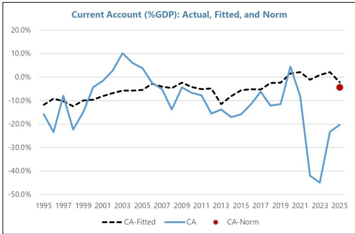

<table><tr><td colspan="3">Kyrgyz Republic: EBA-lite Model Results, 2025</td></tr><tr><td></td><td>CA model 1/ (in percent of GDP)</td><td>REER model 1/</td></tr><tr><td>CA-Actual</td><td>-24.4</td><td></td></tr><tr><td>Cyclical contributions (from model) (-)</td><td>0.2</td><td></td></tr><tr><td>Additional temporary/statistical factors (-) 2/</td><td>-15.9</td><td></td></tr><tr><td>Natural disasters and conflicts (-)</td><td>-0.3</td><td></td></tr><tr><td>Adjusted CA</td><td>-8.4</td><td></td></tr><tr><td>CA Norm (from model) 3/</td><td>-4.3</td><td></td></tr><tr><td>Adjustments to the norm (+)</td><td>0.0</td><td></td></tr><tr><td>Adjusted CA Norm</td><td>-4.3</td><td></td></tr><tr><td>CA Gap</td><td>-4.1</td><td>1.7</td></tr><tr><td>o/w Relative policy gap</td><td>2.3</td><td></td></tr><tr><td>Elasticity</td><td>-0.4</td><td></td></tr><tr><td>REER Gap (in percent)</td><td>11.4</td><td>-4.7</td></tr><tr><td colspan="3">1/ Based on the EBA-lite 3.0 methodology.</td></tr><tr><td colspan="3">2/ Reflects an additional adjustment for unrecorded re-exports in the first three quarters of 2025.</td></tr><tr><td colspan="3">3/ Cyclically adjusted, including multilateral consistency adjustments.</td></tr></table>

## Real Exchange Rate

7. The Kyrgyz som depreciated by 2.6 percent against the USD during 2025. It experienced little volatility throughout the year. The real effective exchange rate (REER) depreciated marginally during 2025, largely reflecting the inflation differential between the Kyrgyz Republic and its trading partners, and the limited appreciation of the Kyrgyz Som in nominal effective terms.

## 8. The REER model identifies a small positive current account gap of 1.7 percent, implying a small undervaluation of the som

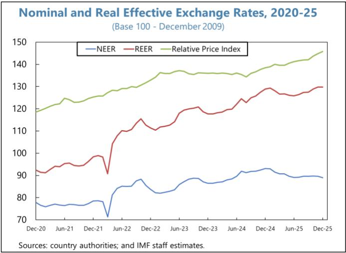

by 4.7 percent. The implied undervaluation of the som with the REER model is at odds with the implied overvaluation of the som in the CA model.

9. Staff puts more weight on the results of the CA model, for two reasons. First, the REER-norm and the REER fitted values from the REER model are higher than the actual REER, implying a need for appreciation to close the gap. Second, in the REER model, the main cause of the undervaluation remains the interest rate differential with the rest of the world, implying that the model results are driven by the capital and financial accounts, which are considerably smaller than the CA balance in the Kyrgyz Republic. Looking forward, sustaining strong growth with limited inflation beyond the boom of 2022-2025 will require an alignment of the external sector with its fundamentals, which in turn will require a prudent management of reserves and reforms to strengthen competitiveness.

## Capital and Financial Accounts: Flows and Policy Measures

10. Background. In 2025, the capital and financial account balance (excluding changes in reserves) is estimated to have improved to 7.7 percent of GDP from 7.4 percent in 2024, driven by small increases in net Foreign Direct Investment (FDI) under the financial account and net official flows under the capital account.

11. Assessment. The Kyrgyz Republic remains potentially vulnerable to sudden shifts in the global and regional financial conditions, especially as regards Russia, which is its main export market and the source of most remittances. Efforts to secure more concessional financing and implementation of reforms consistent with regional or global integration and resulting in higher FDI inflows will be important to mitigate these vulnerabilities over the medium term.

## FX Intervention and Reserves Level

12. Background. While the NBKR bought and sold FX in 2024, it intervened in the FX market in 2025 only to sell the equivalent of \$672.9 million in FX, with 32 percent and 43 percent of all sales conducted in Q2 and Q4 over a few daily operations. These sales aimed at mopping up the excess liquidity injected by the NBKR's ongoing purchase of domestically produced gold, and more generally to contain the growing inflationary pressures. The NBKR converted non-monetary gold to monetary gold worth \$3.4 billion at end-2025, which more than offset the impact of FX sales on international reserves. As a result, and with the additional boost of the proceeds of the Eurobond issuance of \$0.7 billion, reserves increased by more than \$3.6 billion from 4 months of prospective imports (including re-exports) in 2024 to over 6.3 months in 2025. Gross reserves are projected to decline gradually to 5.6 months in 2026, and further to 2 months by 2031 (after the Eurobond bullet repayment), which is below the IMF's reserve adequacy metrics of 4.5 months for credit-constrained economies.

13. Assessment. The NBKR is still holding a stock of non-monetary gold (equivalent to over \$1.3 billion at end-December 2025 valued at historic purchase prices), which if converted to monetary gold would further strengthen NBKR's international reserves. With the conversion of the existing stock of non-monetary to monetary gold, gross reserves would increase by around 2 months of import of goods and services in 2026, and gradually decline to around 4 months by 2031.

Annex IV. Data Issues

<table><tr><td colspan="8">Data Adequacy Assessment Rating1</td></tr><tr><td colspan="8">B</td></tr><tr><td colspan="8">Questionnaire Results2</td></tr><tr><td rowspan="2">Assessment</td><td>National Accounts</td><td>Prices</td><td>Government Finance Statistics</td><td>External Sector Statistics</td><td>Monetary and Financial Statistics</td><td>Intersectoral Consistency</td><td>Median Rating</td></tr><tr><td>C</td><td>B</td><td>B</td><td>C</td><td>A</td><td>B</td><td>B</td></tr><tr><td colspan="8">Detailed Questionnaire Results</td></tr><tr><td colspan="8">Data Quality Characteristics</td></tr><tr><td>Coverage</td><td>C</td><td>B</td><td>B</td><td>C</td><td>A</td><td></td><td></td></tr><tr><td rowspan="2">Granularity3</td><td>C</td><td></td><td>B</td><td>C</td><td>B</td><td></td><td></td></tr><tr><td></td><td></td><td>B</td><td></td><td>A</td><td></td><td></td></tr><tr><td>Consistency</td><td></td><td></td><td>C</td><td>C</td><td></td><td>B</td><td></td></tr><tr><td>Frequency and Timeliness</td><td>A</td><td>A</td><td>A</td><td>C</td><td>A</td><td></td><td></td></tr><tr><td colspan="8">Note: When the questionnaire does not include a question on a specific dimension of data quality for a sector, the corresponding cell is blank.1The overall data adequacy assessment is based on staff&#x27;s assessment of the adequacy of the country&#x27;s data for conducting analysis and formulating policy advice, and takes into consideration country-specific characteristics.2The overall questionnaire assessment and the assessments for individual sectors reported in the heatmap are based on a standardized questionnaire and scoring system (see IMF Review of the Framework for Data Adequacy Assessment for Surveillance, January 2024, Appendix I).3The top cell for &quot;Granularity&quot; of Government Finance Statistics shows staff&#x27;s assessment of the granularity of the reported government operations data, while the bottom cell shows that of public debt statistics. The top cell for &quot;Granularity&quot; of Monetary and Financial Statistics shows staff&#x27;s assessment of the granularity of the reported Monetary and Financial Statistics data, while the bottom cell shows that of the Financial Soundness indicators.</td></tr><tr><td>A</td><td colspan="7">The data provided to the Fund are adequate for surveillance.</td></tr><tr><td>B</td><td colspan="7">The data provided to the Fund have some shortcomings but are broadly adequate for surveillance.</td></tr><tr><td>C</td><td colspan="7">The data provided to the Fund have some shortcomings that somewhat hamper surveillance.</td></tr><tr><td>D</td><td colspan="7">The data provided to the Fund have serious shortcomings that significantly hamper surveillance.</td></tr><tr><td colspan="8">Rationale for staff assessment. Data weaknesses significantly impact the assessment of macroeconomic and financial risks in the Kyrgyz Republic, particularly in national accounts, fiscal and external sector statistics. A major issue is the large volume of unrecorded re-exports, leading to external sector discrepancies with errors and omissions reaching more than 25 percent of GDP in recent years. This distortion undermines the reliability of external balances, yet the authorities have not taken corrective measures. Additionally, it creates inconsistencies between the expenditure and production approaches in GDP measurement, further complicating economic analysis. Recent national accounts revisions and limited gold-related data disclosure have introduced additional concerns, suggesting possible misclassification or measurement issues. On the fiscal side, the use of an extra-budgetary fund undermines the monitoring of effective expenditures and the reconciliation of accounts between the NBKR and the Treasury. These data weaknesses compromise the accuracy of risk assessments and policy recommendations, increasing the likelihood of ineffective macroeconomic and financial policies. Addressing these challenges through improved statistical methodologies and greater transparency is essential for informed policymaking.</td></tr><tr><td colspan="8">Changes since the last Article IV consultation The last Article IV consultation highlighted concerns about external sector statistics, particularly the significant errors and omissions. However, no improvements have been made since then, and the issue remains unresolved. Additionally, the challenges related to national accounts revisions have emerged after the last Article IV, further complicating macroeconomic analysis. Moreover, the use of extra-budgetary funds undermines the quality of treasury data. These unresolved data weaknesses continue to hinder the accuracy of economic assessments and policy recommendations.</td></tr><tr><td colspan="8">Corrective actions and capacity development priorities Staff reiterated its offer to provide technical assistance (TA) to improve external sector statistics; however, the authorities have not yet agreed to receive this support. On national accounts, the authorities, supported by CCAMTAC, are working to develop and publish discrete quarterly GDP estimates.</td></tr><tr><td colspan="8">Use of data and/or estimates in Article IV consultations in lieu of official statistics available to staff. Staff relied on the official data for the actual years. However, re-exports are calculated and adjusted in the balance of payment projections.</td></tr><tr><td colspan="8">Other data gaps. The Kyrgyz Republic would benefit from new income and gender inequality data.</td></tr></table>

Table 2. Kyrgyz Republic: Data Standards Initiatives

Kyrgyz Republic subscribes to the Special Data Dissemination Standard (SDDS) since February 2004 and publishes the data on its National Summary Data Page. The latest SDDS Annual Observance Report is available on the Dissemination Standards Bulletin Board (https://dsbb.imf.org/).

Table 3. Kyrgyz Republic: Table of Common Indicators Required for Surveillance
As of April 22, 2026

<table><tr><td rowspan="2"></td><td colspan="4">Data Provision to the Fund</td><td colspan="4">Publication under the Data Standards Initiatives through the National Summary Data Page</td></tr><tr><td>Date of Latest Observation</td><td>Date Received</td><td>Frequency of  $Data^7$ </td><td> $Frequency\ of\ Reporting^7$ </td><td> $Expected Frequency^{7,8}$ </td><td>Announced  $Frequency^9$ </td><td>Expected  $Timeliness^{7,8}$ </td><td>Announced  $Timeliness^9$ </td></tr><tr><td>Exchange Rates</td><td>2026-04-20</td><td>2026-04-20</td><td>D</td><td>D</td><td>D</td><td>...</td><td>...</td><td>...</td></tr><tr><td>International Reserve Assets and Reserve Liabilities of the Monetary  $Authorities^1$ </td><td>2026-02</td><td>2026-03</td><td>M</td><td>M</td><td>M</td><td>M</td><td>1M</td><td>1M</td></tr><tr><td>Reserve/Base Money</td><td>2026-03</td><td>2026-04</td><td>M</td><td>M</td><td>M</td><td>M</td><td>2W</td><td>NLT 5D</td></tr><tr><td>Broad Money</td><td>2026-03</td><td>2026-04</td><td>M</td><td>M</td><td>M</td><td>M</td><td>1M</td><td>3W</td></tr><tr><td>Central Bank Balance Sheet</td><td>2026-03</td><td>2026-04</td><td>M</td><td>M</td><td>M</td><td>M</td><td>2W</td><td>NLT 5D</td></tr><tr><td>Consolidated Balance Sheet of the Banking System</td><td>2026-03</td><td>2026-04</td><td>M</td><td>M</td><td>M</td><td>M</td><td>1M</td><td>3W</td></tr><tr><td>Total assets of other depository  $corporations^2$ </td><td>2026-03</td><td>2026-04</td><td>M</td><td>M</td><td>M</td><td>M</td><td>1M</td><td>3W</td></tr><tr><td>Total credit from other depository  $corporations^2$ </td><td>2026-03</td><td>2026-04</td><td>M</td><td>M</td><td>M</td><td>M</td><td>1M</td><td>3W</td></tr><tr><td> $Interest Rates^3$ </td><td>2026-04-20</td><td>2026-04-20</td><td>D</td><td>D</td><td>D</td><td>...</td><td>...</td><td>...</td></tr><tr><td>Consumer Price Index</td><td>2026-03</td><td>2026-04</td><td>M</td><td>M</td><td>M</td><td>M</td><td>1M</td><td>2W</td></tr><tr><td>Revenue, Expenditure, Balance and Composition of Financing $^4$ -General Government $^5$ </td><td>2025-12</td><td>2026-02</td><td>M</td><td>M</td><td>A</td><td>A</td><td>2Q</td><td>5M</td></tr><tr><td>Revenue, Expenditure, Balance and Composition of Financing $^4$ -Central Government</td><td>2025-12</td><td>2026-02</td><td>M</td><td>M</td><td>M</td><td>M</td><td>1M</td><td>20D</td></tr><tr><td>Stocks of Central Government and Central Government-Guaranteed  $Debt^6$ </td><td>2025-12</td><td>2026-03</td><td>SA</td><td>SA</td><td>Q</td><td>Q</td><td>1Q</td><td>40D</td></tr></table>

$^{5}$ The general government consists of the central government (budgetary funds, extra-budgetary funds, and social security funds) and state and local

<table><tr><td colspan="9">Table 3. Kyrgyz Republic: Table of Common Indicators Required for Surveillance (concluded)</td></tr><tr><td>Total stock of General Government Debt5</td><td>2025-12</td><td>2026-03</td><td>SA</td><td>SA</td><td>Q</td><td>...</td><td>4M</td><td>...</td></tr><tr><td>External Current Account Balance</td><td>2025-09</td><td>2026-03</td><td>Q</td><td>Q</td><td>Q</td><td>Q</td><td>1Q</td><td>3M</td></tr><tr><td>Exports and Imports of Goods and Services</td><td>2025-09</td><td>2026-03</td><td>Q</td><td>Q</td><td>M</td><td>M</td><td>8W</td><td>47D</td></tr><tr><td>GDP/GNP</td><td>2026-03</td><td>2026-04</td><td>M</td><td>M</td><td>Q</td><td>Q</td><td>1Q</td><td>90D</td></tr><tr><td>Gross External Debt</td><td>2025-12</td><td>2026-03</td><td>SA</td><td>SA</td><td>Q</td><td>Q</td><td>1Q</td><td>Q</td></tr><tr><td>International Investment Position</td><td>2025-09</td><td>2026-03</td><td>Q</td><td>Q</td><td>Q</td><td>Q</td><td>1Q</td><td>90D</td></tr></table>

$^{1}$ Any reserve assets that are pledged or otherwise encumbered should be specified separately. Also, data should comprise short-term liabilities linked to a foreign currency but settled by other means as well as the notional values of financial derivatives to pay and to receive foreign currency, including those linked to a foreign currency but settled by other means.  
$^{2}$ Other depository corporations include all deposit-taking corporations (except for the central bank) and money market funds.  
$^{3}$ Both market-based and officially determined, including discount rates, money market rates, rates on treasury bills, notes and bonds.  
$^{4}$ Foreign, domestic bank, and domestic non-bank financing.  
$^{6}$ Including currency and maturity composition.  
$^{7}$ Frequency and timeliness: (“D”) daily; (“W”) weekly or with a lag of no more than one week after the reference date; (“M”) monthly or with lag of no more than one month after the reference date; (“Q”) quarterly or with lag of no more than one quarter after the reference date; (“A”) annual; (“SA”) semi-annual; (“I”) irregular; (“NA”) not available or not applicable; and (“NLT”) not later than.  
$^{8}$ Encouraged frequency of data and timeliness of reporting under the e-GDDS and required frequency of data and timeliness of reporting under the SDDS and SDDS Plus. Any flexibility options or transition plans used under the SDDS or SDDS Plus are not reflected. For those countries that do not participate in the IMF Data Standards Initiatives, the required frequency and timeliness under the SDDS are shown for New Zealand, and the encouraged frequency and timeliness under the e-GDDS are shown for Eritrea, Nauru, South Sudan, and Turkmenistan. Indicators that are not in the IMF Data Standards Initiatives are shown as "...".  
$^{9}$ Based on the information from the Summary of Observance for SDDS and SDDS Plus participants, and the Summary of Dissemination Practices for e-GDDS participants, available from the IMF Dissemination Standards Bulletin Board (https://dsbb.imf.org/). For those countries that do not participate in the Data Standards Initiatives, as well as those that do have a National Data Summary Page, the entries are shown as “...”.

# Annex V. Assessing Fiscal Risks in the Public Pension System of the Kyrgyz Republic $^{1}$

The purpose of this analysis is to assess the sustainability and adequacy of the old-age Public Pension System (PPS) in the Kyrgyz Republic in light of the international experience; identify its main drivers and policy variables; analyze the projected fiscal impact of the PPS of specific demographic, economic or policy stresses; and discuss considerations to help maintain fiscal sustainability. The results of the modeling exercise show that the PPS faces sustainability issues exacerbated by risks in the medium term.

## A. Background and Rationale

1. The PPS is an important mechanism to redistribute income and combat poverty in old age. The Social Fund (SF) is the autonomous public agency with rank of ministry responsible for social welfare payments and all pension payments, the latter accounting for 85 percent of its budget in 20225.

2. The old-age PPS operates de facto as a modified “pay-as-you-go” (PAYGO) “defined benefits” (DB) scheme. The effective DB in the PPS is a percentage of the last salary in active service, on top of a basic flat rate benefit. $^{2}$ Retirees in the PPS are funded in part by a PAYGO contribution applicable to formal sector employees and employers, with an effective rate of 17 percent of the salary. The rest is financed by a transfer from the state budget.

3. SF accounts have been broadly balanced over the past 5 years. Overall SF expenditures in recent years have been around 7.5 percent of GDP, of which 5.5 percentage points are for the PPS, and around 1 percentage point for overhead administrative costs. On the revenue side, the contributions to the PPS amount to 4.5 percent of GDP, with the rest of SF revenue covered by the state budget.

4. The fundamentals of the PPS and recent policy shifts raise questions about its sustainability and adequacy. First, while in 2025 there were around 100,000 retirees who were contributors to the PAYGO scheme, there were overall around 700,000 beneficiaries of old-age pensions. This means that with roughly 1 million current contributors, the dependency ratio of around 10 percent for formal sector retirees becomes an effective ratio of 70 percent to account for all beneficiaries of the PPS. The OECD invites vigilance if this ratio exceeds 30. Second, while real GDP growth was over 10 percent on average for the past three years, the SF revenue base did not exhibit an equivalent growth. Third, in an effort to entice firms into the formal economy, the Government has slashed the PAYGO contributory rate by 10 percentage points for new adherents, thus undermining the earmarked revenue base and increasing the burden on the budget. And

fourth, the overhead costs remain high at 12 percent of SF expenditure, even though they have decreased over the past 5 years.

## B. Comparative Landscape of Central Asian Pension Systems

5. A PAYGO framework remains the dominant pension model across the Central Asia region. The Kyrgyz Republic, together with Tajikistan, Turkmenistan, and Uzbekistan has conducted several reforms to modify their Soviet-era pension model characterized by a PAYGO DB system. One exception is Kazakhstan, which has transitioned to a fully funded defined contribution system. Statutory retirement ages remain relatively low in the region - particularly for women - while contribution and working requirements differ markedly. Minimum qualifying periods are longest in Tajikistan and Uzbekistan (25 years for men, 20 for women), whereas it is currently 6 years in the Kyrgyz Republic, where it is projected to increase to 20 years by 2045. Contribution rates and the balance of employee-employer burden vary widely, with Kazakhstan featuring the most employee-based model (10 percent contribution), while Tajikistan, Turkmenistan, Uzbekistan rely almost entirely on employer contributions. In the Kyrgyz Republic, the contribution to the PAYGO component by the employee is about 8 percent and 15 percent for the public service and large private employers (lowered to 1 percent for most of small and medium enterprises).

<table><tr><td colspan="6">Text Table 1. Selected CCA Countries: Public Pension System Characteristics</td></tr><tr><td>Country</td><td>Kazakhstan</td><td>Kyrgyz Rep.</td><td>Tajikistan</td><td>Turkmenistan</td><td>Uzbekistan</td></tr><tr><td>Primary pension program</td><td>Fully funded</td><td>PAYGO</td><td>PAYGO</td><td>PAYGO</td><td>PAYGO</td></tr><tr><td>Statutory pensionable age (M/W)</td><td>63/61</td><td>63/58</td><td>63/58</td><td>62/57</td><td>60/55</td></tr><tr><td>Minimum qualifying years</td><td>--</td><td>6</td><td>25/20</td><td>5</td><td>25/20</td></tr><tr><td>Contribution rate (Insured/Employer)</td><td>10/5</td><td>8/15</td><td>2/20</td><td>0/20</td><td>0.1/12</td></tr><tr><td colspan="6">Note: Minimum qualifying period is the number of working years required to receive full pension. M= Men. W= Women. This does not include the individual account contribution (2 percent of salary) or health-related contributions.</td></tr></table>

6. Despite a generally favorable demographic profile across Central Asia, the Kyrgyz Republic faces disproportionate fiscal pressure due to its high pension expenditures. Among the four countries with a PAYGO system, the Kyrgyz Republic and Uzbekistan are those with higher formal old-age dependency ratio $^{3}$ of 9-10 compared to 6-7 percent in Tajikistan and Turkmenistan (Figure 1). The old-age pension expenditure of Kyrgyzstan is also highest among the Central Asian countries, reaching 6.7 percent of GDP, while other countries spend between 3-4.5 percent of GDP (Figure 2).

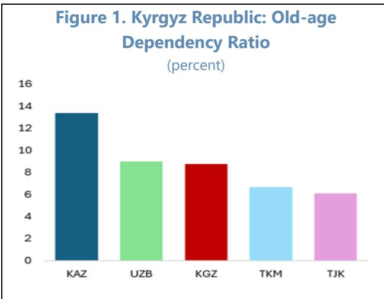

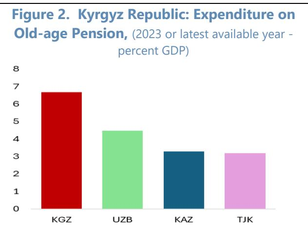

## C. Modeling of the Public Pension System

## Methodology

7. The analysis focuses on the FYSG DB public pensions, using a simple model developed by Fund staff. The model comprises three major clusters of variables by gender: (i) demographic variables (population growth, mortality); (ii) economic variables (GDP growth proxied by headcount growth, inflation proxied by indexation, structure and distribution of wages, promotion, attrition); and (iii) PPS specifications (number of contributors, pensioners, initial pension amount, defined benefit policy, partial pensions for early retirees, contribution policy, etc.).

8. Based on the preceding inputs, the model generates PPS projections. They include (i) PPS demographics over time (number of contributors and pensioners, dependency ratio, life expectancy); (ii) PPS benefits and finances (wage bill, pensions, PPS revenues, PPS current balance, etc.).

## Calibration

9. The model was populated starting in base year 1996 to approximate the main elements of the PPS financial accounts and demographics at steady state, in 2025. Specifically, in 2025 PAYGO DB pension outlays are around 110 billion soms, and PAYGO contributions are 83 billion soms. Overhead costs are 10 billion soms. Other demographic and economic data for 2025 were drawn from official Kyrgyz statistics: formal sector employees estimated at around 1 million evenly split between the private sector and the State (out of a population of 7.3 billion), an average annual wage economy-wide is 500,000 soms, 700,000 retirees drawing old age pensions averaging 140,000 soms. The pension age is 63 for men and 58 for women, and both genders start work at 18 years old.

10. The main stylized modeling assumptions for the baseline scenario reflect recent economic developments and policy decisions, broadly in line with the macroeconomic framework (See text table 2). Higher economic growth justifies a higher headcount growth (4 percent, up from 2 percent) and higher inflation starting in 2025 justifies higher indexation; the decrease of the contribution rate by 10 percentage points also justifies higher headcount growth in formal employment, and, conversely, a gradual lowering of the number of new non-contributing retirees.

Text Table 2. Kyrgyz Republic: Public Pension System: Select Modeling Assumptions

<table><tr><td></td><td>1986-2025</td><td>2026</td><td>2027</td><td>2028</td><td>2029</td><td>2030</td><td>2031</td><td>2032</td><td>2033</td><td>2034</td><td>2035</td></tr><tr><td colspan="12">Economic / Demographic</td></tr><tr><td>Annual headcount growth (percent)</td><td>2.1</td><td>4.0</td><td>4.0</td><td>4.0</td><td>4.0</td><td>4.0</td><td>4.0</td><td>4.0</td><td>4.0</td><td>4.0</td><td>4.0</td></tr><tr><td>Annual retiree attrition (percent)</td><td>2.0</td><td>1.0</td><td>1.0</td><td>1.0</td><td>1.0</td><td>1.0</td><td>1.0</td><td>1.0</td><td>1.0</td><td>1.0</td><td>1.0</td></tr><tr><td>Wage indexation (percent)</td><td>2.3</td><td>8.0</td><td>7.0</td><td>6.0</td><td>5.0</td><td>5.0</td><td>5.0</td><td>5.0</td><td>5.0</td><td>5.0</td><td>5.0</td></tr><tr><td>Pension indexation (percent)</td><td>2.3</td><td>8.0</td><td>7.0</td><td>6.0</td><td>5.0</td><td>5.0</td><td>5.0</td><td>5.0</td><td>5.0</td><td>5.0</td><td>5.0</td></tr><tr><td colspan="12">PPS Specifications</td></tr><tr><td>Salary (annual weighted average - soms)</td><td>499,471</td><td>539,325</td><td>576,789</td><td>611,239</td><td>641,312</td><td>672,713</td><td>705,511</td><td>739,784</td><td>775,608</td><td>813,064</td><td>852,239</td></tr><tr><td>Number of contributors</td><td>1,000,209</td><td>1,031,491</td><td>1,024,046</td><td>1,068,959</td><td>1,089,617</td><td>1,111,629</td><td>1,135,060</td><td>1,159,998</td><td>1,186,502</td><td>1,214,637</td><td>1,244,466</td></tr><tr><td>Pension (percent of last salary)</td><td>28.0</td><td>28.0</td><td>28.0</td><td>28.0</td><td>28.0</td><td>28.0</td><td>28.0</td><td>28.0</td><td>28.0</td><td>28.0</td><td>28.0</td></tr><tr><td>Mandatory contribution (percent of salary</td><td>16.7</td><td>16.7</td><td>15.7</td><td>14.7</td><td>13.7</td><td>12.7</td><td>11.7</td><td>10.7</td><td>9.7</td><td>8.7</td><td>7.7</td></tr><tr><td>Promotion rate (between 5 grades)</td><td>5.0</td><td>5.0</td><td>5.0</td><td>5.0</td><td>5.0</td><td>5.0</td><td>5.0</td><td>5.0</td><td>5.0</td><td>5.0</td><td>5.0</td></tr><tr><td>Annual labor force attrition (percent)</td><td>0.5</td><td>1.0</td><td>1.0</td><td>1.0</td><td>1.0</td><td>1.0</td><td>1.0</td><td>1.0</td><td>1.0</td><td>1.0</td><td>1.0</td></tr><tr><td>Annual labor force lateral entry (percent)</td><td>1.0</td><td>0.0</td><td>0.0</td><td>0.0</td><td>0.0</td><td>0.0</td><td>0.0</td><td>0.0</td><td>0.0</td><td>0.0</td><td>0.0</td></tr></table>

Sources; Country Authorities and IMF staff calculations.

## D. Outlook under the Baseline Scenario

11. The demographics of the PPS are concerning, but stand to improve under a baseline scenario. The effective dependency ratio, i.e. total pensioners as shared of formal employment, is 70 percent in 2025, but improves to around 36 percent by 2065. This is due to a relatively fast growth of the labor force in the formal sector, while the number of pensioners is constrained by old age and a more limited accrual of beneficiaries who did not contribute.

12. The financials of the PPS are under strain. Over the next ten years, the decreasing contribution rate will cause the deficit of the PPS to increase to over 3.3 percent of GDP by 2035. Overall contributions fall from 4.3 to 1.5 percent of GDP by 2035, while outlays would fall from 6.4 to 4.8 percent of GDP. The PPS shows a steadily narrowing deficit thereafter – down to 0.5 percent of GDP by 2065 - as headcount growth for the workforce becomes the dominant driver of PPS dynamics, and as the impact of the more limited increase of non-contributing retirees plays out.

13. The sustainability of the pension system will depend on vigilance, judicious PPS policies and favorable economic and demographic circumstances. PPS policies should target adequate contributions from the workforce, tight control over pension eligibility, control of overhead costs and annual pension increases no higher than inflation. An auspicious socio-economic environment will help contain the challenges of the PPS, since real GDP is projected to increase faster than headcount in formal employment. The wage bill of the formal sector (public and private) therefore halves over 40 years as the economy grows through more capital-intensive sectors.

Figure 3. Kyrgyz Republic: Select Indicators for the Modeled Public Pension System  
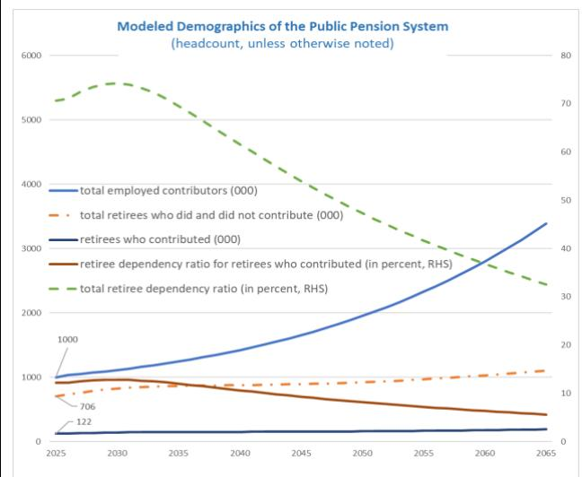

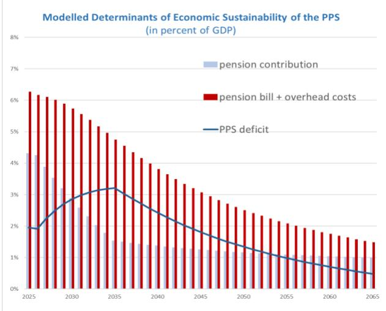

14. The payments for retirees under the PPS raise concerns about the standard of living in old age. The average pension is only one third of the average wage in 2025. Moreover, average pensions do not track inflation fully over the long term. The lowest modeled pension of 78,000 soms for 2025 is higher than the national poverty line set at 65,417 soms per capita per year in 2024, but is inadequate to support a dependent of the retiree.

## E. Challenges Facing the PPS

## 15. Specific stress tests indicate that the PPS is highly sensitive to economic and demographic

developments. Moreover, the effects of such developments are difficult to counteract rapidly with PPS-specific policy measures. In an alternative scenario where the baseline is adjusted to reflect a lower real economic growth rate of 3 percent instead of 5, and a lower workforce headcount growth of 2 percent instead of 4, the overall balance of the PPS adopts a different profile. The deficit is 4 percent of GDP in 2035, but it falls more slowly afterwards, remaining at 1.8 percent of GDP by 2065.

Figure 4. Kyrgyz Republic: PPS - Alternative Scenario  
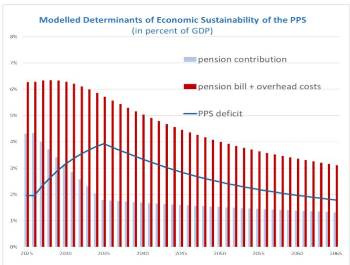

## F. Policy Considerations

16. Continuous monitoring and transparent reporting of PPS finances alongside the annual budget are essential. Given long adjustment lags, early identification of adverse trends is critical to avoid abrupt and procyclical fiscal corrections.

17. Policy changes affecting contributions or benefits should be gradual and well-calibrated. While measures to support formalization are important, permanent reductions in contribution rates should be weighed carefully against their fiscal costs and, where possible, offset by broadening the contribution base or strengthening compliance.

18. Critical ratios should be monitored diligently. Allowing overhead costs to increase at the same rate as nominal GDP, loosening eligibility criteria for old-age pensions, or allowing pension indexation in excess of inflation could put the PPS on an accelerated path to unsustainability. Conversely, maintaining indexation broadly in line with inflation and containing administrative spending can deliver sizable long-term savings

19. Contingency measures should be pre-designed and modelled in advance to address evolving economic and demographic developments. Options such as gradual increases in statutory retirement ages—particularly in response to rising longevity—and restrictions on eligibility for non-contributors can significantly improve balances, but only if implemented early.

## Annex VI. Kyrgyz Republic: Artificial Intelligence Exposure and Preparedness $^{1}$

## A. Introduction

1. Artificial intelligence (AI) has immense potential to boost productivity and strengthen public service delivery. For the Kyrgyz Republic, AI could serve as a catalyst for structural transformation given the country's modest productivity growth over the last decade and large inefficiencies in public spending (Rao and others, 2025 and IMF's Spending Efficiency Database, 2025). Nevertheless, realizing these gains is contingent on complementary investments in infrastructure, skills, and institutions. At the same time, AI adoption carries risks of labor market disruption and widening inequality if left unmanaged (Brollo and others, 2024).

2. The Kyrgyz Republic's National Development Program (NDP) 2030 articulates an objective to leverage AI as a cross-cutting instrument for the country's long-term modernization agenda. Spanning education, healthcare, agriculture, industry, and public financial management, the NDP envisions AI-driven improvements in service delivery and productivity, underpinned by investments in digital infrastructure and AI competencies through STEM-focused programs.

3. Against this backdrop, the annex assesses the Kyrgyz Republic's AI exposure as well as its preparedness to manage the transition and broaden the gains of AI. First, it examines the extent to which the labor market is exposed to AI as well as the current AI adoption in the economy. Second, it evaluates the country's AI preparedness using the IMF's AI Preparedness Index (AIPI) framework, encompassing four main dimensions—digital infrastructure, human capital and labor market policies, innovation and economic integration, and legal frameworks. The last section concludes with policy recommendations.

## B. Assessing the Potential Exposure of Jobs to Generative AI

4. We construct a novel measure of exposure of jobs to generative AI in the Kyrgyz Republic. The AI exposure score is derived from task-based methodologies (Gmyrek and others, 2023), reflecting “potential exposure” to GenAI and not the actual impact. Each of the tasks within an occupation received a 0-1 potential automation score, with 0 indicating it is not possible and 1 indicating it was entirely possible to perform the task with Generative AI. There are six levels of exposure, ranging from highest exposure, where most tasks can be automated, to minimal or no exposure, where automation potential is limited. Using the Labor Force Survey data of International Labor Organization (ILO) for occupations at 2-digit ISCO level, it assesses the proportions of existing jobs that could be potentially automated by the generative AI.

Source: Microsoft (2026)

5. The share of employment exposed to generative AI in the Kyrgyz Republic is estimated to be moderate relative to the world average. About 7 percent of employment in the Kyrgyz Republic falls into one of the three highest exposure gradients (from moderate and above), compared to 13 percent in lower-middle income peers, 16 percent as the world average, and 28 percent in high income countries (Figure 1, Panel 1). In line with ILO (2025), a larger share of female employment in the Kyrgyz Republic is subject to top three exposure gradients, reflecting women's concentration in data processing and routine cognitive tasks (Figure 1, Panel 2).

Figure 1. Kyrgyz Republic: Proportion of jobs potentially affected by Generative AI

2. Kyrgyz Republic: Male versus Female

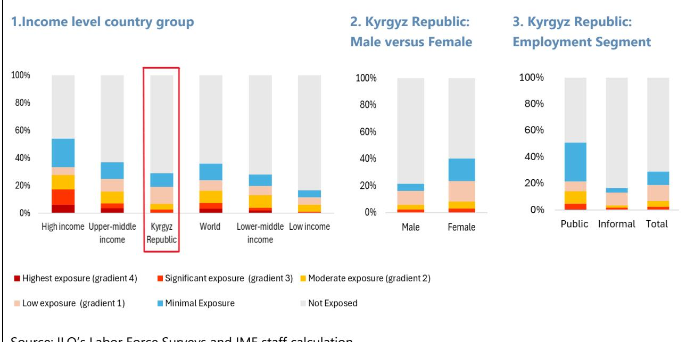  
3. Kyrgyz Republic: Employment Segment  
Source: ILO's Labor Force Surveys and IMF staff calculation

## 6. Employment in the public sector has a larger potential exposure to generative AI. As of

employment is in the public sector. Of these, 14 percent of jobs are in top three exposure risks, which is double the corresponding level for total employment (Figure 1, Panel 3), due to their concentration in administrative, data-processing, and cognitive tasks.

## 7. The low aggregate AI exposure in the Kyrgyz Republic is driven by a large share of informal

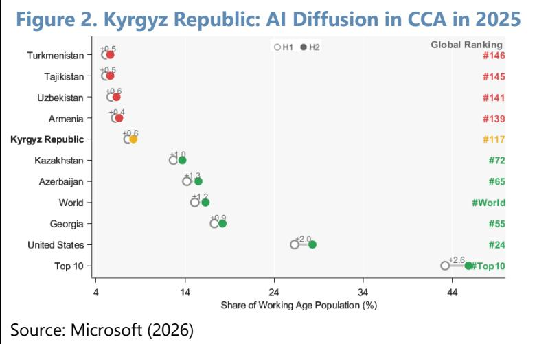

employment. The informal sector accounts for 57.5 percent of employment, with significant concentration in agriculture, construction, and manufacturing (Muratkhanov and Talishi, 2026). The tasks associated with these jobs are more physical and less cognitive, thus mitigating the near-term risks of replacement by generative AI. However, high informality may slow technology diffusion and limit productivity spillovers, reinforcing labor market duality.

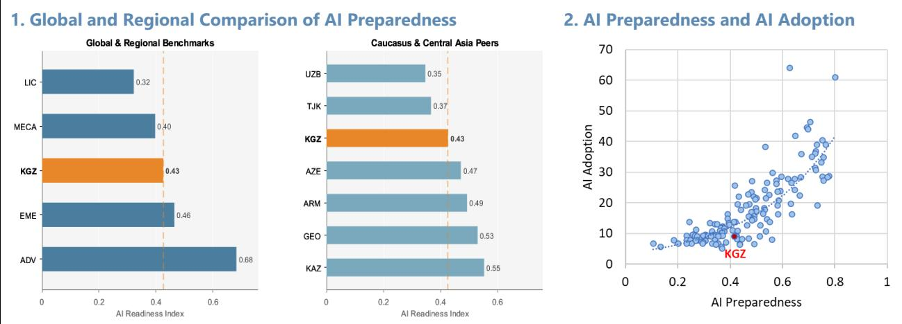  
Figure 3. Kyrgyz Republic: AI Preparedness  
Source: IMF's AIPi Database, Cazzaniga and others (2024), Microsoft (2026), and IMF staff calculation.

8. Nevertheless, the concentration of employment in sectors with limited direct AI task exposure suggests that near-term productivity gains from AI could be limited. About 93 percent of employment in the Kyrgyz Republic has minimal or no exposure to generative AI—significantly above the global average of 76 percent—reflecting the economy's sectoral composition, where AI task substitution and augmentation potential remain limited. This is reinforced by a low AI diffusion of 8 percent in 2025 in the Kyrgyz Republic, measured as the share of people who have used a generative AI product (Figure 2). This places the Kyrgyz Republic in the middle of CCA range countries, but well below top CCA countries, the global average, and far behind the top 10 average. Notably, the improvement between H1 and H2 2025 was only half the global average pace and less than a quarter of the top 10 rate, suggesting the diffusion gap is widening rather than closing.

## C. Evaluating AI Preparedness

9. Measuring and evaluating AI preparedness can help identify gaps and prioritize policy actions needed to maximize the benefits of AI adoption. The IMF AI Preparedness Index (AIPI), developed by Cazzaniga and others (2024), assesses 174 economies across four pillars—digital infrastructure, human capital and labor market policies (HC&LMP), innovation and economic integration, and regulation and ethics—providing a structured framework to benchmark countries against peers and identify priority reform areas.

10. The Kyrgyz Republic's AI preparedness score falls between the LIC and EME average, placing it in the bottom half of the CCA group. As noted in Cazzaniga and others (2024), wealthier economies are generally better prepared than low-income countries to adopt AI. The score of the Kyrgyz Republic is 0.43, below the EME average of 0.46 and well below the regional leaders Kazakhstan (0.55) and Georgia (0.53), reflecting weaker digital infrastructure and a less digitally skilled labor force, among other factors (Figure 3, Panel 1). Low AI preparedness is in turn associated with low AI adoption, limiting the scope for productivity gains (Figure 3, Panel 2).

11. Digital infrastructure represents a structural impediment to technological diffusion in the Kyrgyz Republic. Digital infrastructure is one of the two foundational dimensions of AI preparedness, besides HC&LMP. While this measure is slightly higher than the average Middle East and Central Asia (MECA), it lags behind the corresponding measure in top EME and Top CCA (Figure 4), mostly reflecting limited secure internet servers as well as public sector's online service infrastructure and private sector's e-commerce business environment (Figure 5, Panel 1).

## 12. Significant gaps also exist

regarding HC&LMP. Despite relatively high public spending on education in the region, poor education quality—reflected in a narrow graduate skillset and below-average STEM graduation rates—limits human capital development (Figures 4 and 5, Panel 2). Moreover, the weak link between productivity gains and wage growth reduces workers' incentives to adopt and leverage AI tools to enhance efficiency. Weak social protection and underdeveloped active labor market policies (ALMPs) could further

Figure 4. Kyrgyz Republic: AI Preparedness  
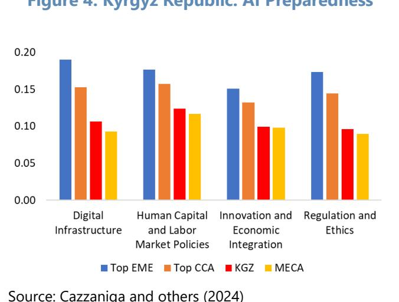  
Source: Cazzaniga and others (2024)

prolong the transition, given the absence of adequate income support and limited retraining and skills-matching capacity — both critical for helping workers adapt to AI-driven labor market changes (Figure 5, Panel 3).

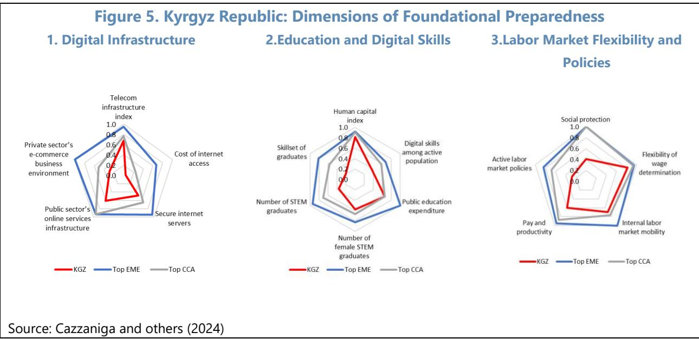  
Source: Cazzaniga and others (2024)

## 13. Beyond foundational preparedness, there are gaps in innovation and regulatory

framework in the Kyrgyz Republic. The gaps in these aspects align with the average MECA but lie well below regional and EME leaders (Figure 4). Strengthening innovation capacity and regulatory frameworks would further support AI adoption; however, these efforts will be less effective without prior improvements in digital infrastructure and workforce skills, underscoring the importance of policy sequencing.

## D. Conclusions and Policy Recommendations

14. To reap the productivity benefits of AI while managing the associated risks, the Kyrgyz Republic needs a coherent policy framework that addresses its structural preparedness gaps. While aggregate labor market exposure to generative AI is moderate—reflecting the economy's large informal sector and concentration in low-automation activities—the small share of AI-exposed employment and low AI diffusion could limit the productivity gains that AI could otherwise deliver. At the same time, the country's AI preparedness score places it in the bottom half of the CCA group, with structural weaknesses across all four AIPi pillars, particularly digital infrastructure and human capital and labor market policies—constraining the economy's ability to absorb and benefit from AI technologies.

## 15. Addressing these gaps will require targeted, sequenced policy actions across several fronts, prioritizing digital infrastructure and human capital:

\- Strengthen digital infrastructure and AI diffusion. Expanding affordable high quality broadband connectivity, improving public digital services, and supporting broader access to AI tools are important for closing the diffusion gap and enabling economy-wide productivity gains.

\- Improve human capital quality and labor market adaptability. Enhancing education efficiency, including through better STEM outcomes, digital skills, and AI literacy, while strengthening ALMPs and social protection to support workers displaced by AI-driven structural change, is essential to ensure the gains from AI adoption are broadly shared.

\- Build an enabling environment for AI adoption. Strengthening innovation ecosystems and regulatory frameworks could support AI adoption by enhancing firms' capacity to develop, access, and adapt global AI technologies, while improving governance and trust in digital tools—thereby encouraging private investment in digital innovation.

\- Enhance data foundations for evidence-based AI policy. Integrating technology-use modules into the national labor force survey would fill a critical gap in monitoring AI exposure and adoption at the firm and worker level — providing the empirical basis for policy adjustment as AI deployment evolves.

## References

Brollo, F., Dabla-Norris, M.E., de Mooij, M.R., Garcia-Macia, M.D., Hanappi, T., Liu, M.L. and Nguyen, A.D., 2024. Broadening the Gains from Generative AI: The Role of Fiscal Policies. IMF Staff Discussion Note SDN2024/002, International Monetary Fund, Washington, DC.

Cazzaniga, M., Jaumotte, M.F., Li, L., Melina, M.G., Panton, A.J., Pizzinelli, C., Rockall, E.J. and Tavares, M.M.M., 2024. Gen-AI: Artificial Intelligence and the Future of Work. IMF Staff Discussion Note SDN2024/001, International Monetary Fund, Washington, DC.

Gmyrek, P., Berg, J., Kamiński, K., Konopczyński, F., Ładna, A., Nafradi, B., Rosłaniec, K. and Troszyński, M., 2025. Generative AI and Jobs: A Refined Global Index of Occupational Exposure (No. 140). ILO Working Paper..

ILO, 2025. "How Might Generative AI Impact Different Occupations?"

IMF's Spending Efficiency Database. 2025. In the Fiscal Monitor Report: "Spending Smarter: How Efficient and Well-Allocated Public Spending Can Boost Economic Growth".

Microsoft AI Economy Institute, 2026. Global AI Adoption in 2025: A Widening Digital Divide. Muratkhanov, A. and Talishi, F. 2026. Informal Economy in the Kyrgyz Republic. IMF Selected Issues Papers. SIP/2026/XX

Rao, N., Muratkhanov, A. and Haider, N., 2025. Potential Output in the Kyrgyz Republic. IMF Selected Issues Paper. SIP/2025/081.

## Annex VII. Mitigation of Cross-border Financial Integrity Risks in Kyrgyz Republic

## A. Money Laundering/Terrorist Financing (ML/TF) Risks and Country Context

1. Kyrgyz Republic is facing material cross-border ML/TF risks due to its geographic location and jurisdictional vulnerabilities. The 2025 National Risk Assessment (NRA) $^{1}$ identified fraud, tax evasion, and corruption as the highest-threat predicate offenses for ML, followed by drug trafficking, customs offenses, and organized crime. Recognizing the importance of transnational crime and ML, the NRA usefully included an in-depth analysis of cross-border risks and typologies. It highlights the Kyrgyz Republic's role as the regional transportation hub and a transit link between China and Russia as well as geographic position along drug trafficking routes with associated financial integrity risks. Corruption remains both an offense generating significant criminal proceeds as well as structural vulnerability, enabling ML and other economic crimes. High-risk cross-border typologies identified include placement and withdrawal of cash from bank accounts, "transit" wire transfers between accounts of legal persons and complex layering schemes involving multiple jurisdictions.

2. Misuse of companies registered in Kyrgyz Republic represents a critical structural vulnerability identified in the NRA. The assessment highlights the mass registration of corporate entities, with more than 65 percent of registered companies conducting no economic activity, which suggests exposure to risks of corporate misuse to facilitate ML. The high share of companies with non-resident participation, particularly in high-risk sectors such as trade, construction, and consulting, creates opportunities for beneficial ownership concealment and integration of illicit proceeds into the formal economy. The NRA specifically notes high risks associated with misuse of offshore companies, corporate nominees, and proxies.

## B. Virtual Asset Service Providers (VASPs): Regulatory and Supervisory Framework

3. The value of transactions conducted through the VASPs increased threefold in 2025, exceeding the GDP, while the number of VASPs has grown to 188. The transactions via VASPs increased from USD 2.5 bln. in 2023 to 31.3 bln. in 2025, reaching approximately 138 percent of GDP in 2025, as the Kyrgyz Republic became one of the world's fast growing VASP jurisdictions relative to the size of the financial sector and economy. $^{2}$ As the number of transactions via VASPs fell by one-third in 2025, the average transaction value increased four-fold to USD 14 573. In 2023, the average transaction value reached USD 120 481 - outside expectations for retail activity, suggesting

institutional or other large-value transfers, with a different risk profile. The transactions via VASPs are concentrated (94 percent) in the fiat to virtual assets (VAs) and vice versa conversion rather than crypto exchange activity, which would involve safekeeping and a digital platform. $^{3}$ The number of VASPs grew at the fastest rate in 2025, reaching 188, mostly consisting of VA conversion operators that provide services for the purchase and sale of VA on their own behalf. The NBKR, as a supervisor for banks, has not authorized any of the banks to provide VA services. In addition, 6 issuers of VA are licensed in Kyrgyz Republic, issuing VA valued at more than USD 34 million.

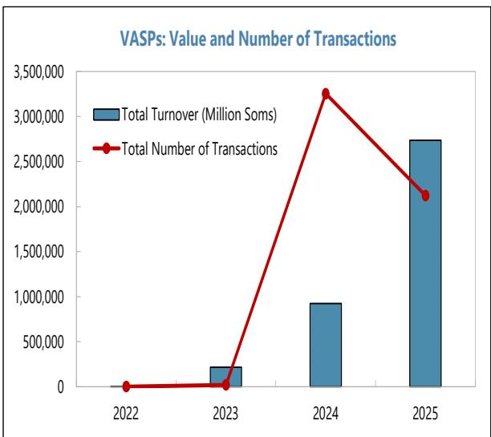

4. Rapid growth of the VA and VASP sectors requires an up-to-date understanding of evolving ML/TF risks, with a focus on analysis of the Kyrgyz Republic's financial sector's exposures. The 2023 sectoral VASP assessment provided an analytical foundation using comprehensive methodology, but the sector's fast evolution both in the scale and nature of activity renders some conclusions outdated. For example, the 2023 assessment found that approximately half of customers were non-residents prior to the recent substantial expansion driven by non-resident activity. The authorities should conduct an expedited update of the VA/VASP risk assessment, with particular emphasis on linkages to the banking sector. Specifically, the risk assessment should determine current levels of VASP activity through financial institutions in Kyrgyz Republic, including the on- and off-ramping, volumes of cash transactions, concentration of VASP business in specific institutions, and risk mitigation measures applied by banks. Analysis of the latest VASP transaction data would allow identification of changes in customer base, share of cross-border and non-resident activity, geographic counterparties, and potential red flags to integrate in the national and supervisory risk-based AML/CFT approach.

5. The updated VA/VASP sectoral risk assessment is fundamental to informing risk-based AML/CFT approach on the national level and to supervision of VASPs and banks. The State Financial Supervision Service (SFSS), a supervisor for VASPs, has developed the key components of the toolkit for risk-based supervision, such as data collection from VASPs and risk scoring for individual VASPs based on their business model, client base, transaction profile, and compliance quality, although no VASPs were rated at the highest, "critical" risk level. The risk-based toolkit for VASP supervision should be strengthened, informed by the updated VA/VASP sectoral assessment, with a deeper focus on cross-border activity and geographic ML/TF risk factors. The NBKR should continue integration of VA and VASP-related risk factors into its AML/CFT supervision of banks, including a dedicated focus on VASPs as higher risk clients of banks.

6. Current supervisory resources dedicated to VASPs are insufficient considering the scale of activity and the number of licensed VASPs. The SFSS has 4 staff positions allocated to VASP supervision, but only two staff are currently available. This significant imbalance between the number of VASP supervisory staff and the number of supervised entities needs to be urgently corrected to support implementation of core supervisory functions at a frequency and depth appropriate to the sector's scale and number of supervised entities. Considering the rapid growth of the VASP sector in the last two years, oversight of the VASP sector would be strengthened by a formal supervisory strategy with minimum engagement model feasible given the resource constraints, outlining the minimum supervisory actions for each VASP risk level.

7. Recent changes in the institutional arrangements for VASP regulation and supervision pose challenges to supervisory effectiveness. Recent amendments removed the licensing, policy development, regulatory, and sanctioning functions related to VASPs from the State Financial Supervision Service (SFSS), which now retains only the supervision mandate. These functions have been allocated to a different state agency, creating a fragmented institutional framework and requiring close and effective inter-agency coordination. The separation of supervision from market entry and enforcement powers poses a challenge to effectiveness of VASP supervision. $^{4}$ Licensing provides supervisors with essential information about the ownership structure, business model, risk profile, and internal control systems of VASP applicants, contributing to an effective risk-based supervisory approach from the outset. Supervisory involvement in licensing allows application of their sectoral risk understanding to assess the suitability of applicants, identify red flags, and impose tailored licensing conditions that reflect the specific risk exposures of each entity. Moreover, the ability to deny licenses based on risk considerations, such as opaque ownership structures, inadequate AML/CFT controls, or high-risk business models, is an important preventive tool, without which the supervisors may be forced to oversee entities they would not have approved, limiting their ability to shape the risk profile of the sector proactively. Similarly, ability to sanction identified AML/CFT breaches is critical for a supervisor to credibly address and dissuade high risk activities. In addition, combining the licensing function with a development mandate aimed at promoting the growth of the VASP sector may raise questions regarding the prioritization of objectives and credibility of VASP market entry controls.

8. Recent reforms have strengthened the regulatory framework for VASPs, which should be followed by strengthened measures to ensure fitness and propriety of VASPs' owners and managers. The extension of licensing requirements to beneficial owners of VASPs in 2025 addresses a key technical compliance gap with the FATF Standards. Considering that the current license holders received the license under the earlier regime, review of the fitness and propriety of senior management and beneficial owners of existing VASP should be a supervisory priority. Fitness and propriety tests should use a wider range of sources, including information requests to supervisors abroad, considering global operations and transnational business models of VASPs. The supervisors should also use an appropriate burden of proof in these tests, in which reasonable doubts about the honesty and integrity of senior management and owners should lead to the applicant or license rejection. The withdrawal of 26 licenses over the last three years and no rejected applications on AML/CFT grounds suggest a scope for more robust scrutiny at the licensing stage.

9. Cross-border payment flows through the banking sector in Kyrgyz Republic have also grown strongly and are not fully explained by the main macro-economic fundamentals. The cross-border financial flows have quadrupled since 2022, including with higher risk countries as identified in the NRA, and the outlier patterns identified by the staff. Detection and mitigation of cross-border risks would benefit from national monitoring of payments macro-trends, building on the existing interagency AML/CFT coordination. The accelerated growth, evolving patterns and appearance of new corridors of cross-border payments require an up-to-date understanding of their drivers and risk implications as well as coordinated policy and operational responses.

## C. Trade in Controlled Goods: Monitoring and Enforcement

10. Cross-border trade has grown rapidly and is a key economic growth driver since 2022 with substantial transit and re-export activity. As a trade and logistics hub, Kyrgyz Republic faces risks related to misrepresentation of goods or routing, unauthorized re-export and diversion of controlled goods subject to the national export control regime to unauthorized parties. The rapid increase in re-export activity, partially reflected in balance-of-payments errors and omissions of 17 percent of GDP in the first three quarters of 2025, highlights the materiality of the diversion risks. Controlled goods entering the Kyrgyz Republic may be diverted to third countries in violation of license terms, re-exported without proper authorization, or transshipped through complex routing to obscure ultimate destinations. In addition, smuggling and corruption vulnerabilities exacerbate the risks related to trade in controlled goods.

11. Resources dedicated to monitoring implementation of restrictions for trade in controlled goods have not kept pace with the growth in trade and associated risks. National legislation establishes licensing frameworks for export controls, and the National Control List underwent updates in consultation with international partners, also including goods on the Common High Priority List. The Customs Service has incorporated the risks factors related to the trade in controlled goods into their risk-based customs inspections. However, limited resources constrain the development of the regime to effectively monitor implementation of the export control framework. Specifically, the increase in staffing in the Division of export control and licensing of the Ministry of Economy to 6 persons is not commensurate with the high rates of growth in trade. While the authorities conducted relevant trainings and joined capacity development initiatives, effective export control administration requires dedicated staff and engagement of specialized sectoral skills, particularly for the identification and classification of controlled goods.

12. Effective export control regime requires strengthening post-clearance monitoring targeting highest-risk transactions. The current export control regime focuses on the licensing stage and would benefit from dedicated resources to verify adherence to the license conditions. Exporters are required to provide guarantee letters (end-user certificates) and the authorities,

despite the staffing constraints, have experience of conducting several on-site inspections to confirm end-use in line with the licensing conditions, but the extent of post-clearance controls is disproportionate relative to the licensing activity in recent years. Post-clearance monitoring of implementation of licensing conditions could leverage a risk-based approach, including reviews of import and re-export transactions involving high-risk controlled goods; trading companies with minimal domestic footprint (e.g., no taxes or fees paid); customs declarations not matching declared licensing purposes; entities with non-resident beneficial owners or complex offshore structures. A developed risk-based approach would enable the authorities to maximize the deterrent effect while remaining operationally feasible given the resource constraints and minimizing the trade frictions.

13. Accelerating digitalization and inter-agency information exchange is essential to detect risks related to the trade in controlled goods, considering rapidly increasing trade turnover and insufficient staffing. The 2030 digitalization strategy appropriately includes these reforms, but implementation should be accelerated and prioritized for controlled goods given rapid growth in trade, its importance as a driver of growth as well as associated risks. Specifically, digitalization and automatic exchange of information between the customs databases with the licensing records is instrumental to verify compliance. The detection capabilities of the currently fragmented post-clearance monitoring system, based on manual transaction-by-transaction paper exchange, would benefit from accelerated development of digital systems for cross-referencing the customs data with: (i) tax filings (to identify shell companies with no operations); (ii) FIU reporting (to detect trading companies with suspicious payment patterns); and (iii) beneficial ownership registry (to understand control structures). Recently established Beneficial Ownership Registry holds significant potential to benefit a wide range of state functions and should be promptly operationalized.

## D. Potential Financial Integrity Risk Events and Macroeconomic Transmission Channels

14. A major financial integrity risk event related to elevated cross-border risks could have macro-critical consequences. A high-profile trigger event could bring ML/TF vulnerabilities into international focus and lead to reputational damage, loss of confidence and jurisdictional risk reclassification. $^{5}$ The main transmission channels with the potential to have macro-critical consequences in Kyrgyz Republic are the real sector (through the trade disruptions) and the external sector (through the decrease in capital and other inflows). Specifically, a financial integrity risk event could lead to reversal of the re-export trade resulting from redirection of trade away from Kyrgyz Republic by the foreign counterparts and disruption of trade settlement and trade finance, including delays, enhanced scrutiny, or refusals to process payments or provide financing. On the external side, the risk event could lead to international investors, multilateral and financial institutions de-

risking and restricting exposures to Kyrgyz Republic, which would negatively impact the capital and other inflows as well as banking sector liquidity due to the withdrawal of non-resident and high-risk deposits. $^{6}$ Pressure on already fragile correspondent banking network could result in further frictions in cross-border activity through increased costs and delays in transactions or loss of access by some financial institutions to FX services and cross-border payments. $^{7}$

15. Modeling a financial integrity shock, the economy would grow more slowly, the fiscal deficit would be larger, and the external position would be weaker. For the purposes of the annex, we illustrate the macroeconomic impact of a financial integrity shock, which might be triggered by the FATF grey-listing, media disclosures, or foreign law enforcement or supervisory actions against financial institutions, VASPs or companies registered in Kyrgyz Republic. Specifically, we assume: (i) a quarter reduction in imports meant for re-exports; (ii) a one-third decrease in FDI inflows; and (iii) a 15 percent decrease in private transfers, mostly remittances, into Kyrgyz Republic. These assumptions would result in: (i) lower GDP growth (from 6.1 percent in 2026 in the baseline to 4.9 percent following the AML shock); (ii) a higher budget deficit (from 3.8 percent to 4.6 percent); and (iii) lower reserves (from 3.2 months of prospective imports in 2031 in the baseline to 1.8 months in the AML shock model).

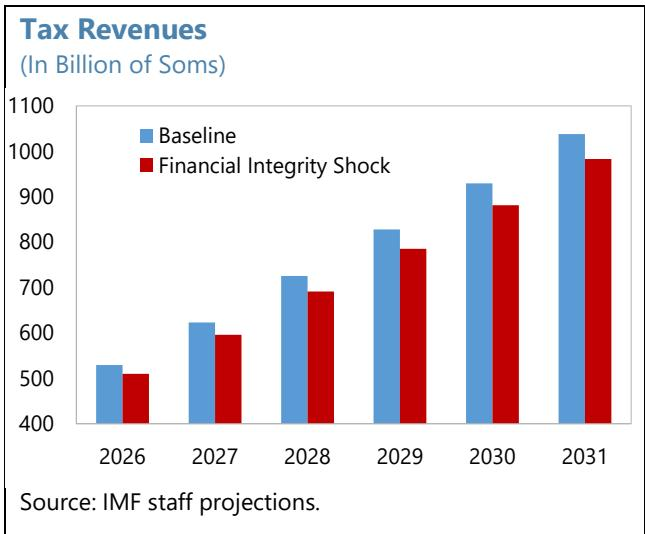

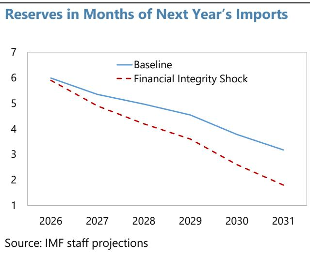

## KYRGYZ REPUBLIC

May 14, 2026

STAFF REPORT FOR THE 2026 ARTICLE IV CONSULTATION—INFORMATIONAL ANNEX

Prepared By

Middle East and Central Asia Department (In collaboration with other departments)

## CONTENTS

RELATIONS WITH THE FUND 2

RELATIONS WITH OTHER INTERNATIONAL INSTITUTIONS \_\_\_\_ 5

TECHNICAL ASSISTANCE PROVIDED BY THE FUND 6

## RELATIONS WITH THE FUND

(As of March 31, 2026)

<table><tr><td colspan="2">Membership Status: Joined: May 8, 1992</td><td>Article VIII</td></tr><tr><td>General Resources Account:</td><td>SDR million</td><td>Percent of Quota</td></tr><tr><td>Quota</td><td>177.60</td><td>100.00</td></tr><tr><td>Fund Holdings of Currency (Exchange Rate)</td><td>177.24</td><td>99.80</td></tr><tr><td>Reserve Tranche Position</td><td>0.49</td><td>0.27</td></tr><tr><td>SDR Department:</td><td>SDR million</td><td>Percent Allocation</td></tr><tr><td>Net Cumulative Allocation</td><td>254.96</td><td>100.00</td></tr><tr><td>Holdings</td><td>215.73</td><td>84.62</td></tr><tr><td>Outstanding Purchases and Loans:</td><td>SDR million</td><td>Percent of Quota</td></tr><tr><td>RCF Loans</td><td>50.32</td><td>28.33</td></tr><tr><td>ECF Arrangements</td><td>10.47</td><td>5.89</td></tr></table>

Latest Financial Arrangements:

<table><tr><td>Type</td><td>Date of Arrangement</td><td>Expiration Date</td><td>Amount Approved (SDR million)</td><td>Amount Drawn (SDR million)</td></tr><tr><td>ECF</td><td>April 8, 2015</td><td>April 7,2018</td><td>66.60</td><td>57.08</td></tr><tr><td>ECF</td><td>June 20, 2011</td><td>July 7, 2014</td><td>66.60</td><td>66.60</td></tr><tr><td>ESF</td><td>December 10, 2008</td><td>June 9, 2010</td><td>66.60</td><td>33.30</td></tr></table>

Outright Loans:

<table><tr><td></td><td>Date of Arrangement</td><td>Expiration Date</td><td>Amount Approved (SDR million)</td><td>Amount Drawn (SDR million)</td></tr><tr><td>RFI</td><td>May 08, 2020</td><td>May 11, 2020</td><td>59.20</td><td>59.20</td></tr><tr><td>RCF</td><td>May 08, 2020</td><td>May 12, 2020</td><td>29.60</td><td>29.60</td></tr><tr><td>RCF</td><td>Mar 26, 2020</td><td>Mar 30, 2020</td><td>29.60</td><td>29.60</td></tr></table>

## Projected Payments to the Fund 1/

(SDR million; based on existing use of resources and present holdings of SDRs):

<table><tr><td rowspan="2"></td><td colspan="5">Forthcoming</td></tr><tr><td>2026</td><td>2027</td><td>2028</td><td>2029</td><td>2030</td></tr><tr><td>Principal</td><td>15.54</td><td>15.65</td><td>11.84</td><td>11.84</td><td>5.92</td></tr><tr><td>Charges/Interest</td><td>0.80</td><td>1.09</td><td>1.09</td><td>1.09</td><td>1.09</td></tr><tr><td>Total</td><td>16.34</td><td>16.73</td><td>12.93</td><td>12.93</td><td>7.01</td></tr></table>

$^{1/}$ When a member has overdue financial obligations outstanding for more than three months, the amount of such arrears will be shown in this section.

## Status of HIPC and MDRI Assistance

On November 30, 2011, the Executive Board considered the addition of income and indebtedness criteria for end-2010 to the HIPC Initiative framework, which resulted in the removal of the Kyrgyz Republic from the ring-fenced list of eligible countries.

## Safeguards Assessments

An update assessment of the National Bank of the Kyrgyz Republic (NBKR) in connection with the emergency financing under the RFI/RCF disbursements, approved by the IMF Executive Board in March and May 2020, was completed on January 13, 2021. The assessment found that the shortcomings in the legal framework of the NBKR as reported in the previous assessment had not been addressed and recommended amendments to the NBKR law.

The Parliament of the Kyrgyz Republic amended the NBKR law in 2022, but did not fully address the 2020 Safeguards Assessment recommendations. The amended law envisages a proper recapitalization and profit distribution mechanisms, which is an important accomplishment, but does not introduce a majority of non-executive members of the NBKR Board and the Audit Committee, or provisions to wind down non-core central bank operations. In addition, the laws passed by Parliament in each of the last four years suspended the provisions of the NBKR law on profit distribution to allow for transfers of NBKR's profit to the budget even though NBKR capital fell below the statutory floor.

## Exchange Rate Arrangements

The de jure exchange rate arrangement is a floating arrangement. The NBKR participates and intervenes in the interbank foreign exchange market to limit exchange rate volatility as necessary. During 2025, the flexibility of the exchange rate against the U.S. dollar was limited. The de facto classification of the exchange rate arrangement is “crawl-like” and has remained unchanged since October 21, 2022.

The NBKR publishes daily the exchange rate of the som in terms of the U.S. dollar, which is determined in the interbank foreign exchange market. The official exchange rate of the som against the dollar is calculated as the daily weighted average of the exchange rates used in the purchase and sale transactions of dollars conducted in the foreign exchange market through the Automated Trading System (ATS) of the NBKR for the reporting period from 3:00 pm of the previous trading day to 3:00 pm of the current trading day. The official exchange rate becomes effective from the next working day. The government uses the official exchange rate for budget and tax accounting purposes as well as for all payments between the government and enterprises and other legal entities.

The Kyrgyz Republic accepted the obligations under Article VIII, Section 2, 3, and 4 of the IMF's Articles of Agreement and maintains exchange system free of multiple currency practices and restrictions on the making of payments and transfers for current international transactions, except for the exchange restrictions for security reasons related to restrictions of financial transactions and the freeze of accounts of certain individuals or organizations associated with terrorism pursuant to (i) relevant U.N. Security Council resolutions; and (ii) the list of current terrorist organizations designated by the U.S. Secretary of State. The authorities have notified these measures to the Fund in May 2007 pursuant to Executive Board decision No. 144-(52/51).

## Article IV Consultations

The Kyrgyz Republic is on a 12-month consultation cycle. The 2025 Article IV consultation discussions were held in March 2025 and were completed by the Executive Board in May 2025.

## FSAP Participation and ROSC Assessment

An FSAP update mission in July 2013 reviewed progress since the 2007 assessment, and the Board discussed the Financial System Stability Assessment (FSSA) along with the fifth ECF review in December 2013. The FSSA was not published. A fiscal ROSC mission was held in March 2001 and the ROSC Fiscal Transparency Module was published on March 13, 2002. A data ROSC mission was held in November 2002 and the ROSC Data Module was published in November 2003. A fiscal ROSC reassessment was held in September 2007.

## Resident Representative

The twelfth resident representative of the Fund in the Kyrgyz Republic, Mr. Farid Talishli, took his post in Bishkek in July 2023.

# RELATIONS WITH OTHER INTERNATIONAL INSTITUTIONS

## (As of March 27, 2026)

## Asian Development Bank:

• Country page: https://www.adb.org/countries/kyrgyz-republic/main

• ADB projects and results: https://www.adb.org/projects/country/kyrgyz-republic/results

## European Bank for Reconstruction and Development:

• Country page: https://www.ebrd.com/kyrgyz-republic.html

\- EBRD projects: https://www.ebrd.com/work-with-us/project-finance/project-summary-documents.html?1=1&filterCountry=Kyrgyz%20Republic

## World Bank Group:

• Country page: https://www.worldbank.org/en/country/kyrgyzrepublic

\- Overview of Word Bank Group lending: https://financesapp.worldbank.org/countries/Kyrgyz%20Republic/

• IBRD-IDA project operations:

http://projects.worldbank.org/search?lang=en&searchTerm=&countrycode exact=KG

## TECHNICAL ASSISTANCE PROVIDED BY THE FUND

## (January 2014 – March 2026)

<table><tr><td>IMF Dept.</td><td>Type of Mission</td><td>Mission Dates</td><td>Requestor</td></tr><tr><td>FAD</td><td>Tax Administration Enforcement (Module 6—TPA TTF)</td><td>January 8–22, 2014</td><td>Ministry of Finance, State Tax Service, State Customs Service</td></tr><tr><td></td><td>Public Finance Management</td><td>May 2–13, 2014</td><td>Ministry of Finance</td></tr><tr><td></td><td>Public Finance Management</td><td>December 5–18, 2014</td><td>Ministry of Finance</td></tr><tr><td></td><td>Public Finance Management</td><td>April 23–May 7, 2015</td><td>Ministry of Finance</td></tr><tr><td></td><td>Tax Policy (Impact of the Accession to the EEU)</td><td>April 29–May 13, 2015</td><td>Ministry of Economy</td></tr><tr><td></td><td>Public Finance Management (Fiscal risk disclosure)</td><td>September 17–October 1, 2015</td><td>Ministry of Finance</td></tr><tr><td></td><td>Public Investment Management Assessment Information-Gathering</td><td>December 14–16, 2015</td><td>Ministry of Finance, Ministry of Economy</td></tr><tr><td></td><td>Public Investment Management Assessment</td><td>January 27–February 10, 2016</td><td>Ministry of Finance, Ministry of Economy</td></tr><tr><td></td><td>Managing Government Wage Expenditure</td><td>March 15–28, 2016</td><td>Ministry of Finance, Ministry of Labor</td></tr><tr><td></td><td>Treasury and Accounting Reform and Fiscal Risks Disclosure</td><td>September 19–30, 2016</td><td>Ministry of Finance</td></tr><tr><td></td><td>Government Subsidies Review: Energy Subsidy and Social Protection</td><td>February 22–March 7, 2017</td><td>Ministry of Finance</td></tr><tr><td></td><td>Treasury and Accounting Reform and Fiscal Risks Disclosure</td><td>April 17–27, 2017</td><td>Ministry of Finance</td></tr><tr><td></td><td>A Rules-Based Fiscal Framework</td><td>June 13–26, 2017</td><td>Ministry of Finance</td></tr><tr><td></td><td>Financial Management Information System Strategy</td><td>July 14–25, 2017</td><td>Ministry of Finance</td></tr><tr><td></td><td>Amend the Budget Code to Support the New Fiscal Rules System</td><td>December 11-15, 2017</td><td>Ministry of Finance</td></tr><tr><td></td><td>Incorporation of Fiscal Rules in the Budget Code</td><td>December 11-15, 2017</td><td>Ministry of Finance</td></tr><tr><td></td><td>Use of IT in Budget Preparation</td><td>September 8–October 2, 2020 (virtual)</td><td>Ministry of Finance</td></tr><tr><td></td><td>Review the New Draft Tax Code</td><td>October 6, 2021 (virtual)</td><td>Ministry of Economy and Commerce</td></tr><tr><td></td><td>Implementing the Results Based Budgeting</td><td>June 22- July 5, 2022</td><td>Ministry of Finance</td></tr><tr><td></td><td>SOE oversight and performance management</td><td>November 22 – December 5, 2022</td><td>State Property Management Fund</td></tr><tr><td></td><td>Select Taxation Issues</td><td>June 20 – July 4, 2023</td><td>State Tax Service</td></tr><tr><td></td><td>State Owned Enterprises Fiscal Risks</td><td>November 13-24, 2023</td><td>Ministry of Finance and State Agency Management of Property</td></tr><tr><td></td><td>Wage Bill: Scoping Mission</td><td>November 18 - 25, 2024</td><td>Ministry of Finance</td></tr><tr><td></td><td>Revenue Administration</td><td>March 03- April 30 2025</td><td>Ministry of Finance</td></tr><tr><td></td><td>Fiscal Risks</td><td>October 12-22, 2025</td><td>Ministry of Finance, State Property Management Fund</td></tr><tr><td></td><td>Public Wage Bill</td><td>November 1-7, 2025</td><td>Ministry of Finance</td></tr><tr><td></td><td>Public Investment Management Assessment</td><td>February 18-March 3, 2026</td><td>Ministry of Finance</td></tr><tr><td></td><td>Public Wage Bill</td><td>March 30-April 1, 2026</td><td>Ministry of Finance</td></tr><tr><td>MCM</td><td>Operational Advice on Improving the Monetary Policy Framework</td><td>February 3–14, 2014</td><td>National Bank of the Kyrgyz Republic</td></tr><tr><td></td><td>Operational Advice on Improving the Monetary Policy Framework</td><td>April 20–28, 2015</td><td>National Bank of the Kyrgyz Republic</td></tr><tr><td></td><td>Strengthening Near-Term Modeling and Forecasting Capacities</td><td>April 18–29, 2016</td><td>National Bank of the Kyrgyz Republic</td></tr><tr><td></td><td>Medium-Term Debt Management Strategy</td><td>April 20–28, 2016</td><td>Ministry of Finance</td></tr><tr><td></td><td>Strengthening Banking Supervision</td><td>May 24–June 1, 2016</td><td>National Bank of the Kyrgyz Republic</td></tr><tr><td></td><td>Monetary Policy and Inflation Targeting Framework</td><td>April 10–25, 2017</td><td>National Bank of the Kyrgyz Republic</td></tr><tr><td></td><td>IFRS 9 Training for NBKR Banking Supervisors</td><td>May 29–June 2, 2017</td><td>National Bank of the Kyrgyz Republic Banking Supervisors</td></tr><tr><td></td><td>Monetary Policy and Inflation Targeting Framework – Follow Up</td><td>April 4–13, 2018</td><td>National Bank of the Kyrgyz Republic</td></tr><tr><td></td><td>Inflation Targeting</td><td>October 29–November 14, 2018</td><td>National Bank of the Kyrgyz Republic</td></tr><tr><td></td><td>Cyber Security</td><td>March 6–20, 2019</td><td>National Bank of the Kyrgyz Republic</td></tr><tr><td></td><td>Inflation Targeting</td><td>September 2019</td><td>National Bank of the Kyrgyz Republic</td></tr><tr><td></td><td>Covid-19: Implications on Asset Classification and Provisioning (virtual)</td><td>June 17-26, 2020</td><td>National Bank of the Kyrgyz Republic</td></tr><tr><td></td><td>Inflation Targeting (virtual)Capacity development – Central bank policy and operations (remote)</td><td>August-September 2020January-March 2021</td><td>National Bank of the Kyrgyz RepublicNational Bank of the Kyrgyz Republic</td></tr><tr><td></td><td>Monetary Policy and Operational Framework (virtual)</td><td>October 8-November 11, 2021</td><td>National Bank of the Kyrgyz Republic</td></tr><tr><td></td><td>Central Bank Operations-Monetary Policy Implementation</td><td>October 3 – October 7, 2022</td><td>National Bank of the Kyrgyz Republic</td></tr><tr><td></td><td>Enhancing Monetary Operations</td><td>October 23 – November 3, 2023</td><td>National Bank of the Kyrgyz Republic</td></tr><tr><td></td><td>Medium-Term Debt Management Strategy</td><td>June 17 - 28, 2024</td><td>Ministry of Finance</td></tr><tr><td></td><td>IFRS 9: A Supervisory Perspective</td><td>September 25- October 1, 2024</td><td>National Bank of the Kyrgyz Republic</td></tr><tr><td></td><td>Enhancing Security Market: Scoping Mission</td><td>December 10- 16, 2024</td><td>Ministry of Finance</td></tr><tr><td>MCM/LEG</td><td>Central bank digital currency (virtual)</td><td>January 15-April 20, 2021</td><td>National Bank of the Kyrgyz Republic</td></tr><tr><td>MCM/ITD/ LEG</td><td>Central bank digital currency (virtual)</td><td>July 20 – November 30, 2021</td><td>National Bank of the Kyrgyz Republic</td></tr><tr><td>MCM/LEG</td><td>Assessing, Regulating, and Supervising the Crypto Market in the Kyrgyz Republic</td><td>October 22-Novemeber 2, 2025</td><td>National Bank of the Kyrgyz Republic</td></tr><tr><td>LEG</td><td>AML/CFT Follow-up</td><td>February 2014</td><td>National Bank of the Kyrgyz Republic, State Financial Intelligence Service, and Public Prosecutor</td></tr><tr><td></td><td>AML/CFT Follow-up</td><td>January 2015</td><td>National Bank of the Kyrgyz Republic, State Financial Intelligence Service, and Public Prosecutor</td></tr><tr><td></td><td>AML/CFT Follow-up</td><td>June 2015</td><td>National Bank of the Kyrgyz Republic, State Financial Intelligence Service, and Public Prosecutor</td></tr><tr><td></td><td>AML/CFT Follow-up</td><td>October-November 2015</td><td>National Bank of the Kyrgyz Republic, State Financial Intelligence Service, and Public Prosecutor</td></tr><tr><td></td><td>AML/CFT Follow-up</td><td>January 2016</td><td>National Bank of the Kyrgyz Republic, State Financial Intelligence Service, and Public Prosecutor</td></tr><tr><td></td><td>AML/CFT Follow-up</td><td>April 2016</td><td>National Bank of the Kyrgyz Republic, State Financial Intelligence Service, and Public Prosecutor</td></tr><tr><td></td><td>AML/CFT risk-based supervision and SFIS IT workflow procedures</td><td>June/July 2016</td><td>National Bank of Kyrgyz Republic, State Financial Intelligence Service</td></tr><tr><td></td><td>IT (setting up analytical reporting software)</td><td>August 2016</td><td>State Financial Intelligence Service</td></tr><tr><td></td><td>AML/CFT risk-based supervision (IMF/WB mission)</td><td>October 2016</td><td>National Bank of Kyrgyz Republic</td></tr><tr><td></td><td>Legal Frameworks for Bank Resolution</td><td>September 20–22, 2017</td><td>National Bank of the Kyrgyz Republic, Ministry of Justice</td></tr><tr><td></td><td>AML/CFT supervision (WB/IMF workshop)</td><td>October 3–7, 2017</td><td>National Bank of the Kyrgyz Republic</td></tr><tr><td></td><td>AML/CFT Legal drafting</td><td>February 2018</td><td>State Financial Intelligence Service</td></tr><tr><td></td><td>AML/CFT Legal drafting</td><td>July 2018</td><td>State Financial Intelligence Service</td></tr><tr><td></td><td>AML/CFT supervision (WB/IMF workshop)</td><td>October 2018</td><td>National Bank of Kyrgyz Republic</td></tr><tr><td></td><td>AML/CFT Legal Reform</td><td>September 2025</td><td>State Financial Intelligence Service</td></tr><tr><td></td><td>Strengthen the Effectiveness of Combating the Financing of Terrorism Framework Including Enhancing Capacity of Various Stakeholders</td><td>January 13-22, 2026</td><td>Financial Intelligence Service</td></tr><tr><td>LEG/FIN</td><td>Safeguards-Related Issues: proposals to strengthen the central bank's governance</td><td>July 9-11, 2018</td><td>National Bank of Kyrgyz Republic</td></tr><tr><td>LEG/ FIN</td><td>Assessment of safeguards-related areas (remote)</td><td>October 19 – 30, 2020</td><td>National Bank of Kyrgyz Republic</td></tr><tr><td>STA</td><td>Price Statistics</td><td>March 31–April 11, 2014</td><td>National Statistics Committee</td></tr><tr><td></td><td>External Sector Statistics</td><td>February 16–27, 2015</td><td>National Bank of the Kyrgyz Republic</td></tr><tr><td></td><td>Monetary and Financial Statistics</td><td>April 15–28, 2015</td><td>National Bank of the Kyrgyz Republic</td></tr><tr><td></td><td>External Sector Statistics</td><td>October 26–November 6, 2015</td><td>National Bank of the Kyrgyz Republic</td></tr><tr><td></td><td>External Sector Statistics</td><td>April 4–15, 2016</td><td>National Bank of the Kyrgyz Republic</td></tr><tr><td></td><td>Quarterly National Accounts</td><td>April 11–16, 2016</td><td>National Statistics Committee</td></tr><tr><td></td><td>Government Finance Statistics</td><td>April 11–22, 2016</td><td>Ministry of Finance</td></tr><tr><td></td><td>Monetary and Financial Statistics</td><td>April 13–26, 2016</td><td>National Bank of the Kyrgyz Republic</td></tr><tr><td></td><td>National Account EDDI2</td><td>April 17–28, 2017</td><td>National Statistical Committee</td></tr><tr><td></td><td>Government Finance Statistics (Training)</td><td>April 24–May 5, 2017</td><td>Ministry of Finance, the National Bank of Kyrgyz Republic, National Statistical Committee, and the Social Fund</td></tr><tr><td></td><td>National Accounts EDDI2</td><td>November 6–24, 2017</td><td>National Statistics Committee</td></tr><tr><td></td><td>Quarterly National Accounts</td><td>April 2–20, 2018</td><td>National Statistics Committee</td></tr><tr><td></td><td>Government Finance Statistics</td><td>October 23-27, 2018</td><td>Ministry of Finance</td></tr><tr><td></td><td>National Accounts EDDI2</td><td>November 12–23, 2018</td><td>National Statistics Committee</td></tr><tr><td></td><td>External Sector Statistics</td><td>June 24-July 5, 2019</td><td>National Bank of the Kyrgyz Republic</td></tr><tr><td></td><td>Government Finance Statistics</td><td>May 20-24, 2019</td><td>Ministry of Finance</td></tr><tr><td></td><td>Government Finance Statistics</td><td>September 30-October 11, 2019</td><td>Ministry of Finance</td></tr><tr><td></td><td>Government Finance Statistics</td><td>April 26-May 7, 2021 (virtual)</td><td>Ministry of Finance</td></tr><tr><td></td><td>Government Finance Statistics</td><td>December 6-17, 2021(virtual)</td><td>Ministry of Finance</td></tr><tr><td></td><td>Government Finance Statistics</td><td>April 24-29, 2022 (virtual)</td><td>Ministry of Finance</td></tr><tr><td></td><td>National Accounts</td><td>April 18 -22, 2022 (virtual)</td><td>National Statistics Committee</td></tr><tr><td></td><td>National Accounts</td><td>September 5 -16, 2022</td><td>National Statistics Committee</td></tr><tr><td></td><td>Government Finance Statistics</td><td>September 12 – 23, 2022</td><td>Ministry of Finance</td></tr><tr><td></td><td>National Accounts</td><td>September 18 – 29, 2023</td><td>National Statistics Committee</td></tr><tr><td></td><td>Government Finance Statistics</td><td>September 18 – 29, 2023</td><td>Ministry of Finance</td></tr><tr><td></td><td>National Accounts</td><td>February 26 - March 7, 2024</td><td>National Statistics Committee</td></tr><tr><td></td><td>National Accounts</td><td>May 27 - 31, 2024</td><td>National Statistics Committee</td></tr><tr><td></td><td>Government Finance Statistics</td><td>September 9-13, 2024</td><td>Ministry of Finance</td></tr><tr><td></td><td>National Accounts</td><td>February 3 – 14, 2025</td><td>National Statistics Committee</td></tr><tr><td></td><td>Government Finance</td><td>May 1, 2025-April 30, 2026</td><td>Ministry of Finance</td></tr><tr><td></td><td>Real Sector – National Accounts</td><td>September 9-19, 2025</td><td>National Statistics Committee</td></tr><tr><td></td><td>Government Finance Statistics</td><td>October 13-17, 2025</td><td>National Statistical Committee</td></tr><tr><td></td><td>National Accounts</td><td>March 23-27, 2026</td><td>National Statistical Committee</td></tr><tr><td>ICD</td><td>Quarterly Projection Model review and validation (1/2).</td><td>March 13 – 31, 2023</td><td>National Bank of the Kyrgyz Republic</td></tr><tr><td></td><td>Quarterly Projection Model review and validation (2/2).</td><td>August 28 – September 8, 2023</td><td>National Bank of the Kyrgyz Republic</td></tr><tr><td></td><td>Macroeconomic Framework Refresher</td><td>November 20 – December 1, 2023</td><td>National Bank of the Kyrgyz Republic</td></tr><tr><td>ICD/CCAMTAC</td><td>Financial Programming and Policy Workshop</td><td>January 26-30, 2026</td><td>National Bank of the Kyrgyz Republic</td></tr><tr><td colspan="4">List of Resident Advisors</td></tr><tr><td>FD</td><td>Banking Supervision/Restructuring Advisor</td><td>Mr. Svartsman</td><td>January 2004–January 2005</td></tr><tr><td>MFD</td><td>Public Debt Policy and Management</td><td>Mr. Azarbayejani</td><td>December 2002–December 2004</td></tr><tr><td>MCM</td><td>Debt Management and Development of Government Securities Management</td><td>Mr. Riecke</td><td>August 2006–June 2011</td></tr><tr><td>MCD</td><td>Macroeconomic Analysis and Forecasting</td><td>Mr. Petkov</td><td>January 2010–January 2011</td></tr><tr><td>MCM</td><td>Banking Supervision/Restructuring Advisor</td><td>Mr. Svartsman</td><td>October 2010–April 2013</td></tr><tr><td>LEG</td><td>Long-Term Banking Advisor</td><td>Mr. Zaveckas</td><td>August 2012–April 2014</td></tr><tr><td>MCM</td><td>Banking Supervision/Restructuring Advisor</td><td>Mr. Svartsman</td><td>July 2013–January 2014</td></tr><tr><td>MCM</td><td>Banking Supervision/Restructuring Advisor</td><td>Ms. Sonbul Iskender</td><td>January 2016–July 2019</td></tr></table>

# KYRGYZ REPUBLIC

May 14, 2026

## STAFF REPORT FOR THE 2026 ARTICLE IV CONSULTATION—DEBT SUSTAINABILITY ANALYSIS

Approved By
Subir Lall and Cemile
Sancak (IMF) and Abebe
Adugna and Manuela
Francisco (IDA)

Prepared by staffs of the International Monetary Fund and the International Development Association

<table><tr><td>Risk of external debt distress</td><td>Moderate</td></tr><tr><td>Overall risk of debt distress</td><td>Moderate</td></tr><tr><td>Granularity in the risk rating</td><td>Some space to absorb shocks</td></tr><tr><td>Application of judgment</td><td>No</td></tr></table>

Staff assess the Kyrgyz Republic's public debt as sustainable with moderate risks of external and overall debt distress. $^{1}$ There is a breach of the relevant thresholds for three out of four external debt ratios under the most extreme standard stress test (a standard shock to exports in all four cases). In addition, there is a breach of the benchmark for the PV of total public debt to GDP ratio under the most extreme standard shock (growth). However, under the baseline, the PV of public debt increases from 34.3 percent of GDP in 2025 to 38.1 percent by 2036, remaining below its benchmark and therefore consistent with a moderate risk of total debt distress. Similarly, none of the external debt ratios breach their thresholds under the baseline, leading to a moderate risk of external debt distress. Because the external debt burden indicators trend downward and the breaches are limited, staff assess external and total public debt to be sustainable. Creating fiscal space and containing debt vulnerabilities will require improving tax collection, sustaining efforts to reduce the wage bill and energy subsidies, strengthening debt management, seeking concessional financing and improving public investment management.

## PUBLIC DEBT COVERAGE

1. Public and Publicly Guaranteed (PPG) debt covers state government debt (both central and local government), state guarantees, and the debt of the central bank to the IMF (Text Table 1). All public sector debt is currently issued by the central government. Going forward, planned Eurobond issuances by two state-owned banks would introduce publicly guaranteed debt as a new component of public sector liabilities. The part of the 2021 SDR allocation that has been drawn down is counted toward public debt. Local governments have no external debt and insignificant domestic debt. The social security fund has no debt. State-owned enterprises (SOEs) mostly borrow from the government and, by law, do not incur external debt. SOEs short-term domestic borrowing from the banking sector is limited and do not have long-term domestic debt. In addition, the government has no outstanding external debt guarantees. $^{2}$ As of October 2025, there is no significant PPG debt for new companies created as Public-Private Partnerships. As in the previous DSA, given the large stock of liabilities associated with the energy sector (equivalent to around 15 percent of GDP in 2022 $^{3}$ ), and the 2024 conversion into depreciated equity of energy SOE debt, a contingent liability shock of 13 percent of GDP is applied, of which 8 percent of GDP are potential expenditures not included in the baseline, reflecting an operational risk stemming from the structural cash shortfalls of loss-making energy sector SOEs $^{4}$ despite recent tariff increases; and 5 percent of GDP is the default value representing the average cost to the government during a financial crisis (Text Table 2).

<table><tr><td colspan="3">Text Table 1. Kyrgyz Republic: Public Debt Coverage</td></tr><tr><td></td><td>Subsectors of the public sector</td><td>Sub-sectors covered</td></tr><tr><td>1</td><td>Central government</td><td>X</td></tr><tr><td>2</td><td>State and local government</td><td>X</td></tr><tr><td>3</td><td>Other elements in the general government</td><td></td></tr><tr><td>4</td><td>o/w: Social security fund</td><td></td></tr><tr><td>5</td><td>o/w: Extra budgetary funds (EBFs)</td><td></td></tr><tr><td>6</td><td>Guarantees (to other entities in the public and private sector, including to SOEs)</td><td>X</td></tr><tr><td>7</td><td>Central bank (borrowed on behalf of the government)</td><td>X</td></tr><tr><td>8</td><td>Non-guaranteed SOE debt</td><td></td></tr></table>

Text Table 2. Kyrgyz Republic: Combined Contingent Liability Shock

<table><tr><td colspan="2">1 The country&#x27;s coverage of public debt</td><td colspan="3">The central, state, and local governments, central bank, government-guaranteed debt</td></tr><tr><td></td><td></td><td>Default</td><td>Used for the analysis</td><td>Reasons for deviations from the default settings</td></tr><tr><td colspan="2">2 Other elements of the general government not captured in 1.</td><td>0 percent of GDP</td><td>0.0</td><td></td></tr><tr><td colspan="2">3 SoE&#x27;s debt (guaranteed and not guaranteed by the government) 1/</td><td>2 percent of GDP</td><td>8.0</td><td></td></tr><tr><td colspan="2">4 PPP</td><td>35 percent of PPP stock</td><td>0.0</td><td></td></tr><tr><td colspan="2">5 Financial market (the default value of 5 percent of GDP is the minimum value)</td><td>5 percent of GDP</td><td>5.0</td><td></td></tr><tr><td colspan="2">Total (2+3+4+5) (in percent of GDP)</td><td></td><td>13.0</td><td></td></tr></table>

Text Figure 3. External Debt Composition by Creditor at End -2025

## BACKGROUND

## 2. Public debt increased to 39.4 percent of GDP in 2025 from 36.2 percent of GDP in 2024

(Text Figure 1). This increase was driven by a rise in domestic debt. External debt declined from 24.9 percent of GDP to 23.6 percent of GDP, mainly reflecting strong nominal GDP growth and a broadly stable exchange rate. In contrast, domestic debt increased from 11.3 percent of GDP to 15.8 percent of GDP, largely driven by new lending to Government from Eldik Bank. Domestic public debt is held predominantly by commercial banks and the social security fund.

3. External debt continues to be predominantly denominated in US dollars and SDRs. These two currencies account for around 85 percent of nominal external debt at end-2025 (Text Figure 2). The euro accounts for less than 5 percent.

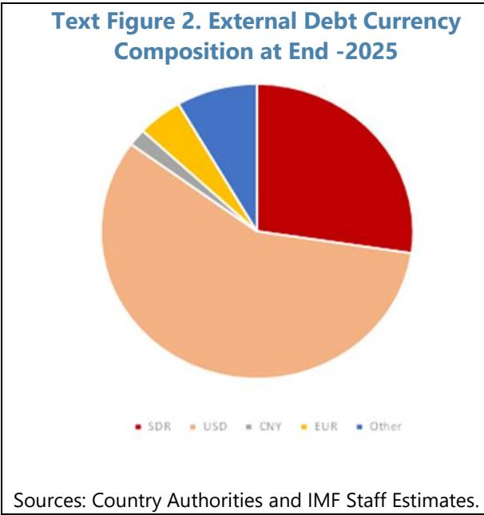  
Text Figure 1. Public Debt, 2015-2025 (Percent of GDP)

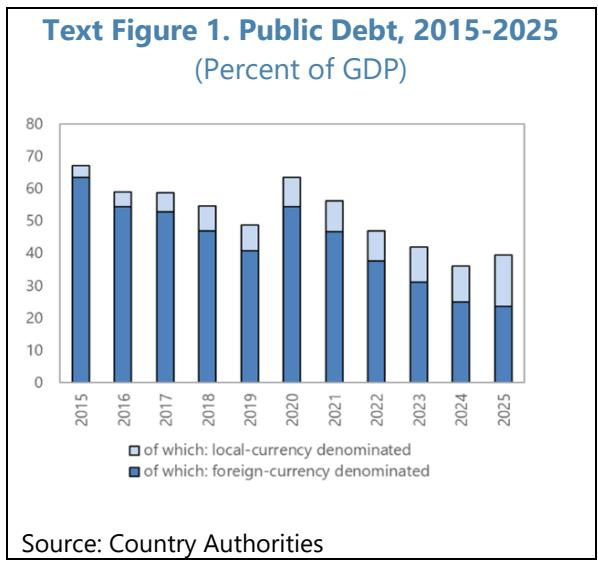  
Source: Country Authorities

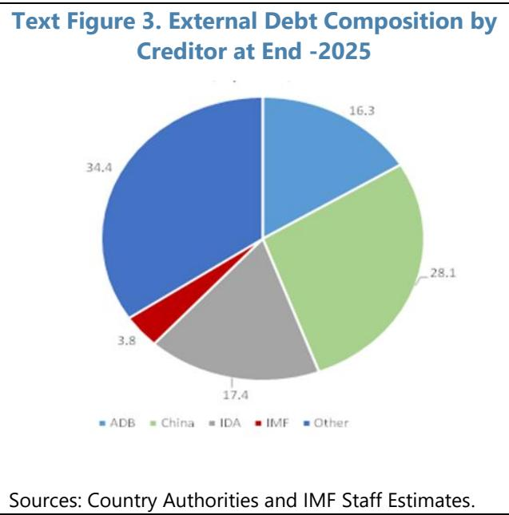

4. China remains the largest creditor at end 2025. $^{5}$ Official external debt owed to China accounts for 28.1 percent of total external debt, down from 36.5 percent at end 2024. The International Development Association (IDA–World Bank) accounts for over 17 percent of total external debt, followed by the Asian Development Bank (ADB) at over 16 percent (Text Figure 3). The IMF is owed 3.8 percent of the total, down from over 7 percent in 2024. As in the last DSA, the large creditors in the "Other" category include Japan, the Islamic Development Bank, other bilateral lenders, and the Eurasian Development Bank.

5. According to the Adaptation and Resilience assessment conducted for the Country Climate and Development Report (CCDR), the Kyrgyz Republic is vulnerable to climate shocks due to its mountainous terrain, significant agricultural production, and hydropower investment commitments. $^{6}$ On September 1, 2025, the authorities officially adopted the National Green Economy Development Program for 2025-29, which aims to strengthen the focus on green investments, enhance energy efficiency, and modernize the agricultural sector. The baseline reflects the current policy mix, including the implementation of the Kyrgyz Republic's climate strategy, of which the Kambarata hydro power plant is an important component.

## UNDERLYING ASSUMPTIONS

6. The macroeconomic outlook (Text Table 3) illustrates the economy's strong recent performance and robust prospects.

<table><tr><td></td><td>2026</td><td>2027</td><td>2028</td><td>2029</td><td>2030-32</td><td>2033-36</td><td>2037-46</td></tr><tr><td colspan="8">Real GDP growth (percent)</td></tr><tr><td>Current DSA</td><td>6.1</td><td>5.8</td><td>6.1</td><td>5.4</td><td>5.2</td><td>5.1</td><td>5.3</td></tr><tr><td>Previous DSA $^{1}$ </td><td>5.3</td><td>5.8</td><td>5.3</td><td>5.4</td><td>5.0</td><td>4.8</td><td>4.9</td></tr><tr><td colspan="8">Overall fiscal balance (percent of GDP)</td></tr><tr><td>Current DSA $^{2}$ </td><td>-3.8</td><td>-3.5</td><td>-3.6</td><td>-3.1</td><td>-2.7</td><td>-2.7</td><td>-2.7</td></tr><tr><td>Previous DSA $^{1}$ </td><td>-2.8</td><td>-3.2</td><td>-3.3</td><td>-2.7</td><td>-3.0</td><td>-2.6</td><td>-3.2</td></tr><tr><td colspan="8">Revenues and grants (percent of GDP)</td></tr><tr><td>Current DSA</td><td>33.4</td><td>31.4</td><td>31.2</td><td>31.1</td><td>30.7</td><td>30.1</td><td>29.1</td></tr><tr><td>Previous DSA $^{1}$ </td><td>31.8</td><td>31.4</td><td>31.4</td><td>31.1</td><td>30.6</td><td>30.1</td><td>29.2</td></tr><tr><td colspan="8">Public expenditure (percent of GDP)</td></tr><tr><td>Current DSA</td><td>37.2</td><td>35.0</td><td>34.8</td><td>34.2</td><td>33.3</td><td>32.8</td><td>31.8</td></tr><tr><td>Previous DSA $^{1}$ </td><td>34.6</td><td>34.7</td><td>34.7</td><td>33.8</td><td>33.7</td><td>32.6</td><td>32.5</td></tr><tr><td colspan="8">Net acquisition of financial assets, Gen. Gov. (percent of GDP)</td></tr><tr><td>Current DSA</td><td>2.3</td><td>-0.3</td><td>0.0</td><td>-0.1</td><td>0.5</td><td>0.3</td><td>0.4</td></tr><tr><td colspan="8">Net incurrence of liabilities, Gen. Gov. (percent of GDP)</td></tr><tr><td>Current DSA</td><td>6.2</td><td>3.2</td><td>3.5</td><td>3.0</td><td>3.1</td><td>3.0</td><td>3.1</td></tr><tr><td colspan="8">Current account balance (percent of GDP)</td></tr><tr><td>Current DSA</td><td>-7.3</td><td>-7.0</td><td>-6.2</td><td>-5.7</td><td>-5.3</td><td>-5.3</td><td>-4.9</td></tr><tr><td>Previous DSA $^{1}$ </td><td>-7.5</td><td>-8.5</td><td>-7.3</td><td>-7.0</td><td>-6.3</td><td>-5.7</td><td>-5.3</td></tr><tr><td colspan="8">Exports of goods and services (percent of GDP)</td></tr><tr><td>Current DSA</td><td>47.7</td><td>46.9</td><td>47.2</td><td>47.2</td><td>47.4</td><td>47.7</td><td>49.2</td></tr><tr><td>Previous DSA $^{1}$ </td><td>61.2</td><td>58.0</td><td>57.3</td><td>55.2</td><td>53.4</td><td>51.2</td><td>47.9</td></tr><tr><td colspan="8">Imports of goods and services (percent of GDP)</td></tr><tr><td>Current DSA</td><td>67.0</td><td>65.5</td><td>65.0</td><td>64.4</td><td>64.9</td><td>65.6</td><td>65.6</td></tr><tr><td>Previous DSA $^{1}$ </td><td>83.8</td><td>81.6</td><td>80.1</td><td>76.9</td><td>74.7</td><td>73.0</td><td>71.6</td></tr><tr><td colspan="8">PIP Disbursements (millions of US$)</td></tr><tr><td>Current DSA</td><td>362.2</td><td>447.9</td><td>582.4</td><td>574.7</td><td>609.3</td><td>566.6</td><td>701.7</td></tr><tr><td>Previous DSA $^{1}$ </td><td>355.1</td><td>506.8</td><td>565.5</td><td>605.4</td><td>607.6</td><td>476.3</td><td>691.4</td></tr><tr><td colspan="8">Reserves in months of prospective imports</td></tr><tr><td>Current DSA</td><td>6.0</td><td>5.4</td><td>5.0</td><td>4.5</td><td>3.2</td><td>2.3</td><td>3.1</td></tr><tr><td>Previous DSA $^{1}$ </td><td>2.9</td><td>2.7</td><td>2.6</td><td>2.5</td><td>2.3</td><td>2.0</td><td>1.4</td></tr></table>

\- Growth and inflation. Growth remained very strong in 2025 at 11.1 percent, extending the momentum of the previous three years, mainly driven by the continued expansion in trade and the robust activity in transport, communications, and construction. $^{7}$ Growth is projected to

moderate to 6.1 percent in 2026 as reexport trade-related activities plateau; it will remain modestly above potential through 2028, supported by the start of the large hydropower project and high construction activity, and converge to the potential in the medium and long term as the spillovers from Russia's invasion of Ukraine subside. Compared to the previous DSA, the stronger growth outlook reflects an upward revision to a higher potential output growth, which is now estimated at around 5.3 percent. $^{8}$ Inflation is projected to remain elevated in the near term—at 12.5 percent in 2026 and 10.5 percent in 2027—before gradually moderating to 6.5 percent by 2031.

\- Fiscal policy. The overall budget balance recorded surpluses for three consecutive years, at about 1.6, 2.0 and 2.6 percent of GDP in 2023, 2024 and 2025, respectively. During 2025, tax collection remained strong, reflecting continued revenue overperformance and a compositional shift away from VAT on imports toward corporate income tax and taxes on international trade, partly driven by the introduction of the simplified taxation regime as an alternative to the VAT. Non-tax revenues remained a key factor supporting the fiscal position, mainly driven by proceeds from the liquidation of seized assets and profit transfers from the NBKR. On the expenditure side, pressures reflected wage increases and higher-than-budgeted transfers to the Stabilization Fund, $^{9}$ while other spending categories remained broadly in line with budget allocations. Capitalization of SOEs—particularly in the banking and energy sectors—led to a significant increase in the net acquisition of financial assets and, in turn, higher financing needs. The fiscal balance is projected to shift into a deficit of 3.8 percent of GDP in 2026, following strong outcomes over the past three years. This deterioration reflects a large salary increase for education and health workers, and increased spending on major infrastructure projects outside the Public Investment Program (PIP), notably the Kambarata-1 hydropower plant and the China–Kyrgyzstan–Uzbekistan railway, alongside continued on-lending to loss-making energy SOEs, which authorities classify below the line (Box 1). In addition, planned capital injections into other SOEs and Eldik Bank are expected to add about 2.3 percent of GDP to financing needs. Even though gold accounts for around 2.5 percent of revenue, the deficit is further exacerbated by lower non-tax revenues and a modest decline in trade-related tax revenues. Over the medium term, claims on resources (including the net acquisition of financial assets) are projected to decline gradually as state-owned banks are expected to borrow directly from the markets, thus helping to anchor net financing needs below 3 and $\frac{1}{2}$ percent of GDP, despite rising interest payments.

\- External sector. The current account deficit is estimated to have reached 24.4 percent of GDP in 2025, which was partly offset by BoP errors and omissions of 17.2 percent of GDP. The latter reflect unrecorded re-exports to the Eurasian Customs Union (EACU), mostly from China to Russia, as intra-EACU trade is not subject to mandatory reporting and customs monitoring. Accounting for re-exports, the current account deficit would reach 7.5 percent of GDP in 2025 and 7.3 percent of GDP in 2026, with exports of locally-produced gold accounting for over 40 percent of all exports. It will decrease further to 5.3 percent by 2031 and remain around 5

percent by 2046. Gross international reserves are projected to decline from 6.0 months of imports to 3.2 months in 2031, and hover around 3.0 months by 2046.

## Box 1. Major Infrastructure Projects

\- The Kambarata-1 HPP is an energy project. The total cost of the project is estimated to be US\$4.5 billion, incurred between 2026-36. The Kambarata-1 HPP project will be financed and implemented jointly by the Kyrgyz Republic, Uzbekistan and Kazakhstan, based on a cooperation agreement between the governments of these three countries. The Kyrgyz Republic will contribute 34 percent and Uzbekistan and Kazakhstan 33 percent each. The projected fiscal balance in this DSA accounts for only Kyrgyz Republic's share in expected project costs.

\- The China-Kyrgyzstan-Uzbekistan (CKU) railway project is a significant infrastructure initiative aimed at enhancing connectivity and trade between China, Kyrgyzstan, and Uzbekistan. The cost of the project, which is designed to operate commercially and profitably, is estimated at US\$4.7 billion and expected to be built during 2026-32. The parties agreed to implement the project according to the TOT (construction - operation - transfer) model by creating a joint project company with the distribution of shares in the following proportions: 51% China Railway, 24.5% Kyrgyz side (SE NC Kyrgyz Temir Zholu), and 24.5% Uzbek side (Uzbekistan Railways). Financing of the project is expected to be carried out in the following proportions: 50% of financing will be equity, 50% will be borrowed funds (loans from Chinese financial institutions). It should be noted that the borrower will be the Joint Project Company (JSC). The projected fiscal balance in this DSA accounts for only Kyrgyz Republic's share in expected project costs.

• Financing assumptions. New external borrowing is assumed to reflect a mix of concessional and non-concessional financing. IDA loan disbursements are expected at US\$133.4 million in 2026 and to increase gradually to around US\$180 million in 2030 including disbursement for the construction of the Kambarata-1 HPP. IDA financing remains concessional, despite the hardened terms associated with allocations from the latest replenishment. The ADB is projected to provide US\$50 million as budget support and US\$55 million for projects in 2026, plus another US\$50 million and US\$70 million respectively in 2027. The ADB is projected to lend about US\$590 million between 2028-31 – the amounts include budgetary support, PIP external loans and support for the construction of the Kambarata-1 HPP.

\- A Eurobond issuance of US700 million took place in 2025. $^{10}$ Going forward, one large state-owned bank is expected to issue US500 million in 2026, followed by another state-owned bank issuing US300 million in 2027. In line with the authorities' plan to raise US1.7 billion in total, a further issuance of US200 million is assumed in 2028. In addition, a syndicated loan of US333 million on commercial terms (estimated at around 12 percent), to be mobilized in 2026 with IDA/MIGA guarantee support, is included in the baseline. Separately, about US1.2 billion in financing from China is projected over the next four years through various instruments to

support the railway project. Finally, the Government is projected to secure on average an additional US\$50 million per year in external loans over the medium term. These borrowings on less-than-concessional terms are expected to reduce the average concessionality of external debt over time. As external financing gradually declines, domestic debt is projected to replace external debt, including the Eurobond slated for amortization in 2030; the share of net domestic borrowing in total financing (excluding external amortization) is projected to increase from around 57 percent in 2031—when external project financing remains elevated—to about 65 percent by 2046. Domestic borrowing rates are assumed at 9–16 percent for maturities of 1 to 7 years in 2026, declining gradually to 9–13 percent by 2031 as domestic financial markets deepen.

## 7. Baseline projections are realistic:

\- Drivers of debt dynamics. The forecast error of the change in the ratio of public debt-to-GDP over the past five years has been significant (Figure 3). Total public debt in 2031 is expected to increase modestly to 41.3 percent of GDP in nominal terms, but only to 37.8 percent of GDP in PV terms – thanks to mostly concessional external borrowing. The gradual decline in the total public debt-to-GDP ratio beyond 2031 is explained by a narrowing of the general government deficit.

\- Realism of planned fiscal adjustment (Figure 4). The projected 3-year adjustment shows a deterioration of the primary balance due to the deterioration in tax revenue and a normalization of nontax revenue.

\- Consistency between fiscal adjustment and growth (Figure 4). The growth projection for 2026 is below the growth paths suggested by different fiscal multipliers, as recent growth performance is not expected to be sustained. The projected fiscal expansion for 2026 reflects the expected decline in trade-related tax revenue, the reversal to the norm of nontax revenue, and new infrastructure spending.

\- Consistency between public investment and growth (Figure 4). Medium- and long-term growth is projected at close to its potential rate of around 5.3 percent, which is consistent with the path for public investment.

## COUNTRY CLASSIFICATION AND STRESS TESTS

8. The Kyrgyz Republic's debt-carrying capacity has become strong for the first time (Text Table 4). The country's Composite Indicator (CI) index $^{11}$ is 3.15 for its most recent vintage, above the 3.05 threshold for strong debt-carrying capacity. The CI score has also remained above 3.05 in the previous two vintages, supporting a strong debt-carrying capacity assessment. $^{12}$ The current CI score is calculated based on the IMF World Economic Outlook (WEO) vintage of October 2025 and the World Bank's 2024 CPIA vintage. Strong debt-carrying capacity classification translates into the following external debt burden thresholds, which are higher than for the previous DSA: 240 percent of the present value (PV) of PPG external debt-to-exports ratio, 55 percent of the PV of PPG external debt-to-GDP, 21 percent of the PPG external debt service-to-exports, and 23 percent of the PPG external debt service-to-revenue. The total public debt benchmark is 70 percent of the PV of total public debt-to-GDP ratio.

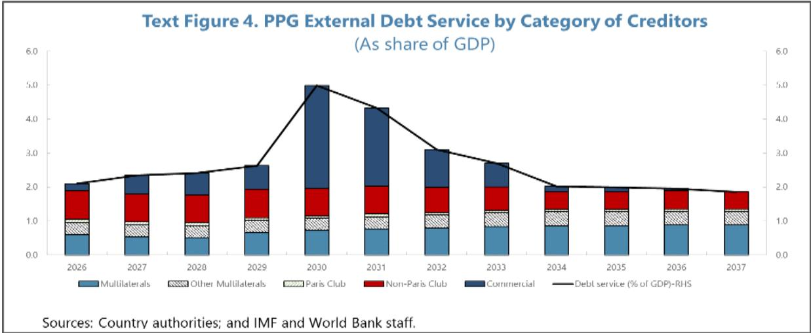  
Sources: Country authorities; and IMF and World Bank staff.

## EXTERNAL DSA

## 9. All four external debt ratios remain below their respective thresholds under the

5. All four external debt ratios remain below their respective thresholds under the baseline scenario (Figure 1, and Tables 1 and 3). External Public and Publicly Guaranteed (PPG) debt was 23.6 percent of GDP at end-2025 and private external debt was estimated at 20.9 percent of GDP. The latter is expected to decline to around 19.9 percent of GDP starting in 2026 as net external private borrowing is projected to grow less than nominal GDP. The PV of PPG external debt slightly decreased to 18.5 percent of GDP in 2025 (from 21.8 percent in the previous DSA, based on a lower nominal GDP). It is projected to decrease to 15.2 percent of GDP by end-2036 (well below the 55 percent threshold) on the back of decreasing external borrowing over the next ten years, and the amortization of Eurobonds between 2030 and 2033 . (Text Figure 4). The high residual up to 2025 is attributable to the high errors and omissions in the BOP, which are not projected onward (Table 1).

10. Three out of four external debt indicators breach their respective thresholds under the most extreme standard stress test (exports), with breaches occurring in the medium term. In particular, the PV of external debt-to-GDP ratio remains above its threshold during 2028–30 before declining. The debt service-to-exports ratio breaches its threshold in 2030–31 and again in 2033, while the debt service-to-revenue ratio breaches in 2030. These breaches reflect higher external

borrowing to finance infrastructure projects, less concessional borrowing terms associated with Eurobond issuances, and the historically high volatility of exports. All indicators under the most extreme standard stress tests begin to improve by 2034 and fall back below their respective thresholds by the end of the projection period (2036).

## PUBLIC DSA

11. The PV of debt-to-GDP ratio, used to assess the risk of total public debt distress, remains contained and below the benchmark despite a moderate increase under the baseline scenario (Figure 2 and Tables 2 and 4). Public debt increased from 36.2 percent of GDP in 2024 to 39.4 percent in 2025, reflecting the Eurobond issuance and high domestic financing needs despite strong nominal GDP growth. It increases further to 42.3 percent in 2026 due to continued high financing needs and rising interest payments (Text Table 4). Thereafter, the ratio stabilizes at around 41 percent of GDP over the medium term and decreases gradually to 39 percent by 2046. At the same time, the debt service-to-revenue ratio (including grants) rises from 12.3 percent in 2025 to 23.8 percent in 2031 and 2036, and around 29 percent by 2046, reflecting elevated domestic interest rates and higher external interest and amortization payments associated with non-concessional borrowing.

<table><tr><td colspan="8">Text Table 4. Kyrgyz Republic: Comparison of Debt Ratios 2026-36(in percent of GDP)</td></tr><tr><td></td><td>2026</td><td>2027</td><td>2028</td><td>2029</td><td>2030</td><td>2031</td><td>Long Term(2036)</td></tr><tr><td colspan="8">PPG external debt-to-GDP ratio</td></tr><tr><td>Current DSA</td><td>26.6</td><td>27.4</td><td>28.2</td><td>27.8</td><td>24.6</td><td>22.3</td><td>18.0</td></tr><tr><td>Previous  $\text{DSA}^1$ </td><td>30.8</td><td>31.9</td><td>33.3</td><td>32.8</td><td>32.3</td><td>32.4</td><td>17.6</td></tr><tr><td colspan="8">Public debt-to-GDP ratio</td></tr><tr><td>Current DSA</td><td>42.3</td><td>41.4</td><td>41.2</td><td>41.0</td><td>41.1</td><td>41.3</td><td>40.5</td></tr><tr><td>Previous  $\text{DSA}^1$ </td><td>39.5</td><td>40.3</td><td>41.2</td><td>41.3</td><td>41.9</td><td>43.4</td><td>43.5</td></tr><tr><td colspan="8">Sources: Kyrgyz authorities; and IMF and World Bank staff estimates and projections.1/ IMF Country Report No. 25/118, Kyrgyz Republic -- Staff Report for the 2025 Article IV Consultation -- Debt Sustainability Analysis.</td></tr></table>

12. As in the previous DSA, total public debt is vulnerable to a growth shock, which is the most extreme stress test. Under this shock, the PV of debt-to-GDP ratio breaches the benchmark of 70 percent by 2031 and continues a persistent upward trajectory thereafter. This shock also puts two other indicators on an upward path: the PV of debt-to-revenue ratio would reach over 300 percent by 2036, and the debt service-to-revenue ratio would reach over 53 percent also in 2036. Although no explicit benchmark exists for these two ratios, the projections point to potential debt vulnerabilities in the long run.

13. The projection of domestic public debt indicator for liquidity remains below the median for LIC DSF user countries, but the one for solvency increases above it (Figure 6). Over the medium-term (2026-32), the domestic debt-to-GDP ratio is projected to increase and remain above its historical range and the median of domestic debt-to-GDP ratios across countries using the

LIC DSF (17.1 percent), starting in 2031. The domestic public debt service-to-revenue ratio is projected to increase monotonously as of 2030, but will remain below the median of this ratio for countries using LIC DSF of (21.7 percent) over the entire forecast period.

14. Domestic debt management should be strengthened. The priority measures include revising the Debt Management Strategy in line with the standards of the MTDS framework, including its planned implementation through an Annual Borrowing Plan and Issuance Calendar; improving collaboration between the NBKR and the Ministry of Finance to strengthen liquidity management and forecasting; setting medium term targets for average Term-to-Maturity to design a better mix of domestic securities; defining debt management objectives within the Budget Code and the medium-term horizon of the cost and risk parameters; developing and publishing short-term yield curve based on NBKR notes and T-Bill auctions; lifting interest rate caps and yield change limits, and allowing full market price discovery in auctions; implementing a benchmark bond policy; issuing 3-month and 6-month T-Bills at market rate; and strengthening technical and institutional capacity of Public Debt Management Department. In addition, the authorities should exercise caution in managing their exposure to external borrowing, including planned Eurobond issuance by state-owned banks, which would add to publicly guaranteed debt. The authorities' reform agenda in debt management has been supported by the IDA's Sustainable Development Finance Policy. The most recent reforms included the approved methodological guidelines on preparation of i) an annual public debt report and ii) an annual SOEs aggregate report including SOEs' financial performance assessment.

## A. Risk Rating and Vulnerabilities

15. The mechanical risk rating suggested by the baseline and the stress tests supports staffs' assessment of external debt as being at moderate risk of debt distress. The breach of a threshold by three out of four external debt ratios under a standard stress test on exports leads to a "moderate" risk rating of external debt distress. This assessment is further supported by the heightened uncertainty stemming from the amplitude and rapidity of the decrease in exports mirroring equally abrupt historical movements, and the rise in downside global and regional risks that are not well captured under the standard tests. These risks include possible reversals of the rapid expansion of the re-export trade, higher global interest rates, and the limited diversification of exports. These factors all argue for a "moderate" rating for the risk of external debt distress. Moreover, staff assess external debt as sustainable, because there are no breaches of relevant thresholds under the baseline for any external debt indicators, and they are all projected on a downward trajectory after 2030, driven by the decline in PPG external debt after the substantial repayment of externally issued securities by 2030.

16. The risk of overall public debt distress remains “moderate.” This reflects the “moderate” rating for the risk of external debt distress, plus the breach by the PV of debt-to-GDP ratio of its benchmark of 70 percent before 2036 under a standard stress test on growth. The upward trajectory of this ratio is driven by growing domestic borrowing as a residual source of financing at relatively high interest rates in the absence of more concessional finance. Over time, interest payments become a significant expenditure item and drive financing needs, and refinancing

challenge triggered by the bullet repayment of the Eurobond appear clearly in the "kink" in 2030 of the debt service/revenue ratio. The moderate risk rating is further justified by the debt management weaknesses. However, total public debt is still assessed as sustainable since the ratio of PV of public debt-to-GDP under the baseline remains well below 70 percent of GDP by 2036, even though it slightly increases. This is consistent with the finding of "some fiscal space" evidenced by the granularity tool in Figure 5.

17. Risks to the ratings assessment are significant. A tightening of Western sanctions on Russia would worsen prospects for the Russian economy, leading to depreciation of the ruble and the som, and lower remittances, which in turn would weaken the current account deficit and raise external debt service. Conversely, higher oil prices amid ongoing conflict in the Middle East, together with a potential easing of sanctions on Russia, could improve the outlook for the Russian economy, with a mix of positive spillovers through stronger remittances and exchange rate support and adverse effects such as the higher energy import bill. However, an easing of sanctions could also unwind some trade flows and reduce growth. These risks could be further compounded by higher commodity prices, a prolonged conflict in the Middle East, extreme weather events, and cyber threats.

18. Additional fiscal space will be necessary to mitigate future shocks. The DSA implies a debt stabilizing primary balance of less than one percent of GDP in the medium term (Table 2). The breach of the benchmark for the PV of Debt-to-GDP ratio under a standard stress test on growth by 2031 indicates that the Kyrgyz Republic needs fiscal buffers to address unexpected shocks. This can be achieved by improving revenue mobilization, including by streamlining tax exemptions and strengthening tax administration, reducing the wage bill and energy subsidies, improved targeting of social benefits, improving public investment management, seeking more concessional financing, and strengthening debt management. The projected increase in domestic financing creates additional risks to the economy as it could crowd out lending to the private sector. A new drive to reduce the state footprint in the economy should result in faster growth, lower contingent liabilities, and stronger donor engagement.

## AUTHORITIES' VIEWS

19. The authorities broadly agreed with the views of Bank and Fund staff. They noted the additional space afforded by higher long-term growth, which helps dampen debt accumulation and keeps it well below their nominal debt ceiling of 70 percent of GDP. They recognized the risks associated with new borrowing on commercial terms and emphasized the importance of carefully sequencing external debt repayments to avoid liquidity pressures on the treasury and risks to external reserves. They reiterated their commitment to prudent fiscal and debt policies, supported by continued improvements in tax administration. They noted that Eurobond issuances by state-owned banks do not involve explicit guarantees.

3/ Includes exceptional financing (i.e., changes in arrears and debt relief); changes in gross foreign assets; and valuation adjustments. For projections also includes contribution from price and exchange rate changes.

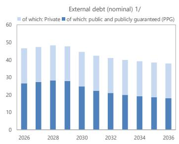

Table 1. Kyrgyz Republic: External Debt Sustainability Framework, Baseline Scenario, 2023-2046 (in percent of GDP, unless otherwise indicated)

<table><tr><td rowspan="2"></td><td colspan="3">Actual</td><td colspan="8">Projections</td><td colspan="2">Average 8/</td></tr><tr><td>2023</td><td>2024</td><td>2025</td><td>2026</td><td>2027</td><td>2028</td><td>2029</td><td>2030</td><td>2031</td><td>2036</td><td>2046</td><td>Historical</td><td>Projections</td></tr><tr><td>External debt (nominal) 1/</td><td>54.0</td><td>46.9</td><td>44.6</td><td>46.6</td><td>47.3</td><td>48.2</td><td>47.7</td><td>44.5</td><td>42.2</td><td>37.9</td><td>33.1</td><td>67.6</td><td>43.0</td></tr><tr><td>of which: public and publicly guaranteed (PPG)</td><td>31.1</td><td>24.9</td><td>23.6</td><td>26.6</td><td>27.4</td><td>28.2</td><td>27.8</td><td>24.6</td><td>22.3</td><td>18.0</td><td>13.2</td><td>41.4</td><td>23.0</td></tr><tr><td>Change in external debt</td><td>-7.8</td><td>-7.2</td><td>-2.3</td><td>2.0</td><td>0.7</td><td>0.9</td><td>-0.4</td><td>-3.2</td><td>-2.3</td><td>-0.5</td><td>-1.4</td><td></td><td></td></tr><tr><td>Identified net debt-creating flows</td><td>31.9</td><td>12.4</td><td>13.7</td><td>3.9</td><td>4.0</td><td>2.3</td><td>1.5</td><td>0.6</td><td>0.5</td><td>0.6</td><td>1.1</td><td>8.6</td><td>1.7</td></tr><tr><td>Non-interest current account deficit</td><td>44.5</td><td>22.3</td><td>24.1</td><td>6.8</td><td>6.1</td><td>5.1</td><td>4.4</td><td>4.1</td><td>4.1</td><td>4.2</td><td>4.1</td><td>17.3</td><td>4.8</td></tr><tr><td>Deficit in balance of goods and services</td><td>58.9</td><td>36.6</td><td>36.8</td><td>19.3</td><td>18.6</td><td>17.8</td><td>17.2</td><td>17.3</td><td>17.5</td><td>17.5</td><td>15.6</td><td>37.0</td><td>17.9</td></tr><tr><td>Exports</td><td>36.4</td><td>46.5</td><td>31.9</td><td>47.7</td><td>46.9</td><td>47.2</td><td>47.2</td><td>47.1</td><td>47.1</td><td>48.1</td><td>51.0</td><td></td><td></td></tr><tr><td>Imports</td><td>95.2</td><td>83.1</td><td>68.8</td><td>67.0</td><td>65.5</td><td>65.0</td><td>64.4</td><td>64.4</td><td>64.6</td><td>65.6</td><td>66.6</td><td></td><td></td></tr><tr><td>Net current transfers (negative = inflow)</td><td>-15.2</td><td>-15.3</td><td>-13.5</td><td>-12.9</td><td>-13.0</td><td>-13.2</td><td>-13.4</td><td>-13.8</td><td>-14.1</td><td>-13.8</td><td>-11.8</td><td>-22.8</td><td>-13.7</td></tr><tr><td>of which: official</td><td>0.0</td><td>-0.1</td><td>-0.2</td><td>-0.1</td><td>-0.1</td><td>0.0</td><td>0.0</td><td>0.0</td><td>0.0</td><td>0.0</td><td>0.0</td><td></td><td></td></tr><tr><td>Other current account flows (negative = net inflow)</td><td>0.8</td><td>1.0</td><td>0.8</td><td>0.4</td><td>0.5</td><td>0.5</td><td>0.6</td><td>0.6</td><td>0.7</td><td>0.6</td><td>0.3</td><td>3.1</td><td>0.6</td></tr><tr><td>Net FDI (negative = inflow)</td><td>-1.0</td><td>-1.3</td><td>-1.5</td><td>-1.0</td><td>-0.6</td><td>-1.2</td><td>-1.8</td><td>-2.5</td><td>-2.6</td><td>-2.5</td><td>-1.9</td><td>-1.9</td><td>-1.9</td></tr><tr><td>Endogenous debt dynamics 2/</td><td>-11.6</td><td>-8.5</td><td>-8.9</td><td>-1.9</td><td>-1.5</td><td>-1.5</td><td>-1.1</td><td>-1.1</td><td>-1.0</td><td>-1.1</td><td>-1.0</td><td></td><td></td></tr><tr><td>Contribution from nominal interest rate</td><td>0.4</td><td>0.4</td><td>0.3</td><td>0.5</td><td>0.9</td><td>1.2</td><td>1.3</td><td>1.3</td><td>1.2</td><td>0.8</td><td>0.7</td><td></td><td></td></tr><tr><td>Contribution from real GDP growth</td><td>-4.5</td><td>-5.2</td><td>-4.2</td><td>-2.4</td><td>-2.5</td><td>-2.7</td><td>-2.4</td><td>-2.4</td><td>-2.2</td><td>-1.9</td><td>-1.8</td><td></td><td></td></tr><tr><td>Contribution from price and exchange rate changes</td><td>-7.6</td><td>-3.7</td><td>-5.0</td><td>...</td><td>...</td><td>...</td><td>...</td><td>...</td><td>...</td><td>...</td><td>...</td><td></td><td></td></tr><tr><td>Residual 3/</td><td>-39.6</td><td>-19.6</td><td>-16.0</td><td>-1.9</td><td>-3.2</td><td>-1.5</td><td>-1.9</td><td>-3.8</td><td>-2.8</td><td>-1.2</td><td>-2.5</td><td>-14.1</td><td>-2.3</td></tr><tr><td>of which: exceptional financing</td><td>0.0</td><td>0.0</td><td>0.0</td><td>0.0</td><td>0.0</td><td>0.0</td><td>0.0</td><td>0.0</td><td>0.0</td><td>0.0</td><td>0.0</td><td></td><td></td></tr><tr><td colspan="14">Sustainability indicators</td></tr><tr><td>PV of PPG external debt-to-GDP ratio</td><td>...</td><td>...</td><td>18.5</td><td>21.1</td><td>22.3</td><td>23.5</td><td>23.4</td><td>20.4</td><td>18.4</td><td>15.2</td><td>11.6</td><td></td><td></td></tr><tr><td>PV of PPG external debt-to-exports ratio</td><td>...</td><td>...</td><td>57.8</td><td>44.3</td><td>47.5</td><td>49.7</td><td>49.6</td><td>43.3</td><td>38.9</td><td>31.5</td><td>22.8</td><td></td><td></td></tr><tr><td>PPG debt service-to-exports ratio</td><td>5.1</td><td>3.4</td><td>6.7</td><td>4.4</td><td>5.0</td><td>5.1</td><td>5.6</td><td>10.6</td><td>9.2</td><td>4.0</td><td>3.4</td><td></td><td></td></tr><tr><td>PPG debt service-to-revenue ratio</td><td>5.6</td><td>4.8</td><td>5.7</td><td>6.4</td><td>7.6</td><td>7.8</td><td>8.6</td><td>16.4</td><td>14.3</td><td>6.6</td><td>6.1</td><td></td><td></td></tr><tr><td>Gross external financing need (Million of U.S. dollars)</td><td>7209.5</td><td>4821.9</td><td>5899.1</td><td>2347.4</td><td>2565.0</td><td>2317.4</td><td>2159.2</td><td>2831.8</td><td>2692.9</td><td>2531.2</td><td>4825.0</td><td></td><td></td></tr><tr><td colspan="14">Key macroeconomic assumptions</td></tr><tr><td>Real GDP growth (in percent)</td><td>9.0</td><td>11.5</td><td>11.1</td><td>6.1</td><td>5.8</td><td>6.1</td><td>5.4</td><td>5.3</td><td>5.2</td><td>5.2</td><td>5.4</td><td>5.6</td><td>5.4</td></tr><tr><td>GDP deflator in US dollar terms (change in percent)</td><td>14.0</td><td>7.3</td><td>12.0</td><td>7.5</td><td>3.6</td><td>2.3</td><td>2.2</td><td>1.6</td><td>0.9</td><td>0.9</td><td>0.9</td><td>7.3</td><td>2.0</td></tr><tr><td>Effective interest rate (percent) 4/</td><td>0.9</td><td>0.8</td><td>0.8</td><td>1.2</td><td>2.2</td><td>2.7</td><td>3.0</td><td>2.9</td><td>2.8</td><td>2.2</td><td>2.3</td><td>0.9</td><td>2.4</td></tr><tr><td>Growth of exports of G&amp;S (US dollar terms, in percent)</td><td>52.0</td><td>53.2</td><td>-14.5</td><td>70.4</td><td>7.7</td><td>9.4</td><td>7.7</td><td>6.8</td><td>6.2</td><td>7.2</td><td>7.5</td><td>13.9</td><td>12.8</td></tr><tr><td>Growth of imports of G&amp;S (US dollar terms, in percent)</td><td>35.6</td><td>4.5</td><td>3.0</td><td>11.2</td><td>7.1</td><td>7.8</td><td>6.7</td><td>7.0</td><td>6.4</td><td>6.1</td><td>6.7</td><td>15.7</td><td>7.1</td></tr><tr><td>Grant element of new public sector borrowing (in percent)</td><td>...</td><td>...</td><td>...</td><td>3.3</td><td>4.4</td><td>5.0</td><td>6.1</td><td>7.6</td><td>7.1</td><td>8.3</td><td>7.8</td><td>...</td><td>6.7</td></tr><tr><td>Government revenues (excluding grants, in percent of GDP)</td><td>33.3</td><td>33.6</td><td>37.5</td><td>32.7</td><td>30.9</td><td>30.8</td><td>30.7</td><td>30.4</td><td>30.3</td><td>29.4</td><td>28.9</td><td>31.5</td><td>30.5</td></tr><tr><td>Aid flows (in Million of US dollars) 5/</td><td>184.3</td><td>161.9</td><td>209.1</td><td>245.7</td><td>248.5</td><td>251.4</td><td>234.9</td><td>233.6</td><td>183.4</td><td>117.5</td><td>102.1</td><td></td><td></td></tr><tr><td>Grant-equivalent financing (in percent of GDP) 6/</td><td>...</td><td>...</td><td>...</td><td>0.9</td><td>0.7</td><td>0.7</td><td>0.6</td><td>0.5</td><td>0.5</td><td>0.4</td><td>0.2</td><td>...</td><td>0.5</td></tr><tr><td>Grant-equivalent financing (in percent of external financing) 6/</td><td>...</td><td>...</td><td>...</td><td>11.8</td><td>14.0</td><td>13.8</td><td>17.1</td><td>20.7</td><td>19.4</td><td>19.7</td><td>23.8</td><td>...</td><td>18.2</td></tr><tr><td>Nominal GDP (Million of US dollars)</td><td>15,187</td><td>18,175</td><td>22,625</td><td>...</td><td>...</td><td>...</td><td>...</td><td>...</td><td>...</td><td>...</td><td>...</td><td></td><td></td></tr><tr><td>Nominal dollar GDP growth</td><td>24.2</td><td>19.7</td><td>24.5</td><td>14.1</td><td>9.6</td><td>8.6</td><td>7.7</td><td>7.0</td><td>6.1</td><td>6.1</td><td>6.3</td><td>13.6</td><td>7.6</td></tr><tr><td colspan="14">Memorandum items:</td></tr><tr><td>PV of external debt 7/</td><td>...</td><td>...</td><td>39.4</td><td>41.1</td><td>42.2</td><td>43.4</td><td>43.4</td><td>40.3</td><td>38.3</td><td>35.1</td><td>31.6</td><td></td><td></td></tr><tr><td>In percent of exports</td><td>...</td><td>...</td><td>123.4</td><td>86.1</td><td>90.1</td><td>92.0</td><td>91.9</td><td>85.7</td><td>81.3</td><td>73.0</td><td>61.9</td><td></td><td></td></tr><tr><td>Total external debt service-to-exports ratio</td><td>10.9</td><td>12.0</td><td>10.8</td><td>6.9</td><td>7.6</td><td>7.8</td><td>8.4</td><td>13.5</td><td>12.1</td><td>6.9</td><td>6.1</td><td></td><td></td></tr><tr><td>PV of PPG external debt (in Million of US dollars)</td><td></td><td></td><td>4178.7</td><td>5459.5</td><td>6302.5</td><td>7212.2</td><td>7746.4</td><td>7223.5</td><td>6900.6</td><td>7634.5</td><td>10669.3</td><td></td><td></td></tr><tr><td>(PVt-PVt-1)/GDPt-1 (in percent)</td><td></td><td></td><td></td><td>5.7</td><td>3.3</td><td>3.2</td><td>1.7</td><td>-1.6</td><td>-0.9</td><td>0.6</td><td>-0.5</td><td></td><td></td></tr><tr><td>Non-interest current account deficit that stabilizes debt ratio</td><td>52.2</td><td>29.4</td><td>26.4</td><td>4.8</td><td>5.4</td><td>4.2</td><td>4.8</td><td>7.3</td><td>6.4</td><td>4.8</td><td>5.4</td><td></td><td></td></tr></table>

Sources: Country authorities; and staff estimates and projections.  
1/ Includes both public and private sector external debt.  
2/ Derived as $(r - g - p(1 + g) + \varepsilon\alpha(1 + r)/(1 + g + p + g\rho))$ times previous period debt ratio, with r = nominal interest rate; g = real GDP growth rate, p = growth rate of GDP deflator in U.S. dollar terms, $\varepsilon=$ nominal appreciation of the local currency, and $\alpha=$ share of local currency-denominated external debt in total external debt.  
4/ Current-year interest payments divided by previous period debt stock.  
5/ Defined as grants, concessional loans, and debt relief.  
6/ Grant-equivalent financing includes grants provided directly to the government and through new borrowing (difference between the face value and the PV of new debt).  
7/ Assumes that PV of private sector debt is equivalent to its face value.

Table 2. Kyrgyz Republic: Public Sector Debt Sustainability Framework, Baseline Scenario, 2023-2046 (in percent of GDP, unless otherwise indicated)

<table><tr><td rowspan="2"></td><td colspan="3">Actual</td><td colspan="11">Projections</td><td>0.66</td><td colspan="2">Average 6/</td></tr><tr><td>2023</td><td>2024</td><td>2025</td><td>2026</td><td>2027</td><td>2028</td><td>2029</td><td>2030</td><td>2031</td><td>2032</td><td>2033</td><td>2034</td><td>2035</td><td>2036</td><td>2046</td><td>0.46</td><td>Historical Projections</td></tr><tr><td>Public sector debt 1/</td><td>42.0</td><td>36.2</td><td>39.4</td><td>42.3</td><td>41.4</td><td>41.2</td><td>41.0</td><td>41.1</td><td>41.3</td><td>41.1</td><td>40.8</td><td>40.6</td><td>40.4</td><td>40.5</td><td>39.0</td><td>50.6</td><td>41.1</td></tr><tr><td>of which: external debt</td><td>31.1</td><td>24.9</td><td>23.6</td><td>26.6</td><td>27.4</td><td>28.2</td><td>27.8</td><td>24.6</td><td>22.3</td><td>21.0</td><td>19.9</td><td>19.1</td><td>18.5</td><td>18.0</td><td>13.2</td><td>41.4</td><td>23.0</td></tr><tr><td>Change in public sector debt</td><td>-5.0</td><td>-5.7</td><td>3.2</td><td>2.9</td><td>-0.9</td><td>-0.2</td><td>-0.2</td><td>0.1</td><td>0.2</td><td>-0.2</td><td>-0.3</td><td>-0.2</td><td>-0.2</td><td>0.1</td><td>-0.2</td><td></td><td></td></tr><tr><td>Identified debt-creating flows</td><td>-9.3</td><td>-7.1</td><td>-1.6</td><td>2.5</td><td>-0.6</td><td>-0.1</td><td>0.0</td><td>0.0</td><td>0.0</td><td>-0.4</td><td>-0.5</td><td>-0.4</td><td>-0.4</td><td>-0.2</td><td>-0.3</td><td>-4.3</td><td>0.0</td></tr><tr><td>Primary deficit</td><td>-2.6</td><td>-3.1</td><td>-3.7</td><td>2.8</td><td>1.9</td><td>1.7</td><td>1.0</td><td>0.6</td><td>0.4</td><td>0.0</td><td>0.0</td><td>0.1</td><td>0.0</td><td>0.1</td><td>-0.5</td><td>-0.2</td><td>0.8</td></tr><tr><td>Revenue and grants</td><td>34.5</td><td>34.5</td><td>38.5</td><td>33.4</td><td>31.4</td><td>31.2</td><td>31.1</td><td>30.8</td><td>30.6</td><td>30.6</td><td>30.4</td><td>30.3</td><td>29.9</td><td>29.7</td><td>29.0</td><td>33.2</td><td>30.9</td></tr><tr><td>of which: grants</td><td>1.2</td><td>0.9</td><td>0.9</td><td>0.6</td><td>0.5</td><td>0.4</td><td>0.4</td><td>0.4</td><td>0.3</td><td>0.3</td><td>0.3</td><td>0.3</td><td>0.3</td><td>0.2</td><td>0.1</td><td></td><td></td></tr><tr><td>Primary (noninterest) expenditure</td><td>31.8</td><td>31.4</td><td>34.7</td><td>36.1</td><td>33.3</td><td>33.0</td><td>32.2</td><td>31.5</td><td>31.0</td><td>30.6</td><td>30.4</td><td>30.4</td><td>29.9</td><td>29.8</td><td>28.5</td><td>33.1</td><td>31.6</td></tr><tr><td>Automatic debt dynamics</td><td>-9.6</td><td>-6.8</td><td>-6.8</td><td>-3.1</td><td>-2.5</td><td>-2.1</td><td>-1.4</td><td>-1.2</td><td>-0.9</td><td>-0.8</td><td>-0.8</td><td>-0.7</td><td>-0.6</td><td>-0.6</td><td>-0.3</td><td></td><td></td></tr><tr><td>Contribution from interest rate/growth differential</td><td>-5.4</td><td>-4.8</td><td>-4.7</td><td>-3.1</td><td>-2.5</td><td>-2.1</td><td>-1.4</td><td>-1.2</td><td>-0.9</td><td>-0.8</td><td>-0.8</td><td>-0.7</td><td>-0.6</td><td>-0.6</td><td>-0.3</td><td></td><td></td></tr><tr><td>of which: contribution from average real interest rate</td><td>-1.5</td><td>-0.5</td><td>-1.1</td><td>-0.8</td><td>-0.2</td><td>0.3</td><td>0.7</td><td>0.9</td><td>1.1</td><td>1.2</td><td>1.2</td><td>1.3</td><td>1.4</td><td>1.4</td><td>1.7</td><td></td><td></td></tr><tr><td>of which: contribution from real GDP growth</td><td>-3.9</td><td>-4.3</td><td>-3.6</td><td>-2.3</td><td>-2.3</td><td>-2.4</td><td>-2.1</td><td>-2.1</td><td>-2.0</td><td>-2.0</td><td>-2.0</td><td>-2.0</td><td>-2.0</td><td>-2.0</td><td>-2.0</td><td></td><td></td></tr><tr><td>Contribution from real exchange rate depreciation</td><td>-4.1</td><td>-2.0</td><td>-2.1</td><td>...</td><td>...</td><td>...</td><td>...</td><td>...</td><td>...</td><td>...</td><td>...</td><td>...</td><td>...</td><td>...</td><td>...</td><td></td><td></td></tr><tr><td>Other identified debt-creating flows</td><td>2.9</td><td>2.9</td><td>8.9</td><td>2.8</td><td>0.1</td><td>0.3</td><td>0.4</td><td>0.5</td><td>0.5</td><td>0.4</td><td>0.3</td><td>0.2</td><td>0.3</td><td>0.3</td><td>0.5</td><td>1.9</td><td>0.6</td></tr><tr><td>Privatization receipts (negative)</td><td>2.8</td><td>2.5</td><td>9.1</td><td>3.7</td><td>0.0</td><td>0.0</td><td>0.0</td><td>0.0</td><td>0.0</td><td>0.0</td><td>0.0</td><td>0.0</td><td>0.0</td><td>0.0</td><td>0.0</td><td></td><td></td></tr><tr><td>Recognition of contingent liabilities (e.g., bank recapitalization)</td><td>0.1</td><td>0.4</td><td>-0.2</td><td>-1.0</td><td>0.1</td><td>0.3</td><td>0.4</td><td>0.5</td><td>0.5</td><td>0.4</td><td>0.3</td><td>0.2</td><td>0.3</td><td>0.3</td><td>0.4</td><td></td><td></td></tr><tr><td>Debt relief (HIPC and other)</td><td>0.0</td><td>0.0</td><td>0.0</td><td>0.0</td><td>0.0</td><td>0.0</td><td>0.0</td><td>0.0</td><td>0.0</td><td>0.0</td><td>0.0</td><td>0.0</td><td>0.0</td><td>0.0</td><td>0.0</td><td></td><td></td></tr><tr><td>Other debt creating or reducing flow (please specify)</td><td>0.0</td><td>0.0</td><td>0.0</td><td>0.0</td><td>0.0</td><td>0.0</td><td>0.0</td><td>0.0</td><td>0.0</td><td>0.0</td><td>0.0</td><td>0.0</td><td>0.0</td><td>0.0</td><td>0.0</td><td></td><td></td></tr><tr><td>Residual</td><td>4.3</td><td>1.3</td><td>4.8</td><td>0.4</td><td>-0.4</td><td>-0.1</td><td>-0.2</td><td>0.1</td><td>0.2</td><td>0.2</td><td>0.2</td><td>0.2</td><td>0.2</td><td>0.2</td><td>0.1</td><td>1.6</td><td>0.1</td></tr><tr><td>Sustainability indicators</td><td></td><td></td><td></td><td></td><td></td><td></td><td></td><td></td><td></td><td></td><td></td><td></td><td></td><td></td><td></td><td></td><td></td></tr><tr><td>PV of public debt-to-GDP ratio 2/</td><td>...</td><td>...</td><td>34.3</td><td>37.7</td><td>37.1</td><td>37.2</td><td>37.2</td><td>37.4</td><td>37.8</td><td>38.0</td><td>37.8</td><td>37.8</td><td>37.9</td><td>38.1</td><td>37.8</td><td></td><td></td></tr><tr><td>PV of public debt-to-revenue and grants ratio</td><td>...</td><td>...</td><td>89.1</td><td>112.9</td><td>118.0</td><td>119.0</td><td>119.3</td><td>121.5</td><td>123.6</td><td>124.0</td><td>124.5</td><td>124.9</td><td>126.5</td><td>128.3</td><td>130.5</td><td></td><td></td></tr><tr><td>Debt service-to-revenue and grants ratio 3/</td><td>12.1</td><td>12.8</td><td>12.3</td><td>8.5</td><td>12.9</td><td>13.4</td><td>13.8</td><td>22.9</td><td>23.8</td><td>22.0</td><td>22.9</td><td>21.6</td><td>23.2</td><td>23.8</td><td>28.9</td><td></td><td></td></tr><tr><td>Gross financing need 4/</td><td>4.4</td><td>4.2</td><td>9.9</td><td>8.4</td><td>6.0</td><td>6.2</td><td>5.7</td><td>8.2</td><td>8.1</td><td>7.1</td><td>7.2</td><td>6.8</td><td>7.2</td><td>7.5</td><td>8.3</td><td></td><td></td></tr><tr><td>Key macroeconomic and fiscal assumptions</td><td></td><td></td><td></td><td></td><td></td><td></td><td></td><td></td><td></td><td></td><td></td><td></td><td></td><td></td><td></td><td></td><td></td></tr><tr><td>Real GDP growth (in percent)</td><td>9.0</td><td>11.5</td><td>11.1</td><td>6.1</td><td>5.8</td><td>6.1</td><td>5.4</td><td>5.3</td><td>5.2</td><td>5.0</td><td>5.1</td><td>5.1</td><td>5.1</td><td>5.2</td><td>5.4</td><td>5.6</td><td>5.4</td></tr><tr><td>Average nominal interest rate on external debt (in percent)</td><td>1.5</td><td>1.4</td><td>1.5</td><td>2.2</td><td>4.0</td><td>4.8</td><td>5.2</td><td>5.2</td><td>5.3</td><td>4.8</td><td>4.7</td><td>4.6</td><td>4.7</td><td>4.7</td><td>5.6</td><td>1.4</td><td>4.6</td></tr><tr><td>Average real interest rate on domestic debt (in percent)</td><td>-16.9</td><td>-6.0</td><td>-11.0</td><td>-5.8</td><td>-4.9</td><td>-2.9</td><td>-1.1</td><td>0.7</td><td>2.4</td><td>3.2</td><td>3.7</td><td>4.0</td><td>4.3</td><td>4.5</td><td>5.4</td><td>-9.3</td><td>0.8</td></tr><tr><td>Real exchange rate depreciation (in percent, + indicates depreciation)</td><td>-12.0</td><td>-7.2</td><td>-9.4</td><td>...</td><td>...</td><td>...</td><td>...</td><td>...</td><td>...</td><td>...</td><td>...</td><td>...</td><td>...</td><td>...</td><td>...</td><td>-6.3</td><td>...</td></tr><tr><td>Inflation rate (GDP deflator, in percent)</td><td>20.3</td><td>6.4</td><td>12.4</td><td>11.7</td><td>11.4</td><td>9.4</td><td>7.9</td><td>7.0</td><td>6.5</td><td>6.5</td><td>6.5</td><td>6.5</td><td>6.5</td><td>6.5</td><td>6.5</td><td>10.6</td><td>7.9</td></tr><tr><td>Growth of real primary spending (deflated by GDP deflator, in percent)</td><td>1.7</td><td>10.1</td><td>22.8</td><td>10.3</td><td>-2.4</td><td>5.0</td><td>2.9</td><td>3.0</td><td>3.5</td><td>3.7</td><td>4.3</td><td>5.2</td><td>3.5</td><td>4.7</td><td>5.4</td><td>5.2</td><td>4.0</td></tr><tr><td>Primary deficit that stabilizes the debt-to-GDP ratio 5/</td><td>2.4</td><td>2.6</td><td>-6.9</td><td>-0.1</td><td>2.8</td><td>1.9</td><td>1.2</td><td>0.6</td><td>0.2</td><td>0.1</td><td>0.3</td><td>0.3</td><td>0.1</td><td>0.1</td><td>-0.3</td><td>-0.6</td><td>0.7</td></tr><tr><td>PV of contingent liabilities (not included in public sector debt)</td><td>0.0</td><td>0.0</td><td>0.0</td><td>0.0</td><td>0.0</td><td>0.0</td><td>0.0</td><td>0.0</td><td>0.0</td><td>0.0</td><td>0.0</td><td>0.0</td><td>0.0</td><td>0.0</td><td>0.0</td><td></td><td></td></tr></table>

Sources: Country authorities; and staff estimates and projections.  
1/ Coverage of debt: The central, state, and local governments, central bank, government-guaranteed debt. Definition of external debt is Residency-based.  
2/ The underlying PV of external debt-to-GDP ratio under the public DSA differs from the external DSA with the size of differences depending on exchange rates projections.  
3/ Debt service is defined as the sum of interest and amortization of medium and long-term, and short-term debt.  
4/ Gross financing need is defined as the primary deficit plus debt service plus the stock of short-term debt at the end of the last period and other debt creating/reducing flows.  
5/ Defined as a primary deficit minus a change in the public debt-to-GDP ratio ((-): a primary surplus), which would stabilize the debt ratio only in the year in question.  
6/ Historical averages are generally derived over the past 10 years, subject to data availability, whereas projections averages are over the first year of projection and the next 10 years.

Figure 1. Kyrgyz Republic: Indicators of Public and Publicly Guaranteed External Debt Under Alternative Scenarios, 2026–36  
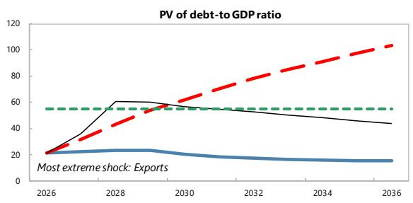

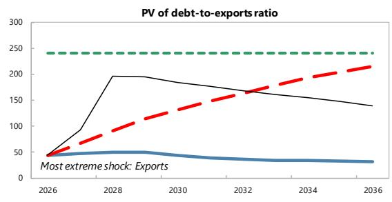

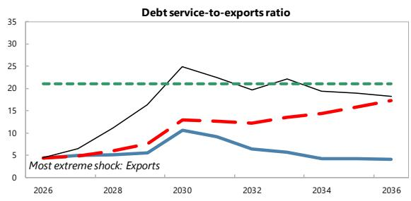

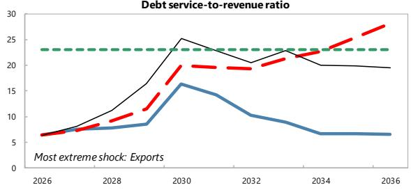

<table><tr><td colspan="3">Customization of Default Settings</td></tr><tr><td>Tailored Stress</td><td>Size</td><td>Interactions</td></tr><tr><td>Combined CL</td><td>Yes</td><td></td></tr><tr><td>Natural disaster</td><td>n.a.</td><td>n.a.</td></tr><tr><td>Commodity price</td><td>No</td><td>No</td></tr><tr><td>Market financing</td><td>n.a.</td><td>n.a.</td></tr></table>

Note: "Yes" indicates any change to the size or interactions of the default settings for the stress tests. "n.a." indicates that the stress test does not apply.  
Borrowing assumptions on additional financing needs resulting from the stress tests\*

<table><tr><td></td><td>Default</td><td>User defined</td></tr><tr><td colspan="3">Shares of marginal debt</td></tr><tr><td>External PPG MLT debt</td><td>100%</td><td></td></tr><tr><td colspan="3">Terms of marginal debt</td></tr><tr><td>Avg. nominal interest rate on new borrowing in USD</td><td>6.5%</td><td>6.5%</td></tr><tr><td>USD Discount rate</td><td>5.0%</td><td>5.0%</td></tr><tr><td>Avg. maturity (incl. grace period)</td><td>18</td><td>18</td></tr><tr><td>Avg. grace period</td><td>4</td><td>4</td></tr></table>

Sources: Country authorities; and staff estimates and projections.  
\* Note: All the additional financing needs generated by the shocks under the stress tests are assumed to be covered by PPG external MLT debt in the external DSA. Default terms of marginal debt are based on baseline 10-year projections.  
1/ The most extreme stress test is the test that yields the highest ratio in or before 2036. The stress test with a one-off breach is also presented (if any), while the one-off breach is deemed away for mechanical signals. When a stress test with a one-off breach happens to be the most exterme shock even after disregarding the one-off breach, only that stress test (with a one-off breach) would be presented.

Figure 2. Kyrgyz Republic: Indicators of Public Debt Under Alternative Scenarios, 2026-36  
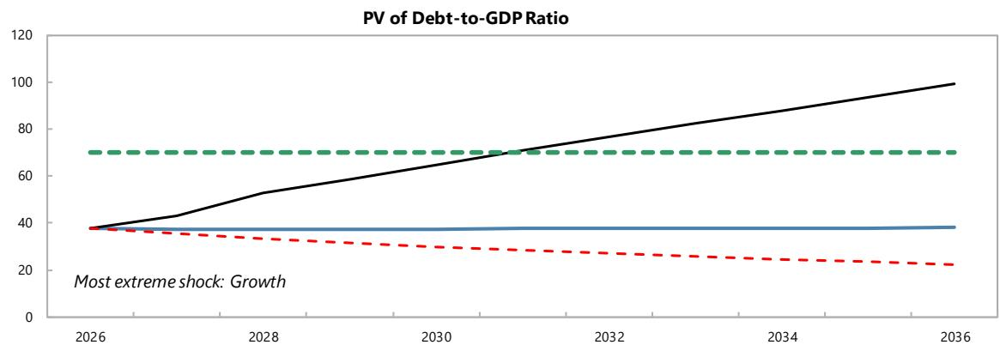

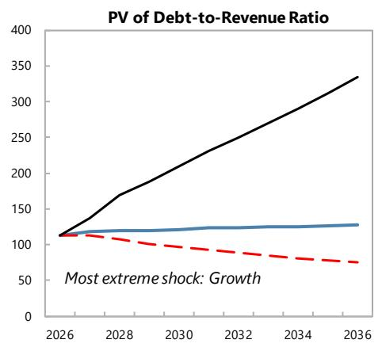  
TOTAL public debt benchmark

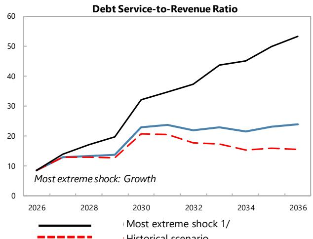

<table><tr><td>Borrowing assumptions on additional financing needs resulting from the stress tests*</td><td>Default</td><td>User defined</td></tr><tr><td>Shares of marginal debt</td><td></td><td></td></tr><tr><td>External PPG medium and long-term</td><td>41%</td><td>41%</td></tr><tr><td>Domestic medium and long-term</td><td>54%</td><td>54%</td></tr><tr><td>Domestic short-term</td><td>6%</td><td>6%</td></tr><tr><td>Terms of marginal debt</td><td></td><td></td></tr><tr><td>External MLT debt</td><td></td><td></td></tr><tr><td>Avg. nominal interest rate on new borrowing in USD</td><td>6.5%</td><td>6.5%</td></tr><tr><td>Avg. maturity (incl. grace period)</td><td>18</td><td>18</td></tr><tr><td>Avg. grace period</td><td>4</td><td>4</td></tr><tr><td>Domestic MLT debt</td><td></td><td></td></tr><tr><td>Avg. real interest rate on new borrowing</td><td>4.3%</td><td>4.3%</td></tr><tr><td>Avg. maturity (incl. grace period)</td><td>5</td><td>5</td></tr><tr><td>Avg. grace period</td><td>4</td><td>4</td></tr><tr><td>Domestic short-term debt</td><td></td><td></td></tr><tr><td>Avg. real interest rate</td><td>0.8%</td><td>0.8%</td></tr></table>

\* Note: The public DSA allows for domestic financing to cover the additional financing needs generated by the shocks under the stress tests in the public DSA. Default terms of marginal debt are based on baseline 10-year projections.

1/ The most extreme stress test is the test that yields the highest ratio in or before 2036. The stress test with a one-off breach is also presented (if any), while the one-off breach is deemed away for mechanical signals. When a stress test with a one-off breach happens to be the most exterme shock even after disregarding the one-off breach, only that stress test (with a one-off breach) would be presented.

Table 3. Kyrgyz Republic: Sensitivity Analysis for Key Indicators of Public and Publicly Guaranteed External Debt, 2026-36

<table><tr><td rowspan="2"></td><td colspan="11">Projections 1/</td></tr><tr><td>2026</td><td>2027</td><td>2028</td><td>2029</td><td>2030</td><td>2031</td><td>2032</td><td>2033</td><td>2034</td><td>2035</td><td>2036</td></tr><tr><td colspan="12">PV of debt-to GDP ratio</td></tr><tr><td>Baseline</td><td>21</td><td>22</td><td>23</td><td>23</td><td>20</td><td>18</td><td>17</td><td>16</td><td>16</td><td>16</td><td>15</td></tr><tr><td colspan="12">A. Alternative Scenarios</td></tr><tr><td>A1. Key variables at their historical averages in 2026-2036 2/</td><td>21</td><td>32</td><td>43</td><td>54</td><td>62</td><td>70</td><td>78</td><td>85</td><td>91</td><td>97</td><td>103</td></tr><tr><td>A2. Alternative Scenario :[Customize, enter title]</td><td>21</td><td>22</td><td>23</td><td>23</td><td>20</td><td>18</td><td>17</td><td>16</td><td>16</td><td>16</td><td>15</td></tr><tr><td colspan="12">B. Bound Tests</td></tr><tr><td>B1. Real GDP growth</td><td>21</td><td>24</td><td>28</td><td>28</td><td>24</td><td>22</td><td>21</td><td>20</td><td>19</td><td>19</td><td>18</td></tr><tr><td>B2. Primary balance</td><td>21</td><td>23</td><td>26</td><td>26</td><td>23</td><td>21</td><td>20</td><td>20</td><td>19</td><td>19</td><td>18</td></tr><tr><td>B3. Exports</td><td>21</td><td>36</td><td>61</td><td>60</td><td>57</td><td>54</td><td>53</td><td>50</td><td>48</td><td>46</td><td>44</td></tr><tr><td>B4. Other flows 3/</td><td>21</td><td>33</td><td>45</td><td>45</td><td>42</td><td>40</td><td>38</td><td>36</td><td>35</td><td>33</td><td>32</td></tr><tr><td>B5. Depreciation</td><td>21</td><td>28</td><td>23</td><td>23</td><td>20</td><td>17</td><td>16</td><td>15</td><td>15</td><td>14</td><td>14</td></tr><tr><td>B6. Combination of B1-B5</td><td>21</td><td>36</td><td>44</td><td>44</td><td>40</td><td>38</td><td>36</td><td>34</td><td>33</td><td>32</td><td>30</td></tr><tr><td colspan="12">C. Tailored Tests</td></tr><tr><td>C1. Combined contingent liabilities</td><td>21</td><td>28</td><td>29</td><td>29</td><td>26</td><td>24</td><td>25</td><td>24</td><td>23</td><td>23</td><td>22</td></tr><tr><td>C2. Natural disaster</td><td>n.a.</td><td>n.a.</td><td>n.a.</td><td>n.a.</td><td>n.a.</td><td>n.a.</td><td>n.a.</td><td>n.a.</td><td>n.a.</td><td>n.a.</td><td>n.a.</td></tr><tr><td>C3. Commodity price</td><td>21</td><td>22</td><td>23</td><td>23</td><td>20</td><td>18</td><td>17</td><td>16</td><td>16</td><td>16</td><td>15</td></tr><tr><td>C4. Market Financing</td><td>n.a.</td><td>n.a.</td><td>n.a.</td><td>n.a.</td><td>n.a.</td><td>n.a.</td><td>n.a.</td><td>n.a.</td><td>n.a.</td><td>n.a.</td><td>n.a.</td></tr><tr><td>Threshold</td><td>55</td><td>55</td><td>55</td><td>55</td><td>55</td><td>55</td><td>55</td><td>55</td><td>55</td><td>55</td><td>55</td></tr><tr><td colspan="12">PV of debt-to-exports ratio</td></tr><tr><td>Baseline</td><td>44</td><td>48</td><td>50</td><td>50</td><td>43</td><td>39</td><td>36</td><td>35</td><td>34</td><td>33</td><td>32</td></tr><tr><td colspan="12">A. Alternative Scenarios</td></tr><tr><td>A1. Key variables at their historical averages in 2026-2036 2/</td><td>44</td><td>67</td><td>91</td><td>114</td><td>131</td><td>149</td><td>163</td><td>179</td><td>193</td><td>205</td><td>215</td></tr><tr><td>A2. Alternative Scenario :[Customize, enter title]</td><td>44</td><td>48</td><td>50</td><td>50</td><td>43</td><td>39</td><td>36</td><td>35</td><td>34</td><td>33</td><td>32</td></tr><tr><td colspan="12">B. Bound Tests</td></tr><tr><td>B1. Real GDP growth</td><td>44</td><td>48</td><td>50</td><td>50</td><td>43</td><td>39</td><td>36</td><td>35</td><td>34</td><td>33</td><td>32</td></tr><tr><td>B2. Primary balance</td><td>44</td><td>50</td><td>55</td><td>55</td><td>49</td><td>44</td><td>42</td><td>41</td><td>40</td><td>39</td><td>38</td></tr><tr><td>B3. Exports</td><td>44</td><td>94</td><td>196</td><td>195</td><td>184</td><td>177</td><td>168</td><td>162</td><td>155</td><td>147</td><td>139</td></tr><tr><td>B4. Other flows 3/</td><td>44</td><td>71</td><td>95</td><td>95</td><td>88</td><td>84</td><td>80</td><td>76</td><td>73</td><td>70</td><td>66</td></tr><tr><td>B5. Depreciation</td><td>44</td><td>48</td><td>40</td><td>40</td><td>33</td><td>29</td><td>26</td><td>25</td><td>25</td><td>24</td><td>24</td></tr><tr><td>B6. Combination of B1-B5</td><td>44</td><td>82</td><td>82</td><td>105</td><td>97</td><td>92</td><td>86</td><td>82</td><td>79</td><td>76</td><td>72</td></tr><tr><td colspan="12">C. Tailored Tests</td></tr><tr><td>C1. Combined contingent liabilities</td><td>44</td><td>59</td><td>62</td><td>62</td><td>56</td><td>51</td><td>51</td><td>50</td><td>49</td><td>48</td><td>47</td></tr><tr><td>C2. Natural disaster</td><td>n.a.</td><td>n.a.</td><td>n.a.</td><td>n.a.</td><td>n.a.</td><td>n.a.</td><td>n.a.</td><td>n.a.</td><td>n.a.</td><td>n.a.</td><td>n.a.</td></tr><tr><td>C3. Commodity price</td><td>44</td><td>48</td><td>50</td><td>50</td><td>43</td><td>39</td><td>36</td><td>35</td><td>34</td><td>33</td><td>32</td></tr><tr><td>C4. Market Financing</td><td>n.a.</td><td>n.a.</td><td>n.a.</td><td>n.a.</td><td>n.a.</td><td>n.a.</td><td>n.a.</td><td>n.a.</td><td>n.a.</td><td>n.a.</td><td>n.a.</td></tr><tr><td>Threshold</td><td>240</td><td>240</td><td>240</td><td>240</td><td>240</td><td>240</td><td>240</td><td>240</td><td>240</td><td>240</td><td>240</td></tr><tr><td colspan="12">Debt service-to-exports ratio</td></tr><tr><td>Baseline</td><td>4</td><td>5</td><td>5</td><td>6</td><td>11</td><td>9</td><td>6</td><td>6</td><td>4</td><td>4</td><td>4</td></tr><tr><td colspan="12">A. Alternative Scenarios</td></tr><tr><td>A1. Key variables at their historical averages in 2026-2036 2/</td><td>4</td><td>5</td><td>6</td><td>8</td><td>13</td><td>13</td><td>12</td><td>14</td><td>14</td><td>16</td><td>17</td></tr><tr><td>A2. Alternative Scenario :[Customize, enter title]</td><td>4</td><td>5</td><td>5</td><td>6</td><td>11</td><td>9</td><td>6</td><td>6</td><td>4</td><td>4</td><td>4</td></tr><tr><td colspan="12">B. Bound Tests</td></tr><tr><td>B1. Real GDP growth</td><td>4</td><td>5</td><td>5</td><td>6</td><td>11</td><td>9</td><td>6</td><td>6</td><td>4</td><td>4</td><td>4</td></tr><tr><td>B2. Primary balance</td><td>4</td><td>5</td><td>5</td><td>6</td><td>11</td><td>9</td><td>7</td><td>6</td><td>5</td><td>5</td><td>5</td></tr><tr><td>B3. Exports</td><td>4</td><td>7</td><td>11</td><td>16</td><td>25</td><td>22</td><td>20</td><td>22</td><td>19</td><td>19</td><td>18</td></tr><tr><td>B4. Other flows 3/</td><td>4</td><td>5</td><td>6</td><td>8</td><td>13</td><td>12</td><td>10</td><td>11</td><td>9</td><td>9</td><td>9</td></tr><tr><td>B5. Depreciation</td><td>4</td><td>5</td><td>5</td><td>5</td><td>10</td><td>9</td><td>6</td><td>5</td><td>3</td><td>3</td><td>3</td></tr><tr><td>B6. Combination of B1-B5</td><td>4</td><td>6</td><td>8</td><td>10</td><td>16</td><td>14</td><td>12</td><td>12</td><td>10</td><td>10</td><td>9</td></tr><tr><td colspan="12">C. Tailored Tests</td></tr><tr><td>C1. Combined contingent liabilities</td><td>4</td><td>5</td><td>6</td><td>6</td><td>11</td><td>10</td><td>8</td><td>7</td><td>6</td><td>6</td><td>6</td></tr><tr><td>C2. Natural disaster</td><td>n.a.</td><td>n.a.</td><td>n.a.</td><td>n.a.</td><td>n.a.</td><td>n.a.</td><td>n.a.</td><td>n.a.</td><td>n.a.</td><td>n.a.</td><td>n.a.</td></tr><tr><td>C3. Commodity price</td><td>4</td><td>5</td><td>5</td><td>6</td><td>11</td><td>9</td><td>6</td><td>6</td><td>4</td><td>4</td><td>4</td></tr><tr><td>C4. Market Financing</td><td>n.a.</td><td>n.a.</td><td>n.a.</td><td>n.a.</td><td>n.a.</td><td>n.a.</td><td>n.a.</td><td>n.a.</td><td>n.a.</td><td>n.a.</td><td>n.a.</td></tr><tr><td>Threshold</td><td>21</td><td>21</td><td>21</td><td>21</td><td>21</td><td>21</td><td>21</td><td>21</td><td>21</td><td>21</td><td>21</td></tr><tr><td colspan="12">Debt service-to-revenue ratio</td></tr><tr><td>Baseline</td><td>6</td><td>8</td><td>8</td><td>9</td><td>16</td><td>14</td><td>10</td><td>9</td><td>7</td><td>7</td><td>7</td></tr><tr><td colspan="12">A. Alternative Scenarios</td></tr><tr><td>A1. Key variables at their historical averages in 2026-2036 2/</td><td>6</td><td>7</td><td>9</td><td>12</td><td>20</td><td>20</td><td>19</td><td>21</td><td>23</td><td>25</td><td>28</td></tr><tr><td>A2. Alternative Scenario :[Customize, enter title]</td><td>6</td><td>8</td><td>8</td><td>9</td><td>16</td><td>14</td><td>10</td><td>9</td><td>7</td><td>7</td><td>7</td></tr><tr><td colspan="12">B. Bound Tests</td></tr><tr><td>B1. Real GDP growth</td><td>6</td><td>8</td><td>9</td><td>10</td><td>20</td><td>17</td><td>12</td><td>11</td><td>8</td><td>8</td><td>8</td></tr><tr><td>B2. Primary balance</td><td>6</td><td>8</td><td>8</td><td>9</td><td>17</td><td>15</td><td>11</td><td>10</td><td>8</td><td>8</td><td>8</td></tr><tr><td>B3. Exports</td><td>6</td><td>8</td><td>11</td><td>16</td><td>25</td><td>23</td><td>20</td><td>23</td><td>20</td><td>20</td><td>20</td></tr><tr><td>B4. Other flows 3/</td><td>6</td><td>8</td><td>10</td><td>13</td><td>21</td><td>19</td><td>16</td><td>17</td><td>15</td><td>14</td><td>14</td></tr><tr><td>B5. Depreciation</td><td>6</td><td>9</td><td>10</td><td>10</td><td>19</td><td>17</td><td>12</td><td>9</td><td>6</td><td>6</td><td>6</td></tr><tr><td>B6. Combination of B1-B5</td><td>6</td><td>8</td><td>11</td><td>13</td><td>22</td><td>20</td><td>17</td><td>16</td><td>14</td><td>14</td><td>13</td></tr><tr><td colspan="12">C. Tailored Tests</td></tr><tr><td>C1. Combined contingent liabilities</td><td>6</td><td>8</td><td>9</td><td>10</td><td>18</td><td>15</td><td>12</td><td>11</td><td>9</td><td>9</td><td>9</td></tr><tr><td>C2. Natural disaster</td><td>n.a.</td><td>n.a.</td><td>n.a.</td><td>n.a.</td><td>n.a.</td><td>n.a.</td><td>n.a.</td><td>n.a.</td><td>n.a.</td><td>n.a.</td><td>n.a.</td></tr><tr><td>C3. Commodity price</td><td>6</td><td>8</td><td>8</td><td>9</td><td>16</td><td>14</td><td>10</td><td>9</td><td>7</td><td>7</td><td>7</td></tr><tr><td>C4. Market Financing</td><td>n.a.</td><td>n.a.</td><td>n.a.</td><td>n.a.</td><td>n.a.</td><td>n.a.</td><td>n.a.</td><td>n.a.</td><td>n.a.</td><td>n.a.</td><td>n.a.</td></tr><tr><td>Threshold</td><td>23</td><td>23</td><td>23</td><td>23</td><td>23</td><td>23</td><td>23</td><td>23</td><td>23</td><td>23</td><td>23</td></tr></table>

Table 4. Kyrgyz Republic: Sensitivity Analysis for Key Indicators of Public Debt, 2026-36

<table><tr><td rowspan="2"></td><td colspan="11">Projections 1/</td></tr><tr><td>2026</td><td>2027</td><td>2028</td><td>2029</td><td>2030</td><td>2031</td><td>2032</td><td>2033</td><td>2034</td><td>2035</td><td>2036</td></tr><tr><td colspan="12">PV of Debt-to-GDP Ratio</td></tr><tr><td>Baseline</td><td>38</td><td>37</td><td>37</td><td>37</td><td>37</td><td>38</td><td>38</td><td>38</td><td>38</td><td>38</td><td>38</td></tr><tr><td colspan="12">A. Alternative Scenarios</td></tr><tr><td>A1. Key variables at their historical averages in 2026-2036 2/</td><td>38</td><td>35</td><td>33</td><td>31</td><td>30</td><td>28</td><td>27</td><td>26</td><td>25</td><td>23</td><td>22</td></tr><tr><td>A2. Alternative Scenario :[Customize, enter title]</td><td>38</td><td>37</td><td>37</td><td>37</td><td>37</td><td>38</td><td>38</td><td>38</td><td>38</td><td>38</td><td>38</td></tr><tr><td colspan="12">B. Bound Tests</td></tr><tr><td>B1. Real GDP growth</td><td>38</td><td>43</td><td>53</td><td>59</td><td>65</td><td>71</td><td>77</td><td>82</td><td>88</td><td>93</td><td>99</td></tr><tr><td>B2. Primary balance</td><td>38</td><td>40</td><td>43</td><td>43</td><td>43</td><td>43</td><td>43</td><td>43</td><td>43</td><td>43</td><td>43</td></tr><tr><td>B3. Exports</td><td>38</td><td>49</td><td>69</td><td>68</td><td>68</td><td>69</td><td>69</td><td>67</td><td>65</td><td>64</td><td>63</td></tr><tr><td>B4. Other flows 3/</td><td>38</td><td>48</td><td>59</td><td>59</td><td>59</td><td>60</td><td>59</td><td>58</td><td>57</td><td>56</td><td>55</td></tr><tr><td>B5. Depreciation</td><td>38</td><td>39</td><td>36</td><td>34</td><td>32</td><td>30</td><td>28</td><td>26</td><td>24</td><td>21</td><td>19</td></tr><tr><td>B6. Combination of B1-B5</td><td>38</td><td>38</td><td>39</td><td>38</td><td>39</td><td>39</td><td>39</td><td>39</td><td>39</td><td>39</td><td>39</td></tr><tr><td colspan="12">C. Tailored Tests</td></tr><tr><td>C1. Combined contingent liabilities</td><td>38</td><td>50</td><td>50</td><td>50</td><td>50</td><td>50</td><td>50</td><td>50</td><td>50</td><td>50</td><td>50</td></tr><tr><td>C2. Natural disaster</td><td>n.a.</td><td>n.a.</td><td>n.a.</td><td>n.a.</td><td>n.a.</td><td>n.a.</td><td>n.a.</td><td>n.a.</td><td>n.a.</td><td>n.a.</td><td>n.a.</td></tr><tr><td>C3. Commodity price</td><td>38</td><td>40</td><td>46</td><td>51</td><td>57</td><td>63</td><td>68</td><td>74</td><td>80</td><td>85</td><td>91</td></tr><tr><td>C4. Market Financing</td><td>n.a.</td><td>n.a.</td><td>n.a.</td><td>n.a.</td><td>n.a.</td><td>n.a.</td><td>n.a.</td><td>n.a.</td><td>n.a.</td><td>n.a.</td><td>n.a.</td></tr><tr><td>TOTAL public debt benchmark</td><td>70</td><td>70</td><td>70</td><td>70</td><td>70</td><td>70</td><td>70</td><td>70</td><td>70</td><td>70</td><td>70</td></tr><tr><td colspan="12">PV of Debt-to-Revenue Ratio</td></tr><tr><td>Baseline</td><td>113</td><td>118</td><td>119</td><td>119</td><td>121</td><td>124</td><td>124</td><td>124</td><td>125</td><td>126</td><td>128</td></tr><tr><td colspan="12">A. Alternative Scenarios</td></tr><tr><td>A1. Key variables at their historical averages in 2026-2036 2/</td><td>113</td><td>113</td><td>107</td><td>101</td><td>97</td><td>93</td><td>89</td><td>85</td><td>81</td><td>78</td><td>75</td></tr><tr><td>A2. Alternative Scenario :[Customize, enter title]</td><td>113</td><td>118</td><td>119</td><td>119</td><td>121</td><td>124</td><td>124</td><td>124</td><td>125</td><td>126</td><td>128</td></tr><tr><td colspan="12">B. Bound Tests</td></tr><tr><td>B1. Real GDP growth</td><td>113</td><td>137</td><td>169</td><td>188</td><td>210</td><td>231</td><td>250</td><td>270</td><td>290</td><td>312</td><td>334</td></tr><tr><td>B2. Primary balance</td><td>113</td><td>127</td><td>136</td><td>137</td><td>139</td><td>141</td><td>142</td><td>142</td><td>143</td><td>144</td><td>146</td></tr><tr><td>B3. Exports</td><td>113</td><td>155</td><td>220</td><td>219</td><td>222</td><td>225</td><td>224</td><td>220</td><td>216</td><td>214</td><td>211</td></tr><tr><td>B4. Other flows 3/</td><td>113</td><td>154</td><td>190</td><td>189</td><td>192</td><td>195</td><td>194</td><td>192</td><td>189</td><td>187</td><td>186</td></tr><tr><td>B5. Depreciation</td><td>113</td><td>123</td><td>116</td><td>109</td><td>104</td><td>99</td><td>92</td><td>85</td><td>78</td><td>71</td><td>65</td></tr><tr><td>B6. Combination of B1-B5</td><td>113</td><td>121</td><td>125</td><td>123</td><td>125</td><td>127</td><td>128</td><td>128</td><td>129</td><td>130</td><td>132</td></tr><tr><td colspan="12">C. Tailored Tests</td></tr><tr><td>C1. Combined contingent liabilities</td><td>113</td><td>159</td><td>160</td><td>160</td><td>162</td><td>164</td><td>165</td><td>165</td><td>166</td><td>168</td><td>170</td></tr><tr><td>C2. Natural disaster</td><td>n.a.</td><td>n.a.</td><td>n.a.</td><td>n.a.</td><td>n.a.</td><td>n.a.</td><td>n.a.</td><td>n.a.</td><td>n.a.</td><td>n.a.</td><td>n.a.</td></tr><tr><td>C3. Commodity price</td><td>113</td><td>127</td><td>147</td><td>164</td><td>185</td><td>205</td><td>224</td><td>244</td><td>263</td><td>285</td><td>307</td></tr><tr><td>C4. Market Financing</td><td>n.a.</td><td>n.a.</td><td>n.a.</td><td>n.a.</td><td>n.a.</td><td>n.a.</td><td>n.a.</td><td>n.a.</td><td>n.a.</td><td>n.a.</td><td>n.a.</td></tr><tr><td colspan="12">Debt Service-to-Revenue Ratio</td></tr><tr><td>Baseline</td><td>9</td><td>13</td><td>13</td><td>14</td><td>23</td><td>24</td><td>22</td><td>23</td><td>22</td><td>23</td><td>24</td></tr><tr><td colspan="12">A. Alternative Scenarios</td></tr><tr><td>A1. Key variables at their historical averages in 2026-2036 2/</td><td>9</td><td>13</td><td>13</td><td>13</td><td>21</td><td>20</td><td>18</td><td>17</td><td>15</td><td>16</td><td>16</td></tr><tr><td>A2. Alternative Scenario :[Customize, enter title]</td><td>9</td><td>13</td><td>13</td><td>14</td><td>23</td><td>24</td><td>22</td><td>23</td><td>22</td><td>23</td><td>24</td></tr><tr><td colspan="12">B. Bound Tests</td></tr><tr><td>B1. Real GDP growth</td><td>9</td><td>14</td><td>17</td><td>20</td><td>32</td><td>35</td><td>37</td><td>44</td><td>45</td><td>50</td><td>53</td></tr><tr><td>B2. Primary balance</td><td>9</td><td>13</td><td>15</td><td>16</td><td>24</td><td>25</td><td>26</td><td>28</td><td>24</td><td>26</td><td>26</td></tr><tr><td>B3. Exports</td><td>9</td><td>13</td><td>16</td><td>20</td><td>29</td><td>30</td><td>30</td><td>34</td><td>33</td><td>34</td><td>35</td></tr><tr><td>B4. Other flows 3/</td><td>9</td><td>13</td><td>15</td><td>18</td><td>27</td><td>28</td><td>28</td><td>31</td><td>29</td><td>31</td><td>31</td></tr><tr><td>B5. Depreciation</td><td>9</td><td>13</td><td>14</td><td>14</td><td>25</td><td>25</td><td>21</td><td>19</td><td>18</td><td>19</td><td>19</td></tr><tr><td>B6. Combination of B1-B5</td><td>9</td><td>13</td><td>14</td><td>14</td><td>23</td><td>24</td><td>22</td><td>23</td><td>22</td><td>24</td><td>24</td></tr><tr><td colspan="12">C. Tailored Tests</td></tr><tr><td>C1. Combined contingent liabilities</td><td>9</td><td>13</td><td>19</td><td>18</td><td>26</td><td>27</td><td>38</td><td>30</td><td>27</td><td>29</td><td>29</td></tr><tr><td>C2. Natural disaster</td><td>n.a.</td><td>n.a.</td><td>n.a.</td><td>n.a.</td><td>n.a.</td><td>n.a.</td><td>n.a.</td><td>n.a.</td><td>n.a.</td><td>n.a.</td><td>n.a.</td></tr><tr><td>C3. Commodity price</td><td>9</td><td>13</td><td>15</td><td>17</td><td>27</td><td>30</td><td>32</td><td>39</td><td>41</td><td>45</td><td>48</td></tr><tr><td>C4. Market Financing</td><td>n.a.</td><td>n.a.</td><td>n.a.</td><td>n.a.</td><td>n.a.</td><td>n.a.</td><td>n.a.</td><td>n.a.</td><td>n.a.</td><td>n.a.</td><td>n.a.</td></tr></table>

Sources: Country authorities; and staff estimates and projections.  
1/ A bold value indicates a breach of the benchmark.  
2/ Variables include real GDP growth, GDP deflator and primary deficit in percent of GDP.  
3/ Includes official and private transfers and FDI.

## Figure 3. Kyrgyz Republic: Drivers of Debt Dynamics—Baseline Scenario

Gross Nominal PPG External Debt (in percent of GDP; DSA vintages)

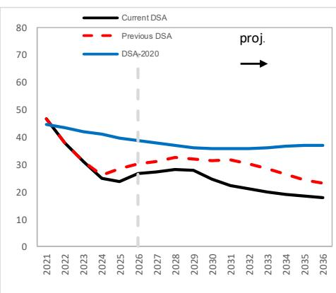  
External Debt
Debt-creating flows
(percent of GDP)

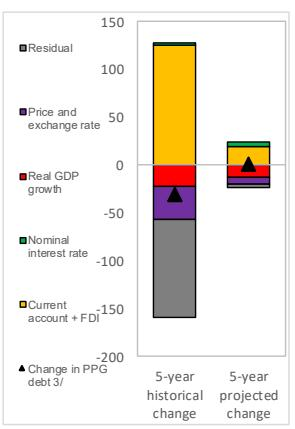  
Public Debt  
Unexpected Changes in Debt 1/(past 5 years, percent of GDP)

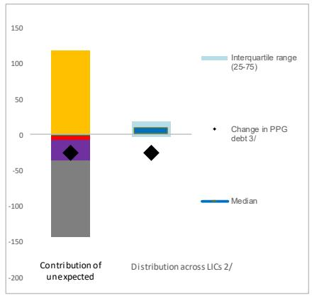  
Gross Nominal Public Debt (in percent of GDP; DSA vintages)

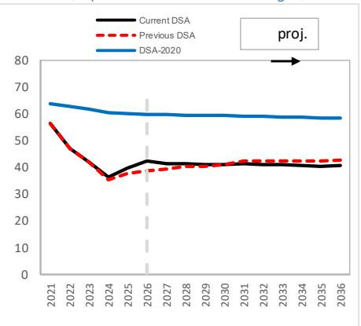  
Debt-creating flows (percent of GDP)

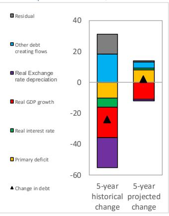

Unexpected Changes in Debt 1/(past 5 years, percent of GDP)  
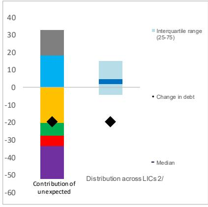  
1/ Difference between anticipated and actual contributions on debt ratios.  
2/ Distribution across LICs for which LIC DSAs were produced.  
3/ Given the relatively low private external debt for average low-income countries, a ppt change in PPG external debt should be largely explained by the drivers of the external debt dynamics equation.

## Figure 4. Kyrgyz Republic: Realism Tools

3-Year Adjustment in Primary Balance (Percentage points of GDP)  
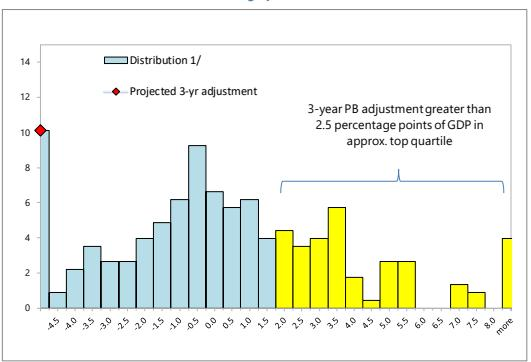  
1/ Data cover Fund-supported programs for LICs (excluding emergency financing) approved since 1990. The size of 3-year adjustment from program inception is found on the horizontal axis; the percent of sample is found on the vertical axis.

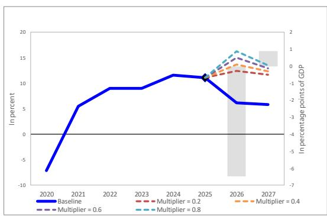  
1/ Bars refer to annual projected fiscal adjustment (right-hand side scale) and lines show possible real GDP growth paths under different fiscal multipliers (left-hand side scale).

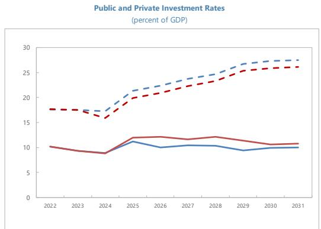

<table><tr><td></td><td>Gov. Invest. - Prev. DSA</td><td>Gov. Invest. - Curr. DSA</td></tr><tr><td></td><td>Priv. Invest. - Prev. DSA</td><td>Priv. Invest. - Curr. DSA</td></tr></table>

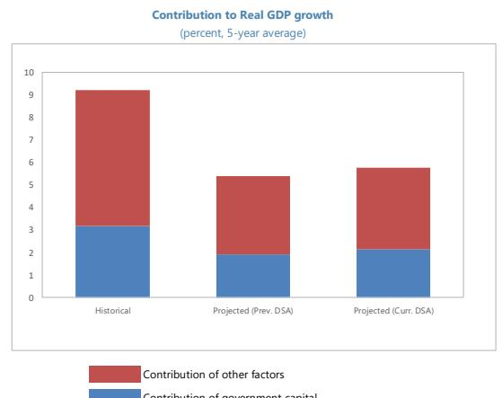

Figure 5. Kyrgyz Republic: Qualification of the Moderate Category, 2026–36 1/  
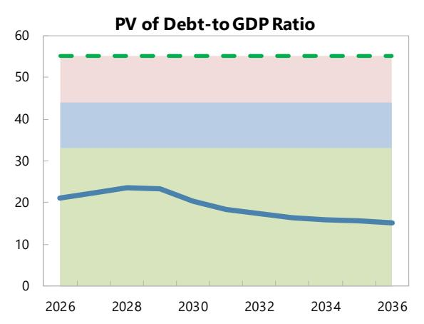

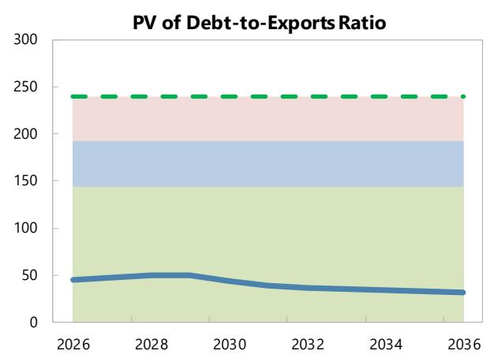

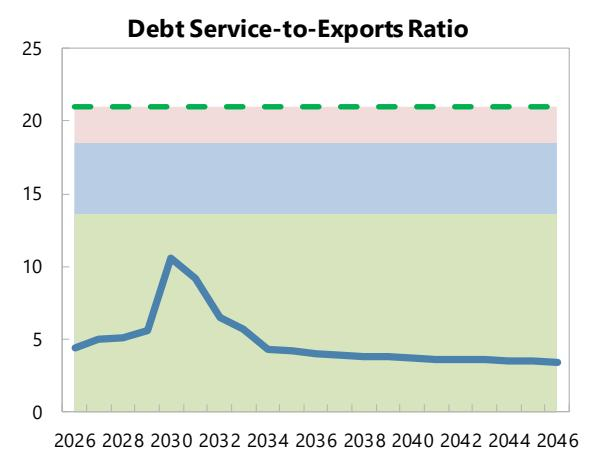

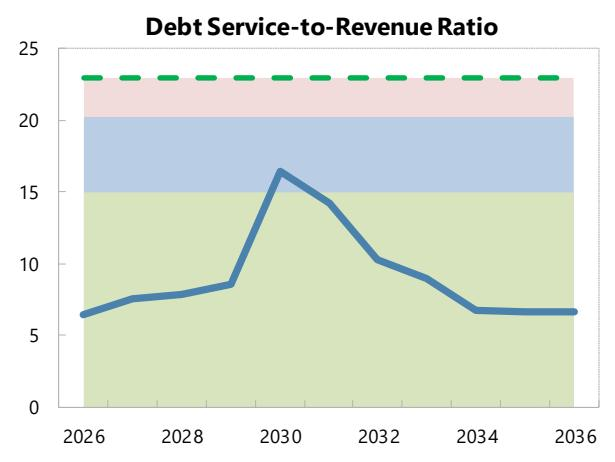

  
Sources: Country authorities; and staff estimates and projections.  
1/ For the PV debt/GDP and PV debt/exports thresholds, x is 20 percent and y is 40 percent. For debt service/Exports and debt service/revenue thresholds, x is 12 percent and y is 35 percent.

Figure 6. Kyrgyz Republic: Indicators of Domestic Public Debt, 2022-2036  
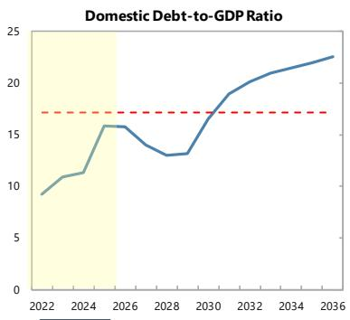

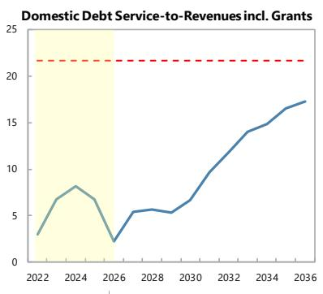  
Median of average projected values over the first five years of the forecast period across countries using the LIC DSF with non-zero domestic debt, end-2023

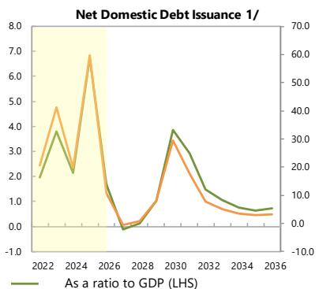  
As a ratio to domestic debt stock in prev. year (RHS)

<table><tr><td>Borrowing Assumptions (average over 10-year projection)</td><td>Value</td></tr><tr><td>Shares in new domestic debt issuance</td><td></td></tr><tr><td>Medium and long-term</td><td>90%</td></tr><tr><td>Short-term</td><td>10%</td></tr><tr><td>Borrowing terms</td><td></td></tr><tr><td>Domestic MLT debt</td><td></td></tr><tr><td>Avg. real interest rate on new borrowing</td><td>4.3%</td></tr><tr><td>Avg. maturity (incl. grace period)</td><td>5</td></tr><tr><td>Avg. grace period</td><td>4</td></tr><tr><td>Domestic short-term debt</td><td></td></tr><tr><td>Avg. real interest rate</td><td>0.8%</td></tr></table>

# Statement by Mr. Loszewski and Ms. Kadyrberdieva on Kyrgyz Republic June 3, 2026

On behalf of our Kyrgyz authorities, we thank Mr. Gershenson and his team for the constructive dialogue as well as the comprehensive and valuable set of reports.

## Recent economic developments

The Kyrgyz Republic continues to record the highest economic growth rate in Central Asia for the third consecutive year, with real GDP increasing by 11.1 percent in 2025. Growth was supported mainly by private consumption and public investments, which led to sectoral growth in construction, industry, and services. This strong economic momentum continued into the current year, with real GDP expanding by 12.4 percent year-on-year over January-April 2026, supporting employment and wages as the country transitions from its low-income status. Job growth accelerated significantly in 2024, with the number of newly created jobs increasing by 141 percent compared to 2023. This momentum was sustained in 2025, although at a more moderate pace, with an annual increase of 4 percent. In addition, labor market formalization has improved. Unemployment steadily declined from 5.3 percent in 2021 to 3.7 percent in 2024. As a result, average household wages increased by about 36 percent between 2022 and 2024, contributing to nearly three-quarters of the decline in poverty rates from 29.8 percent in 2023 to 25.7 percent in 2024.

At the same time, inflationary pressures—particularly in food, fuel, and services—have persisted. Inflation rose from 6.3 percent in 2024 to 9.4 percent in 2025. As of May 15, annual inflation reached 10.9 percent, exceeding the National Bank of the Kyrgyz Republic’s (NBKR) target range of 5-7 percent. The underlying drivers of inflation are increasingly non-monetary in nature, reflecting a combination of external factors and entrenched domestic conditions. These include higher electricity and utility tariffs, rising prices in the hospitality sector associated with ongoing fiscalization reforms in tax administration, and strong domestic demand. Monetary drivers of inflation—stemming from the expansion of the money supply through both fiscal and monetary channels—have been actively sterilized by monetary policy instruments and mitigated by the maintenance of stability in the domestic foreign exchange market.

The country's fiscal position strengthened considerably, with the government recording surpluses in the last three years since 2023. Tax revenues rose sharply, driven by higher corporate income tax collections and increased taxes on international trade, creating fiscal space for greater spending on public wages, interest payments, and capital investment. Combined with strong GDP growth, this contributed to a decline in public debt. The country has established a presence in international capital markets through its inaugural Eurobond issuance. The state-owned Eldik Bank successfully issued Eurobonds on international capital markets in April 2026 with the proceeds directed toward lending to key economic sectors, financing environmental, social, and governance projects, and developing the green economy. The financial sector is experiencing robust expansion, driven in part by the rapid growth of virtual assets and credit to the economy. While commercial banks remain largely profitable, well-capitalized, and resilient, these dynamics warrant close monitoring as they may pose risks to financial stability.

The external environment has remained broadly favorable. At the regional level, cooperation among Central Asian countries has strengthened, facilitating greater cross-border trade and investment. Long-standing border disputes with Tajikistan and Uzbekistan have been resolved, alleviating tensions that had persisted for decades. International reserves have increased, while remittances continue to serve as an important buffer supporting household welfare.

## Outlook and risks

The Kyrgyz government has reinforced administrative continuity and reform implementation, advancing new governance initiatives. Adopted in June 2025, the National Development Program through 2030 has continued to guide reform implementation, with a focus on structural transformation, industrialization, economic diversification beyond the extractive sector, and the development of green energy and logistics.

Large-scale infrastructure projects continue to be central to the authorities' development strategy. The Kambarata-1 Hydropower Project, a flagship regional initiative jointly pursued with Kazakhstan and Uzbekistan, has moved from initial preparation toward active implementation, with continued technical, environmental, and financing work supported by the World Bank Group and other development partners and expectations that the project will materially strengthen energy security and regional cooperation once completed. In parallel, construction of the China-Kyrgyzstan-Uzbekistan railway is also progressing, marking a step toward transforming Kyrgyzstan into a key regional transit hub and reducing transport bottlenecks for trade with China and broader Eurasian markets. The global mountain agenda has also been elevated as a national priority, with a focus on promoting sustainable mountain development, preserving mountain ecosystems, and strengthening the resilience and livelihoods of mountain communities.

The authorities acknowledge the risks posed by geopolitical tensions and global economic uncertainty, including potential impacts from higher energy prices. However, they believe that the fundamental economic trajectory remains sound, supported by ongoing reforms, major investment projects, and prudent policy management.

## Fiscal policy

The authorities entered 2026 with a prudent fiscal stance, anchored in a state budget adopted with a surplus. This reflects strong revenue mobilization and a firm commitment to medium-term fiscal sustainability, including prioritizing debt repayment and financing capital and social spending within available resources. The authorities remain committed to financing critical investments in infrastructure and human capital while strengthening revenue administration.

Reducing fiscal risks remains a key priority. Fiscal policy continues to be guided by the objective of fostering an enabling environment for private sector-led growth, job creation, and enhanced investment attractiveness. In this regard, the authorities are advancing efforts to broaden the tax base, reduce the shadow and informal economy, improve transparency, and simplify taxation for businesses. Ongoing measures include expanding the taxpayer base—particularly through the formalization of small and medium-sized enterprises (SMEs)—and further digitalizing tax and customs administration to enhance efficiency and revenue collection. Thus, the authorities consider any increase in the progressivity of the personal income tax to be premature and do not envisage pursuing such changes over the medium term.

The authorities remain committed to strengthening public financial and project management. Efforts are also underway to enhance the governance and efficiency of state-owned enterprises. The authorities recognize the importance of carefully assessing the public pension system to safeguard long-term fiscal sustainability. The authorities view the Stabilization Fund (SF) as an extra-budgetary fund that plays an important role in safeguarding fiscal resilience and supporting sustainable socio-economic development. The SF serves both savings and stabilization functions, including: (i) ensuring continuity of socio-economic development during global downturns; (ii) mitigating the impact of adverse external shocks on the domestic economy and public finances; and (iii) providing resources for deficit financing to address unforeseen expenditures and maintain budget balance in the event of revenue shortfalls. Together with measures to further improve expenditure efficiency, these reforms are aimed at reducing fiscal vulnerabilities and limiting reliance on external borrowing.

Prudent debt management remains central to the authorities' policy framework. While flagship infrastructure projects continue to be financed primarily through concessional lending from international financial institutions, the authorities are mindful of the costs and risks associated with external borrowing on commercial terms and recognize the importance of careful planning of external debt maturities to avoid pressure on the treasury's liquidity position and risks to international reserves. The authorities emphasize that external financing is expected to be directed predominantly toward high-return infrastructure investments.

## Monetary policy and financial sector

Monetary conditions were tightened amid intensifying external and domestic inflationary factors. Monetary policy remains focused on containing inflation and safeguarding financial stability, with the NBKR maintaining a price-stability-oriented framework aimed at achieving inflation targets within the range of 5-7 percent in the medium term.

The inflation outlook in the Kyrgyz Republic remains sensitive to external conditions. The primary external risks are linked to ongoing geopolitical tensions, price volatility in global food markets, and potential disruptions in global supply chains. Domestic inflation factors are more predictable in nature and are primarily driven by sustained domestic demand and the implementation of tariff policies. Collectively, these conditions shape the prospective trajectory of inflation, with risks mostly stemming from external factors.

Against this backdrop, the NBKR continues to closely monitor and assess inflation drivers. Consequently, the NBKR's key policy rate has been maintained at 12 percent while establishing a symmetric and narrower interest rate corridor. On May 26, the overnight deposit rate—used to remunerate banks' excess liquidity—was further increased from 6 to 10 percent. Effective June 2025, the NBKR transitioned to issuing longer-term notes, specifically with maturities of three and six months. Sustaining tight monetary conditions will create a solid foundation for bringing inflation down to the 5-7 percent range over the medium term.

In the financial sector, the NBKR remains well-positioned to address and closely monitor elevated levels of non-performing loans and rapid credit expansion. The authorities recognize the challenges associated with crypto assets and are actively addressing emerging risks stemming from the rapidly evolving virtual assets sector. Efforts are underway to establish a robust regulatory response, supported by clearly defined institutional mandates. In parallel, the authorities are committed to strengthening the effectiveness of AML/CFT frameworks, while enhancing the supervision and governance of Virtual Asset Service Providers.

In response to Western sanctions affecting Kyrgyzstan's financial sector, the authorities have adopted a two-pronged strategy. This approach combines targeted domestic enforcement measures—aimed at preventing exposure to secondary sanctions—with active diplomatic

engagement to address and mitigate external constraints. Key measures undertaken include conducting audits of the banking sector, strengthening oversight of virtual asset activities, suspending the operations of firms exposed to sanctions risks, and maintaining ongoing diplomatic dialogue with international partners.

## Structural reforms

The economic policy agenda remains focused on preserving macroeconomic stability and strengthening resilience, while recognizing the need for further reforms to reduce informality, enhance competition, and foster more private sector-driven and inclusive growth. The authorities are committed to advancing governance reforms, including the effective implementation of the 2025 Anti-Corruption Strategy.

Reducing informality remains critical to achieving inclusive growth. SMEs account for approximately 50 percent of GDP; however, they continue to face regulatory constraints, and relatively few are able to scale. In response, reform efforts are now underway to implement an improved Investment Law with stronger investor protections, improved arbitration mechanisms, and streamlined licensing and permitting processes through digitalization and the reduction of administrative burdens. Continued efforts to improve skills matching, labor mobility, and access to finance for SMEs will be essential to facilitating their transition to the formal sector.

The authorities also recognize the transformative potential of artificial intelligence and are committed to harnessing its applications to improve public service delivery and support broader socio-economic development. In this context, they plan to further strengthen the regulatory framework and continue investing in digital infrastructure.