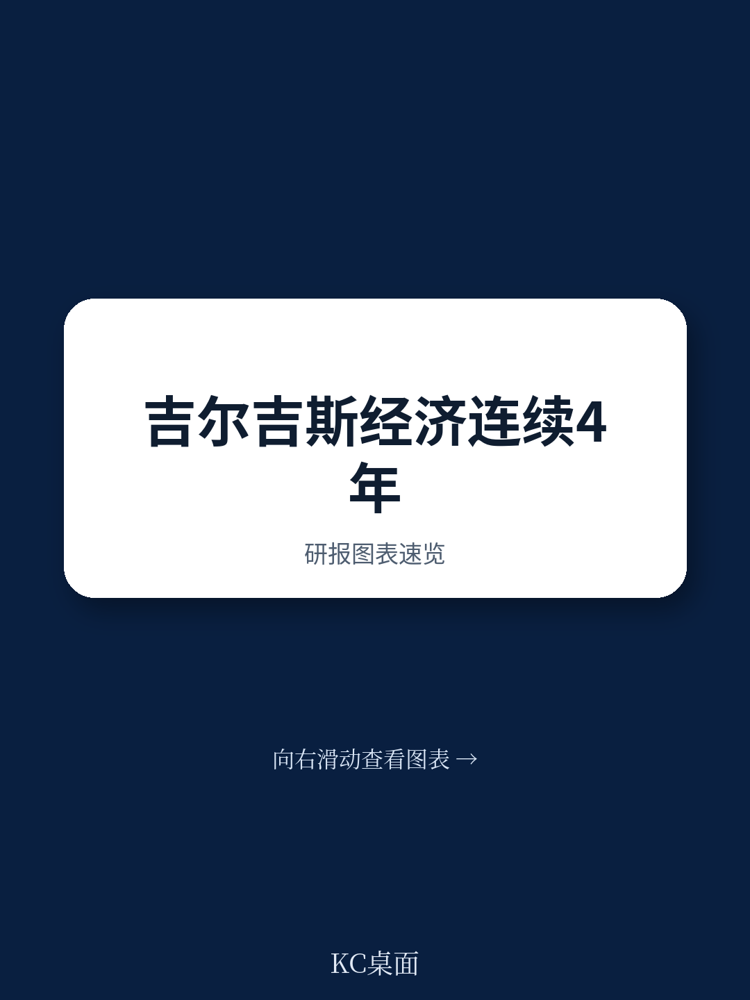
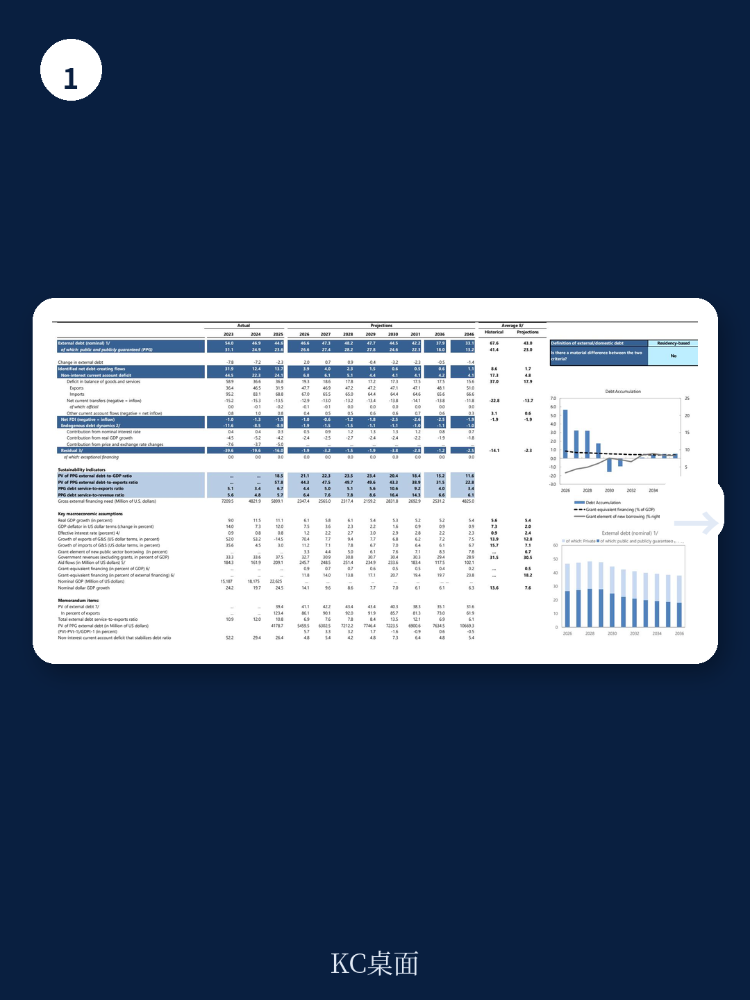
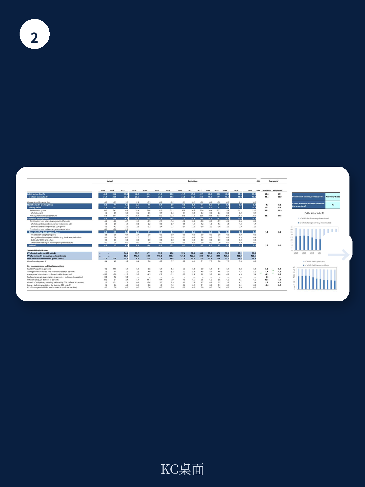

# IMF：吉尔吉斯斯坦三年狂飙后，真正的考验是通胀与改革窗口

吉尔吉斯斯坦正在经历一个罕见的增长周期。2021年至2025年，该国实际GDP累计扩张47%，成为全球增长第三快的经济体。人均GDP在四年内翻倍，达到3100美元。对于一个正在从低收入向中等收入过渡的中亚国家而言，这样的成绩单足以让许多新兴市场羡慕。

但IMF在2026年7月发布的第四条款磋商报告中，给出了一个清醒的判断：这轮高增长的主要驱动力——转口贸易、侨汇流入和大规模基建支出——正在接近天花板。2026年3月，通胀已攀升至11%，远超央行5-7%的目标区间。财政从连续三年的盈余转为赤字，信贷增速接近50%，银行体系与主权信用的关联度在加深。

这份报告的核心信息可以概括为一句话：吉尔吉斯斯坦用四年时间跑出了加速度，但真正的考试才刚刚开始。问题不是增长是否可持续，而是能否在增长放缓之前，用改革建立起真正的韧性。

## 1. 增长引擎正在切换：从贸易红利到基建驱动，中间存在一个空档期

过去四年的增长故事，本质上是一个地缘政治红利的故事。2022年以来，吉尔吉斯斯坦作为欧亚经济联盟成员，承接了大量因制裁而转移的贸易流。转口贸易、跨境支付和物流服务成为经济的主要拉动力。出口在2023年和2024年分别增长52%和53%，远超历史均值。

但这份IMF报告明确指出，这些贸易相关的收益正在消退。2025年出口已经出现14.5%的下降，2026年预计因基数效应反弹至70%，但此后增速将迅速回落到个位数。报告使用的措辞是“reexport and trade-related activities plateau”——转口贸易进入平台期。

> **KC评论：** 这不是一个短期的周期性调整，而是增长动力的结构性切换。过去四年吉尔吉斯斯坦的增长模式高度依赖外部环境变化，而非内生竞争力。报告暗示，未来增长将更多依赖大型基础设施项目，但基建从投资到产出需要时间。这个空档期恰恰是通胀压力和财政赤字最容易失控的阶段。

IMF的预测显示，2026-2031年实际GDP增速将从2025年的11.1%逐步放缓至5.2%左右。这个数字仍然可观，但相比过去四年已经腰斩。对于投资者和企业而言，关键问题在于：5%的增长是否足以消化当前积累的宏观失衡？

## 2. 通胀不是输入性冲击，而是国内需求过热的信号

2026年3月通胀达到11%，这个数字本身并不算极端——许多新兴市场都经历过更高的通胀。但值得关注的是它的成因。报告显示，通胀压力并非主要来自全球能源或食品价格冲击，而是由“sustained domestic demand and the implementation of tariff policies”驱动。

这是一个重要的判断。它意味着吉尔吉斯斯坦的通胀是内生的，是连续四年高增长、财政扩张和信贷爆炸共同作用的结果。广义货币在2025年增长了43.3%，私人部门信贷增长了49%。这些数字远超名义GDP增速，说明经济已经出现明显的过热迹象。

IMF的建议是维持“appropriately tight and data-dependent monetary policy stance”，同时强调要“strengthen the independence of the central bank”。后一点在Executive Board Assessment中被单独提及，暗示央行独立性可能面临政治压力。

> **KC评论：** 报告没有明说，但隐含的逻辑很清楚：如果央行不能独立收紧货币政策，通胀可能比预测的更持久。IMF预测通胀要到2027年之后才会逐步回落到目标区间，这个判断的前提是“macroeconomic policies are tightened appropriately”。如果收紧力度不够，通胀粘性将超出预期。

对于关注中亚市场的投资者，这意味着吉尔吉斯斯坦的利率环境将在未来1-2年内保持高位。政策利率已从2024年底的9%上调至11-12%，且央行还在提高隔夜存款利率以吸收银行体系过剩流动性。高利率对信贷驱动的消费和投资活动将产生抑制效应。

## 3. 财政空间的收缩比表面数字更值得警惕

2023-2025年，吉尔吉斯斯坦连续三年实现财政盈余。但2026年预计将转为3.8%的赤字，且此后几年赤字率维持在2.8-3.6%之间。公共债务占GDP比重从2024年的36.2%回升至2026年的41.4%，此后稳定在40%左右。

表面上看，这些数字并不危险——40%的债务率在新兴市场中属于较低水平。但报告指出了几个结构性隐患：

第一，税收收入占GDP比重仅为22.6%，且多年没有明显提升。这意味着财政扩张主要依赖非税收入和外部融资，而非自身税基的扩大。

第二，支出结构存在问题。资本性支出（net acquisition of nonfinancial assets）占GDP比重从2023年的6.8%上升到2026年的9.7%，但其中有多少能够转化为长期生产力，报告持保留态度。

第三，能源补贴和公共部门工资支出正在挤压财政空间。IMF特别提到需要“containing expenditure on energy subsidies and wages”。

第四，准财政操作和国有企业风险没有被充分反映。报告要求“fully capture quasi-fiscal operations and SOE risks”，包括确保稳定基金的操作透明地反映在财政报告和风险评估中。

> **KC评论：** 这些隐患共同指向一个结论：吉尔吉斯斯坦的财政韧性比表面数字显示的要弱。如果外部融资条件恶化，或者大型基建项目出现成本超支，债务可持续性可能面临压力。报告中的债务可持续性分析（DSA）虽然给出了“sustainable”的结论，但前提假设是持续获得优惠融资和较高的经济增长。这两个假设都存在不确定性。

## 4. 金融体系的风险正在从信贷过快转向银政关联

信贷增速49%，不良贷款（NPL）高企，同时银行与主权信用之间的关联在加深——这是IMF对吉尔吉斯斯坦金融体系的三点核心担忧。

其中，“deepening bank-sovereign nexus”是一个值得单独讨论的问题。报告没有展开，但这句话指向一个典型的新兴市场风险：当银行大量持有政府债券，或者当政府通过银行体系为财政赤字融资时，主权信用与银行体系之间会形成负反馈循环。一旦一方出现问题，另一方会迅速被拖下水。

报告呼吁“heightened financial supervisory vigilance and capacity, focusing on a risk-based approach and proactive macroprudential measures”。同时特别提到“enhanced AML/CFT measures and stronger supervision and governance of virtual asset service providers”。

> **KC评论：** 这里有一个报告没有完全展开但值得追问的问题：虚拟资产服务提供商（VASPs）在吉尔吉斯斯坦金融体系中的真实规模有多大？报告提到当局已经“suspending the operations of firms exposed to sanctions risks”，但未披露这些操作对银行体系的潜在传导影响。完整报告中关于“Mitigation of Cross-border Financial Integrity Risks”的附件，很可能包含更详细的评估数据。

## 5. 改革窗口期正在收窄，但最难的改革尚未启动

IMF报告反复强调一个观点：当前的经济繁荣提供了一个“window of opportunity to accelerate reforms”。这句话在Staff Report和Press Release中出现了多次，本身就是一个信号——改革窗口期不会永远存在。

优先改革领域包括：国有企业改革、营商环境改善、法治建设、反腐败、减少非正规经济、劳动力市场灵活性、人力资本和数字基础设施投资。这些几乎是所有新兴市场的标准药方，但吉尔吉斯斯坦面临一个独特的约束：其非正规经济规模庞大，SME贡献了约50%的GDP，但绝大多数企业规模小、生产率低，且难以获得正规融资。

报告的Annex VI专门讨论了人工智能的暴露度和准备度，这是一个值得关注的信号。IMF认为AI有潜力改善公共服务交付，但前提是必须先投资数字基础设施和监管框架。对于一个人均GDP刚过3000美元的国家，这个建议既现实又充满挑战。

## 报告尚未完全回答的三个关键问题

这份IMF报告提供了全面的诊断和建议，但在三个问题上留下了开放空间：

第一，转口贸易消退后的增长缺口如何填补？报告提到基建将起到支撑作用，但没有量化基建投资对GDP的乘数效应，也没有分析这些项目的融资结构是否可持续。

第二，银行体系与主权信用的关联度到底有多深？报告给出了定性的判断，但没有提供具体的资产负债表数据。完整报告中的Financial Soundness Indicators表格可能包含更详细的信息。

第三，地缘政治风险如何量化？报告提到“limited exposure to the war in the Middle East”和“Western sanctions affecting Kyrgyzstan's financial sector”，但没有进行情景分析。在高度不确定的全球环境下，这种量化缺位可能低估了尾部风险。

这些未解问题，正是完整报告中最值得深入阅读的部分。IMF的Staff Report通常包含详细的附录、情景分析和数据表格，这些内容在新闻稿和摘要中无法完全呈现。

---

我们每天会由AI agent加人工review，生成国际投行和IMF的最新中文摘要与KC评论，daily更新，约10-40页，也包含当天最新数据图表合集。既方便喂给AI，也方便人工快速把握market dynamics。如果你想获取今天这份IMF报告的完整解读、原始图表和附录分析，欢迎加入我们的社群继续讨论。

Personal reading notes and learning share only. Not investment advice.

