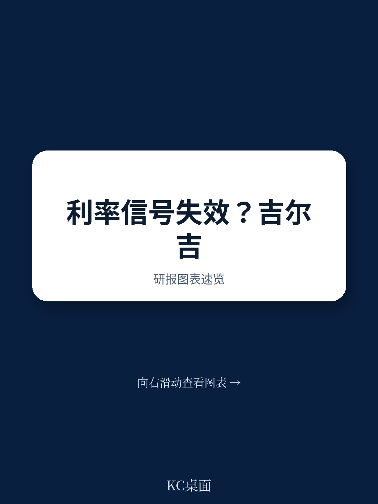
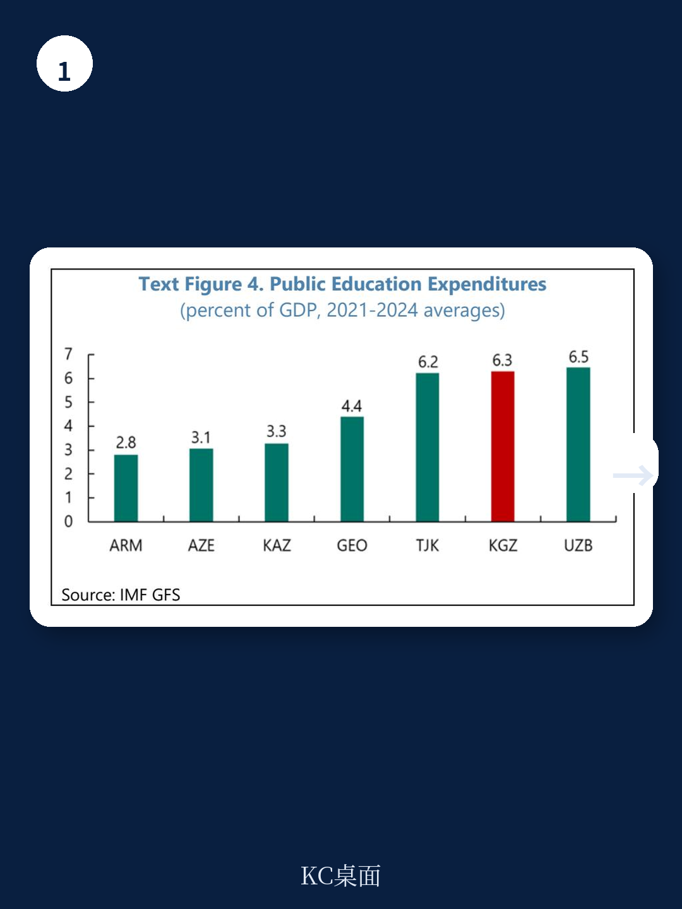
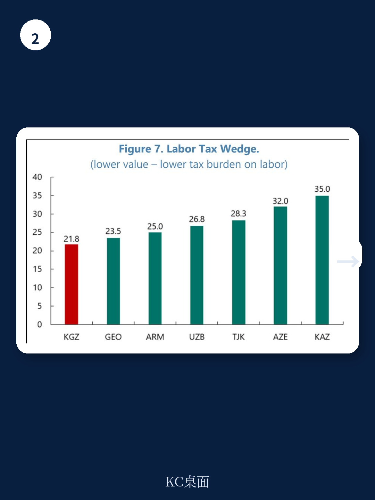

# IMF报告：吉尔吉斯共和国的真实货币政策远比政策利率宽松

当一家央行的政策利率传递紧缩信号，而市场利率、信贷增速和流动性状况却指向相反方向时，决策者该如何判断真实的经济温度？IMF最新发布的吉尔吉斯共和国国别报告，用一套完整的金融条件指数（FCI）框架回答了这个问题。结论明确：该国自2024年初以来，实际金融条件已显著宽松，而政策利率的紧缩信号在很大程度上被过剩流动性、快速信贷扩张和偏低的货币市场利率所抵消。

这份报告的价值不仅在于其分析对象——一个中亚小型开放经济体——更在于它为所有面临“流动性过剩困境”的央行提供了一个可复用的诊断框架。当银行体系持续处于净盈余状态、央行沦为系统的净借款人时，政策利率的传导机制就会失灵。这一问题在全球许多新兴市场和发展中经济体普遍存在。

## 1. 过剩流动性正在瓦解政策利率的传导链条，央行需要重新审视自己的操作锚

报告的核心发现之一是，吉尔吉斯国家银行（NBKR）虽然维持了相对较高的政策利率，但银行间市场利率持续低于政策利率，两者之间出现了一个持续存在的“楔子”。原因在于，该国的银行体系自2022年以来一直处于结构性流动性过剩状态——央行再也没有向银行提供过再融资，反而需要从银行吸收资金。

这种局面下，利率走廊的“地板”取代了政策利率，成为货币市场利率的实际锚。当走廊地板被调低时，即便政策利率纹丝不动，银行间利率和短期收益率也会随之下行。这意味着，央行发出的紧缩信号在实际融资条件层面被“短路”了。

> **KC评论：** 这不仅仅是吉尔吉斯的问题。任何面临持续资本流入、财政存款淤积或黄金购买等带来流动性过剩的央行，都会遇到同样的困境。报告中的这个分析框架，对于理解中国央行在2014-2016年以及2020年疫情期间的货币政策操作，同样具有参考价值。完整报告中的Text Box 1详细解释了这一机制的经济学逻辑，并引用了Saxegaard（2006）、Barajas等人（2016）和Fricke等人（2024）的实证证据，值得仔细阅读。

## 2. 信贷增速远超名义GDP，家庭部门成为本轮信用扩张的主要推手

报告揭示了一个值得警惕的结构性变化：信贷增长持续超过名义GDP增速，且新增贷款的分配正在发生根本性转变。家庭部门在新发放贷款中的占比在2024-25年达到了历史最高水平，而企业贷款增速则相对温和。截至2025年，新增银行贷款总额已超过GDP的25%。

这一现象表明，金融深化正在加速，但同时也带来了宏观金融脆弱性的上升。家庭部门对短期消费贷款和抵押贷款的依赖度增加，意味着一旦经济增速放缓或就业市场恶化，银行资产质量可能面临集中性压力。更重要的是，这种由家庭信贷驱动的需求扩张，正在成为通胀持续高企的国内需求侧推手。

## 3. IMF构建的金融条件指数揭示：真正宽松的不是政策，而是信贷和流动性

报告的核心贡献在于构建了一套完整的金融条件指数（FCI），综合了政策利率、市场利率、货币总量、银行信贷、汇率和全球金融条件六大类指标。更关键的是，报告采用了三种互补的加权方法——等权重、主成分分析（PCA）和结构向量自回归（SVAR）——以确保结果的稳健性。

三种方法得出的结论高度一致：自2024年初以来，金融条件显著放松。FCI分解进一步揭示，这一放松的主要驱动力是信贷增速加快和货币扩张，以及市场利率的下降。与此形成鲜明对比的是，政策利率本身的贡献始终是紧缩性的。换句话说，政策信号的紧缩效应被流动性和信贷的扩张效应部分抵消了。

> **KC评论：** 这个FCI框架的构造方法本身就值得借鉴。报告中的Text Table 1列出了所有11个具体指标，从政策利率到美联储利率，从银行间利率到家庭信贷，覆盖了国内和外部两个维度。对于任何关注宏观金融条件的研究者或投资者来说，这套方法论都可以直接复制到其他经济体的分析中。完整报告的Annex I详细说明了PCA和SVAR的具体技术步骤，包括特征值、因子载荷和脉冲响应函数，适合需要深入理解计量方法细节的读者。

## 4. 实际中性利率估计显示，真实货币政策立场比名义信号更为宽松

为了进一步验证FCI的结论，报告还估算了吉尔吉斯的实际中性利率。采用滚动泰勒规则估计的结果显示，当前的实际中性利率约为2%，低于2014-2019年间约3%的平均水平。这一趋势与全球中性利率普遍下行的背景一致。

更为关键的是实际政策利率缺口——即实际政策利率与中性利率之差。报告发现，这一缺口目前为负值，意味着即便名义政策利率处于高位，实际货币政策立场仍然是宽松的。这一判断与FCI的走势高度吻合，形成了双重验证。相比之下，2023-24年间实际利率缺口为正的时期，恰好对应了金融条件收紧和通胀回落至目标区间的过程，这反过来证明了当实际利率高于中性基准时，紧缩政策是有效的。

> **KC评论：** 实际中性利率的估计是理解当前货币政策立场的核心概念，但也是争议最大的领域之一。报告坦诚地指出，这一估计存在较大不确定性，且在不同时期出现了明显变化。对于关注美联储或中国央行政策路径的读者来说，理解中性利率的估算逻辑和其局限性，远比记住一个具体数字更有价值。报告中的Text Figure 9和Text Figure 10展示了中性利率和实际政策利率缺口的演变，这些图表在完整报告中以更高分辨率呈现。

## 5. 报告尚未完全回答的关键问题：非正规经济的结构性障碍如何突破？

除了货币政策分析外，报告还用了相当篇幅讨论吉尔吉斯的非正规经济问题。数据显示，该国的非正规就业占比超过60%，女性、年轻人和农村劳动力的非正规率更高。非正规经济的持续存在，不仅削弱了税收基础、限制了生产率提升，也使得货币政策传导面临额外的结构性障碍——因为大量经济活动游离于正规金融体系之外。

报告提出了一系列政策建议，包括简化税收合规、扩大社会保障覆盖、改革教育和技能培训、加强治理和制度能力、以及改善中小企业融资渠道。然而，报告并未深入讨论一个关键问题：在这些结构性改革见效之前，货币政策如何在非正规经济占比如此之高的环境中有效传导？换言之，FCI框架捕捉的“金融条件”可能主要反映的是正规部门的融资状况，而占经济总量近半的非正规部门对利率信号的反应可能完全不同。

这一未解问题，恰恰是理解新兴市场经济体货币政策有效性的核心。如果你希望进一步探讨非正规经济对货币政策传导的具体影响机制，以及IMF报告中没有展开的量化分析，欢迎加入我们的社群，获取完整研报解读与原始图表。我们每天通过AI agent加人工审核，生成约10-40页的国际投行中文摘要与KC评论，涵盖最新数据图表合集，既方便喂给AI，也方便人工快速把握市场动态。

Personal reading notes and learning share only. Not investment advice.

