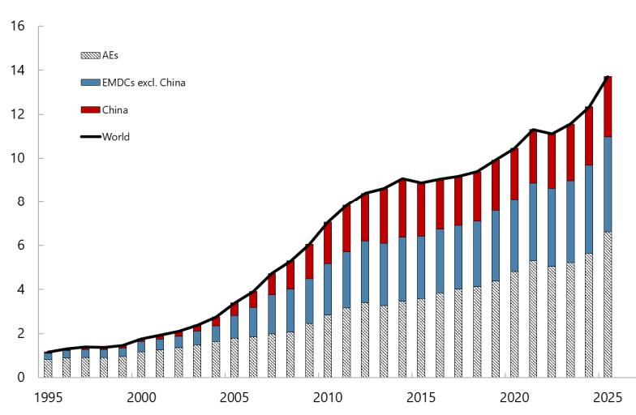
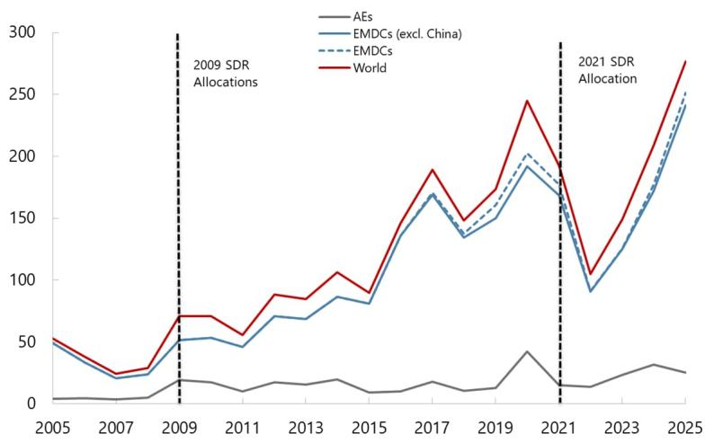
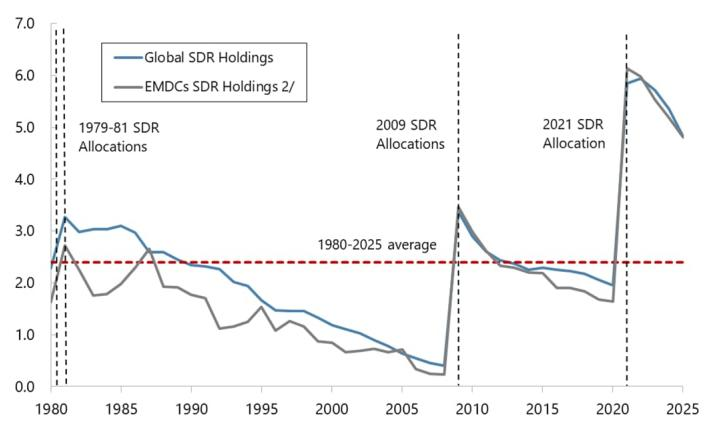
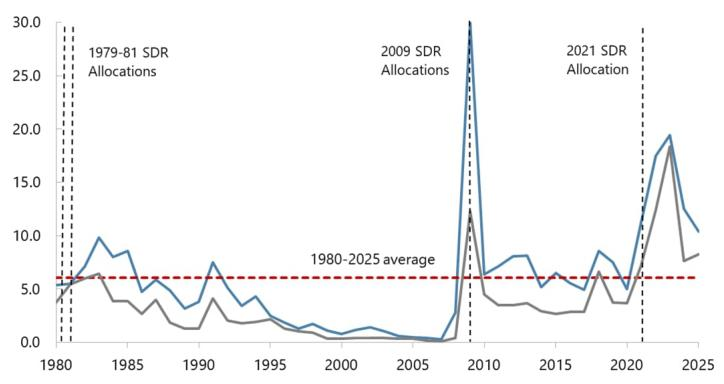
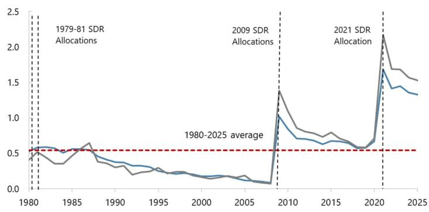

## IMF POLICY PAPER

June 2026

THE CASE FOR A GENERAL ALLOCATION OF SDRs
DURING THE THIRTEENTH BASIC PERIOD

IMF staff regularly produces papers proposing new IMF policies, exploring options for reform, or reviewing existing IMF policies and operations. The following documents have been released and are included in this package:

\- The Report of the Managing Director to the Board of Governors, transmitted to the Board of Governors on June 26, 2026.

\- The Staff Report, prepared by IMF staff and completed on June 15, 2026 for the Executive Board's Information.

The IMF's transparency policy allows for the deletion of market-sensitive information and premature disclosure of the authorities' policy intentions in published staff reports and other documents.

Electronic copies of IMF Policy Papers are available to the public from http://www.imf.org/external/pp/ppindex.aspx

International Monetary Fund
Washington, D.C.

# INTERNATIONAL MONETARY FUND

Report of the Managing Director to the Board of Governors Pursuant to Article XVIII, Section 4(c) for the Thirteenth Basic Period

## June 26, 2026

The Twelfth Basic Period began on January 1, 2022 and is scheduled to end on December 31, 2026. The Thirteenth Basic Period will commence on January 1, 2027. The Articles of Agreement require the Managing Director to determine whether there is a case for a proposal regarding a general allocation or cancellation of Special Drawing Rights (SDR) in the next Basic Period to the Board of Governors no later than six months before the end of each Basic Period (Article XVIII, Section 4(c).

The Managing Director must be satisfied that a proposal for a general allocation or cancellation of SDRs, in her view: (i) is consistent with meeting the long-term global need to supplement existing reserve assets as set out in Article XVIII, Section 1(a); and (ii) would have broad support among participants in accordance with Section 4(b) of the same Article. Executive Board concurrence is required under Article XVIII, Section 4(a) for the proposal. Pursuant to Article XVIII, Section 4(d), a decision of the Board of Governors approving such a proposal of the Managing Director would require an 85 percent majority of the total voting power of members representing participants in the SDR Department, which currently encompasses all members of the Fund. If the Managing Director ascertains that there is no proposal consistent with Article XVIII, Section 1(a) that has broad support among participants, she must so report to the Board of Governors and to the Executive Board. The present report is submitted in accordance with these provisions.

In forming my view as to whether there is currently a basis for a new proposal, I have taken the following into consideration:

\- The case for a new allocation is not clear at this time. Since the 2021 General SDR allocation—the largest in Fund history—that took place during the last Basic Period, global developments have been characterized by resilient economic growth, high levels of international reserve assets, ample global liquidity, and improved access of emerging market economies to international capital markets. Despite the wars in Ukraine and the Middle East, since 2021, reserve assets have increased by over 21 percent globally, and by over 22 percent for emerging and developing countries (excluding China). The stock of SDRs relative to global reserves, capital flows, and international trade remain elevated, well above the levels before the 2021 Allocation as well as historical averages. While the war in the Middle East has already had major impacts on many members, its impact across members is asymmetric, along with its duration being unknown. As such, there is no strong evidence of a long-term

need to supplement global reserve assets at the current juncture. Staff will continue to closely monitor the situation in case the effects of the war become more persistent and widespread.

\- A new general SDR allocation would not receive the necessary support in terms of voting majority at this stage that is required for any proposal to succeed. In recent bilateral consultations, while a few Executive Directors saw merit in an allocation, Directors representing a majority of participants in terms of their voting power indicated that they would not support a new allocation in the current context. For reference, the last two SDR general allocations took place in the context of major global economic developments; the 2021 General SDR Allocation (SDR 456.5 billion) in the context of the COVID-19 Crisis, and the 2009 General Allocation (SDR 161.2 billion, in addition to the special allocation of SDR 21.5 billion to implement the Fourth Amendment to the Articles of Agreement) during the Global Financial Crisis. Prior to 2009, no general allocation had been approved since 1981.

On the basis of these considerations, I informed the Executive Board in my report of June 15, 2026 of my view at this stage that I would not be in a position to make, by June 30 of this year, a proposal for the Thirteenth Basic Period consistent with the provisions of the Articles that would have the broad support among participants.

In accordance with Article XVIII, Section 4(c), this does not preclude me during the Thirteenth Basic Period from making proposals on my own initiative, nor the Board of Governors or the Executive Board from requesting that I make a proposal, including in the event of unexpected major developments.

June 15, 2026

## THE CASE FOR A GENERAL ALLOCATION OF SDRs DURING THE THIRTEENTH BASIC PERIOD

## EXECUTIVE SUMMARY

This report sets out the basis for consideration of a new allocation or cancelation of Special Drawing Rights (SDRs) for the next (Thirteenth) Basic Period, scheduled to begin on January 1, 2027. The Articles of Agreement require that the Managing Director determine whether there is a case for general SDR allocation or cancellation to the Board of Governors no later than six months before the end of each five-year Basic Period. The case to make a proposal is based on two requirements: (i) consistency with meeting the long-term global need to supplement existing reserve assets; and (ii) broad support among participants for the proposal

This paper does not present a proposal for a new allocation of SDRs. There is neither a clear economic case nor the necessary support for a new allocation at present. Since the 2021 General SDR Allocation, global developments have been characterized by resilient economic growth, high levels of international reserve assets, ample global liquidity, and improved access of emerging market economies to international capital markets. Moreover, there are clear indications that a new general SDR allocation would not receive the necessary support to proceed.

Based on these considerations, the Managing Director does not plan to make a proposal by June 30, 2026. This does not preclude the Managing Director to make a proposal, at her initiative or at the request of the Board of Governors or the Executive Board, at any time during the Thirteenth Basic Period. Management and staff will continue to carefully monitor the evolving global situation, and remain in close contact with the membership to see how the Fund can best meet their needs.

## Approved By

Bernard Lauwers (FIN)

Yan Liu (LEG)

Christian Mumssen (SPR)

Prepared by the Finance (FIN), Legal (LEG), and Strategy, Policy, and Review (SPR) Departments. The team was led by J. Gijón (FIN), C. Delong (LEG), and A. Shahmoradi (SPR); and comprised Q. Chen and N. Magud (FIN). J. Thornton provided overall guidance under the supervision of C. Oner (FIN), B. Steinki (LEG), and G. Chabert (SPR). G. Pais Marden (FIN) provided research assistance. M. DeGuzman and R. Avila (both FIN) helped prepare the report.

## CONTENTS

BACKGROUND 3

CASE FOR AN ALLOCATION \_\_\_\_ 3

CONCLUSION 4

## FIGURES

1. Reserve Assets and Sovereign Issuances \_\_\_\_ 5

2. Long-term Perspective of SDR Holdings, 1980–2025 \_\_\_\_ 6

## BACKGROUND

1. The Articles of Agreement require the Managing Director to determine whether there is a case for a proposal regarding a general SDR allocation or cancellation to the Board of Governors no later than six months before the end of each five-year Basic Period. The Twelfth Basic Period began on January 1, 2022, and is scheduled to end on December 31, 2026. The Thirteenth Basic Period will commence on January 1, 2027, and based on Article XVIII, Section 4(c) the Managing Director has to make a proposal regarding a general allocation or cancellation to the Board of Governors by June 30, 2026.

2. Before making any proposal, the Managing Director must be satisfied that a proposal for a general allocation or cancellation of SDRs, in her view: (i) is consistent with meeting the long-term global need to supplement existing reserve assets as set out in Article XVIII, Section 1(a); and (ii) that there is broad support among participants for the proposal in accordance with Section 4(b) of the same Article. Executive Board concurrence is required under Article XVIII, Section 4(a) for the proposal. Under Article XVIII, Section 4(d), a decision of the Board of Governors approving such a proposal of the Managing Director requires an 85 percent majority of the total voting power of participants in the SDR Department, which currently encompasses all members of the Fund (Article XVIII, Section 4(d)). If the Managing Director ascertains that there is no proposal which she considers consistent with Article XVIII, Section 1(a) that has broad support among participants, she must so report to the Board of Governors and to the Executive Board (Article XVIII, Section 4(c)). The present report is submitted in accordance with these provisions.

## CASE FOR AN ALLOCATION

## 3. In determining whether to make a proposal, the following issues were considered:

\- The lack of a clear case for a new allocation. The case for a new allocation in accordance with Article XVII, Section 1(a) is not clear at this time. Since the 2021 General SDR allocation—the largest in Fund history—that took place during the last Basic Period, global developments have been characterized by resilient economic growth, high levels of international reserve assets, ample global liquidity, and improved access of emerging market economies to international capital markets (Figure 1). Notwithstanding the wars in Ukraine and the Middle East, reserve assets have increased by over 21 percent globally since 2021, and by over 22 percent for emerging and developing countries (excluding China). The stock of SDRs relative to global reserves, capital flows, and international trade remain elevated, well above the levels before the 2021 Allocation as well as historical averages (Figure 2). While the war in the Middle East has already had major impacts on many members, its impact across members is asymmetric, and its duration unknown. In view of the above-mentioned factors, staff does not see a case for new

allocation. Staff will continue to monitor the situation closely in case the effects of the war become more persistent and widespread.

\- The lack of broad support of participants for a new allocation. There are clear indications that a new general SDR allocation would not receive the necessary 85 percent majority of the total voting power in the Board of Governors at present. In recent bilateral consultations, while a few Executive Directors saw merit in an allocation, Executive Directors representing a majority of the participants in terms of voting power indicated that they would not support a new allocation in the current context. For reference, the last two SDR general allocations took place in the context of major global economic developments; the 2021 General SDR Allocation (SDR 456.5 billion) in the context of the COVID-19 Crisis, and the 2009 General Allocation (SDR 161.2 billion, in addition to a special allocation of SDR 21.5 billion to implement the Fourth Amendment to the Articles of Agreement) during the Global Financial Crisis. Prior to 2009, no general allocation had been approved since 1981.

## CONCLUSION

4. In light of the considerations above, the Managing Director does not plan to make a proposal by June 30 of this year. This conclusion is based on Article XVIII, Section 4, which requires that the Managing Director make a proposal only if, in her view, such a proposal would be consistent with meeting the long-term global need to supplement existing reserve assets, and would also have broad support among participants. In view of this requirement, the considerations above, and the Executive Board's interest in streamlining, the Managing Director does not plan to propose a Board discussion of the issue on this occasion.

5. This conclusion does not preclude the Managing Director from making a proposal during the Thirteenth Basic Period. In accordance with Article XVIII, Section 4(c), the Managing Director can propose an allocation or cancellation, at her own initiative or at the request of the Board of Governors or the Executive Board, at any time during the remainder of the Thirteenth Basic Period, such as in the case of unexpected major developments that could motivate such a proposal.

Figure 1. Reserve Assets and Sovereign Issuances  
Global Reserve Assets, 1995–2025 (In trillions of SDRs)  

Sovereign Issuances, 2005–2025
(In billions of USD)  
  
Source: IMF; World Economic Outlook; and Fund staff calculations.

Figure 2. Long-term Perspective of SDR Holdings, 1980–2025 (In percent of)  
Global Reserves 1/  
  
Global Gross Capital Flows

  
Global Trade 3/

  
Source: IMF; World Economic Outlook; and Fund staff calculations.  
1/ Including gold.  
2/ Excluding China.  
3/ Goods and services.