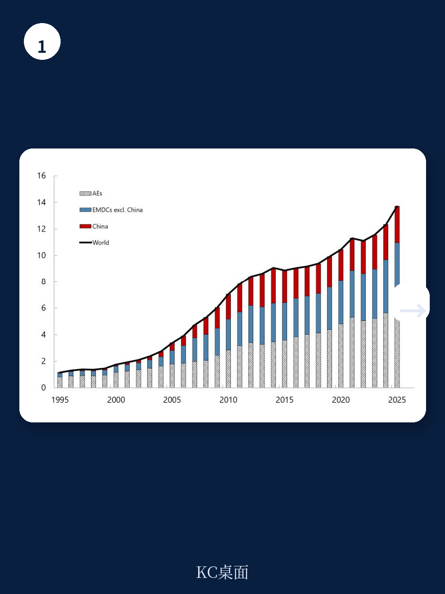
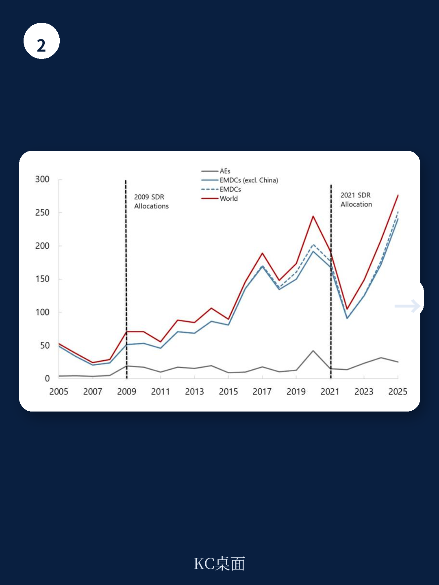

# IMF：SDR新分配的门已经关上，但钥匙还在桌上

2026年6月26日，IMF总裁向理事会提交了一份报告。这份报告的结论并不复杂：在第十三次基本期内，IMF不会主动提议进行新一轮的特别提款权（SDR）普遍分配。上一次这样的分配发生在2021年，规模创历史之最，达到4565亿SDR，用于应对新冠疫情引发的全球流动性危机。再上一次是2009年，应对全球金融危机。再往前推，1981年之后整整28年没有过任何普遍分配。

这份报告的核心判断是：**当前全球经济并不缺流动性，也不缺储备资产，因此SDR分配的经济理由不成立。同时，主要股东的政治支持也不到位。** 但报告留了一个明确的活口——总裁可以在基本期内任何时候，主动或应理事会请求，重新提出分配提案，前提是出现“意料之外的重大发展”。

这不是一份宣告终结的文件，而是一份“暂停键”声明。它告诉市场：SDR作为全球储备资产的补充工具，其使用门槛极高，既需要经济危机级别的触发条件，也需要85%投票权的政治共识。这两个条件目前都不满足。

> **KC评论：** 这份报告最值得读的不是结论本身，而是IMF如何定义“长期全球储备资产补充需求”。这个定义决定了未来什么级别的危机才能重新打开SDR分配的大门。完整报告中的图1和图2展示了全球储备资产、资本流动和贸易相对于SDR存量的历史变化，这些图表才是判断未来触发条件的分析工具。

## 1. 全球储备资产充裕到不需要SDR补充，这是当前最硬的否决理由

IMF报告最核心的经济判断是：自2021年分配以来，全球储备资产增长了超过21%，新兴和发展中国家（不含中国）增长了超过22%。SDR存量相对于全球储备、资本流动和国际贸易的比例，都显著高于2021年分配前的水平，也高于历史均值。

这意味着，即使存在乌克兰战争和中东冲突，全球金融体系并不缺少官方储备资产。SDR的设计初衷是“补充现有储备资产”，当现有储备已经足够充裕时，再分配SDR不仅没有必要，还可能带来道德风险——让一些国家依赖分配而非结构性改革。

报告特别提到，中东战争的影响是不对称的，且持续时间未知。这暗示IMF并非忽视地缘风险，而是认为当前冲击的广度和深度尚未达到需要全球性流动性注入的程度。如果战争影响变得“更持久和更广泛”，IMF会重新评估。

这个判断的逻辑链条是清晰的：全球储备充裕 -> SDR相对比例偏高 -> 没有补充需求 -> 不满足分配的第一个条件。但这里有一个值得追问的缺口：全球储备充裕是一个总量概念，而SDR分配的核心价值在于解决结构性短缺——那些无法通过资本市场融资的低收入国家，它们的储备状况是否同样充裕？报告没有展开这一层分析。

## 2. 85%投票权门槛是政治否决的硬约束，不是技术问题

SDR分配需要理事会85%的投票权支持。美国持有约16.5%的投票权，实际上拥有单边否决权。报告用“bilateral consultations”的措辞暗示，IMF已经摸底了主要股东的态度：少数执行董事看到了分配的价值，但代表多数投票权的董事明确表示不支持。

这不是技术评估的分歧，而是政治意愿的缺失。回顾历史，2009年和2021年两次分配都是在全球性危机背景下发生的——2008年金融危机和2020年新冠疫情。这两次危机都同时满足了两个条件：全球经济出现系统性流动性紧缩，以及主要经济体之间形成了分配共识。

当前的情况是：全球经济韧性超出预期，通胀虽然顽固但衰退风险下降，主要央行资产负债表虽然收缩但市场流动性依然充裕。在这样的环境下，要求美国、欧洲、日本等主要股东支持向全球系统注入新的储备资产，政治上的阻力几乎不可逾越。

> **KC评论：** 85%投票权门槛意味着SDR分配本质上是一个政治决策，而非纯粹的经济判断。报告虽然用经济理由包装了否决结论，但真正决定分配能否推进的，是美国和主要发达经济体的地缘战略考量。完整报告中的“bilateral consultations”部分没有公开具体国家的立场，但可以推测，美国对SDR分配的态度与对IMF份额改革的立场是一脉相承的——不希望在没有相应治理改革的情况下扩大资源转移。

## 3. 报告留下的钥匙：什么情况下SDR分配会重新回到议程？

报告明确保留了“在第十三次基本期内随时提出提案”的可能性。这个“活口”不是客套话，而是制度设计的一部分。SDR基本期是五年，第十三次基本期从2027年1月1日开始到2031年底结束。在这五年内，如果出现“意料之外的重大发展”，IMF总裁可以主动或应请求重启分配程序。

那么，什么样的“重大发展”足以触发新一轮分配？从历史经验看，需要同时满足两个条件：

第一，全球金融体系出现流动性结构性短缺，而非周期性波动。2008年雷曼倒闭后，全球美元融资市场冻结，这是结构性危机。2020年疫情导致全球经济活动骤停，也是结构性危机。当前的乌克兰战争和中东冲突虽然严重，但尚未引发全球性的储备资产短缺。

第二，主要经济体之间形成分配的政治共识。这通常需要美国看到分配符合其战略利益——例如，防止新兴市场债务危机蔓延至全球金融体系，或者作为地缘政治工具支持特定地区的稳定。

报告提到了一个值得关注的细节：中东战争的影响是“不对称的”。这意味着某些国家受到的冲击远大于其他国家。如果这种不对称性持续扩大，导致部分国家出现国际收支危机，而IMF的常规贷款工具又不足以应对，那么SDR分配可能重新被提上议程。

## 4. 报告没有回答的关键问题：SDR分配与份额改革的挂钩逻辑

这份报告最值得追问的，不是它说了什么，而是它没有说什么。IMF目前正在进行第十六次份额总检查，核心议题是提高新兴市场和发展中国家的投票权份额。SDR分配和份额改革之间存在微妙的关联：SDR分配不改变投票权结构，而份额改革会。一些发达经济体将支持SDR分配与份额改革进展挂钩——他们不愿意在不调整治理结构的情况下，向现有体系注入更多资源。

报告完全没有讨论这一层关联。这不是疏忽，而是有意为之。IMF总裁的报告只需要回答两个问题：是否有经济需求？是否有政治支持？她给出的答案都是“否”。但份额改革的僵局是政治支持缺失的深层原因之一。

对于读者来说，这意味着：**如果份额改革取得突破，SDR分配的政治阻力可能会显著下降。反之，只要份额改革停滞不前，SDR分配的大门就会一直紧闭。**

> **KC评论：** 这是整份报告最值得深入拆解的地方。IMF的份额改革和SDR分配是两套独立的制度，但在政治博弈中高度关联。完整报告虽然没有展开这一讨论，但读者可以从IMF官网的“份额改革”页面和“第十六次总检查”文件中找到更完整的图景。建议领取完整研报解读包，其中包含了这两份文件的交叉分析。

## 5. 对读者的观察框架：如何跟踪SDR分配可能重启的信号？

基于这份报告的分析逻辑，我们可以建立一个简单的监测框架，用于判断SDR分配是否可能在未来五年内重新进入议程：

**信号一：全球储备资产增速显著放缓或转为负增长。** 当前储备资产处于历史高位，但如果出现大规模资本外逃、储备货币信用危机或全球贸易体系断裂，储备资产可能快速下降。这是触发“补充需求”的经济条件。

**信号二：新兴市场主权债发行成本持续攀升，且无法通过IMF传统贷款工具缓解。** 报告提到新兴市场“进入国际资本市场的能力改善”，这是当前不支持分配的理由之一。如果这一条件逆转，且IMF的备用安排、中期贷款等工具不足以应对，SDR分配可能成为选项。

**信号三：份额改革取得实质性进展。** 如果第十六次份额总检查达成协议，新兴市场投票权上升，那么SDR分配的政治障碍可能随之消除。反之，如果份额改革继续僵持，SDR分配也不太可能单独推进。

**信号四：出现类似新冠疫情或2008年金融危机的系统性事件。** 这是最直接的触发条件。报告明确提到“unexpected major developments”，这扇门始终是开着的。

这些信号没有一个在当前成立。但五年是一个很长的时间窗口。2021年分配时，没有人预料到2022年会爆发乌克兰战争；2022年战争爆发时，也没有人预料到全球经济能在高利率环境下保持韧性。不确定性本身就是SDR制度存在的理由——它不是为了应对已知风险，而是为了应对未知的、系统性的流动性危机。

---

这份IMF报告的完整版本包含了图1和图2的详细数据，以及各国在双边磋商中的立场摘要。这些内容在本文中没有完全展开，但它们对于理解SDR分配的政治经济学至关重要。例如，图2展示了SDR存量占全球储备的比例从1980年的约6%下降到2021年分配前的不到2%，2021年分配后又回升至约4%。这个比例的长期下降趋势，恰恰是SDR制度边缘化的证据。

如果你想进一步分析这些图表背后的数据，或者想了解IMF份额改革与SDR分配的交叉影响，欢迎加入我们的社群。每天，我们会由AI agent配合人工review，生成国际投行和IMF的中文摘要与KC评论，daily更新，约10-40页，也包含当天最新数据图表合集。既方便喂给AI进行深度分析，也方便人工快速把握market dynamics。顺着本文留下的那些未解问题——份额改革与SDR分配的挂钩逻辑、中东战争的不对称影响如何量化、全球储备资产的结构性变化——你可以继续在完整报告中找到更完整的答案。

Personal reading notes and learning share only. Not investment advice.

