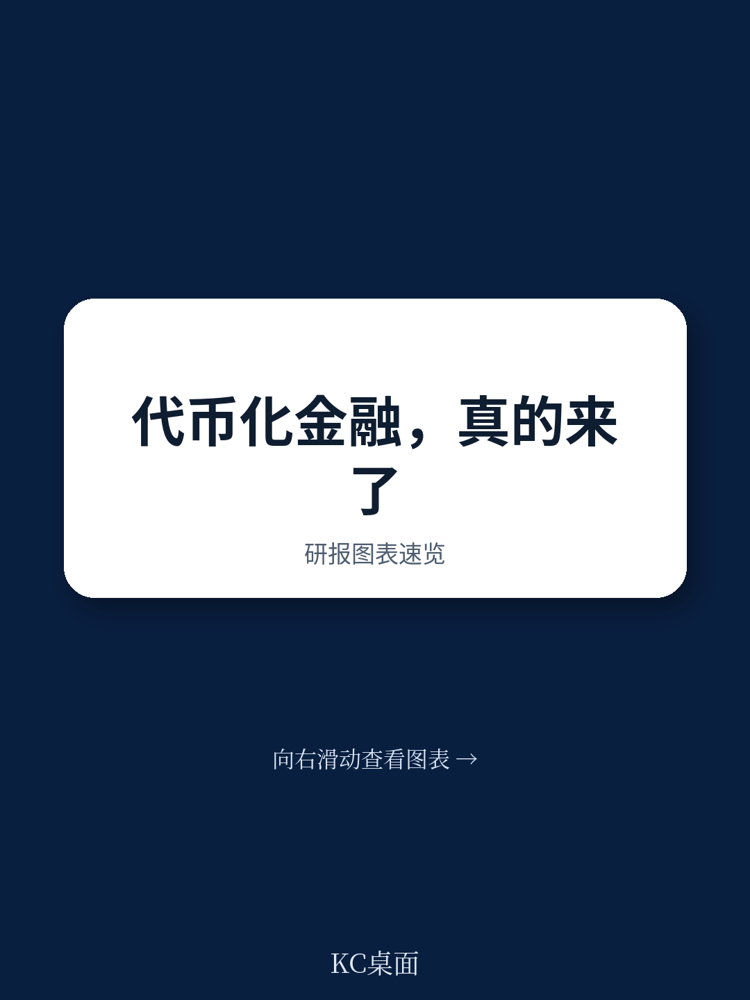
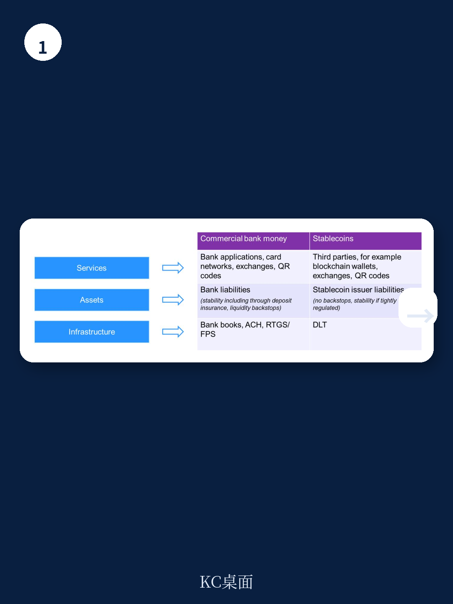
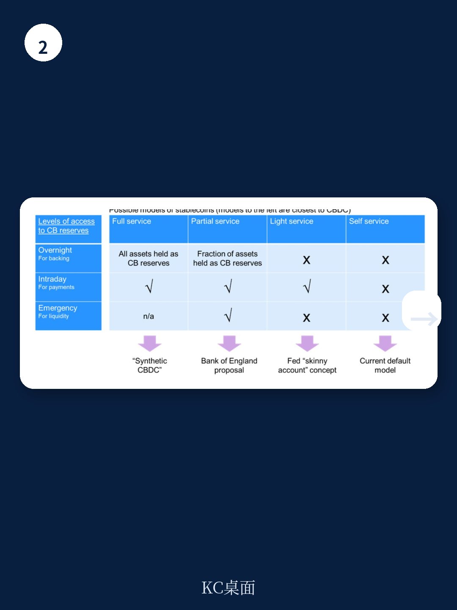

# IMF报告：Tokenization正在重塑金融基础设施，但真正的赢家是“兼容者”

金融世界的底层架构正在经历一场静默但深远的变革。Tokenization——在区块链基础设施上发行和转移资产的过程——已经从技术实验阶段进入主流金融市场的核心讨论区。国际货币基金组织（IMF）在2026年7月发布的这份报告中，没有使用任何煽动性的语言，而是以一贯的克制和严谨，勾勒出一个正在快速成型的图景：传统银行、加密原生企业、公共部门正在围绕同一套技术栈展开博弈，而这场博弈的结果将决定未来十年金融市场的运行规则。

这份报告最值得关注的判断并非某个具体技术路线会胜出，而是：**基础设施层正在发生的“混合治理”实验，将比资产层本身的产品创新更具决定性。** 谁能在开放性与合规性之间找到可持续的平衡点，谁就能在下一阶段的金融架构中占据枢纽位置。

## 1. 银行与加密企业正在走向“双向奔赴”，但动机截然不同

过去几年，市场习惯于将传统银行与加密原生企业视为两个对立的阵营。银行偏爱许可链，强调隐私、可控性和监管合规；Circle、Coinbase等企业则押注无许可链，强调去中心化、全球可用性和开放性。IMF报告揭示了一个更微妙的现实：双方正在向对方的地盘移动，但背后的逻辑完全不同。

摩根大通将其代表银行存款的JPM Coin部署在Coinbase的无许可链Base上；瑞银加入了Tempo的公共测试网；法国兴业银行在以太坊、Solana、Stellar和XRP Ledger上发行欧元稳定币。这些传统金融机构并非抛弃了对合规的坚持，而是学会了在无许可链上叠加“许可控制”——通过白名单机制限制谁可以持有和交易代币，创造出所谓的“混合治理模型”。

与此同时，Circle推出了Arc——一条许可的第一层区块链，由经批准的验证者运营，以提高费用可预测性和问责性。Stripe的Tempo也选择了类似路径。

> **KC评论：** 这并不意味着“去中心化”理想已经失败。更准确的解读是：市场正在用脚投票，选择那些能够同时满足监管要求与商业效率的折中方案。对于读者来说，这意味着在做任何关于tokenization的投资或业务判断时，不应押注于某一种纯粹的技术路线，而应关注那些能够实现“兼容性”的基础设施——无论是技术上的跨链互操作，还是治理上的监管适配。完整报告中包含了对这些混合治理模型更详细的成本与风险比较，值得深入阅读。

## 2. Swift的入场可能成为最重要的变量，但它的角色是“连接者”而非“颠覆者”

在tokenization的叙事中，Swift往往被视为传统金融的代表，甚至被一些加密原教旨主义者视为“即将被颠覆的对象”。但IMF报告给出了一个不同的视角：Swift正在成为tokenized金融基础设施中的关键参与者。

Swift正在探索一个基于区块链、兼容以太坊虚拟机（EVM）的开源基础设施。它将运营这个账本，提供交易工作流编排、资金承诺验证和银行间流程协调。银行则保留对其自身环境、密钥、资产和结算的完全控制权。这套系统将支持可编程的企业支付流程、外汇PvP结算以及证券交易的现金转移。

考虑到Swift已经连接了全球绝大多数金融机构，这个基础设施有潜力成为真正全球性的tokenized支付网络。但关键在于，Swift的角色是“连接者”而非“颠覆者”——它不是在创造一个平行于现有体系的网络，而是试图让现有的银行体系能够以标准化的方式接入tokenized世界。

与此同时，美国几家大型银行——摩根大通、美国银行、花旗、富国银行——宣布了一个新的网络来清算tokenized存款，由清算所（TCH）运营，从2027年初开始，结算将在中央银行储备中进行。

> **KC评论：** 这里有一个容易被忽略的洞察：tokenization的真正挑战不在于技术本身，而在于“谁来运营规则”。Swift和TCH的入场意味着，传统金融的“守门人”正在利用tokenization来加固而非削弱自己的地位。对于产业决策者而言，这意味着tokenization的商业机会可能更多存在于“合规的中间件”和“互操作协议”层面，而非单纯的资产代币化。报告中对Swift架构的技术细节和潜在瓶颈有更深入的拆解，这些内容对于理解未来几年支付基础设施的演变方向至关重要。

## 3. 稳定币的“稳定性悖论”：去中心化程度越高，系统性风险越大？

IMF报告对稳定币的分析可能是最值得政策制定者警惕的部分。报告没有简单地将稳定币归类为“风险”或“创新”，而是提出了一个更细致的分析框架。

核心问题在于：稳定币的“稳定”从何而来？如果稳定币完全由优质流动资产（如短期美国国债）支持，其赎回机制可能引发类似于货币市场基金在危机中经历的“挤兑”风险。报告引用了一项研究，模拟了系统性稳定币在面临大规模赎回时可能引发的资产抛售和价格下跌螺旋。

更微妙的问题是：随着稳定币在支付和DeFi中的使用越来越广泛，它们可能不再仅仅是“加密世界的内部工具”，而是开始与传统金融体系产生更深层次的关联。如果某个大型稳定币（比如USDC或USDT）遭遇信任危机，其影响将不仅限于加密市场。

与此同时，银行也在推进tokenized存款——这是一种更接近传统银行存款的数字化形式，但具有可编程性和原子结算能力。tokenized存款与稳定币的核心区别在于：前者是银行的直接负债，受到存款保险和银行监管的保护；后者则依赖于发行方的资产储备和智能合约的执行。

> **KC评论：** 报告在这里提出了一个尚未完全回答的关键问题：如果tokenized存款和稳定币在功能上越来越相似，但监管框架完全不同，市场是否会通过“监管套利”选择风险更高但回报也更灵活的稳定币？还是说，tokenized存款凭借其与现有银行体系的深度整合而最终胜出？答案可能取决于各国监管机构如何定义和分类这些新型货币负债。完整报告中对这两种工具的治理模型、损失吸收机制和分销渠道进行了详细的对比分析，这些细节对于理解未来货币体系的演变至关重要。

## 4. 公共部门面临一个“要么参与，要么被绕过”的十字路口

IMF报告明确指出，公共部门在tokenized金融中的角色正在从“监管者”向“基础设施提供者”演变。中央银行不再仅仅是观察者，而是开始探索tokenized中央银行储备——即央行在区块链上发行和结算的储备资产。

目前已有多个央行在研究这一可能性。tokenized央行储备的核心优势在于：它可以作为tokenized金融的“终极结算资产”，提供与现有RTGS系统同等的最终性和安全性，同时具备可编程性和原子结算能力。

但这引出了一个更深层次的治理问题：如果央行储备被tokenized，它应该只在许可链上可用，还是也应该在无许可链上可访问？如果只在许可链上可用，它可能无法与更广泛的tokenized生态系统实现无缝互操作；如果在无许可链上可用，央行将面临一系列关于反洗钱、制裁合规和金融稳定的新挑战。

> **KC评论：** 这可能是整份报告中最具政策相关性的部分。央行正在面临一个“要么参与，要么被绕过”的困境。如果央行不提供tokenized储备，市场可能会转向稳定币或其他私人发行的数字资产作为结算工具，从而削弱央行货币在金融体系中的核心地位。但如果央行参与得太快，又可能面临技术不成熟、监管漏洞和声誉风险。报告中对央行tokenized储备的不同设计方案及其权衡进行了系统梳理，这些内容对于理解未来几年各国央行的数字货币政策走向至关重要。

## 5. 报告尚未完全回答的关键问题：互操作性将如何解决“碎片化”风险？

IMF报告在多个地方提到了互操作性的重要性，但坦率地承认，目前还没有一个被广泛接受的解决方案。tokenization的潜力在于它能够降低交易成本、提高透明度和实现自动化，但如果不同区块链之间无法有效通信，这些优势将被“碎片化”所抵消。

目前存在几种互操作方案：跨链桥、原子交换、以及基于“清算层”的统一账本。每种方案都有其权衡——跨链桥存在安全风险，原子交换受限于流动性，统一账本则可能重新引入中心化。

更复杂的是，互操作性不仅仅是技术问题，还涉及法律和监管层面的协调。如果一笔交易跨越多条链、多个司法管辖区和多个资产类别，谁负责确保合规？谁承担争议解决的责任？

> **KC评论：** 互操作性是tokenization能否从“概念验证”走向“规模化应用”的关键瓶颈。目前市场上有超过100条活跃的区块链，如果每一条都成为一个孤岛，tokenization的承诺就无法兑现。对于投资者和产业决策者而言，那些专注于解决互操作性问题的基础设施项目——无论是跨链协议、原子交换技术还是标准化数据格式——可能比单纯的资产代币化项目更具长期价值。完整的IMF报告中对几种互操作方案的技术细节和风险敞口有更深入的量化分析，这些内容对于做出具体的投资或业务决策至关重要。

---

tokenization正在从“要不要做”进入“怎么做”的阶段。IMF这份报告的价值不在于给出确定的答案，而在于提供了一个清晰的分析框架，帮助决策者在不确定性中识别真正重要的变量。技术路线会变，监管政策会变，但那些能够同时理解“开放”与“控制”的张力、并在两者之间找到可持续平衡的参与者，将定义下一阶段的金融基础设施。

这份报告没有回答的问题——互操作性的标准化路径、稳定币与tokenized存款的竞争格局、央行tokenized储备的具体设计方案——恰恰是未来几年最值得持续跟踪的方向。我们会在社群中每天更新国际投行的中文摘要与KC评论，包含当天最新的数据图表合集，既方便喂给AI，也方便人工快速把握market dynamics。如果你对这些未解问题感兴趣，欢迎加入我们的讨论，一起追踪tokenization从理论到实践的每一步演变。

Personal reading notes and learning share only. Not investment advice.

