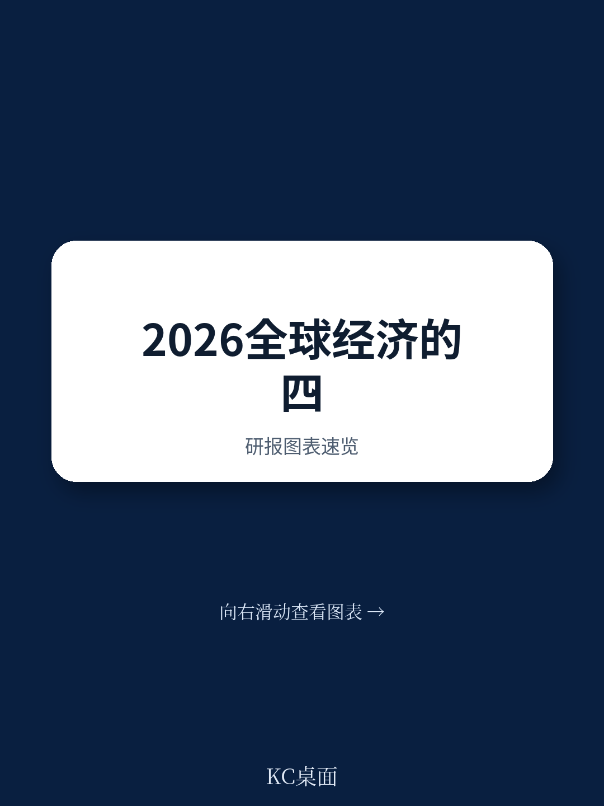
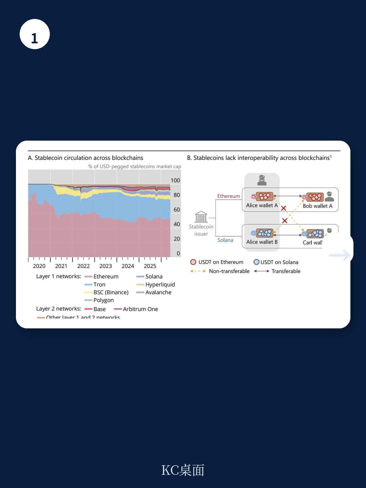
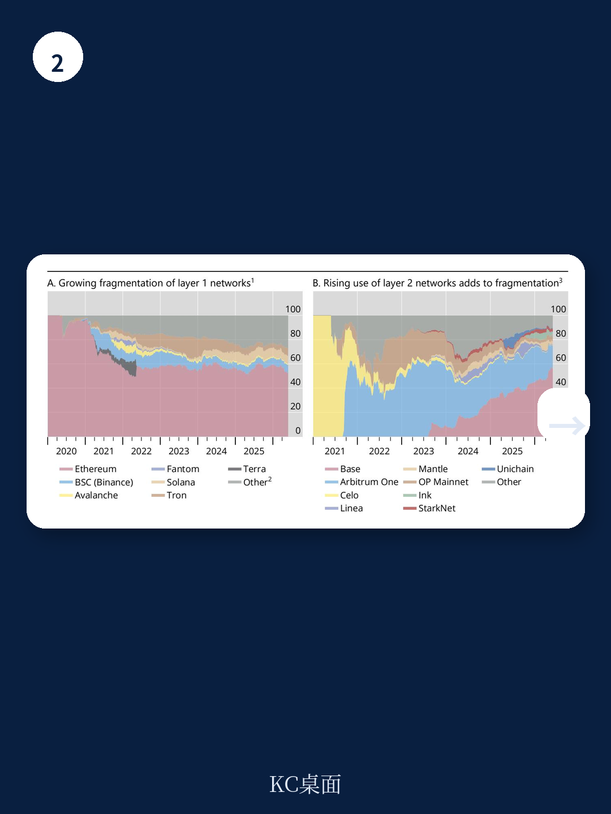

# 国际清算银行：全球经济的“韧性”已到极限，下一步是“稳健性”还是危机？

2026年6月，国际清算银行（BIS）发布了其年度经济报告。这份长达百余页的文件，在看似中立的“从韧性到稳健性”标题下，传递了一个并不平静的信号：全球经济在过去一年展现出的“韧性”，很大程度上依赖于AI泡沫、贸易转移和企业的利润压缩。当霍尔木兹海峡的封锁让能源供应链遭受真实冲击，当通胀再次抬头，当财政空间被高债务侵蚀，BIS真正想问的问题是——当这些临时缓冲垫逐一失效，全球经济的底层架构，是否足够“稳健”？

这不是一份关于“复苏”的报告，而是一份关于“脆弱性”的诊断书。

## 1. 2025年的“韧性”是个假象：AI泡沫与贸易转移是两大临时止痛药

BIS的报告开篇承认，2025年全球经济增长确实顶住了关税冲击。但细看其归因分析，这份“韧性”的来源并不令人安心。

第一个缓冲是关税的实际冲击低于预期。有效关税率低于最初宣布的水平，加之贸易转移效应，企业通过压缩自身利润来消化成本。第二个、也是更关键的缓冲，是AI浪潮催生的资本支出狂潮。美国科技巨头在AI基础设施上的巨额投资，不仅拉动了本国经济，还通过全球供应链产生了正向溢出。第三个缓冲则是“动物精神”——AI叙事推高了股市估值，维持了宽松的全球金融条件。

这三个因素有一个共同点：它们都是临时性的、不可持续的。关税转移终有尽头，企业利润压缩有边界，而AI投资能否持续，取决于其商业化回报是否兑现。

> **KC评论：** 将2025年的增长解读为“韧性”，就像把病人靠止痛药下床走路称为“康复”。BIS这份报告的核心洞察在于，它区分了“韧性”和“稳健性”——前者是扛住冲击的能力，后者是系统本身不易受损的结构。当前全球经济的“韧性”正在被消耗，而真正的“稳健性”建设，几乎没有进展。

## 2. 霍尔木兹海峡冲击是“压力测试”：通胀回潮的传导链条比2021年更危险

报告用大量篇幅分析了2026年初霍尔木兹海峡封锁带来的能源冲击。这不是一次孤立的黑天鹅事件，而是一次对全球经济脆弱性的真实压力测试。

BIS的数据显示，塑料和化肥——这两个关键工业与农业投入品的价格——分别上涨了30%和50%。这意味着能源价格的上涨正在向制造业和农业食品链传导。对于最贫困的国家而言，这可能意味着粮食安全危机。

与2021-2023年的通胀周期相比，当前环境有几个不同之处：劳动力市场存在更多闲置，这有助于抑制工资-通胀螺旋；政策利率远高于2022年水平。但BIS也提醒，市场对通胀的记忆仍然鲜活，通胀预期可能比过去更快地“脱锚”。一旦预期失控，央行将面临比上一轮更艰难的选择。

报告没有直接给出结论，但隐含的判断是清晰的：这轮通胀回潮的尾部风险，可能比市场定价的更高。

## 3. AI叙事与金融脆弱性：估值泡沫正在成为宏观风险本身

BIS对AI领域的分析，在乐观与警惕之间保持了罕见的平衡。报告承认AI有望带来巨大的生产率提升，但它同时警告：当前的AI投资热潮可能不可持续。

问题出在几个方面。第一，供应链瓶颈可能限制AI硬件的生产扩张。第二，激烈的市场竞争可能导致过度投资，这一模式在历史上每一次创新浪潮中都曾出现。第三，也是最关键的：AI领域的融资活动日益不透明，私人信贷和杠杆工具的参与加深了金融体系的脆弱性。

BIS的图表显示，在AI乐观情绪的推动下，股票估值已经处于历史高位。而高位估值本身，正在成为宏观经济脆弱性的来源。一旦AI的商业回报低于预期，估值修正可能引发连锁反应——从科技股蔓延到企业信贷市场，再通过金融条件收紧传导至实体经济。

> **KC评论：** BIS在这里做了一个重要的分析框架转换：它不再把股市泡沫仅仅视为“风险资产的问题”，而是将其视为“宏观经济的潜在放大器”。当估值高到一定程度，它就不再只是投资者的盈亏问题，而是可能引发信贷收缩、投资下滑的宏观问题。完整报告中对“AI融资活动透明度”和“私人信贷杠杆”的拆解，是理解这一传导链条的关键。

## 4. 财政空间被高债务侵蚀：央行正在失去“安全网”选项

报告第二章专门讨论了高公共债务与金融市场结构变化对央行的挑战。这一部分可能对政策制定者来说最为沉重。

BIS指出，当前政府债务水平接近历史高位，而财政空间正在收窄。在金融危机后的低利率时代，高债务的可持续性依赖于低融资成本。但如今利率环境已经改变，债务展期成本上升，而经济增长放缓又削弱了税收基础。

更重要的是，非银行金融机构（NBFIs）在政府债券市场中的角色日益重要。对冲基金通过回购市场大量借入资金参与国债交易，这创造了新的金融-财政联动风险。当财政风险重新定价时，市场流动性可能迅速枯竭，而央行作为最后做市商的角色将面临前所未有的考验。

BIS的结论是：高公共债务正在削弱货币政策的传导效率。央行加息对实体经济的抑制作用，在高债务环境下被钝化——这意味着央行可能需要更大幅度加息才能达到同样的效果，而更大幅度的加息又增加了债务可持续性的风险。

这是一个经典的“夹击”困境。

## 5. 稳定币与货币信任：BIS对“去中心化”的最冷静评估

报告的第三章转向了稳定币与货币体系的未来。这一部分可能对金融从业者和监管者来说最具前瞻性。

BIS承认，稳定币在公共无许可区块链上的出现是“货币创新”的一部分，但它对当前稳定币安排的评估相当克制。报告指出，稳定币的使用高度集中于加密交易，而非实体经济支付。其储备资产的管理、与银行体系的互动、以及跨境流动对汇率和货币政策的影响，都远未得到充分理解。

BIS特别提出了一个“稳定币美元化”的概念——当外国居民大规模持有美元挂钩的稳定币时，这实际上是一种新型的、去中介化的美元化形式。它对发行国（美国）和接受国（新兴市场）的货币政策传导、资本流动管理和金融稳定都有深远含义。

报告还量化了稳定币对银行贷款和财政空间的影响。其结论是：稳定币的大规模采用，在特定储备资产情景下，可能显著压缩银行的贷款能力和政府的融资空间。

> **KC评论：** BIS对稳定币的分析，最值得关注的是它没有陷入“拥抱或抵制”的二元叙事。它承认技术创新本身的价值，但坚持用“货币信任”的底层逻辑来审视——货币的本质是信任，而信任需要锚。当前稳定币的“信任锚”是美元储备资产和发行方的信用，这并没有真正解决“去中心化”的问题。完整报告中关于“统一账本”和“双层货币体系创新”的讨论，是理解BIS自身政策立场的关键。

## 6. 报告没有完全回答的问题：AI回报何时兑现？财政调整从何开始？

BIS的报告虽然全面，但在几个关键问题上保持了谨慎的“留白”。

第一，AI的生产率提升何时能够真正体现在宏观数据中？报告承认AI有巨大潜力，但没有给出时间表。如果AI投资的回报周期长于市场预期，当前的估值泡沫将面临修正风险。

第二，财政调整的政治可行性。BIS指出了高债务的不可持续性，但没有深入讨论各国政府如何在低增长、高支出压力的环境中实施财政整顿。这是一个经济学之外的政治经济学问题。

第三，稳定币监管的国际协调。稳定币的跨境特性决定了单一国家的监管难以奏效，但国际协调的进展缓慢。BIS提出了方向性的框架，但具体路径仍待探索。

这些未解问题，恰恰是投资者和政策制定者需要持续跟踪的边际变化。

## 7. 对观察者的框架：从“韧性叙事”转向“脆弱性定价”

基于BIS的报告，一个清晰的观察框架浮现出来：市场当前定价的是“韧性叙事”——即全球经济能够吸收冲击并继续增长。但BIS的报告揭示的是“脆弱性积累”——缓冲垫正在变薄，新的风险点正在成形。

对于资产配置者而言，这意味着需要关注几个关键变量：通胀预期的稳定性、AI投资回报的实际数据、财政风险溢价的变化、以及稳定币对传统金融中介的侵蚀速度。

这些变量中的任何一个发生边际变化，都可能触发市场对“韧性叙事”的重新定价。

---

BIS这份年度报告，本质上是一次对全球经济“免疫系统”的全面体检。它没有危言耸听，但也没有粉饰太平。对于认真阅读它的人来说，核心信息很清楚：过去一年的“韧性”值得肯定，但它不应成为自满的理由。真正的考验在于，当临时缓冲垫消耗殆尽，全球经济是否具备真正的“稳健性”。

这个问题的答案，取决于未来几个月通胀的演变路径、AI商业化的实际进展、各国财政纪律的执行力度，以及监管机构对新型金融创新的应对能力。

这些变量，没有一个是可以提前预知的。

这也是为什么，我们选择持续跟踪国际清算银行、国际货币基金组织、主要央行和头部投行的研究报告——不是为了寻找确定性的答案，而是为了更早地识别那些改变叙事框架的边际信号。

如果你想获取BIS这份年度报告的完整图表、关键假设拆解，以及我们团队对其中“稳定币美元化”和“财政-金融联动风险”两个章节的深度注释，欢迎扫码加入我们的交流社群。在这里，我们每日更新全球主流机构的研报汇编与评论，与来自头部券商、PE/VC、投行、并购、对冲基金、资管机构、战略咨询和智库的朋友们一起，观测全球经济的边际变化。

Personal reading notes and learning share only. Not investment advice.

