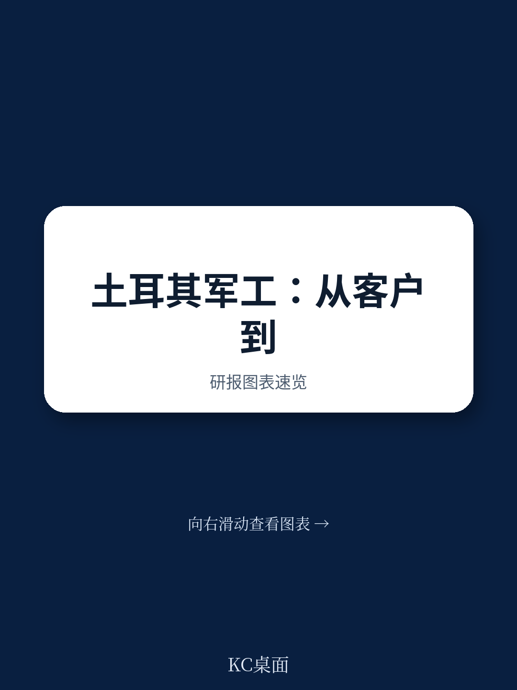
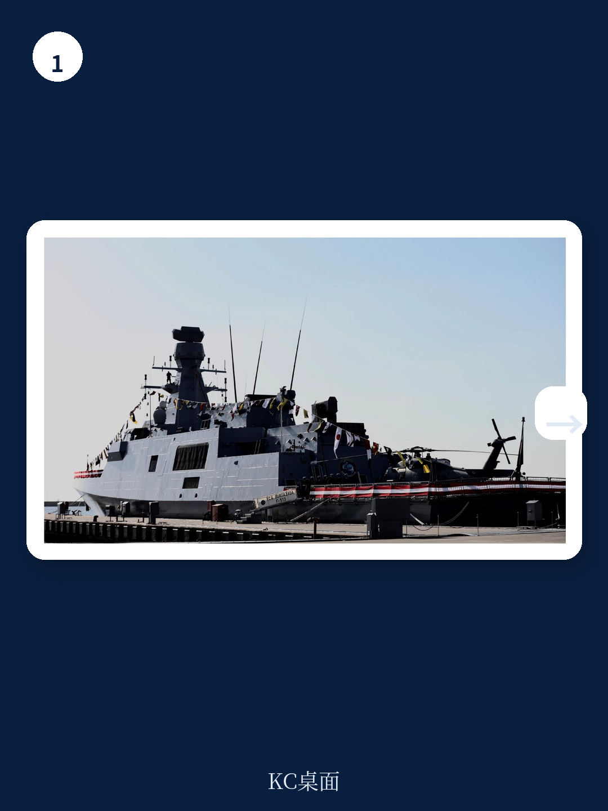
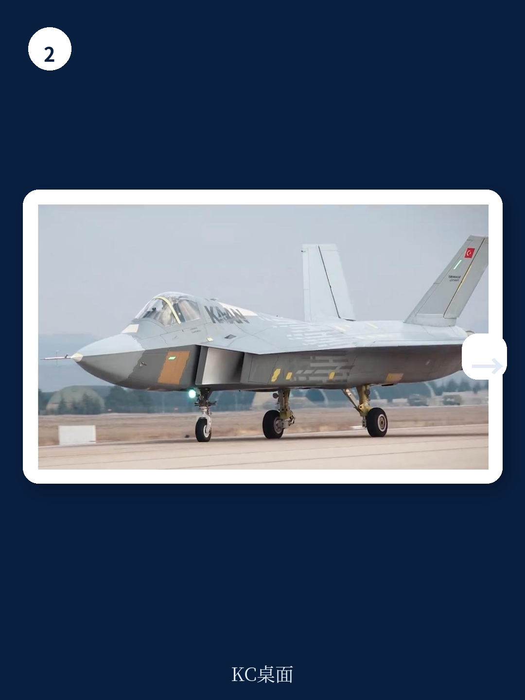

# 布鲁金斯学会：土耳其军工从“客户”到“对手”，全球供应链正在被改写

这份由布鲁金斯学会与IISS联合发布的报告，揭示了一个正在发生的结构性变化：一个曾经依赖西方武器供应的国家，如何通过数十年战略布局，在多个领域成为传统军工强国的竞争者。报告的核心判断是，土耳其的国防工业已走到一个十字路口——继续追求完全自主的成本越来越高，而出口导向的工业化模式又将其推入全球竞争的新战场。对于关注全球供应链重构、地缘政治风险以及新兴市场工业化路径的读者来说，这不仅仅是一个国家的故事，更是一个关于“依赖与自主”的经典案例。

报告指出，土耳其的国防工业化进程，并非简单的技术追赶，而是一场由外交危机、国内政治意志和产业政策共同驱动的系统性转型。从1923年建国初期的“客户”身份，到1974年塞浦路斯行动后遭遇西方武器禁运的“被迫觉醒”，再到21世纪“本土设计”的全面爆发，土耳其走过的路，对许多试图摆脱技术依赖的发展中国家具有深刻的借鉴意义。

然而，报告也毫不避讳地指出了当前模式面临的挑战：绝对自主无法实现，出口依赖带来新的脆弱性，人才流失正在侵蚀创新基础。这些问题的答案，或许就藏在土耳其下一步的战略选择中。

## 1. 1974年禁运：一次“因祸得福”的战略转折

报告将1974年定义为土耳其国防工业的“分水岭”。当年土耳其出兵塞浦路斯后，美国及其盟友实施了武器禁运。这一外部冲击，直接摧毁了土耳其此前依赖美国军援的“舒适区”，也彻底改变了其决策层对国防工业的认知。

在此之前，土耳其的国防工业几乎完全依附于美国。冷战期间，作为北约成员国，土耳其接受了大量美国军事援助，包括超过3000辆M48坦克和约260架F-100战斗机。这种“免费”的装备供给，虽然短期内满足了军队需求，却导致本土军工能力萎缩。1950年代，土耳其甚至有能力生产改进型教练机，但在美国过剩装备的冲击下，本土生产线最终关闭。

禁运之后，土耳其决策层形成了一个关键共识：国防不能依赖任何单一外部供应商。这个判断，直接催生了1980年代以“联合生产”为核心的新工业模式。土耳其与外国公司成立合资企业，以市场换技术，其中最典型的案例就是F-16战斗机的本土化生产。

> **KC评论：** 禁运的“因祸得福”效应，在历史上并不罕见。但对于今天的投资者和战略分析师而言，真正值得关注的是：土耳其如何将一次短期危机转化为长期制度优势？报告详细描述了国防工业署（SSM）的成立和职能演变，但并未完全展开讨论其治理机制如何避免“政企不分”和效率低下。完整报告中的组织架构图和采购流程分析，或许能提供更深层次的答案。

## 2. “自上而下”的工业化路径：从平台到部件的反向逻辑

土耳其的国防工业化采取了一条看似“反常识”的路径：先攻克整机、整舰等平台级产品，再向核心部件和子系统渗透。报告称之为“自上而下”的策略。

这种做法的优势在于：能够快速获得具备战略威慑力的终端产品，同时通过系统集成能力的积累，带动上游供应链发展。典型例子包括“卡恩”第五代战斗机、“阿尔泰”主战坦克，以及全球知名的“旗手”TB2无人机。后者截至2023年底已累计飞行超过75万小时，成为土耳其国防出口的明星产品。

但报告也指出了这一模式的代价。由于优先发展平台，土耳其对发动机、传感器、航电等核心部件的国产化推进相对滞后。这导致许多国产武器系统仍高度依赖进口“心脏”。例如，“阿尔泰”坦克的动力系统最初依赖德国许可，后因外交关系波动而受阻，不得不转向本土替代方案。

这种“先组装后自研”的路径，本质上是一种时间换空间的博弈。它要求国家具备持续的高强度投资能力，并且能够承受关键部件断供的风险。土耳其之所以能走通，与其地缘政治地位和北约成员国的身份提供了部分“保险”有关。但对于没有类似背景的国家，这条路可能更加艰难。

## 3. 出口驱动：从“自给自足”到“全球竞争者”的必然跃迁

报告揭示了一个关键矛盾：土耳其国防工业的初始目标是“自给自足”，但现实却迫使它必须成为“出口导向型”产业。原因很简单——研发和生产成本太高，仅靠国内采购无法覆盖。

以无人机为例，土耳其的无人机出口已覆盖数十个国家，在乌克兰、利比亚、纳戈尔诺-卡拉巴赫等冲突中表现抢眼，成为全球军贸市场的新势力。这不仅是商业上的成功，更是一种战略资产的变现：通过出口，土耳其不仅分摊了研发成本，还建立了用户反馈闭环，加速了技术迭代。

然而，出口导向也带来了新的风险。报告指出，土耳其正在面临“新市场竞争对手”的涌现。随着越来越多的国家（如韩国、以色列、印度）加入军火出口竞争，土耳其产品的性价比优势可能被削弱。此外，出口对象国的政治稳定性、与土耳其的外交关系变化，都会直接影响到产业链的持续性。

> **KC评论：** 出口驱动模式最容易被忽视的风险，是“客户关系”与“地缘政治”的冲突。土耳其向某些国家出售武器，可能引发其传统盟友或北约伙伴的不满。报告提到了这种张力，但并未深入探讨土耳其如何在商业利益与外交一致性之间进行权衡。对于关注全球军贸格局变化的读者，完整报告中关于土耳其出口目的地分布和外交策略调整的章节，值得仔细研读。

## 4. 人才流失：一个被低估的长期挑战

报告特别指出了“人才流失”问题，尤其是自2010年代末以来，这一趋势明显加速。土耳其国防工业的崛起，离不开大量工程师和技术人员的贡献。但随着国内经济波动、政治环境变化以及海外就业机会增多，顶尖人才外流正在侵蚀产业创新基础。

这是一个典型的“成功悖论”：产业越成功，对高端人才的需求越大，但人才也越容易被全球市场吸引。土耳其并非个例，许多新兴工业化国家都面临类似困境。报告没有给出具体数字，但暗示这一问题的严重性可能被官方数据所掩盖。

对于决策者而言，人才流失是一个比技术瓶颈更难解决的问题。它涉及教育体系、科研环境、薪酬水平、社会自由度等复杂因素。如果无法留住核心团队，土耳其国防工业的长期竞争力将面临严峻考验。

## 5. 未解之问：绝对自主是否可能？

报告在结论部分提出了一个根本性追问：绝对自主是否可能？答案是明确的——不可能。即使土耳其实现了武器系统的“本土化”，它仍然需要依赖进口原材料、核心部件、设计软件乃至生产设备。这种“依赖的转移”而非“依赖的消除”，是所有试图实现国防自主的国家必须面对的现实。

土耳其的选择是：通过多元化供应来源和提升自身不可替代性，来降低单点依赖的风险。例如，在防空导弹系统上，土耳其既与俄罗斯合作采购S-400，又继续推进本土“希萨尔”和“钢穹”系统，同时与美国就F-35争端进行谈判。这种“多方下注”的策略，虽然增加了管理复杂度，但也提供了战略回旋空间。

但报告没有完全回答的问题是：当多元化供应本身导致系统复杂性和成本激增时，这种策略的可持续性在哪里？尤其是在人工智能、无人系统、高超音速武器等前沿领域，技术迭代速度远超传统军工，土耳其能否跟上？

> **KC评论：** 土耳其的案例表明，国防工业的“自主”从来不是一个绝对状态，而是一个动态平衡。对于企业决策者而言，理解这种平衡的边界，比追求“完全独立”更具实际意义。完整报告中对土耳其与西方、非西方合作模式的对比分析，以及关于“技术转让”合同条款的细节，能帮助读者更精确地判断土耳其未来可能的合作倾向。

---

土耳其国防工业的转型故事，远未结束。它正在从“客户”变成“竞争者”，但这一身份转变本身，也带来了新的脆弱性和战略选择。报告提出的“十字路口”判断，既是警告，也是机遇。

对于希望更深入理解全球军工供应链重构、新兴市场工业化路径以及地缘政治与产业政策互动的读者，这份布鲁金斯学会与IISS联合发布的报告提供了极其丰富的原始素材和专家分析。我们已将报告核心图表、数据来源以及未在本文中展开的案例细节整理为完整解读版本。

如果您对以下问题感兴趣，欢迎加入我们的社群，获取完整研报解读与原始图表：土耳其的“自上而下”工业化路径在F-16和无人机项目上具体如何操作？其国防工业署（SSB）的治理架构是否可以被其他国家复制？在人才流失和新兴竞争对手的双重压力下，土耳其的出口增长能否持续？我们每日更新国际主流信源汇编与评论，汇聚了头部券商、PE/VC、投行、并购、对冲基金、资管机构、战略咨询、智库等领域的从业者，期待与您交流探讨。

Personal reading notes and learning share only. Not investment advice.

