# Credit Expansion in the Caucasus and Central Asia

Etibar Jafarov and Chingis Matayev

WP/26/137

IMF Working Papers describe research in progress by the authors and are published to elicit comments and to encourage debate. The views expressed in IMF Working Papers are those of the authors and do not necessarily represent the views of the IMF, its Executive Board, or IMF management.

2026
JUN

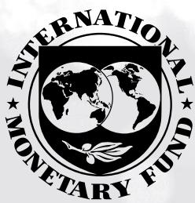

# IMF Working Paper Middle East and Central Asia Department

Credit Expansion in the Caucasus and Central Asia Prepared by Etibar Jafarov and Chingis Matayev\*

Authorized for distribution by Amina Lahreche
June 2026

IMF Working Papers describe research in progress by the author(s) and are published to elicit comments and to encourage debate. The views expressed in IMF Working Papers are those of the authors and do not necessarily represent the views of the IMF, its Executive Board, or IMF management.

ABSTRACT: This paper analyzes credit developments in the Caucasus and Central Asia (CCA) using several complementary approaches. First, it estimates long-run equilibrium credit levels based on economic fundamentals, providing benchmarks to assess whether observed credit levels are broadly aligned with country characteristics. Second, it applies statistical “gap” measures to identify periods of unusually rapid credit expansion that may signal emerging financial vulnerabilities. Third, it uses the Kalman filter to decompose credit into trend and cyclical elements conditional on macro variables. The results suggest there is scope for further financial deepening in all CCA economies, but the speed of household credit expansion warrants close monitoring. A comparative “horse race” of alternative indicators suggests that no single measure consistently outperforms others across countries, implying that combining various credit gap measures enhances the robustness of risk assessments.

RECOMMENDED CITATION: Jafarov, Etibar, and Chingis Matayev, 2026, “Credit Expansion in the Caucasus and Central Asia,” IMF Working Paper No. 26/137 (Washington: International Monetary Fund)

<table><tr><td>JEL Classification Numbers:</td><td>C23, E32, E44, G28, O16</td></tr><tr><td>Keywords:</td><td>Credit growth; credit cycles; credit gaps; financial deepening;financial stability; early warning indicators; Caucasus and Central Asia</td></tr><tr><td>Author&#x27;s E-Mail Address:</td><td>ejafarov@imf.org;c.matayev@qmul.ac.uk</td></tr></table>

WORKING PAPERS

# Credit Expansion in the Caucasus and Central Asia

Prepared by Etibar Jafarov and Chingis Matayev $^{1}$

## Contents

I. Introduction ....4
II. Stylized Facts about Credit in CCA ....5
III. Long Run Equilibrium Approach ....9
Literature review ....9
Empirical Model ....10
Data ....11
Panel Estimation Strategy: Fixed Effects VS. Mean Group Estimators ....12
Estimation Results ....13
Results (Deviation from benchmark) ....14
IV. Speed of Credit Growth – Statistical Gap Measures ....17
V. Disaggregating Credit Dynamics: Households vs. Corporates ....20
Household Credit ....20
Corporate Credit ....21
VI. Multivariate Filter (MVF) Credit Gap ....25
VII. Which Credit Gap is Better? ....26
Methodology ....27
Crisis Data ....28
Results ....28
VIII. Conclusion ....30
References ....32
Annex I. Equilibrium (Large Economies) ....35
Annex II: Multivariate Filter Estimation for Kazakhstan ....37
Annex III. Banking Sector Crisis Episodes ....44
FIGURES
1. Evolution of Total, Household, and Corporate Credit Across CCA Economies ....7
2. Credit Decomposition by Currency of Denomination ....8
3. Deviation from the Equilibrium Level Credit -to-GDP Ratio ....16
4. Credit Gap Measures for the CCA Economies ....19
5. Household Credit Gap Measures for the CCA Economies ....23
6. Corporate Credit Gap Measures for the CCA Economies ....24
7. Comparison of MVK and Other Gap measures for the CCA Economies ....26
8. AUC by Horizon ....30

3. Deviation from the Equilibrium Level Credit -to-GDP Ratio 36
TABLE
1 Regression Results for the Panel Estimates 14

## I. Introduction

Credit dynamics play a central role in shaping financial stability outcomes. Historically, periods of rapid credit growth have often preceded episodes of financial stress, while persistently low levels of credit relative to fundamentals can constrain investment, financial inclusion, and long-term growth. For policymakers, the challenge lies in distinguishing between sustainable financial deepening and excessive credit expansion that heightens vulnerability to macroeconomic shocks and raises the risk of banking crises. This challenge is particularly acute in emerging market and transition economies, where significant financial deepening is ongoing and credit cycles are often amplified by macroeconomic volatility and external shocks.

This paper takes a three-pronged approach to analyzing credit developments in the CCA. First, it estimates long-run equilibrium levels of credit-to-GDP based on structural characteristics such as income, demographics, and financial depth. These benchmarks indicate whether credit is broadly aligned with fundamentals, or whether structural under- or over-lending is present. Second, it constructs statistical measures of credit gaps, which capture cyclical deviations of credit from their trend. These indicators focus on the pace of credit expansion and provide timely signals of potential vulnerabilities associated with unusually rapid credit growth, including underpricing of risk and relaxed underwriting standards. Third, it applies a state-space framework estimated via a multivariate Kalman filter, allowing the trend to evolve with macroeconomic conditions. Unlike univariate (statistical) credit gap measures, this approach distinguishes cyclical credit excesses from financial deepening conditional on macroeconomic developments and post-crisis normalization. $^{1}$

A common critique of the equilibrium approach is that the credit-to-GDP ratios in most CCA countries were at low levels for much of the sample period, rendering comparisons with equilibrium benchmarks redundant. However, equilibrium estimates remain informative for three reasons. First, they gauge the scope for sustainable financial deepening, helping distinguish between catch-up dynamics from overheating. Second, they allow meaningful cross-country comparisons, showing whether differences in credit depth reflect structural fundamentals or financial underdevelopment. Third, they complement statistical gap indicators by addressing the level dimension: while statistical gap measures focus on near-term momentum, equilibrium benchmarks signal when convergence may be reaching its limits given the income growth path.

To assess the usefulness of different cyclical indicators, the paper then compares how these statistical credit gap measures perform in terms of predicting banking sector stress episodes. This exercise highlights the strengths and limitations of individual gap measures and provides guidance on their interpretation. By combining both perspectives, the paper provides a richer assessment of financial stability risks than relying on either approach alone. Equilibrium benchmarks capture the level dimension of credit sustainability, while statistical gaps capture the momentum dimension of credit expansion. The Kalman-filter-based gap complements these measures by isolating cyclical excesses after accounting for the effects of macro-shocks.

Together, they help identify situations in which credit is both high relative to fundamentals and deviating from its trend—a combination that has historically been associated with heightened crisis risk.

The contribution of this paper is twofold. First, it applies a consistent framework to measure equilibrium credit levels, benchmarked against advanced and emerging market reference countries, and credit gaps across CCA economies. Second, it evaluates the ability of different indicators to signal risks, using a comparative “horse race” to assess their reliability in signaling banking distress. It draws policy implications for credit monitoring in the region, emphasizing the value of a dual framework that captures both structural and cyclical aspects of credit dynamics.

The remainder of the paper is structured as follows. Section II briefly overviews some stylized facts about credit market developments in CCA, Section III presents results from the equilibrium analysis, Section IV discusses the statistical gap measures, and Section V provides credit gap estimates using the Kalman filter. Section VI evaluates the relative performance of alternative indicators in a comparative exercise. Section VII concludes.

## II. Stylized Facts about Credit in CCA

Credit-to-GDP ratios in the Caucasus and Central Asia remain relatively low by international standards, but have experienced periods of rapid growth, sometimes followed by sharp reversals. Figure 1 illustrates the evolution of total, household, and corporate credit across CCA economies, while Figure 2 shows the composition by currency of denomination. Several common features stand out.

\- First, overall credit penetration is modest but heterogeneous across countries. Armenia and Georgia display the highest credit-to-GDP ratios, approaching 60–70 percent in some recent years, reflecting deeper economic transformation and financial intermediation relative to regional peers as well as declines in GDP during the COVID pandemic. By contrast, credit-to-GDP in Kyrgyzstan and Tajikistan remains in the range of 10–25 percent, suggesting shallower financial systems. Uzbekistan, Kazakhstan and Azerbaijan lie in between, with the latter two economies experiencing pronounced credit booms followed by contractions, before credit started to recover in recent years.

\- Second, household credit has recently become the main driver of credit growth across much of the region. In most countries, household lending now exceeds corporate credit. Household loans have long accounted for the larger share of private sector credit in Georgia and the Kyrgyz Republic, and overtaken corporate lending in Armenia, following the rapid growth since 2022. In Kazakhstan, the deleveraging of the corporate sector after the banking stress of the late 2000s, combined with robust household borrowing, has also shifted the composition of credit toward households. Similar dynamics are observed in Tajikistan and Azerbaijan. Only in Uzbekistan does corporate lending significantly exceed household lending, though the latter is expanding faster from a low base.

\- Third, credit cycles in the region have been highly volatile. Kazakhstan, Azerbaijan, and Tajikistan experienced sharp credit contractions following banking sector stresses in late 2000s-mid-2010s, with the credit-to-GDP ratios falling by 15–20 percentage points in Azerbaijan and Kazakhstan. Armenia and Georgia also saw temporary corrections, but the broader trend has been sustained credit deepening. These episodes highlight the vulnerability of the region to boom-bust dynamics.

\- Fourth, the currency composition of credit has shifted over time. FX lending was historically dominant in the region, exposing borrowers and banks to exchange rate risks. However, loan dollarization has declined significantly in recent years, with the share of domestic currency loans exceeding that of loans in foreign currency in all CA countries.

Figure 1. Evolution of Total, Household, and Corporate Credit Across CCA Economies (In percent of GDP)  
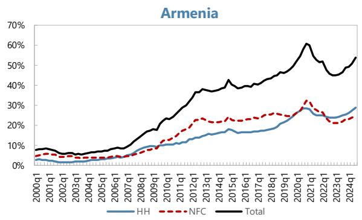

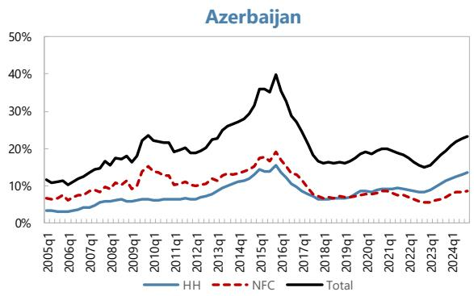

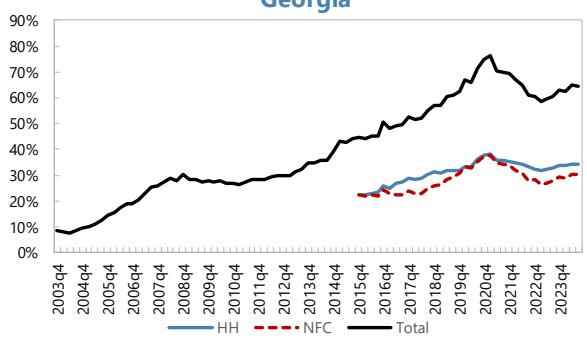

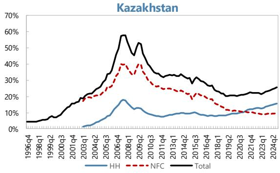

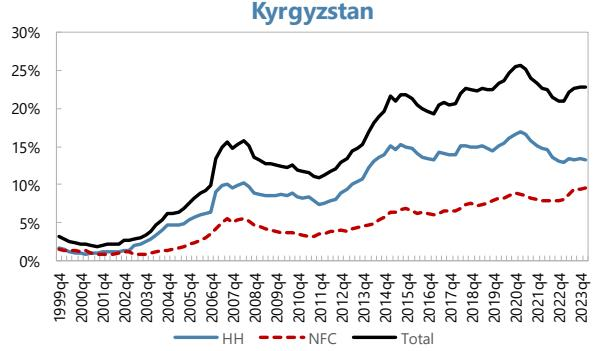

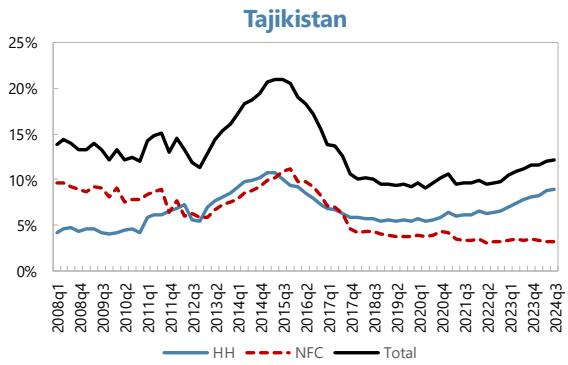

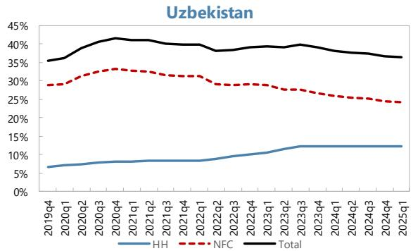  
Sources: BIS; IMF, International Financial Statistics; national authorities; and authors' estimates.

Figure 2. Credit Decomposition by Currency of Denomination  
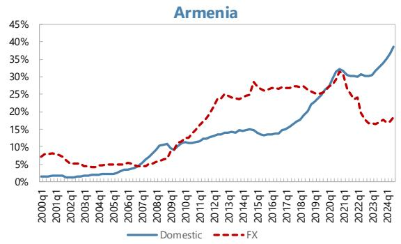

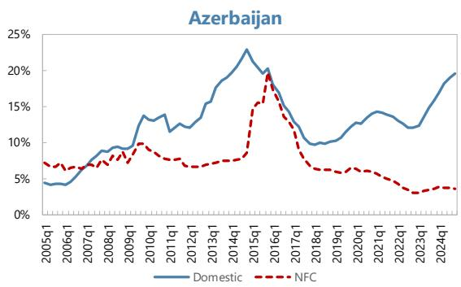

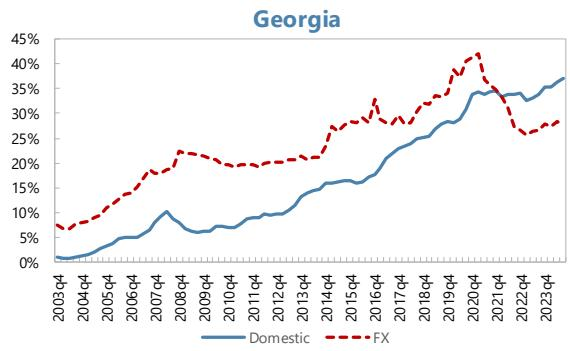

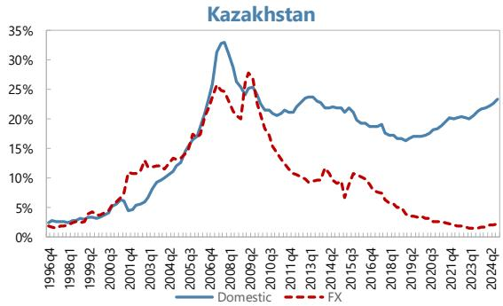

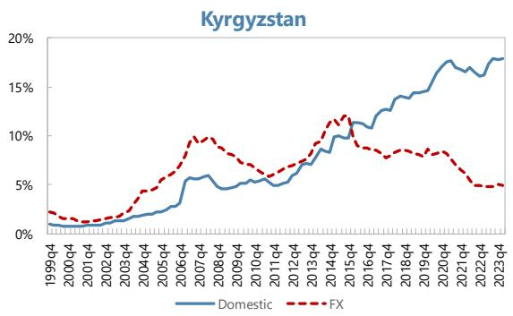

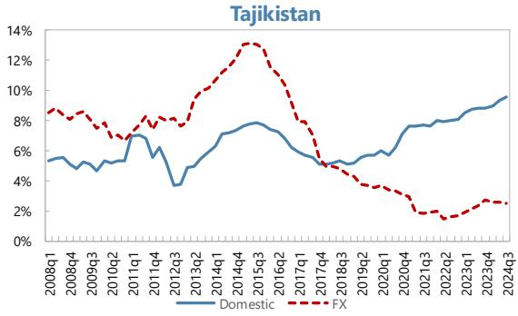

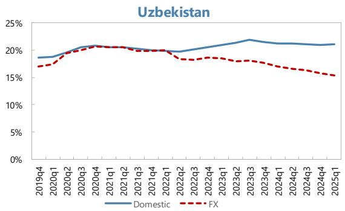  
Sources: National central banks, and authors' estimates.

## III. Long Run Equilibrium Approach

## Literature review

A rich literature has examined the determinants of credit deepening and how to identify credit “booms.” Early empirical work, largely focused on emerging Europe in the 2000s, established the concept of an equilibrium credit level determined by macroeconomic fundamentals. For example, Cottarelli, Dell’Ariccia, and Vladkova-Hollar (2005) analyzed bank credit growth in Central and Eastern Europe and the Balkans, finding that differences in credit-to-GDP across countries could be partly explained by fundamentals like per capita income and institutional factors (Cottarelli and others 2005).

Building on this approach, Égert, Backé, and Zumer (2006) provided a seminal study of 11 Central and Eastern European transition economies. They posited that the private credit-to-GDP ratio has a long-run equilibrium relationship with economic development and financial structure indicators. A key insight from Égert and others was that in-sample panel estimates using only transition economies can be misleading – many transition countries started the 1990s with extremely low credit levels (“initial undershooting”) and then experienced rapid catch-up growth. As a result, a panel regression solely on these countries tends to show upward-biased coefficients and instability, essentially overfitting the post-socialist credit boom adjustment. Égert and others therefore advocated using an out-of-sample panel of peer countries (in their case, small open OECD economies) to estimate stable long-run coefficients and then applying those coefficients to the transitioning countries. This provided a more reliable equilibrium benchmark, given that transition economies were expected to converge to the behavior of more advanced economies in the long run. Their results suggested that by the mid-2000s some CEE countries had nearly reached equilibrium credit levels while others’ credit levels remained well below fundamentals.

Similarly, Kiss and others (2006) examined the new EU member states and asked: was the rapid credit growth an “equilibrium convergence or a boom?” Using a dynamic panel approach (the pooled mean group estimator), they separated the equilibrium trend from any excess credit component. Kiss and others found that a large part of the credit expansion in the mid-2000s was indeed explained by fundamental catching-up, with credit-to-GDP ratios generally below levels predicted by fundamentals (indicating remaining room for financial deepening). Only in a couple of cases (e.g. the Baltic states) was credit growth significantly faster than justified by fundamentals, indicating an emerging credit boom above equilibrium. These studies set the tone and methodology for analyzing credit booms in emerging markets: estimate a long-run equilibrium credit level based on economic fundamentals and then gauge actual credit positions relative to this benchmark.

The global financial crisis renewed interest in measuring excess credit, and additional approaches emerged. The Bank for International Settlements (BIS) popularized a simpler statistical measure of the credit cycle – the “credit-to-GDP gap,” defined as the deviation of the credit/GDP ratio from its long-term trend (often estimated via a two-sided Hodrick-Prescott filter). This Basel Credit Gap (BCG) became an official guide for countercyclical capital buffers due to its empirical success in foreshadowing banking crises. However, such purely statistical gaps can at times give counterintuitive signals – for example, after a bust they may suggest large negative gaps (credit far below trend) even if the previous trend was unsustainably high.

Consequently, researchers have looked to complement the HP-filter gap with approaches grounded in economic fundamentals. One approach is a “fundamentals-based” panel regression, akin to the Égert/Kiss methodology, to assess if credit levels are excessive relative to a country’s structural features. Baba and others (2020) demonstrate this by applying both a multivariate filter and a fundamentals-based panel model to European economies, as a useful complement to the Basel gap for assessing vulnerabilities. Their work underscores that fundamentals-based equilibrium measures add important context, especially when structural shifts invalidate historical trend extrapolation.

Dell'Ariccia and others (2012) document that only one third of credit booms end in a banking crisis, while the majority do not culminate in systemic distress. Many booms occur in relatively undeveloped financial systems and coincide with financial deepening rather than pure excess. For instance, the median credit-to-GDP ratio at the start of boom episodes globally is around 19 percent, far lower than the global median of about 30 percent, consistent with the notion that credit booms often begin as catch-up growth in shallow financial systems. Nevertheless, credit booms that overshoot can still trigger crisis. In Eastern Europe, the credit surges in mid-2000s were partly an equilibrium convergence fueled by EU integration, yet overshooting in some cases led to hard landings in the late 2000s.

The literature therefore highlights two key lessons. First, it is critical to establish a long-run equilibrium credit level based on a country's income, interest rates, and financial structure to judge whether credit growth is fundamentally justified. Second, even when credit is below or near that equilibrium (indicating no structural overextension), the pace of credit expansion matters. Too rapid growth can cause instability before the long-run equilibrium is reached.

## Empirical Model

A core premise of our approach is that long-run equilibrium is not estimated solely from CCA countries' own historical data. Instead, in this section, we use an external panel of structurally comparable countries that are further along in the financial development process. This strategy is motivated by the pitfalls identified in earlier studies of using only in-sample (region-specific) panels when countries experience structural breaks or prolonged catch-up dynamics.

CCA countries share characteristics with the transition economies of Eastern Europe studied by Égert and others a decade earlier. During their economic transition in the 1990s–early 2000s, CCA nations initially had very low levels of private sector credit and shallow financial markets dominated by state-owned banks. As reforms progressed, credit expanded rapidly from low levels. As Égert and others (2006) explain, estimating long-run relationships in such samples can bias coefficients upward as persistent catch-up growth may be misinterpreted as very high elasticities to income or other factors. Furthermore, structural breaks (e.g., bank reforms, episodes of financial crisis) within the sample can make the coefficient estimates unstable over time. As a result, panels restricted to transition economies tend to overstate equilibrium credit levels, potentially “justifying” excessive credit expansion.

To avoid these biases, we adopt an “out-of-sample” estimation strategy advocated by Égert and others (2006). Specifically, we estimate the long-run model on peer country panels with more “mature” financial systems, which better approximate the steady-state relationship between credit and fundamentals once transitory catch-up effects dissipate. Our benchmarks include: (a) a broad emerging markets panel (excluding CCA) and (b) a set of advanced economies. We use the emerging market estimates as our baseline reference for CCA and report advanced-economy results in Annex I as a robustness check. Despite greater heterogeneity in the EM sample (and the presence of boom–bust episodes), the long-run elasticities are close to those from the advanced-economy benchmark, and the implied equilibrium credit paths for CCA countries are similar.

## Data

Our empirical approach models the credit-to-GDP ratio as a function of fundamental economic and financial drivers, consistent with the literature. The dependent variable is the ratio of domestic bank credit to the private non-financial sector as a share of GDP (in percent), taken at quarterly frequency. $^{2}$ This measure covers credit extended by the domestic banking system to households and non-financial firms, which is the focus for financial deepening and boom analysis. $^{3}$ By using the credit/GDP ratio, we account for credit growth relative to the size of the economy.

Explanatory Variables: Based on theory and prior empirical work, we include the following key regressors:

\- Income level. Log GDP per capita (in PPP terms) proxies the stage of economic development. Higher income levels are associated with deeper financial markets and a greater capacity to sustain private credit. As countries become wealthier, demand for credit rises (for consumption smoothing, housing, investment) and financial institutions can supply more credit. We therefore expect a positive long-run relationship between GDP per capita and the credit-to-GDP ratio, consistent with the existing studies of financial deepening. It also picks up structural supply factors correlated with development (e.g., better contract enforcement, financial infrastructure), making it a fundamental benchmark for credit deepening.

\- Inflation. Year-over-year CPI inflation captures macroeconomic stability and monetary conditions. Persistently high inflation is generally associated with shallower credit markets and lower real credit balances as it often reflects economic volatility and uncertainty, which discourages long-term lending and borrowing, erodes the real value of loan assets. Accordingly, inflation is expected to have a negative effect on the credit-to-GDP ratio.

\- Real lending interest rate. The real lending rate, defined as the average nominal lending interest rate minus inflation, captures the cost of credit. Higher real lending rates reduce the demand for credit and can also reflect tight monetary policy or high risk premia that constrain credit supply. We therefore expect a negative relationship between the real lending rate and the credit-to-GDP ratio, in line with credit demand models (e.g., Calza and others, 2003). We use an average bank lending rate (in percent) deflated by CPI, but alternative interest rate measures (short-term money market rates, etc.) are checked for robustness.

\- Financial Institutions Index (FII): To capture structural supply-side factors in the banking system, we include the IMF's Financial Institutional index (FII). This composite indicator (scaled 0–1, but we

rescale it to 0–100) reflects the strength and depth of financial institutions, embedding aspects such as banking sector efficiency, financial regulation, the presence of credit bureaus, and the overall quality of financial services. Higher values imply a stronger, more liberalized financial system capable of providing more credit relative to GDP as more competition, better risk management, stronger legal rights for lenders, etc. facilitate greater equilibrium credit provision. Accordingly, we expect a positive coefficient, in line with earlier work using measures of financial liberalization or institutional quality (e.g., Égert and others, 2006; and Cottarelli and others, 2005). By including both macroeconomic stability indicators (inflation, interest rates) and structural institutional indicators (FII), we aim to capture the long-run “through-the-cycle” determinants of credit (Buncic & Melecky, 2014). $^{4}$

All data on credit and GDP are sourced from BIS and IMF databases, ensuring consistency in the credit definition across countries, and national authorities when needed. GDP per capita (PPP) comes from the World Bank, lending rates and inflation from central bank statistics, and the FII index from the IMF. We use quarterly data, interpolating annual data to quarterly data when needed. $^{5}$ Data covers the period up until the first quarter of 2025. $^{6}$ It is unbalanced, covering different periods for different countries (e.g., data starts from the first quarter of 1996 for the Kyrgyz Republic, 2000 for Armenia, 2003 for Kazakhstan, 2005 for Azerbaijan, 2008 for Tajikistan, and 2019 for Uzbekistan).

Before proceeding to estimation, we note that both credit-to-GDP ratio and GDP per capita display upward trends, reflecting economic development and financial deepening. This raises the concern of non-stationarity and spurious regression if we treat the data as level stationary. To address this issue, we tested the order of integration of all variables using three complementary panel unit root tests: Im-Pesaran-Shin (2003), the Fisher-type ADF test (Maddala and Wu 1999), and KPSS (Kwiatkowski et al. 1992). We found that credit-to-GDP and log GDP per capita are I(1), while inflation and the real lending rate are I(0). The Financial Institutions Strength index is I(1) at annual frequency. First differences of all variables are stationary, confirming that no series is integrated of order higher than one. This mixed I(0)/I(1) structure is precisely the regularity condition under which the Pesaran, Shin and Smith (1999) MG/PMG estimator yields consistent long-run coefficients.

Accordingly, we adopt a panel cointegration framework, following Égert and others (2006), Kiss and others (2006), and Hofmann (2001). Rather than differencing the data (which would eliminate the long-run information), we employ estimation techniques designed for non-stationary panels that can identify a long-run equilibrium vector. Specifically, we use dynamic panel estimators that are robust to unit roots and cointegration, as discussed below.

## Panel Estimation Strategy: Fixed Effects VS. Mean Group Estimators

To estimate the long-run equilibrium relationship, we use two complementary panel estimation techniques: (i) a conventional fixed effects (FE) panel OLS estimator, and (ii) the mean group estimator (MGE) for

heterogeneous dynamic panels proposed by Pesaran, Shin, & Smith (1999). Each has distinct advantages, and comparing results across them provides insight into the degree of heterogeneity across countries.

The fixed-effects specification pools data for various countries and estimates a single set of slope coefficients for the above explanatory variables, while allowing for country-specific intercepts (fixed effects). We correct the standard errors for serial correlation and cross-sectional dependence (using Driscoll–Kraay standard errors, as indicated in our results table). The FE estimator is straightforward and efficient when slope homogeneity is a reasonable assumption, implicitly assuming that all countries respond to changes in income, inflation, etc., with the same proportional change in credit. This assumption may be restrictive, however, if credit elasticities differ across development levels (for example, between advanced and emerging markets).

To relax the homogeneity assumption, we apply MGE. Specifically, for each panel member i, we specify an ARDL for credit-to-GDP $y_{it}$ and the vector of fundamentals $X_{it}$ (log PPP, GDP per capita, CPI Inflation, real lending rate, and FII). The ARDL can be written in the error-correction form:

$$
\Delta y _ {\mathrm{it}} = \phi_ {i} \left(y _ {\mathrm{i,t-1}} + \sum_ {k = 1} ^ {n} \beta_ {i, k} X _ {i, t - 1}\right) + \sum_ {j = 1} ^ {l _ {i, 1}} \gamma_ {i, j} \Delta Y _ {i, t - j} + \sum_ {k = 1} ^ {n} \sum_ {j = 0} ^ {l _ {i, 2}} \delta_ {i, k, j} \Delta X _ {i, k, t - j} + \alpha_ {i} + \varepsilon_ {i, t},
$$

where $\phi_{i}$ is the country-specific speed of adjustment back to the long-run equilibrium; $\gamma_{i}, j$ and $\delta_{i,k,j}$ are country-specific short-run dynamics; $l_{i,1}$ and $l_{i,2}$ are the maximum lags; and $\alpha_{i}$ is the country fixed effect.

The MGE accommodates heterogeneity in slopes: some countries might have higher credit elasticity to income, others lower; some might show a strong negative impact of inflation, others less so, etc. The dispersion in estimated $\beta_{i,k}$ across countries provides a sense of heterogeneity. If slope heterogeneity is present, the simple FE estimator would be biased, whereas MGE is consistent albeit at the cost of efficiency if slopes are in fact homogeneous).

Finally, we use the estimated error-correction term $\phi_{i}$ from the ARDL error-correction specification as a diagnostic for cointegration. A negative and statistically significant coefficient on the adjustment term is interpreted as evidence of a stable long-run relationship between credit and its fundamentals. $^{7}$

## Estimation Results

Table 1 presents the estimated long-run coefficients and the error-correction terms from the panel models estimated, using fixed-effects OLS (FE) for advanced economies and the Mean Group Estimator (MGE) in an ARDL error-correction framework for emerging markets. $^{8}$

The results confirm that income per capita is the single most important structural driver of financial deepening, with higher GDP per capita (PPP) associated with deeper credit markets. Higher inflation is associated with significantly lower credit-to-GDP ratios, highlighting the importance of macroeconomic stabilization in supporting financial intermediation. The relationship between real lending rates and credit depth is negative, in line with the idea that higher borrowing costs suppress demand for credit. Institutional quality, captured by the Financial Institutions Strength (FII) index, emerges as another important determinant of equilibrium credit levels, suggesting stronger financial institutions are clearly associated with higher credit-to-GDP ratios. Finally, the error-correction terms from the dynamic models are negative and statistically significant across groups, confirming the presence of a stable cointegrating relationship between credit and fundamentals.

We conducted a range of robustness checks to verify the stability of these results. In particular, we re-estimated the models excluding the FII index. The results, presented in Annex I, remain broadly similar, confirming that the main findings are not driven by a single institutional measure. The specification reported in Table 1 therefore serves as our baseline model for constructing equilibrium benchmarks.

Table 1. Regression Results for the Panel Estimates

<table><tr><td>Model</td><td>Ln (PPP)</td><td>Inflation</td><td>Real Rate</td><td>FII</td><td>EC Term</td></tr><tr><td>Large Economies</td><td colspan="5"></td></tr><tr><td>FE</td><td>9.47***</td><td>-0.60*</td><td>-1.05**</td><td>0.25**</td><td></td></tr><tr><td></td><td>(3.31)</td><td>(0.31)</td><td>(0.41)</td><td>(0.10)</td><td></td></tr><tr><td colspan="6"></td></tr><tr><td>Emerging Markets</td><td colspan="5"></td></tr><tr><td>MGE</td><td>8.91**</td><td>-1.68***</td><td>-0.59***</td><td>0.55*</td><td>-0.06**</td></tr><tr><td></td><td>(4.54)</td><td>(0.35)</td><td>(0.16)</td><td>(0.31)</td><td>(0.32)</td></tr><tr><td colspan="6"></td></tr><tr><td colspan="6">Notes: *** p &lt;0.01, ** p &lt;0.05, * p &lt;0.1. FE OLS uses fixed effects with Driscoll-Kraay standard errors. MGE is the Mean Group Estimator from an error correction model. EC Term is the average speed of adjustment (λ). FII refers to the Financial Institutions Index. All coefficients are long-run estimates.Source: Authors&#x27; estimates.</td></tr></table>

## Results (Deviation from benchmark)

The regression results indicate a stable long-run relationship between private credit and its fundamental drivers. Then, we use the long-run parameters derived from the emerging-market MGE model to construct country-specific equilibrium credit paths for the CCA. We adopt the emerging-market specification for two reasons. First, the MGE framework delivers long-run coefficients based on an error-correction representation, which is more appropriate than fixed-effects OLS for capturing long-run relationships. Second, emerging markets provide a closer structural benchmark for the CCA than advanced economies. Both emerging markets and CCA countries have banking-dominated financial systems, episodes of macroeconomic volatility, and histories of financial liberalization. By contrast, advanced economies, though more stable, are at a very different stage of financial development, and their coefficients may understate the dynamics relevant for transition and emerging economies like those in the CCA.

We benchmark actual credit-to-GDP ratios against an estimated equilibrium path derived from the fundamentals-based panel model. To capture the uncertainty around country-specific constants, we construct an equilibrium band: the central path reflects the median constant term from the emerging-market reference panel, while the upper and lower bounds use, respectively, the largest and smallest constants. This range provides a spectrum of plausible equilibrium levels conditional on fundamentals.

Figure 3 presents the estimated equilibrium paths for private credit-to-GDP in the CCA region using long-run coefficients from the emerging-market MGE model. $^{9}$ If one focuses on the median benchmark lines, Armenia and Georgia stand out as the most advanced in terms of convergence toward the estimated equilibrium credit-to--GDP level implied by fundamentals (from the -emerging market- MGE benchmark).

\- In Armenia and Georgia, actual credit-to-GDP increased rapidly in 2005-2021, exceeding the equilibrium paths during the COVID-2019 pandemic (due mainly to the decline in GDP, the denominator of the ratio). Subsequently, the ratios declined as strong output growth outpaced credit expansion (the latter also affected by tightening macroprudential measures), followed by partial recoveries in the ratios in 2023-2024. $^{10}$ The results suggest that financial deepening in these two countries is approaching maturity, given the current income levels.

\- The Kyrgyz Republic and Uzbekistan exhibit gradual convergence. In the Kyrgyz Republic, the actual credit-to-GDP ratio has been in the equilibrium range, lying between the lower band and the median benchmark. This suggests that financial deepening has advanced from low levels. In Uzbekistan, the credit-to-GDP ratio increased rapidly during the early years of its economic transformation but has stabilized in recent years as strong growth in GDP has outpaced credit growth.

\- By contrast, Kazakhstan and Azerbaijan remain well below their equilibrium ranges. In Kazakhstan, the scars from the mid-2000s credit boom and subsequent banking crises are still visible: actual credit-to-GDP ratios have recovered only partially and continue to fall short of the equilibrium range. Azerbaijan exhibits a similar pattern. After a pronounced oil shock in 2014-2015, which resulted in sizable depreciations, credit remains far below the levels suggested by fundamentals, pointing to weak financial intermediation.

\- In Tajikistan, the actual credit-to-GDP ratio has been in the equilibrium range but has shown limited increase, underscoring limited banking depth.

Overall, the emerging-market equilibrium model highlights three main findings. First, most CCA countries remain under-credited relative to fundamentals. Second, convergence dynamics are uneven: Armenia, Georgia, and to some extent Kyrgyzstan and Uzbekistan are approaching equilibrium, while Kazakhstan, Azerbaijan, and Tajikistan lag behind. Third, vulnerabilities differ in nature. In Armenia and Georgia, risks arise from potential overheating as credit growth nears equilibrium. In Kazakhstan and Azerbaijan, challenges stem from weak post-crisis balance sheets and financial systems that have yet to recover their intermediation role. In Tajikistan, banking intermediation remains limited. Uzbekistan faces transitional risks: there, still significant directed and preferential lending as well rapidly growing household lending pose challenges to maintaining financial stability.

In sum, the analysis indicates that, while financial deepening remains incomplete, the region has made tangible progress toward equilibrium levels of credit. The next section turns to the cyclical dimension—credit-to-GDP gaps—to evaluate how the speed of credit expansion interacts with these equilibrium benchmarks.

Figure 3. Deviation from the Equilibrium Level Credit -to-GDP Ratio  
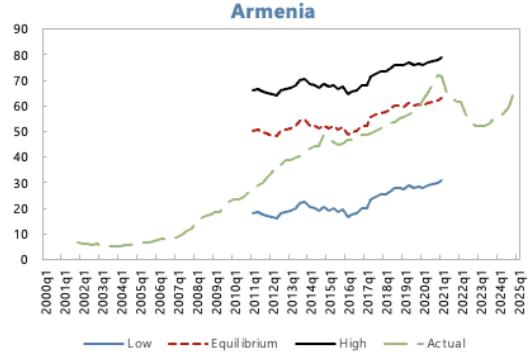

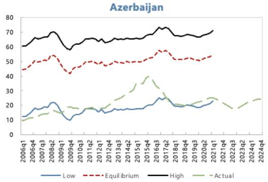

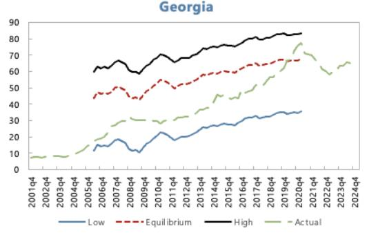

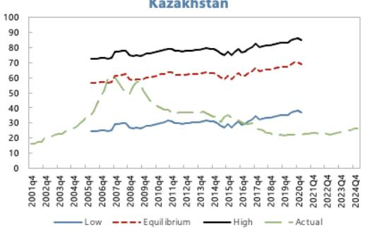

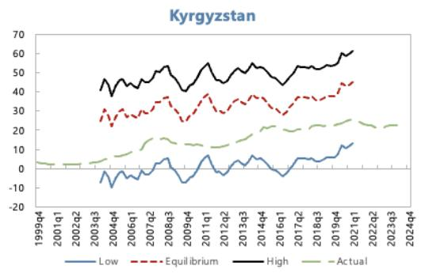

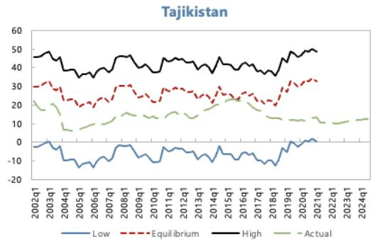

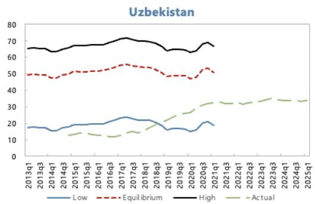

Sources: BIS; IMF, International Financial Statistics; IMF Financial Development Index database; World Bank, World Development Indicators; national authorities; and authors' estimates.

Note: Actual credit-to-GDP and equilibrium path implied by long-run coefficients from the emerging-market MGE model (Table 1). The central line uses the median country-specific constant from the reference panel; the upper and lower lines use the largest and smallest constants, respectively. All values in percent of GDP.

# IV. Speed of Credit Growth – Statistical Gap Measures

The equilibrium estimates from the reference panel serve as a benchmark for assessing whether credit levels in the CCA region are aligned with fundamentals. However, as noted by Drehmann and others (2011), credit booms are often characterized not only by levels of indebtedness that exceed sustainable benchmarks, but also by episodes of rapid acceleration relative to historical trends. To capture this dynamic dimension, we complement the equilibrium analysis with four alternative measures of the credit-to-GDP gap: the two-sided Hodrick–Prescott (HP) filter, the Hamilton filter, the Christiano–Fitzgerald (CF) filter, and a simple moving-average benchmark. Each measure captures deviations from trend in a different way. Together, these measures provide a more comprehensive view of credit-cycle dynamics.

The credit-to-GDP gaps are estimated as deviations of the observed ratio from four alternative statistical trends. $^{[11]}$ A positive credit gap indicates that credit is growing faster than the underlying trend. Large enough positive gaps imply that credit growth may be excessive, signaling accumulation of financial stability risks. Conversely, a negative gap reflects subdued credit relative to trend, often following deleveraging episodes or credit rationing. The accompanying blue line in each chart of figure 5 shows the five-year growth rate of the credit-to-GDP ratio. Taken together, these indicators help distinguish between sustainable financial deepening and signs of potential overheating.

Table 2 summarizes the parameter choices underlying each filter. The HP filter is implemented in its two-sided form with the smoothing parameter $\lambda = 14,400$ . We deliberately depart from the BIS convention of using a one-sided HP filter with $\lambda = 400,000$ (Drehmann, Borio and Tsatsaronis 2010, 2011), which was designed for real-time policy use in advanced economies and calibrated to capture longer financial cycles ( $\sim 30$ -years). In our sample of relatively short, boom-bust prone credit series, we find that the one-sided BIS specification produces extended periods of large negative gaps that persist long after credit has stabilized, making it less informative for the CCA, By contrast, the two-sided $\lambda = 14,400$ specification produces more responsive trends that adjust within a few years of structural shifts. Combined with the Hamilton, CF, and MA filters — each with different memory properties — the four-filter framework captures complementary aspects of the credit cycle.

Across the region, the latest data (2023–2025Q1) indicate that credit cycles have turned upward in several economies, though the degree and breadth of acceleration vary by country and by filter (Figure 4).

\- In the South Caucasus, lending has cooled from its fast pace from mid-2000s to late-2010s. In Armenia, the MA and HP-filter-based gaps was positive in late 2024-early 2025, while the other gap measures hovered below zero. Together with a five-year growth rate (right axis) near zero, this suggests that credit growth slowed sharply from its post-pandemic peak and remains broadly aligned with trend. Georgia has uniformly negative gaps and a near-zero five-year growth rate, meaning a mature phase of the credit cycle.

Table 2. Smoothing parameters used in the credit-to-GDP gap measures.

<table><tr><td>Filter</td><td>Parameter</td><td>Value</td><td>Implied cycle length</td></tr><tr><td>Hodrick–Prescott (two-sided)</td><td>Smoothing parameter  $\lambda$ </td><td>14,400</td><td>~10-15 years</td></tr><tr><td>Hamilton (2018) regression filter</td><td>Lookback horizon h; lag order p</td><td>h = 20; p = 4</td><td>5-year horizon, AR(4)</td></tr><tr><td>Christiano–Fitzgerald band-pass</td><td>Cycle bounds (quarters)</td><td>low = 32; high = 120</td><td>8–30 years</td></tr><tr><td>Moving average (backward)</td><td>Window length</td><td>20 quarters</td><td>5-year trailing average</td></tr><tr><td colspan="4">Note: The smoothing parameter  $\lambda$  = 14,400 targets credit cycles of medium length — longer than the standard business cycle ( $\lambda$  = 1,600; Hodrick and Prescott 1997) but shorter than the 30-year financial cycle of the BIS convention ( $\lambda$  = 400,000; Drehmann, Borio and Tsatsaronis 2010, 2011). The choice reflects the relatively short and boom-bust-prone nature of credit series in the CCA, where the BIS specification produces persistently negative gaps that adjust too slowly to be informative. Sensitivity analysis confirms that the estimated gaps are robust to alternative smoothing parameters.Hamilton (2018) regresses  $y_{t+h}$  on a constant and p lags of  $y_t$ ; the cyclical component is the regression residual. Hamilton recommends h = 8 (lookback of 2 years) for business-cycle analysis and h = 20 (lookback of 5 years) for financial-cycle work on quarterly data; p = 4 captures within-year autocorrelation.The Christiano and Fitzgerald (2003) asymmetric band-pass filter extracts cyclical components with periodicity between the lower and upper bounds. The 8–30 year range matches the financial-cycle definition of Drehmann, Borio and Tsatsaronis (2011).</td></tr></table>

\- Further east, a gradual normalization is underway. In Azerbaijan, credit gaps clustered around zero, with the MA, HP, and Hamilton measures slightly positive and the five-year growth rate edging higher—consistent with a modest recovery after prolonged deleveraging. Kazakhstan exhibits a similar but somewhat more advanced upswing: most filters (HP, MA, CF) were slightly positive and trending up, while the moving-average gap was near zero, and the five-year growth rate was moderate and stable. These upswings warrant monitoring, but they do not yet point to excessive credit expansion.

\- In the Kyrgyz Republic, most gap measures were slightly negative but credit was rising fast, with the moving-average and HP-filter based measures approaching zero and the five-year growth rate turning modestly positive. In Tajikistan, the moving-average and HP-filter-based gaps moved above zero while Hamilton, and CF-filter based gaps remained negative but were trending upward, with the five-year growth rate improving from low levels. These patterns imply early-stage upswing rather than credit booms.

\- In Uzbekistan, the indicators point to a continued moderation in credit dynamics. The moving-average and Christiano–Fitzgerald filters remained slightly above zero, suggesting that credit-to-GDP was still somewhat above trend, while the Hamilton filter was around zero and the HP filter turned negative. The five-year growth rate fell markedly from its earlier highs, indicating a slowdown in cumulative credit expansion. Taken together, these signals suggest that the post-liberalization credit boom cooled significantly. The remaining positive gaps reflect past momentum rather than renewed acceleration. While credit growth remains stronger than in most regional peers, the trend now points to a soft landing rather than renewed overheating.

Figure 4. Credit Gap Measures for the CCA Economies  
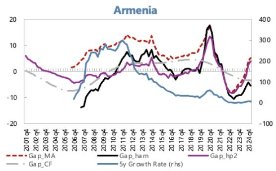

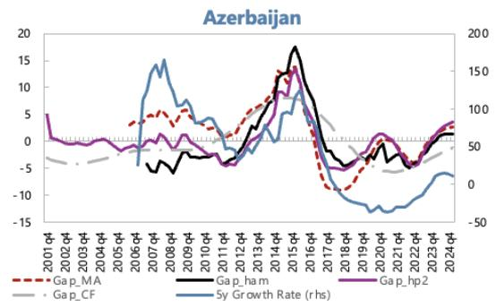

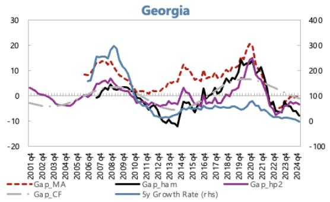

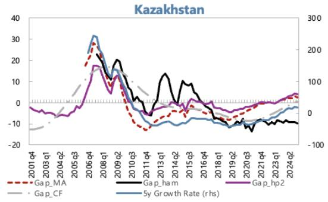

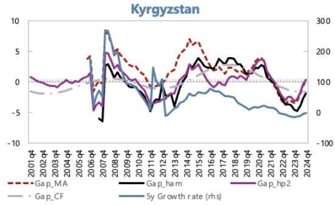

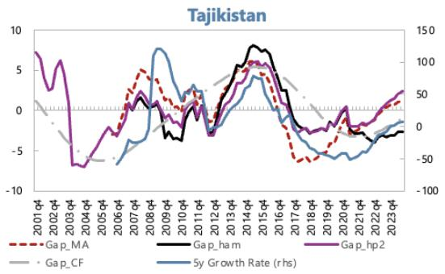

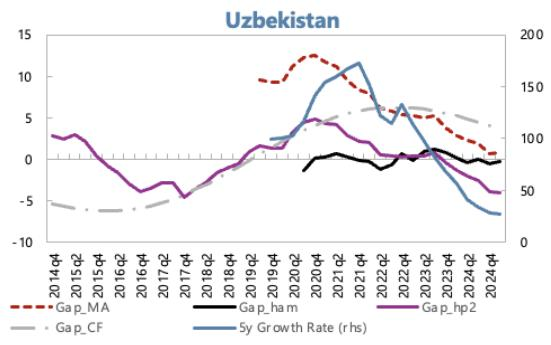

Sources: BIS; IMF, International Financial Statistics; national authorities; and authors' estimates. Note: Credit gaps computed as deviations of the credit-to-GDP ratio from its trends using four different filters: two-sided HP filter, Hamilton filter, Christiano–Fitzgerald filter, and a moving-average benchmark. Left axis: gap in percentage points of GDP. Right axis: five-year cumulative growth rate of the credit-to-GDP ratio, in percent.

## V. Disaggregating Credit Dynamics: Households vs. Corporates

## Household Credit

Recent developments in household lending reveal an increasingly differentiated picture across the CCA region. In most economies, household credit gaps are near or slightly above zero, indicating that lending to households is broadly in line with or modestly exceeding trend levels. In several cases, the gaps have turned upward, suggesting a gradual reacceleration in household borrowing following a period of subdued activity. The five-year growth rate—shown on the right axis—suggests stabilization rather than renewed acceleration in most countries.

In the South Caucasus, household credit conditions vary in strength (Figure 5).

\- In Armenia, all household credit gaps are positive but not too wide, showing that household lending is expanding slightly above its long-term trend. The five-year growth rate remains moderate, consistent with steady but contained credit growth.

\- In Azerbaijan, there is an upward momentum in household lending from relatively low levels. All gap measures are positive, indicating that lending is expanding above trend. The five-year growth rate has increased steadily, confirming a broad-based upswing. The sustained nature of the expansion underscores the importance of monitoring debt-service burdens and lending standards even though the expansion follows the earlier contraction in 2016-2018.

\- In Georgia, the ratio of household credit to GDP appears to have plateaued at elevated levels, consistent with a mature phase of the credit cycle. Two of the three filters (Hamilton and CF) are positive, while the HP gap is slightly negative, implying that household credit-to-GDP is broadly at or somewhat above its underlying trend. The five-year growth rate has turned negative, indicating a clear deceleration in new household lending following the surge in 2021–22. Given the short series and base effects, these signals should be interpreted with caution.

Across Central Asia, household credit momentum is uneven but generally firming.

\- In Kazakhstan, all gap measures are positive, indicating that household lending continues to grow above its long-term trend. The five-year growth rate remains positive and stable, suggesting a broad-based and sustained expansion supported by mortgage and consumer credit programs. The persistence of above-trend levels points to robust momentum, warranting vigilance as new policy initiatives or subsidized lending could amplify overheating risks.

\- In contrast, the Kyrgyz Republic shows signs of softening after an earlier recovery. All filters remain negative and have edged downward in recent quarters, while the five-year growth rate has also declined. This configuration indicates that the household credit cycle has paused following its earlier rebound, with lending activity slowing from modest levels. The continued weakness likely reflects structural constraints, including high borrowing costs and limited long-term funding access.

\- In Tajikistan, household credit is showing signs of recovery after a prolonged period of weakness. All the gap measures are trending upward and have turned positive. The five-year growth rate has also turned positive, signaling that household lending is expanding again, though from a low base. The overall configuration suggests that Tajikistan's household credit cycle is in an early expansionary phase at low levels.

\- Finally, in Uzbekistan, the CF-filter-based credit gap is slightly positive, while the HP-based gap is near zero, implying that household credit is broadly aligned with its trend. Although the five-year growth rate remains positive, it has declined significantly, indicating a slowdown from the rapid post-liberalization expansion. The evidence points to a maturing household credit cycle, with lending stabilizing after several years of rapid growth. Given the limited data history and ongoing structural changes, these results should be interpreted with caution. It should also be noted that growth has been very strong in microlending, which is subject to less demanding credit screening procedures.

Overall, aggregate household credit developments across the CCA suggest gradual financial deepening, although growth has recently been very strong in some segments. Accordingly, the strengthening of momentum in several economies calls for closer supervisory scrutiny to ensure that prudent lending standards are followed. Furthermore, excessively strong credit expansion may add to overheating pressures when economic activity is already very strong.

## Corporate Credit

Corporate credit developments point to a gradual and uneven recovery following years of deleveraging in most countries and acceleration at low levels in some other countries (Figure 6).

\- In Armenia, all gap measures remain negative or close to zero following declines in credit levels in 2021-2023, indicating that corporate credit-to-GDP is still below its long-term trend, though the gaps were narrowing rapidly in recent quarters, suggesting the contraction phase is ending.

\- In Azerbaijan, the cycle has begun to turn: two filters are slightly positive while the rest are slightly negative, implying that credit-to-GDP is broadly aligned with trend. The five-year growth rate has improved sharply since 2020, pointing to an early-stage recovery, supported by healthier bank balance sheets.

\- In Georgia, most gap measures are at or below zero, and the five-year growth rate decelerated significantly. The decline reflects a correction from the rapid expansion of 2019–20. These results should be interpreted with caution given the short data series.

\- In Kazakhstan, three gap measures remain marginally negative and one slightly positive, with the five-year growth rate recovering steadily from large declines in credit 2015-2021. This configuration signals a nascent recovery in corporate credit.

\- In the Kyrgyz Republic, all gap measures are marginally positive and the five-year growth rate is steady at around 30 percent, indicating that corporate credit is slightly above its trend. In this context, the acceleration in year-over-year (y/y) growth in corporate credits should be watched closely.

\- In Tajikistan, the corporate credit cycle remains subdued: the HP gap is marginally positive while the others are slightly negative, suggesting that credit-to-GDP is close to its trend. The five-year growth rate has improved from the severe contraction in 2016-2022 but remains in negative territory, highlighting a slow and uneven recovery amid persistent weaknesses in the banking system.

\- In Uzbekistan, the short data series complicates assessment, but both filters are slightly negative, and the five-year growth rate is flat, implying that corporate credit is broadly aligned with its trend following the earlier surge after financial liberalization.

Taken together, these patterns suggest that corporate credit across the CCA is recovering from a prolonged period of weakness, with early signs of recovery in Azerbaijan, Kazakhstan, and the Kyrgyz Republic, and small negative gaps narrowing rapidly in Armenia and Georgia. However, lending remains subdued in Tajikistan. Overall, the corporate credit cycle appears to be entering a gradual normalization phase, characterized by modest growth and limited signs of overheating in corporate lending.

Figure 5. Household Credit Gap Measures for the CCA Economies  
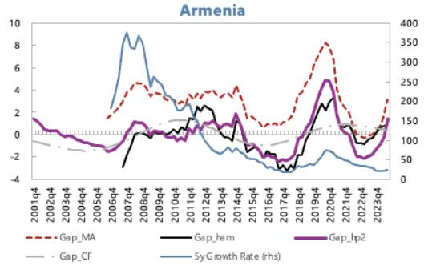

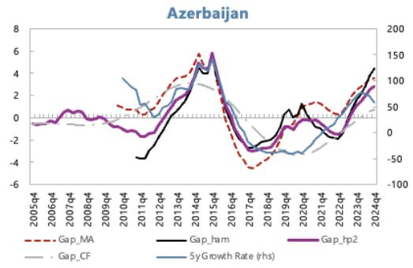

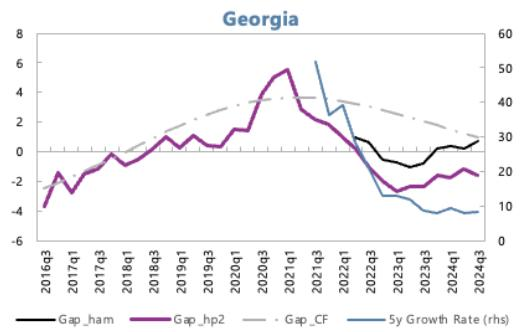

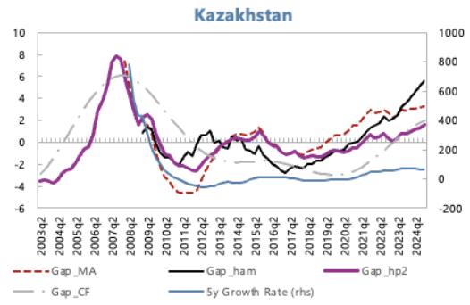

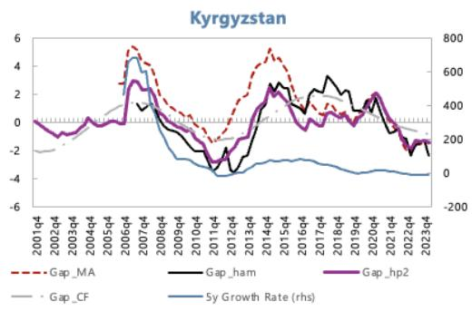

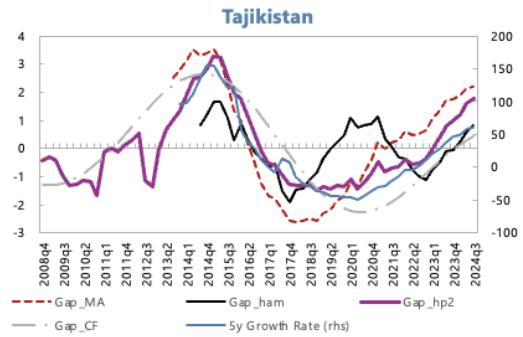

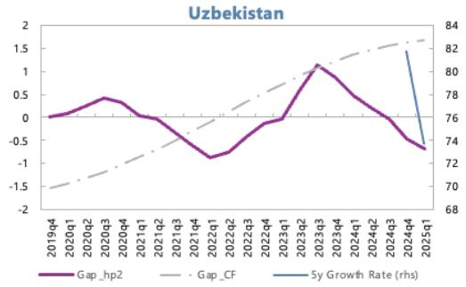  
Sources: National authorities, and authors' estimates.

Note: Credit gaps computed as deviations of the household-credit-to-GDP ratio from its trends using four different filters: two-sided HP filter, Hamilton filter, Christiano–Fitzgerald filter, and a moving-average benchmark. Left axis: gap in percentage points of GDP. Right axis: five-year cumulative growth rate of the household credit-to-GDP ratio, in percent.

Figure 6. Corporate Credit Gap Measures for the CCA Economies  
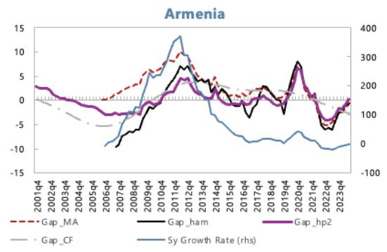

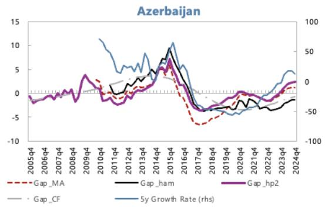

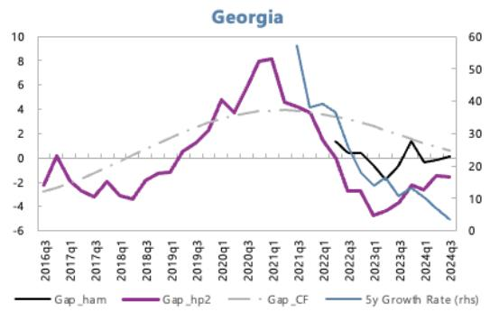

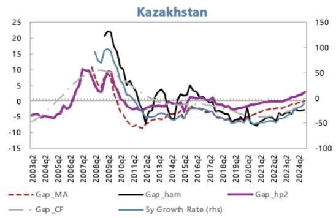

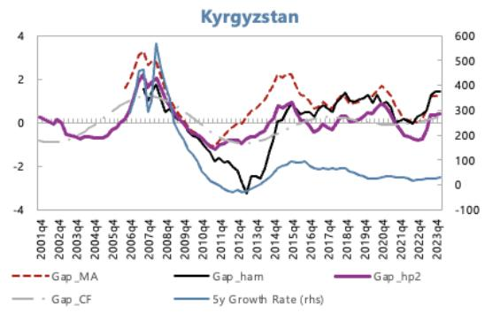

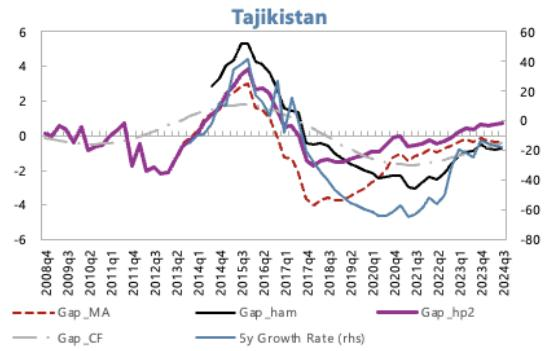

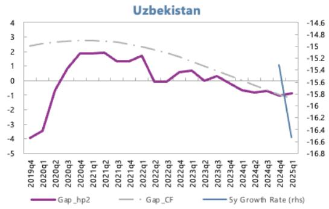  
Sources: National authorities, and authors' estimates.

Note: Credit gaps computed as deviations of the corporate-credit-to-GDP ratio from its trends using four different filters: two-sided HP filter, Hamilton filter, Christiano–Fitzgerald filter, and a moving-average benchmark.. Right axis: five-year cumulative growth rate of the corporate credit-to-GDP ratio, in percent.

## VI. Multivariate Filter (MVF) Credit Gap

Both fundamentals-based and statistical filter approaches each have important limitations for CCA countries, where the presence of structural breaks, shallow initial credit markets, and boom-bust cycles complicate inference. Fundamentals-based models can misinterpret prolonged catch-up as permanently high equilibrium credit, while purely statistical gaps may track past booms and produce implausibly large negative gaps after busts.

Fundamentals-based panel regressions anchor credit to income, interest rates, and institutional quality, but they rely on long panels and stable relationships that may not fully capture country-specific characteristics. For the CCA, short samples and repeated structural breaks often lead to unstable coefficients, while estimated equilibrium paths can move in a procyclical way, reducing their usefulness as “slow-moving” benchmarks. Statistical filters, such as HP or band-pass filters, are easy to implement but entirely backward-looking. In boom-bust environments like observed in Kazakhstan and Azerbaijan, the one-sided HP trend tends to follow the boom with a lag, so after the bust the filter treats the peak as the new “normal” and generates very persistent negative gaps. These large negative gaps may suggest that credit is far below trend even when the level is already adequate, making it difficult to use them as the sole guide for macroprudential policy. The two-sided HP filter, on the other hand, relies on future data, which is not available in real time, implying large ex-post revisions to the gap estimates. These weaknesses motivate an approach that can distinguish financial deepening from true cyclical excess, while still being grounded in observable macro-financial relationships.

## MVF: a semi-structural macro-financial filter

We use the multivariate filter (MVK), a semi-structural state-space model, to jointly estimate trends and cycles in output, inflation, unemployment, interest rates, and real credit, with an explicit equation for the credit gap. It builds on work by Krznar and Matheson (2017) and Baba et al. (2019) by embedding a small New-Keynesian-style core (IS curve, Phillips curve, Taylor rule, and Okun's law) and a credit equation that links the credit cycle to the business cycle and the real-rate gap (see Annex II for details). For Kazakhstan, the domestic block includes:

\- an IS curve where the output gap depends on its own lags and leads, the credit gap, the real interest-rate gap, and external conditions;

\- a Phillips curve where inflation depends on expected and lagged inflation, the output gap, and the relative-price gap;

\- an Okun relationship between the output gap and the unemployment gap;

\- a credit equation in which the credit gap responds to lagged output, its own persistence, and the real interest-rate gap.

This structure ensures that credit booms are interpreted in the context of strong growth, accommodative real rates, and improving labor markets, rather than simply as deviations from a smooth statistical trend. In the Kazakhstan–Russia application, Russia is modeled as the foreign block providing external demand, inflation, and interest-rate conditions that feed back into Kazakhstan's cycle and credit dynamics

Figure 7 shows that for Kazakhstan, the MVF delivers a smoother and more plausible estimate of the underlying credit trend than both one-sided and two-sided HP filters. While the HP trend continues to rise through and beyond the 2007–08 boom, the MVF trend peaks earlier and declines gradually thereafter, tracking more closely the behaviour of actual real credit. The two-sided MVF estimate also generates a relatively narrow confidence band, suggesting that the turning points in Kazakhstan's credit trend are estimated with reasonable precision despite sizeable short-term volatility in the observed data. $^{12}$

Figure 7. Comparison of MVK and Other Gap measures for the CCA Economies  
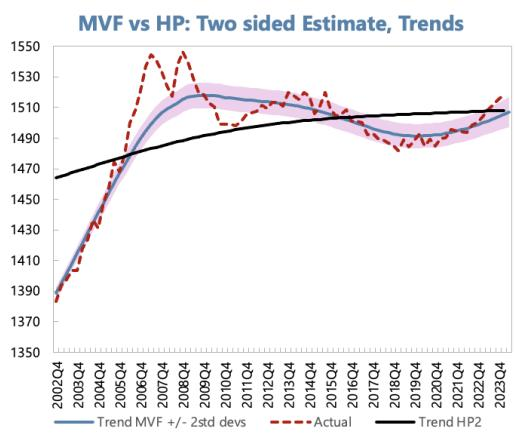

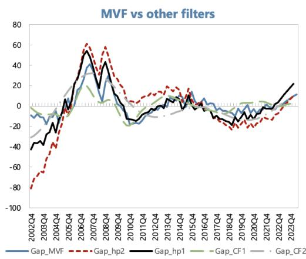  
Sources: National authorities (Kazakhstan and Russia), and authors' estimates.
Note: Trend and cycle of real credit for Kazakhstan estimated from the multivariate filter (MVF), compared with one-sided and two-sided Hodrick–Prescott trends. Real credit is nominal credit deflated by the GDP deflator, in log levels. Shaded area: MVF trend ± two standard deviations of the estimated credit cycle.
Sample: 2003Q1–2024Q2.

## VII. Which Credit Gap is Better?

The previous sections analyzed credit dynamics in the CCA region using several univariate and multivariate filters to extract the cyclical component of the credit-to-GDP ratio. In this section, we move one step further and ask a practical policy question: which of these credit gap measures provides the most reliable signal of financial vulnerability?

To answer this, we conduct a “horse race” among alternative credit gap definitions, following the methodology of Drehmann and Yetman (2020). The objective is to assess which gap - derived from the HP, Hamilton, CF, or MA filter or, in case of Kazakhstan, also the MVK filter- best predicts episodes of excessive credit growth that may precede financial stress. Identifying the most informative measure is important for policymakers in the CCA region, as it allows for better-targeted macroprudential monitoring and more timely policy responses. Different filters capture different aspects of the credit cycle. The HP filter tends to emphasize medium-term fluctuations but suffers from endpoint bias; the Hamilton filter produces a more responsive signal but can be noisy; the CF filter extracts business-cycle components more smoothly; and the MA gap provides a simple, transparent benchmark. In contrast, the MVK filter embeds credit dynamics within a broader macro-financial

framework. Yet, despite these methodological differences, there is little consensus on which approach best identifies periods of rising vulnerability.

By directly comparing their predictive performance, we aim to determine which gap measure most closely aligns with subsequent signs of financial instability. The exercise focuses on credit gap estimates only, without including the fundamentals-based equilibrium estimates, as the purpose here is not to measure structural alignment but to evaluate the cyclical properties and predictive usefulness of alternative detrending methods.

## Methodology

To assess which credit gap measure provides the most reliable early-warning signal of financial stress, we follow the empirical framework developed by Drehmann and Yetman (2020) and evaluate each indicator's predictive performance using the Area Under the Receiver Operating Characteristic Curve (AUC). This metric provides a simple, transparent, and widely used summary of an indicator's usefulness as a predictor of financial distress.

The logic of the approach is intuitive. Each credit gap measure can be viewed as a potential “signal” of vulnerability, with higher gaps signalling a higher probability of future financial strain. To test this empirically, we compare how well each gap distinguishes between two states of the economy: crisis (or stress) periods, and normal periods.

For each country and quarter, we record whether a credit gap exceeds a given threshold (a potential signal) and whether a financial stress episode occurs within a specific prediction horizon (typically up to 12 quarters ahead). The AUC is then computed by plotting the true positive rate (TPR) — the share of crises correctly signalled — against the false positive rate (FPR) — the share of normal periods incorrectly signalled — for all possible thresholds of the indicator.

The area under this curve (AUC) summarizes the overall signalling quality:

\- An AUC of 0.5 implies no predictive power (equivalent to random guessing).

\- An AUC of 1 indicates a perfect predictor that always distinguishes crisis from non-crisis periods.

• Values between 0.5 and 1 reflect increasing predictive accuracy.

In practice, the AUC can be interpreted as the probability that the indicator assigns a higher value to a crisis observation than to a non-crisis one. Following Drehmann and Yetman (2020), we estimate the AUC non-parametrically, using bootstrap resampling to derive standard errors and test for statistical differences between alternative gap measures.

The analysis proceeds as follows:

Definition of event window: Financial stress episodes are defined over a horizon of 12 quarters preceding a significant slowdown in credit or an identified financial strain event. Signals issued during ongoing stress episodes are excluded to avoid bias.

Rolling forecast evaluation: To mimic real-time policymaking, the AUC is calculated in an expanding-sample fashion, meaning that each period's assessment uses only information available up to that point. This avoids look-ahead bias and reflects the uncertainty faced by authorities in real time.

Cross-method comparison: The AUCs are then compared across the four statistical filters used in this study (HP, Hamilton, CF, and MA gaps, and, in case of Kazakhstan, also MVK gap) to identify which provides the highest and most stable predictive power. Differences in AUCs are tested for statistical significance using a Wald test based on the joint variance–covariance matrix of bootstrap estimates.

This approach offers several advantages from a policy perspective. First, it directly quantifies how often an indicator gives correct versus false alarms, providing an interpretable measure of reliability. Second, it allows for the comparison of alternative credit gaps using a common, outcome-based criterion rather than ad hoc judgment. Finally, because the AUC does not depend on a specific threshold, it avoids the arbitrariness often associated with crisis-signal cutoffs, making it particularly suitable for macroprudential policy calibration.

## Crisis Data

We adopt the Laeven and Valencia (2018; LV) taxonomy of “systemic banking crises”—generalized banking distress that disrupts financial intermediation and triggers significant policy intervention—as our benchmark for the presence or absence of systemic episodes in the CCA region. While the LV database provides the global benchmark, its coverage for the CCA is limited by the authors’ strict identification criteria—requiring both extensive bank failures and large-scale public interventions officially recognized as systemic. As a result, several regionally significant banking disruptions that involved liquidity stress, forced mergers, or quasi-fiscal recapitalizations were not flagged, often because they were resolved through administrative measures or local-currency support operations rather than explicit systemic declarations. To address these gaps, we extend the LV dataset by incorporating IMF Article IV reports, Financial System Stability Assessments (FSSAs), and contemporaneous policy documents to identify episodes that meet the spirit, if not always the formal LV threshold, of system-wide distress.

Specifically, we identify systemic crisis for the following periods: Azerbaijan (2015Q1–2017Q4), Kazakhstan (2008Q3–2010Q4; 2014Q4–2017Q4), Kyrgyz Republic (2010Q2–2010Q4), and Tajikistan (2015Q4–2016Q4). $^{13}$ For Armenia, Georgia, and Uzbekistan, LV report no systemic banking crisis through 2017, and subsequent IMF surveillance does not overturn that view (Annex III).

## Results

Figure 8 demonstrates that across the CCA economies, the credit gaps tend to display significant predictive content, particularly at short-to-medium-term horizons (up to eight quarters before a crisis). However, the strength and persistence of the signal vary considerably across countries and filters, reflecting differences in credit cycles, data length, and the limited number of systemic distress episodes observed in the region.

In Azerbaijan and Tajikistan, the AUC profiles for the CF and MA filters remain close to unity up to six to eight quarters before the crisis, indicating near-perfect separation between pre-crisis and tranquil observations. These findings are consistent with the sharp acceleration in private sector credit preceding the 2015–16 and 2015–17 financial stress episodes, respectively. Yet, given that each country experienced only a single major banking crisis during the sample period, the near-perfect AUC values likely reflect small-sample bias rather than systematic predictive superiority.

In Kazakhstan, both the Hamilton and MVK filters achieve stable and high AUC values (around 0.9) over 4-8 quarters, capturing the pronounced pre-2007 credit boom that culminated in a systemic banking crisis. The MA and HP gaps exhibit weaker discriminatory power, suggesting that smoother or short-memory filters fail to detect the protracted nature of Kazakhstan's credit cycle. These results underscore the usefulness of bandpass and regression-based filters for identifying medium-term leverage buildups in economies with longer credit expansions.

In Kyrgyzstan, Hamilton and one-sided HP filters dominate, with AUC values approaching 1 at horizons of 6–8 quarters. This indicates strong short-term predictive performance in a system characterized by shorter, more volatile credit cycles. Other filters perform less consistently, suggesting that rapidly adjusting economies may require more responsive statistical measures.

These results should be interpreted with caution. The high AUC scores largely reflect the presence of one or two crisis episodes per country, implying that model evaluation is constrained by limited within-country variation. As such, the analysis provides illustrative evidence of each filter's performance rather than statistical proof of out-of-sample predictive dominance.

From a policy perspective, the findings suggest that credit gap indicators can serve as informative components of macroprudential surveillance frameworks, particularly when interpreted in conjunction with broader financial stability diagnostics. Persistent and widening positive gaps across multiple filters—rather than single-quarter deviations—should be viewed as early signs of rising systemic vulnerabilities. Nevertheless, the small number of crisis observations implies that national authorities should rely on these indicators as monitoring tools rather than mechanical policy triggers. Pooling data across the region or employing panel-based estimation could provide a more robust assessment of cross-country predictive performance and enhance the policy relevance of credit gap-based early warning systems.

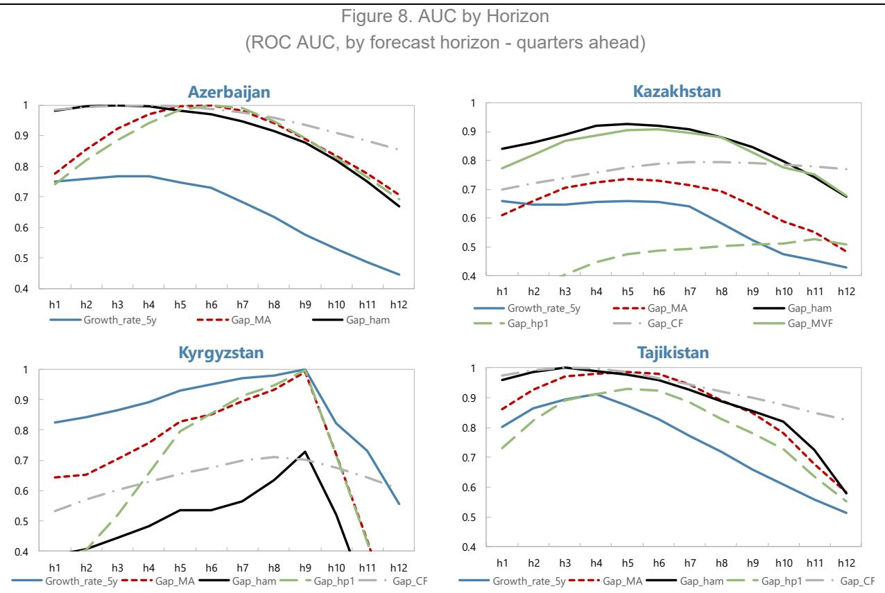  
Sources: Authors' estimates.

Note: Area under the receiver operating characteristic curve (AUC) for each candidate credit gap measure, by prediction horizon (quarters before a systemic banking-stress episode). AUC ranges from 0 to 1; 0.5 indicates no predictive content. Bootstrap estimation following Drehmann and Yetman (2020).

## VIII. Conclusion

This paper has examined credit developments in the CCA region through complementary structural and cyclical lenses. The analysis finds that while most economies in the region remain under-credited relative to long-run fundamentals, the pace and composition of credit growth vary considerably across countries. Armenia and Georgia have largely converged to equilibrium credit levels (given their fundamentals), whereas Kazakhstan, Azerbaijan, and Tajikistan continue to exhibit persistent shortfalls linked to legacy banking weaknesses. Kyrgyzstan and Uzbekistan are in active catch-up phases, reflecting financial deepening from low bases.

Statistical and MVK-based credit gap indicators reveal that credit cycles across the region have shifted from post-crisis deleveraging toward a moderate recovery, with limited evidence of overheating. Household credit has become the primary engine of growth, while corporate lending remains relatively less strong. The growing divergence between household and corporate credit cycles underscores the structural transformation of CCA banking systems toward retail-oriented intermediation.

The comparative assessment of alternative gap measures suggests that no single filter provides a universally superior early-warning signal. The MVK, HP, and CF gaps perform best overall, but their reliability of this

analysis is constrained by limited crisis observations. These results highlight the need to treat credit gaps as complementary tools within a broader macroprudential framework rather than as stand-alone policy triggers.

The findings suggest that the CCA region is entering a new phase of financial deepening at the aggregate level, marked by cautious recovery rather than exuberant expansion, although growth is very strong in certain segments and may be adding to overheating risks. Maintaining the balance between promoting access to finance and safeguarding financial stability will require vigilant monitoring, data-driven policymaking, and continued progress in institutional strengthening.

## References

Andrle, M., Garcia-Saltos, R., & Ho, G. (2014). "A Model-Based Analysis of Spillovers: The Case of Poland and the Euro Area," IMF Working Paper No. 14/186, International Monetary Fund.

Baba, C., Dell'Erba, S., Detragiache, E., Harrison, O., Mineshima, A., Musayev, A., and Shahmoradi, A. (2020). "How Should Credit Gaps Be Measured? An Application to European Countries," IMF Working Paper No. WP/20/6, International Monetary Fund.

Bakhshiyeva v Sberbank of Russia & Ors [2018] EWCA Civ 2802 (Court of Appeal, 18 December 2018), upholding Re OJSC International Bank of Azerbaijan [2018] EWHC 59 (Ch) (High Court of Justice, Chancery Division, 18 January 2018).

Borio, C., and Lowe, P. (2002). "Assessing the risk of banking crises." BIS Quarterly Review, December, 43–54.

Buncic, D., and Melecky, M. (2014). "Equilibrium Credit: The Reference Point for Macroprudential Supervisors," Journal of Banking & Finance, 41, 135–154.

Calza, A., Manrique, M., and Sousa, J. (2003). “Aggregate Loans to the Euro Area Private Sector,” ECB Working Paper Series No. 202, European Central Bank.

Carabenciov, I., Ermolaev, I., Freedman, C., Juillard, M., Kamenik, O., Korshunov, D., Laxton, D., & Laxton, J. (2008). "A Small Quarterly Multi-Country Projection Model," IMF Working Paper No. 08/279, International Monetary Fund.

Christiano, L. J., and Fitzgerald, T. J. (2003). "The Band Pass Filter." International Economic Review, 44(2), 435–465.

Cottarelli, C., Dell'Ariccia, G., and Vladkova-Hollar, I. (2005). "Early Birds, Late Risers, and Sleeping Beauties: Bank Credit Growth to the Private Sector in Central and Eastern Europe and in the Balkans," Journal of Banking & Finance, 29(1), 83–104.

Dell'Ariccia, G., Igan, D., and Laeven, L. (2012). "Credit booms and lending standards: Evidence from the Subprime Mortgage Market," Journal of Money, Credit and Banking, 44(2–3), 367–384.

Drehmann, M., Borio, C., & Tsatsaronis, K. (2011). "Anchoring Countercyclical Capital Buffers: The Role of Credit Aggregates," BIS Working Paper No. 355, Bank for International Settlements. (Also published in International Journal of Central Banking, 7(4), 189–240.)

Drehmann, M., and Yetman, J. (2020). Which Credit Gap Is Better at Predicting Financial Crises? A Comparison of Univariate Filters. BIS Working Papers No. 878, Bank for International Settlements.

Drehmann, M., Borio, C., and Tsatsaronis, K. (2010). "Countercyclical capital buffers: exploring options." BIS Working Paper No. 317, Bank for International Settlements.

Égert, B., Backé, P., and Zumer, T. (2006). “Credit Growth in Central and Eastern Europe: New (Over)Shooting Stars?,” ECB Working Paper Series No. 687, European Central Bank.

Hamilton, J. D. (2018). "Why You Should Never Use the Hodrick-Prescott Filter." Review of Economics and Statistics, 100(5), 831–843.

Hodrick, R. J., and Prescott, E. C. (1997). "Postwar U.S. Business Cycles: An Empirical Investigation." Journal of Money, Credit and Banking, 29(1), 1–16.

Hofmann, B. (2001). "The Determinants of Private Sector Credit in Industrialized Countries: Do Property Prices Matter?" BIS Working Paper No. 108, Bank for International Settlements.

Im, K. S., Pesaran, M. H., and Shin, Y. (2003). "Testing for Unit Roots in Heterogeneous Panels." Journal of Econometrics, 115(1), 53–74.

International Monetary Fund (2010a). Republic of Kazakhstan: 2010 Article IV Consultation Staff Report. IMF Country Report No. 10/241, July 27, 2010. URL: https://www.imf.org/external/pubs/ft/scr/2010/cr10241.pdf

International Monetary Fund (2010b). Public Information Notice: IMF Executive Board Concludes 2010 Article IV Consultation with the Republic of Kazakhstan. July 27, 2010. URL: https://www.imf.org/en/News/Articles/2015/09/28/04/53/pn1098.

International Monetary Fund (2011a). Kyrgyz Republic: Selected Issues. IMF Country Report No. 11/156, June 2, 2011 (notes 30% deposit decline in April 2010 and measures around AUB). URL: https://www.imf.org/external/pubs/ft/scr/2011/cr11156.pdf.

International Monetary Fund (2011b). Kyrgyz Republic: Ex Post Assessment of Longer-Term Program Engagement. March 9, 2011 (Box 7 on 2010 turmoil and banking stress). URL: https://www.imf.org/external/np/pp/eng/2011/030911a.pdf.

International Monetary Fund (2017a). IMF Staff Completes 2017 Article IV Mission to the Republic of Azerbaijan. Press Release No. 17/498, December 15, 2017. URL: https://www.imf.org/en/News/Articles/2017/12/15/pr17498-imf-staff-completes-2017-article-iv-mission-to-the-republic-of-azerbaijan.

International Monetary Fund (2017b). Republic of Kazakhstan: 2017 Article IV ConsultationPress Release and Staff Report. May 9, 2017. URL: https://www.imf.org/en/Publications/CR/Issues/2017/05/09/Republic-of-Kazakhstan-2017-Article-IV-Consultation-Press-Release-and-Staff-Report-44884

International Monetary Fund (2017c). Republic of Kazakhstan: Staff Report for the 2017 Article IV Consultation. eLibrary entry, May 2017 (discussion of KKBHalyk transaction and expected public support). URL: https://www.elibrary.imf.org/view/journals/002/2017/108/article-A001-en.xml.

International Monetary Fund (2017d). IMF Executive Board Concludes 2017 Article IV Consultation with the Republic of Tajikistan. Press Release No. 17/429, November 9, 2017 (records 6.1% of GDP bank

recapitalization in 2016). URL: https://www.imf.org/en/News/Articles/2017/11/09/pr17429-imf-executive-board-concludes-2017-article-iv-consultation-with-the-republic-of-Tajikistan

International Monetary Fund (2019). Republic of Azerbaijan: 2019 Article IV Consultation Press Release and Staff Report. IMF Country Report No. 19/241, September 18, 2019. URL: https://www.imf.org/-/media/Files/Publications/CR/2019/1AZEEA2019001.ashx.

International Monetary Fund (2021). Republic of Tajikistan: 2017 Article IV Consultation Staff Report (eLibrary re-posting with DSA discussion). September 3, 2021 (notes the bank recapitalizations impact on public debt). URL: https://www.elibrary.imf.org/view/journals/002/2021/198/article-A001-en.xml.

International Monetary Fund (2021). Republic of Tajikistan: Selected Issues, IMF Country Report No. 21/199, September 2021. URL: https://www.elibrary.imf.org/view/journals/002/2021/199/article-A002-en.xml.

Kiss, G., Nagy, M., and Vonnák, B. (2006). “Credit Growth in Central and Eastern Europe: Convergence or Boom?,” MNB Working Papers No. 2006/10, Magyar Nemzeti Bank (Central Bank of Hungary).

Krznar, I., & Matheson, T. (2017). "Financial and Business Cycles in Brazil," IMF Working Paper No. 17/12, International Monetary Fund.

Kwiatkowski, D., Phillips, P. C. B., Schmidt, P., and Shin, Y. (1992). "Testing the Null Hypothesis of Stationarity against the Alternative of a Unit Root: How Sure Are We That Economic Time Series Have a Unit Root?" Journal of Econometrics, 54(1–3), 159–178.

Laeven, L., & Valencia, F. (2018). "Systemic Banking Crises Revisited," IMF Working Paper No. 18/206, International Monetary Fund.

Maddala, G. S., and Kim, I.-M. (1998). Unit Roots, Cointegration, and Structural Change. Cambridge University Press.

Maddala, G. S., and Wu, S. (1999). "A Comparative Study of Unit Root Tests with Panel Data and a New Simple Test." Oxford Bulletin of Economics and Statistics, 61(S1), 631–652.

Pesaran, M. H., Shin, Y., & Smith, R. P. (1999). "Pooled Mean Group Estimation of Dynamic Heterogeneous Panels," Journal of the American Statistical Association, 94(446), 621–634.

Ravn, M. O., and Uhlig, H. (2002). "On adjusting the Hodrick-Prescott filter for the frequency of observations." Review of Economics and Statistics, 84(2), 371–376.

## Annex I. Equilibrium (Large Economies)

Figure 1. Deviation from the Equilibrium Level Credit-to-GDP Ratio, Large Economies reference panel (In percent of credit to GDP)  
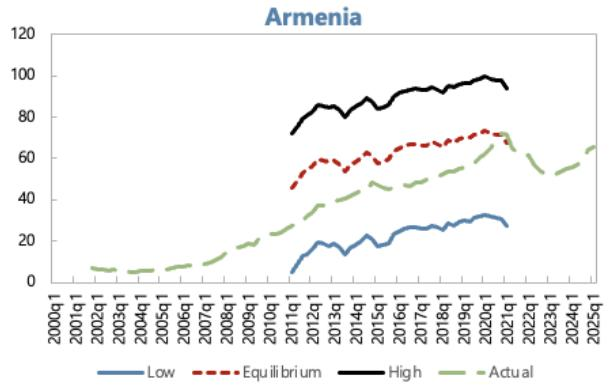

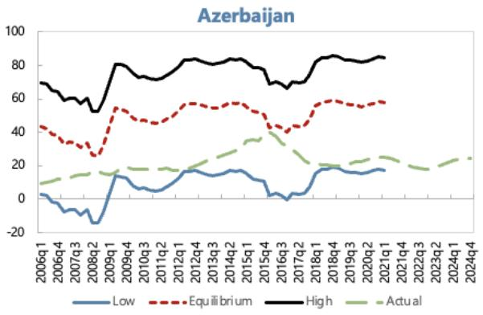

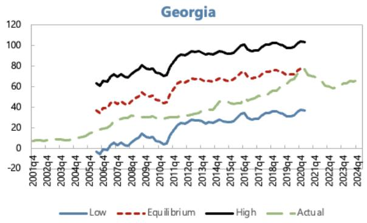

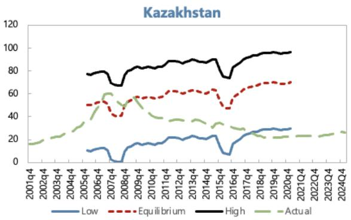

Figure 2. Deviation from the Equilibrium Level Credit -to-GDP Ratio, Large Economies Reference panel (without FII)  

# Annex II: Multivariate Filter Estimation for Kazakhstan

## I. Model Overview

This Annex provides a detailed overview of the multivariate filter (MVF) model estimated for Kazakhstan, with Russia as the foreign economy. The model follows the framework of Baba et al. (2019), which builds on Carabenciov et al. (2008), Andrle et al. (2014), and Krznar and Matheson (2017). The estimation sample covers 2003:Q1–2024:Q2.

In terms of notation: lower-case letters denote deviations of variables from trends (gaps); lower-case letters with an asterisk (\*) or "BAR" denote trends; and upper-case letters denote observed levels. Variables with subscript "E" refer to the foreign economy (Russia).

## II. Domestic Economy (Kazakhstan)

## A. Output

The output gap is defined as the deviation of log real GDP from its trend:

$$
y _ {t} = Y _ {t} - Y _ {t} ^ {*}
$$

where $Y_{t} \equiv 100 \times \ln (RGDP_{t})$ . Potential output evolves according to:

$$
Y _ {t} ^ {*} = Y _ {t - 1} ^ {*} + \frac {1}{4} g _ {t} + \varepsilon_ {t} ^ {L G D P \_ B A R}
$$

Trend growth revolves around a steady-state value:

$$
g _ {t} = \rho_ {g} \cdot g _ {t - 1} + (1 - \rho_ {g}) \cdot g _ {s s} + \varepsilon_ {t} ^ {G}
$$

The output gap is determined by an IS-curve specification:

$$
y _ {t} = \beta_ {l e a d} \cdot y _ {t + 1} + \beta_ {l a g} \cdot y _ {t - 1} + \beta_ {r} \cdot r _ {t} + \beta_ {y E} \cdot y _ {t} ^ {E} + \beta_ {c} \cdot \varepsilon_ {t} ^ {c} + \beta_ {z} \cdot z _ {t} + \varepsilon_ {t} ^ {Y}
$$

where $r_{t}$ is the real interest rate gap, $y_{t}^{E}$ is the Russian output gap, $\varepsilon_{t}^{c}$ is the credit shock, and $z_{t}$ is the real exchange rate gap (measured as the Russia–Kazakhstan inflation differential).

## B. Phillips Curve

Domestic inflation dynamics follow a Phillips curve:

$$
\pi_ {t} = (1 - \alpha_ {l a g}) \cdot \pi_ {t + 1} + \alpha_ {l a g} \cdot \pi_ {t - 1} + \alpha_ {y} \cdot y _ {t} + \alpha_ {z} \cdot z _ {t} + \varepsilon_ {t} ^ {P I E}
$$

## C. Credit

The credit gap is defined as the deviation of real credit from its trend:

$$
c _ {t} = C _ {t} - C _ {t} ^ {*}
$$

where $C_{t} \equiv 100 \times \ln (CRED_{t}/DEF_{t})$ , with $CRED_{t}$ being nominal credit to the private non-financial sector and $DEF_{t}$ the GDP deflator.

The credit gap equation:

$$
c _ {t} = \theta_ {1} \cdot y _ {t - 1} + \theta_ {2} \cdot c _ {t - 1} + \theta_ {3} \cdot r _ {t - 1} + \varepsilon_ {t} ^ {C _ {-} G A P}
$$

Trend credit evolves as:

$$
C _ {t} ^ {*} = C _ {t - 1} ^ {*} + \frac {1}{4} g _ {t} ^ {c} + \varepsilon_ {t} ^ {C _ {-} B A R}
$$

Trend credit growth:

$$
g _ {t} ^ {c} = \rho_ {g c} \cdot g _ {t - 1} ^ {c} + (1 - \rho_ {g c}) \cdot g _ {s s} ^ {c} + \varepsilon_ {t} ^ {G C}
$$

D. Okun's Law

The unemployment gap is linked to the output gap via a dynamic Okun's law:

$$
u _ {t} = \tau_ {2} \cdot u _ {t - 1} + (1 - \tau_ {2}) \cdot (- \tau_ {1}) \cdot y _ {t} + \varepsilon_ {t} ^ {U N R \_ G A P}
$$

where $u_{t} = UNR_{t} - UNR_{t}^{*}$ . The NAIRU evolves as:

$$
\begin{array}{r l} & U N R _ {t} ^ {*} = (1 - \tau_ {3}) \cdot U N R _ {s s} + \tau_ {3} \cdot (U N R _ {t - 1} ^ {*} + g _ {t} ^ {u}) + \varepsilon_ {t} ^ {U N R \_ B A R} \\ & g _ {t} ^ {u} = (1 - \tau_ {4}) \cdot g _ {t - 1} ^ {u} + \varepsilon_ {t} ^ {G \_ U N R \_ B A R} \end{array}
$$

## III. Foreign Economy (Russia)

A. Output

The Russian output gap follows:

$$
y _ {t} ^ {E} = \beta_ {l e a d E} \cdot y _ {t + 1} ^ {E} + \beta_ {l a g E} \cdot y _ {t - 1} ^ {E} + \beta_ {r E} \cdot r _ {t} ^ {E} + \beta_ {y} \cdot y _ {t} + \varepsilon_ {t} ^ {Y _ {-} E}
$$

Note: Unlike the original paper's small-open-economy assumption, we allow a feedback from Kazakhstan's output gap to Russia's ( $\beta_{y} = 0.10$ ), reflecting trade linkages.

Potential output for Russia:

$$
Y _ {t} ^ {E *} = Y _ {t - 1} ^ {E *} + \frac {1}{4} g _ {t} ^ {E} + \varepsilon_ {t} ^ {L G D P \_ B A R \_ E}
$$

$$
g _ {t} ^ {E} = \rho_ {g E} \cdot g _ {t - 1} ^ {E} + (1 - \rho_ {g E}) \cdot g _ {s s} ^ {E} + \varepsilon_ {t} ^ {G _ {-} E}
$$

B. Phillips Curve

$$
\pi_ {t} ^ {E} = (1 - \alpha_ {l a g E}) \cdot \pi_ {t + 1} ^ {E} + \alpha_ {l a g E} \cdot \pi_ {t - 1} ^ {E} + \alpha_ {y E} \cdot y _ {t} ^ {E} + \varepsilon_ {t} ^ {P I E \_ E}
$$

C. Monetary Policy Rule (Russia)

$$
i _ {t} ^ {E} = \gamma_ {l a g E} \cdot i _ {t - 1} ^ {E} + (1 - \gamma_ {l a g E}) \big [ r _ {t} ^ {E *} + \pi_ {t} ^ {t a r} + \gamma_ {i n f l E} \cdot (\pi_ {t} ^ {E} - \pi_ {t} ^ {t a r}) + \gamma_ {y E} \cdot y _ {t} ^ {E} \big ] + \varepsilon_ {t} ^ {I N T \_ E}
$$

D. Real Interest Rate (Russia)

$$
\begin{array}{r} R _ {t} ^ {E} = i _ {t} ^ {E} - \pi_ {t + 1} ^ {E} \\ r _ {t} ^ {E} = R _ {t} ^ {E} - r _ {t} ^ {E *} \end{array}
$$

The natural real rate for Russia:

$$
r _ {t} ^ {E *} = \rho_ {r E} \cdot r _ {t - 1} ^ {E *} + (1 - \rho_ {r E}) \cdot R _ {s s} ^ {E} + \varepsilon_ {t} ^ {R \_ B A R \_ E}
$$

## IV. Risk Premium and Real Exchange Rate

The risk premium (measured as the spread of Kazakhstan long-term rates over Russian long-term rates) follows an AR(1) process:

$$
\phi_ {t} = \rho_ {\phi} \cdot \phi_ {t - 1} + (1 - \rho_ {\phi}) \cdot \phi_ {s s} + \varepsilon_ {t} ^ {P H I}
$$

The real exchange rate gap (Z gap), capturing the Russia–Kazakhstan inflation differential:

$$
z _ {t} = \rho_ {g z} \cdot z _ {t - 1} + \varepsilon_ {t} ^ {Z _ {-} G A P}
$$

The trend of the real exchange rate:

$$
Z _ {t} ^ {*} = \rho_ {z *} \cdot Z _ {t - 1} ^ {*} + (1 - \rho_ {z *}) \cdot Z _ {s s} + \varepsilon_ {t} ^ {Z _ {-} B A R}
$$

## V. Data

The model is estimated using quarterly data for Kazakhstan (domestic) and Russia (foreign) over the period 2003:Q1–2024:Q2.

<table><tr><td>Variable</td><td>Description</td><td>Source</td></tr><tr><td>KZ_RGDP</td><td>Real GDP, Kazakhstan</td><td>National authorities</td></tr><tr><td>KZ_NGDP</td><td>Nominal GDP, Kazakhstan</td><td>National authorities</td></tr></table>

<table><tr><td>Variable</td><td>Description</td><td>Source</td></tr><tr><td>KZ_CPI</td><td>Consumer Price Index, Kazakhstan</td><td>National authorities</td></tr><tr><td>KZ_UNR</td><td>Unemployment rate, Kazakhstan</td><td>National authorities</td></tr><tr><td>KZ_STN</td><td>Short-term nominal interest rate, Kazakhstan</td><td>National authorities</td></tr><tr><td>KZ_LTN</td><td>Long-term nominal interest rate, Kazakhstan</td><td>National authorities</td></tr><tr><td>KZ_CREDIT</td><td>Credit to private non-financial sector, Kazakhstan</td><td>National authorities</td></tr><tr><td>RU_RGDP_SA</td><td>Real GDP (seasonally adjusted), Russia</td><td>National authorities</td></tr><tr><td>RU_CPI</td><td>Consumer Price Index, Russia</td><td>National authorities</td></tr><tr><td>RU_STN</td><td>Short-term nominal interest rate, Russia</td><td>Central Bank of Russia</td></tr><tr><td>RU_LTN</td><td>Long-term nominal interest rate, Russia</td><td>National authorities</td></tr></table>

## VI. Calibrated Parameters

The following parameters are calibrated (held fixed) based on historical averages and country-specific considerations for Kazakhstan and Russia over the 2003–2024 sample period.

## Steady-State Values

<table><tr><td colspan="2">Parameter Value</td><td>Description</td></tr><tr><td> $g_{ss}$ </td><td>4.0</td><td>Average annual real GDP growth, Kazakhstan</td></tr><tr><td> $g_{ss}^{E}$ </td><td>2.0</td><td>Average annual real GDP growth, Russia</td></tr><tr><td> $UNR_{ss}$ </td><td>6.5</td><td>Average unemployment rate, Kazakhstan</td></tr><tr><td> $\pi_{ss}$ </td><td>4.0</td><td>Medium-term inflation target (KZ/RU)</td></tr><tr><td> $R_{ss}^{E}$ </td><td>1.5</td><td>Long-run equilibrium real interest rate, Russia</td></tr><tr><td> $\phi_{ss}$ </td><td>0.0</td><td>Long-run risk premium</td></tr><tr><td> $g_{ss}^{c}$ </td><td>3.0</td><td>Steady-state trend credit growth (set equal to GDP trend growth)</td></tr></table>

## Calibrated Structural Parameters

<table><tr><td colspan="2">Parameter Value</td><td>Description</td></tr><tr><td>τ</td><td>0.08</td><td>Trend-growth adjustment in IS curve</td></tr><tr><td>ρgc</td><td>1.0</td><td>Persistence of trend credit growth (random walk)</td></tr><tr><td>τE</td><td>0.08</td><td>Trend-growth adjustment, Russia</td></tr></table>

## VII. Estimated Parameters and Prior Distributions

The model is estimated using Bayesian methods. System priors are used to constrain the business cycle length. The likelihood is not evaluated (prior-only estimation with system priors), consistent with the approach of using the MVF primarily as a filtering device. The estimation uses the active-set algorithm with tolerance parameters set to $10^{-7}$ .

## System Prior

A single system prior is imposed: the half-life of the business cycle is centered at 0.5 (approximately 8 quarters / 2 years) with a standard deviation of 0.05, ensuring the estimated cycle length remains economically plausible.

## A. Domestic Output (IS Curve) — Kazakhstan

<table><tr><td>Parameter</td><td>Prior Distribution</td><td>Prior Mode</td><td>Prior Std. Dev.</td><td>Bounds</td></tr><tr><td> $\beta_{lead}$ </td><td>Beta</td><td>0.15</td><td>0.05</td><td>[0.001, 0.99]</td></tr><tr><td> $\beta_{lag}$ </td><td>Beta</td><td>0.65</td><td>0.10</td><td>[0.001, 0.99]</td></tr><tr><td> $\beta_r$ </td><td>Gamma</td><td>0.08</td><td>0.03</td><td>[0.001,∞)</td></tr><tr><td> $\beta_{yE}$ </td><td>Gamma</td><td>0.05</td><td>0.03</td><td>[0.001,∞)</td></tr><tr><td> $\beta_c$ </td><td>Gamma</td><td>0.15</td><td>0.05</td><td>[0.001,∞)</td></tr><tr><td> $\beta_z$ </td><td>Gamma</td><td>0.05</td><td>0.02</td><td>[0.001,∞)</td></tr></table>

## B. Domestic Phillips Curve — Kazakhstan

<table><tr><td> $\alpha_y$ </td><td>Gamma</td><td>0.12</td><td>0.05</td><td>[0.001, 1]</td></tr><tr><td> $\alpha_{lag}$ </td><td>Beta</td><td>0.60</td><td>0.10</td><td>[0.001, 1]</td></tr><tr><td> $\alpha_z$ </td><td>Beta</td><td>0.05</td><td>0.02</td><td>[0.001, 1]</td></tr></table>

## C. Credit Gap — Kazakhstan

<table><tr><td>Parameter</td><td>Prior Distribution</td><td>Prior Mode</td><td>Prior Std. Dev.</td><td>Bounds</td></tr><tr><td> $\theta_{1}$ </td><td>Beta</td><td>0.10</td><td>0.05</td><td>[0.001, 0.99]</td></tr><tr><td> $\theta_{2}$ </td><td>Beta</td><td>0.80</td><td>0.08</td><td>[0.001, 0.99]</td></tr><tr><td> $\theta_{3}$ </td><td>Gamma</td><td>0.05</td><td>0.02</td><td>[0.001,  $\infty$ )</td></tr></table>

## D. Okun's Law — Kazakhstan

<table><tr><td>Parameter</td><td>Prior Distribution</td><td>Prior Mode</td><td>Prior Std. Dev.</td><td>Bounds</td></tr><tr><td> $\tau_1$ </td><td>Normal</td><td>0.12</td><td>0.10</td><td>[0.001, 2]</td></tr><tr><td> $\tau_2$ </td><td>Normal</td><td>0.70</td><td>0.10</td><td>[0.001, 0.99]</td></tr><tr><td> $\tau_3$ </td><td>Normal</td><td>0.08</td><td>0.08</td><td>[0.001, 0.99]</td></tr><tr><td> $\tau_4$ </td><td>Normal</td><td>0.08</td><td>0.08</td><td>[0.001, 0.99]</td></tr></table>

## E. Risk Premium

<table><tr><td>Parameter</td><td>Prior Distribution</td><td>Prior Mode</td><td>Prior Std. Dev.</td><td>Bounds</td></tr><tr><td> $\rho_{\phi}$ </td><td>Beta</td><td>0.70</td><td>0.10</td><td>[0.01, 1]</td></tr></table>

## F. Foreign Output (IS Curve) — Russia

<table><tr><td>Parameter</td><td>Prior Distribution</td><td>Prior Mode</td><td>Prior Std. Dev.</td><td>Bounds</td></tr><tr><td> $\beta_{lagE}$ </td><td>Beta</td><td>0.50</td><td>0.10</td><td>[0.001, 0.99]</td></tr><tr><td> $\beta_{leadE}$ </td><td>Beta</td><td>0.30</td><td>0.08</td><td>[0.001, 0.99]</td></tr><tr><td> $\beta_{rE}$ </td><td>Gamma</td><td>0.03</td><td>0.01</td><td>[0.001,  $\infty$ )</td></tr><tr><td> $\tau_E$ </td><td>Beta</td><td>0.08</td><td>0.03</td><td>[0.001, 0.99]</td></tr></table>

## G. Foreign Phillips Curve — Russia

<table><tr><td>Parameter</td><td>Prior Distribution</td><td>Prior Mode</td><td>Prior Std. Dev.</td><td>Bounds</td></tr><tr><td> $\alpha_{yE}$ </td><td>Gamma</td><td>0.07</td><td>0.03</td><td>[0.001, 1]</td></tr><tr><td> $\alpha_{lagE}$ </td><td>Beta</td><td>0.50</td><td>0.10</td><td>[0.01, 1]</td></tr></table>

## H. Monetary Policy Rule — Russia (Taylor Rule)

<table><tr><td>Parameter</td><td>Prior Distribution</td><td>Prior Mode</td><td>Prior Std. Dev.</td><td>Bounds</td></tr><tr><td> $\gamma_{lagE}$ </td><td>Normal</td><td>0.80</td><td>0.10</td><td>[0.001, 1]</td></tr><tr><td> $\gamma_{inflE}$ </td><td>Normal</td><td>1.70</td><td>0.10</td><td>[0.01, 2]</td></tr><tr><td> $\gamma_{yE}$ </td><td>Normal</td><td>0.20</td><td>0.10</td><td>[0.01, 1]</td></tr></table>

## I. Autoregressive Processes

<table><tr><td>Parameter</td><td>Prior Distribution</td><td>Prior Mode</td><td>Prior Std. Dev.</td><td>Bounds</td></tr><tr><td> $\rho_{rE}$ </td><td>Beta</td><td>0.70</td><td>0.10</td><td>[0.01, 1]</td></tr><tr><td> $\rho_{\pi}$ </td><td>Beta</td><td>0.40</td><td>0.10</td><td>[0.01, 1]</td></tr></table>

## VIII. Shock Standard Deviations — Prior Distributions

All shock standard deviations are estimated with inverse-gamma prior distributions (with infinite prior standard deviation, i.e., uninformative scale).

## Domestic Shocks (Kazakhstan)

<table><tr><td>Parameter</td><td>Prior Mode</td><td>Description</td></tr><tr><td> $\sigma^{Y}$ </td><td>0.25</td><td>Output gap shock</td></tr><tr><td> $\sigma^{G}$ </td><td>0.05</td><td>Trend growth shock</td></tr><tr><td> $\sigma^{LGDP\_BAR}$ </td><td>0.05</td><td>Potential output level shock</td></tr><tr><td> $\sigma^{PIE}$ </td><td>0.25</td><td>Inflation shock</td></tr><tr><td> $\sigma^{C\_GAP}$ </td><td>0.25</td><td>Credit gap shock</td></tr><tr><td> $\sigma^{C\_BAR}$ </td><td>0.05</td><td>Trend credit level shock</td></tr><tr><td> $\sigma^{GC}$ </td><td>0.06</td><td>Trend credit growth shock</td></tr><tr><td> $\sigma^{UNR\_GAP}$ </td><td>0.25</td><td>Unemployment gap shock</td></tr><tr><td> $\sigma^{UNR\_BAR}$ </td><td>0.05</td><td>NAIRU level shock</td></tr></table>

<table><tr><td>Parameter</td><td>Prior Mode</td><td>Description</td></tr><tr><td> $\sigma^{G\_UNR\_BAR}$ </td><td>0.05</td><td>NAIRU growth shock</td></tr><tr><td> $\sigma^{PHI}$ </td><td>0.25</td><td>Risk premium shock</td></tr><tr><td> $\sigma^{PI}$ </td><td>0.15</td><td>Inflation target shock</td></tr></table>

Foreign Shocks (Russia)

<table><tr><td>Parameter</td><td>Prior Mode</td><td>Description</td></tr><tr><td> $\sigma^{Y\_E}$ </td><td>0.18</td><td>Output gap shock (RU)</td></tr><tr><td> $\sigma^{G\_E}$ </td><td>0.06</td><td>Trend growth shock (RU)</td></tr><tr><td> $\sigma^{LGDP\_BAR\_E}$ </td><td>0.04</td><td>Potential output level shock (RU)</td></tr><tr><td> $\sigma^{PIE\_E}$ </td><td>0.18</td><td>Inflation shock (RU)</td></tr><tr><td> $\sigma^{INT\_E}$ </td><td>0.20</td><td>Monetary policy shock (RU)</td></tr><tr><td> $\sigma^{R\_BAR\_E}$ </td><td>0.20</td><td>Natural real rate shock (RU)</td></tr></table>

Real Exchange Rate Shocks

<table><tr><td>Parameter</td><td>Prior Mode</td><td>Description</td></tr><tr><td> $\sigma^{Z\_GAP}$ </td><td>0.60</td><td>Real exchange rate gap shock</td></tr><tr><td> $\sigma^{Z\_BAR}$ </td><td>0.60</td><td>Real exchange rate trend shock</td></tr></table>

## Annex III. Banking Sector Crisis Episodes

Azerbaijan (2015–2017). The 2014 oil-price collapse precipitated two manat devaluations in 2015, sharply raising FX credit risk, dollarization, and pressure on bank capital and liquidity. IMF staff flagged the creation of a dedicated financial regulator (FIMSA) and a sectoral restructuring agenda as authorities revoked licenses of weaker banks and prepared an overhaul of the largest state-owned lender, the International Bank of Azerbaijan (IBA) (5). In 2017, IBA halted foreign-debt payments and entered a court-sanctioned restructuring under Azeri law; recognition proceedings in English courts document the process and timing (7). IMF surveillance subsequently described the economy as recovering “from a banking crisis and recession” (6). These sources jointly support systemic classification and anchor 2015Q1–2017Q4 as the evaluation window.

Kazakhstan (2008–2010; 2014–2017). The first wave followed a pre-GFC, wholesale-funded credit boom; when global funding dried up, multiple large banks required intervention and NPLs surged. IMF reports at the time characterized the event as a system-wide banking shock requiring comprehensive resolution and recapitalization strategies (8; 9). A second systemic wave unfolded in 2014–2017, when oil-price weakness and the 2015 move to a free float produced large tenge depreciation, revealing legacy asset-quality problems. The cleanup culminated in the 2017 rescue and merger of Kazkommertsbank (KKB) with Halyk, with staff reports noting substantial expected public support and sector consolidation (10; 11). We therefore date the windows as 2008Q3–2010Q4 and 2014Q4–2017Q4.

Kyrgyz Republic (2010). Domestic political upheaval in April–June 2010 triggered rapid deposit outflows and system-wide liquidity stress. Authorities imposed temporary administration in key banks, nationalized Asia Universal Bank (AUB) and placed it under conservatorship; IMF documents note a 30 percent deposit decline within April and supervisory measures across the system (12; 13). The combination of generalized funding pressure, state control of the largest bank, and emergency measures is consistent with a systemic episode; we date 2010Q2–2010Q4 as the core crisis phase.

Tajikistan (2015–2016). Long-standing weaknesses—directed lending, governance problems, and rising loan losses—culminated in late-2016 with a public recapitalization of two large banks amounting to about 6 percent of GDP. IMF press materials and later staff work record the fiscal cost and its impact on debt dynamics (14; 15). We treat 2015Q4–2016Q4 as the evaluation window capturing the run-up and immediate resolution phase.

Armenia, Georgia, Uzbekistan. LV report no systemic banking crises in these countries through 2017 (4). Despite periods of rapid credit growth (notably Georgia in 2017–2021) and high dollarization, macroprudential tightening and supervisory measures helped avoid generalized bank failures or large fiscal recapitalizations characteristic of LV-style systemic episodes. We therefore treat these countries as non-crisis cases in the horizon-specific evaluation, while using their histories to define tranquil observations and to document vulnerability build-ups that did not crystallize into systemic breaks.

