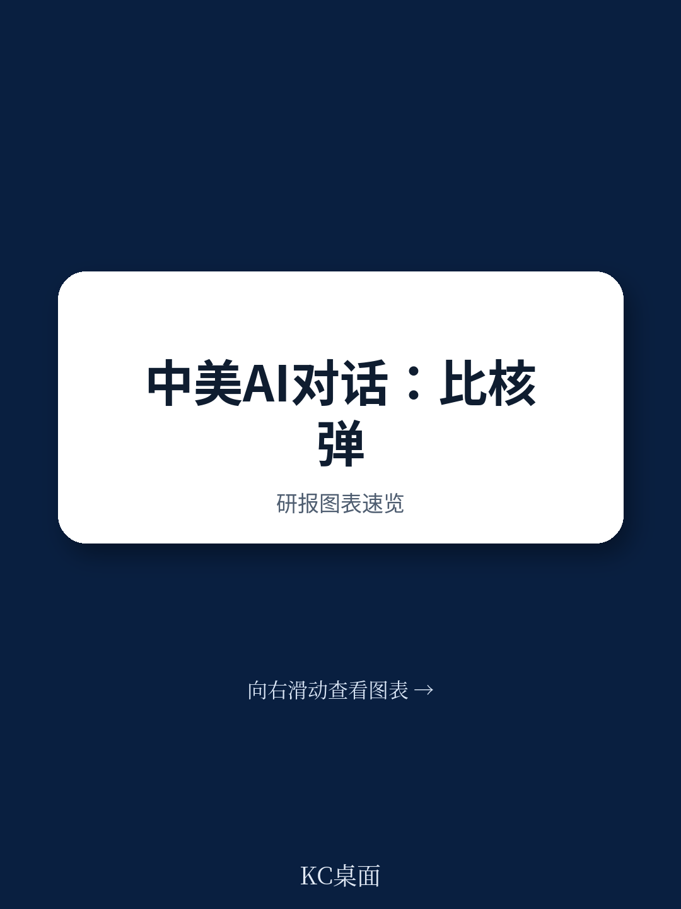

# 布鲁金斯学会：中美AI对话的真正价值不在信任，而在共同恐惧

特朗普与习近平在2025年宣布重启中美政府间AI对话，这本身就是一个信号。但真正值得关注的，不是对话重启这个动作，而是驱动这个动作的底层逻辑发生了变化。

过去七年主持中美AI二轨对话的布鲁金斯学会专家，在日内瓦联合国AI安全与伦理全球会议上给出了一个关键判断：中美之间在AI问题上能够坐下来谈，不是因为信任的修复，而是因为恐惧的趋同。这种恐惧并非泛泛的“技术失控”，而是指向两个具体领域——AI叠加网络攻击，以及AI叠加生物安全。这两条线索，正在成为两国技术安全议程上最有可能产生实际成果的突破口。

## 1. 这轮重启与拜登时期的失败形成鲜明对比，关键教训在于议程准备

拜登政府时期中美曾尝试过一次AI对话，结果并不理想。布鲁金斯学会专家在播客中将其描述为“shambolic”——外交上缺乏准备，双方带着完全不同的议程预期走进会议室。那次失败的直接后果是，对话不仅没有推进实质问题，反而加深了彼此的疑虑。

而这一次，两位领导人在北京会晤时公开宣布重启对话，并明确将其作为2025年华盛顿峰会的阶段性成果来预期。这意味着，这次对话不是试探性的，而是带有明确的成果导向。

这里的关键变量在于，双方是否吸取了上次失败的教训。布鲁金斯学会的专家明确指出：双方必须在进入会议室之前完成外交层面的“功课”，确保议程和预期已经对齐。这一点看似基础，但在中美关系当前的大背景下，实际操作难度远高于表面。

> **KC评论：** 拜登时期那次失败的对话，本质上反映了技术问题在外交议程中的“夹生”状态——技术团队和外交团队没有形成有效的协同。这次重启能否避免重蹈覆辙，取决于双方是否在桌下完成了真正的技术议题对齐。报告里对那次失败的描述值得细读，因为它揭示了技术外交的一个核心难点：技术议题的节奏和外交议程的节奏天然不同步。

## 2. 中美在AI安全上最大的共同点，是对非国家行为体的恐惧

播客中反复出现的一个核心判断是：中美两国在AI安全问题上最能达成共识的领域，并非对彼此行为的约束，而是对第三方——尤其是非国家行为体——的防范。

具体来说，两个领域被明确提及：AI与网络攻击的结合，以及AI与生物安全的结合。前者已经是当前国际安全讨论的热点，后者则是一个更敏感、更难以公开讨论的议题。

布鲁金斯学会专家指出，中方在私下交流中也明确表达了对AI赋能生物恐怖主义的担忧。这种担忧并非泛泛而谈，而是基于一个现实判断：AI的普及正在大幅降低生物武器设计和制造的门槛。过去需要国家级实验室和顶尖科学家才能完成的工作，未来可能被一个掌握AI工具的极端组织实现。

这种“共同脆弱性”的认知，是促成对话的真正动力。它不是基于信任，而是基于对失控的恐惧。

> **KC评论：** 这一点非常关键。传统安全对话的逻辑是“我约束自己，你也约束自己”，但AI安全对话的逻辑可能是“我们都无法完全控制第三方，所以我们需要合作防范”。这个框架的转变，意味着对话的产出形式也会不同——可能不是约束性的协议，而是共享预警机制、联合应急响应等技术性安排。报告中对这个框架的讨论，值得所有关注中美科技竞争的人仔细推敲。

## 3. 二轨对话的真正价值不是替代政府，而是为政府提供“可否认”的试错空间

对于二轨对话（Track II Dialogue）的价值，布鲁金斯学会专家给出了一个务实且有力的辩护。他指出，二轨对话的核心优势不在于它比政府更聪明，而在于它为政府提供了一个“可否认”的政策探索空间。

在二轨对话中，前官员和学者可以讨论那些政府层面过于敏感、或尚未形成共识的议题。这些讨论不产生约束性承诺，但可以形成“共同理解”或“政策选项菜单”。政府可以选择采纳，也可以选择完全无视。

这种机制在冷战时期的美国与苏联之间已被证明有效。在AI这个技术演进速度远超政策制定速度的领域，这种“预演”功能显得尤为重要。

> **KC评论：** “可否认性”这个词值得注意。在政治层面，这意味着二轨对话的参与者必须接受一个现实：他们的工作成果可能永远不会被公开承认。但对于真正关注政策实质的人来说，这恰恰是二轨对话的生命力所在——它不追求政治正确，只追求问题解决。报告里提到的一个细节很有意思：中方在二轨对话中曾表达过“技术发展速度连我们自己的政府都追不上”，这种坦诚在政府间对话中几乎不可能出现。

## 4. 全球AI治理的核心矛盾：多边机构的速度与多利益相关方模式的张力

播客后半部分将视角从双边扩展到了多边。在联合国日内瓦会议上，一个突出的声音是：许多国家希望建立一个类似国际原子能机构（IAEA）的全球AI治理机构。

这个想法在逻辑上很有吸引力：有一个专门的国际机构负责AI的安全监管、标准制定和危机响应。但布鲁金斯学会专家提出了一个尖锐的质疑：国际组织在应对速度上可能比国家政府更慢，而AI恰恰是一个需要快速响应的领域。

更深层的矛盾在于，AI的研发主体主要是私营企业，而非国家。这意味着，任何有效的全球AI治理框架，都必须将企业纳入其中。但传统的“政府间”模式（intergovernmental）恰恰排除了企业和公民社会的参与。而过去二十年互联网治理的经验表明，“多利益相关方模式”（multi-stakeholder model）在保持技术生态的开放性和创新活力方面发挥了关键作用。

这一矛盾目前尚未找到解决方案。布鲁金斯学会专家判断，短期内最现实的路径可能不是建立一个统一的全球AI治理机构，而是让现有的国际组织在各自擅长的领域发挥作用，同时保持双边对话的灵活性。

## 5. 报告尚未完全回答的关键问题：AI安全对话如何从“共识”走向“行动”

这份播客内容的价值在于，它揭示了中美AI对话正在从“要不要谈”进入“谈什么”的阶段。但它也留下了一个尚未回答的关键问题：这些对话如何转化为可执行、可验证的行动？

具体而言，有三个问题值得继续追问：

第一，AI赋能生物安全的防范，涉及高度敏感的技术细节和情报来源，双方是否愿意在政府间层面共享这些信息？

第二，AI与网络安全的结合，已经在实战层面出现（如AI辅助的网络攻击），双方是否有机制对“红线”进行明确定义？

第三，二轨对话的成果如何系统性地传递到政府决策层？目前看来，这仍然是一个黑箱。

这些问题没有在播客中得到充分回答，但它们恰恰是决定对话能否产生实际价值的关键。

## 6. 读者需要建立的观察框架：关注三个信号，而非一个声明

对于关注中美科技博弈的读者，这份报告提供了一个更有操作性的观察框架：不要只看对话是否重启、声明是否发表，而要关注三个具体的信号。

第一个信号：双方是否在AI与生物安全领域建立了某种形式的“热线”或紧急联络机制。这比任何联合声明都更能说明对话的实质深度。

第二个信号：双方是否开始在AI安全标准上寻求技术层面的对接，例如对AI模型的安全评估标准、对高风险应用的识别标准等。

第三个信号：双方是否在第三方使用AI工具进行恶意活动时，表现出某种程度的“信息共享”意愿。这将是检验“共同脆弱性”认知是否真正转变为行动的关键。

这三个信号，比任何官方表态都更能说明中美AI对话的真实状态。

---

这份布鲁金斯学会播客内容的价值，不在于它提供了多少新的数据或预测，而在于它提供了一个理解中美AI对话底层逻辑的框架：恐惧驱动的合作，比信任驱动的合作更脆弱，但也可能更务实。

对话已经重启，但真正的考验在于，双方能否从“共识”走向“行动”。这需要时间，也需要更多来自不同信源的交叉验证。

我们会在社群中持续跟踪中美AI对话的进展，包括后续的政府间会议议程、二轨对话的最新讨论议题，以及全球AI治理框架的演变。如果你对这个议题感兴趣，欢迎扫码加入，与来自头部券商、PE/VC、投行、并购、对冲基金、资管机构、战略咨询、智库等领域的同行一起交流，每日更新国际主流叙事与数据，观测边际变化。

Personal reading notes and learning share only. Not investment advice.

