# Frontier Markets

# Analyzing Drivers of Market Growth and Sovereign Risks

Younes Takki Chebihi, Naoya Kato, Maxwell Kushnir, Andreja Lenarčič, Yinhao Sun, and Bilal Tabti

WP/26/140

IMF Working Papers describe research in progress by the authors and are published to elicit comments and to encourage debate. The views expressed in IMF Working Papers are those of the authors and do not necessarily represent the views of the IMF, its Executive Board, or IMF management.

2026
JUL © 2026 International Monetary Fund

WP/26/140

IMF Working Paper
Strategy, Policy, and Review Department

Frontier Markets: Analyzing Drivers of Market Growth and Sovereign Risks\* Prepared by Younes Takki Chebihi, Naoya Kato, Maxwell Kushnir, Andreja Lenarčič, Yinhao Sun, and Bilal Tabti

Authorized for distribution by Pritha Mitra
July 2026

IMF Working Papers describe research in progress by the author(s) and are published to elicit comments and to encourage debate. The views expressed in IMF Working Papers are those of the author(s) and do not necessarily represent the views of the IMF, its Executive Board, or IMF management.

ABSTRACT: Frontier Market (FM) status serves as a steppingstone for Low-Income Countries (LICs) aspiring to become Emerging Markets (EMs). Since the concept first emerged over three decades ago, FMs have gained substantial investment appeal, particularly after the 2008 Global Financial Crisis. At the same time, the recent series of global shocks starting with the COVID-19 pandemic highlighted the countries' persistent vulnerabilities. This paper seeks to deepen our understanding of FMs by offering new analysis on the determinants of frontier market status and, using a dynamic country sample, examining the factors that help LICs attain and lose FM status. It finds that building robust macroeconomic fundamentals and ensuring good governance are critical for becoming an FM. In addition, the paper identifies flexible exchange rates, substantial official reserve buffers, and relatively low public debt and deficit levels as key contributors to lessening the sensitivity of FMs' sovereign spreads to changes in global financial conditions.

RECOMMENDED CITATION: Chebihi, Y.T., Kato, N., Kushnir, M., Lenarcic, A., Sun, Y., and Tabti, B. 2026. "Frontier Markets: Analyzing Drivers and Sovereign Risks". Working Paper WP/26/140. International Monetary Fund, Washington D.C.

<table><tr><td>JEL Classification Numbers:</td><td>E6, E44, F34, G12, G15, O11, O57</td></tr><tr><td>Keywords:</td><td>Frontier Markets; Sovereign Spreads; Market Access; U.S. Monetary Policy Spillovers</td></tr><tr><td>Author&#x27;s E-Mail Address:</td><td>youneschebihi@gmail.com, naoya.katou@boj.or.jp, mkushnir@imf.org, ALenarcic@imf.org, ysun5@imf.org, BTabti@imf.org</td></tr></table>

WORKING PAPERS

# Frontier Markets

# Analyzing Drivers of Market Growth and Sovereign Risks

Prepared by Younes Takki Chebihi, Naoya Kato, Maxwell Kushnir, Andreja Lenarcic, Yinhao Sun, and Bilal Tabti $^{1}$

## Contents

Introduction .... 3
Related Literature .... 4
Frontier Markets: Identification and Stylized Facts .... 5
Identifying Frontier Markets .... 5
Descriptive Analysis .... 8
Empirical Analysis .... 12
Factors Influencing the Transition to Frontier Market Status.... 12
The Sensitivity of FMs to US Monetary Policy Stance, Compared with NFLICs and EMs.... 15
Role of Structural Factors in Mitigating Exposure to US Monetary Policy .... 17
Robustness .... 20
Robustness of FM identification .... 20
Robustness Checks for Frontier Market Classification and Transition Determinants from NFLICs to FMs .... 20
Robustness Checks on FMs Spreads Sensitivity .... 20
Conclusion .... 21
Annex I. Additional Stylized Facts.... 22
Annex II. Robustness Checks .... 24
References .... 34

## FIGURES

1. Tracking the shifts in countries status: A heatmap view (1993-2022)....8
2. Dynamics of key variables: Comparison between NFLICs and FMs (1993-2022)....11
3. FMs spreads response to a U.S. monetary policy stance changes: A comparative analysis of regime switching with NFLICs and EMs....16
4. FMs spreads response to a U.S. monetary policy stance changes: The role of domestic financial buffers and macroeconomic fundamentals....16
5. FMs spreads response to a U.S. monetary policy stance changes: The role of external position structure...18
6. EMs spreads response to a U.S. monetary policy stance changes: The role of domestic financial buffers and macroeconomic fundamentals....19
7. EMs spreads response to a U.S. monetary policy stance changes: The role of external position structure...19

## TABLES

1. Description of FM identification criteria .... 7
2. Correlation matrix of the baseline FM identification and different definition criteria .... 7
3. Descriptive analysis .... 9
4. Factors driving the transition from NFLIC to FM status.... 14

## Introduction

Frontier market (FM) status is a steppingstone on the trajectory of Low-Income Countries (LICs) $^{2}$ graduating towards Emerging Market (EM) status. The concept of Frontier Markets was born three decades ago, $^{3}$ reflecting a need to better recognize the particular characteristics of advanced LICs that are more integrated into the global economic and financial system than their peers in the LIC universe. Being granted FM status signaled that countries are becoming an attractive destination for investment due to rapid growth and development, buttressed by significant exposure to international private capital flows in the form of FDI or portfolio flows. FMs were seen as beacons of optimism among LICs, and FM status as a milestone on the path to becoming an EM.

The number of countries considered to be FMs has been growing since the 1990s. This trend accelerated in the aftermath of the Global Financial Crisis (GFC), which saw increased investor interest in this subgroup of low-income developing countries (LIDCs). This growth in market interest paved the way for greater access and heightened external debt issuance, with 23 LIDCs tapping international financial markets between the GFC and 2022. Investment banks and corporations supported this new interest by launching indices like the J.P. Morgan NexGen, S&P Frontier BMI, and FTSE Frontier Index. Additionally, the inclusion of LICs since 2009 and investors' growing interest in these markets helped promote the J.P. Morgan EMBI Global Diversified Index.

More recently, these countries have been affected by a series of adverse global shocks that tested their resilience and affected their growth trajectories. These shocks started with the COVID-19 pandemic, which was succeeded by shocks on energy and food prices as a result of the Russia-Ukraine war, the tightening of global financial conditions in response to monetary policy tightening in advanced economy interest rates to support disinflation, and major shifts in external financing to LICs with declines in remittances and official development assistance (ODA) flows. As FMs saw their macroeconomic fundamentals deteriorate, they experienced capital outflows, currency depreciations, widening spreads and difficulties in issuing new bonds after the COVID-19. However, these pressures have somewhat unwound recently, with several FMs successfully regaining market access $^{4}$ in a context of overall better economic performance than less advanced LICs. Nevertheless, the exposure to sizeable adverse shocks has highlighted risks of FMs losing their frontier status, which motivates our paper's focus on FMs' economic characteristics and vulnerabilities and their implications for their FM status.

The analysis proceeds in three steps. First, we refine and extend the definition of what constitutes a FM that was initially developed in the 2014 report on Macroeconomic Developments in Low-Income Developing Countries ("2014 LIDC report" hereafter; IMF 2014) and create a time-varying sample of FMs. We then compare the macroeconomic and structural characteristics of FMs compared to non-frontier LICs (NFLICs) and EMs. Second, we examine the drivers of the transition from NFLICs to FMs and evaluate the relative importance of country specific fundamentals compared to global conditions in increasing the probability of attaining the FM status. Third, we estimate the sensitivity of FMs' sovereign spreads to changes in global financial conditions, captured by the shadow U.S. short term interest rate, and examine how their response is affected by countries' structural characteristics.

We find that the transition from NFLICs to FM essentially depends on fundamentals such as strong output growth and low public debt, as well as improvements in economic institutions and governance. Meanwhile, global push factors such as US monetary policy stance and stock market volatility seem to matter less for the transition from NFLIC to FM status. We also find that the response of FM sovereign spreads to changes in U.S. monetary policy does not differ to that observed for EMs, while no such sensitivity is observed for the spreads of NFLICs that are less integrated into global financial markets. A closer look at the role of countries' structural characteristics for the sensitivity of FMs' sovereign spreads to global financial conditions, proxied by U.S. monetary policy stance points to a positive impact of flexible exchange rates, large official reserves buffers, low deficits and public debt—consistent with findings of studies investigating the likelihood of financial crises in EMs.

## Related Literature

Our paper contributes to the broader literature on (i) market access and (ii) the propagation of shocks among Frontier and Emerging Markets. It does so by relying on a systematic approach to identify Frontier Market countries that reduces the role of judgment and subjective factors. In practice, the classification of countries as FMs, including for analytical work, typically occurs based on their inclusion in dedicated FM market indices (e.g., IMF, 2022) or a combination of market access and income criteria. Our identification method relies on financial variables beyond market access and is closely related to Abidi et al. (2016) who also use a time-varying version of the IMF (2014) classification. While the focus of their analysis is on capital flows dynamics, this study focuses on the determinants of the transition to FM status and the response of FMs to changes in the global financial conditions.

First, we contribute to the literature that assesses the relative importance of push (external shocks) and pull (macroeconomic fundamentals and other country-specific characteristics) factors in driving market access by looking at how these factors affect the transition to Frontier Market status, which is a broader concept than market access. We find that the transition to FM status is mainly driven by pull factors, consistent with findings from our identification methodology that FM status tends to be a persistent state. Our findings complement Presbitero et al. (2015), who find that countries with stronger fiscal and external positions and more robust institutions are more likely to access international markets, and Haque et al. (2017), who find that strong growth performance, quality of governance and favorable sovereign credit rating tends to increase LICs' likelihood to access international markets. $^{5}$ Da Silva et al. (2021) reach similar conclusions but also find a role for easing external financial conditions in determining increased external issuance and lower spreads. Kogan et al. (2024) find that global financial conditions and country debt ratios are the most important factors that determine market access during IMF programs, using a sample of 56 EMs and FMs. On the other hand, Feyen et al. (2015) show that global push factors mattered significantly for external bond issuance in EMs and LIDCs between 2000-2014. Recent analysis on LICs (IMF, 2025) shows however a distinct role for both push and pull factors: domestic pull factors matter more to attract longer-term FDI flows, while global push factors together with financial market development are more important determinants of portfolio flows.

Second, we contribute to the extensive literature studying the response of sovereign yields to economic shocks and global factors. This literature shows that (i) global factors, such as global liquidity and contagion among others have a crucial role in driving the dynamics of sovereign yields in EMs (González-Rozada and Yeyati (2008), Agur et al. (2019)), and that (ii) there is a positive link between changes in U.S. monetary policy and EMs sovereign yields through a capital flow channel (Ahmed and Zlate, 2014; Broner et al., 2021; Bhattarai et al., 2021; Albagli et al., 2019; Gilchrist et al., 2019). Comelli et al. (2012) find that periods of high global uncertainty are characterized by a dampened response of spreads to domestic fundamentals. We find that the response of FMs' yields to US monetary policy stance does not differ from that of EMs, $^{6}$ which contrasts with the prevailing perception of higher vulnerability of this group of countries compared to EMs. We also find that strong fiscal and external buffers as well as a diversified export structure help dampen the rise of sovereign spreads for FMs following a US monetary policy tightening. Our analysis highlights the importance for policymakers in LICs to improve macroeconomic fundamentals to reach FM status and to keep strong fiscal and external buffers to dampen the costs of external macroeconomic fluctuations.

The rest of the paper is organized as follows. Section II introduces the methodology to identify Frontier Markets and presents descriptive statistics, comparing FMs to non-FM LICs and EMs. Section III presents empirical analysis to (i) identify determinants of FM status and (ii) analyze the sensitivity of their spreads to changes in global financial conditions. Section IV discusses robustness checks. Section V concludes.

## Frontier Markets: Identification and Stylized Facts

## Identifying Frontier Markets

This section exploits time series variation in macroeconomic and financial indicators to identify FMs over time and compare them with NFLICs and EMs. There is no universally agreed-upon definition of what constitutes an FM, despite many efforts to define this concept.

Credit rating agencies (CRA) and financial institutions have attempted to identify FMs in efforts to compile investment indices targeting this market segment. As the primary purpose of these indices is to provide information to investors, indices developed by these entities (e.g., JP Morgan EMBIG, S&P Frontier BMI, and MSCI Frontier Markets Index) rely on classification based on financial depth, and encompass elements such as market size, liquidity, and market regulation and structure. While their classification is widely used for economic monitoring, using these indices to identify FMs for investigating their fundamental characteristics could be problematic due to a lack of transparency in the underlying methodologies and use of judgment. Using these indices to track FMs over time prior to the early 2000s presents additional challenges, owing to data availability constraints.

Apart from CRA-based definitions, other definitions often rely on the concept of market access. Da Silva et al. (2021) propose a rule to distinguish FMs from other low-income countries using two criteria, one of which includes at least one public and publicly guaranteed (PPG) external bond issuance between 1990 to 2019. $^{7}$ One drawback of this definition is that it does not vary in time and does not account for changes in PPG bond issuance over time. An additional risk includes inaccurately identifying countries as FMs based on a one-off debt issuance.

On the other hand, the 2014 LIDC report (IMF, 2014) uses a more granular and data-oriented definition that is based on five indicators. The definition captures a country's financial system's depth (broad money-to-GDP ratio, stock market capitalization), its openness (cross-border loans and deposits, portfolio inflows), and its capacity to issue in international markets (see Table 1). A key point of this definition is that it exclusively relies on financial variables and does not cover macroeconomic fundamentals. To identify FMs, the values of these variables for each LIDC country are compared to those from the sample of EMs, according to a methodology that is described below.

Our paper aims to build on the 2014 LIDC methodology, while incorporating additional sources of data, to construct an annual time series of FMs.

Given differences in the definition and coverage of “low-income countries” across the literature, this study adopts a broad initial sample when identifying FMs with a quantitative methodology, so as to minimize the risk of omission. The sample is based on the 2023 vintage of PRGT-eligible countries, $^{8}$ supplemented by additional countries that have a been part of the LIDC classification in the past or have potential to be identified as FMs due to their inclusion in FM financial indices. $^{9}$ The final sample comprises 87 countries. For each country in the sample, we then compare the average value of several financial indicators (described in Table 1) over a three-year rolling window $^{10}$ to the value of the same indicator for countries labeled as EMs in the WEO classification for those years. A country in our sample is classified as a FM if it meets at least 4 out of the 5 criteria each year (considering the rolling window). For four indicators, (i) the ratio of broad money to GDP, (ii) cross-border loans and deposits, (iii) stock market capitalization and (iv) portfolio inflows, the criterion associated with that indicator is considered met if the three-year average surpasses the lower end of the one-standard-deviation band of the three-year average of the EMs. The fifth criterion, sovereign bond issuance, is considered met if a country issued external bonds in the current and past two years or has a credit rating above BB-.

Frontier Market status is assigned to 369 observations, corresponding to roughly 14.13% of the sample (1,921 observations categorized as NFLICs and 320 EMs). Market capitalization and market access appear to be key drivers of the FM classification, as illustrated in Table 2, which shows a correlation matrix between the FM indicator and its five determinants.

Table 1. Description of FM identification criteria $^{11}$

<table><tr><td>Criterion</td><td>Definition</td><td>Data source</td><td>Dummy construction</td></tr><tr><td>Broad Money - M2/GDP (%GDP)</td><td>Sum of money and quasi-money</td><td>WEO</td><td rowspan="4">A criterion is considered met for a country if its 3-year average exceeds the lower end of the one standard deviation band of the 3-year average of the EMs</td></tr><tr><td>Cross border loans and deposits</td><td>External loans and deposits of banks vis a vis all sector</td><td>BIS</td></tr><tr><td>Stock Market Capitalization (%GDP) or Being included in one of the FM market index-based</td><td>Market capitalization of listed domestic companies (current US$)</td><td>Bloomberg</td></tr><tr><td>Portfolio inflows (%GDP)</td><td>Cross-border flows involving equity or debt securities,</td><td>WEO</td></tr><tr><td>Sovereign bond issuance</td><td>Bond issuance or potential to issue based on the credit-rating</td><td>Fitch, Standard and Poor&#x27;s/ Bond radar</td><td>The criterion is considered met if a country issue public and publicly guaranteed (PPG) external bonds or has a credit rating similar to countries that issued external bonds (BB-).</td></tr></table>

Table 2. Correlation matrix of the baseline FM identification and different definition criteria

<table><tr><td></td><td>FM</td><td>Market Access</td><td>Issuance</td><td>Rating</td><td>Broad Money</td><td>Cross Borders</td><td>Market Capitalization</td><td>Portfolio Flows</td></tr><tr><td>FM</td><td>1</td><td></td><td></td><td></td><td></td><td></td><td></td><td></td></tr><tr><td>Market Access including:</td><td>0.52</td><td>1</td><td></td><td></td><td></td><td></td><td></td><td></td></tr><tr><td>Issuance</td><td>0.4</td><td>0.85</td><td>1</td><td></td><td></td><td></td><td></td><td></td></tr><tr><td>Rating</td><td>0.34</td><td>0.72</td><td>0.44</td><td>1</td><td></td><td></td><td></td><td></td></tr><tr><td>Broad Money</td><td>0.17</td><td>0.23</td><td>0.18</td><td>0.22</td><td>1</td><td></td><td></td><td></td></tr><tr><td>Cross Borders</td><td>0.13</td><td>0.17</td><td>0.14</td><td>0.13</td><td>0.12</td><td>1</td><td></td><td></td></tr><tr><td>Market Capitalization</td><td>0.47</td><td>0.59</td><td>0.56</td><td>0.48</td><td>0.12</td><td>0.12</td><td>1</td><td></td></tr><tr><td>Portfolio Flows</td><td>0.14</td><td>0.07</td><td>0.03</td><td>0.13</td><td>0.1</td><td>0.36</td><td>0.18</td><td>1</td></tr></table>

Figure 1 shows the dynamics of FMs status over time for a sample of countries that changed status between 1993 and 2022. This figure shows that several countries have transitioned to FM status in the aftermath of the GFC, a period characterized by accommodative monetary policies in advanced economies (AEs), which eased global liquidity conditions. For instance, countries such as Honduras and Ethiopia achieved FM status in 2013 and 2014, respectively, following their foray into the international debt market. On the other hand, countries with above-average income levels but poor market access are not classified as FMs. There have also been several instances of countries downgrading from FM to LIC. In addition, the chart suggests that the duration of the FM status does not seem related to a subsequent transition to EM. Section V considers two alternative FM identification methodologies to assess the robustness of our findings.

Figure 1. Tracking the shifts in countries status: A heatmap view (1993-2022)  
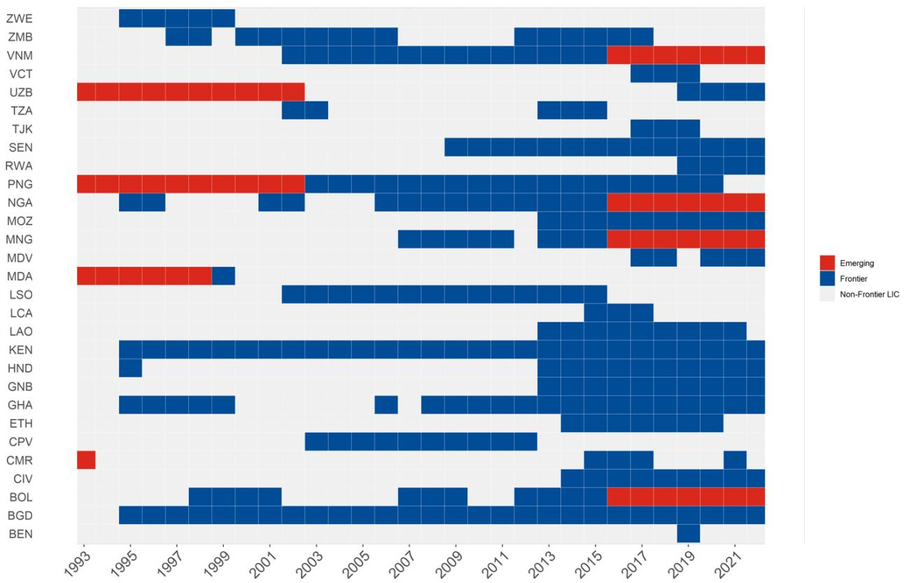  
Note: Only showing countries that change status.

Our methodology for identifying FMs is based on the 2014 LIDC report (IMF, 2014). However, our results somewhat differ from that report due to different time coverage. For 2014, 13 out of the 14 FMs identified in the LIDC report are also classified as FMs in this paper, with Côte d'Ivoire being the exception. Conversely, Honduras, Lao PDR, Ethiopia, Guinea-Bissau, Lesotho, and Georgia are identified as FMs in this paper but were not recognized as such in the 2014 LIDC report. Another key distinction is that the LIDC report does not update the FM list beyond 2014, whereas this paper introduces a dynamic list that evolves over time.

## Descriptive Analysis

Table 3 presents descriptive statistics of macroeconomic and governance characteristics of NFLICs, EMs, and FMs. This static view highlights three distinctive features of FMs.

\- FMs display robust macroeconomic fundamentals, illustrated by higher growth rates, low public debt, and low inflation, compared to NFLICs and EMs.

\- FMs are also characterized by larger fiscal deficits than NFLICs and EMs, and higher FDI inflows, developments supporting aggregate demand.

\- FMs display improved governance metrics (WGI) in comparison to NFLICs, particularly in terms of government effectiveness and regulatory quality, while there seem to be no differences in political stability and control of corruption across FMs and NFLICs.

Table 3. Descriptive analysis

<table><tr><td rowspan="2"></td><td rowspan="2">NFLICs</td><td rowspan="2">FMs</td><td rowspan="2">EMs</td><td rowspan="2">AEs</td><td colspan="2">Test of Means Equality</td></tr><tr><td>FMs&gt; NFLICs</td><td>FMs&lt; NFLICs</td></tr><tr><td>Output Growth</td><td>3.55(5.69)</td><td>5.35(4.69)</td><td>3.14(6.29)</td><td>2.45(3.24)</td><td>***</td><td></td></tr><tr><td>FDI flows (%GDP)</td><td>3.21(4.82)</td><td>3.76(5.55)</td><td>3.28(8.23)</td><td>0.55(20.95)</td><td>**</td><td></td></tr><tr><td>Fiscal Balance (%GDP)</td><td>-2.43(7.55)</td><td>-3.27(4.35)</td><td>-2.03(6.54)</td><td>-1.97(4.54)</td><td></td><td>***</td></tr><tr><td>Current Account (%GDP)</td><td>-4.34(18.55)</td><td>-4.18(10.2)</td><td>-1.38(9.86)</td><td>1.56(5.97)</td><td></td><td></td></tr><tr><td>Reserves (months of import)</td><td>4.21(3.24)</td><td>4.66(2.99)</td><td>6.12(5.18)</td><td>3.82(4.48)</td><td>***</td><td></td></tr><tr><td>Gov Debt (%GDP)</td><td>59.85(55.83)</td><td>51.58(29.09)</td><td>49.22(35.07)</td><td>67.69(41.1)</td><td></td><td>***</td></tr><tr><td>Inflation $^{12}$ </td><td>40.41(596.4)</td><td>7.25(6.97)</td><td>62.39(1445.94)</td><td>2.23(2.56)</td><td></td><td>***</td></tr><tr><td>WGI index average</td><td>0.38(0.14)</td><td>0.4(0.08)</td><td>0.5(0.13)</td><td>0.77(0.08)</td><td>***</td><td></td></tr><tr><td>Political Stability</td><td>0.49(0.18)</td><td>0.48(0.13)</td><td>0.56(0.15)</td><td>0.72(0.09)</td><td></td><td>*</td></tr><tr><td>Government Effectiveness</td><td>0.34(0.13)</td><td>0.4(0.08)</td><td>0.49(0.13)</td><td>0.79(0.09)</td><td>***</td><td></td></tr><tr><td>Regulatory Quality</td><td>0.35(0.12)</td><td>0.41(0.08)</td><td>0.5(0.15)</td><td>0.78(0.08)</td><td>***</td><td></td></tr><tr><td>Rule of Law</td><td>0.38(0.15)</td><td>0.41(0.09)</td><td>0.48(0.14)</td><td>0.79(0.09)</td><td>***</td><td></td></tr><tr><td>Control of Corruption</td><td>0.37(0.13)</td><td>0.38(0.11)</td><td>0.47(0.14)</td><td>0.79(0.14)</td><td></td><td></td></tr><tr><td>Voice and Accountability</td><td>0.4(0.17)</td><td>0.43(0.13)</td><td>0.47(0.17)</td><td>0.74(0.08)</td><td>***</td><td></td></tr><tr><td>Observations</td><td>1921</td><td>369</td><td>2314</td><td>941</td><td></td><td></td></tr></table>

Figure 2 shows a comparison between FM and NFLIC over time between 1993 and 2022: The left panel displays time-series of key variables across groups over time, while the right-hand panel presents the dynamics of these variables around the year of transition for countries that upgraded from NFLIC to the FM status. $^{13}$ This dynamic view reveals that FMs show stronger macroeconomic fundamentals, and display an improvement in the key indicators (particularly output growth) before transitioning to the FM group. Nonetheless, this figure also shows that output growth among FMs is subject to higher volatility, with more pronounced downturns observed following the GFC and the COVID-19 pandemic, hinting at a source of vulnerability potentially driven by a higher exposure to global shocks.

Figure 2 also reveals that the higher attractiveness of FMs as a destination for foreign investments is driven by post-2013 years, coinciding with higher yields in EMDEs and substantial Official Development Assistance flows from China attracting foreign investment in the context of low interest rates in AEs. The time-series also shows that FMs started running higher deficits after 2009, and higher indebtedness after 2015. Specifically, we can observe that budget deficits widened after the transition to FM status, by contrast to improving dynamics seen before the transition, eventually leading to a rise in public debt after transitioning to FM status. Shrinking deficits ahead of transition could be explained by a larger interest from international investors in countries that are fiscally more prudent. However, easier access to external financing after the transition could lead to wider deficits. Regarding governance, FMs have also consistently overperformed NFLICs during the period.

Overall, descriptive statistics indicate that FMs typically exhibit stronger economic performance and governance than NFLICs, with noticeable gains leading up to their transition.

Figure 2. Dynamics of key variables: Comparison between NFLICs and FMs (1993-2022)  
Cross-Group Comparison Dynamics Surrounding Transition to FM Status (in years)
OUTPUT GROWTH  
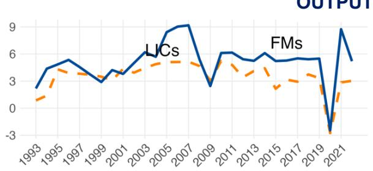

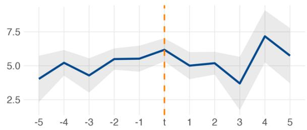

FDI FLOWS (% GDP)  
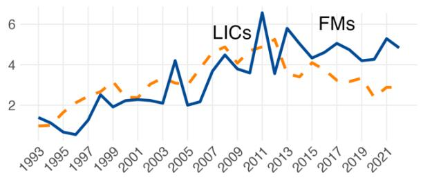

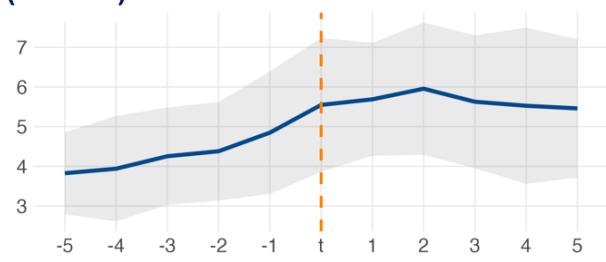

BUDGET BALANCE (%GDP)  
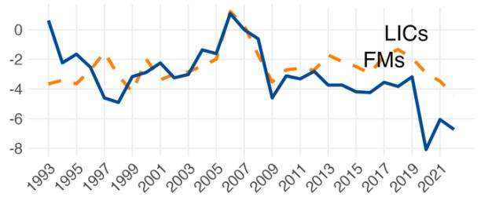

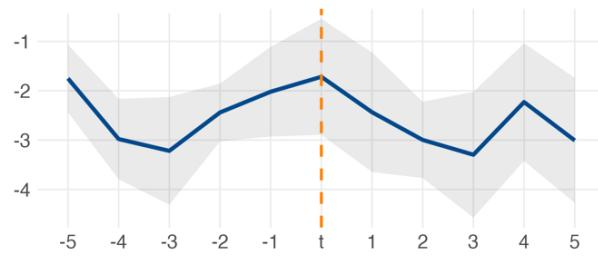

GOVERNMENT DEBT (%GDP)  
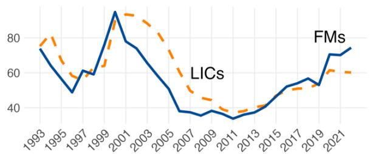

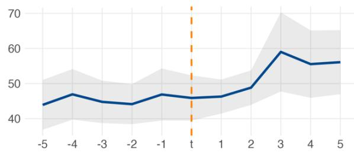

WORLD GOVERNANCE INDEX (WGI) AVERAGE  
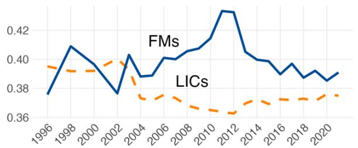

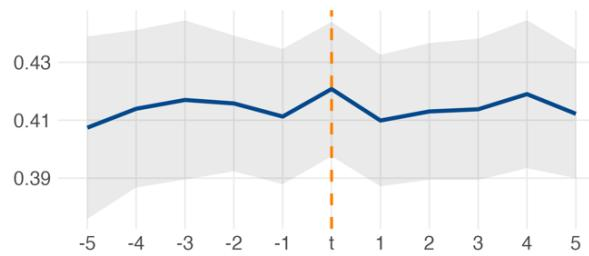

## Empirical Analysis

In this section, we first exploit time-series variation in global factors and differences in macroeconomic fundamentals across countries to determine which factors drive the transition from NFLIC to FM status. We then aim to evaluate the risks tied to accessing global sovereign bond markets for FMs with local projections showing how global shocks affect sovereign spreads in these economies. Finally, we assess the role of structural factors in reducing the sensitivity of spreads to global financial conditions, proxied by changes in US monetary policy stance.

## Factors Influencing the Transition to Frontier Market Status

We start the analysis by investigating whether country-specific economic fundamentals help predict the transition of NFLICs to FM status, building on the literature studying global (push) and county-specific (pull) factors driving capital flows (see Calvo et al., 1996, Fernandez-Arias and Montiel, 1996, Chuhan, et al., 1998). To examine the drivers of transition to FM status and assess the relative importance of push and pull factors, we restrict the sample to countries that were NFLICs at time t-1, and estimate the following specification:

$$
\begin{array}{r} P r \left(F M _ {i, t} = 1 | F M _ {i, t - 1} = 0\right) = M a c r o f u n d a m e n t a l s _ {i, t - 1} ^ {T} \beta_ {1} + G o v e r n a n c e _ {i, t - 1} ^ {T} \beta_ {2} + I M F _ {P r o g r a m s} ^ {T} _ {i, t - 1} \beta_ {3} + \\ P u s h _ {i, t - 1} ^ {T} \beta_ {4} + \epsilon_ {i t} (2) \end{array}
$$

The dependent variable $Pr\left(FM_{i,t}=1|FM_{i,t-1}=0\right)$ takes a value of 1 if country i is identified as FM in year t. $^{14}$

We include three sets of country-specific pull factors. First, we control for standard macroeconomic fundamentals identified by the push-pull literature in the vector $Macrofundamentals_{i,t-1}^{T}$ , including one-year lagged values of output growth, FDI as a percentage of GDP, the fiscal balance as a percentage of GDP, the current account balance as a percentage of GDP, official reserves in months of imports, government debt as a percentage of GDP, and inflation. Second, government effectiveness from the Worldwide Governance Indicators database ( $Governance_{i,t-1}^{T}$ ) is also included, as better governance is expected to foster investors' confidence. Third, we seek to examine whether financial assistance to LICs by the IMF acts as a catalyst to achieve FM status. $IMF\_Programs_{i,t-1}^{T}$ includes two dummy variables: one indicating whether a country was under a General Resources Account (GRA) program, and the other indicating whether a country was under a Poverty Reduction and Growth Trust (PRGT) program $^{15}$ .

Global factors in $Push_{i,t-1}^{T}$ include the VIX and the Krippner Shadow US rate $^{16}$ to capture broader monetary easing and tightening situations than changes in nominal short-term interest rates.

The specification above is estimated using linear and binary dependent variable regressions, using an annual unbalanced panel comprising 87 LICs (including FMs) between 1993 and 2022. Table 4 shows marginal effects of the potential drivers of the transition for different regression specifications. $^{17}$

Table 4 suggests that stronger output growth dynamics, lower government debt and improved governance effectiveness increase the probability of transition to FM status. Coefficients associated with the presence of a GRA program are positive but not statistically significant. Better governance effectiveness seems to serve as a more efficient signaling device than other drivers of governance, as shown by Appendix Table 5, where alternative governance measures (such as the average WGI governance index, other WGI subindices, and the CPIA average index) are not associated with a significant difference in the probability to transition to FM status, except for regulatory quality. Lastly, the analysis does not establish a definitive connection between push factors and the transition to the FM status.

Table 4. Factors driving the transition from NFLIC to FM status

<table><tr><td rowspan="2"></td><td colspan="7">Dependent variable: Probability of transition to the Frontier Market Status</td></tr><tr><td>(1)</td><td>(2)</td><td>(3)</td><td>(4)</td><td>(5)</td><td>(6)</td><td>(7)</td></tr><tr><td>Output Growth</td><td>0.003***(0.001)</td><td>0.002**(0.001)</td><td>0.004**(0.002)</td><td>0.004*(0.002)</td><td>0.0004(0.001)</td><td>0.002(0.001)</td><td>0.003(0.002)</td></tr><tr><td>FDI</td><td>0.002(0.002)</td><td>0.002(0.002)</td><td>0.001(0.001)</td><td>0.001(0.001)</td><td>0.004*(0.002)</td><td>0.005*(0.003)</td><td>0.001(0.001)</td></tr><tr><td>Fiscal Balance</td><td>-0.001(0.0005)</td><td>-0.001(0.0004)</td><td>-0.001(0.001)</td><td>-0.001(0.001)</td><td>0.00001(0.0005)</td><td>-0.0003(0.001)</td><td>-0.001(0.001)</td></tr><tr><td>Current Account</td><td>-0.0002(0.0001)</td><td>-0.0001(0.0001)</td><td>-0.0002(0.0003)</td><td>-0.0002(0.0003)</td><td>-0.0001(0.0001)</td><td>-0.0002(0.0001)</td><td>-0.0002(0.0003)</td></tr><tr><td>Reserves</td><td>0.002(0.003)</td><td>0.0004(0.003)</td><td>0.001(0.002)</td><td>0.0004(0.002)</td><td>0.002(0.003)</td><td>0.002(0.004)</td><td>0.001(0.002)</td></tr><tr><td>Government Debt</td><td>-0.0001*(0.0001)</td><td>-0.0001*(0.0001)</td><td>-0.0005*(0.0003)</td><td>-0.0004(0.0003)</td><td>0.00003(0.0001)</td><td>-0.0001(0.0001)</td><td>-0.0004(0.0003)</td></tr><tr><td>Inflation</td><td>0.0002(0.0002)</td><td>0.0002(0.0001)</td><td>0.0002(0.0005)</td><td>0.0001(0.001)</td><td>0.0001(0.0001)</td><td>0.0002(0.0001)</td><td>0.0001(0.001)</td></tr><tr><td>Gov. Effectiveness</td><td>0.096*(0.052)</td><td>0.108**(0.051)</td><td>0.159***(0.062)</td><td>0.167***(0.063)</td><td>0.066(0.122)</td><td>0.146*(0.086)</td><td>0.149*(0.082)</td></tr><tr><td>PRGT program</td><td>-0.008(0.013)</td><td>-0.006(0.013)</td><td>0.0001(0.012)</td><td>0.002(0.012)</td><td>-0.019(0.018)</td><td>-0.019(0.017)</td><td>-0.005(0.010)</td></tr><tr><td>GRA program</td><td>0.076(0.055)</td><td>0.077(0.055)</td><td>0.033*(0.019)</td><td>0.033*(0.019)</td><td>-0.046(0.045)</td><td>0.056(0.062)</td><td>0.020(0.019)</td></tr><tr><td>Income per capita</td><td></td><td>0.000(0.000)</td><td></td><td>0.000(0.000)</td><td></td><td></td><td></td></tr><tr><td>VIX</td><td>-0.001(0.001)</td><td>-0.001(0.001)</td><td>-0.001(0.001)</td><td>-0.001(0.001)</td><td>-0.001**(0.001)</td><td>-0.001*(0.001)</td><td>-0.001(0.001)</td></tr><tr><td>Shadow rate</td><td>-0.002(0.003)</td><td>-0.002(0.003)</td><td>-0.002(0.002)</td><td>-0.002(0.002)</td><td>-0.006**(0.003)</td><td>-0.004(0.003)</td><td>-0.002(0.002)</td></tr><tr><td>Constant</td><td>-0.008(0.025)</td><td>-0.011(0.025)</td><td></td><td></td><td></td><td>-0.004(0.033)</td><td></td></tr><tr><td>Observations</td><td>930</td><td>929</td><td>930</td><td>929</td><td>930</td><td>930</td><td>930</td></tr><tr><td>Pooling</td><td>Yes</td><td>Yes</td><td>Yes</td><td>Yes</td><td>No</td><td>No</td><td>No</td></tr><tr><td>Country FE</td><td>No</td><td>No</td><td>No</td><td>No</td><td>Yes</td><td>No</td><td>No</td></tr><tr><td>Country RE</td><td>No</td><td>No</td><td>No</td><td>No</td><td>No</td><td>Yes</td><td>Yes</td></tr><tr><td>Linear/Probit</td><td>Linear</td><td>Linear</td><td>Probit</td><td>Probit</td><td>Linear</td><td>Linear</td><td>Probit</td></tr></table>

\*p<0.1; \*\*p<0.05; \*\*\*p<0.01  
Note: The table reports the estimated coefficients and the associated robust standard errors. The parameters from the Probit estimations in columns (3), (4) and (7), are presented as average marginal effects.

## The Sensitivity of FMs to US Monetary Policy Stance, Compared with NFLICs and EMs

The sensitivity of FMs' sovereign bond spreads to global financing conditions, proxied by U.S. monetary policy stance, is assessed using a local projections approach (Jorda, 2005). Our analysis focuses on countries which have switched into or out of FM status and compares their impulse responses to other NFLICs and EMs, using the following regression specification:

$$
\begin{array}{r l r} & & {y _ {i, t + h} - y _ {i, t - 1} = \mathbb {1} _ {\{\boldsymbol {F M} \}} \big [ \beta_ {A, h} s h o c k _ {t} + \gamma_ {A, h} \Delta y _ {t - 1} + \rho_ {A, h} v i x _ {t} + \sum_ {k = 1} ^ {K} \beta_ {A, h} ^ {k} z _ {A, i, t - 1} ^ {k} \big ] +} \\ & & {\mathbb {1} _ {\{\boldsymbol {N F L I C} \}} \big [ \beta_ {B, h} s h o c k _ {t} + \gamma_ {B, h} \Delta y _ {t - 1} + \rho_ {B, h} v i x _ {t} + \sum_ {k = 1} ^ {K} \beta_ {B, h} ^ {k} z _ {B, i, t - 1} ^ {k} \big ] +} \\ & & {\mathbb {1} _ {\{\boldsymbol {E M} \}} \big [ \beta_ {C, h} s h o c k _ {t} + \gamma_ {C, h} \Delta y _ {t - 1} + \rho_ {C, h} v i x _ {t} + \sum_ {k = 1} ^ {K} \beta_ {C, h} ^ {k} z _ {C, i, t - 1} ^ {k} \big ]} \\ & & {\quad + \alpha_ {i} + \varepsilon_ {i t}} \end{array}\tag{3}
$$

where, $shock_{t} = \Delta ShadowRate_{t}$

$y_{i,t}$ represents the sovereign yields spreads. $^{18}$ . $shock_{t}$ represents changes in the U.S. Krippner shadow rate to capture both conventional and unconventional monetary policy. To capture other global factors, we account for risk-aversion through the VIX index, and control for country-specific factors in $z_{i,t-1}^{k}$ by accounting for output growth, fiscal balance, and government debt in the estimation, in addition to country fixed-effects. The specification also controls for past variation in spreads to address serial correlation of the error term. Our sample covers 76 countries, with quarterly observations between 2012 Q2 and 2022 Q4, except for macroeconomic fundamentals in $z_{i,t-1}^{k}$ that are observed at annual frequency.

Figure 3 presents cumulative impulse response functions (IRFs) of sovereign spreads following a change in U.S. monetary policy stance based on the specification of equation 3. The left-hand chart depicts IRFs for FMs and NFLICs, while the right-hand chart shows the impulse response of FMs compared to EMs. Figure 3 shows that sovereign spreads in FMs and EMs are similarly sensitive to U.S. monetary policy stance changes and react positively afterwards, consistent with the capital flow channel (Ahmed and Zlate, 2014; Broner et al., 2021), whereby lower interest rates in AEs due to expansionary monetary policies drive global investors to seek higher yields in EMs, resulting in considerable inflows to these economies increasing demand for local bonds and lowering their yields. $^{19}$ In addition, the difference in IRFs is small between FMs and EMs in our sample, suggesting that the response to market disruptions does not significantly differ between FMs and EMs given that they both have market access. By contrast, the response of NFLICs is not statistically significant, reflecting both higher average risk premia and more heterogeneity across the sample.

Note: Shaded area represents 90% confidence.

Figure 3. FMs spreads response to a U.S. monetary policy stance changes: A comparative analysis of regime switching with NFLICs and EMs

FRONTIER MARKETS vs LOW INCOME COUNTRIES
FM REGIME (SOLID BLUE) - LIC REGIME (DASHED RED)

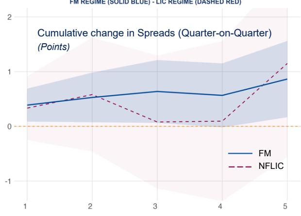  
Note: Shaded area represents 90% confidence.  
FRONTIER MARKETS vs EMERGING MARKETS
FM REGIME (SOLID BLUE) - EM REGIME (DASHED RED)

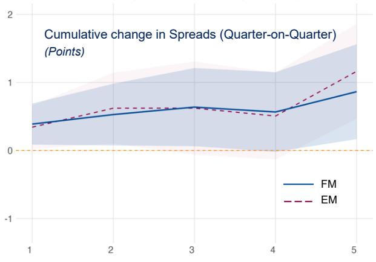

Figure 4. FMs Spreads response to a U.S. monetary policy stance changes: The role of domestic financial buffers and macroeconomic fundamentals

FLOATING vs NON-FLOATING EXCHANGE RATE REGIME
FLOATING EXR REGIME (SOLID BLUE) - NON-FLOATING EXR REGIME (DASHED RED)

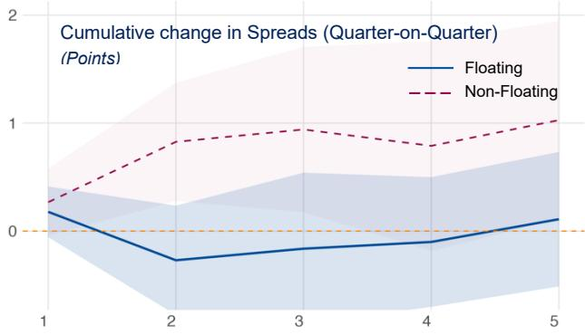  
HIGH OFFICIAL RESERVES vs LOW OFFICIAL RESERVES
LARGER RESERVES (SOLID BLUE) - LOWER RESERVES (DASHED RED)

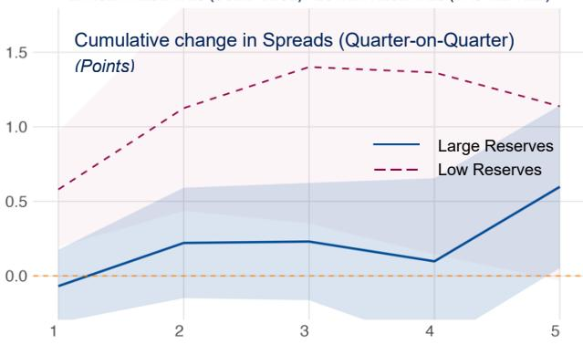  
LOW PUBLIC DEBT RATIO vs HIGH PUBLIC DEBT RATIO
LOW PUBLIC DEBT (SOLID BLUE) - HIGH PUBLIC DEBT (DASHED RED)

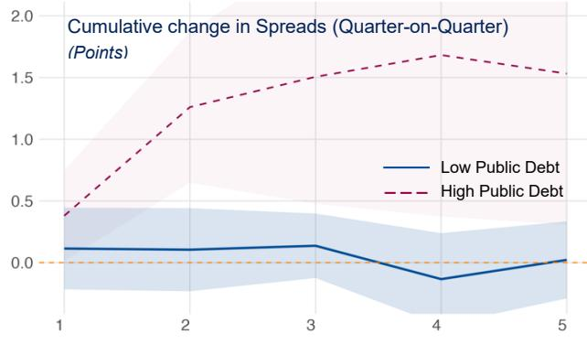  
HIGH FISCAL BALANCE vs. LOW FISCAL BALANCE
LARGER BALANCE (SOLID BLUE) - LOWER BALANCE (DASHED RED)

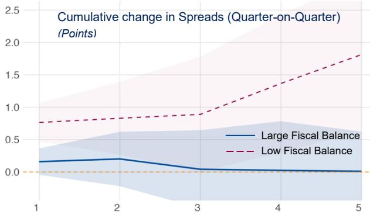

## Role of Structural Factors in Mitigating Exposure to US Monetary Policy

Restricting our analysis to FMs, we now estimate whether country-specific structural characteristics affect the sensitivity of spreads to global financial conditions proxied by changes in U.S. monetary policy stance, as follows:

$$
\begin{array}{r l r} & & {y _ {i, t + h} - y _ {i, t - 1} = \textbf {\textit {d}} _ {i, t - \mathbf {1}} \Bigg [ \beta_ {A, h} s h o c k _ {t} + \gamma_ {A, h} \Delta y _ {t - 1} + \rho_ {A, h} v i x _ {t} + \sum_ {k = 1} ^ {K} \beta_ {A, h} ^ {k} z _ {A, i, t - 1} ^ {k} \Bigg ] +} \\ & & {\left(\mathbf {1} - \boldsymbol {d} _ {i, t - \mathbf {1}}\right) \Bigg [ \beta_ {B, h} s h o c k _ {t} + \gamma_ {B, h} \Delta y _ {t - 1} + \rho_ {B, h} v i x _ {t} + \sum_ {k = 1} ^ {K} \beta_ {B, h} ^ {k} z _ {B, i, t - 1} ^ {k} \Bigg ] +} \\ & & {\alpha_ {i} + \varepsilon_ {i t}} \end{array}\tag{4}
$$

We consider two sets of structural characteristics to classify countries: (i) macroeconomic fundamentals and financial buffers (exchange rate regime, official reserves level, public indebtedness level and fiscal balance), and (ii) the export structure (oil export status, diversification of exports $^{20}$ ). In the above equation, $d_{i,t-1}$ is a dummy variable splitting countries according to two regimes. When considering the exchange rate classification, $d_{i,t-1}$ equals 1 when the country has had a floating regime in the previous period, and when considering oil export status, it equals 1 for oil and gas exporters. Otherwise, the dummy variable, $d_{i,t-1}$ equals 1 for countries above the median of the characteristics' distribution. We further assess whether structural characteristics in EMs differ from FMs in mitigating the spillovers of U.S. monetary policy stance changes on local sovereign spreads (Figure 6 and 7).

Figure 4 highlights that the response of FMs spreads to US monetary policy stance changes depends on their ability to smooth economic fluctuations. Specifically, having a floating exchange rate, larger reserves buffers, lower public indebtedness, and a smaller fiscal deficit is associated with a more muted response of sovereign spreads to U.S. monetary policy changes. Countries' export structure also plays a role. Similarly, Figure 5 shows that having a more diversified export structure is associated with a dampened impact from U.S. monetary policy fluctuations.

Impulse responses shown in Figure 4 are consistent with the shock-absorbing function of floating exchange rates, lowering the sensitivity of local spreads to shifts in U.S. rates via the capital flows channel $^{21}$ . We also find that the sensitivity of local spreads is near zero when official reserves are high, while low FX reserves diminish confidence in the ability to absorb shocks, which is reflected in a positive and significant impulse response, consistent with earlier findings (Aizenman, 2023). Further, higher fiscal space offered by low public indebtedness and a stronger fiscal balance help in managing external shocks, allowing governments to shield local financial markets from global interest rate fluctuations. The results show that the response of FMs spreads is more muted when public debt low, whereas it is larger and statistically significant when debt is high.

Finally, greater exports diversification could cushion against trade fluctuations arising from changes in U.S. monetary policy, as shown by Figure 5. Results show that spreads also tend to react less for oil exporters compared to oil importers, except in the initial quarter where the response is similar across both groups. The resilience of spreads in oil exporting FMs may reflect their ability to build higher buffers due to oil revenue.

Figure 5. FMs spreads response to a U.S. monetary policy stance changes: The role of external position structure

THE ROLE OF DIVERSIFICATION (COUNTRIES' EXPORTS)
More Diversified countries (SOLID BLUE) - Less diversified countries (DASHED RED)

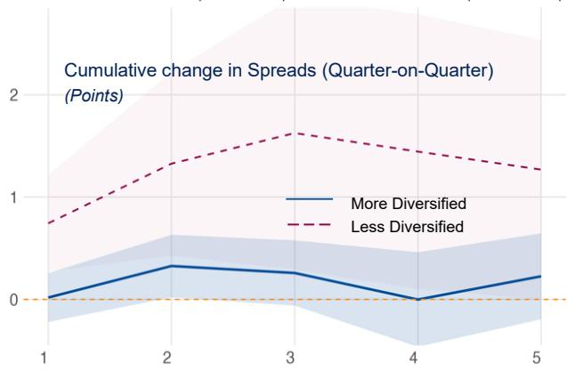  
Note: Shaded area represents 90% confidence.

OIL EXPORTERS vs OIL IMPORTERS
OIL EXPORTERS (SOLID BLUE) - OIL IMPORTERS (DASHED RED)

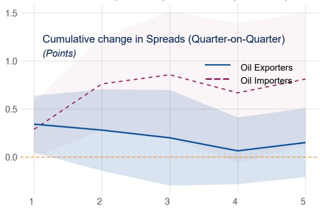

Figure 6 and Figure 7 show the differential response of EMs spreads to U.S. monetary policy stance changes depending on macroeconomic fundamentals, and the exports structure, respectively. While they also appear to matter for the response of EMs spreads to U.S. monetary policy stance changes, their effect is less pronounced compared to FMs. This underlines that robust macroeconomic fundamentals and strong financial buffers are more critical for FMs in cushioning against the impacts of U.S. monetary policy swings on sovereign spreads.

Figure 6. EMs spreads response to a U.S. monetary policy stance changes: The role of domestic financial buffers and macroeconomic fundamentals

FLOATING vs NON-FLOATING EXCHANGE RATE REGIME  
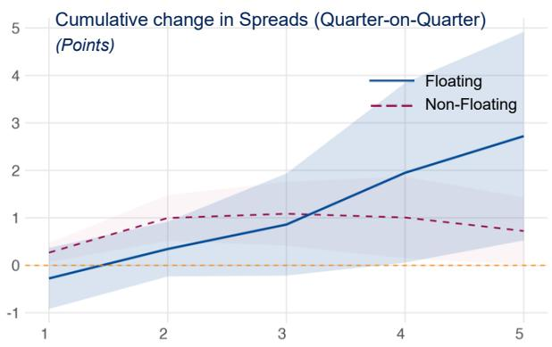  
LOW PUBLIC DEBT RATIO vs HIGH PUBLIC DEBT RATIO

HIGH OFFICIAL RESERVES vs LOW OFFICIAL RESERVES  
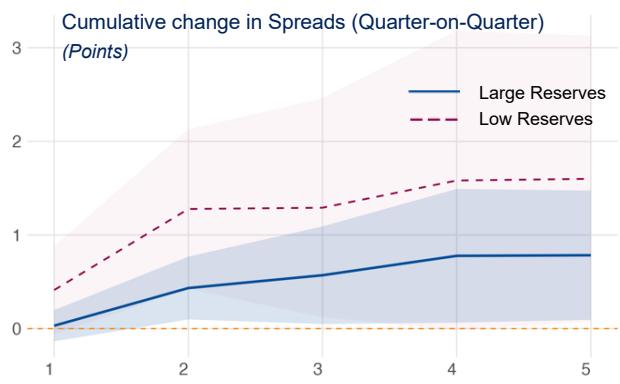  
HIGH FISCAL BALANCE vs. LOW FISCAL BALANCE

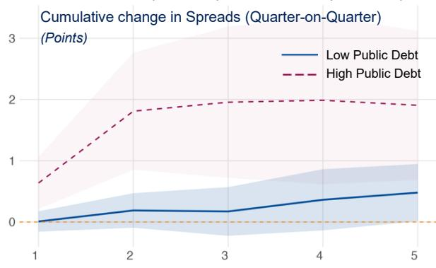  
Note: Shaded area represents 90% confidence.

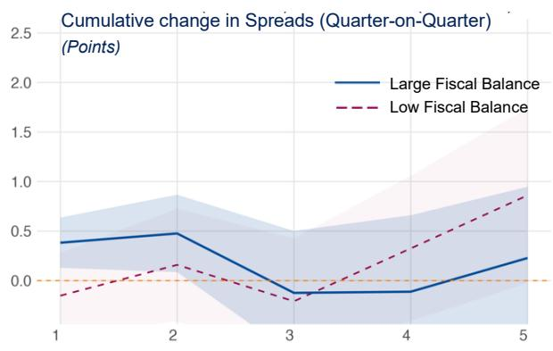  
Figure 7. EMs spreads response to a U.S. monetary policy stance changes: The role of external position structure

THE ROLE OF DIVERSIFICATION (COUNTRIES' EXPORTS)  
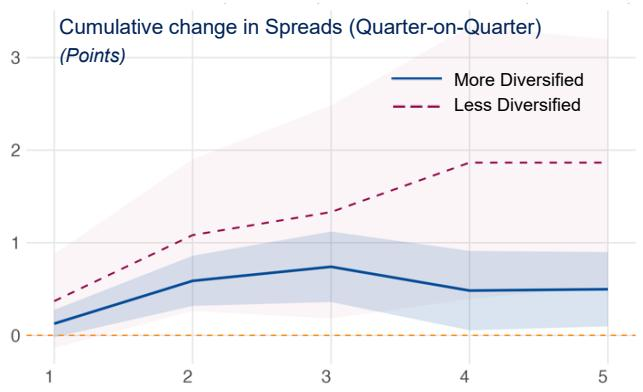  
Note: Shaded area represents 90% confidence.

OIL EXPORTERS vs OIL IMPORTERS  
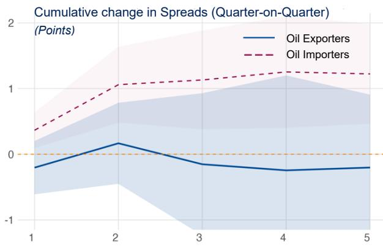

## Robustness

Three robustness checks are performed. First, we assess the stability of the FM identification approach using alternative definitions. We then investigate the robustness of the determinants of the transition to FM status using these alternative definitions. Finally, we examine the response of FMs spreads to U.S. monetary policy stance changes, employing both the alternative FM identifications mentioned and a different measure of spreads.

## Robustness of FM identification

For the alternative FM status identification, we refine the initial identification in two ways: (i) we exclude portfolio flows from selection criteria, meaning that a country is considered a FM if it meets three criteria out of four, (ii) we employ a market-based definition for FM identification, solely relying on debt issuance in international markets. Changes arising from these different selection criteria are shown in Appendix Figure 10 and Figure 11, respectively. Excluding portfolio flows from classification criteria mainly affects small and developing states, while solely relying on debt issuance excluding a small sample of countries that either did not have a minimum rating of BB- or did not have market access.

## Robustness Checks for Frontier Market Classification and Transition Determinants from NFLICs to FMs

Using the additional identifications mentioned above as alternative binary dependent variables, we investigate the robustness of the regression results on the determinants of the transition to the FM status. Average marginal effects shown in Appendix Table 6 and 7 are only consistent with baseline effects in Table 4 when considering the role of improved government effectiveness: The role of macroeconomic fundamentals such as output growth and government debt and the role of IMF program varies depending on the FM identification used.

## Robustness Checks on FMs Spreads Sensitivity

We finally assess the robustness of baseline results analyzing the sensitivity of FMs spreads to U.S. monetary policy stance changes, and consider three alternative specifications: We consider the two alternative FM classifications of the first robustness exercise, and we then introduce a third specification that instead uses an alternative measure of sovereign spreads, from EMBIG rather than the Sovereign Spread Monitor used in the baseline. Appendix Figures 12 to 20 depict impulse responses that are for the most part consistent with baseline results when comparing FMs to EMs and NFLICs considered.

## Conclusion

Achieving FM status is a major milestone for LICs, offering more reliable access to external funding sources—and, in particular, international private capital, which can accelerate economic growth and development.

Our findings suggest that attaining FM status is closely tied to a country's economic fundamentals, particularly robust output growth, significant foreign direct investment, and sound fiscal management. The quality of institutions and economic governance stand out as a critical determinant: countries with higher institutional effectiveness and transparency are more likely to achieve FM status, because these qualities foster investor confidence. By contrast, external push factors play a less important role for accession to the group.

Once LICs belong to the prestigious club of FMs, retaining the status depends on countries' ability to weather external shocks. Our results show that FM sovereign spreads demonstrate significant sensitivity to changes in U.S. monetary policy, on a level that is similar to that observed in EMs. This showcases the fragility of their market access. To mitigate the sensitivity, our analysis highlights the role of maintaining flexible exchange rates, adequate foreign reserves, and prudent debt levels. Various examples highlight that the persistence of FM status cannot be taken for granted, with several FMs having taken recourse to IMF programs in efforts to stabilize their economies in the aftermath of the COVID-19 pandemic and subsequent shocks.

Ultimately, the path from LIC status to FM status, and later on graduation to EM status, requires more than initially achieving favorable macroeconomic and financial conditions—continuously benefiting from the status in terms of market confidence requires an ongoing commitment to resilience-building and robust economic governance. This implies building buffers, continued progress on prudent fiscal and other macroeconomic policies, structural reforms, and continuous upgrading of economic institutions. As fiscal deficits and public debt tend to increase after the graduation to FM status, implementing prudent fiscal policies, enhancing revenue mobilization, and introducing credible fiscal rules and medium-term frameworks is of particular importance for anchoring investors' confidence.

## Annex I. Additional Stylized Facts

Cross-Group Comparison

CURRENT GOVERNMENT EXPENSES (%GDP)  
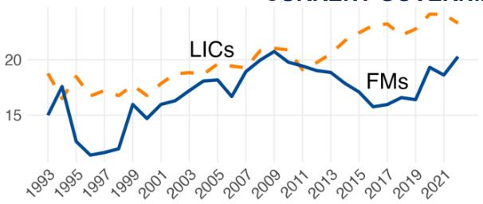  
Dynamics Surrounding Transition to FM Status (in years)

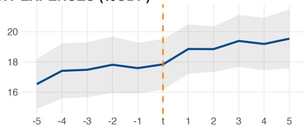

INVESTMENT GOVERNMENT SPENDING (% GDP)  
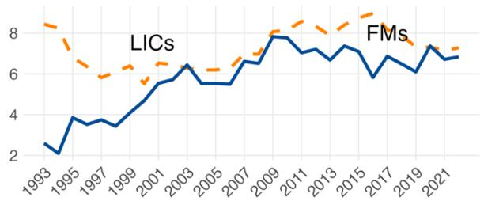

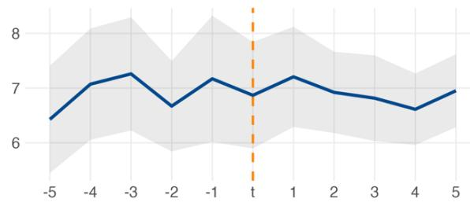

## SHARE OF PUBLIC INVESTMENT IN CAPITAL FORMATION

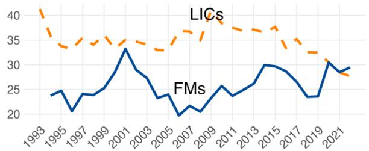

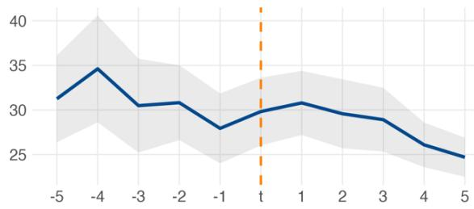

## Figure 9. Dynamics of governance sub-indices: Comparison between NFLICs and FMs 1993-2022

Cross-Group Comparison  
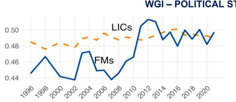

Dynamics Surrounding Transition to FM Status (in years)  
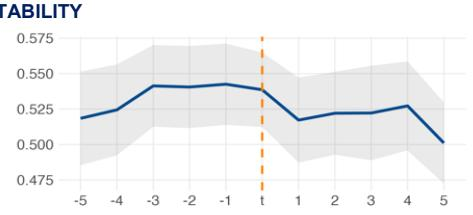

WGI – GOVERNMENT EFFECTIVENESS  
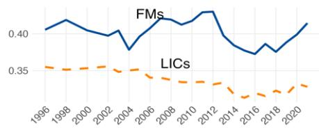

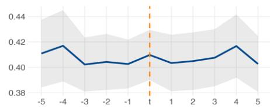

WGI – REGULATORY QUALITY  
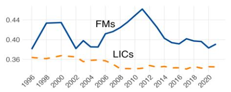

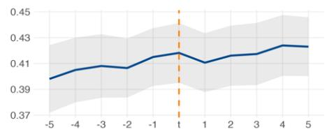

WGI – RULE OF LAW  
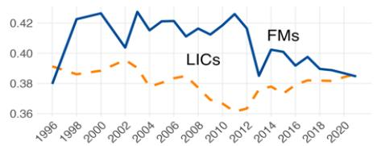

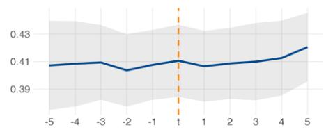

WGI - CONTROL OF CORRUPTION  
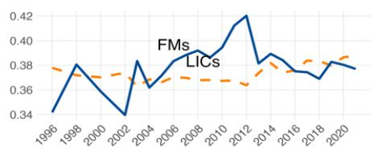

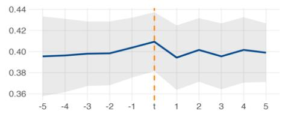

WGI – VOICE AND ACCOUNTABILITY  
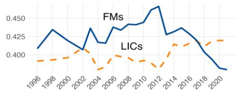

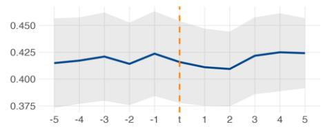

CPIA GOVERNANCE INDEX  
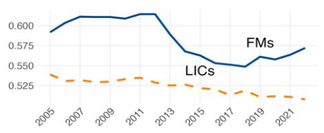

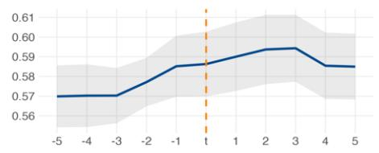

## Annex II. Robustness Checks

Figure 10. Tracking the shifts in countries status: A heatmap view with the first alternative definition (1993-2022)  
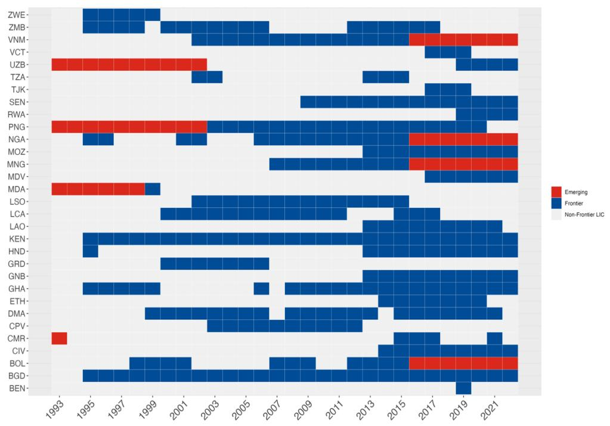

Figure 11. Tracking the shifts in countries status: A heatmap view with the second alternative definition (1993-2022)  
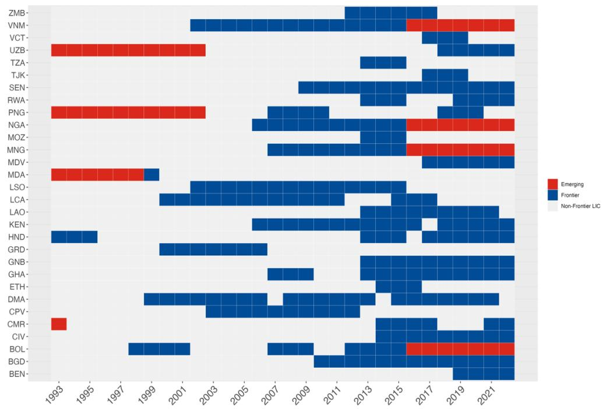

Table 5. Factors driving the transition from LIC To FM Status: Alternative variables for Governance

<table><tr><td rowspan="2"></td><td colspan="7">Dependent variable: Probability of transition to the Frontier Market Status</td></tr><tr><td>(1)</td><td>(2)</td><td>(3)</td><td>(4)</td><td>(5)</td><td>(6)</td><td>(7)</td></tr><tr><td>WGI Average</td><td>0.028(0.045)</td><td>0.048(0.046)</td><td>0.074(0.051)</td><td>0.089*(0.054)</td><td>0.076(0.153)</td><td>0.059(0.076)</td><td>0.079(0.058)</td></tr><tr><td>Political Stability</td><td>0.012(0.028)</td><td>0.021(0.029)</td><td>0.038(0.040)</td><td>0.042(0.041)</td><td>0.072(0.094)</td><td>0.031(0.048)</td><td>0.034(0.047)</td></tr><tr><td>Government Effectiveness</td><td>0.096*(0.052)</td><td>0.108**(0.051)</td><td>0.159***(0.062)</td><td>0.167***(0.063)</td><td>0.066(0.122)</td><td>0.146*(0.086)</td><td>0.149*(0.082)</td></tr><tr><td>Regulatory Quality</td><td>0.079(0.052)</td><td>0.105**(0.052)</td><td>0.136**(0.066)</td><td>0.156**(0.069)</td><td>0.053(0.125)</td><td>0.149*(0.090)</td><td>0.123(0.086)</td></tr><tr><td>Rule of Law</td><td>0.004(0.040)</td><td>0.025(0.041)</td><td>0.037(0.047)</td><td>0.049(0.049)</td><td>0.111(0.144)</td><td>0.043(0.068)</td><td>0.036(0.058)</td></tr><tr><td>Control of Corruption</td><td>0.019(0.046)</td><td>0.045(0.047)</td><td>0.058(0.048)</td><td>0.076(0.051)</td><td>0.148(0.106)</td><td>0.058(0.075)</td><td>0.059(0.0</td></tr><tr><td>Voice and Accountability</td><td>0.003(0.034)</td><td>0.030(0.035)</td><td>0.023(0.040)</td><td>0.047(0.045)</td><td>0.061(0.104)</td><td>0.046(0.064)</td><td>0.021(0.048)</td></tr><tr><td>Average CPIA</td><td>0.122(0.083)</td><td>0.128(0.082)</td><td>0.245**(0.115)</td><td>0.252**(0.118)</td><td>0.049(0.190)</td><td>0.204(0.131)</td><td>0.256***(0.062)</td></tr><tr><td>Pooling</td><td>Yes</td><td>Yes</td><td>Yes</td><td>Yes</td><td>No</td><td>No</td><td>No</td></tr><tr><td>Country FE</td><td>No</td><td>No</td><td>No</td><td>No</td><td>Yes</td><td>No</td><td>No</td></tr><tr><td>Country RE</td><td>No</td><td>No</td><td>No</td><td>No</td><td>No</td><td>Yes</td><td>Yes</td></tr><tr><td>Linear/Probit</td><td>Linear</td><td>Linear</td><td>Probit</td><td>Probit</td><td>Linear</td><td>Linear</td><td>Probit</td></tr></table>

Note: The table presents coefficients for alternative governance metrics, each assessed independently within the specification. The table reports the estimated coefficients and the associated robust standard errors. The parameters from the Probit estimations in columns (3), (4) and (7), are presented as average marginal effects.  
\*p<0.1; \*\*p<0.05; \*\*\*p<0.01

Table 6. Factors driving the transition from LIC To FM Status: First alternative for FM identification

<table><tr><td rowspan="2"></td><td colspan="7">Dependent variable: Probability of transition to Frontier Market Status</td></tr><tr><td>(1)</td><td>(2)</td><td>(3)</td><td>(4)</td><td>(5)</td><td>(6)</td><td>(7)</td></tr><tr><td>Output Growth</td><td>0.002(0.001)</td><td>0.001(0.001)</td><td>0.003(0.002)</td><td>0.002(0.002)</td><td>0.0003(0.001)</td><td>0.001(0.001)</td><td>0.002(0.002)</td></tr><tr><td>FDI</td><td>0.001(0.002)</td><td>0.001(0.002)</td><td>0.001(0.001)</td><td>0.001(0.001)</td><td>0.004(0.002)</td><td>0.003(0.002)</td><td>0.001(0.001)</td></tr><tr><td>Fiscal Balance</td><td>-0.0003(0.0004)</td><td>-0.0004(0.0004)</td><td>-0.0004(0.001)</td><td>-0.0004(0.001)</td><td>-0.0001(0.0005)</td><td>-0.00005(0.0005)</td><td>-0.001(0.001)</td></tr><tr><td>Current Account</td><td>-0.0001(0.0001)</td><td>-0.00001(0.0001)</td><td>-0.0001(0.0003)</td><td>-0.00001(0.0003)</td><td>-0.0001(0.0001)</td><td>-0.00004(0.0001)</td><td>-0.0001(0.0003)</td></tr><tr><td>Reserves</td><td>0.001(0.003)</td><td>-0.0002(0.003)</td><td>0.001(0.002)</td><td>0.00003(0.002)</td><td>0.002(0.003)</td><td>0.0004(0.004)</td><td>0.001(0.002)</td></tr><tr><td>Government Debt</td><td>-0.0001(0.0001)</td><td>-0.0001(0.0001)</td><td>-0.0004(0.0003)</td><td>-0.0003(0.0003)</td><td>0.00001(0.0001)</td><td>-0.0001(0.0001)</td><td>-0.0004(0.0003)</td></tr><tr><td>Inflation</td><td>0.0002(0.0002)</td><td>0.0002(0.0001)</td><td>0.0002(0.001)</td><td>0.0001(0.001)</td><td>0.0001(0.0001)</td><td>0.0002(0.0001)</td><td>0.0002(0.0004)</td></tr><tr><td>Gov.Effectiveness</td><td>0.195***(0.069)</td><td>0.205***(0.069)</td><td>0.233***(0.070)</td><td>0.247***(0.073)</td><td>0.104(0.123)</td><td>0.320***(0.122)</td><td>0.226**(0.112)</td></tr><tr><td>PRGT program</td><td>0.001(0.013)</td><td>0.004(0.013)</td><td>0.008(0.013)</td><td>0.012(0.013)</td><td>-0.018(0.018)</td><td>-0.009(0.017)</td><td>-0.001(0.011)</td></tr><tr><td>GRA program</td><td>0.054(0.055)</td><td>0.056(0.055)</td><td>0.028(0.020)</td><td>0.028(0.020)</td><td>-0.035(0.046)</td><td>0.037(0.063)</td><td>0.020(0.021)</td></tr><tr><td>Income per capita</td><td></td><td>0.000(0.000)</td><td></td><td>0.000(0.000)</td><td></td><td></td><td></td></tr><tr><td>VIX</td><td>-0.001(0.001)</td><td>-0.001(0.001)</td><td>-0.001(0.001)</td><td>-0.001(0.001)</td><td>-0.001**(0.001)</td><td>-0.001*(0.001)</td><td>-0.001(0.001)</td></tr><tr><td>Shadow rate</td><td>-0.002(0.003)</td><td>-0.002(0.003)</td><td>-0.002(0.002)</td><td>-0.002(0.002)</td><td>-0.006**(0.003)</td><td>-0.004(0.003)</td><td>-0.002(0.002)</td></tr><tr><td>Constant</td><td>-0.030(0.028)</td><td>-0.032(0.028)</td><td></td><td></td><td></td><td>-0.040(0.039)</td><td></td></tr><tr><td>Observations</td><td>912</td><td>911</td><td>912</td><td>911</td><td>912</td><td>912</td><td>912</td></tr><tr><td>Pooling</td><td>Yes</td><td>Yes</td><td>Yes</td><td>Yes</td><td>No</td><td>No</td><td>No</td></tr><tr><td>Country FE</td><td>No</td><td>No</td><td>No</td><td>No</td><td>Yes</td><td>No</td><td>No</td></tr><tr><td>Country RE</td><td>No</td><td>No</td><td>No</td><td>No</td><td>No</td><td>Yes</td><td>Yes</td></tr><tr><td>Linear/Probit</td><td>Linear</td><td>Linear</td><td>Probit</td><td>Probit</td><td>Linear</td><td>Linear</td><td>Probit</td></tr></table>

Note: The table reports the estimated coefficients and the associated robust standard errors. The parameters from the Probit estimations in columns (3), (4) and (7), are presented as average marginal effects.  
\*p<0.1; \*\*p<0.05; \*\*\*p<0.01

Table 7. Factors driving the transition from LIC To FM status: Second alternative for FM identification

<table><tr><td rowspan="2"></td><td colspan="7">Dependent variable : Probability of transition to Frontier Market Status</td></tr><tr><td>(1)</td><td>(2)</td><td>(3)</td><td>(4)</td><td>(5)</td><td>(6)</td><td>(7)</td></tr><tr><td>Output Growth</td><td>0.002*(0.001)</td><td>0.002(0.001)</td><td>0.004*(0.002)</td><td>0.004*(0.002)</td><td>0.001(0.001)</td><td>0.001(0.001)</td><td>0.003(0.002)</td></tr><tr><td>FDI</td><td>-0.0003(0.002)</td><td>-0.0004(0.002)</td><td>-0.00002(0.002)</td><td>-0.0001(0.002)</td><td>0.002(0.002)</td><td>0.001(0.002)</td><td>0.001(0.001)</td></tr><tr><td>Fiscal Balance</td><td>-0.0001(0.001)</td><td>-0.0001(0.001)</td><td>-0.0002(0.001)</td><td>-0.0002(0.001)</td><td>0.0001(0.001)</td><td>0.0001(0.001)</td><td>-0.0004(0.001)</td></tr><tr><td>Current Account</td><td>0.0001(0.0001)</td><td>0.0001(0.0001)</td><td>0.0001(0.0003)</td><td>0.0001(0.0003)</td><td>0.0002(0.0002)</td><td>0.0002(0.0002)</td><td>0.0001(0.0003)</td></tr><tr><td>Reserves</td><td>0.0002(0.003)</td><td>-0.001(0.003)</td><td>0.001(0.002)</td><td>-0.0003(0.002)</td><td>0.002(0.004)</td><td>0.0001(0.004)</td><td>0.0004(0.002)</td></tr><tr><td>Government Debt</td><td>-0.0001(0.0001)</td><td>-0.0001(0.0001)</td><td>-0.0005*(0.0003)</td><td>-0.0004(0.0003)</td><td>-0.0001(0.0001)</td><td>-0.0001(0.0001)</td><td>-0.001(0.0003)</td></tr><tr><td>Inflation</td><td>0.0002(0.0001)</td><td>0.0002(0.0001)</td><td>-0.0003(0.001)</td><td>-0.001(0.001)</td><td>0.0001(0.0001)</td><td>0.0002(0.0001)</td><td>-0.0002(0.001)</td></tr><tr><td>Gov.Effectiveness</td><td>0.233***(0.071)</td><td>0.243***(0.071)</td><td>0.274***(0.074)</td><td>0.285***(0.075)</td><td>0.206(0.134)</td><td>0.381***(0.123)</td><td>0.281***(0.109)</td></tr><tr><td>PRGT program</td><td>0.001(0.013)</td><td>0.003(0.013)</td><td>0.009(0.014)</td><td>0.011(0.014)</td><td>-0.034*(0.019)</td><td>-0.015(0.018)</td><td>-0.003(0.013)</td></tr><tr><td>GRA program</td><td>0.118*(0.066)</td><td>0.119*(0.066)</td><td>0.053***(0.020)</td><td>0.054***(0.020)</td><td>0.002(0.048)</td><td>0.105(0.073)</td><td>0.043*(0.024)</td></tr><tr><td>Income per capita</td><td></td><td>0.000(0.000)</td><td></td><td>0.000(0.000)</td><td></td><td></td><td></td></tr><tr><td>VIX</td><td>-0.002**(0.001)</td><td>-0.002**(0.001)</td><td>-0.002*(0.001)</td><td>-0.002*(0.001)</td><td>-0.002**(0.001)</td><td>-0.002**(0.001)</td><td>-0.002*(0.001)</td></tr><tr><td>Shadow rate</td><td>-0.004(0.003)</td><td>-0.004(0.003)</td><td>-0.003(0.003)</td><td>-0.003(0.003)</td><td>-0.007**(0.003)</td><td>-0.005*(0.003)</td><td>-0.003(0.002)</td></tr><tr><td>Constant</td><td>-0.010(0.031)</td><td>-0.012(0.031)</td><td></td><td></td><td></td><td>-0.022(0.041)</td><td></td></tr><tr><td>Observations</td><td>941</td><td>940</td><td>941</td><td>940</td><td>941</td><td>941</td><td>941</td></tr><tr><td>Pooling</td><td>Yes</td><td>Yes</td><td>Yes</td><td>Yes</td><td>No</td><td>No</td><td>No</td></tr><tr><td>Country FE</td><td>No</td><td>No</td><td>No</td><td>No</td><td>Yes</td><td>No</td><td>No</td></tr><tr><td>Country RE</td><td>No</td><td>No</td><td>No</td><td>No</td><td>No</td><td>Yes</td><td>Yes</td></tr><tr><td>Linear/Probit</td><td>Linear</td><td>Linear</td><td>Probit</td><td>Probit</td><td>Linear</td><td>Linear</td><td>Probit</td></tr></table>

Note: The table reports the estimated coefficients and the associated robust standard errors. The parameters from the Probit estimations in columns (3), (4) and (7), are presented as average marginal effects.  
\*p<0.1; \*\*p<0.05; \*\*\*p<0.01

Table 8. Factors Driving the transition from LIC To FM status (using the first alternative FM identification): Alternative variables for governance

<table><tr><td rowspan="2"></td><td colspan="7">Dependent variable: Probability of transition to Frontier Market Status</td></tr><tr><td>(1)</td><td>(2)</td><td>(3)</td><td>(4)</td><td>(5)</td><td>(6)</td><td>(7)</td></tr><tr><td>WGI Average</td><td>0.106**(0.051)</td><td>0.128**(0.052)</td><td>0.140**(0.055)</td><td>0.165***(0.060)</td><td>0.146(0.142)</td><td>0.212**(0.102)</td><td>0.147**(0.071)</td></tr><tr><td>Political Stability</td><td>0.006(0.005)</td><td>0.006(0.005)</td><td>0.009(0.007)</td><td>0.009(0.007)</td><td>-0.0004(0.012)</td><td>0.009(0.009)</td><td>0.008(0.008)</td></tr><tr><td>Regulatory Quality</td><td>0.182**(0.074)</td><td>0.208***(0.075)</td><td>0.226***(0.076)</td><td>0.257***(0.082)</td><td>0.079(0.119)</td><td>0.307**(0.127)</td><td>0.204*(0.106)</td></tr><tr><td>Rule of Law</td><td>0.060(0.049)</td><td>0.079(0.051)</td><td>0.082*(0.049)</td><td>0.100*(0.053)</td><td>0.151(0.137)</td><td>0.161*(0.094)</td><td>0.094(0.099)</td></tr><tr><td>Control of Corruption</td><td>0.089(0.058)</td><td>0.116*(0.060)</td><td>0.107**(0.051)</td><td>0.133**(0.056)</td><td>0.154(0.105)</td><td>0.182*(0.101)</td><td>0.115(0.149)</td></tr><tr><td>Voice and Accountability</td><td>0.041(0.041)</td><td>0.069(0.042)</td><td>0.057(0.042)</td><td>0.091*(0.048)</td><td>0.051(0.102)</td><td>0.128(0.084)</td><td>0.058(0.086)</td></tr><tr><td>Average CPIA</td><td>0.253***(0.091)</td><td>0.256***(0.091)</td><td>0.350***(0.130)</td><td>0.364***(0.135)</td><td>0.083(0.187)</td><td>0.392**(0.157)</td><td>0.349*(0.179)</td></tr><tr><td>Pooling</td><td>Yes</td><td>Yes</td><td>Yes</td><td>Yes</td><td>No</td><td>No</td><td>No</td></tr><tr><td>Country FE</td><td>No</td><td>No</td><td>No</td><td>No</td><td>Yes</td><td>No</td><td>No</td></tr><tr><td>Country RE</td><td>No</td><td>No</td><td>No</td><td>No</td><td>No</td><td>Yes</td><td>Yes</td></tr><tr><td>Linear/Probit</td><td>Linear</td><td>Linear</td><td>Probit</td><td>Probit</td><td>Linear</td><td>Linear</td><td>Probit</td></tr></table>

Note: The table presents coefficients for alternative governance metrics, each assessed independently within the specification. The table reports the estimated coefficients and the associated robust standard errors. The parameters from the Probit estimations in columns (3), (4) and (7), are presented as average marginal effects.  
\*p<0.1; \*\*p<0.05; \*\*\*p<0.01

Table 9. Factors driving the transition from LIC To FM status (Using the second alternative FM identification): Alternative variables for governance

<table><tr><td rowspan="2"></td><td colspan="7">Dependent variable: Probability of transition to Frontier Market Status</td></tr><tr><td>(1)</td><td>(2)</td><td>(3)</td><td>(4)</td><td>(5)</td><td>(6)</td><td>(7)</td></tr><tr><td>WGI Average</td><td>0.132**(0.052)</td><td>0.151***(0.052)</td><td>0.158***(0.058)</td><td>0.179***(0.061)</td><td>0.340**(0.167)</td><td>0.246**(0.096)</td><td>0.170**(0.076)</td></tr><tr><td>Political Stability</td><td>0.029(0.031)</td><td>0.034(0.032)</td><td>0.043(0.044)</td><td>0.045(0.045)</td><td>0.140(0.099)</td><td>0.071(0.063)</td><td>0.050(0.060)</td></tr><tr><td>Regulatory Quality</td><td>0.233***(0.080)</td><td>0.258***(0.080)</td><td>0.277***(0.083)</td><td>0.305***(0.088)</td><td>0.076(0.141)</td><td>0.373***(0.135)</td><td>0.251**(0.101)</td></tr><tr><td>Rule of Law</td><td>0.067(0.051)</td><td>0.083(0.053)</td><td>0.088*(0.053)</td><td>0.101*(0.056)</td><td>0.288*(0.148)</td><td>0.193**(0.098)</td><td>0.101***(0.007)</td></tr><tr><td>Control of Corruption</td><td>0.099(0.063)</td><td>0.123*(0.064)</td><td>0.117**(0.056)</td><td>0.138**(0.060)</td><td>0.299**(0.137)</td><td>0.211*(0.109)</td><td>0.139(0.089)</td></tr><tr><td>Voice and Accountability</td><td>0.047(0.043)</td><td>0.071(0.044)</td><td>0.067(0.046)</td><td>0.096*(0.052)</td><td>0.040(0.112)</td><td>0.127(0.086)</td><td>0.066***(0.005)</td></tr><tr><td>Average CPIA</td><td>0.297***(0.097)</td><td>0.300***(0.097)</td><td>0.410***(0.136)</td><td>0.417***(0.138)</td><td>0.015(0.213)</td><td>0.443***(0.166)</td><td>0.417**(0.198)</td></tr><tr><td>Pooling</td><td>Yes</td><td>Yes</td><td>Yes</td><td>Yes</td><td>No</td><td>No</td><td>No</td></tr><tr><td>Country FE</td><td>No</td><td>No</td><td>No</td><td>No</td><td>Yes</td><td>No</td><td>No</td></tr><tr><td>Country RE</td><td>No</td><td>No</td><td>No</td><td>No</td><td>No</td><td>Yes</td><td>Yes</td></tr><tr><td>Linear/Probit</td><td>Linear</td><td>Linear</td><td>Probit</td><td>Probit</td><td>Linear</td><td>Linear</td><td>Probit</td></tr></table>

Note: The table presents coefficients for alternative governance metrics, each assessed independently within the specification. The table reports the estimated coefficients and the associated robust standard errors. The parameters from the Probit estimations in columns (3), (4) and (7), are presented as average marginal effects.  
\*p<0.1; \*\*p<0.05; \*\*\*p<0.01

Figure 12. FMs Spreads response to a U.S. monetary policy stance changes: A comparative analysis of regime switching with NFLICs and EMs (Taking the first alternative FM identification)

FRONTIER MARKETS vs LOW INCOME COUNTRIES

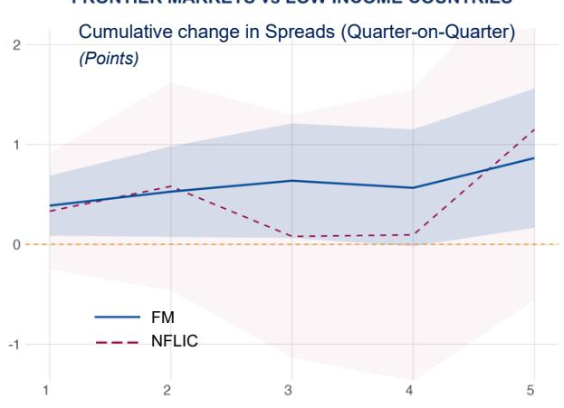  
Note: Shaded area represents 90% confidence.  
FRONTIER MARKETS vs EMERGING MARKETS

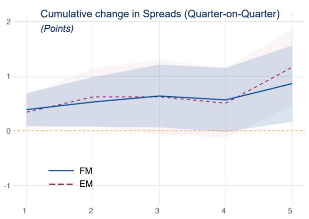  
Figure 13. Spreads response to a U.S. monetary policy stance changes: A comparative analysis of regime switching with NFLICs and EMs (Taking the second alternative for FM identification)  
FRONTIER MARKETS vs LOW INCOME COUNTRIES

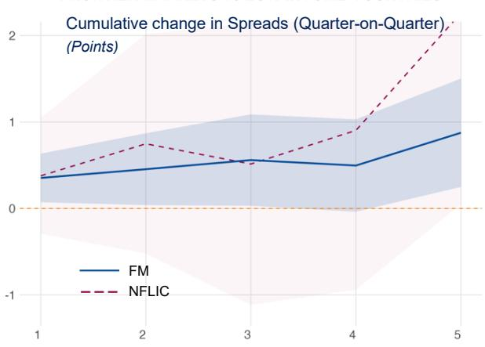  
Note: Shaded area represents 90% confidence.  
FRONTIER MARKETS vs EMERGING MARKETS

Figure 14. Spreads response to a U.S. monetary policy stance changes: A comparative analysis of regime switching with NFLICs and EMs (taking alternative spreads measure)

FRONTIER MARKETS vs LOW INCOME COUNTRIES

  
Note: Shaded area represents 90% confidence.  
FRONTIER MARKETS vs EMERGING MARKETS

Figure 15. FMs spreads response to a U.S. monetary policy stance changes: The role of domestic financial buffers and macroeconomic fundamentals (Taking the first alternative FM identification)

FLOATING vs NON-FLOATING EXCHANGE RATE REGIME

  
HIGH OFFICIAL RESERVES vs LOW OFFICIAL RESERVES

  
LOW PUBLIC DEBT RATIO vs HIGH PUBLIC DEBT RATIO
LOV

  
Note: Shaded area represents 90% confidence.  
HIGH FISCAL BALANCE vs. LOW FISCAL BALANCE

## Figure 16. FMs spreads response to a U.S. monetary policy stance changes: The role of domestic financial buffers and macroeconomic fundamentals (Taking the second alternative FM identification)

FLOATING vs NON-FLOATING EXCHANGE RATE REGIME

  
HIGH OFFICIAL RESERVES vs LOW OFFICIAL RESERVES

  
LOW PUBLIC DEBT RATIO vs HIGH PUBLIC DEBT RATIO
LOI

  
Note: Shaded area represents 90% confidence.

Figure 17. FMs spreads response to a U.S. monetary policy stance changes: The role of domestic financial buffers and macroeconomic fundamentals (taking alternative spreads measure)

FLOATING vs NON-FLOATING EXCHANGE RATE REGIME

  
HIGH OFFICIAL RESERVES vs LOW OFFICIAL RESERVES

  
LOW PUBLIC DEBT RATIO vs HIGH PUBLIC DEBT RATIO
LOW

  
Note: Shaded area represents 90% confidence.

Figure 18. FMs spreads response to a U.S. monetary policy stance changes: The role of external position structure (taking the first alternative FM identification)

THE ROLE OF DIVERSIFICATION (COUNTRIES' EXPORTS)  
  
Note: Shaded area represents 90% confidence.

OIL EXPORTERS vs OIL IMPORTERS  

Figure 19. FMs spreads response to a U.S. monetary policy stance changes: The role of external position structure (taking the second alternative FM identification)

OIL EXPORTERS vs OIL IMPORTERS  
THE ROLE OF DIVERSIFICATION (COUNTRIES' EXPORTS)  
  
Note: Shaded area represents 90% confidence.

OIL EXPORTERS vs OIL IMPORTERS  

Figure 20. FMs spreads response to a U.S. monetary policy stance changes: The role of external position structure (taking alternative spreads measure)

THE ROLE OF DIVERSIFICATION (COUNTRIES' EXPORTS)  
  
Note: Shaded area represents 90% confidence.

## References

Abidi, N., Hacibedel, B., & Nkusu, M. (2016). Changing times for frontier markets: A perspective from portfolio investment flows and financial integration. Washington, DC: International Monetary Fund.

Agur, I., Chan, M., Goswami, M., & Sharma, S. (2019). On international integration of emerging sovereign bond markets. Emerging Markets Review, 38, 347-363.

Ahmed, S., & Zlate, A. (2014). Capital flows to emerging market economies: A brave new world? Journal of International Money and Finance, 48, 221-248.

Ahmed, S., Coulibaly, B., & Zlate, A. (2017). International financial spillovers to emerging market economies: How important are economic fundamentals?. Journal of International Money and Finance, 76, 133-152.

Aizenman, J., Park, D., Qureshi, I. A., Saadaoui, J., & Uddin, G. S. (2024). The performance of emerging markets during the Fed's easing and tightening cycles: a cross-country resilience analysis. Journal of International Money and Finance, 148, 103169.

Albagli, E., Ceballos, L., Claro, S., & Romero, D. (2019). Channels of US monetary policy spillovers to international bond markets. Journal of Financial Economics, 134(2), 447-473.

Balcilar, M., & Demirer, R. (2015). Effect of global shocks and volatility on herd behavior in an emerging market: Evidence from Borsa Istanbul. Emerging Markets Finance and Trade, 51(1), 140-159.

Bhattarai, S., Chatterjee, A., & Park, W. Y. (2021). Effects of US quantitative easing on emerging market economies. Journal of Economic Dynamics and Control, 122, 104031.

Bowman, D., Londono, J. M., & Sapriza, H. (2015). US unconventional monetary policy and transmission to emerging market economies. Journal of International Money and Finance, 55, 27-59.

Broner, F., Martin, A., Pandolfi, L., & Williams, T. (2021). Winners and losers from sovereign debt inflows. Journal of International Economics, 130, 103446.

Calvo, G. A., Leiderman, L., & Reinhart, C. M. (1996). Inflows of capital to developing countries in the 1990s. Journal of Economic Perspectives, 10(2), 123-139.

Chuhan, P., Claessens, S., & Mamingi, N. (1998). Equity and bond flows to Latin America and Asia: The role of global and country factors. Journal of Development Economics, 55(2), 439-463.

Comelli, F. (2012). Emerging market sovereign bond spreads: Estimation and back-testing. Emerging Markets Review, 13(4), 598-625.

da Silva, V. H. C. A., de Almeida, L. A., & Singh, D. (2021). Determinants of and prospects for market access in frontier economies (IMF Working Paper WP/21/137). International Monetary Fund.

Ebeke, C., & Lu, Y. (2015). Emerging market local currency bond yields and foreign holdings—A fortune or misfortune? Journal of International Money and Finance, 59, 203-219.

Fernandez-Arias, E., & Montiel, P. J. (1996). The surge in capital inflows to developing countries: An analytical overview. The World Bank Economic Review, 10, 51-77.

Feyen, E., Ghosh, S., Kibuuka, K., & Farazi, S. (2015). Global liquidity and external bond issuance in emerging markets and developing economies. (World Bank Policy Research Working Paper 7363) World Bank.

Fowler, H., (2010), Frontier Markets: The changing face of risk, Emerging Markets News, analysis and opinions, Global Markets, 09/10/2010.

Gilchrist, S., Yue, V., & Zakrajšek, E. (2019). US monetary policy and international bond markets. Journal of Money, Credit and Banking, 51, 127-161.

González-Rozada, M., & Yeyati, E. L. (2008). Global factors and emerging market spreads. The Economic Journal, 118(533), 1917-1936.

Guscina, A., Malik, S., & Papaioannou, M. G. (2017). Assessing loss of market access: Conceptual and operational issues. Washington, DC: International Monetary Fund.

Haque, T., Bogoev, J., & Smith, G. (2017). Push and pull: Emerging risks in frontier economy access to international capital markets. Washington, DC: World Bank.

Kogan, J., Kazandjian, R., Luo, S., Mbohou, M., & Miao, H. (2024). The role of IMF arrangements in restoring access to international capital markets (IMF Working Paper WP/24/173). International Monetary Fund.

Inoguchi, M. (2021). The impact of foreign capital flows on long-term interest rates in emerging and advanced economies. Review of International Economics, 29(2), 268-295.

International Monetary Fund. (2014). Macroeconomic developments in low-income developing countries: 2014. Washington, DC: International Monetary Fund.

International Monetary Fund. (2022). Global financial stability report—Navigating the high-inflation environment. Washington, DC: International Monetary Fund.

International Monetary Fund. (2025). Macroeconomic developments and prospects for low-income countries - 2025. Washington, DC: International Monetary Fund.

Jordà, Ó. (2005). Estimation and inference of impulse responses by local projections. American Economic Review, 95(1), 161-182.

Nellor, D. C. L. (2008). The rise of Africa's "frontier" markets. Finance and Development, 45(3), 30-33.

Ngene, G., Post, J. A., & Mungai, A. N. (2018). Volatility and shock interactions and risk management implications: Evidence from the US and frontier markets. Emerging Markets Review, 37, 181-198.

Presbitero, A., Ghura, M. D., Adedeji, M. O., & Njie, L. (2015). International sovereign bonds by emerging markets and developing economies: Drivers of issuance and spreads (IMF Working Paper WP/15/275). International Monetary Fund.

Quisenberry, C. (2010). Exploring the frontier emerging equity markets. CFA Institute.

Samarakoon, L. P. (2011). Stock market interdependence, contagion, and the US financial crisis: The case of emerging and frontier markets. Journal of International Financial Markets, Institutions and Money, 21(5), 724-742.

Seth, N., & Singhania, M. (2019). Volatility in frontier markets: A multivariate GARCH analysis. Journal of Advances in Management Research, 16(3), 294-312.

Speidell, L. S., & Krohne, A. (2007). The case for frontier equity markets. The Journal of Investing, 16(3), 12-22.

