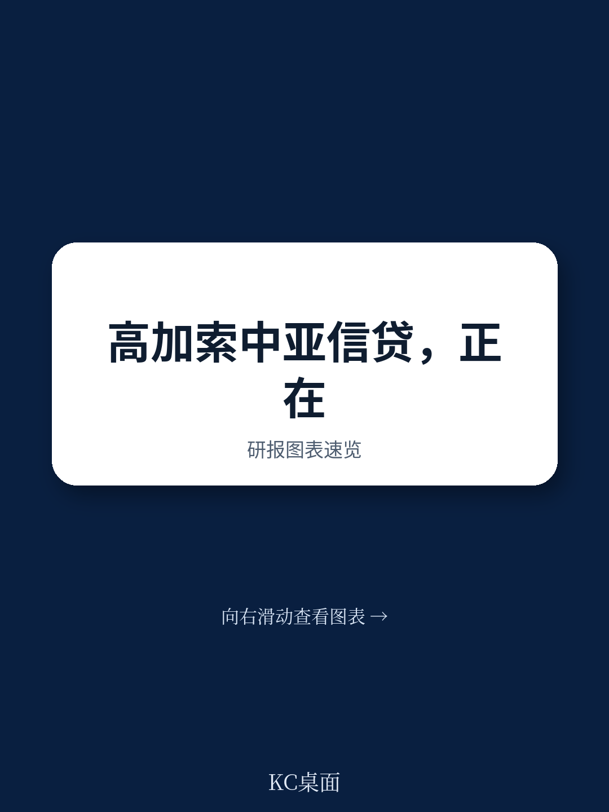
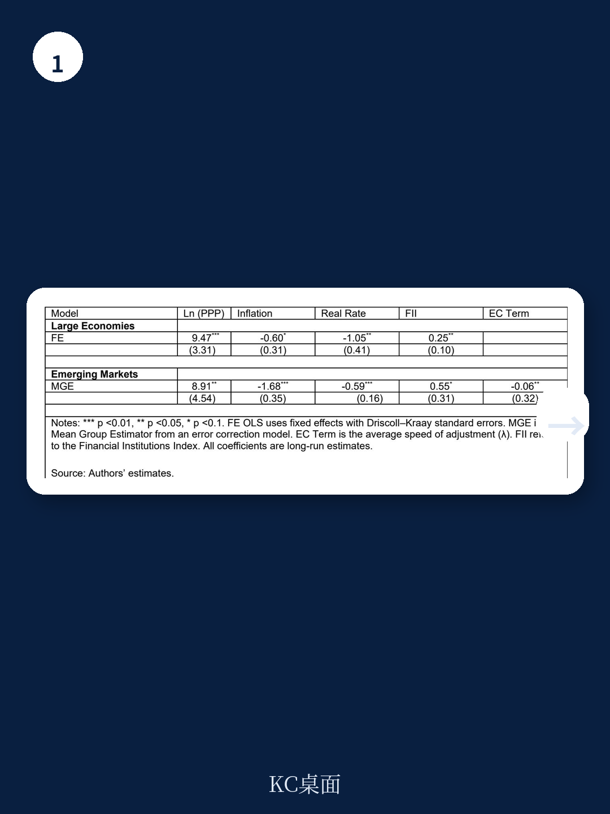
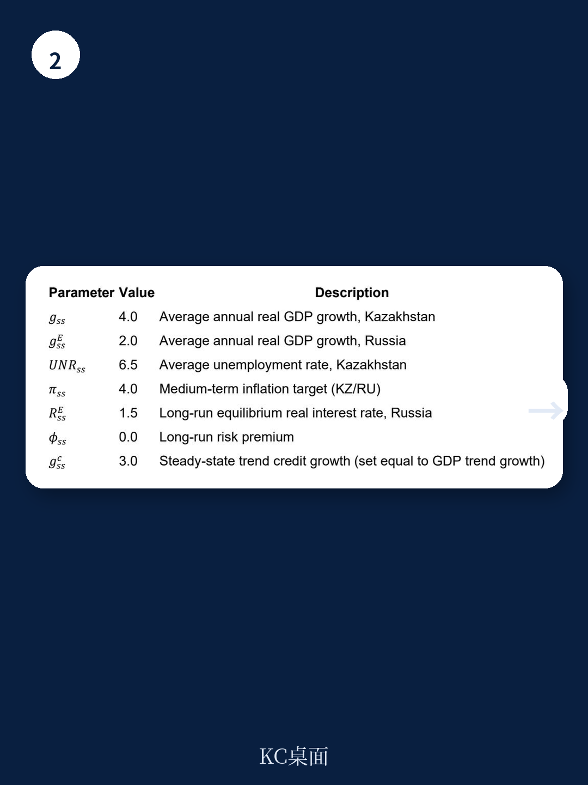

# IMF：中亚信贷扩张的结构性机会与周期性隐忧

信贷增长是金融稳定的核心变量。历史上，信贷高速扩张往往先于金融压力出现，而信贷深度长期低于基本面则可能制约投资与增长。对于政策制定者而言，真正的挑战在于区分可持续的金融深化与过度的信贷扩张。这份由IMF两位经济学家Etibar Jafarov和Chingis Matayev撰写的工作论文，聚焦高加索和中亚地区（CCA）的信贷动态，给出了一个既清醒又具有操作性的判断：该地区仍有金融深化的空间，但家庭信贷的扩张速度正在接近需要密切关注的临界点。

报告的核心贡献在于建立了一套“双重视角”的分析框架——既看信贷相对于基本面的水平，也看信贷相对于自身趋势的增速。这组框架的意义不仅限于CCA地区，对任何关注新兴市场信贷风险的人来说，都值得细读。

> **KC评论：** 这份报告最值得注意的结论不是“信贷高了”或“信贷低了”，而是“水平还有空间，但速度需要警惕”。对于投资者而言，这意味着该地区的银行股和信贷资产仍有结构性故事可讲，但需要密切跟踪家庭部门的杠杆节奏。

## 1. 信贷深度仍有空间，但结构性分化显著

报告首先通过均衡模型估算了各国信贷/GDP比率的长期均衡水平。结果显示，所有CCA经济体都存在进一步的金融深化空间，但这种空间在不同国家之间差异巨大。

亚美尼亚和格鲁吉亚是区域内的金融深化领先者，信贷/GDP比率在某些年份接近60-70%，反映了更深入的经济转型和金融中介化。吉尔吉斯斯坦和塔吉克斯坦则处于另一个极端，信贷/GDP比率仅在10-25%之间，金融体系仍然较浅。哈萨克斯坦、阿塞拜疆和乌兹别克斯坦位于中间位置，但前两个国家经历了明显的信贷繁荣-萧条周期。

这一发现对投资者的含义是明确的：在评估该地区信贷资产质量时，不能简单套用“新兴市场信贷增长=风险”的公式。对于吉尔吉斯斯坦和塔吉克斯坦这样的经济体，信贷增长更多是金融深化的正常过程，而非过热信号。真正需要关注的是那些已经接近或超过均衡水平的国家。

## 2. 家庭信贷正在成为风险聚集的核心领域

报告中最值得警惕的发现来自对信贷结构拆解。在大多数CCA国家，家庭贷款现在已经超过企业贷款。格鲁吉亚和吉尔吉斯斯坦的家庭贷款长期以来占据私人部门信贷的大部分份额；亚美尼亚自2022年以来，家庭贷款也超过企业贷款。哈萨克斯坦在企业部门去杠杆的背景下，家庭借款持续增长，同样改变了信贷结构。

这一趋势的潜在风险在于，家庭信贷的扩张速度通常与经济周期和资产价格高度相关，且一旦出现压力，对银行体系的冲击往往比企业信贷更为直接和迅速。报告明确指出，“家庭信贷扩张的速度值得密切监控”。

> **KC评论：** 家庭信贷占比上升本身不是问题，问题在于速度。历史上，新兴市场家庭信贷的快速扩张往往伴随着信贷标准放松和风险定价不足。这份报告在完整版本中提供了每个国家家庭信贷缺口的具体测算图表，这些数据对于判断具体国家的风险拐点至关重要。

## 3. 没有单一指标能完美预测风险，组合使用才是正解

报告进行了一项有趣的“赛马”实验——比较不同信贷缺口指标在预测银行压力事件方面的表现。结果发现，没有任何单一指标在所有国家都能持续优于其他指标。这意味着，依赖单一指标（比如常用的BIS信贷缺口）来进行风险判断，可能会产生误导。

这一发现对政策制定者和市场参与者都有实际意义。对于央行和监管机构而言，这意味着需要建立多指标监测体系；对于投资者而言，这意味着在评估该地区银行股或主权信用风险时，不能只看一个数字，而需要交叉验证不同维度的信号。

报告通过状态空间模型（多元卡尔曼滤波）提供了一种补充方法，能够将信贷周期与经济周期分离，从而更准确地识别哪些信贷扩张是实体需求驱动的，哪些是纯粹的金融泡沫。这种方法在操作层面比单纯的统计缺口更复杂，但提供了更丰富的判断维度。

## 4. 哈萨克斯坦和阿塞拜疆的经验：繁荣-萧条周期留下的教训

报告对哈萨克斯坦和阿塞拜疆的案例分析提供了重要的历史参照。这两个国家都经历了信贷繁荣后的剧烈收缩，信贷/GDP比率一度下降15-20个百分点。哈萨克斯坦在2008-2010年和2014-2017年两次经历系统性银行压力，阿塞拜疆则在2015-2017年因油价暴跌和货币贬值陷入银行危机。

这些案例揭示了一个反复出现的模式：在资源型经济体中，信贷扩张往往与大宗商品周期高度同步。当大宗商品价格高企时，信贷快速扩张；当价格下跌时，信贷质量迅速恶化。对于投资者而言，这意味着在评估这些国家的信贷风险时，不能只看金融体系本身，还需要将大宗商品价格走势纳入分析框架。

## 5. 报告尚未完全回答的关键问题：美元化的残余风险

报告指出，该地区的贷款美元化程度近年来显著下降，本币贷款份额已超过外币贷款。这是一个积极的结构性变化，降低了货币错配风险。但报告没有完全展开的是，美元化的下降是否足以消除系统性风险。

一个需要进一步探讨的问题是：在那些美元化程度仍然较高的国家，如果本币出现大幅贬值，银行体系能否承受住冲击？报告提到了阿塞拜疆2015年的案例，当时货币贬值导致外汇信贷风险急剧上升。当前虽然美元化程度降低，但家庭部门的外币债务存量仍然存在，且这些债务的分布情况——集中在哪些收入群体、哪些银行——对于评估风险至关重要。

另一个未解决的问题是：家庭信贷的快速扩张是否伴随着信贷标准的实质性放松？报告提到了这一风险，但没有提供具体的信贷标准数据。对于投资者而言，这恰恰是需要从完整报告中寻找答案的关键信息。

> **KC评论：** 报告在方法论上非常严谨，但受限于数据可得性，对信贷标准变化、贷款用途分布等微观层面的分析仍然有限。对于关注该地区银行股的投资者，这些微观信息往往比宏观缺口指标更具预测价值。

## 6. 一个实用的观察框架：从水平、速度到结构

综合报告的发现，我们可以建立一个三层次的观察框架来评估CCA地区的信贷风险：

第一层：水平维度。看信贷/GDP比率相对于均衡水平的偏离程度。偏离越大，结构性风险越高。

第二层：速度维度。看信贷增速相对于趋势的偏离。增速越快，周期性风险越高。

第三层：结构维度。看家庭信贷占比及其增速。家庭信贷占比快速上升且增速高于趋势时，风险最为集中。

当三个维度同时发出警示信号时，系统性风险的概率显著上升。当只有一两个维度发出信号时，则需要结合具体国家的结构性特征来判断。

这份IMF报告的价值在于，它不仅提供了这三个维度的具体测算方法，还通过“赛马”实验告诉我们，没有任何一个维度可以单独作为判断依据。真正的风险管理，在于交叉验证。

---

报告的完整版本包含了每个国家信贷缺口的具体测算图表、卡尔曼滤波的详细参数设定、以及银行危机事件的精确时间窗口。这些原始数据和分析细节，对于需要做出具体投资决策或政策判断的读者来说，是不可或缺的。

如果你想获取这份IMF工作论文的完整解读、原始图表以及我们对CCA地区银行股和主权信用的进一步分析，欢迎加入我们的社群。我们每日更新国际主流机构的研报解读，汇聚了来自头部券商、PE/VC、投行、对冲基金、资管机构和战略咨询等领域的朋友，共同探讨全球市场的边际变化。

Personal reading notes and learning share only. Not investment advice.

