# Pricing Reform Progress: Evidence from Sovereign Spreads and Consensus Forecasts

Ken Miyajima

WP/26/141

IMF Working Papers describe research in progress by the author(s) and are published to elicit comments and to encourage debate. The views expressed in IMF Working Papers are those of the author(s) and do not necessarily represent the views of the IMF, its Executive Board, or IMF management.

2026
JUL

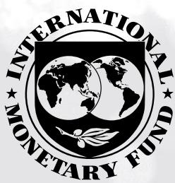

# IMF Working Paper Middle East and Central Asia Department

# Pricing Reform Progress: Evidence from Sovereign Spreads and Consensus Forecasts Prepared by Ken Miyajima\*

Authorized for distribution by Nathan Porter
July 2026

IMF Working Papers describe research in progress by the author(s) and are published to elicit comments and to encourage debate. The views expressed in IMF Working Papers are those of the author(s) and do not necessarily represent the views of the IMF, its Executive Board, or IMF management.

ABSTRACT: Investors reward reform progress. Econometric results suggest that holistic reforms, fiscal spending discipline, and monetary policy credibility are associated with a tightening of Qatar's external sovereign credit spreads. In particular, investors may view fiscal spending discipline as an integral part of Qatar's holistic reform and economic diversification. Greater broad-based reform progress also boosts the resilience of sovereign credit spreads to external shocks. The findings support fiscal and monetary policy reforms as part of the broader reform agenda in a holistic manner, as planned under the Third National Development Strategy.

E44 – Financial Markets and the Macroeconomy

G15 – International Financial Markets

H63 – Debt; Debt Management; Sovereign Debt

JEL Classification Numbers:

O53 – Economywide Country Studies: Middle East, North Africa, and Mediterranean Countries

P48 – Political Economy; Legal Institutions; Property Rights (within economic development context)

Consensus Forecasts; Economic Diversification; Fiscal Discipline;

Keywords:

Monetary Policy Credibility; Qatar National Development Strategy;

Reform Progress; Sovereign Credit Quality; MENA Region

Author's E-Mail Address:

kmiyajima@imf.org

WORKING PAPERS

# Pricing Reform Progress: Evidence from Sovereign Spreads and Consensus Forecasts

Prepared Ken Miyajima

## Contents

## Pricing Reform Progress: Evidence from Sovereign Spreads and Consensus Forecasts

A. Introduction......3
II. The Literature......4
III. Estimation Strategy and Data......6
IV. Baseline Panel Results......7
V. Extension: Impact of Reforms on Sovereign Credit Quality......8
Indicator of reform......8
Estimated Impact of Reforms......9
VI. Summary Discussions......13

Appendix Table and Figure......15

References......19

## FIGURES

Figure 1. External Sovereign Credit Spreads in MENA .... 3
Figure 2. Global and Domestic Uncertainty .... 4
Figure 3. Indicators of Reform in MENA .... 10
Figure 4. Impact of Economic Reforms on External Sovereign Credit Spreads in MENA .... 12
Figure A1. Actual and Predicted External Sovereign Credit Spreads in MENA .... 16

## TABLES

Table 1. Determinants of External Sovereign Credit Spreads in MENA....8
Table A1. Determinants of External Sovereign Credit Spreads in MENA....15
Table A2. Constituencies of Five Sub-Components....16
Table A3. Determinants of External Sovereign Credit Spreads in the GGC and Qatar....17
Table A4. Determinants of External Sovereign Credit Spreads in MENA....18

## A. Introduction

Qatar's sovereign credit quality has strengthened alongside ongoing reform implementation over the past decade. This paper asks what role Qatar's reform process has played in this strengthening of sovereign credit quality, a commonly used dynamic and forward-looking measure of economic resilience perceived by investors (Longstaff et al., 2011; Chernov et al., 2020; among others). A key indicator of sovereign credit quality, the credit default swap spread, has generally tightened in the past decade, from around 100 basis points to 40 basis points for Qatar, remaining tighter than those of its Gulf Cooperation Council (GCC) peers and significantly more so than other Middle East and North African (MENA) economies' (Figure 1, left panel). Qatar's sovereign credit rating was upgraded to AA (or equivalent) by all three major agencies (S&P in 2022; both Fitch and Moody's in 2024) and currently maintains a stable outlook. Qatar's first-ever US\$2.5 billion green bond issuance in 2024 (which marked the nation's return to the Eurobond market after four years) and another US\$3 billion conventional bond issuance in early-2025 were both 5–6 times oversubscribed by a diverse investor base from Asia, Europe, MENA, and the US. In addition to ongoing reform implementation under the Third National Development Strategy, Qatar has demonstrated resilience to external shocks in recent years aided by a favorable medium-term outlook underpinned by liquefied natural gas (LNG) production expansion (Figure 1, right panel).

Figure 1. External Sovereign Credit Spreads in MENA
(Basis point)  
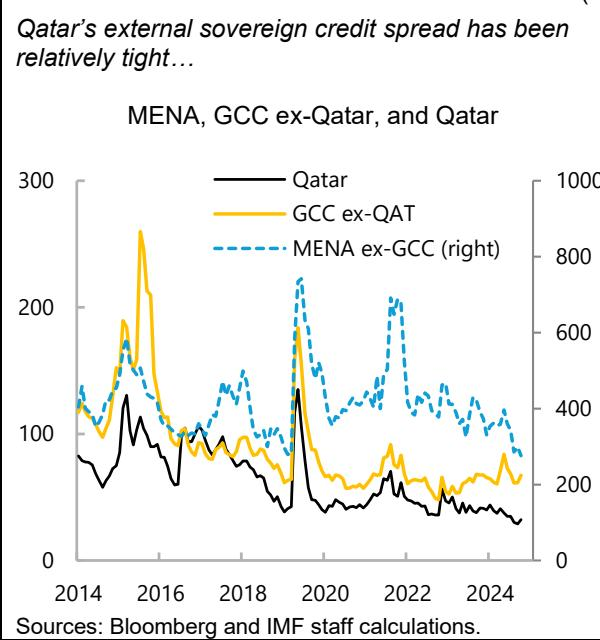  
...and has generally tightened underpinned by ongoing reforms and the favorable economic outlook.

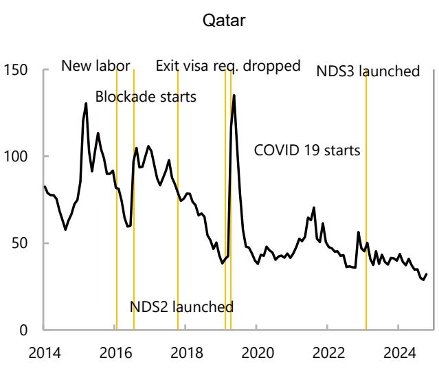  
Sources: Bloomberg and IMF staff calculations.

Reform momentum could be an important form of reassurance to markets about the prospects for economic stability, growth, and price stability. Global economic and policy uncertainty has risen to unprecedented levels, placing a premium on broad-based, careful, and coordinated implementation of reforms. So far, domestic uncertainty has remained contained in Qatar, reflecting economic and policy stability. Further reforms to boost productivity, enhance the business environment, and leverage digitalization and climate actions should continue to anchor domestic stability and enhance growth and resilience to external shocks.

## Figure 2. Global and Domestic Uncertainty

...heightened global uncertainty ...

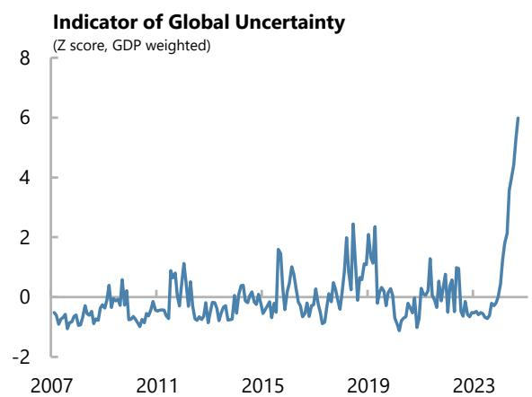

...while doemstic uncertainty has remained more contained in the region, especially Qatar.

Indicator of Doemstic Uncertainty in MENA and the US 1/ (Qatar period average = 1)

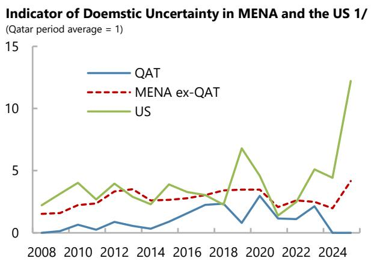  
Sources: Ahir, Bloom, and David Furceri. 2022. "World Uncertainty Index." NBER Working Paper 29763 and IMF staff calculations.  
1/ Annual average of monthly data. January–February for 2025.

Against this backdrop, this paper proposes a practical framework for assessing reform impact on a country's perceived resilience, finding a strong association between broad-based (not narrow) reform efforts and credit quality. Investors' perception of a country's resilience is proxied by external sovereign credit spreads. A standard econometric approach is used to estimate how these spreads are associated with indicators of reform progress, measured in terms of both the level of progress, and the balance of reforms, while accounting for other key determinants including macroeconomic conditions, oil prices, and global risk taking. The analysis is conducted using monthly data for six GCC states and twelve other MENA countries over the past decade with a specific focus on Qatar.

The rest of the paper is structured as follows. Section B discusses relevant literature while section C outlines the data and estimation strategy. Section D discusses baseline results while Section E discusses extensions. Section F summarizes findings and discusses policy implications for Qatar.

## II. The Literature

The economic literature has studied emerging market external sovereign credit spreads using a wide range of determinants. The literature has built upon foundational work that initially emphasized the role of macroeconomic fundamentals. More recent contributions have incorporated global financial conditions, market sentiment and, increasingly, the role of macroeconomic expectations (forecasts). Reforms have increasingly been recognized as a key driver when they are credible, tightening sovereign credit spreads by both reducing the expected probability of default through improved fundamentals and lowering perceived uncertainty.

Seminal work established the importance of country-specific macroeconomic variables in explaining sovereign risk premia. Edwards (1984) provided an early framework linking macroeconomic indicators to sovereign default risk. Subsequent research solidified the role of key fundamentals. The negative impact of high public debt levels on the sovereign's creditworthiness is supported by studies including Cline (1995) and

Reinhart and Rogoff (2009). The positive influence of economic growth on a country's ability to service debt is demonstrated in numerous studies including Cantor and Packer (1996). The negative effects of persistent fiscal and current account deficits on sovereign risk premiums are well-documented (e.g., Edwards, 1984; Min, 1998). While inflation's direct impact might be less clear, higher inflation rates are often viewed as a proxy for a lack of fiscal and monetary policy discipline and can contribute to political instability, thereby widening sovereign spreads. Our model will include these commonly used factors.

The literature has increasingly recognized the significant impact of global factors on sovereign risk premia. The crucial role of global risk appetite (often proxied by the VIX, or the implied volatility of a US stock option), global liquidity, and contagion was emphasized by authors including González-Rozada and Yeyati (2008), Kaminsky and Reinhart (2000), and Calvo and Reinhart (1996). Reinhart and Reinhart (2009) discuss capital flows bonanzas driven by external factors. Eichengreen and Mody (1998) highlight that investor sentiment can play a key role in dictating launch spreads. Our model will include oil prices and VIX to capture the influence of key global factors in MENA.

A more recent strand of the literature explicitly incorporates macroeconomic forecasts to capture the forward-looking nature of investor assessments. While not exclusively focused on forecasts, early work implicitly acknowledged the role of expectations by examining the impact of anticipated policy changes. Studies directly using survey-based forecasts have shown that expected improvements in macroeconomic variables are associated with tighter sovereign spreads (Cimadomo et al., 2014). In addition, forecast variables could alleviate the issue of potential reverse causality. $^{1}$ The availability and quality of forecast data for a broad range of countries can be a limitation, although this paper leverages forecasts of major macroeconomic variables for 18 MENA economies from FocusEconomics.

Finally, the literature finds that economic reforms are associated with tightening sovereign credit spreads, reflecting improved underlying economic strength and resilience, reducing uncertainty. Announcements and implementation of fiscal consolidation measures approved by legislative bodies often lead to a significant decline in sovereign credit spreads through confidence effects (David et al., 2022). Reforms in monetary policy institutions that enhance independence and credibility help the central bank anchor inflation expectations better, reduce uncertainty, and tighten the risk premium demanded by investors. Reforms that enhance a country's economic complexity tend to lower sovereign risk in the long run (Gomez-Gonzalez et al., 2025) while political and institutional reforms that improve economic fundamentals and investor confidence represent critical factors (Ajovalasit et al., 2024; Eichler, 2014).

## III. Estimation Strategy and Data

Sovereign credit spreads can be modeled using both dynamic and static approaches. A dynamic specification with the lagged dependent variable (LDV) is commonly used, where LDV captures persistence and the coefficients on the remaining control variables represent short-run effects. When panel data have a short time dimension, dynamic fixed effects estimators face the issue of Nickell bias, while the application of Generalized Method of Moments (GMM) approaches can be sensitive to instrument proliferation, weak instruments, or exhibit poor finite-sample properties. Simpler approaches that do not include LDV, or static specifications, are also used to estimate determinants of sovereign credits, including by Costantini et al. (2014), Csontó (2014), Eichler (2014), Jeanneret (2018), Li et al. (2024), Ordu-Akkaya and Özyıldırım (2025), Sy (2002), and Vu et al. (2015). Aside from pragmatism, one motivation for static approaches is to let the coefficients capture the long-run total effect and the contemporaneous impact, especially with large T and small N. Static approaches need to be complemented by appropriate standard errors to account for heteroskedasticity, autocorrelation consistent, and/or clustering (see ¶14).

We follow the latter strand of studies and specify the static baseline panel model with the form of equation (1).

$$
y _ {i, t} = \alpha + \beta_ {j} \sum_ {j} x _ {i, j, t} + \gamma_ {k} \sum_ {k} z _ {k, t} * (1 + \theta_ {l} \sum_ {l} D _ {l, t}) + \delta_ {i} + \varepsilon_ {i, t}\tag{1}
$$

The dependent variable $y_{i,t}$ is the external sovereign credit spreads in basis points of the country i in time t. EMBIG spreads, the tenors of which vary depending on the bonds included in each country's index are used for MENA ex-GCC. Credit default swap spreads (CDS), with 5-year tenors, are used for the GCC states for greater data availability. Among independent variables, domestic factors $x_{i,j,t}$ ( $j=1,2,\ldots$ ) are macroeconomic forecasts—real GDP growth, inflation (both in percent, year on year), overall fiscal and external current account balances and public debt (all in percent of GDP), news-based domestic uncertainty index (index value), and indicators of reform progress (average level to measure overall progress, and standard deviation of 5 sub-indices to measure the balance of reforms). External common factors $z_{k,t}$ (k=1,2) are real oil prices (US dollar per barrel, deflated by US inflation) and VIX (index value), both in log. Variables $D_{l,t}$ ( $l=1,2,\ldots$ ) represent either country group dummies or regime dummies, the latter capturing progress in economic diversification (1 when the share of hydrocarbon exports is relatively high) and macroeconomic resilience (1 when sovereign credit ratings, domestic uncertainty index, or public debt to GDP is relatively high). $\delta_{i}$ and $\varepsilon_{i,t}$ are the country fixed effects, which are time-invariant, and the error term. $\alpha$ , $\beta$ , $\gamma$ , and $\theta$ are parameters to be estimated.

An unbalanced panel of data with mixed frequencies for 18 MENA countries is used. In this paper, estimated coefficients on macroeconomic forecasts, oil prices, and investor sentiment (VIX) are used to assess the impact of reforms. In addition, it considers indices of reform progress in five key areas in terms of both average level and standard deviation—Bolen and Sobel (2020) find that the latter variable (standard deviation) capturing the extent of holistic reforms has strong explanatory power. Sovereign credit spreads, macroeconomic forecasts, domestic uncertainty, oil prices, and VIX are monthly. Indicators of reform progress (average and standard deviation), share of hydrocarbon exports, and sovereign credit ratings are annual and repeated for 12 months. Monthly data span December 2014–September 2025, dictated by the availability of forecast data, and cover six GCC and twelve other MENA countries.

Raw data are processed as follows. Monthly forecasts for current and following years are, with moving weights, converted into 12-month constant horizon, similar to Chan et al. (2015) and Gadanecz et al. (2018). Raw data exhibit large variation due to the heterogeneity in the included country sample, complicating the use in a panel format. As an option to mitigate such a challenge, all data are standardized by country into z-score (i.e., distance from the average in the number of standard deviations). The transformation involves demeaning and removing country fixed effects. Finally, 1 percent of data in each tail is dropped (“winsorized”).

The data are generally stationary and errors are adjusted for serial correlation. Results from the Fisher-type augmented Dickey–Fuller test show that the data are generally stationary. The balance of reform, available only annually, is repeated for 12 months and therefore is not stationary—we proceed with the data as such without applying adjustment measures. Serial correlation would emerge from the 12-month moving average transformation discussed above, in addition to the persistence of the dependent variable. Indeed, the Wooldridge test applied to the baseline multivariate specification confirms panel autocorrelation. We therefore use Newey-West standard errors (with 12 lags, accounting for serial correlation from the 12-month moving transformation) which yield results that are similar to results from the Driscoll–Kraay standard errors (which additionally account for cross-sectional dependence).

## IV. Baseline Panel Results

Baseline panel results are presented in two ways. To check how well the model works, that is, whether the estimated coefficients yield expected signs with statistical significance, baseline panel results are obtained by introducing the control variables one by one—univariate models—and also by introducing all of them in one go—a multivariate model.

Baseline panel univariate regression results broadly yield expected signs (Table 1, “Univariate”; and Table A1, models 1–12). When one regressor is used at a time, tightening of sovereign credit spreads is associated with improvements in the forecasts of economic conditions (higher GDP growth, better fiscal and current account balances, and lower inflation), lower domestic uncertainty, greater progress in reform (a higher average index value), more holistic reform (lower standard deviation of index values), and lower global risk aversion (VIX), all statistically significant at least at the 5 percent level. Higher oil prices are associated with tighter sovereign spreads for oil exporters, but they have little systematic impact on oil importers. Surprisingly, public debt-to-GDP forecasts do not show systematic association with sovereign credit spreads.

A baseline multivariate panel regression model yields comparable results while some explanatory variables lose statistical significance (Table 1, “Multivariate”; Table A1, model 13). Inflation forecasts, wholistic reform, oil prices (with differing effects for oil exporters and importers), and VIX remain statistically significant. By contrast, forecasts for real GDP growth and the current account balance are statistically significant only at the 10 percent level. Forecasts of the fiscal balance and the average level of reform lose significance, as their effects on sovereign credit spreads are largely accounted for by other variables—the macroeconomic variables may be correlated by nature, or the way analysts forecast these variables may be correlated. The in-sample predictions generally look reasonable, although factors outside of the model seem to strongly dictate sovereign credit spreads for some countries (Figure A1). In what follows we drop public debt-to-GDP forecasts, domestic uncertainty, and the average level of reform due to lack of statistical significance in

the multivariate model (public debt-to-GDP forecasts and domestic uncertainty will be used as dummy variables to capture different regimes).

Table 1. Determinants of External Sovereign Credit Spreads in MENA 1/

<table><tr><td></td><td>Univariate</td><td>Multivariate</td></tr><tr><td colspan="3">Macroeconomic forecasts</td></tr><tr><td>Real GDP growth fcst.</td><td>(-)</td><td>...</td></tr><tr><td>Inflation fcst.</td><td>(+)</td><td>(+)</td></tr><tr><td>Fiscal balance fcst.</td><td>(-)</td><td>...</td></tr><tr><td>Public debt fcst.</td><td>...</td><td>...</td></tr><tr><td>Current account fcst.</td><td>(-)</td><td>...</td></tr><tr><td>Domestic uncertainty</td><td>(+)</td><td>...</td></tr><tr><td colspan="3">Reform</td></tr><tr><td>Average</td><td>(-)</td><td>...</td></tr><tr><td>Balance</td><td>(+)</td><td>(+)</td></tr><tr><td colspan="3">External shock</td></tr><tr><td>Real oil prices, oil exporters</td><td>(-)</td><td>(-)</td></tr><tr><td>Real oil prices, oil importers</td><td>...</td><td>(+)</td></tr><tr><td>VIX</td><td>(+)</td><td>(+)</td></tr></table>

Sources: Bloomberg, FocusEconomics, Fraser Institute Economic Freedom database, Haver, and IMF staff calculations. 1/ Univariate models use one explanatory variable at a time. Multivariate model uses all explanatory variables together. Showing signs when significant at the $5\%$ level or more. "..." when statistically in significant. See Table A1 for the underlying estimates.

## V. Extension: Impact of Reforms on Sovereign Credit Quality

This section unpacks the indicator of reform and discusses the estimated effects of key reforms on perceived sovereign credit quality. Using the reform indicator, progress is analyzed for three country groups over time (MENA ex-GCC, GCC ex-Qatar, and Qatar for 2000–22), in terms of both level and balance. Subsequently, we econometrically estimate the extent to which progress in key reform areas—the balance of reform, fiscal policy, monetary policy, economic diversification, public debt, and domestic uncertainty—is associated with improvements in perceived sovereign credit quality. In doing so, specific effects for the GCC, especially for Qatar are estimated by interacting country dummy variables with the explanatory variables of interest.

## Indicator of Reform

Qatar has made progress in overall reforms over the past decade, with more room to enhance “sound money” and the balance of reform. The GCC states are generally ahead of other MENA economies in reform progress (in Figure 3, panel 1, the markers for the GCC are positioned above those for MENA ex-GCC). From 2000 to 2022, Qatar’s level of overall reform improved, similar to its GCC peers (for instance, Qatar “moved up” from the empty circle in 2000 to the square in 2022). Qatar’s progress is mainly attributed to improvements in

two sub-components—sound money (money growth, inflation, and inflation volatility) and international trade (panel 2). $^{2}$ When these five components for Qatar are benchmarked against its GCC peers using 2022 data, Qatar performs well in international trade (in panel 3, the empty blue square for Qatar is above the green solid square for the GCC ex-Qatar) but lags in sound money. Finally, an indicator of holistic reform, the balance of reform, improved for the GCC peers (in panel 4, standard deviation of the five sub-components declined from the empty circle in 2000 to the empty square in 2022). $^{3}$ By contrast, the balance of reform worsened for Qatar, consistent with the earlier observation from panel 2 that sound money and international trade improved, regulation worsened, while changes in the other three components were muted, thereby increasing variation among them. We will see in the next section that these observations are broadly consistent with the regression results.

We consider holistic and synchronized economic reform as positive for economic resilience and sovereign credit quality. In theory, both high and low variations in reform progress could be positive. Strategic, “high-variation” reforms, at least in the short run, could be superior if effective processes prioritize impact and feasibility by targeting the most distortionary and politically feasible areas first. By contrast, Bolen and Sobel (2020) interpret their econometric results showing low-variation reforms are associated with stronger economic growth, suggesting that improving the worst areas is more beneficial to growth. Similarly, we conjecture that in the longer run, reforms in lagging areas should also progress, reducing variations across reforms. Moreover, low-variation reforms would maximize complementary effects among reforms in different areas and demonstrate political capacity and commitment, boosting credibility among investors and facilitating positive economic outcomes.

With this in mind, an indicator of holistic reform, the balance of reform, improved for the GCC peers (in panel 4, standard deviation of the five sub-components declined from the empty circle in 2000 to the empty square in 2022). By contrast, the balance of reform worsened for Qatar, consistent with the earlier observation from panel 2 that sound money and international trade improved, regulation worsened, while changes in the other three components were muted, thereby increasing variation among them. We will see in the next section that these observations are broadly consistent with the regression results.

## Estimated Impact of Reforms

## Holistic reform (Figure 4, panel 1)

Econometric results suggest investors pay attention to how holistic reforms are in assessing sovereign credit quality, particular for Qatar. The estimated coefficient for the entire sample shows that an improvement in the balance of reform (a decline in the measure) by one standard deviation is accompanied by tightening of sovereign credit spreads by around a fifth of a standard deviation. The impact is larger for Qatar (one-third) and its GCC peers (0.28), even though the point estimates are statistically no different from each

Sources: Fraser Institute Economic Freedom dataset and IMF staff calculations.

other (that is, the ranges between the green dots overlap). While tentative, investors seem to pay more attention to Qatar's balance of reform, potentially as Qatar has currently more room to make progress in this area.

Qatar has made progress in overall reform ...

Figure 3. Indicators of Reform in MENA

...owing to sound money and international trade even though regulation worsened.

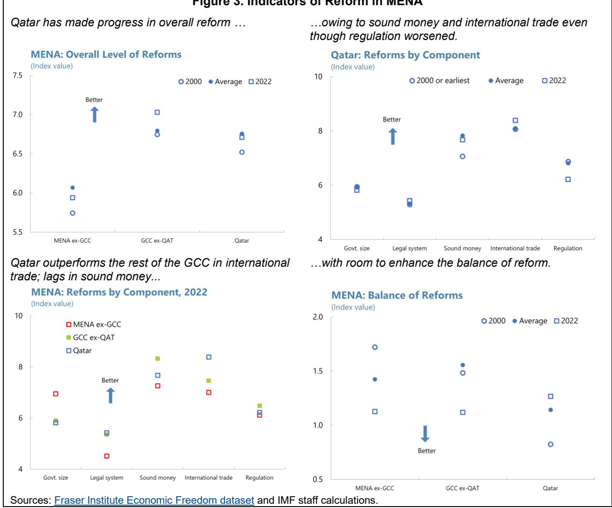  
Qatar outperforms the rest of the GCC in international trade; lags in sound money...

## Fiscal policy (Figure 4, panel 2)

## Continued fiscal spending discipline is key for Qatar to maintain strong sovereign credit quality.

Forecasts of the overall fiscal balance systematically affect Qatar's sovereign credit quality when the balance of reform is not included in the model, with the estimated coefficient at 0.7. One interpretation is that investors pay attention to Qatar's fiscal spending discipline (of the total fiscal balance, real oil prices included in the model would capture the hydrocarbon fiscal revenue component). Qatar has demonstrated fiscal discipline over the past decades by progressively reducing total expenditure as a share of non-hydrocarbon GDP, and in the recent years even when hydrocarbon revenue jumped, positively affecting investor perception of sovereign credit quality. This contrasts with how fiscal spending forecasts do not systematically affect sovereign credit quality in MENA nor in the GCC ex-Qatar—regardless of whether the model includes the balance of reform or not.

Moreover, for Qatar fiscal spending discipline may be viewed as an integral part of holistic reform and economic diversification. The coefficient on fiscal balance forecasts for Qatar remains significant but falls in size (from 0.7 to 0.45) when the balance of reform for MENA is controlled for, even though the point estimate is not statistically different from the one discussed above. Interestingly, the coefficient loses significance when the balance of reform for Qatar is controlled for. One interpretation is that fiscal spending discipline may be viewed by investors as an integral part of holistic reform, or a proxy for it for Qatar. Fiscal discipline in Qatar may demonstrate broader political capacity and commitment, similar to how we view holistic reform. Another interpretation is that global investors see fiscal spending discipline and economic diversification (and related productive fiscal spending, to the extent that holistic reform relates to economic diversification) as mutually important for maintaining strong sovereign credit quality. Finally, the two variables may be affected by a “common factor” such as the overarching reform effort and progress.

Monetary policy (Figure 4, panel 3)

Maintaining low and stable inflation expectations is essential for safeguarding strong sovereign credit quality. The estimated coefficient on inflation expectations is significant for all three country groups, highlighting the importance of the macroeconomic indicator for perceived sovereign credit quality. Moreover, the point estimate for Qatar at 0.63 exceeds that for its GCC peers at 0.36, potentially as Qatar has more room to enhance its “sound money” institutions relative to its GCC peers, and therefore global investors seem to pay more attention to it. More broadly, inflation expectation anchoring is often used to gauge monetary policy credibility, and as discussed in Annex V to the 2026 Staff Report, Qatar performs well in monetary policy credibility.

## Economic diversification (Figure 4, panel 4)

The extent of economic diversification affects how investors assess the susceptibility of sovereign credits to oil price movement. Earlier regression results highlighted that sovereign credits of oil exporters are sensitive to movements in the oil price. To complement, a dummy variable is used to capture countries (and periods) in the highest quartile of hydrocarbon exports of total exports every month (i.e., a country can drop out or join the top quartile dynamically over the sample period). Results show that when oil prices rise sovereign credit spreads of countries (and periods) with high shares of hydrocarbon exports tighten with a coefficient of 0.32. No association was found in other countries (and periods). MENA oil-exporting countries per IMF classification also exhibit a similar response to oil price swings. No statistically significant association was found for MENA countries with low to medium shares of hydrocarbon exports, suggesting there is a significant threshold effect.

## Figure 4. Impact of Economic Reforms on External Sovereign Credit Spreads in MENA 1/ (In number of standard deviation)

Maintaining Qatar's strong sovereign quality would call for progress in holistic reform....

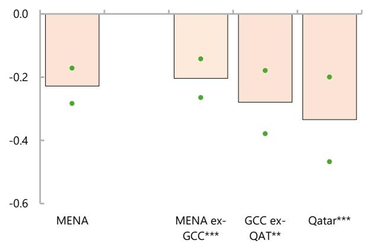  
...maintaining low and stable inflation expectations and central bank credibility...

...continued fiscal spending consolidatiaon, which may be viewed as an integral part of Qatar's holistic reform...

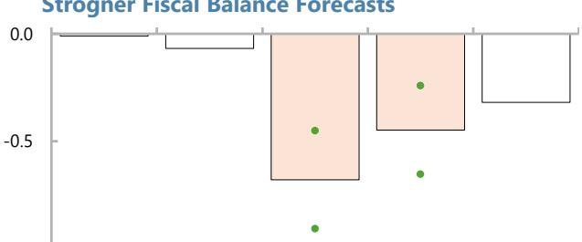

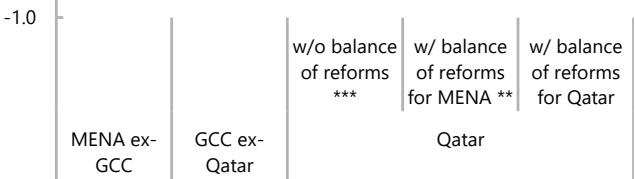  
...and continued economic diversification.

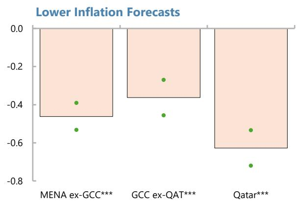  
Qatar's economic resilience to shocks is underpinned including by low public debt to GDP...

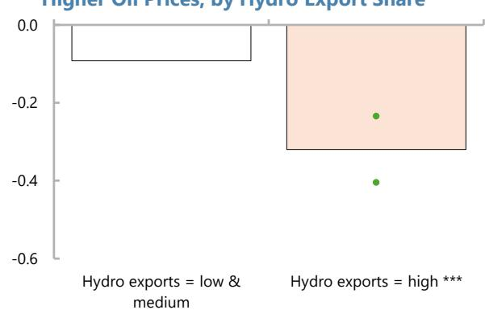

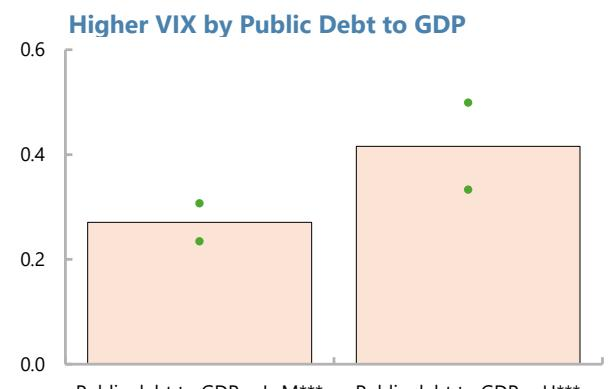  
...and stability and certainty of economic prospects domestically.

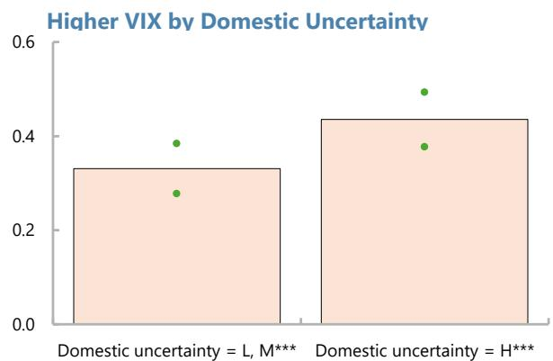  
Source: Bloomberg, FocusEconomics, Fraser Institute Economic Freedom database, Haver, and IMF staff calculations. 1/ Panels show the impact of a one standard deviation increase in the independent variables on external sovereign credit spreads expressed in the number of standard deviations. See Tables A3 and A4 for the underlying econometric results. The green dots indicate the 68 percent confidence intervals, and the starts next to the labels statistical significance of the point estimates (\*, \*\*, and \*\*\* when statistically significant at the 10, 5, and 1 percent levels).

Public sector debt and economic certainty (Figure 4, panels 5–6)

Tentative evidence suggests that reforms increase resilience to swings in global investor sentiment. While earlier findings suggested that sovereign credit spreads are not systematically affected by public debt-to-GDP forecasts and domestic uncertainty themselves, the latter two could still affect the susceptibility of sovereign credit spreads to global investor sentiment. To this end, dummy variables were created to classify countries (and periods) by the level of public debt-to-GDP and domestic uncertainty. Estimated results suggest that countries (and periods) with lower public debt-to-GDP and domestic uncertainty are associated with a smaller increase in sovereign credit spreads in response to weaker global risk taking, captured by a rise in VIX. However, the estimated coefficients by the level of domestic uncertainty are not different from each other at the 68 percent confidence interval.

## VI. Summary Discussions

This study finds that investor perception of sovereign credit quality is strongly associated with macroeconomic fundamentals and progress in reforms. Global investors associate holistic reforms and fiscal spending discipline with stronger sovereign credit quality. Particularly for Qatar, investors may consider that fiscal spending discipline demonstrates broader political capacity and commitment, thus as an integral part of holistic reform and economic diversification. Perceived sovereign credit quality is also bolstered by strong monetary policy credibility that anchors inflation expectations low and stable. Progress in economic diversification, reduction in public debt, and greater stability and certainty of economic prospects underpin the resilience of sovereign credits to external shocks (swings in oil prices and global risk sentiment).

Several observations emerge for Qatar. $^{4}$ First, balanced, holistic, and coordinated reform implementation guided by NDS3—introduced in 2024 to intensify reform to achieve Qatar Vision 2030—would be highly beneficial. Second, continued fiscal spending discipline would help Qatar maintain its strong sovereign credit quality, supported by enhanced fiscal policy signaling underpinned by the budget and a medium-term fiscal framework. Third, findings also highlighted the benefits from the ongoing transformation of the Qatar Central Bank (QCB) including enhancing the monetary policy operational framework and central bank communication, which would bolster central bank credibility. Continued progress in economic diversification, reduction in public debt (while balancing the objective of deepening domestic capital markets) and greater certainty and stability of economic prospects all enhance the resilience of sovereign credits to external shocks (associated with commodity prices or global investor sentiment).

The limitations of this paper and the direction of future research are in order. While we took a stance consistent with the literature that holistic, “low-variation” reforms are superior especially in the long run, the benefits from focused, “high-variation” reforms at least in the short run could be important, representing a potential area for future research. Methodologically, teasing out short-run effects potentially using LDV to capture short-run adjustments in credit spreads, could be explored. While this study anchored econometric analysis on Qatar, future research could consider focusing on other hydrocarbon and commodity exporters within MENA and beyond.

## Appendix Table and Figure

<table><tr><td colspan="14">Table A1. Determinants of External Sovereign Credit Spreads in MENA 1/</td></tr><tr><td>Model #</td><td>1</td><td>2</td><td>3</td><td>4</td><td>5</td><td>6</td><td>7</td><td>8</td><td>9</td><td>10</td><td>11</td><td>12</td><td>13</td></tr><tr><td>Real GDP growth fcst.</td><td>-0.352 ***(0.051)</td><td></td><td></td><td></td><td></td><td></td><td></td><td></td><td></td><td></td><td></td><td></td><td>-0.091 *(0.049)</td></tr><tr><td>Inflation fcst.</td><td></td><td>0.330 ***(0.062)</td><td></td><td></td><td></td><td></td><td></td><td></td><td></td><td></td><td></td><td></td><td>0.430 ***(0.061)</td></tr><tr><td>Fiscal balance fcst.</td><td></td><td></td><td>-0.232 ***(0.060)</td><td></td><td></td><td></td><td></td><td></td><td></td><td></td><td></td><td></td><td>-0.043(0.067)</td></tr><tr><td>Public debt fcst.</td><td></td><td></td><td></td><td>0.000(0.056)</td><td></td><td></td><td></td><td></td><td></td><td></td><td></td><td></td><td>-0.070(0.051)</td></tr><tr><td>Current account fcst.</td><td></td><td></td><td></td><td></td><td>-0.220 ***(0.056)</td><td></td><td></td><td></td><td></td><td></td><td></td><td></td><td>-0.105 *(0.058)</td></tr><tr><td>Domestic uncertainty index</td><td></td><td></td><td></td><td></td><td></td><td>0.132 **(0.057)</td><td></td><td></td><td></td><td></td><td></td><td></td><td>0.023(0.034)</td></tr><tr><td>Real oil prices, all economies</td><td></td><td></td><td></td><td></td><td></td><td></td><td>-0.230 ***(0.067)</td><td></td><td></td><td></td><td></td><td></td><td>...</td></tr><tr><td>Real oil prices, oil exporters</td><td></td><td></td><td></td><td></td><td></td><td></td><td></td><td>-0.472 ***(0.076)</td><td></td><td></td><td></td><td></td><td>-0.421 ***(0.080)</td></tr><tr><td>Real oil prices, oil importers</td><td></td><td></td><td></td><td></td><td></td><td></td><td></td><td></td><td>0.060(0.101)</td><td></td><td></td><td></td><td>0.173 **(0.080)</td></tr><tr><td>VIX</td><td></td><td></td><td></td><td></td><td></td><td></td><td></td><td></td><td></td><td>0.277 ***(0.045)</td><td></td><td></td><td>0.359 ***(0.042)</td></tr><tr><td>Level of reform</td><td></td><td></td><td></td><td></td><td></td><td></td><td></td><td></td><td></td><td></td><td>-0.119 *(0.062)</td><td></td><td>0.030(0.048)</td></tr><tr><td>Balance of reform</td><td></td><td></td><td></td><td></td><td></td><td></td><td></td><td></td><td></td><td></td><td></td><td>0.226 ***(0.061)</td><td>0.192 ***(0.047)</td></tr><tr><td>Intercept</td><td>-0.021(0.057)</td><td>-0.024(0.056)</td><td>-0.024(0.059)</td><td>-0.023(0.061)</td><td>-0.022(0.059)</td><td>0.076(0.079)</td><td>0.014(0.061)</td><td>0.017(0.058)</td><td>0.003(0.061)</td><td>-0.006(0.061)</td><td>0.001(0.062)</td><td>-0.006(0.060)</td><td>0.004(0.048)</td></tr><tr><td>Number of observations</td><td>2130</td><td>2122</td><td>2141</td><td>2151</td><td>2138</td><td>1348</td><td>2164</td><td>2164</td><td>2164</td><td>2179</td><td>2100</td><td>2100</td><td>1281</td></tr></table>

Sources: Bloomberg, FocusEconomics, Fraser Institute Economic Freedom database, Haver, and IMF staff calculations. 1/ The dependent variable is the external sovereign credit spread. \* p<.1; \*\* p<.05; \*\*\* p<.01. Standard error in parenthesis. Sample includes Armenia, Azerbaijan, Bahrain, Egypt, Georgia, Iraq, Kazakhstan, Kuwait, Lebanon, Morocco, Oman, Pakistan, Qatar, Saudi Arabia, Tajikistan, Tunisia, the United Arab Emirates, and Uzbekistan. Current and next year monthly forecasts are converted to 12-month constant horizon forecasts. External sovereign credit spreads are in percent, real GDP growth and inflation forecasts are in percent year on year, fiscal and current account balances and public debt forecasts are in percent of GDP, real oil prices and VIX are in log. Level and balance of reforms are the average and standard deviation of scores in 5 areas. Variables are converted to z score (difference from mean in the number of standard deviation). Using Newey-West standard errors, robust estimators that adjust for both heteroscedasticity (non-constant variance) and autocorrelation (correlation between error terms over time), with 12 lags to account for potential bias stemming from moving averages.

## Figure A1. Actual and Predicted External Sovereign Credit Spreads in MENA 1/ (In number of standard deviations from mean)

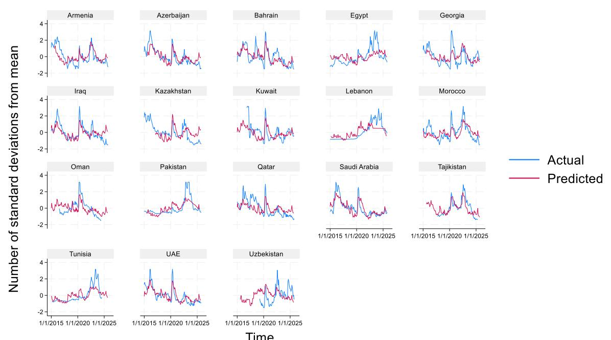

1/ Using multivariate baseline results, without domestic uncertainty and level and balance of reforms as the coefficients are not statistically significant, and as these variables are not available for some of the countries.

## Table A2. Constituencies of Five Sub-Components

Below lists the direction of changes in the constituencies to improve each subcomponent of reform indicator.

\- Govt size: Lower government spending (separately for consumption, subsidies, and investment); Lower marginal tax rates for lower income thresholds; and lower government ownership of the economy.

\- Legal system: Greater independence of the judiciary from political influence; more impartial courts; greater property rights; less military involvement in politics; greater integrity of the legal system; better contract enforcement; time and cost for transferring property ownership; better police service.

\- Sound money: Greater consistency of money growth with output growth; lower inflation volatility; lower inflation; foreign exchange bank accounts permissible domestically and abroad with no restriction.

\- International trade: Lower level and variation in tariffs, non-tariff measures, and time cost of importing and exporting; lower parallel exchange rate market gap; higher capital account openness; greater freedom for foreigners to visit; and stronger protection of nonresident-owned assets.

• Regulations: Credit market, labor market, and business regulation.

Sources: Fraser Institute Economic Freedom dataset and IMF staff.

Table A3. Determinants of External Sovereign Credit Spreads in the GGC and Qatar 1/

<table><tr><td rowspan="2">Model #</td><td>14</td><td>15</td><td>16</td><td>17</td><td>18</td><td>19</td></tr><tr><td colspan="2">GCC</td><td colspan="2">Qatar</td><td colspan="2">GCC and Qatar</td></tr><tr><td>Real GDP growth fcst.</td><td>-0.218 ***(0.065)</td><td>-0.221 ***(0.066)</td><td>-0.219 ***(0.053)</td><td>-0.219 ***(0.053)</td><td>-0.219 ***(0.065)</td><td>-0.221 ***(0.066)</td></tr><tr><td>GCC (total effects)</td><td>-0.059(0.060)</td><td>-0.044(0.061)</td><td></td><td></td><td>-0.150 **(0.066)</td><td>-0.1429 **(0.066)</td></tr><tr><td>Qatar (total effects)</td><td></td><td></td><td>-0.172 **(0.078)</td><td>-0.129 *(0.072)</td><td>-0.171 **(0.079)</td><td>-0.129 *(0.072)</td></tr><tr><td>Inflation fcst.</td><td>0.468 ***(0.071)</td><td>0.462 ***(0.071)</td><td>0.438 ***(0.052)</td><td>0.438 ***(0.052)</td><td>0.466 ***(0.071)</td><td>0.462 ***(0.071)</td></tr><tr><td>GCC (total effects)</td><td>0.399 ***(0.073)</td><td>0.368 ***(0.081)</td><td></td><td></td><td>0.381 ***(0.081)</td><td>0.36271 ***(0.093)</td></tr><tr><td>Qatar (total effects)</td><td></td><td></td><td>0.699 ***(0.114)</td><td>0.628 ***(0.092)</td><td>0.697 ***(0.115)</td><td>0.628 ***(0.093)</td></tr><tr><td>Fiscal balance fcst.</td><td>0.045(0.063)</td><td>0.046(0.064)</td><td>0.021(0.055)</td><td>0.021(0.055)</td><td>0.045(0.064)</td><td>0.046(0.064)</td></tr><tr><td>GCC (total effects)</td><td>-0.103(0.113)</td><td>-0.068(0.111)</td><td></td><td></td><td>-0.022(0.113)</td><td>-0.0019(0.115)</td></tr><tr><td>Qatar (total effects)</td><td></td><td></td><td>-0.447 **(0.206)</td><td>-0.319(0.255)</td><td>-0.444 **(0.208)</td><td>-0.319(0.256)</td></tr><tr><td>Current account fcst.</td><td>-0.081(0.058)</td><td>-0.082(0.058)</td><td>-0.108(0.053)</td><td>-0.109(0.053)</td><td>-0.081(0.058)</td><td>-0.082(0.058)</td></tr><tr><td>GCC (total effects)</td><td>-0.107(0.098)</td><td>-0.078(0.098)</td><td></td><td></td><td>-0.095(0.105)</td><td>-0.069(0.106)</td></tr><tr><td>Qatar (total effects)</td><td></td><td></td><td>-0.052(0.123)</td><td>-0.102(0.147)</td><td>-0.054(0.123)</td><td>-0.102(0.148)</td></tr><tr><td>Balance of reform</td><td>0.224 ***(0.053)</td><td>0.204 ***(0.061)</td><td>0.215 ***(0.048)</td><td>0.212 ***(0.049)</td><td>0.218 ***(0.053)</td><td>0.204 ***(0.061)</td></tr><tr><td>GCC (total effects)</td><td></td><td>0.317 ***(0.087)</td><td></td><td></td><td></td><td>0.280 **(0.100)</td></tr><tr><td>Qatar (total effects)</td><td></td><td></td><td></td><td>0.334 ***(0.134)</td><td></td><td>0.334 ***(0.134)</td></tr><tr><td>Real oil prices, all economies</td><td>-0.049(0.073)</td><td>-0.050(0.074)</td><td>-0.104 *(0.062)</td><td>-0.105 *(0.062)</td><td>-0.049(0.074)</td><td>-0.050(0.074)</td></tr><tr><td>GCC (total effects)</td><td>-0.319 ***(0.087)</td><td>-0.325 ***(0.084)</td><td></td><td></td><td>-0.296 ***(0.094)</td><td>-0.298 ***(0.093)</td></tr><tr><td>Qatar (total effects)</td><td></td><td></td><td>-0.326 **(0.163)</td><td>-0.339 **(0.162)</td><td>-0.327 **(0.163)</td><td>-0.339 **(0.162)</td></tr><tr><td>VIX</td><td>0.308 ***(0.050)</td><td>0.306 ***(0.050)</td><td>0.337 ***(0.041)</td><td>0.337 ***(0.041)</td><td>0.308 ***(0.050)</td><td>0.306 ***(0.050)</td></tr><tr><td>GCC (total effects)</td><td>0.338 ***(0.060)</td><td>0.353 ***(0.059)</td><td></td><td></td><td>0.380 ***(0.063)</td><td>0.389 ***(0.063)</td></tr><tr><td>Qatar (total effects)</td><td></td><td></td><td>0.231 ***(0.076)</td><td>0.255 ***(0.078)</td><td>0.232 ***(0.076)</td><td>0.255 ***(0.078)</td></tr><tr><td>Dummy, GCC</td><td>0.041(0.084)</td><td>0.040(0.083)</td><td></td><td></td><td>0.043(0.089)</td><td>0.042(0.089)</td></tr><tr><td>Dummy, Qatar</td><td></td><td></td><td>0.027(0.088)</td><td>0.030(0.085)</td><td>-0.005(0.100)</td><td>-0.002(0.097)</td></tr><tr><td>Intercept</td><td>-0.035(0.059)</td><td>-0.035(0.059)</td><td>-0.025(0.047)</td><td>-0.025(0.047)</td><td>-0.035(0.059)</td><td>-0.035(0.059)</td></tr><tr><td>Number of observations</td><td>2013</td><td>2013</td><td>2013</td><td>2013</td><td>2013</td><td>2013</td></tr></table>

Sources: Bloomberg, FocusEconomics, Fraser Institute Economic Freedom database, Haver, and IMF staff calculations. 1/ The dependent variable is the external sovereign credit spread. \* p<.1; \*\* p<.05; \*\*\* p<.01. Standard error in parenthesis. Sample includes Bahrain, Kuwait, Oman, Qatar, Saudi Arabia, and the United Arab Emirates. Current and next year monthly forecasts are converted to 12-month constant horizon forecasts. External sovereign credit spreads are in percent, real GDP growth and inflation forecasts are in percent year on year, fiscal and current account balance forecasts are in percent of GDP, real oil prices and VIX are in log. Balance of reform is standard deviation of scores in 5 areas. Variables are converted to z score (difference from mean in the number of standard deviation). Using Newey-West standard errors, robust estimators that adjust for both heteroscedasticity (non-constant variance) and autocorrelation (correlation between error terms over time), with 12 lags to account for potential bias stemming from moving averages.

<table><tr><td colspan="5">Table A4. Determinants of External Sovereign Credit Spreads in MENA 1/</td></tr><tr><td>Model #</td><td>20</td><td>21</td><td>22</td><td>23</td></tr><tr><td>Real GDP growth fcst.</td><td>-0.179 ***(0.047)</td><td>-0.178 ***(0.047)</td><td>-0.159 ***(0.047)</td><td>-0.089 *(0.052)</td></tr><tr><td>Inflation fcst.</td><td>0.462 ***(0.050)</td><td>0.459 ***(0.050)</td><td>0.470 ***(0.048)</td><td>0.486 ***(0.064)</td></tr><tr><td>Fiscal balance fcst.</td><td>0.004(0.054)</td><td>0.006(0.053)</td><td>0.006(0.056)</td><td>0.017(0.068)</td></tr><tr><td>Current account fcst.</td><td>-0.113 **(0.051)</td><td>-0.112 **(0.051)</td><td>-0.106 **(0.051)</td><td>-0.222 ***(0.064)</td></tr><tr><td>Balance of reform</td><td>0.232 ***(0.047)</td><td>0.228 ***(0.046)</td><td>0.239 ***(0.046)</td><td>0.218 ***(0.055)</td></tr><tr><td colspan="5">Oil prices and hydrocarbon exports</td></tr><tr><td>Real oil prices</td><td>-0.082(0.065)</td><td>-0.084(0.064)</td><td>-0.092(0.064)</td><td>-0.040(0.075)</td></tr><tr><td>Real oil prices, hydro exports = H (total effect)</td><td>-0.315 ***(0.085)</td><td>-0.320 ***(0.085)</td><td>-0.325 ***(0.084)</td><td>-0.416 ***(0.084)</td></tr><tr><td>Dummy, hydro exports = H</td><td>0.052(0.089)</td><td>0.043(0.092)</td><td>0.092(0.093)</td><td>0.159(0.106)</td></tr><tr><td colspan="5">VIX and credit ratings, public debt, and domestic uncertainty</td></tr><tr><td>VIX</td><td>0.322 ***(0.039)</td><td>0.341 ***(0.049)</td><td>0.271 ***(0.036)</td><td>0.331 ***(0.053)</td></tr><tr><td>VIX, ratings = H (total effect)</td><td></td><td>0.271 ***(0.058)</td><td></td><td></td></tr><tr><td>VIX, debt to GDP = H (total effect)</td><td></td><td></td><td>0.416 ***(0.083)</td><td></td></tr><tr><td>VIX, domestic uncertainty = H (total effect)</td><td></td><td></td><td></td><td>0.435 ***(0.058)</td></tr><tr><td>Dummy (ratings, debt/GDP, DU)</td><td></td><td>0.037(0.088)</td><td>0.136(0.113)</td><td>0.071(0.064)</td></tr><tr><td>Intercept</td><td>-0.037(0.053)</td><td>-0.045(0.059)</td><td>-0.099(0.061)</td><td>-0.052(0.070)</td></tr><tr><td>Number of observations</td><td>2013</td><td>2013</td><td>2013</td><td>1297</td></tr></table>

## References

Ajovalasit, Samantha, Andrea Consiglio, Giovanni Pagliardi, and Stavros Zenios. 2024 “Incorporating political risk into analysis of sovereign debt sustainability.” Bruegel.

Bolen, J. Brandon and Russell S. Sobel. 2020. "Does balance among areas of institutional quality matter for economic growth?" Southern Economic Journal 86(4): 1418–45.

Calvo, Sara, and Carmen Reinhart. 1996. "Capital flows to Latin America: Is there evidence of contagion effects?" World Bank Policy Research Working Paper 1619.

Cantor, Richard, and Frank Packer. 1996. “Determinants and impact of sovereign credit ratings.” Economic Policy Review, 2 (2), 37–53.

Chan, Tracy, Ken Miyajima, and M.S. Mohanty. 2015. “Emerging market local currency bonds: Diversification and stability.” Emerging Markets Review, 22, 126–39.

Chernov, Mikhail, Lukas Schmid, and Andres Schneider. 2020. “A Macrofinance View of U.S. Sovereign CDS Premiums.” Journal of Finance, 75, 5, pp. 2809–44.

Cimadomo, Jacopo, Peter Claeys, and Marcos Poplawski-Ribeiro. 2014. “How do financial institutions forecast sovereign spreads?” European Central Bank Working Paper Series 1750.

Cline, William R. 1995. International debt reexamined. Peterson Institute for International Economics.

Costantini, Mauro, Matteo Fragetta, and Giovanni Melina. 2014. “Determinants of sovereign bond yield spreads in the EMU: An optimal currency area perspective.” European Economic Review, 70, 337–49.

Csontó, Balázs. 2014. “Emerging market sovereign bond spreads and shifts in global market sentiment.” Emerging Markets Re-view, 20, 58–74.

David, Antonio, Jaime Guajardo, and Juan Yépez. 2022. “The rewards of fiscal consolidations: Sovereign spreads and confidence effects.” Journal of International Money and Finance, 123, May, 102602.

Edwards, Sebastian. 1984. “LDC foreign borrowing and default risk: An empirical investigation, 1976-80.” The American Economic Review, 74 (4), 726–34.

Eichengreen, Barry, and Ashoka Mody. 1998. "What explains changing spreads on emerging market debt?" in Capital Flows and the Emerging Economies: Theory, Evidence, and Controversies. ed. Sebastian Edwards. 107–134. University of Chicago Press.

Eichler, Stefan. 2014. “The political determinants of sovereign bond yield spreads.” Journal of International Money and Finance, 46, September, 82–103.

Gadanecz, Blaise, Ken Miyajima, and Chang Shu. 2018. “Emerging market local currency sovereign bond yields: The role of exchange rate risk.” International Review of Economics and Finance, 57, 371–401.

Gomez-Gonzalez, Jose E., Jorge M. Uribe, and Óscar M. Valencia. 2025. “Sovereign debt cost and economic complexity.” Journal of International Financial Markets, Institutions and Money, 99, March, 102121.

González-Rozada, Martin, and Eduardo Levy Yeyati. 2008. “Global factors and emerging market spreads.” The Economic Journal, 118 (533), 1917–36.

IMF (2025). Qatar: 2024 Article IV Consultation Staff Report. Country Report No. 25/47

Jeanneret, Alexandre. 2018. “Sovereign credit spreads under good/bad governance.” Journal of Banking and Finance, 93, 230–46.

Kaminsky, Graciela, and Carmen Reinhart. 2000. “On crises, contagion, and confusion.” Journal of International Economics, 51, 145–68.

Laubach, Thomas. 2009. “New evidence on interest rate effects of budget deficits and debt.” Journal of the European Economic Association. 7 (4), 858–85.

Li, Pei, Leo Tang, and C. Bryan Cloyd. 2024. “Political polarization and state government bonds.” Global Finance Journal, 63, 101039.

Longstaff, Francis A., Jun Pan, Lasse H. Pedersen, and Kenneth J. Singleton. 2011. “How Sovereign Is Sovereign Credit Risk?” American Economic Journal: Macroeconomics 3, pp. 75–103.

Min, Hong G. 1998. “Determinants of emerging market bond spread: Do economic fundamentals matter?” World Bank Working Paper 1899.

Ordu-Akkaya, Beyza Mina, and Süheyla Özyıldırım. 2025. “Commodity dependence: Providing information on emerging market CDS spreads when economic indicators are absent.” Emerging Markets Review, 67, 101299.

Reinhart, Carmen, and Vincent Reinhart. 2009. “Capital flow bonanzas: An encompassing view of the past and present.” NBER International Seminar on Macroeconomics, Vol. 5, Issue 1, pp. 1–314.

Reinhart, Carmen. M. and Rogoff, Kenneth S. 2009. This time is different: Eight centuries of financial folly. Princeton University Press.

Sy, Amadou. 2002. “Emerging market bond spreads and sovereign credit ratings: reconciling market views with economic fundamentals.” Emerging Markets Review, 3, 380–408.

Vu, Huong, Rasha Alsakka, and Owain ap Gwilym. “The credit signals that matter most for sovereign bond spreads with split rating.” Journal of International Money and Finance, 53, 174–91.

