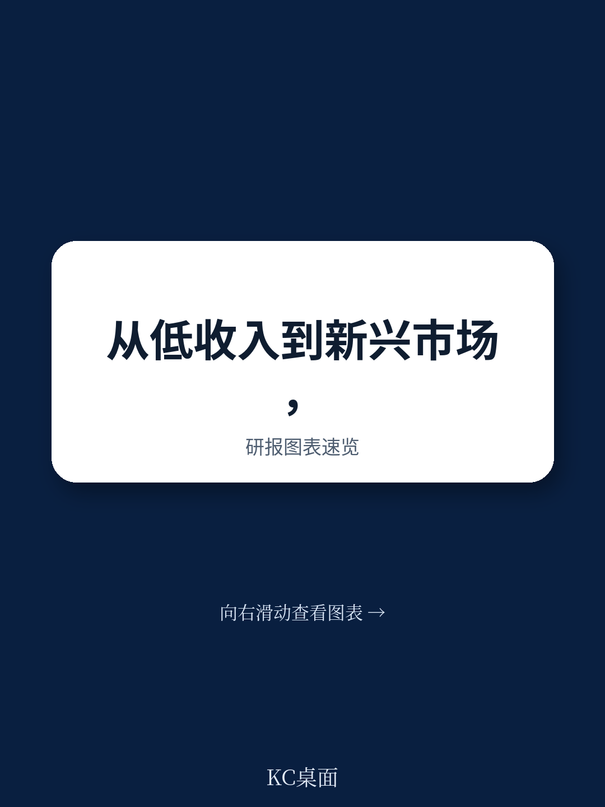
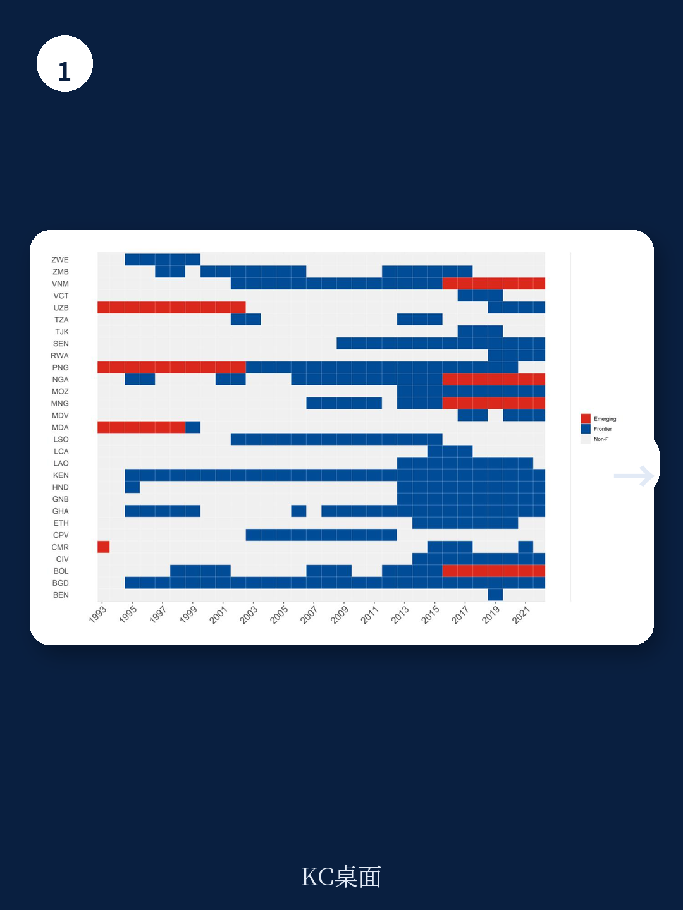
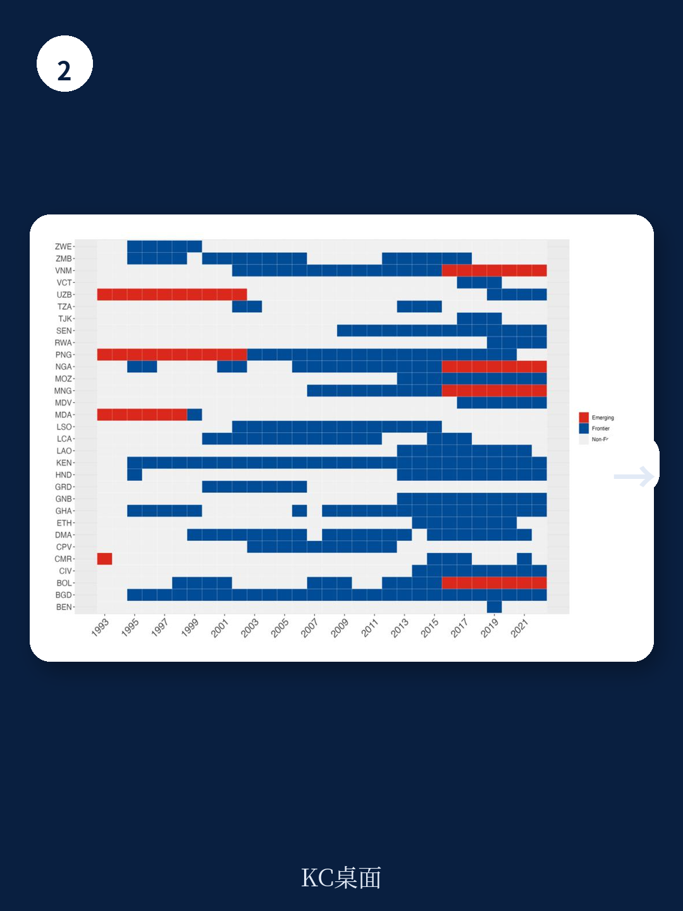

# IMF：前沿市场真正的门槛不是增长，是制度

当全球投资者还在为新兴市场的波动焦虑时，一个被忽视的群体正在悄悄改变国际资本的流向版图。IMF最新工作论文给出了一组值得深思的判断：前沿市场（Frontier Markets）的跃迁，本质上不取决于全球流动性是否宽松，而取决于国内制度质量和宏观经济纪律。

这份由IMF战略、政策与审查部授权的报告，系统梳理了30年来低收入国家如何跨越“前沿市场”这道门槛。其核心发现可能颠覆许多投资者的固有认知——**决定一个国家能否从低收入国升级为前沿市场的，不是增长故事，而是治理质量**。

## 1. 前沿市场的门槛：金融深度的量化标尺

IMF团队构建了一套可复制的量化识别框架，用五个金融指标来划定前沿市场的边界：广义货币与GDP之比、跨境贷款和存款、股票市场市值、投资组合流入，以及主权债券发行能力。一个低收入国家只有在这五项中至少满足四项，才能被认定为前沿市场。

这套方法论的价值在于去主观化。过去，金融机构和评级机构对前沿市场的认定往往带有判断成分，甚至存在“一锤子买卖”的问题——某个国家可能因为一次偶然的债券发行就被贴上前沿市场标签。IMF的滚动三年窗口机制，有效过滤了这种噪音。

从数据看，1993年至2022年间，前沿市场群体持续扩大，尤其在2008年全球金融危机后加速。23个低收入发展中国家在此期间成功进入国际债券市场。但值得注意的是，前沿市场状态具有强持续性——一旦获得，很少轻易失去，这暗示其背后是结构性因素在支撑。

> **KC评论：** 对于投资者而言，这套识别框架意味着什么？它提供了一个比传统指数更干净、更可回溯的筛选工具。完整报告附录中有各国每年的分类结果热力图，可以清晰看到哪些国家在什么时间点跨过了门槛，以及哪些国家在危机中守住了位置。

## 2. 跃迁的真正动力：国内制度压倒全球周期

报告通过面板回归模型识别了从非前沿低收入国向前沿市场跃迁的关键驱动因素。结果清晰而有力：**国内基本面因素解释了绝大多数跃迁概率，全球推力的作用远小于普遍预期**。

具体而言，强劲的产出增长、低公共债务水平、以及经济制度和治理质量的改善，是决定一个国家能否升级为前沿市场的三大支柱。其中，治理质量的系数在统计上显著且经济意义重大——这意味着反腐败、产权保护、法治建设等制度性变量，其边际贡献可能超过GDP增速本身。

相比之下，美国货币政策立场、全球股市波动率等外部因素，在统计上并不显著。这一发现与许多市场参与者的直觉相悖——很多人认为前沿市场是“全球流动性宽松”的受益者，但IMF的数据显示，这些国家的升级更多是“修内功”的结果。

> **KC评论：** 这并不意味着全球环境不重要。报告讨论的是“跃迁”而不是“波动”。一旦成为前沿市场，其对全球金融条件的敏感度就会大幅上升——这是另一层故事。完整报告中对全球因素与国内因素的交互分析，值得仔细推敲。

## 3. 主权利差的敏感度：前沿市场并不比新兴市场更脆弱

一个反直觉的发现是：**前沿市场主权利差对美国货币政策变化的敏感度，与新兴市场没有统计差异**。这一结论挑战了“前沿市场更脆弱”的流行叙事。

IMF团队使用局部投影方法估计了不同组别国家主权利差对影子联邦基金利率冲击的脉冲响应。结果显示，前沿市场和新兴市场的利差反应曲线几乎重合，而非前沿低收入国家则因与国际金融市场联结度低而几乎无显著反应。

这意味着，一旦一个国家跨过前沿市场的门槛，它就在全球金融周期面前暴露出了与新兴市场相似的风险敞口。那些认为前沿市场是“低相关性、高回报”的投资者，可能需要重新审视这一假设。

## 4. 哪些结构特征能缓冲冲击？汇率弹性与财政纪律

报告进一步分析了哪些结构性因素能够降低前沿市场对全球金融条件的敏感度。结论高度务实：**灵活的汇率制度、充足的外汇储备缓冲、较低的公共债务和财政赤字，是减轻主权利差对美联储政策变化敏感度的关键因子**。

具体而言，实施浮动汇率制的前沿市场，在美联储加息周期中利差上升幅度显著小于固定汇率制国家。官方储备占GDP比重每提高一个百分点，利差对紧缩冲击的弹性就下降约0.5个百分点。财政赤字每降低一个百分点，弹性下降约0.3个百分点。

这些发现与新兴市场文献的结论高度一致，但放在前沿市场语境下更具政策含义——因为这些国家的财政和外部缓冲通常更薄，调整空间更小。出口结构多元化也被证明有帮助，尽管其效应弱于上述变量。

> **KC评论：** 这里有一个尚未完全回答的关键问题：报告使用的样本期是否充分覆盖了2022-2023年的激进加息周期？完整报告中的稳健性检验部分，包括了对不同样本期和子群组的分析，这些细节对于判断结论在当前环境下的适用性至关重要。

## 5. 报告没有完全回答的几个关键问题

尽管这份IMF工作论文在方法论上堪称严谨，但它也留下了几个值得进一步探讨的缺口。

第一，**前沿市场的“降级”问题**。报告主要关注跃迁，但对失去前沿市场地位的分析相对薄弱。在COVID-19和地缘政治冲击后，部分前沿市场面临融资困难，其“降级”阈值是什么？是否存在非对称性——即进入需要满足五项中的四项，但退出可能只需触发更少的指标？

第二，**制度质量的内生性问题**。报告发现治理质量对跃迁概率有显著影响，但治理改善与前沿市场状态之间可能存在双向因果关系——获得前沿市场地位本身可能倒逼制度改革。工具变量策略或更细颗粒度的制度指标（如司法独立性、合同执行效率）可能提供更干净的识别。

第三，**投资者行为的作用**。报告从宏观基本面角度解释了跃迁，但忽略了机构投资者的“标签效应”——一旦被摩根士丹利或标准普尔纳入前沿市场指数，被动资金的流入本身就会强化其市场深度。这种自我实现机制在报告中没有被充分建模。

第四，**地缘政治风险的异质性**。报告控制了全球因素，但没有区分不同类型的外部冲击。对于依赖大宗商品出口的前沿市场（如安哥拉、赞比亚），能源价格冲击的传递机制可能完全不同于金融条件冲击。一个更细分的冲击分类框架可能产生更有政策针对性的结论。

## 6. 一个可操作的观察框架

对于产业决策者和高净值读者，这份报告提供了一个三层次的观察框架：

**第一层：筛选层**。关注一个低收入国家是否满足IMF五项指标中的至少四项。如果满足，它已经进入了全球金融周期的影响半径，不能再用“低相关性”的逻辑来评估其风险。

**第二层：缓冲层**。评估该国的汇率制度、储备覆盖率、财政赤字率和公共债务水平。这些指标决定了它在美联储政策转向时的脆弱程度。一个拥有浮动汇率、高储备、低赤字的前沿市场，其利差波动可能比一个固定汇率的新兴市场更可控。

**第三层：制度层**。跟踪世界银行全球治理指标（WGI）中的政府效率、法治水平、腐败控制等维度。这些变量是预测一个低收入国家能否长期维持前沿市场地位的核心信号，其重要性可能超过短期GDP增速。

这三个层次形成了一个由浅入深的诊断链：先看是否“入门”，再看能否“扛冲击”，最后看能否“持续升级”。对于任何考虑前沿市场配置的投资者，跳过任何一个层次都可能带来误判。

---

前沿市场不是一个静态的分类，而是一个动态的、可逆的过程。IMF这份报告告诉我们，真正决定一个国家能否跨越这道门槛的，不是全球流动性的潮汐，而是国内制度与纪律的积累。那些在治理质量上持续进步的国家，即使在全球紧缩周期中也能守住自己的位置。

但正如报告所暗示的，一旦跨过门槛，新的风险也随之而来——全球金融周期的冲击将不再绕道而行。对于投资者和政策制定者而言，理解这个“跃迁后的脆弱性”，或许比追逐下一个前沿市场标签更为紧迫。

这些未解问题——降级阈值、制度内生性、指数效应的自我实现、地缘政治冲击的异质性——恰恰是深入阅读完整报告的价值所在。如果你对前沿市场的识别方法、各国年度分类结果、以及局部投影法的具体设定感兴趣，欢迎加入我们的讨论社群，获取完整研报解读与原始图表。

在这里，我们汇聚了来自头部券商、PE/VC、投行、并购、对冲基金、资管机构、战略咨询和智库的朋友，每日更新国际主流叙事、数据和图表，观测边际变化。如果你也关注这些被主流忽视的市场信号，欢迎扫码交流。

Personal reading notes and learning share only. Not investment advice.

