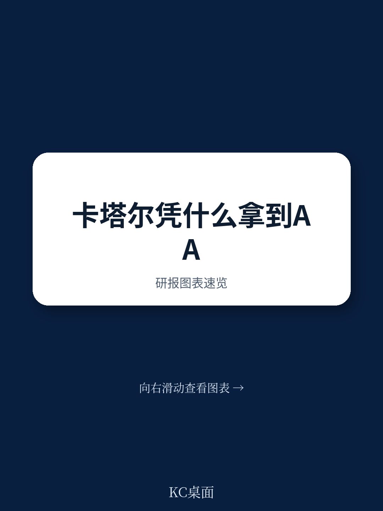
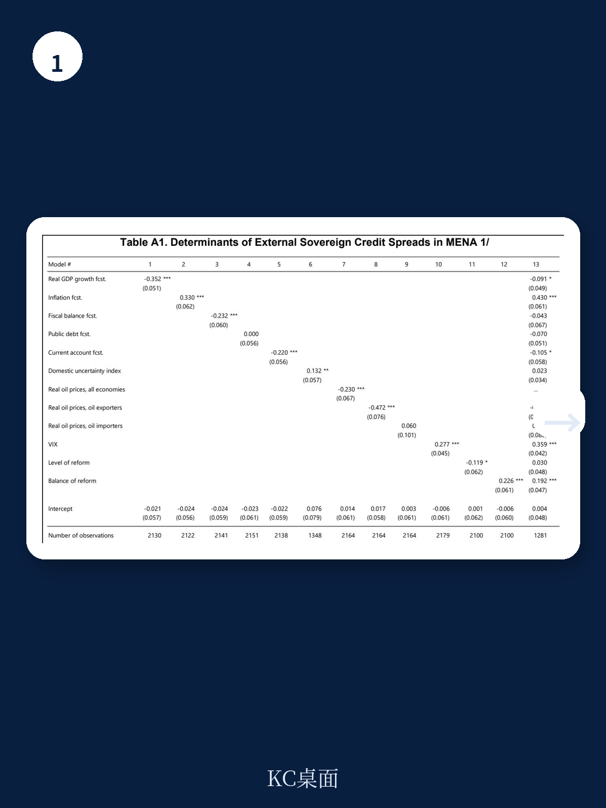
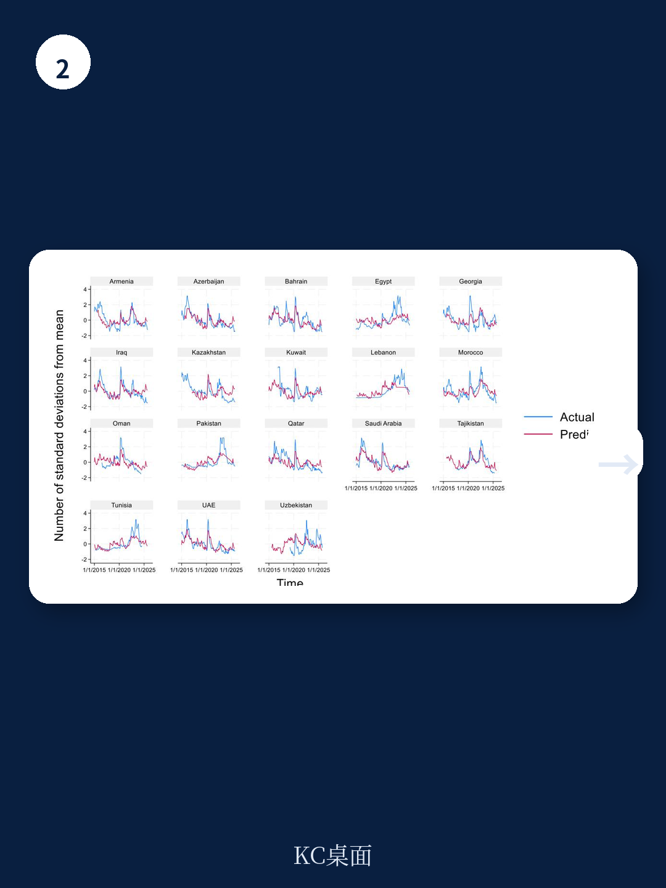

# IMF：卡塔尔主权利差收窄，改革“广度”比“深度”更值钱

全球不确定性创下历史新高，投资者正在用脚投票。他们奖励的不是某个单一领域的激进改革，而是“全面、平衡、协调”的改革组合。

这是国际货币基金组织（IMF）最新工作论文《Pricing Reform Progress: Evidence from Sovereign Spreads and Consensus Forecasts》的核心发现。这篇由Ken Miyajima撰写、发布于2026年7月的报告，以卡塔尔为锚点，为中东和北非（MENA）地区18个经济体过去十年的主权信用利差变化，提供了一个极其清晰的解释框架。

报告给出的结论并非模棱两可：**投资者不仅看“改革做了什么”，更看“改革是否平衡”。** 那些在多个维度同步推进改革的国家，其主权信用利差收窄的幅度，远大于只在一两个领域发力、其他领域滞后的国家。

这对任何正在推进结构性改革的新兴市场，都是一个值得反复推敲的信号。

> **KC评论：** 这篇报告的真正价值不在于它证明“改革有用”——这几乎是常识。它真正锋利的地方在于区分了“改革深度”和“改革广度”。它用计量方法证明：当五个改革子指标的标准差越小（即改革越平衡），主权利差收窄越明显。这意味着，一个在财政纪律上做到极致、但在营商环境或货币政策独立性上毫无进展的国家，其信用溢价可能高于一个各项改革都做到70分的国家。这是对“单项冠军”式改革策略的直接挑战。

## 1. 全球不确定性高企的背景下，国内稳定成为稀缺溢价

报告开篇即点明背景：全球经济和政策不确定性已升至前所未有的水平。IMF使用的全球不确定性指数在2025年初仍处高位，而中东地区的地缘政治风险更是加剧了这一趋势。

但卡塔尔是一个显著的例外。报告使用的国内不确定性指数显示，卡塔尔的国内不确定性在过去十年中始终保持在MENA地区最低水平，远低于沙特、阿联酋等GCC邻国，更不用说埃及、黎巴嫩等非GCC国家。

这一差异直接体现在主权信用利差上。卡塔尔的5年期CDS利差从2015年前后的100个基点左右，收窄至2025年的约40个基点。同期，MENA非GCC国家的利差虽有波动，但整体水平仍远高于卡塔尔。

> **KC评论：** 国内不确定性指数是一个常被忽视但极具解释力的变量。报告通过计量分析证实，国内不确定性每上升一个标准差，主权利差会显著走阔。这意味着，在投资者眼中，“政策可预测性”本身就是一种资产。卡塔尔之所以能维持低利差，不是因为它的经济结构比其他海湾国家更健康（事实上，它同样高度依赖油气），而是因为它提供了一个更稳定的政策环境。这个结论对任何面临政策摇摆风险的市场都适用。

## 2. 改革“广度”比“深度”更能解释利差收窄

报告的核心计量模型采用了静态面板估计，覆盖2014年12月至2025年9月的月度数据。在控制宏观经济预测（GDP增长、通胀、财政余额、经常账户、公共债务）、国内不确定性、油价、全球风险偏好（VIX）等标准变量后，改革变量仍保持显著的统计解释力。

但关键发现并不在于“改革是否有效”，而在于“什么样的改革更有效”。

报告引入了Bolen和Sobel（2020）的方法，将改革进展分解为五个子领域：财政管理、货币政策、营商环境、治理质量、经济复杂性。然后构造了两个指标：一是五个子指标的平均值（衡量改革整体水平），二是五个子指标的标准差（衡量改革的平衡度）。

计量结果显示：**平均值的系数显著为负（改革水平越高，利差越低），但标准差的系数显著为正（改革越不平衡，利差越高）。** 而且，在同时纳入两个变量的模型中，标准差的解释力甚至更强。

这意味着，投资者更看重改革是否“全面铺开”，而不是某一两个领域是否做到极致。一个在财政纪律上做到满分、但在货币政策和营商环境上毫无建树的国家，其信用溢价可能高于一个在五个领域都做到70分的国家。

> **KC评论：** 这个发现对政策制定者有直接的启示。很多国家在改革时倾向于选择“低 hanging fruit”或政治阻力最小的领域先做，结果造成改革进程严重失衡。但这篇报告告诉我们，投资者对“偏科”的惩罚是实打实的。如果你只做财政整顿但不碰国企改革，或者只改善营商环境但不解决货币政策独立性，市场不会因为你某个领域做得好就给你加分。它看你的是“木桶最短的那块板”。

## 3. 改革还能增强主权信用对外部冲击的“免疫力”

报告在基准模型之外做了一个重要的扩展分析：检验改革是否改变了主权信用利差对外部冲击的敏感度。

具体方法是在方程中引入交互项，让VIX（全球风险偏好）和油价的系数根据改革进展水平发生变化。结果非常清晰：改革进展更好的国家，其主权利差对VIX和油价波动的敏感度显著更低。

换句话说，改革不仅直接降低了利差水平，还增强了主权信用对外部冲击的韧性。当全球风险偏好骤降或油价暴跌时，改革更全面的国家受到的冲击更小，利差走阔的幅度更有限。

这一发现在卡塔尔身上表现得尤为突出。报告指出，卡塔尔在近年来对LNG产能的扩张和第三国家发展战略（NDS3）下改革的持续推进，使其在2020年疫情冲击和2022年俄乌冲突引发的能源价格波动中，都保持了相对稳定的信用利差。

> **KC评论：** 这实际上是在说，改革是一种“保险”。你支付的是改革的政治成本和时间精力，换来的是当外部风暴来临时，你的信用利差不会像其他脆弱国家那样剧烈波动。对于持有新兴市场主权债券的投资者来说，这个结论意味着：在评估一个国家的信用风险时，不仅要看它的宏观基本面，还要看它改革的“广度”——这可能是比GDP增速或债务率更前瞻的指标。

## 4. 报告尚未完全回答的关键问题：改革如何被“定价”？

尽管这篇报告在方法论上相当扎实，但它也留下了一些值得追问的问题。

首先，改革变量的测量频率是年度数据，在月度面板中重复使用12个月。这意味着改革变量在一年内是不变的，无法捕捉到改革推进过程中的边际变化。投资者对改革的反应，可能是在政策宣布时、立法通过时、还是实际执行时？报告无法区分。

其次，改革与信用利差之间可能存在反向因果。利差收窄本身可能为改革创造更好的融资条件，从而激励政府推进更多改革。报告虽然使用了宏观经济预测变量来缓解这一问题，但并未完全排除内生性。

第三，报告对“改革”的定义局限于五个可量化的子领域，但现实中很多关键改革是难以量化的，比如国企治理的实质性改善、反腐败的力度、法治环境的提升。这些“软改革”可能同样重要，但数据不可得。

> **KC评论：** 这些未解问题恰恰是完整报告的精华所在。报告的附录中包含了多个稳健性检验和子样本回归，比如区分GCC和非GCC国家、区分油气出口国和进口国、区分高信用评级和低信用评级国家。这些细分分析揭示了改革效应在不同类型经济体之间的异质性。例如，对于已经拥有较高信用评级的国家（如卡塔尔），改革的边际效应可能更体现在“韧性”而非“水平”上。这些细节在摘要中无法展开，但恰恰是深度读者最需要的内容。

## 5. 给投资者的观察框架：如何用“改革广度”评估主权信用

基于这篇报告的核心发现，我们可以提炼出一个简单的评估框架，用于在日常投资决策中快速判断一个主权信用的“改革溢价”。

第一步，看“改革清单”。不要只看一个国家是否在推进改革，要看它是否同时在多个领域推进。如果只看到财政整顿或货币改革，但缺乏营商环境和治理质量的同步改善，就要对改革效果的可持续性打一个问号。

第二步，看“改革平衡度”。如果可能，获取该国在IMF或世界银行各类治理指数上的分项得分，计算其标准差。标准差越大，意味着改革越“偏科”，投资者可能要求更高的风险溢价。

第三步，看“外部冲击弹性”。观察该国主权利差在VIX飙升或油价暴跌时的反应幅度。如果反应幅度明显小于同类国家，很可能说明其改革已经产生了“韧性溢价”。这个指标比信用评级调整更具前瞻性。

第四步，关注“国内不确定性”。报告中的国内不确定性指数是一个简单但有效的先行指标。如果该指数开始上升，即使宏观数据尚未恶化，也应对该主权信用保持警惕。

> **KC评论：** 这篇报告最值得反复咀嚼的，不是它的结论本身，而是它提供的分析框架。它告诉我们，主权信用定价的密码，可能藏在宏观数据之外。那些看似抽象的改革指标，经过合适的计量处理后，可以变成可量化的定价因子。对于愿意深入研究的读者，完整报告中的附录表格和图表提供了大量可供进一步拆解的数据——比如五个子指标的具体构成、分国家样本的回归结果、以及不同信用评级状态下改革效应的变化。这些内容在摘要中无法一一呈现。

---

这篇IMF工作论文的价值，不仅在于它证明“改革有用”，更在于它揭示了“什么样的改革更值钱”。在全球化退潮、地缘风险上升的时代，投资者对“稳定”和“平衡”的定价正在上升。那些能够提供全面、平衡、可预测改革路径的国家，将获得越来越高的信用溢价。

但报告也留下了一个核心未解问题：当全球不确定性从高位回落时，改革溢价是否会随之收缩？换句话说，改革带来的“韧性红利”，究竟是一种结构性改善，还是一种周期性的避险溢价？这个问题的答案，可能需要等到全球风险偏好回归正常水平后才能验证。

如果你对这个问题感兴趣，或者想进一步了解报告中的完整计量模型、分国家样本的回归结果、以及五个改革子指标的具体构成，欢迎加入我们的社群。这里汇聚了来自头部券商、PE/VC、投行、并购、对冲基金、资管机构、战略咨询和智库的朋友，每日更新国际主流叙事、数据和图表，观测边际变化，交流深度观点。扫码加入，领取完整研报解读与原始图表。

Personal reading notes and learning share only. Not investment advice.

