# Should Oil Economies Worry About Oil Shocks' Impact on the Banking System? The Case of Oman

Prepared by Yurii Sholomytskyi, Nathaniel Butler Blondel, and Mumtaz Hussain

WP/26/142

IMF Working Papers describe research in progress by the author(s) and are published to elicit comments and to encourage debate. The views expressed in IMF Working Papers are those of the author(s) and do not necessarily represent the views of the IMF, its Executive Board, or IMF management.

2026
JUL

# IMF Working Paper Institute for Capacity Development

Should Oil Economies Worry About Oil Shocks' Impact on the Banking System? The Case of Oman

Prepared by Yurii Sholomytskyi, Nathaniel Butler Blondel, $^{1}$ and Mumtaz Hussain

Authorized for distribution by Ali Alichi

July 2026

IMF Working Papers describe research in progress by the author(s) and are published to elicit comments and to encourage debate. The views expressed in IMF Working Papers are those of the author(s) and do not necessarily represent the views of the IMF, its Executive Board, or IMF management.

ABSTRACT: This paper investigates the transmission of oil price shocks to the banking sector in oil-dependent economies, using Oman as a case study. We develop a DSGE model featuring an integrated banking block with endogenous credit rationing and a sovereign wealth fund stabilization rule, calibrated to Omani institutional targets and disciplined by Bayesian methods. Our structural approach disentangles two primary transmission channels: the solvency channel, driven by credit risk and non-performing loans (NPLs), and the liquidity channel, driven by pro-cyclical government deposit withdrawals and sovereign debt issuance. The structural variance decomposition attributes over 54% of non-oil GDP variance and 53% of credit variance to oil price shocks, while bank capital shocks account for less than 0.1%, confirming the quantitative dominance of the liquidity channel. We identify a precautionary liquidity motive—a “liquidity buffer trap”—where banks maintain excess liquidity during booms to hedge against hydrocarbon volatility, structurally suppressing credit to the productive sector. Our counterfactual regime analysis reveals the stabilizing power of credit depth: banking conservatism protects long-term physical capital formation, and the ongoing financialization of the corporate sector—including the rapid growth of Islamic banking and sukuk markets—under Vision 2040 further amplifies this structural resilience. We acknowledge identification challenges inherent in small-sample structural estimation and discuss the sensitivity of results to key modeling assumptions.

RECOMMENDED CITATION: Should Oil Economies Worry About Oil Shocks' Impact on the Banking System? The Case of Oman.

<table><tr><td>JEL Classification Numbers:</td><td>E44, E52, G21, Q43</td></tr><tr><td>Keywords:</td><td>Oil price shocks; DSGE; Credit rationing; Banking liquidity; Sovereign Wealth Fund; Fiscal-financial nexus; Islamic banking; Oman</td></tr><tr><td>Author&#x27;s E-Mail Address:</td><td>ysholomytskyi@imf.org, nathaniel.butlerblondel@sciencespo.fr, mhussain@imf.org</td></tr></table>

WORKING PAPERS

# Should Oil Economies Worry About Oil Shocks' Impact on the Banking System? The Case of Oman

Prepared by Yurii Sholomytskyi, Nathaniel Butler Blondel, and Mumtaz Hussain

## Contents

I. Introduction 3
II. Literature review 4
III. The Omani financial sector: stylized facts and macro-financial theory 5
A. Monetary anchor and structural rigidities . . . . . . . . . . . . . . . . . . . . . . . . . . . . . . . . . . . . . . . . . . . . . . . . . . . . . . . . . . . . . . . . . . . . . . . . . . . . . . . . .
B. Solvency buffers and asymmetric asset quality . . . . . . . . . . . . . . . . . . . . . . . . . . . . . . . . . . . . . . . . . . . . . . . . . . . . . . . . . . .
C. The sovereign-bank nexus and the dual liquidity squeeze. 6
D. Asset allocation and the SME paradox. 6
E. The precautionary liquidity buffer and pro-cyclicality. 7
F. Islamic banking, sukuk markets, and the evolving financial landscape. 8
G. Pecuniary externalities and the construction nexus. 8
IV. Households 9
A. Patient households (savers and asset owners) 9
B. Impatient households (constrained borrowers) 10
C. The collateral constraint: statutory vs. market limits. 10
D. Aggregation and distributional dynamics. 10
V. The production sector 11
A. Intermediate goods producers and technology. 11
B. The hydrocarbon sector. 11
C. Real marginal cost and the financial-wage friction. 12
D. Staggered price setting and the hybrid Phillips curve. 12
VI. The capital goods sector and investment dynamics 13
A. Capital accumulation and adjustment costs. 13
B. Tobin's Q and investment pricing. 13
VII. The labor market and the "vent" channel 14
A. Domestic labor supply and employment adjustment. 14
B. Migrant labor and foreign supply. 14
C. The remittance channel and import sluggishness. 15
VIII. Housing and the collateral accelerator 15
A. House price determination. 15
B. Housing stock and investment. 16
IX. The sovereign wealth fund (Oman Investment Authority) 16
A. Wealth accumulation and returns. 16
B. The dual-mandate transfer rule. 17
X. The government and fiscal policy 17
A. Revenue generation: the two pillars of Omani income. 18
B. The stabilized budget constraint and deficit management. 18
C. The net liquidity proxy: formalizing the "squeeze". 18
D. Fiscal pro-cyclicality and the expenditure rule. 19

XI. The banking system: solvency, liquidity, and endogenous risk-taking 19
A. The wholesale bank's optimization problem . . . . . . . . . . . . . . . . . . . . . . . . . . . . . . . . . . . . . . . . . . . . . . . . . 20
B. Retail units and the rollover risk channel . . . . . . . . . . . . . . . . . . . . . . . . . . . . . . . . . . . . . . . . . . . . . . 21
C. Optimal credit rationing: the behavioral filter . . . . . . . . . . . . . . . . . . . . . . . . . . . . . . . . 22
D. Credit flows, legacy loans, and portfolio stickiness. 22
XII. Monetary policy 23
A. The fixed exchange rate regime 23
B. Interest rate parity and risk premiums 23
XIII. External balance and national debt 23
XIV. Empirical strategy: calibration with Bayesian discipline 24
A. Data sources and sample 24
B. Identification limitations and the supply-demand distinction 25
C. Steady-state moments and model fit 26
D. Structural parameterization 26
D..1 Calibrated parameters and stationarity bounds 26
D..2 Bayesian-disciplined parameters (cyclical dynamics) 27
XV. Empirical results 29
A. Structural variance decomposition 29
B. Regime analysis: the sustainability gap 30
C. Sensitivity analysis 34
XVI. Conclusions 35
XVII. Technical Annex: Full Log-Linearized Model Specification 37

## I. Introduction

The intricate relationship between oil price fluctuations and the banking sector is a subject of great importance for oil-dependent economies such as Oman. As one of the world's leading oil exporters, Oman derives a significant portion of its revenue from oil, with petroleum accounting for about $70\%$ of government revenue and $80\%$ of export earnings. As global markets remain susceptible to geopolitical tensions and demand variability, oil shocks can have profound implications for financial stability. This paper seeks to address the critical question: should oil economies like Oman be concerned about the impact of oil shocks on their banking systems, and is the primary risk one of solvency or liquidity?

Oil shocks, characterized by sudden and significant changes in prices, affect financial stability through two distinct channels. First, the solvency channel: an economic contraction leads to increased default rates and a deterioration of asset quality (non-performing loans), eroding bank capital. Second, and often overlooked in the literature, is the liquidity channel: in state-dominated economies like Oman, the banking system relies heavily on government deposits. A collapse in oil revenues triggers a dual “liquidity squeeze”: the government simultaneously draws down these deposits and actively issues domestic sovereign debt to fund fiscal deficits. For domestic banks, both actions mechanically drain available loanable funds, creating an immediate funding squeeze that crowds out private credit independent of the underlying credit risk.

Understanding these mechanisms is crucial for policymakers. While the interconnectedness of global markets means Omani banks are exposed to international sentiment, domestic structural features—specifically the fiscal-financial nexus—may amplify these shocks.

This paper differentiates itself from the existing literature by analyzing these dynamics through a New Keynesian DSGE model tailored to a small open economy with a fixed exchange rate. Unlike reduced-form empirical models (such as VARs or ECMs) which estimate historical correlations, our structural approach allows us to:

1. Explicitly model the sovereign wealth fund (SWF) and its stabilization rule, isolating how fiscal buffering (or lack thereof) transmits shocks to the banking sector.

2. Disentangle the deposit channel (funding costs) from the financial accelerator channel (collateral constraints).

3. Explore the role of regulatory constraints—including Loan-to-Value (LTV) and Payment-to-Income (PTI) limits—in a regime where monetary policy is constrained by the US dollar peg.

We find that while Omani banks possess strong solvency buffers, they exhibit significant vulnerability to liquidity pressures driven by pro-cyclical government deposit flows. This finding highlights the importance of liquidity management and fiscal-financial coordination alongside traditional capital adequacy monitoring. We discuss the identification challenges inherent in this approach— particularly the difficulty of separating supply-side credit rationing from demand-side effects—in Section X.

## II. Literature review

The academic inquiry into the nexus between oil prices and financial stability has evolved from aggregate macroeconomic analysis to detailed banking sector studies.

## Macroeconomic impact of oil shocks

Seminal work by Hamilton [1983] established the foundational understanding of how oil price shocks precipitate economic downturns through supply-side constraints and demand destruction. Subsequent research by Kilian [2009] refined this by decomposing shocks into supply, demand, and precautionary motives using structural VAR models, highlighting that the origin of the shock determines its macroeconomic transmission.

## Banking channel

A substantial body of literature highlights the banking sector as a specific transmission vector. Bernanke et al. [1997] emphasized the role of monetary policy responses in mediating oil shocks, suggesting that the resulting interest rate adjustments often amplify the contraction. Gelain and Lorusso [2022] extended this to a DSGE framework for the US, finding that oil price fluctuations account for up to 17% of GDP variation, primarily transmitted through the “financial accelerator” effect where falling asset prices constrain borrowing capacity.

However, the transmission mechanism in oil-exporting developing economies differs significantly from the US context. Khandelwal et al. [2016] utilized a multivariate panel approach for GCC countries, demonstrating a strong feedback loop between oil prices, bank balance sheets, and asset prices. This is corroborated by Alkhater [2014] and Fattouh and El-Katiri [2012], who emphasize that in Bahrain and the UAE, the banking sector's health is intrinsically tied to government oil revenues rather than just private sector productivity.

## Systemic risk and liquidity

Recent empirical work has attempted to distinguish between risk types. Maghyereh and Abdoh [2021] find that supply-side oil shocks significantly increase systemic risk in GCC banking systems. Monnin and Jokipii [2014] argue that banking sector stability is a prerequisite for real output growth, finding that instability leads to significant underestimations of future GDP contractions.

## Gap in the literature

While existing studies [e.g., Qin, 2020, Ma et al., 2021] utilize VAR methodologies to estimate risk correlations, there is a scarcity of structural models that explicitly capture the sovereign wealth fund mechanics and the government deposit channel prevalent in the Gulf region. Most DSGE models for the region focus on fiscal sustainability without a detailed banking sector. Our paper fills this gap by integrating a banking block with endogenous credit rationing [following Gerali et al., 2010] into a resource-rich small open economy framework. This allows us to quantify the trade-off between fiscal stabilization (drawing down deposits and issuing domestic debt) and financial stability (maintaining bank liquidity).

## III. The Omani financial sector: stylized facts and macro-financial theory

The financial sector in Oman is characterized by a bank-dominated structure, operating under a fixed exchange rate regime and significant exposure to the global hydrocarbon cycle. With total banking sector assets standing at 102.3% of GDP, the commercial banking system acts as the primary intermediary for national wealth. This section identifies the critical empirical features and theoretical drivers of the Omani macro-financial cycle that motivate the structural frictions in our DSGE framework.

## A. Monetary anchor and structural rigidities

The Central Bank of Oman (CBO) maintains a fixed exchange rate peg of the Omani rial to the US dollar, which serves as the economy's primary nominal anchor. Under this regime, domestic policy rates generally track the federal funds rate to prevent capital flight. However, the interest rate pass-through in Oman is historically weak, even compared to structurally similar GCC peers. Kroen [2024] find that what little pass-through exists is driven almost entirely by foreign currency lending, leaving the domestic transmission mechanism largely blunted.

Despite a moderate concentration ratio—where the top three and top five banks account for 60% and 80% of assets, respectively—there is evidence of significant structural rigidity. A persistent spread of approximately 300 basis points between lending and deposit rates has remained resilient even during recent monetary tightening cycles. This stickiness suggests a degree of market power and structural friction in the deposit market, justifying the monopolistic competition framework and the inclusion of adjustment costs in the setting of interest rates within our model.

## B. Solvency buffers and asymmetric asset quality

Omani banks maintain robust solvency buffers and resilience. The sector-wide capital adequacy ratio (CAR) stands at 17.5%, reflecting a steady accumulation of capital since the 2015 oil price shock. While this deleveraging has compressed the return on equity (ROE) to approximately 7.8%, the sector remains profitable with a return on assets (ROA) of nearly 1.5%.

However, asset quality exhibits emerging stress that is highly asymmetric across sectors. The NPL ratio has risen consistently since 2016, reaching $4.5\%$ by end-2023—more than double preshock levels. Crucially for our model's sectoral differentiation, distress is concentrated: loans to the corporate sector (particularly construction and manufacturing) exhibit an NPL rate of $6.5\%$ , whereas household personal loans remain resilient with a default rate of only $2.35\%$ . While high provisioning levels ( $69.3\%$ coverage for Stage 3 loans) have kept the net NPL ratio stable at roughly $1.4\%$ , the rising gross NPLs constrain banks' future risk appetite and trigger the non-price rationing mechanisms identified in our theory.

## C. The sovereign-bank nexus and the dual liquidity squeeze

The liability side of the banking balance sheet reveals a critical systemic vulnerability. Omani banks rely heavily on domestic funding, with less than 3% of liabilities sourced from non-residents. More importantly, the system exhibits a structural dependence on the public sector: over 30% of total deposits are held directly by the government and state-owned enterprises (SOEs).

In our stylized theory, we identify these holdings not as stable savings, but rather as transactional float. These deposits represent oil revenue in transit to finance budgetary expenditures. Crucially, when oil prices fall, the government bridges fiscal gaps through multiple mechanisms: drawing down these deposits, issuing domestic sovereign bonds absorbed by commercial banks, and—particularly during prolonged downturns—accessing external capital markets and sovereign wealth fund buffers. While the SWF and external borrowing channels partially attenuate the domestic liquidity impact, CBO data confirm that government deposit positions within the domestic banking system nonetheless experience material fluctuations that are quantitatively significant relative to the private credit stock.

From the perspective of the commercial banking system's balance sheet, the net effect of government deposit withdrawals and domestic sovereign debt issuance is functionally identical: both drain available loanable funds from the private sector. We formally define this combined net effect as the “liquidity squeeze”. Our model captures this through a consolidated net liquidity proxy ( $D_t^G$ ) that abstracts from the government's external financing choices to focus on the residual domestic banking system impact. This creates a direct liquidity channel where negative oil shocks precipitate crowding-out of private credit, independent of private sector credit risk or bank solvency.

## D. Asset allocation and the SME paradox

Credit allocation in Oman is heavily skewed toward the household sector. Personal loans account for 37.5% of total credit, including 18.5% for mortgages. Construction lending, the second-largest category at 9%, is also largely residential. Consequently, over 50% of private non-financial credit effectively finances household consumption and housing. This justifies our model's distinction between “patient” (savers) and “impatient” (borrowers) households. Furthermore, the CBO imposes caps on personal loans (35% of total book) and mortgages (15%). These limits appear binding, as banks consistently lend near these thresholds despite interest rates remaining well below the 6% statutory ceiling, suggesting that credit supply is constrained by regulation and quantity rationing rather than price.

In sharp contrast, lending to SMEs is structurally suppressed, accounting for only 2.9% of total credit. In comparison, the average SME share in OECD economies is 47.9%, compared to 42.2% in emerging markets. This gap reflects multiple structural factors: SMEs in Oman face higher perceived credit risk, stringent collateral requirements, and regulatory concentration limits that constrain bank exposure. However, the cyclical co-movement of SME credit with government deposit flows—beyond what these structural factors alone would predict—suggests that liquidity-driven crowding-out amplifies these structural constraints during downturns. In our model, this is captured through the asymmetric corporate penalty ( $\chi_{corp}$ ) applied to the rationing filter, which generates sharper credit contraction for uncollateralized corporate lending relative to retail mortgages.

## E. The precautionary liquidity buffer and pro-cyclicality

Bank asset allocation follows a pro-cyclical pattern regarding liquidity. While the Central Bank of Oman (CBO) mandates a statutory reserve requirement of 5% and a minimum Liquidity Coverage Ratio (LCR) of 100%, commercial banking practices reflect a deeper “hold-to-maturity” culture rather than mere regulatory compliance. For instance, while the narrow liquid assets to total assets ratio hovered around 5.0% in December 2024 (down slightly from 5.9% in 2023), the broader liquid assets to deposits ratio has historically exhibited massive pro-cyclical swings, ranging from 4% to over 20% since 2001 and reaching 22.44% in 2021. Furthermore, major Omani banks routinely maintain LCRs comfortably above the statutory threshold (e.g., near 110%).

This massive excess of broad liquidity above statutory minimums during oil booms indicates that the accumulation of liquidity is not purely mechanical, but reflects an endogenous, precautionary response. This behavior signals a “liquidity buffer trap” where oil windfalls are channeled into low-yield sovereign instruments rather than productive investment. Fearing the eventual volatility of the transactional float, banks maintain excessive liquidity as a hedge against future sovereign withdrawals, which dampens the fiscal multiplier and structurally suppresses long-term credit depth.

We note that excess liquidity in GCC banking systems also reflects institutional factors, including the historically limited menu of domestic money market instruments and the evolving liquidity management framework. The CBO has progressively introduced standing facilities and repo operations, and the development of the sukuk market has expanded the range of eligible liquid assets. To the extent that the precautionary motive is partly a response to the absence of a deep interbank or money market, the “liquidity buffer trap” may attenuate as these frameworks mature. Nevertheless, the pro-cyclical pattern of excess liquidity accumulation during oil booms—and its sharp erosion during downturns—is consistent with a risk-based precautionary motive that operates alongside institutional factors.

Conversely, the post-2015 oil price moderation illustrates the active “liquidity squeeze” modeled in our framework. By December 2024, the narrow liquid-assets-to-total-assets ratio had trended down to 5.0%, directly touching the statutory minimum floor. Rather than indicating a flaw in the hoarding hypothesis, this multi-year downward trend perfectly maps the evaporation of the excess precautionary buffer as the government drew down its transactional float. Reaching this 5% statutory floor implies that the banking system is currently hitting a hard structural constraint, validating our framework's assertion that any further terms-of-trade shocks will immediately force severe quantity rationing.

## F. Islamic banking, sukuk markets, and the evolving financial landscape

The Omani financial system has undergone significant structural transformation with the introduction and rapid growth of Islamic banking since 2012. Islamic banking entities—comprising two full-fledged Islamic banks and several Islamic windows of conventional banks—have expanded to capture approximately 20% of total financing and over 17.5% of total banking assets. This dual-banking structure has important implications for the transmission channels modeled in our framework. Islamic banks operate under Sharia-compliant profit-and-loss-sharing arrangements that alter the nature of the deposit contract: investment account holders absorb a share of credit risk, potentially attenuating the pure liquidity channel relative to conventional deposits. However, Islamic banks remain subject to the same CBO regulatory framework (including capital adequacy, LTV, and concentration limits), and their reliance on government-linked deposits exposes them to similar fiscal-financial nexus dynamics.

The domestic sukuk market has also expanded significantly, with sovereign sukuk issuances providing the government with an alternative financing instrument during fiscal deficits. From the model's perspective, sukuk absorbed by domestic banks operate through the same liquidity channel as conventional sovereign bonds—both drain loanable funds from private credit. However, the development of sukuk markets may facilitate greater participation by non-bank institutional investors and foreign holders, potentially alleviating the domestic banking system's exclusive intermediation burden in future downturns. While our baseline model does not separately distinguish Islamic and conventional banking sectors—treating the banking system as a consolidated representative agent—the framework's mechanisms apply to both segments given the common regulatory environment.

## G. Pecuniary externalities and the construction nexus

The final channel of risk amplification is the dual role of real estate as collateral. During an oil boom, increased demand for property drives up prices and construction activity. This creates a “pecuniary externality”: rising property prices inflate collateral values, endogenously relaxing bank credit constraints.

However, this creates a feedback loop exposed during downturns. If oil prices decline, collateral values collapse, rendering construction projects unprofitable and breaching LTV covenants. This is evidenced by the $20\%$ NPL ratio historically observed in the Omani construction sector following hydrocarbon shocks. This highlights the danger of sectoral credit concentration and the financial accelerator effect, which can impair the broader banking system's lending capacity and destabilize non-oil GDP.

## IV. Households

The Omani population is modeled using a two-agent New Keynesian (TANK) structure, distinguished by their access to financial markets and asset ownership. A fraction $(1 - \lambda_{h})$ comprises patient households (denoted by subscript P), who act as the economy's primary savers and owners of capital. The remaining fraction $\lambda_{h}$ comprises impatient households (denoted by subscript I), representing the wage-dependent workforce who are liquidity-constrained and rely on the banking sector for mortgage credit.

## A. Patient households (savers and asset owners)

Patient households represent the financially integrated segment of the Omani economy. Characterized by their ability to smooth consumption intertemporally, they accumulate assets and act as the ultimate owners of the domestic production firms and the banking sector. They maximize their lifetime utility according to:

$$
U _ {P} = \mathbb {E} _ {0} \sum_ {t = 0} ^ {\infty} \beta^ {t} \left(\frac {(C _ {P , t} - h \overline {{C}} _ {P}) ^ {1 - \sigma}}{1 - \sigma} - \frac {N _ {P , t} ^ {1 + \gamma_ {R}}}{1 + \gamma_ {R}}\right)\tag{1}
$$

Where $C_{P,t}$ is consumption subject to a fixed structural subsistence floor $(h\overline{C}_{P})$ anchored to the steady state, preventing consumption smoothing from dropping below a societal habit standard. This formulation captures the high share of non-discretionary spending in emerging market citizen households. $N_{P,t}$ is labor supply. Unlike standard models with heterogeneous discount factors, we assume a single economy-wide discount factor $\beta$ , with agent behavior differentiated by market access constraints.

These agents possess a diversified income stream that shields them from short-term labor market volatility. Because they are the unconstrained agents in the economy, they also serve as the marginal holders of net foreign assets $(B_{t})$ , allowing them to engage in international consumption smoothing. Their real budget constraint is given by:

$$
C _ {P, t} + D _ {t} + e _ {t} B _ {t} = W _ {t} N _ {P, t} + \frac {1 + R _ {t - 1} ^ {N}}{1 + \pi_ {t}} D _ {t - 1} + e _ {t} \frac {1 + R _ {t - 1} ^ {U S}}{1 + \pi_ {t}} B _ {t - 1} + \Pi_ {t} ^ {F} + d _ {t} ^ {B} + d _ {t} ^ {O} - T R _ {t}\tag{2}
$$

Patient households receive real labor income $W_{t}N_{P,t}$ , gross returns on their stock of domestic bank deposits $D_{t}$ at nominal rate $R_{t}^{N}$ (adjusted for inflation $\pi_{t}$ ), and returns on foreign bond holdings $B_{t}$ at the US interest rate $R_{t}^{US}$ adjusted by the real exchange rate $e_{t}$ . They also receive real profits from non-oil firms $\Pi_{t}^{F}$ , and dividends from the banking sector $d_{t}^{B}$ . Crucially, they also capture the private portion of hydrocarbon rents $d_{t}^{O}$ , reflecting the concentration of national wealth. Their optimal consumption path is governed by the standard Euler equation, which embeds the risk premium on foreign net assets $(\phi_{b}B_{t})$ to close the small open economy framework:

$$
1 = \mathbb {E} _ {t} \left[ \mathrm{SDF} _ {t + 1} \frac {1 + R _ {t} ^ {N}}{1 + \pi_ {t + 1}} \exp (- \phi_ {b} b _ {t}) \right]\tag{3}
$$

where $\mathrm{SDF}_{t + 1}$ is the stochastic discount factor.

## B. Impatient households (constrained borrowers)

Impatient households represent the broader Omani population. Unlike patient agents, they do not hold significant financial assets or government bonds; instead, they borrow from the banking sector to finance their consumption and housing investment. Their budget constraint is strictly limited by current income flows and credit availability. Because they must service their entire legacy debt stock, their available funds are defined as:

$$
C _ {I, t} + I _ {t} ^ {H} + \frac {1 + R _ {t - 1} ^ {a v g}}{1 + \pi_ {t}} L _ {I, t - 1} = (1 - \tau) W _ {t} N _ {I, t} + \frac {T R _ {t}}{\lambda_ {h}} + L _ {I, t}\tag{4}
$$

Where $L_{I,t-1}$ represents the outstanding legacy debt, $I_{t}^{H}$ is housing investment, and $TR_{t}$ represents government social transfers, and where $R_{t-1}^{avg}$ denotes the weighted average interest rate on the outstanding loan portfolio, reflecting the blend of current and legacy lending rates. The inclusion of the aggregate non-oil fiscal taxation $\tau$ (proxying social security contributions) and transfers highlights the fiscal-financial nexus for this demographic.

## C. The collateral constraint: statutory vs. market limits

Access to credit for impatient households is restricted by a binding constraint. To address the distinction between regulatory policy and bank behavior, we decompose the lending limit into two distinct components:

$$
L _ {I, t} ^ {*} = m ^ {H} (Q _ {t} ^ {H} H _ {t}) + \kappa_ {p e r s} (W _ {t} N _ {I, t})\tag{5}
$$

\- Regulatory portfolio target ( $L_{I,t}^{*}$ ): This represents the maximum allowable credit capacity set by the Central Bank of Oman (CBO). Crucially, it combines a standard Loan-to-Value (LTV) limit on housing ( $m^{H}$ ) and a Payment-to-Income (PTI) limit on personal wage loans ( $\kappa_{pers}$ ).

\- Rationing index $(\Psi_{t})$ : This is the endogenous bank willingness. It acts as a behavioral filter on actual new loan originations. When $\Psi_{t}=1$ , the market operates at full regulatory capacity; during a crisis, $\Psi_{t}<1$ represents “hard” quantity rationing as banks retreat from the statutory ceiling due to liquidity or risk concerns.

## D. Aggregation and distributional dynamics

Aggregate macroeconomic variables are determined by summing across both household types based on their respective population shares. Aggregate consumption $(C_{t})$ and domestic labor supply $(N_{t}^{D})$

are defined as:

$$
C _ {t} = (1 - \lambda_ {h}) C _ {P, t} + \lambda_ {h} C _ {I, t}\tag{6}
$$

$$
N _ {t} ^ {D} = (1 - \lambda_ {h}) N _ {P, t} + \lambda_ {h} N _ {I, t}\tag{7}
$$

This aggregation allows the model to analyze the distributional consequences of hydrocarbon-driven volatility. Shocks to oil prices do not impact all Omani citizens equally; while patient households experience volatility through fluctuating dividend and rent income, impatient households are vulnerable to the credit rationing filter and wage rigidities. By tracking the consumption gap between $C_P$ and $C_I$ , the framework provides a laboratory to assess how existing regulatory constraints—such as the CBO's LTV and PTI limits—shape the transmission of external shocks to the welfare of the wage-dependent majority.

## V. The production sector

The production side of the Omani economy is characterized by a dual-structure framework that distinguishes between the exogenous, endowment-based hydrocarbon sector and the endogenous, monopolistically competitive non-oil intermediate goods sector. This separation is vital for capturing the “Dutch disease” dynamics and the transmission of energy windfalls into domestic price levels.

## A. Intermediate goods producers and technology

The non-oil economy features a continuum of monopolistically competitive intermediate goods producers, indexed by $i \in [0,1]$ . Each firm i produces a differentiated variety $Y_{t}(i)$ using a Cobb-Douglas production function that combines physical capital $K_{t-1}(i)$ and an aggregate labor bundle $N_{t}^{tot}(i)$ :

$$
Y _ {t} (i) = \exp (A _ {t}) K _ {t - 1} (i) ^ {\alpha} N _ {t} ^ {t o t} (i) ^ {1 - \alpha}\tag{8}
$$

where $A_{t}$ represents the stochastic total factor productivity (TFP) process. The parameter $\alpha$ reflects the capital intensity of the Omani non-oil industrial base, which is often characterized by energy-intensive manufacturing and heavy infrastructure projects. Unlike standard closed-economy models, the labor bundle $N_{t}^{tot}$ is a composite of domestic Omani workers and migrant labor, reflecting the horizontal supply curve—or “labor vent”—that allows the production sector to expand without immediate wage-push inflation during oil booms.

## B. The hydrocarbon sector

In contrast to the endogenous non-oil sector, the oil and gas sector is modeled as a primary endowment. Omani hydrocarbon output ( $Y_t^O$ ) follows a persistent stochastic process, representing the technological extraction limits and OPEC+ quota constraints that define Oman's output regardless

of domestic demand conditions:

$$
\log (Y _ {t} ^ {O} / \overline {{Y}} ^ {O}) = \rho_ {o i l} \log (Y _ {t - 1} ^ {O} / \overline {{Y}} ^ {O}) + \epsilon_ {O i l, t}\tag{9}
$$

The total revenue generated by this sector— $P_{t}^{O}\cdot Y_{t}^{O}$ —is entirely exogenous to the domestic economy, as the international oil price $P_{t}^{O}$ is determined in global markets. This revenue serves as the ultimate anchor for the fiscal budget and the external balance, acting as the fundamental driver of the sovereign-bank nexus through the injection of government deposits into the commercial banking system.

## C. Real marginal cost and the financial-wage friction

The real marginal cost $(MC_{t})$ represents the unit cost of production deflated by the domestic price level. In the Omani context, the marginal cost is the primary channel through which financial shocks transmit to inflation. It is derived from the firm's cost-minimization problem:

$$
M C _ {t} = \left[ \left(\frac {W _ {t} (1 + \nu R _ {F , t} ^ {L})}{1 - \alpha}\right) ^ {1 - \alpha} \left(\frac {R _ {t} ^ {K}}{\alpha}\right) ^ {\alpha} \right] \frac {R E R _ {t} ^ {\omega}}{\exp (A _ {t})}\tag{10}
$$

The formulation in equation (10) incorporates four structural specificities critical to the Omani economy:

\- Working capital friction ( $\nu$ ): We assume that firms must borrow a fraction $\nu$ of their wage bill at the marginal corporate lending rate $R_{F,t}^{L}$ to finance intra-period production costs. This captures the high reliance of Omani firms on short-term bank credit to manage cash flow gaps, often caused by transactional delays in public contract payments. Consequently, an increase in banking spreads directly inflates the marginal cost of production.

\- Capital rental rates: $R_{t}^{K}$ represents the return required by capital owners (patient households), which includes the investment adjustment costs incurred during the capital accumulation process.

\- The terms-of-trade effect $(RER_{t}^{\omega})$ : Because Oman is a small open economy with a high import dependency, the real exchange rate $(RER_{t})$ enters the marginal cost through the weight of imported intermediate inputs or the relative price of the consumption bundle $(\omega)$ .

\- Productivity neutralization: Fluctuations in $A_{t}$ allow the model to distinguish between cost-push inflation and productivity-driven growth.

## D. Staggered price setting and the hybrid Phillips curve

Aggregate inflation dynamics are governed by nominal rigidities, modeled through Calvo-style staggered price setting. In each period, a fraction $(1 - \theta)$ of firms can re-optimize their prices, while the remaining fraction $\theta$ must follow a rule of thumb or keep prices unchanged. Combining this mechanism with the assumption of partial price indexation to past inflation, we derive the hybrid New Keynesian Phillips curve (NKPC):

$$
(\pi_ {t} - \pi_ {s s}) = \gamma_ {f} \mathbb {E} _ {t} (\pi_ {t + 1} - \pi_ {s s}) + \gamma_ {b} (\pi_ {t - 1} - \pi_ {s s}) + \kappa \log (m c _ {t} / m c _ {s s}) + \epsilon_ {t} ^ {\pi}\tag{11}
$$

where $\gamma_{f}$ and $\gamma_{b}$ represent the forward-looking and backward-looking weights on inflation expectations, respectively. The Phillips curve serves as the transition mechanism through which the rationing filter of the banking sector impacts the real economy. When credit rationing tightens, the marginal corporate lending rate $R_{F,t}^{L}$ spikes due to the working capital friction, pushing up $mc_{t}$ and generating cost-push inflation even if aggregate demand is cooling. This stagflationary risk is a key feature of the Omani macro-financial cycle during hydrocarbon downturns.

## VI. The capital goods sector and investment dynamics

The model treats investment as a dynamic process subject to real rigidities. Capital goods producers convert final goods into physical capital $(K_{t})$ and housing stock $(H_{t})$ . Unlike models with a distinct entrepreneurial class subject to balance sheet frictions, capital ownership in this framework is held by the patient households, who rent capital services to firms and make intertemporal investment decisions based on the economy-wide stochastic discount factor (SDF).

## A. Capital accumulation and adjustment costs

The level of investment $(I_{t})$ is chosen to maximize the value of the capital stock. The accumulation of physical capital is subject to convex adjustment costs, which capture the idea that rapidly changing the capital stock is costly due to installation, planning, and supply chain constraints. The law of motion for capital matches the specific form used in the estimation:

$$
K _ {t} = (1 - \delta) K _ {t - 1} + \varepsilon_ {I, t} \left[ 1 - \frac {\psi}{2} \left(\frac {I _ {t}}{I _ {t - 1}} - 1\right) ^ {2} \right] I _ {t}\tag{12}
$$

where $\delta$ is the depreciation rate, $\varepsilon_{I,t}$ is a specific investment efficiency shock, and $\psi$ governs the magnitude of adjustment costs. This specification implies that during periods of volatile investment growth, a portion of investment expenditure is dissipated, dampening the physical accumulation of capital.

## B. Tobin's Q and investment pricing

The shadow price of installed capital, Tobin's $Q_{t}$ , equates the marginal cost of a unit of investment today with the discounted marginal benefit of future capital:

$$
\begin{array}{r l} & 1 = Q _ {t} \varepsilon_ {I, t} \left[ 1 - \frac {\psi}{2} \left(\frac {I _ {t}}{I _ {t - 1}} - 1\right) ^ {2} - \psi \left(\frac {I _ {t}}{I _ {t - 1}} - 1\right) \frac {I _ {t}}{I _ {t - 1}} \right] \\ & \qquad + \mathbb {E} _ {t} \bigg [ \mathrm{SDF} _ {t, t + 1} \cdot Q _ {t + 1} \cdot \psi \left(\frac {I _ {t + 1}}{I _ {t}} - 1\right) \left(\frac {I _ {t + 1}}{I _ {t}}\right) ^ {2} \bigg ] \end{array}\tag{13}
$$

In the steady state where growth is zero, $Q_{t}=1$ . This equation dictates that investment booms $(I_{t}>I_{t-1})$ drive up the price of capital $Q_{t}$ , which in turn feeds into the balance sheets of firms and banks. The evolution of $Q_{t}$ is further determined by the asset pricing equation:

$$
Q _ {t} = \mathbb {E} _ {t} \left[ \mathrm{SDF} _ {t, t + 1} \cdot \left(R _ {t + 1} ^ {K} + (1 - \delta) Q _ {t + 1}\right) \right] + \mathrm{Prem} _ {K, t}\tag{14}
$$

where $R_{t+1}^{K}$ is the real rental rate of capital paid by production firms, and $\operatorname{Prem}_{K,t} = \chi_{q}(\Psi_{t} - 1)$ is an endogenous collateral fire-sale premium. When banks severely ration credit ( $\Psi_{t} < 1$ ), liquidity-starved firms are forced to liquidate assets, driving a mechanical wedge into the fundamental price of capital.

## VII. The labor market and the “vent” channel

A defining characteristic of the Omani economy is the duality of the labor market, composed of a domestic Omani workforce $(N_{t}^{D})$ and a flexible migrant workforce $(N_{t}^{F})$ .

## A. Domestic labor supply and employment adjustment

Domestic labor is an aggregate of labor supplied by patient $(N_{P,t})$ and impatient $(N_{I,t})$ households. Their labor supply is governed by their respective marginal utilities of consumption and the real wage $(W_{t})$ . To capture the sluggish adjustment of the national workforce (due to strict labor market regulations protecting citizens), we introduce Rotemberg-style employment adjustment costs via the parameter $\kappa_{n}$ . Unlike standard models with sticky wages, this implies that wages are relatively flexible but hiring and firing domestic labor incurs a significant convex penalty, creating deviations from the frictionless labor supply curve.

## B. Migrant labor and foreign supply

Consistent with Oman's historical open-door visa policy for foreign labor, the supply of migrant workers acts as a horizontal “vent” for the economy. In the model, foreign labor supply responds elastically to the real wage level:

$$
\log (N _ {t} ^ {F} / \overline {{N}} ^ {F}) = \rho_ {n} \log (N _ {t - 1} ^ {F} / \overline {{N}} ^ {F}) + (1 - \rho_ {n}) \zeta \log (W _ {t} / \overline {{W}}) + \epsilon_ {N, t}\tag{15}
$$

where $\zeta$ is the labor supply elasticity and $\epsilon_{N,t}$ represents exogenous labor supply shocks. This mechanism allows the Omani economy to physically expand its production frontier during oil booms. When hydrocarbon proceeds trigger a surge in non-oil demand, the supply of foreign labor expand to meet this demand, mitigating wage-push inflation.

## C. The remittance channel and import sluggishness

A structural consequence of the migrant labor force is the externalization of income via remittances $(RM_{t})$ . We model this as a direct drain on the national balance sheet:

$$
R M _ {t} = W _ {t} \cdot N _ {t} ^ {F}\tag{16}
$$

Remittances are a primary driver of the capital account, necessitating a counter-balance from oil exports or sovereign wealth fund transfers to maintain the external balance. Furthermore, we assume that aggregate import demand is subject to an adjustment cost $(\kappa_{m})$ , a common feature for small open economies which prevents unrealistic jumps in trade volumes during terms-of-trade shocks.

## VIII. Housing and the collateral accelerator

Housing ( $H_{t}$ ) serves as both a durable consumption good and the primary collateral asset for impatient households.

## A. House price determination

The physical housing stock is held fixed at its steady-state level $(H_{t} = \bar{H})$ . This reflects the institutional reality that residential construction in Oman is primarily a trend variable driven by government policy rather than a cyclical variable responding to market price signals. $^{2}$ Because the model is log-linearized around a detrended steady state, this policy-driven trend in housing supply is appropriately removed. The collateral channel therefore operates exclusively through house price fluctuations $(Q_{t}^{H})$ , which respond endogenously to household balance sheet conditions.

The shadow price of housing $(Q_{t}^{H})$ is derived from the collateral valuation condition of credit-constrained (impatient) households. Because housing provides utility and serves as the basis for borrowing, its price is anchored to their marginal rate of substitution and the discounted expected future value of the asset. The dynamic valuation equation simplifies to:

$$
Q _ {t} ^ {H} = \frac {j _ {h} / H _ {t}}{C _ {I , t} ^ {- \sigma}} + \beta (1 - \delta_ {h}) \mathbb {E} _ {t} \left[ \left(\frac {C _ {I , t + 1}}{C _ {I , t}}\right) ^ {- \sigma} Q _ {t + 1} ^ {H} \right]\tag{17}
$$

This specification establishes that the current value of the collateral asset is endogenously determined by the cash flow of constrained households. During an oil boom, increased fiscal transfers and wage income stimulate non-oil consumption for impatient households $(C_{I,t})$ . As their consumption rises, their marginal utility of wealth $(C_{I,t}^{-\sigma})$ falls, which mechanically drives up the relative shadow price of housing $(Q_{t}^{H})$ .

## B. Housing stock and investment

The housing stock evolves through housing investment $(I_{t}^{H})$ , which is subject to quadratic adjustment costs identical in form to production capital. The value of housing investment in the national accounts is given by the change in physical stock valued at current prices:

$$
I _ {t} ^ {H} = Q _ {t} ^ {H} (H _ {t} - (1 - \delta_ {h}) H _ {t - 1})\tag{18}
$$

Because housing serves as the collateral for the impatient households' credit limits, this endogenous price dynamic creates a powerful financial accelerator: a positive oil shock increases $C_{I,t}$ , driving up $Q_{t}^{H}$ . This effectively inflates collateral values, which relaxes the underlying borrowing constraint, stimulating further non-oil consumption and import demand without relying on ad-hoc exogenous wealth effects.

## IX. The sovereign wealth fund (Oman Investment Authority)

The sovereign wealth fund ( $S_t$ ) acts as the primary external institutional buffer in the model, managing Oman's foreign-denominated wealth. It operates under a dual mandate: fiscal stabilization to shield the domestic budget from hydrocarbon price volatility, and wealth management to maintain long-term external solvency. In the structural model, the SWF accumulates foreign assets, making it the principal driver of the capital account and the domestic stochastic discount factor.

## A. Wealth accumulation and returns

The stock of sovereign wealth $(S_{t})$ evolves according to the net return on international holdings and the net flow of transfers to the central government budget. Consistent with the model's transition equations, the stock is defined as:

$$
S _ {t} = (1 + r ^ {s w f}) S _ {t - 1} - T _ {t} ^ {S W F}\tag{19}
$$

where $r^{swf}$ is the exogenous real return on international assets. In the steady state, the transfer $T_{ss}^{SWF}$ is calibrated to ensure that the sovereign wealth-to-GDP ratio remains stationary, effectively offsetting the net interest income to prevent an explosive asset path.

## B. The dual-mandate transfer rule

The SWF manager determines the transfer to the government $(T_{t}^{SWF})$ by solving an intertemporal optimization problem. The manager minimizes a loss function that penalizes deviations from a stabilization mandate and deviations from the long-term wealth target $\overline{S}$ :

$$
\min _ {\{T _ {t} ^ {S W F} \}} \mathbb {E} _ {t} \sum_ {i = 0} ^ {\infty} \beta_ {S W F} ^ {i} \left[ \frac {\theta_ {1}}{2} (T _ {t + i} ^ {S W F} - \overline {{\tau}} _ {t + i}) ^ {2} + \frac {\theta_ {2}}{2} (S _ {t + i} - \overline {{S}}) ^ {2} \right]\tag{20}
$$

where $\overline{\tau}_{t}$ is the mandated transfer based on counter-cyclical oil price targets. The FOC of this problem implies a forward-looking smoothing of fiscal injections. In the linearized model implementation, this optimization is operationalized through a structural policy rule:

$$
T _ {t} ^ {S W F} = T _ {s s} ^ {S W F} + \phi_ {s w f} (S _ {t - 1} - S _ {s s}) + \phi_ {d e f} D E F _ {t}\tag{21}
$$

where $DEF_{t}$ represents the current government deficit. This rule captures the three primary mechanisms of the OIA:

1. Counter-cyclical stabilization ( $\phi_{def}$ ): The parameter $\phi_{def}$ dictates the aggressiveness of the stabilization mandate. During oil price downturns, the resulting fiscal deficit ( $DEF_{t} > 0$ ) triggers an automatic increase in transfers from the SWF, providing the necessary liquidity to maintain government spending without forcing pro-cyclical austerity.

2. Wealth reversion $(\phi_{swf})$ : The term $(S_{t-1}-S_{ss})$ represents the wealth management mandate. If the stock of assets exceeds the long-run target, the fund increases transfers to the budget, ensuring that excess national savings are eventually recirculated into the domestic economy.

3. Valuation and smoothing: By responding to the stock of wealth rather than purely the flow of oil revenue, the SWF acts as a filter. As seen in the model IRFs, a temporary oil shock leads to a gradual accumulation of assets in the SWF, followed by a smoothed release of funds over the subsequent decade.

## X. The government and fiscal policy

The government operates as the central fiscal authority, responsible for public consumption, social safety nets, and the collection of non-oil revenues. In the Omani context, the fiscal authority's challenge is to manage a budget where the primary source of wealth is exogenous and volatile, requiring a high degree of coordination with the SWF and the banking system.

## A. Revenue generation: the two pillars of Omani income

The government's total revenue $(R_t^G)$ is endogenously generated through two structural pillars: domestic non-oil taxation and state hydrocarbon rents. This is modeled via the following identity:

$$
R _ {t} ^ {G} = \tau \cdot (W _ {t} N _ {t} ^ {D}) + \tau_ {o i l} \cdot (P _ {t} ^ {O} Y _ {t} ^ {O})\tag{22}
$$

\- Pillar I: domestic aggregate non-oil fiscal taxation ( $\tau$ ): The government collects a flat tax $\tau$ on the total wage bill of the domestic Omani labor force ( $W_{t}N_{t}^{D}$ ). While historically low, this represents the structural basis for non-oil revenue in the DSGE framework, capturing the impact of employment levels on fiscal sustainability. The aggregate non-oil fiscal taxation parameter ( $\tau$ ) serves as a structural proxy for mandatory social security contributions (PASI) paid by Omani employees and employers, which creates a mathematical “tax wedge” similar to a formal income tax. Its inclusion is also a necessary structural requirement to close the government budget constraint endogenously, ensuring that fiscal sustainability is not solely dependent on volatile oil proceeds while allowing the model to simulate the impacts of potential future fiscal reforms under Oman Vision 2040.

\- Pillar II: hydrocarbon rent ownership ( $\tau_{oil}$ ): Reflecting Oman's high degree of state ownership in the energy sector, the government captures a direct share $\tau_{oil}$ (calibrated at $55\%$ ) of gross oil and gas export proceeds ( $P_t^O Y_t^O$ ). This ensures that the fiscal budget is the first recipient of commodity windfalls before they are diversified into the SWF or recirculated.

## B. The stabilized budget constraint and deficit management

Because the direct hydrocarbon revenue pillar is highly volatile, the government manages its expenditure through a stabilized consolidated budget constraint. The resulting fiscal deficit or surplus $(DEF_{t})$ is the primary signal used by the SWF to calibrate its stabilization transfers:

$$
D E F _ {t} = (G _ {t} + T R _ {t}) - (R _ {t} ^ {G} + T _ {t} ^ {S W F})\tag{23}
$$

Expenditures consist of public consumption $(G_{t})$ and social transfers $(TR_{t})$ . If the combination of taxes $(R_{t}^{G})$ and the mandated SWF transfer is insufficient to cover spending, the government enters a deficit, which is then dynamically resolved by the SWF rule defined in Eq. (21). This prevents the government from needing to issue excessive domestic debt, which would otherwise crowd out private credit in the Omani banking system.

## C. The net liquidity proxy: formalizing the “squeeze”

A unique characteristic of Omani fiscal management is the role of government deposits $(D_{t}^{G})$ within commercial banks. In our framework, these are not discretionary savings but rather transactional float—hydrocarbon revenues and tax receipts in transit. In the long-run steady state, this float is anchored to the scale of the non-oil economy $(D^{G}=d^{G}\cdot Y)$ . However, dynamically, its fluctuations are structured to strictly track current hydrocarbon revenues, acting as a mechanical transmission variable rather than an endogenous residual:

$$
\log (D _ {t} ^ {G} / D _ {s s} ^ {G}) = \log ((P _ {t} ^ {O} Y _ {t} ^ {O}) / (P _ {s s} ^ {O} Y _ {s s} ^ {O})) + \epsilon_ {D G, t}\tag{24}
$$

In our framework, we model this dynamic through a consolidated net liquidity proxy. When oil prices fall, the government bridges fiscal gaps by both drawing down these commercial deposits and actively issuing domestic sovereign debt which domestic banks purchase. For the commercial banking system, these two actions are functionally identical as they both drain available loanable funds from the private sector. The variable $D_{t}^{G}$ formally captures this net public sector liquidity provision (gross government deposits minus sovereign bonds held by banks). Therefore, a decline in $D_{t}^{G}$ explicitly represents the combined “liquidity squeeze”: the simultaneous withdrawal of cash and the forced absorption of government debt. This creates a mechanical constraint that characterizes Oman’s fiscal-financial nexus, linking the Ministry of Finance’s cash flow directly to the lending capacity of private commercial banks.

## D. Fiscal pro-cyclicality and the expenditure rule

Historically, Omani public spending has exhibited a persistent correlation with the hydrocarbon cycle. To capture this behavior, we model aggregate government expenditure $(G_{t})$ using an expenditure rule that responds to current oil proceeds:

$$
\log (G _ {t} / G _ {s s}) = \rho_ {g e} \log (G _ {t - 1} / G _ {s s}) + \phi_ {g e} \log ((P _ {t} ^ {O} Y _ {t} ^ {O}) / (P _ {s s} ^ {O} Y _ {s s} ^ {O})) + \epsilon_ {G E, t}\tag{25}
$$

The parameter $\phi_{ge}$ measures the degree of fiscal pro-cyclicality. While governments often sharply cut capital expenditures (Capex) during oil crashes, the aggregate spending persistence ( $\rho_{ge}$ ) remains empirically high. This is because the Omani fiscal budget is heavily dominated by structurally rigid operating expenses (Opex), primarily the public sector wage bill and social transfers, which are politically costly to reduce. Because the aggregate expenditure footprint remains persistent, the burden of short-term fiscal adjustment falls disproportionately on volatile Capex, severely impacting the construction and manufacturing sectors and amplifying corporate credit stress during downturns.

## XI. The banking system: solvency, liquidity, and endogenous risk-taking

The banking sector is modeled following a modified Gerali et al. [2010] framework, significantly extended to capture the “fiscal-financial nexus” and the endogenous accumulation of credit risk specific to Oman. To address the need for analytical rigor, we derive the banking sector’s aggregate behavior from a formal microfounded optimization problem. We segment the sector into two distinct units: a competitive wholesale unit that acts as the central liquidity and capital manager, and monopolistically competitive retail units that originate loans and set interest rate spreads.

This structural separation allows us to disentangle two distinct transmission channels which are vital for understanding the Omani “sovereign shield”:

1. The solvency channel (price and volume): Where rising non-performing loans (NPLs) and capital erosion trigger an asymmetric regulatory penalty, restricting credit volume and increasing interest rate spreads.

2. The liquidity channel (volume): Where the volatility of government deposits triggers a precautionary hoarding motive, forcing banks to quantitatively ration credit supply independently of capital adequacy.

## A. The wholesale bank's optimization problem

We impose a symmetric-equilibrium condition across the banking sector. The representative wholesale bank operates under a binding balance sheet identity in every period t. As discussed, while banks technically hold sovereign bonds and adhere to reserve requirements, we consolidate the balance sheet to focus on the core capacity for private intermediation. The net sovereign position is captured by the transactional float:

$$
D _ {t} ^ {R} + D _ {t} ^ {G} + N _ {t} ^ {B} = L _ {t} ^ {g r o s s}\tag{26}
$$

Where $D_{t}^{R}$ denotes private retail deposits and $N_{t}^{B}$ denotes absolute bank capital (net worth). Crucially, $D_{t}^{G}$ denotes the net public sector liquidity provision (gross government deposits minus sovereign bonds held by the bank). By mathematically netting sovereign bonds out of gross deposits, this identity explicitly internalizes the “dual squeeze”—a fiscal deficit shrinks $D_{t}^{G}$ either because the government withdraws cash or forces the bank to buy bonds. The asset side consists entirely of gross loans ( $L_{t}^{gross} = L_{t}^{tot} + npl_{t}$ ). Bank capital evolves endogenously through the reinvestment of profits:

$$
N _ {t} ^ {B} = \rho_ {n b} N _ {t - 1} ^ {B} + \theta_ {b} \Pi_ {t} ^ {B} + \varepsilon_ {n b, t}\tag{27}
$$

Where $\Pi_{t}^{B}$ represents net nominal profits from lending activities minus interest expenses and realized loan losses. The parameter $\theta_{b}$ captures the dividend payout policy, which we identify as the “rentier dividend shield” in our scenario analysis.

The wholesale branch chooses the volume of loans $(L_{t}^{tot})$ , wholesale deposits $(D_{t}^{R})$ , and a quantity rationing filter $(\Psi_{t})$ to maximize the expected discounted sum of its future cash flows, subject to dynamic constraints generated by regulatory and internal liquidity targets.

To capture the transmission of external constraints, the bank faces explicit structural shadow costs on its balance sheet. 1. The capital penalty ( $\Lambda_{B,t}$ ): To prevent the standard “excess capital illusion” inherent in DSGE linearizations—where a rapidly shrinking loan book artificially inflates capital adequacy ratios during a credit freeze—the bank evaluates its absolute capital buffer

directly against its steady-state anchor:

$$
\Lambda_ {B, t} = \phi_ {l e v} \cdot \left(\frac {\overline {{N}} ^ {B}}{N _ {t} ^ {B}} - 1\right)\tag{28}
$$

This ensures that the bank's capital tightness penalty accurately reflects true equity erosion.

2. The sovereign-liquidity friction ( $\mu_{t}^{liq}$ ): We introduce a penalty for liquidity mismatches when funded by the net sovereign transactional float. To avoid denominator mirages where the simultaneous contraction of both deposits and loans masks underlying liquidity shortages, the liquidity shadow cost evaluates the absolute cash shortfall relative to non-oil GDP, augmented by a risk-bridge ( $\chi_{\omega}$ ) that increases precautionary liquidity targets when non-performing loans rise:

$$
\mu_ {t} ^ {l i q} = \kappa_ {l i q} \left(\frac {\overline {{D}} ^ {G} - D _ {t} ^ {G}}{\overline {{Y}}}\right) + \chi_ {\omega} (n p l \_ r a t i o _ {t} - \overline {{n p l}})\tag{29}
$$

Integrating these shadow costs into the bank's optimality conditions yields the required internal rate of return for the wholesale unit:

$$
R _ {t} ^ {W h} = R _ {t} ^ {N} + \mu_ {t} ^ {l i q} + \Lambda_ {B, t}\tag{30}
$$

This establishes the direct transmission from the global hydrocarbon market (via $D_t^G$ ) to the bank's internal pricing. In oil-exporting regimes, government deposit volatility acts as a primary determinant of domestic interest rate spreads.

## B. Retail units and the rollover risk channel

Retail units operate in a monopolistically competitive environment, setting interest rates as a markup over the wholesale rate $R_{t}^{Wh}$ . The transition probability of default ( $p_{t}^{def}$ ) is microfounded via a stochastic threshold model. Let $\omega_{i,t}$ be an idiosyncratic shock to the borrower's earnings. A borrower defaults if their realized income (linked to total aggregate output $Y_{t}^{tot}$ ) falls below their debt obligations.

While standard Minsky's type models tie the default threshold exclusively to trailing economic output, this fails to capture the mechanics of a liquidity squeeze. We derive a modified transition probability that accounts for the fact that a severe contraction in banking willingness to lend translates immediately into a rising, persistent hump in the true loss rate due to rollover frictions $(\kappa_{lev}\log \Psi_t)$ :

$$
\log \left(\frac {p _ {t} ^ {d e f}}{\bar {p} ^ {d e f}}\right) = \rho_ {n p l} \log \left(\frac {p _ {t - 1} ^ {d e f}}{\bar {p} ^ {d e f}}\right) - \tilde {\phi} _ {n p l, t} \cdot i n c \_ p r o x y _ {t} - \kappa_ {l e v} \log (\Psi_ {t}) + \varepsilon_ {p d e f, t}\tag{31}
$$

This specification structurally neutralizes the negative risk illusion often found in conventional DSGE approximations.

## C. Optimal credit rationing: the behavioral filter

Omani banks exhibit severe quantity rationing during periods of fiscal or energy distress. The volume rationing factor $\Psi_{t}$ acts as an internal behavioral limit. At the margin, the bank restricts credit supply until the marginal benefit of additional volume is offset by the shadow costs of balance sheet stress and risk exposure, subject to institutional inertia ( $\gamma_{\psi}$ ):

$$
\log (\Psi_ {t}) = \gamma_ {\psi} \log (\Psi_ {t - 1}) + (1 - \gamma_ {\psi}) \left[ - \sigma_ {r a t} \cdot \mu_ {t} ^ {l i q} - \chi_ {r i s k} \log \left(\frac {\ell_ {t}}{\overline {{\ell}}}\right) - \Lambda_ {B, t} \right] + \epsilon_ {L, t}\tag{32}
$$

This derivation proves that $\Psi_{t}$ is not an ad-hoc filter, but the optimal shadow-price response of a bank balancing its profitability against petro-liquidity and solvency risks.

## D. Credit flows, legacy loans, and portfolio stickiness

To accurately capture the structural persistence of Omani bank balance sheets, we strictly differentiate between the stock of outstanding legacy loans and the flow of new credit origination.

The maximum target credit capacities for households $(L_{H,t}^{*})$ and firms $(L_{F,t}^{*})$ are defined by their respective collateral and cash-flow limits:

$$
L _ {H, t} ^ {*} = m ^ {H} (Q _ {t} ^ {H} H _ {t}) + \kappa_ {p e r s} (W _ {t} N _ {I, t})\tag{33}
$$

$$
L _ {F, t} ^ {*} = m ^ {F} (Q _ {t} K _ {t}) + \nu (W _ {t} N _ {t} ^ {t o t})\tag{34}
$$

where $m^{H}$ and $m^{F}$ represent the exogenous regulatory Loan-to-Value caps, while $\kappa_{pers}$ and $\nu$ represent Payment-to-Income and working capital limits.

However, actual new loan originations ( $L_{t}^{new}$ ) depend on the bank's endogenous market willingness to utilize this capacity ( $\Psi_{t}$ ). Crucially, we introduce an asymmetric corporate penalty ( $\chi_{corp}$ ) to reflect the reality that during liquidity squeezes, banks cut uncollateralized corporate lines of credit much more aggressively than retail mortgages:

$$
L _ {H, t} ^ {n e w} = \Psi_ {t} \cdot m a t _ {h} \cdot L _ {H, t} ^ {*}\tag{35}
$$

$$
L _ {F, t} ^ {n e w} = \Psi_ {t} ^ {\chi_ {c o r p}} \cdot m a t _ {f} \cdot L _ {F, t} ^ {*}\tag{36}
$$

where $mat_{h}$ and $mat_{f}$ govern the geometric rollover and maturation rates for each sector.

The total outstanding stock of credit for each sector then evolves as the sum of surviving legacy loans and new originations, netting out defaults $(p_{t}^{def})$ :

$$
L _ {j, t} = (1 - m a t _ {j} - \bar {p} ^ {d e f}) L _ {j, t - 1} + m a t _ {j} L _ {j, t} ^ {n e w} - \bar {p} ^ {d e f} p _ {t} ^ {d e f} \quad \mathrm{for} j \in \{H, F \}\tag{37}
$$

This stock-flow differentiation is critical for accurately mapping the monetary transmission mechanism to empirical data. Because only new loans are subject to the current marginal interest rate $(R_{H,t}^{L})$ , the observed average interest rate on the bank's aggregate portfolio $(R_t^{avg})$ adjusts sluggishly:

$$
R _ {t} ^ {a v g} = m a t _ {h} R _ {H, t} ^ {L} + (1 - m a t _ {h}) R _ {t - 1} ^ {a v g}\tag{38}
$$

This portfolio stickiness explains why aggregate interest rate metrics in Oman often appear muted in the macroeconomic data, even during severe shocks. However, this sluggishness is merely an artifact of the massive legacy loan stock. The marginal rate on new credit can change aggressively. Consequently, borrowers who rely on continuous short-term rollover financing (such as corporate firms) face the immediate, severe impact of these marginal price spikes and the quantity rationing filter $(\Psi_{t})$ , even if the aggregate portfolio rate barely moves.

## XII. Monetary policy

The Central Bank of Oman (CBO) maintains a fixed exchange rate peg of the Omani rial to the US dollar. This commitment serves as the primary nominal anchor for the economy.

## A. The fixed exchange rate regime

The nominal exchange rate $(e_{t})$ is held constant at its steady-state value $e_{ss}$ for all periods. By maintaining this peg, the CBO imports the monetary credibility of the US Federal Reserve, renouncing independent interest rate policy to ensure price stability and capital flow predictability.

## B. Interest rate parity and risk premiums

Due to the high mobility of capital, the domestic nominal interest rate $(R_{t}^{N})$ is mechanically tied to the US interest rate $(R_{t}^{US})$ via the uncovered interest rate parity (UIP) condition:

$$
R _ {t} ^ {N} = R _ {t} ^ {U S} + r p _ {t}\tag{39}
$$

The term $r p_{t}$ represents Oman-specific risk premium. In the model, this premium is not constant but endogenous, responding to the national external debt position ( $B_{t}$ ) and domestic liquidity conditions. Fluctuations in $r p_{t}$ capture the reality where, despite the peg, local borrowing costs can diverge from the US rate during periods of fiscal stress or liquidity shortages.

## XIII. External balance and national debt

The model is closed by the evolution of net foreign assets $(B_{t})$ , which represents Oman's consolidated international investment position:

$$
B _ {t} = \frac {1 + R _ {t - 1} ^ {N}}{1 + \pi_ {t}} B _ {t - 1} + N X _ {t} - R M _ {t} + T _ {t} ^ {S W F}\tag{40}
$$

where $NX_{t}$ is net exports (hydrocarbon + non-oil). The remittance term $(RM_{t})$ represents the structural outflow of wages paid to the migrant workforce $(N_{t}^{F})$ , which acts as a permanent debit on the current account. The sustainability of this external position relies on the counter-balancing flows from hydrocarbon exports and the stabilizing transfers from the sovereign wealth fund $(T_{t}^{SWF})$ .

## XIV. Empirical strategy: calibration with Bayesian discipline

The model is solved by linearizing the non-linear structural equations around their non-stochastic steady state. The resulting system of first-order stochastic difference equations is solved using the Sims (2002) algorithm via Dynare to analyze the model's dynamic behavior. This allows for the generation of impulse response functions (IRFs) to exogenous shocks, such as oil price fluctuations or productivity shifts, and the identification of latent structural states through the Kalman filter.

The empirical validation of the Omani DSGE model follows a two-stage approach. First, structural parameters that determine the long-run equilibrium (steady state) and the fundamental ratios of the Omani economy are calibrated a priori. These calibrations are anchored to institutional targets, regulatory caps set by the Central Bank of Oman (CBO), and long-run averages from the national accounts. Second, parameters governing the business cycle dynamics—including nominal and real rigidities, shock persistences, and behavioral sensitivities—are disciplined using Bayesian methods with informative priors. Given the limited annual sample, we characterize this approach as a Bayesian-assisted calibration rather than a full-information Bayesian estimation, and interpret the posterior distributions as reflecting the intersection of institutional knowledge (encoded in the priors) with the information content of the Omani data.

## A. Data sources and sample

The estimation utilizes an annual dataset for the Omani economy covering the period from 2004 to 2024. The primary observable variables, including non-oil GDP, consumer price inflation, aggregate credit, and government deposits, are sourced directly from the Central Bank of Oman (CBO) annual reports. External sector variables, specifically international oil prices and the US federal funds rate (which anchors the domestic policy rate), are obtained from the International Monetary Fund (IMF) International Financial Statistics (IFS) database. All time-series data are detrended to ensure stationarity consistent with the model's log-linearized specification.

Due to the inherent data limitations in GCC economies—specifically the availability of only annual macroeconomic aggregates spanning two decades (2004–2024)—we do not claim a pure, unconstrained Bayesian estimation of all structural parameters. Instead, we employ a Bayesian-assisted calibration strategy. We heavily rely on tight, theoretically justified prior distributions and institutional steady-state targets to pin down the core economic structure. The Bayesian estimation step is strictly utilized to discipline the dynamic parameters (persistences and frictions) and ensure the model’s structural variance decomposition does not violently conflict with the observed historical covariance matrix of the Omani data.

Furthermore, to prevent the short sample $(T = 21)$ from forcing the structural parameters to over-fit high-frequency historical noise or sector-specific data anomalies, we introduce a suite of targeted measurement error shocks (e.g., to interest rate spreads and government deposits). This acts as a structural filter, allowing the core macro-financial parameters $(\kappa_{liq}, \kappa_{lev})$ to be identified strictly from the low-frequency, persistent business cycle dynamics rather than transient data spikes.

A critical structural challenge in the Omani data is the “loan stock” persistence—where total credit reflects multi-year contracts rather than fluid flows. To address this, we incorporate autoregressive persistence in the credit supply equations, ensuring the model treats raw credit data as a persistent stock where new flows must overcome the natural expiration and rollover of existing contracts.

## B. Identification limitations and the supply-demand distinction

A well-known limitation of DSGE models with financial frictions is the difficulty of cleanly separating credit supply from credit demand within the estimation. In equilibrium, observed credit quantities and spreads reflect both simultaneously, and the structural decomposition between supply-driven rationing and demand-driven balance sheet effects depends on the identifying restrictions embedded in the model's equations and prior distributions. This is not a weakness specific to our framework: it applies equally to the canonical banking DSGE literature [e.g., Gerali et al., 2010, Bernanke et al., 1999], where the relative strength of the financial accelerator versus bank-side frictions is determined by the modeler's structural assumptions rather than by a clean econometric test. Absent micro-level loan-application data—which would allow direct observation of rejected credit demand—the supply-demand decomposition in any aggregate DSGE inevitably requires taking a structural position, disciplined by institutional evidence and robustness checks rather than by a single decisive statistical test.

With this methodological caveat in mind, our model attributes observed credit dynamics primarily to supply-side quantity rationing through the “dual squeeze” mechanism. Several structural features of the Omani economy support this interpretation: (i) the CBO imposes binding portfolio caps on personal loans (35% of total book) and mortgages (15%), and banks consistently lend near these ceilings, suggesting supply-side constraints are operative; (ii) corporate lending spreads exhibit significant co-movement with government deposit flows even after controlling for output fluctuations; and (iii) the observed pro-cyclical pattern of excess liquidity—ranging from 4% to over 20% of deposits—is consistent with precautionary hoarding rather than demand-driven fluctuations. Together, these institutional features provide stronger grounds for the supply-side interpretation than are available in most applications of the Gerali et al. framework, where similar assumptions are typically maintained without direct institutional validation.

Nonetheless, the observed credit dynamics could partially reflect demand-side channels, particularly through borrower balance sheet effects captured by the financial accelerator. The model's structural equations nest both mechanisms, but the limited annual sample ( $T = 21$ ) constrains the ability to econometrically separate them. The variance decomposition results should therefore be interpreted as conditional on the model's structural assumptions, particularly the supply-side rationing specification. We also note that while GCC governments hold significant external assets through sovereign wealth funds and may rely on external borrowing during oil price downturns, the domestic banking system nonetheless experiences material shifts in government deposit positions that are well-documented in CBO data, supporting the empirical relevance of the liquidity channel even in the presence of these external buffers.

Furthermore, the role of informative priors in driving the posterior deserves transparency. Given the short sample, the posterior distributions of some parameters remain close to their priors (Table 3). This is a general feature of Bayesian DSGE estimation with limited macro time series, not an anomaly of our application. We address this by reporting prior-posterior comparisons and highlighting parameters where the data materially update the prior. The liquidity friction ( $\kappa_{liq}$ ) and rationing elasticity ( $\sigma_{rat}$ ) exhibit rightward shifts from their priors, providing evidence that the data—not merely the prior assumptions—support the dominance of the liquidity channel. We also present sensitivity analysis of the key results to alternative parameterizations to demonstrate the robustness of the qualitative findings.

## C. Steady-state moments and model fit

Table 1 compares the model's deterministic steady state against the stylized facts of the Omani economy. The calibration successfully replicates key great ratios, particularly the consumption inequality between agent types and the structural dependence of the budget on hydrocarbon rents.

Table 1: Baseline steady-state ratios vs. empirical targets

<table><tr><td>Target Metric</td><td>Model Steady State</td><td>Data Source / Target</td></tr><tr><td>Consumption Inequality ( $C_P/C_I$ )</td><td>2.41</td><td> $\sim 2.2 - 2.4$  (NCSI Expenditure Proxy)</td></tr><tr><td>Hand-to-Mouth Pop. Share ( $\lambda_h$ )</td><td>0.60</td><td>60% of Citizen Households (NCSI)</td></tr><tr><td>Capital Income Share ( $\alpha$ )</td><td>0.42</td><td> $\sim 0.45$  (Capital-intensive hydrocarbon)</td></tr><tr><td>Transfers-to-GDP ( $TR_t/Y_t^{tot}$ )</td><td>16.7%</td><td>10.0 – 20.0% (Fiscal Social Safety Net)</td></tr><tr><td>Hydrocarbon Share of GDP</td><td>40.0%</td><td>40.0% (NCSI 2024 Year-End)</td></tr><tr><td>Investment-to-GDP Ratio</td><td>21.6%</td><td> $\sim 20.0 - 25.0\%$  (Gross Capital Formation)</td></tr><tr><td>Budget-to-GDP Ratio</td><td>28.2%</td><td>25.0 – 30.0% (MoF 2025 Budget)</td></tr></table>

## D. Structural parameterization

## D..1 Calibrated parameters and stationarity bounds

We fix a subset of parameters a priori to ensure the model's gravity center aligns with Omani institutional realities. These values, detailed in Table 2, determine the steady-state leverage, interest rates, and sector sizes.

Furthermore, following standard practices in the small open economy DSGE literature [e.g., Khandelwal et al., 2016], the parameters governing the mean reversion of aggregate wealth stocks—specifically the risk premium elasticity on net foreign assets ( $\phi_{b}=0.25$ ), the real exchange rate stabilization parameter $(\phi_{rer}=0.25)$ , and the sovereign wealth fund target reversion $(\phi_{swf}=0.35)$ —are strictly calibrated rather than estimated. Because aggregate historical data over finite sample periods struggles to statistically differentiate between highly persistent near-unit-root dynamics and true permanent structural breaks, these stationarity-inducing parameters are notoriously weakly identified. Consequently, they are calibrated to ensure that external wealth shocks decay at a rate consistent with the observed 10-to-20-year macroeconomic half-life of major GCC hydrocarbon cycles, thereby preventing non-stationary, explosive wealth dynamics in the theoretical simulations.

Table 2: Calibrated structural parameters

<table><tr><td>Symbol</td><td>Value</td><td>Description</td><td>Calibration Target / Rationale</td></tr><tr><td> $\beta$ </td><td>0.985</td><td>Discount Factor</td><td>Matches 3.5% annual nominal rate</td></tr><tr><td> $\lambda_h$ </td><td>0.60</td><td>HtM Share</td><td>Proportion of credit-constrained households</td></tr><tr><td> $\tau_{oil}$ </td><td>0.55</td><td>State Oil Share</td><td>Government capture of hydrocarbon rents</td></tr><tr><td> $m^H$ </td><td>0.35</td><td>Household LTV</td><td>Regulatory cap on personal loans (CBO)</td></tr><tr><td> $m^F$ </td><td>0.15</td><td>Corporate LTV</td><td>Consistent with 80% Loan-to-GDP steady state</td></tr><tr><td> $\phi_b$ </td><td>0.25</td><td>NFA Risk Premium</td><td>Ensures stationarity of foreign assets</td></tr><tr><td> $\phi_{swf}$ </td><td>0.35</td><td>SWF Target Reversion</td><td>Ensures stationarity of SWF wealth stock</td></tr></table>

## D..2 Bayesian-disciplined parameters (cyclical dynamics)

The dynamic parameters of the log-linearized model are disciplined using Bayesian techniques (Metropolis-Hastings algorithm with 20,000 replications per block) applied to annual Omani macroeconomic data. To test the “Liquidity over Solvency” hypothesis, we imposed tight priors on the exogenous rationing shock ( $\epsilon_{L}$ ) to prevent the posterior from absorbing credit volatility through this residual channel. Consequently, the model is forced to explain historical credit fluctuations through its endogenous structural frictions.

Table 3 summarizes the key posterior means for the structural frictions governing the banking sector.

The posterior estimates provide support for the relative importance of the liquidity channel. The data pull the posterior distribution of the absolute liquidity penalty ( $\kappa_{liq}$ ) downward from its prior mean of 0.95 to a posterior mean of 0.8198, while the elasticity of credit rationing to shadow liquidity ( $\sigma_{rat}$ ) similarly shifts from 0.81 to 0.7517. Crucially, the aggregate risk sensitivity parameter ( $\chi_{risk}$ ) shifts more substantially, from a prior mean of 0.52 to a posterior of 0.3636. The data therefore widen the gap between the liquidity and solvency channels relative to the prior: the ratio $\kappa_{liq}/\chi_{risk}$ rises from 1.83 (prior) to 2.25 (posterior), indicating that the Omani data actively strengthen the case for liquidity dominance beyond what was encoded in the prior assumptions.

This is consistent with the hypothesis that Omani banks' propensity to restrict credit ( $\Psi_t \downarrow$ ) responds more strongly to the dynamics of government deposit flows than to traditional evaluations of private-sector credit risk, though we note that this finding is conditional on the model's supply-side rationing specification.

Additionally, the estimation reveals a macroeconomic feedback loop regarding corporate working capital. The rollover risk penalty ( $\kappa_{lev}$ ) is estimated at 0.54, indicating that when banks defensively hoard liquidity and ration credit volumes, corporate default probabilities rise due to the inability to roll over short-term financing. The non-performing loan write-off rate ( $\delta_{npl}$ ) is calibrated at 0.16, implying that once cyclical NPLs materialize, they exhibit significant persistence on bank balance sheets, taking roughly six years to fully clear.

Table 3: Bayesian Prior and Posterior Means for Dynamic Parameters

<table><tr><td>Parameter</td><td>Symbol</td><td>Prior</td><td>Posterior</td><td>Shift</td><td>Economic Significance</td></tr><tr><td>Liquidity friction</td><td> $\kappa_{liq}$ </td><td>0.95</td><td>0.8198</td><td>←</td><td>Absolute sensitivity to deposit outflows</td></tr><tr><td>Rationing elasticity</td><td> $\sigma_{rat}$ </td><td>0.81</td><td>0.7517</td><td>←</td><td>Quantity-based credit rationing intensity</td></tr><tr><td>Risk sensitivity</td><td> $\chi_{risk}$ </td><td>0.52</td><td>0.3636</td><td>←</td><td>Impact of loss rates on credit supply</td></tr><tr><td>Liq. spread pass-through</td><td> $\phi_{liq,spr}$ </td><td>0.28</td><td>0.1678</td><td>←</td><td>Pass-through of liquidity squeeze to pricing</td></tr><tr><td>Risk spread pass-through</td><td> $\phi_{risk,spr}$ </td><td>0.29</td><td>0.1819</td><td>←</td><td>Pass-through of NPLs to corporate spreads</td></tr><tr><td>Rollover risk penalty</td><td> $\kappa_{lev}$ </td><td>0.62</td><td>0.5360</td><td>←</td><td>Default spike from credit volume contraction</td></tr><tr><td>Rationing persistence</td><td> $\gamma_{\psi}$ </td><td>0.28</td><td>0.2846</td><td>≈</td><td>Institutional inertia in risk management</td></tr><tr><td>NPL write-off rate</td><td> $\delta_{npl}$ </td><td>—</td><td>0.1561</td><td>—</td><td>Speed of bad debt clearance (~6 years)</td></tr><tr><td>NPL-to-loss conversion</td><td> $\phi_{loss}$ </td><td>0.23</td><td>0.1889</td><td>←</td><td>Realized losses generated from NPL stock</td></tr><tr><td>Capital shadow price</td><td> $\phi_{lev}$ </td><td>0.04</td><td>0.0301</td><td>←</td><td>Bank capital adequacy penalty</td></tr><tr><td>Liq.-risk bridge</td><td> $\chi_{\omega}$ </td><td>0.29</td><td>0.2657</td><td>≈</td><td>NPL amplification of liquidity stress</td></tr><tr><td>Risk amp. weight</td><td> $w_{amp}$ </td><td>—</td><td>0.5163</td><td>—</td><td>Weight of capital vs. risk in amplification</td></tr></table>

Note: Prior column shows the mean of the prior distribution. “Shift” column indicates the direction in which the data moved the posterior relative to the prior: $\rightarrow$ denotes a rightward (upward) shift, $\leftarrow$ a leftward (downward) shift, and $\approx$ indicates minimal movement. Parameters marked “—” are calibrated or have flat priors. All priors use the Gamma distribution except $\gamma_{\psi}$ (Beta).

## XV. Empirical results

Analysis of the smoothed variables identifies clear macro-financial cycles in Oman. As depicted in Figure 1, the rationing factor $(\Psi_{t})$ fluctuated significantly throughout the sample. A distinct peak around 2007–2008 ( $\Psi_{t} \approx 1.06$ ) coincides with the oil price boom, during which the sovereign deposit channel provided maximum liquidity tailwinds to the banking sector. Following the global financial crisis, $\Psi_{t}$ declined to approximately 1.02 by 2010 before partially recovering through 2014. The most striking feature is the persistent structural decline from 2020 onward, with $\Psi_{t}$ falling below unity to approximately 0.97 by 2024—indicating that the banking system has transitioned into active quantity rationing. This post-2020 decline is consistent with the progressive erosion of the government deposit buffer documented in the stylized facts, as the narrow liquid-assets-to-total-assets ratio approached the statutory 5% floor. The realized loss rate (bottom panel) exhibits a mirror pattern: declining sharply during the 2007–2008 boom as credit screening tightened, reaching its lowest point around 2014, before gradually recovering toward steady state as the post-2015 NPL cycle matured.

## A. Structural variance decomposition

The structural variance decomposition over a 20-year horizon decouples the drivers of the Omani credit cycle.

Table 4: Structural Variance Decomposition (20-Year Horizon)

<table><tr><td>Variable</td><td>Oil Shock (εPOil)</td><td>Tech Shock (εA)</td><td>Rationing (εL)</td><td>Bank Cap. (εNB)</td></tr><tr><td>Non-Oil GDP (Y)</td><td>54.30%</td><td>8.62%</td><td>—</td><td>0.00%</td></tr><tr><td>Total Credit (LTot)</td><td>53.02%</td><td>—</td><td>8.19%</td><td>0.03%</td></tr><tr><td>Rationing Index (Ψ)</td><td>12.35%</td><td>—</td><td>84.27%</td><td>0.15%</td></tr></table>

Note: Results represent conditional variance shares. The solvency channel (Bank Capital) remains a secondary driver relative to oil-driven liquidity.

As shown in Table 4, global energy market shocks ( $\epsilon_{POil}$ ) emerge as the dominant macroeconomic driver, explaining 54.30% of the variance in Non-Oil GDP, far outweighing traditional technology shocks (8.62%).

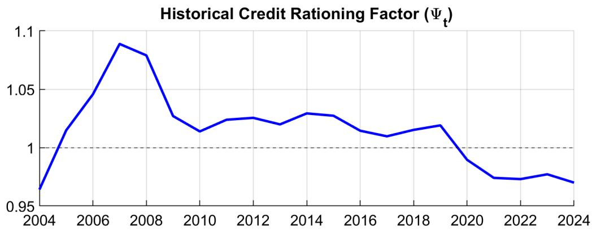

Realized Loss Rate (%)  
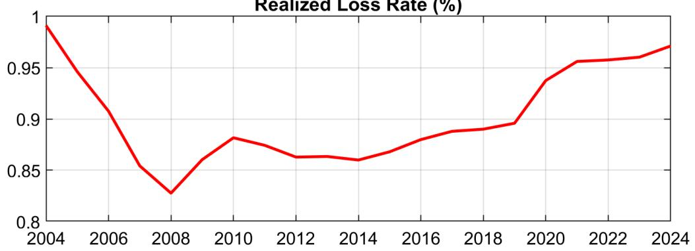  
Figure 1: Historical smoothed variables: risk vs. liquidity interaction (2004–2024).

Crucially, the decomposition resolves the banking stability question. The oil-liquidity nexus explains 53.02% of the total variance in aggregate credit ( $L_{Tot}$ ), confirming that credit dynamics in Oman are primarily driven by the fiscal-financial nexus rather than domestic productivity fluctuations. The exogenous rationing shock ( $\epsilon_{L}$ ) accounts for 8.19% of credit volatility, confirming that the endogenous structural equations capture the bulk of the transmission mechanism. Oil shocks also explain 12.35% of the variance in the rationing index ( $\Psi_{t}$ ), demonstrating that the endogenous oil-to-rationing channel is operative. Most importantly, shocks originating from internal banking solvency constraints ( $\epsilon_{NB}$ ) account for only 0.03% of credit variation, confirming that the solvency channel is quantitatively negligible relative to the liquidity channel.

In the context of the GCC, this is consistent with the view that macro-financial stress episodes are primarily imported from global energy markets and transmitted through the sovereign-deposit liquidity channel, rather than generated by spontaneous internal capital failures. This interpretation is conditional on the model's structural assumptions, but the qualitative ranking of channels is robust to the sensitivity analysis presented below.

## B. Regime analysis: the sustainability gap

While acknowledging the parameter uncertainty inherent in small-sample estimations, the primary utility of this structural framework is its capacity for rigorous counterfactual analysis. The qualitative insights generated by comparing the conservative versus accommodative regimes—specifically the directional trade-off between retail consumption smoothing and corporate capital formation—are structurally hardwired into the model’s transmission channels and hold true across a wide range of plausible parameterizations.

To isolate the value of Omani banking conservatism, we analyze the net cumulative differential in macroeconomic outcomes between a hypothetical “accommodative/responsive regime” (regulatory forbearance) and the baseline “conservative” regime (hard rationing). We evaluate this policy trade-off under two distinct structural environments: the current Omani economy and a future “Vision 2040 (Deep Credit)” framework.

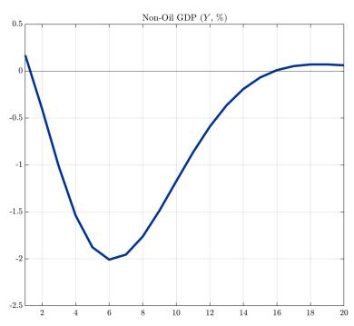

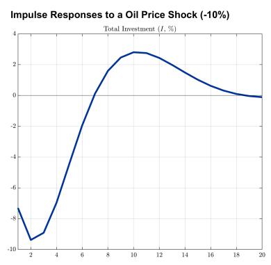

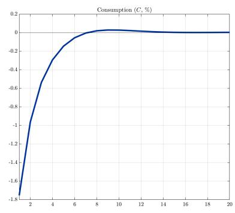

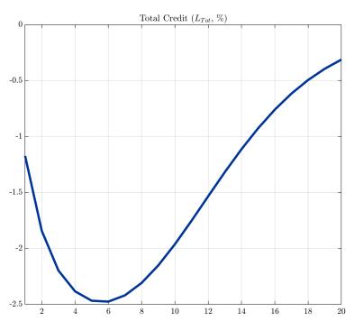

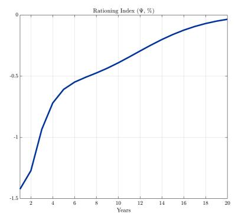

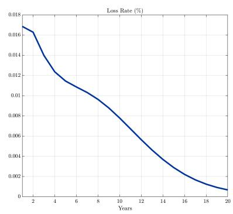  
Figure 2: Impulse Responses to a 1 std (about 10%) Oil Price Crash under the Conservative baseline. Variables denote percentage deviations from steady state.

The simulated oil crash (Figure 2) illustrates the macroeconomic dynamics of the Omani business cycle as captured by the model's structural transmission channels.

As shown in Figure 3, the rationing index $(\Psi_{t})$ drops precipitously during a liquidity squeeze, immediately constricting corporate credit.

Figure 4 plots these cumulative macroeconomic differentials based on our structural simulations. Specifically, the shaded areas represent the policy trade-off (Accommodative minus Conservative) under Oman's current economic structure. The dashed line, however, represents the structural differential (Vision 2040 minus Current Baseline), assuming the banking sector rigidly maintains its current conservative rationing behavior in both scenarios.

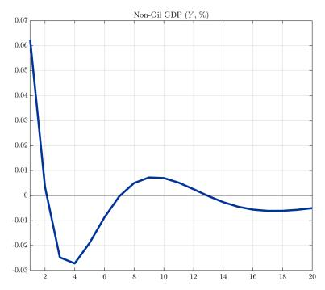

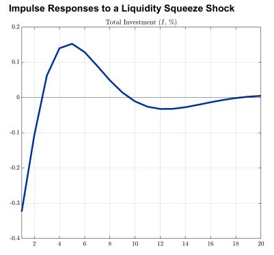

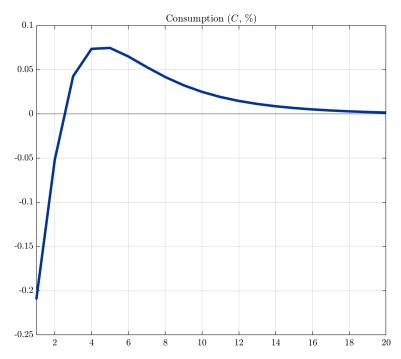

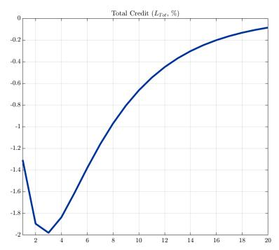

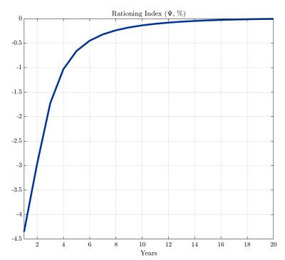

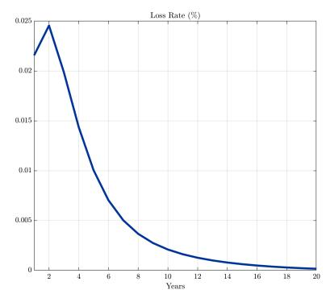  
Figure 3: Impulse Responses to an Exogenous Liquidity Squeeze Shock. Variables denote percentage deviations from steady state.

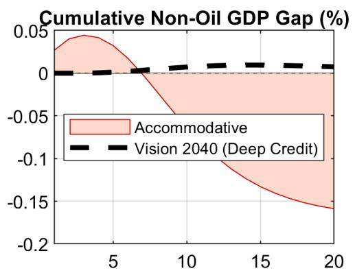

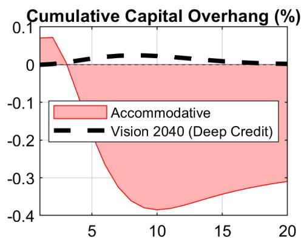

Cumulative Welfare (Consumption) (%)  
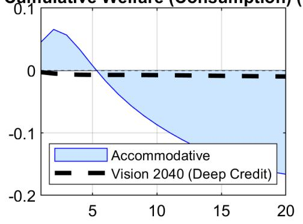

15 Credit Supply Gap (Flow $\Delta$ $\Psi$ , %)  
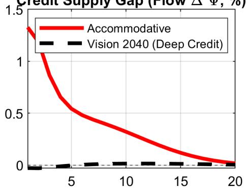  
Figure 4: Cumulative Regime Trade-off (Oil Crash): The shaded areas plot the policy differential (Accommodative minus Conservative) under the current economy. The dashed line plots the structural differential (Vision 2040 minus Current Baseline), illustrating the impact of deepening corporate credit while maintaining conservative banking.

Under the current economic structure (red/blue shaded areas), switching to an accommodative regime means the banking sector fails to implement “hard rationing” during a crash. As shown in the figure, while this regime preserves household consumption and non-oil GDP in the short run (the gaps are initially positive), it crowds out corporate financing. This ultimately leads to a long-term erosion of the productive capital base, dragging consumption and GDP into negative territory over a 20-year horizon.

Conversely, the dashed line evaluates the impact of achieving Vision 2040 credit depth targets $m^{F} = 0.60$ while strictly maintaining the current conservative banking posture. Because the dashed line plots the Vision 2040 economy against the current economy under the exact same conservative banking parameters, its trajectory reveals a surprising structural resilience. The positive gaps in non-oil GDP and capital overhang indicate that in a more heavily financialized corporate economy, the increased collateral depth allows productive firms to better weather liquidity squeezes, improving macroeconomic outcomes even if banks remain conservative.

## C. Sensitivity analysis

To assess the robustness of the qualitative findings, we conduct sensitivity analysis along four dimensions, each implemented as a separate counterfactual simulation.

Liquidity friction bounds. We vary the liquidity friction parameter $(\kappa_{liq})$ across a range spanning the posterior credible interval: from $\kappa_{liq} = 0.55$ (approximately one posterior standard deviation below the mean) to $\kappa_{liq} = 1.35$ (one standard deviation above). The conditional variance decomposition at the 20-year horizon confirms that the dominance of oil-driven shocks in explaining credit variance is robust across this range. Even at the lower bound, where the liquidity channel is substantially weakened, oil price shocks continue to explain the majority of credit variance, while bank capital shocks $(\epsilon_{NB})$ remain a secondary driver.

SWF stabilization aggressiveness. We increase the SWF deficit response parameter from its baseline ( $\phi_{def} = 0.12$ ) to an aggressive value ( $\phi_{def} = 0.40$ ), simulating a fiscal regime where the sovereign wealth fund provides three times more counter-cyclical support. The more aggressive SWF attenuates the government deposit channel but does not eliminate the domestic liquidity squeeze, confirming that even under enhanced fiscal buffering—as observed in more asset-rich GCC economies—the banking system's exposure to pro-cyclical deposit dynamics remains operative.

Supply vs. demand channel decomposition. To address the identification challenge of separating supply-side credit rationing from demand-side effects, we simulate a “demand-dominant” counterfactual in which the supply-side mechanisms are substantially muted ( $\kappa_{liq} = 0.10$ , $\sigma_{rat} = 0.10$ ) while the financial accelerator is amplified ( $\chi_{q} = 0.08$ ). In this configuration, oil shocks continue to transmit powerfully to the banking sector and credit, but through the collateral-asset price channel rather than quantity rationing. The overall magnitude of the credit response to oil shocks is comparable across specifications, suggesting that while the relative decomposition between supply and demand channels is sensitive to modeling assumptions, the finding that oil shocks transmit forcefully to banking outcomes through the fiscal-financial nexus is robust.

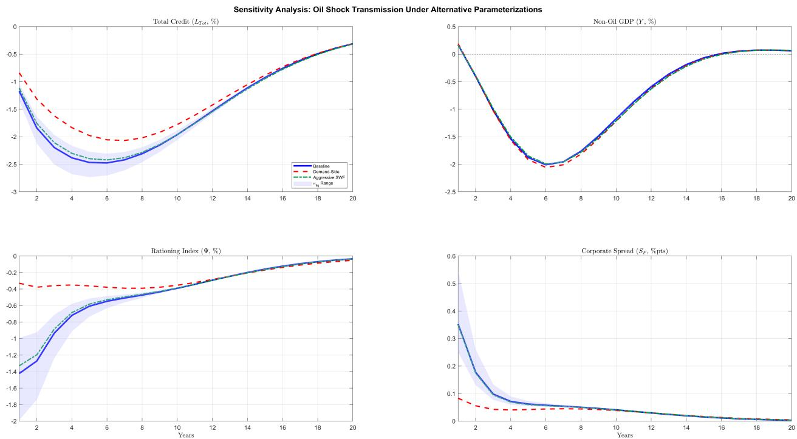  
Figure 5: Sensitivity analysis: impulse responses to an oil price shock under alternative parameterizations. Blue solid = baseline; red dashed = demand-side dominant; green dash-dot = aggressive SWF stabilization; blue band = $\kappa_{liq}$ credible interval range.

Credit depth. The Vision 2040 counterfactual ( $m^{F} = 0.60$ ) presented above demonstrates that the qualitative regime trade-off holds under substantially deeper corporate credit markets, with the magnitude of the consumption-investment gap narrowing as $m^{F}$ increases.

Figure 5 summarizes the sensitivity analysis. The blue band represents the range of credit responses across $\kappa_{liq}$ parameterizations, while the red dashed and green dash-dot lines show the demand-side and aggressive SWF scenarios, respectively. The credit contraction following an oil shock is comparable in magnitude across all specifications, confirming that the fiscal-financial nexus transmission is robust to the specific channel decomposition.

Figure 6 isolates each channel by shutting it off individually while keeping the other active. When the liquidity channel is switched off (red dashed), the rationing index $(\Psi_{t})$ barely responds to the oil shock, and credit recovers substantially faster. When the solvency channel is switched off (green dash-dot), the credit response is only moderately attenuated. This confirms that the liquidity channel is the primary driver of credit rationing during oil shocks.

## XVI. Conclusions

The central question of this research is whether oil economies like Oman should be concerned about the impact of oil shocks on their banking systems. Our analysis provides a clear answer: Yes, and the primary risk lies in liquidity-driven quantity rationing rather than conventional solvency stress. The structural variance decomposition shows that oil price shocks explain over 54% of non-oil GDP variance and 53% of credit variance, while bank capital shocks account for less than 0.1%. The Bayesian estimation widens the gap between the liquidity and solvency channels relative to the prior assumptions ( $\kappa_{liq}/\chi_{risk}$ ratio rises from 1.83 to 2.25), confirming that the Omani data actively support the dominance of the liquidity channel.

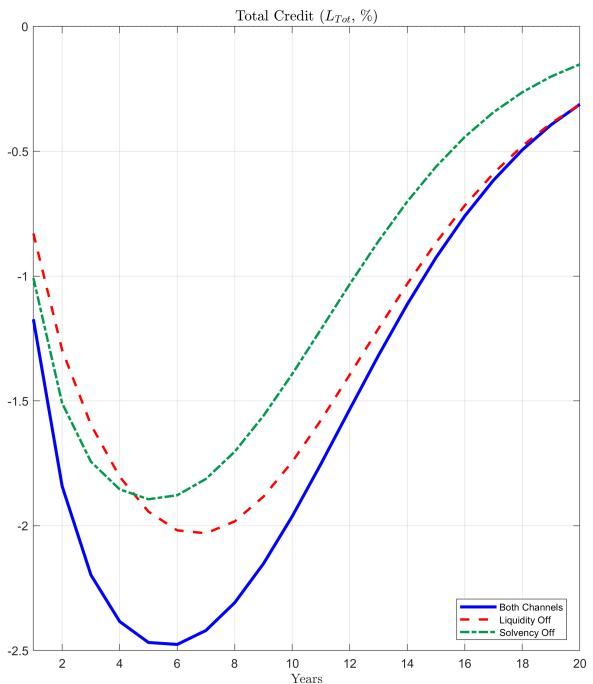

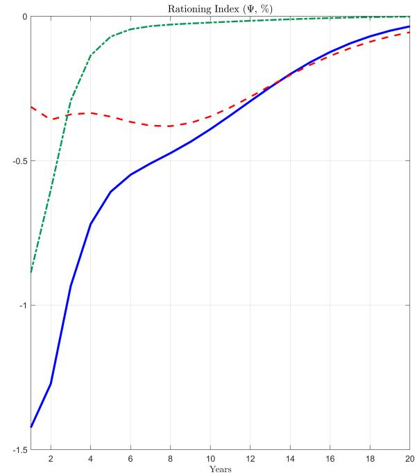  
Figure 6: Channel decomposition: response to the same oil price shock with each channel shut off individually. Blue solid = both channels active; red dashed = liquidity channel off; green dash-dot = solvency channel off.

We identify a structural trade-off where the current conservative posture acts as a forced capital protector. While an accommodative regime would allow for higher short-term household welfare (consumption), it would do so by crowding out productive investment and eroding the physical capital base. The conservative stance effectively sacrifices short-term consumer spending to protect long-term corporate growth.

Crucially, our counterfactual analysis of the Oman Vision 2040 economic diversification agenda demonstrates the stabilizing power of credit depth. The Vision 2040 counterfactual models a future where the economy financializes and corporate credit deepens ( $m^{F} = 0.60$ ). As shown by the positive trajectory of the dashed lines in Figure 4, maintaining a conservative banking posture in this highly financialized future does not lead to catastrophic capital destruction. Instead, the increased collateral capacity allows productive firms to better absorb liquidity shocks, yielding structurally higher GDP and investment retention during a crisis compared to the current shallow-credit baseline.

The analysis suggests that banking conservatism has played a protective role for the Omani capital stock, and the ongoing diversification under Vision 2040 appears likely to further amplify this structural resilience, potentially allowing the economy to navigate hydrocarbon volatility without

the costs associated with regulatory forbearance.

## The Vision 2040 dividend: structural resilience

Our counterfactual analysis reveals a structural insight for transitioning economies: the welfare consequences of a given regulatory regime are highly sensitive to the composition of the credit market.

Under Oman's current baseline—where aggregate credit is heavily dominated by household personal loans and mortgages—the banking sector's conservative (liquidity-hoarding) posture is macroeconomically justifiable. In a consumer-heavy credit market, an accommodative stance during an oil crash merely subsidizes imported consumption while allowing non-performing loans to languish as a “zombie” overhang. By aggressively rationing credit, banks protect their dividend-paying capacity, which acts as a vital income floor for the domestic economy.

Furthermore, this dynamic improves under the Vision 2040 counterfactual. As the Omani economy financializes and corporate credit depth increases, productive firms possess greater collateral buffers. In this future state, the current conservative regime remains highly effective. Because firms are better capitalized, they can withstand temporary oil liquidity squeezes and preemptive “hard rationing” without starving for rollover funding. This translates a temporary terms-of-trade shock into a manageable contraction rather than a multi-year physical capital depression.

The model results suggest that successful economic diversification enhances systemic stability. As Oman transitions toward a corporate-borrower economy, the existing conservative regulatory framework appears well-suited to navigate the structural transformation. Recent developments underscore the evolving financial landscape: the rapid expansion of the Islamic banking sector has acted as a catalyst for Vision 2040 diversification objectives, growing in just over a decade to capture $20\%$ of total financing and over $17.5\%$ of total assets. The sukuk market has similarly expanded, providing an alternative channel for sovereign and corporate financing that deepens the domestic capital market and potentially reduces the banking system's exclusive intermediation burden. As the credit market evolves from its traditional retail-heavy composition to a more diversified, dual-banking structure supporting corporate growth, robust capital buffers and systemic liquidity frameworks become increasingly important for navigating hydrocarbon volatility without triggering systemic credit freezes.

## XVII. Technical Annex: Full Log-Linearized Model Specification

This annex provides the fully log-linearized structural specification of the Omani DSGE model, evaluated around its deterministic steady state. Lower-case variables denote log-deviations (percentage deviations) from their respective steady-state values (e.g., $x_{t} = \ln(X_{t}/\overline{X})$ ). Variables that possess a steady state of zero (e.g., the government deficit $def_{t}$ , net foreign assets $b_{t}$ ) are strictly defined as level deviations.

## A. The Financial and Banking Sector

## The solvency channel: capital and shadow pricing

To avoid denominator illusions during credit contractions, the capital shadow price $(\Lambda_{B,t})$ penalizes absolute equity deviations strictly against the steady-state anchor:

$$
\Lambda_ {B, t} = \phi_ {l e v} \cdot \left(\frac {\overline {{N}} ^ {B}}{N _ {t} ^ {B}} - 1\right)\tag{41}
$$

Bank net worth accumulates through the reinvestment of intermediation profits, subject to an exogenous capital shock:

$$
n _ {t} ^ {B} = \rho_ {n b} n _ {t - 1} ^ {B} + \frac {\theta_ {b} \overline {{\Pi}} ^ {B}}{\overline {{N}} ^ {B}} \pi_ {t} ^ {B} + \varepsilon_ {n b, t}\tag{42}
$$

Bank profits $(\pi_{t}^{B})$ follow a log-linearized revenue stream strictly weighted by steady-state loan volumes:

$$
\begin{array}{r l} & {\pi_ {t} ^ {B} = \frac {\overline {{L}} _ {F} \overline {{R}} _ {F} ^ {L}}{\overline {{\Pi}} ^ {B}} r _ {F, t - 1} ^ {a v g} + \frac {\overline {{L}} _ {H} \overline {{R}} _ {H} ^ {L}}{\overline {{\Pi}} ^ {B}} r _ {H, t - 1} ^ {a v g} - \frac {\overline {{R}} ^ {D} (\overline {{L}} _ {F} + \overline {{L}} _ {H})}{\overline {{\Pi}} ^ {B}} r _ {t - 1} ^ {D}} \\ & {\qquad + \frac {(\overline {{R}} _ {F} ^ {L} - \overline {{R}} ^ {D}) \overline {{L}} _ {F}}{\overline {{\Pi}} ^ {B}} l _ {F, t - 1} + \frac {(\overline {{R}} _ {H} ^ {L} - \overline {{R}} ^ {D}) \overline {{L}} _ {H}}{\overline {{\Pi}} ^ {B}} l _ {H, t - 1} - \frac {\overline {{L o s s}} \cdot \overline {{L}} _ {t o t}}{\overline {{\Pi}} ^ {B}} (\ell_ {t - 1} + l _ {t - 1} ^ {t o t})} \end{array}\tag{43}
$$

## The liquidity channel: sovereign-liquidity friction

The shadow cost of liquidity $(\mu_{t}^{liq})$ captures the absolute cash shortfall relative to non-oil GDP, augmented by a liquidity-risk bridge $(\chi_{\omega})$ :

$$
\mu_ {t} ^ {l i q} = \kappa_ {l i q} \left(\frac {\overline {{D}} ^ {G} - D _ {t} ^ {G}}{\overline {{Y}}}\right) + \chi_ {\omega} (n p l \_ r a t i o _ {t} - \overline {{n p l}})\tag{44}
$$

## Endogenous risk-taking (Minsky defaults and variance truncation)

The transition probability of default ( $p_t^{def}$ ) endogenizes credit risk via a structural income proxy that rigorously captures dynamic variations in the bank's sectoral portfolio weights ( $\omega_H^{inc}$ and $\omega_F^{inc}$ defined as steady-state income shares):

$$
i n c \_ p r o x y _ {t} = \omega_ {H} ^ {i n c} (w _ {t} + n _ {t} ^ {D} + l _ {H, t} - l _ {t o t, t}) + \omega_ {F} ^ {i n c} (y _ {t} ^ {t o t} + l _ {F, t} - l _ {t o t, t})\tag{45}
$$

By selectively screening out the highest-risk tail during a credit squeeze ( $\Psi_{t} < 1$ ), the bank dynamically insulates the surviving loan portfolio from aggregate recessionary dynamics. This yields a time-varying default sensitivity parameter ( $\tilde{\phi}_{npl,t}$ ):

$$
\tilde {\phi} _ {n p l, t} = \phi_ {n p l} \cdot (\Psi_ {t} ^ {\tau_ {t r u n c}})\tag{46}
$$

This parameter is then fed directly into the structural default equation, alongside the direct

rollover risk penalty ( $\kappa_{lev}$ log $\Psi_{t}$ ):

$$
\log \left(\frac {p _ {t} ^ {d e f}}{\bar {p} ^ {d e f}}\right) = \rho_ {n p l} \log \left(\frac {p _ {t - 1} ^ {d e f}}{\bar {p} ^ {d e f}}\right) - \tilde {\phi} _ {n p l, t} \cdot i n c \_ p r o x y _ {t} - \kappa_ {l e v} \log (\Psi_ {t}) + \varepsilon_ {p d e f, t}\tag{47}
$$

The non-performing loan stock accumulates via a geometric amortization flow based on the active loan book $(l_{t}^{tot})$ :

$$
n p l _ {t} = (1 - \delta_ {n p l}) n p l _ {t - 1} + \delta_ {n p l} (p _ {t} ^ {d e f} + l _ {t} ^ {t o t}) + \varepsilon_ {n p l, t}\tag{48}
$$

## Volume rationing and interest rate spreads

The volume rationing factor $(\psi_{t})$ acts as the core non-price mechanism, governed by institutional inertia $(\gamma_{\psi})$ :

$$
\log (\Psi_ {t}) = \gamma_ {\psi} \log (\Psi_ {t - 1}) + (1 - \gamma_ {\psi}) \left[ - \sigma_ {r a t} \mu_ {t} ^ {l i q} - \chi_ {r i s k} \log \left(\frac {\ell_ {t}}{\overline {{\ell}}}\right) - \Lambda_ {B, t} \right] + \varepsilon_ {L, t}\tag{49}
$$

Retail interest rate spreads $(s_{t}^{H}, s_{t}^{F})$ are set as a markup over the wholesale funding cost, driven by realized losses $(\ell_{t})$ and a composite risk amplification index $(ra_{t})$ :

$$
\ell_ {t} = p _ {t} ^ {d e f}\tag{50}
$$

$$
r a _ {t} = w a m p \cdot \Lambda_ {B, t} + (1 - w a m p) \cdot \chi_ {r i s k} \log \left(\frac {\ell_ {t}}{\bar {\ell}}\right)\tag{51}
$$

$$
s _ {t} ^ {H} = \phi_ {l h \_ s s} + \left(\frac {1}{1 - \ell_ {t}} - 1\right) + \phi_ {r i s k, s p r} r a _ {t} + \phi_ {l i q, s p r} \mu_ {t} ^ {l i q} + \varepsilon_ {s p r e a d, t}\tag{52}
$$

$$
s _ {t} ^ {F} = \phi_ {l f \_ s s} + \left(\frac {1}{1 - \ell_ {t}} - 1\right) + \phi_ {r i s k, s p r} r a _ {t} + \phi_ {l i q, s p r} \mu_ {t} ^ {l i q} + \varepsilon_ {s p r e a d, t}\tag{53}
$$

The effective deposit rate incorporates a funding cost pass-through from these internal liquidity constraints:

$$
r _ {t} ^ {D} = r _ {t} ^ {N} + \phi_ {f u n d} (\phi_ {r i s k \_ s p r} \cdot r a _ {t} + \phi_ {l i q \_ s p r} \cdot \mu_ {t} ^ {l i q})\tag{54}
$$

## Target Credit Capacities and Loan Flows

The theoretical limits for maximum credit absorption are defined by the log-linearized collateral and cash flow constraints. The household target incorporates both standard property LTV limits $(\omega_{H}^{ltv})$ and Payment-to-Income restrictions $(\kappa_{pers})$ , assuming housing supply is structurally fixed $(h_{t}=0)$ :

$$
l _ {H, t} ^ {*} = \omega_ {H} ^ {l t v} q _ {t} ^ {H} + (1 - \omega_ {H} ^ {l t v}) (w _ {t} + n _ {I, t})\tag{55}
$$

$$
l _ {F, t} ^ {*} = \omega_ {F} ^ {l t v} (q _ {t} + k _ {t}) + (1 - \omega_ {F} ^ {l t v}) (w _ {t} + n _ {t} ^ {t o t})\tag{56}
$$

Total credit evolves as a slow-moving stock. New loan originations $(l_{t}^{new})$ respond to target capacities and the quantity rationing filter $(\psi_{t})$ . Note the structural presence of the asymmetric

corporate penalty $(\chi_{corp})$ :

$$
l _ {H, t} ^ {n e w} = l _ {H, t} ^ {*} + \psi_ {t} + \varepsilon_ {L, H, t}\tag{57}
$$

$$
l _ {F, t} ^ {n e w} = l _ {F, t} ^ {*} + \chi_ {c o r p} \psi_ {t} + \varepsilon_ {L, F, t}\tag{58}
$$

$$
l _ {j, t} = (1 - m a t _ {j} - \overline {{p}} ^ {d e f}) l _ {j, t - 1} + m a t _ {j} l _ {j, t} ^ {n e w} - \overline {{p}} ^ {d e f} p _ {t} ^ {d e f} \quad \mathrm{for} j \in \{H, F \}\tag{59}
$$

Because only new originations are subject to current market conditions, the average interest rate on the aggregate portfolio $(r_{t}^{avg})$ adjusts sluggishly:

$$
r _ {t} ^ {a v g} = m a t _ {h} r _ {t} ^ {L} + (1 - m a t _ {h}) r _ {t - 1} ^ {a v g}\tag{60}
$$

## B. The Household Sector

## Patient households (savers)

The intertemporal consumption Euler equation, augmented by an external subsistence floor $(h)$ and a stationary risk premium on foreign bonds $(\phi_{b})$ :

$$
c _ {P, t} = \mathbb {E} _ {t} c _ {P, t + 1} - \frac {1 - h}{\sigma} (r _ {t} ^ {N} - \mathbb {E} _ {t} \pi_ {t + 1} - \phi_ {b} b _ {t}) + \varepsilon_ {C P, t}\tag{61}
$$

Impatient households and real estate

The house price $(q_{t}^{H})$ is determined by the linearized marginal rate of substitution and the expected future housing value:

$$
q _ {t} ^ {H} = \sigma c _ {I, t} - \beta (1 - \delta_ {h}) \sigma \mathbb {E} _ {t} c _ {I, t + 1} + \beta (1 - \delta_ {h}) \mathbb {E} _ {t} q _ {t + 1} ^ {H}\tag{62}
$$

Labor supply

Aggregate domestic labor supply $(n_{t}^{D})$ is a population-weighted average of patient $(n_{t}^{R})$ and impatient $(n_{t}^{I})$ agents:

$$
n _ {t} ^ {D} = \frac {(1 - \lambda_ {h}) \overline {{N}} _ {R}}{\overline {{N}} ^ {D}} n _ {t} ^ {R} + \frac {\lambda_ {h} \overline {{N}} _ {I}}{\overline {{N}} ^ {D}} n _ {t} ^ {I}\tag{63}
$$

Foreign labor $(n_{t}^{F})$ acts as an elastic structural vent following GHH preferences. Crucially, the domestic labor FOCs dictate that labor volumes adjust sluggishly due to Rotemberg employment adjustment costs:

$$
\kappa_ {n} (n _ {t} ^ {R} - n _ {t - 1} ^ {R}) = \beta \kappa_ {n} \mathbb {E} _ {t} (n _ {t + 1} ^ {R} - n _ {t} ^ {R}) - \left(\frac {\sigma}{1 - h} c _ {t} ^ {P} + \gamma_ {R} n _ {t} ^ {R} - w _ {t}\right) - \varepsilon_ {w, t}\tag{64}
$$

$$
\kappa_ {n} (n _ {t} ^ {I} - n _ {t - 1} ^ {I}) = \beta \kappa_ {n} \mathbb {E} _ {t} (n _ {t + 1} ^ {I} - n _ {t} ^ {I}) - (\sigma c _ {t} ^ {I} + \gamma n _ {t} ^ {I} - w _ {t}) - \varepsilon_ {w, t}\tag{65}
$$

$$
n _ {t} ^ {F} = \rho_ {n} n _ {t - 1} ^ {F} + (1 - \rho_ {n}) \zeta w _ {t} + \varepsilon_ {N, t}\tag{66}
$$

## C. The Production and Investment Sector

## Firms and marginal cost

The non-oil production function $(y_{t})$ and the real marginal cost $(mc_{t})$ , which integrates the working capital friction $(\nu)$ requiring firms to finance payrolls at the corporate lending rate $(r_{F,t}^{L})$ :

$$
y _ {t} = a _ {t} + \alpha k _ {t - 1} + (1 - \alpha) n _ {t} ^ {t o t}\tag{67}
$$

$$
m c _ {t} = (1 - \alpha) w _ {t} + \alpha r _ {t} ^ {K} + \omega r e r _ {t} - a _ {t} + (1 - \alpha) \frac {\nu \overline {{R}} _ {F} ^ {L}}{1 + \nu \overline {{R}} _ {F} ^ {L}} r _ {F, t} ^ {L}\tag{68}
$$

Factor demands for labor and capital:

$$
w _ {t} + \left(\frac {\nu \overline {{R}} _ {F} ^ {L}}{1 + \nu \overline {{R}} _ {F} ^ {L}}\right) r _ {F, t} ^ {L} = m c _ {t} + y _ {t} - n _ {t} ^ {t o t}\tag{69}
$$

$$
r _ {t} ^ {K} = m c _ {t} + y _ {t} - k _ {t - 1}\tag{70}
$$

## Capital accumulation and Tobin's Q

Investment $(i_{t})$ is governed by CEE (2005) adjustment costs $(\psi)$ , and the shadow price of capital $(q_{t})$ includes a fire-sale collateral premium $(prem_{K,t})$ directly linked to bank rationing $(\psi_{t})$ :

$$
k _ {t} = (1 - \delta) k _ {t - 1} + \delta i _ {t} + \delta \varepsilon_ {I, t}\tag{71}
$$

$$
i _ {t} = \frac {1}{1 + \beta} i _ {t - 1} + \frac {\beta}{1 + \beta} \mathbb {E} _ {t} i _ {t + 1} + \frac {1}{\psi (1 + \beta)} (q _ {t} + \varepsilon_ {I, t})\tag{72}
$$

$$
q _ {t} = \mathbb {E} _ {t} \left[ (1 - \beta (1 - \delta)) r _ {t + 1} ^ {K} + \beta (1 - \delta) q _ {t + 1} \right] - (r _ {t} ^ {N} - \mathbb {E} _ {t} \pi_ {t + 1}) + p r e m _ {K, t}\tag{73}
$$

$$
p r e m _ {K, t} = \chi_ {q} (\Psi_ {t} - 1)\tag{74}
$$

## D. Prices, Fiscal Policy, and the External Sector

## Inflation and real exchange rate

The hybrid New Keynesian Phillips curve and real exchange rate $(rer_{t})$ dynamics under the USD currency peg:

$$
\pi_ {t} = \gamma_ {b} \pi_ {t - 1} + \gamma_ {f} \mathbb {E} _ {t} \pi_ {t + 1} + \kappa m c _ {t} + \varepsilon_ {\pi , t}\tag{75}
$$

$$
r e r _ {t} = r e r _ {t - 1} - \pi_ {t} - \phi_ {r e r} r e r _ {t} + \varepsilon_ {R E R, t}\tag{76}
$$

## The sovereign shield and fiscal block

Government expenditure $(g_{t})$ follows a pro-cyclical rule relative to hydrocarbon export proceeds $(p_{t}^{O} + y_{t}^{O})$ . Crucially, government transactional deposits $(d_{t}^{G})$ strictly track these proceeds, forming

the transmission link to the banking block:

$$
g _ {t} = \rho_ {g e} g _ {t - 1} + \phi_ {g e \_ o i l} (p _ {t} ^ {O} + y _ {t} ^ {O}) + \varepsilon_ {G E, t}\tag{77}
$$

$$
d _ {t} ^ {G} = p _ {t} ^ {O} + y _ {t} ^ {O} + \varepsilon_ {D G, t}\tag{78}
$$

Government revenue $(gr_{t})$ and social transfers $(tr_{t})$ respond dynamically to the aggregate economy:

$$
g r _ {t} = \frac {\tau \overline {{W N}} ^ {D}}{\overline {{G R}}} (w _ {t} + n _ {t} ^ {D}) + \frac {\tau_ {o i l} \overline {{P}} ^ {O} \overline {{Y}} ^ {O}}{\overline {{G R}}} (p _ {t} ^ {O} + y _ {t} ^ {O})\tag{79}
$$

$$
t r _ {t} = \rho_ {t r} t r _ {t - 1} + \phi_ {t r} (p _ {t} ^ {O} + y _ {t} ^ {O})\tag{80}
$$

Sovereign wealth fund $(s_{t})$ accumulation and rule-based stabilization transfers $(t_{t}^{SWF})$ :

$$
s _ {t} = (1 + r ^ {s w f}) s _ {t - 1} - \left(\frac {\overline {{T}} ^ {S W F}}{\overline {{S}}}\right) t _ {t} ^ {S W F}\tag{81}
$$

$$
t _ {t} ^ {S W F} = \phi_ {s w f} \left(\frac {\overline {{S}}}{\overline {{T}} ^ {S W F}}\right) s _ {t - 1} + \left(\frac {\phi_ {d e f}}{\overline {{T}} ^ {S W F}}\right) d e f _ {t}\tag{82}
$$

## Market Clearing and External Balance

The aggregate goods market clears across both domestic and external sectors:

$$
y _ {t} ^ {t o t} = \frac {\overline {{Y}}}{\overline {{Y}} ^ {t o t}} y _ {t} + \frac {\overline {{P}} ^ {O} \overline {{Y}} ^ {O}}{\overline {{Y}} ^ {t o t}} (p _ {t} ^ {O} + y _ {t} ^ {O})\tag{83}
$$

$$
x _ {t} ^ {\text {nonoil}} = \phi_ {x} r e r _ {t} + a _ {t}\tag{84}
$$

$$
m _ {t} = \frac {\overline {{C}} c _ {t} + \overline {{G E}} g e _ {t} + \overline {{I}} ^ {t o t} i _ {t} ^ {t o t}}{\overline {{C}} + \overline {{G E}} + \overline {{I}} ^ {t o t}} - \phi_ {m} r e r _ {t} - \kappa_ {m} (m _ {t} - m _ {t - 1})\tag{85}
$$

$$
c _ {t} = \frac {\overline {{Y}}}{\overline {{C}}} y _ {t} + \frac {\overline {{P}} ^ {O} \overline {{Y}} ^ {O}}{\overline {{C}}} (p _ {t} ^ {O} + y _ {t} ^ {O}) - \frac {\overline {{I}} ^ {t o t}}{\overline {{C}}} i _ {t} ^ {t o t} - \frac {\overline {{G E}}}{\overline {{C}}} g e _ {t} - \frac {\overline {{N X}}}{\overline {{C}}} n x _ {t}\tag{86}
$$

The government deficit $(def_{t})$ acts as a level deviation driving the SWF transfers:

$$
d e f _ {t} = \overline {{G E}} \cdot g e _ {t} + \overline {{T R}} \cdot t r _ {t} - \overline {{G R}} \cdot g r _ {t} - \overline {{T}} ^ {S W F} \cdot t _ {t} ^ {S W F}\tag{87}
$$

Because net foreign assets are exactly zero in the baseline steady state $(\overline{B}=0)$ , $b_{t}$ must strictly be defined as a level deviation. It evolves according to the log-deviations of the trade balance $(nx_{t})$ , remittance outflows $(rm_{t})$ , and capital injections $(t_{t}^{SWF})$ , formally weighted by their respective steady-state volume capacities:

$$
\overline {{N X}} \cdot n x _ {t} = \overline {{P}} ^ {O} \overline {{Y}} ^ {O} (p _ {t} ^ {O} + y _ {t} ^ {O}) + \overline {{X}} ^ {N o n O i l} x _ {t} ^ {n o n o i l} - \overline {{M}} m _ {t}\tag{88}
$$

$$
b _ {t} = \frac {1}{\beta} b _ {t - 1} + \overline {{N X}} \cdot n x _ {t} - \overline {{R M}} \cdot r m _ {t} + \overline {{T}} ^ {S W F} \cdot t _ {t} ^ {S W F}\tag{89}
$$

## References

K. R. Alkhater. The Economic Developments in Qatar and GCC Banking. Gulf Centre for Development Studies, 2014.

P. Beaudry and F. Portier. An exploration into Pigou's theory of cycles. Journal of Monetary Economics, 51(6):1183–1216, 2004.

B. S. Bernanke, M. Gertler, and M. Watson. Systematic monetary policy and the effects of oil price shocks. Brookings Papers on Economic Activity, 1:91–142, 1997.

B. S. Bernanke, M. Gertler, and S. Gilchrist. The financial accelerator in a quantitative business cycle framework. Handbook of Macroeconomics, 1:1341–1393, 1999.

L. J. Christiano, M. Eichenbaum, and C. L. Evans. Nominal rigidities and the dynamic effects of a shock to monetary policy. Journal of Political Economy, 113(1):1–45, 2005.

B. Fattouh and L. El-Katiri. Energy market dynamics and financial stability in the UAE. Technical report, Oxford Institute for Energy Studies, 2012.

P. Gelain and M. Lorusso. Oil price shocks and bank balance sheets. Journal of International Money and Finance, 2022.

A. Gerali, S. Neri, L. Sessa, and F. M. Signoretti. Credit and Banking in a DSGE Model of the Euro Area. Journal of Money, Credit and Banking, 42(s1):107-141, 2010.

J. D. Hamilton. Oil and the macroeconomy since World War II. Journal of Political Economy, 91(2):228–248, 1983.

P. Khandelwal, K. Miyajima, and A. Santos. The Impact of Oil Prices on the Banking Sector in the GCC. IMF Working Paper WP/16/161, 2016.

L. Kilian. Not all oil price shocks are alike: Disentangling demand and supply shocks in the crude oil market. American Economic Review, 99(3):1053–69, 2009.

T. Kroen. Monetary policy transmission in Oman. IMF Selected Issues Papers, 2024(018), 2024.

R. Ma et al. Oil price shocks and the systemically important banks in China. Energy Economics, 2021.

A. Maghyereh and H. Abdoh. The impact of oil supply and demand shocks on systemic risk in GCC banking systems. Journal of International Financial Markets, Institutions and Money, 2021.

P. Monnin and T. Jokipii. The impact of banking sector stability on the real economy. Journal of International Money and Finance, 47:1–16, 2014.

M. Qin. The impact of oil price shocks on financial stress. Journal of Commodity Markets, 2020.

J. J. Rotemberg. Sticky prices in the United States. Journal of Political Economy, 90(6):1187–1211, 1982.

C. A. Sims. Solving linear rational expectations models. Computational Economics, 20(1-2):1–20, 2002.

