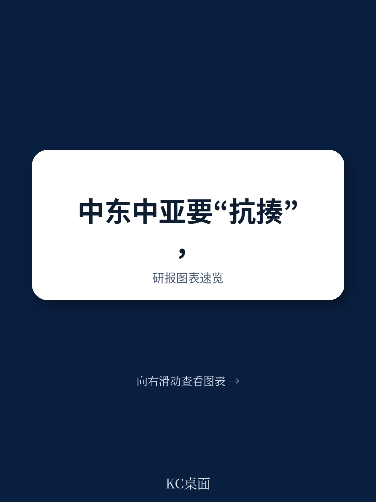
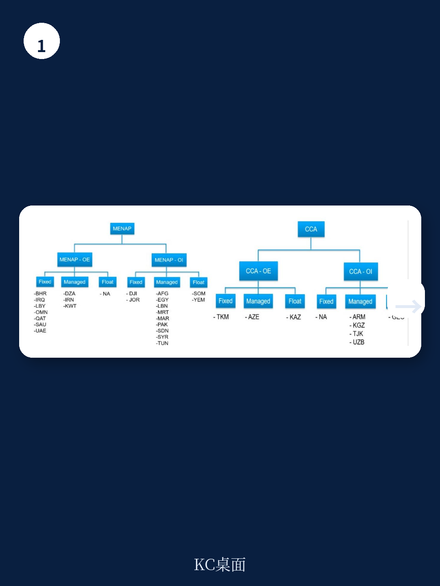
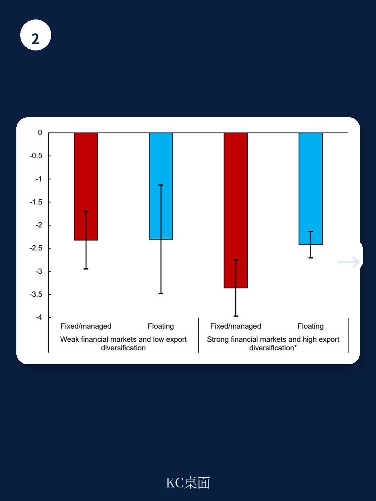

# IMF：中东和中亚的真正考验不是冲击本身，而是政策框架能否扛住下一轮全球波动

全球经济的核心叙事正在切换。贸易保护主义、地缘碎片化、以及美联储政策路径的不确定性，共同构成了一个高频外部冲击的新常态。对于中东、北非、巴基斯坦（MENAP）以及高加索和中亚（CCA）地区而言，一个根本性问题浮出水面：当下一轮全球风险溢价飙升或贸易条件恶化时，这些经济体靠什么来缓冲？

IMF在2026年7月发布的工作论文《Resilience by Design》给出了一个清晰且可检验的答案。核心判断是：政策框架的设计质量，而非资源禀赋或短期刺激能力，才是决定这些地区能否在冲击后实现“V型”修复的关键。报告通过全球面板实证和模型模拟，系统论证了两个支撑性结论——灵活的汇率制度与可信的通胀目标制组合，以及强约束力的财政规则，能够显著降低外部冲击带来的产出损失，并缩短调整周期。这篇导读将提炼报告中最值得决策者关注的逻辑链条和隐含判断，并指出报告尚未完全展开的关键追问。

> **KC评论：** 很多人把中东和中亚的经济韧性等同于石油美元储备或主权财富基金。但这份报告揭示了一个更微妙的现实：储备是盾牌，而政策框架是免疫系统。没有后者，冲击的滞后效应会持续侵蚀增长潜力。这一点，在报告对财政规则与主权利差关系的实证分析中表现得尤为突出，值得完整阅读原文图表。

## 1. 汇率制度选择不是技术细节，而是决定冲击传导路径的结构性变量

报告在实证部分采用局部投影法，对过去三十多年全球样本进行分析，得出了一个对政策制定者具有直接指导意义的结论：在遭遇全球不确定性冲击后，实行浮动汇率或通胀目标制灵活汇率的经济体，其实际GDP的累计损失明显小于实行固定汇率或严格钉住汇率的经济体。

这一结论的机制并不复杂。浮动汇率在冲击发生时充当了自动稳定器：本币贬值能够吸收部分外部需求下滑的压力，同时为出口部门提供竞争力缓冲。而固定汇率制度下，调整压力被迫全部落在国内价格和产出上，代价往往是更持久的经济收缩。报告特别指出，这一优势在金融市场深度较高、出口结构更多元的经济体中更为显著——这正是MENAP和CCA地区正在努力的方向，但当前仍落后于其他新兴市场。

然而，报告也审慎地指出，浮动汇率并非万能药。在资本账户开放程度高、但本币债务美元化严重的经济体中，汇率大幅波动可能引发资产负债表危机，抵消其稳定功能。这意味着，向浮动汇率过渡的路径设计——包括时机、节奏和配套改革——本身就是一个需要精细权衡的课题。

> **KC评论：** 报告没有简单地说“浮动优于固定”，而是强调“在特定条件下浮动更优”。这个“条件”包括出口多元化和金融市场深化。对于海湾产油国而言，出口结构高度依赖石油，即使转向浮动汇率，自动稳定器效果也会打折扣。报告对GCC国家的分析正好点出了这个悖论——它们拥有最丰厚的储备，却可能面临最僵化的调整机制。完整报告中关于不同汇率制度下产出损失对比的图表，是理解这一点的关键。

## 2. 强财政规则不是束缚，而是降低主权风险溢价、释放反周期空间的前提

报告的另一项核心发现直接挑战了“财政规则等于紧缩”的流行叙事。通过对57个国家1996-2021年面板数据的回归分析，IMF发现：拥有强财政规则的国家，其主权利差平均比没有规则或规则薄弱的国家低约85个基点。

这个数字的经济含义是深远的。更低的利差意味着更低的融资成本，也意味着在危机来临时，政府有更大的财政空间实施反周期刺激，而不是被迫在衰退中加税或削减支出。报告进一步通过模型模拟展示了这一机制：在遭受相同规模的外部冲击后，实行强财政规则的经济体，其实际GDP的下降幅度更小，且财政赤字和利差的上升幅度更为温和。

报告对财政规则强度的定义值得关注。它不仅仅是“有没有规则”，而是涵盖法律基础、透明度、执行机制和抗冲击能力等多个维度。MENAP和CCA地区在这一点上明显落后：只有约四分之一的经济体拥有正式运行的财政规则，而新兴市场和发展中经济体的比例为三分之二，发达经济体则超过80%。

> **KC评论：** 报告用一个简洁的回归结果戳破了一个常见的误解：财政规则不是“自缚手脚”，而是“购买保险”。85个基点的利差优势，在主权债市场上是巨大的信用背书。但报告也留下了一个未完全回答的问题：对于已经拥有庞大主权财富基金和低债务水平的GCC国家，财政规则的边际价值是否仍然显著？答案可能取决于这些国家是否希望从“资源型信用”转向“制度型信用”。这一点，报告在讨论经济缓冲变量时有所涉及，但并未展开推演。

## 3. MENAP和CCA地区正处于政策框架升级的窗口期，但路径依赖是最大阻力

报告的一个隐含但重要的判断是：当前全球环境的剧变，恰恰为MENAP和CCA地区提供了推动政策框架改革的契机。随着出口多元化和金融市场深化逐步推进，转向更灵活汇率制度和更强财政规则的收益正在增大。如果等到下一轮冲击来临时再仓促调整，代价将远高于主动改革。

然而，路径依赖是真实存在的阻力。报告指出，该地区多数国家的货币政策框架长期偏重汇率稳定目标，部分原因是历史经验中固定汇率曾成功抑制通胀。但问题在于，当全球利率环境发生结构性变化，或者主要贸易伙伴的经济周期出现不对称时，固定汇率可能从“稳定锚”变成“风险放大器”。报告引用了阿根廷2001年危机和黎巴嫩2019年崩溃作为警示案例——两者都是在固定汇率框架下，因财政主导或信誉缺失而最终爆发系统性危机。

对于CCA国家而言，情况更为复杂。它们倾向于维持更大的货币政策自主权和更开放的资本账户，但财政规则普遍薄弱。这意味着，在面临外部冲击时，货币政策可能因缺乏财政纪律的配合而陷入孤军奋战的困境——利率工具既要抑制通胀，又要应对资本外流，政策空间迅速收窄。

## 4. 报告尚未完全回答的关键问题：过渡路径的设计与政治经济的可行性

报告的严谨性体现在它明确指出了政策框架改革的收益，但也坦诚地留下了几个尚未充分展开的关键问题。

第一，从固定汇率向浮动汇率的过渡路径如何设计？报告提到了“渐进调整”和“条件成熟”等概念，但没有给出具体的时序和配套措施。历史经验表明，汇率制度转型过程中最危险的是“半浮动”状态——名义上浮动，但央行频繁干预，导致市场预期混乱，反而加剧波动。对于储备充足但出口单一的海湾国家，以及金融深度不足的CCA国家，最优过渡路径可能存在根本性差异。

第二，强财政规则的政治经济可行性如何保障？在资源型经济体中，财政规则往往面临来自支出部门和国有企业的巨大压力。报告承认“不合理的偏离可能削弱规则信誉”，但没有深入讨论如何建立独立监督机构、如何设计自动修正机制、以及如何在政治周期中维持规则连续性。这些问题对于正在考虑引入财政规则的经济体而言，是远比技术设计更棘手的挑战。

第三，报告的分析框架基于“全球不确定性冲击”这一单一类型，但现实中的冲击是多维的——包括贸易条件恶化、资本流动骤停、地缘政治风险溢价飙升等。不同冲击类型对汇率制度和财政规则的需求可能截然不同。一个对贸易冲击有效的政策组合，在面对金融冲击时可能表现不佳。报告没有对不同冲击类型进行区分检验，这为后续研究留下了空间。

## 5. 对投资者的观察框架：从“资源溢价”转向“制度溢价”

对于正在配置新兴市场资产、尤其是关注中东和中亚地区的投资者而言，这份报告提供了一个有价值的分析框架升级。传统的国别风险评估往往聚焦于资源储量、外汇储备覆盖率、债务/GDP比率等静态指标。而报告的核心启示是：政策框架的质量——尤其是汇率灵活性程度和财政规则的约束力——正在成为决定危机后恢复速度和信用溢价差异的动态变量。

这意味着，两个资源禀赋相似的国家，可能因为政策框架的不同，在下一轮全球冲击中走出截然不同的轨迹。投资者需要关注的，不仅仅是一个国家“有多少储备”，而是“当冲击来临时，它的政策工具箱里有什么、能多快启动、以及市场是否相信”。

具体而言，可以从三个维度构建观察框架：一是汇率制度与资本账户开放的匹配度，二是财政规则的法律强度与执行记录，三是货币政策框架的独立性与信誉度。报告中的实证结果可以作为量化基准——例如，强财政规则对应85个基点的利差优势——但每个国家的具体路径和风险点，仍需结合国别深度分析来判断。

---

这份IMF工作论文的价值，在于它用严谨的方法论将“韧性”从一个模糊的概念转化为可度量的政策参数。但它也提醒我们，政策框架的升级从来不是单纯的技术问题。它涉及利益再分配、官僚体系改革、以及市场信心的长期培育。这些才是决定“设计韧性”能否转化为“实际韧性”的真正变量。

关于不同汇率制度在不同出口结构下的产出损失模拟、财政规则强度指数的详细构建方法、以及报告对GCC国家与CCA国家的差异化政策建议，我们已在完整解读中整理了原始图表和关键数据。欢迎加入社群，与来自头部券商、PE/VC、投行、对冲基金、资管机构和战略咨询的朋友一起，持续追踪全球宏观叙事与边际变化，获取每日更新的国际信源汇编与评论。

Personal reading notes and learning share only. Not investment advice.

