# Sovereign Risk and Natural Disaster Shocks: Unraveling the Domestic Yield Curve Response

Kangni Kpodar, Alassane Drabo and Carine Meyimdjui

WP/26/139

IMF Working Papers describe research in progress by the author(s) and are published to elicit comments and to encourage debate. The views expressed in IMF Working Papers are those of the author(s) and do not necessarily represent the views of the IMF, its Executive Board, or IMF management.

2026
JUN

# IMF Working Paper African Department

# Sovereign Risk and Natural Disaster Shocks: Unraveling the Domestic Yield Curve Response Prepared by Kangni Kpodar, Alassane Drabo and Carine Meyimdjui\*

Authorized for distribution by Kangni Kpodar

July 2026

IMF Working Papers describe research in progress by the author(s) and are published to elicit comments and to encourage debate. The views expressed in IMF Working Papers are those of the author(s) and do not necessarily represent the views of the IMF, its Executive Board, or IMF management.

ABSTRACT: This paper investigates the impact of natural disasters on the domestic sovereign yield curve, shedding light on their distinct transmission channels. Using a sample of 72 developing countries during the period 2000-20, and leveraging a newly compiled dataset on domestic treasury bill and bond yields, the findings from the fixed-effects and the local projection difference in difference estimations point to a disaster premium in the pricing of domestic government securities. While natural disasters significantly steepen the yield curve, their effects are confined to short-term maturity debts. In contrast, a worsening in climate vulnerability shifts upward the entire yield curve. Heightened fiscal stress and monetary policy stance emerge as the main transmission channels. These results underscore the importance of integrating resilience building into debt management and fiscal policy frameworks.

JEL Classification Numbers:

H60, E43, F34

Keywords:

Natural disasters; sovereign risk; yield curve

Author's E-Mail Address:

kkpodar@imf.org, adrabo@imf.org

WORKING PAPERS

# Sovereign Risk and Natural Disaster Shocks: Unraveling the Domestic Yield Curve Response

Prepared by Kangni Kpodar, Alassane Drabo and Carine Meyimdjui

## Contents

I. Introduction......4
II. How do natural disaster shocks affect the cost of government financing?......7
A. A selective review of the literature......7
B. The transmission channels......8
III. The data, empirical model and econometric methodology......10
A. Data and measurements......10
B. The model specification and methodological approach......14
IV. Empirical results......17
A. Natural disaster shocks and the domestic sovereign yield curve......17
B. Testing the transmission channels......28
V. Conclusion......32
References......33
ANNEX
1. Domestic Sovereign Yield Database......38
FIGURES
1. Trends in Gross Public Debt in Developing Countries, 2000-20......5
2. Trends in Government Interest Bill in Developing Countries, 2000-20......5
3. Nominal Interest Rate on Government Securities, 2000-20......11
4. Yield Curve in Selected Years......11
5. Nominal Interest Rate on Government Securities by Income Group, 2000-20......12
6. Climate Change and the Cost of Government Domestic Borrowing, 2000-20......13
7. Average Treatment Effect of Drought on the Interest Rate on Domestic Government Securities, all maturities combined......25
8. Average Treatment Effect of Drought on the Interest Rate on Domestic Government Securities by Maturity......25
9. Average Treatment Effect of Storm on the Interest Rate on Domestic Government Securities, all maturities combined......26
10. Average Treatment Effect of Storm on the Interest Rate on Domestic Government Securities by Maturity......27
11. Average Treatment Effect of Climate Vulnerability on the Interest Rate on Domestic Government Securities, all maturities combined......27
12. Average Treatment Effect of Climate Vulnerability on the Interest Rate on Domestic Government Securities by Maturity......28

## ANNEX FIGURES

1. Number of Instruments, 1977-2021 ....40
2. Country Coverage by Region, 1977-2021....40
3. Country Coverage by Income Group, 1977-2021 ....41
4. Distribution of Domestic Securities by Maturity....41
5. Distribution of Nominal and Real Interest Rates on Government Securities....42

## APPENDIX FIGURES

1. Evolution of the Real Interest Rate on Government Securities, 2000-20....51
2. Real Interest Rate on Government Securities by Income Group....52
3. Impulse Response Function (IRF) of the Interest Rate on Government Securities with respect to Disaster Damage as a Share of GDP....53
4. Impulse Response Function (IRF) of the Interest Rate on Government Securities with respect to the Share of Affected Population in Total Population....53

## TABLES

1. Natural Disaster and Interest Rate on Government Securities, all maturities combined....18
2. Natural Disaster and Interest Rate on Short-Term Government Securities, (up to 3-month maturity)....19
3. Natural disaster and Interest Rate on Short-Term Government Securities, (up to 1 year maturity)....20
4. Natural disaster and Interest Rate on Medium-Term Government Securities, (2-to-3-year maturity)....21
5. Natural disaster and Interest Rate on Long-Term Government Securities, (4-year maturity and beyond)....22
6. Climate Vulnerability and Interest Rate on Government Securities....23
7. Drought Episodes and Interest Rate on Government Securities (all maturities combined):
Transmission Channels....29
8. Storm Episodes and Interest Rate on Government Securities (all maturities combined):
Transmission Channels....30
9. Climate Vulnerability and Interest Rate on Government Securities (all maturities combined):
Transmission Channels....31

## ANNEX TABLES

1. Country Sample and Data Coverage ....43
2. Data Sources ....46

## APPENDIX TABLES

1. Dataset on Domestic Treasury Bill and Bond Yields: Country Sample....54
2. Summary Statistics and Correlation Matrix....55
3. Variables Definitions and Sources....57
4. Climate Vulnerability and Interest Rate on Government Securities – First Stage Regression....58
5. Drought Episodes and Interest Rate on Government Securities by Maturity: Transmission Channels....59
6. Storm Episodes and Interest Rate on Government Securities by Maturity: Transmission Channels....61
7. Climate Vulnerability and Interest Rate on Government Securities by Maturity: Transmission Channels....62

## I. Introduction

The 2018 report of the Intergovernmental Panel on Climate Change (IPCC, 2018) underscores that climate variability and the frequency of natural disasters have largely increased over the last century. The combined land and ocean temperature has increased at 0.08 degrees Celsius per decade since 1880 (NOAA, 2020 annual report), whilst the number of natural disasters grew ten-fold from 39 incidents in 1960 to reach 396 in 2019 (Institute for Economics and Peace, 2020).

Recognizing that the intensification of climate and disaster shocks has drastic macroeconomic consequences, the economic literature on the matter has expanded considerably in the recent years (e.g. Benson and Clay, 2004; Hochrainer, 2009; Dell, Jones, and Olken, 2012; Auffhammer, 2018; Acevedo et al, 2020, IMF, 2020; Kahn et al., 2021; Hallegatte, Jooste and Mcisaac, 2022; etc.). The occurrence of natural events impacts economic activity through the flows of capital, goods and services, the balance of payments and public finances. Studies generally find a negative effect of natural disasters and climate anomalies on economic performance, particularly in developing countries (see Klomp and Valckx, 2014, for a meta-analysis; Noy, 2009; Dell, Jones, and Olken, 2012; Berlemann and Wenzel, 2018, Clevy and Evans, 2025; Nguyen, Feng, and Garcia-Escribano, 2025; and Aligishiev and Kolpakova, 2025).

An important consideration for policy makers, when dealing with the consequences of climate change and the solutions to address it, is the question of access to capital and its affordability. Several studies examine the implications of climate change for sovereign debt spreads, notably Kling et al (2018), and Cevik and Jalles (2022). Kling et al. (2018) use climate vulnerability data to assess the impact on bond yields and find that countries with higher exposure to climate vulnerability experience higher cost of debt on average. Similarly, Cevik and Jalles (2022) find that countries that exhibit larger vulnerability to climate risks incur higher bond yields and spreads than otherwise, with the effect being more pronounced for developing countries because of a weaker resilience to climate change.

Nonetheless, the impact of disaster shocks on the cost of government domestic borrowing was overlooked. Yet, domestic public debt has risen in many developing countries as domestic financial markets deepen, and international liquidity dried up during the global financial crisis. The average domestic debt level in developing countries was estimated at 34 percent of GDP in 2020, up from about 22 percent of GDP two decades earlier (Figure 1). As a share of total debt, domestic debt in developing countries accounted for about half of total debt in the late 2010s, almost 20 percentage points higher than in the early 2000s. Since domestic debts typically carry high interest rates, the combined quantity and price effect results in a high and burdening domestic interest bill (Figure 2), with its share in the total interest bill being much higher than the share of domestic debt in total debt. In this paper, we aim to fill this gap in the literature by addressing the following questions: (i) Do natural disasters and climate vulnerability have implications for the cost of government domestic borrowing? (ii) Is the impact uniform along the yield curve? (iii) what are the transmission channels at play?

Figure 1. Trends in Gross Public Debt in Developing Countries, 2000–20 (percent of GDP)  
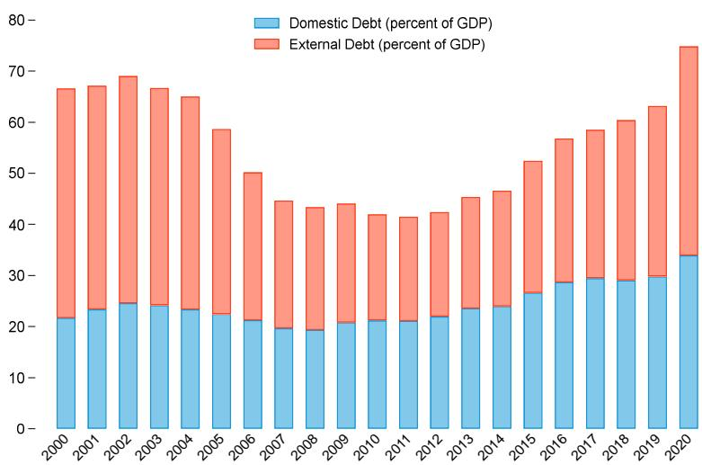  
Sources: World Economic Outlook Database and authors' calculations.

Figure 2. Trends in Government Interest Bill in Developing Countries, 2000–20 (percent of GDP)  
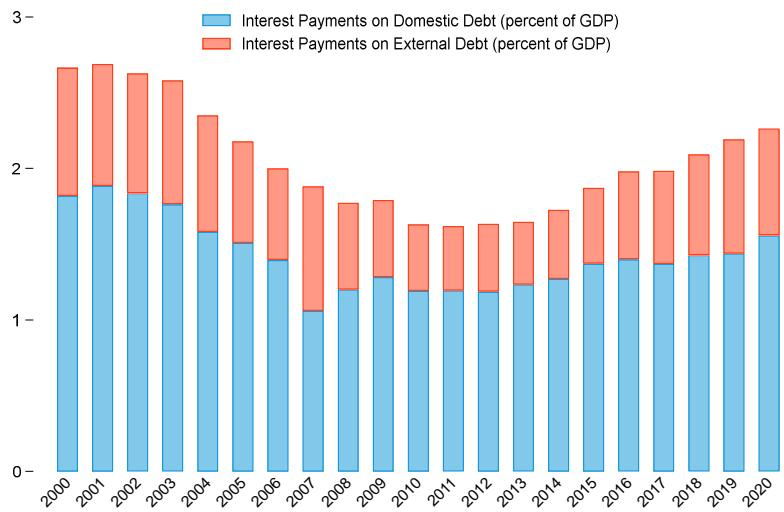  
Sources: World Economic Outlook Databases, International Debt Statistics and authors' calculations.

In contributing to a more comprehensive view on the disaster-sovereign risk nexus, this paper relates to two main strands of the literature. First, there is a rapidly growing literature on the macroeconomic impact of climate shocks; the impact of which on sovereign risk has been particularly emphasized in several papers, including Klomp (2015, 2017), Farhi and Gabaix (2015), Marto, Papageorgiou and Klyuev (2018), Kling et al. (2018), Mallucci (2022), Klusak et al., (2021), Cevik and Jalles (2022), and Zenios (2022). Second, a parallel literature focusing on the financial market pricing of climate risks (see for instance Baker et al. (2018), IMF (2020), Ehlers, Packer and de Greiff (2022) and Bolton and Kacperczyk (2023)) stresses challenges related to the limited availability of risk-sharing instruments (due to the global nature of climate risks), the high degree of uncertainty about climate risks and imperfect information available to investors about climate risks and their consequences (Eren, Merten and Verhoeven, 2022).

This paper departs from the existing literature in a meaningful way. Unlike previous studies, the paper focuses on the cost of domestic public debt across various maturities. A key challenge faced by previous studies was the lack of consolidated datasets of government T-bill and bond rates. We address this issue by compiling a new and original panel dataset on interest rates on government papers with the breakdown by maturity for 99 countries, of which 72 developing economies over the period 2000–20. The paper then links the cost of government domestic debt to a range of indicators for natural disasters and climate vulnerability. Using the data by maturity allows for a more granular analysis on how different climate indicators affect the entire yield curve.

Natural disaster shocks may exert pressures on treasury bills and bond rates for several reasons. First, the resulting revenue loss and spending pressures worsen public deficits and increase public debt, which in turn, raise the cost of financing. Second, the economic consequences of natural disasters, including the infrastructure destruction, the cost of reconstruction, the ensuing economic downturn may decrease government solvency, increase the probability of default and the risk premium in the post disaster environment (Klomp, 2015, 2017). The deterioration in the country's creditworthiness may prompt domestic investors to demand higher interest rates for buying government securities. Third, the frequent occurrence of natural disasters signal to investors that future natural disasters are likely, a risk domestic banks would price in the cost of government debt. While climate mitigation and adaptation policies strengthen resilience and therefore should help limit the rise in the interest rate on government securities, these policies require in most cases higher government spending. This suggests that at least in the short run, the funding needs of the government will increase, and hence the pressure on domestic borrowing costs for the budget. Finally, disaster shocks may lead to inflationary pressures, prompting the central bank to increase the policy rate and thus the cost of capital, notably for the government (Isoré and Szczerbowicz, 2017; Fratzscher et al., 2020).

On the methodological front, the paper relies on fixed-effect and local projection difference in difference estimations to uncover the static and dynamic response of the domestic yield curve to climate shocks. Focusing on the sample of 72 developing economies, the findings reveal that drought and storm episodes exacerbate the cost of government domestic borrowing, but only for short maturity debts, thus leaving the cost of medium and long maturity debts broadly unaffected. On the other hand, a country's vulnerability to climate shocks is associated with higher cost of short, medium and long maturity debts. Heightened fiscal stress and monetary policy stance emerge as the main transmission channels from natural disasters and climate vulnerability. As to the latter, the adverse impact on the cost of government domestic borrowing is attenuated in countries with deeper financial systems.

The remaining of the paper is organized as follows. Section 2 presents a brief literature review and lay out the transmission channels between climate shocks and public finances. This is followed by Section 3, which: (i) provides a description of the new dataset on the treasury bill and bond yields; and (ii) describes the empirical model and methodological approaches. Section 4 discusses in detail the results, and Section 5 concludes.

## II. How do natural disaster shocks affect the cost of government financing?

## A. A selective review of the literature

Several studies look at the implications of natural disasters and climate change for public finances. For instance, Mohan and Strobl (2020) show that damaging storms cause debt to increase up to three quarters after the event, using tropical storm data for the period 1993–2013 for the Eastern Caribbean. Alejos (2021) on the other hand, estimates that the occurrence of at least one extreme event leads to an increase in the fiscal deficit by an average of 0.9 percent of GDP for low-income countries in the same year.

Consistent with this line of the literature, converging evidence points to a disaster or climate risk premium embedded in the cost of external financing. Zenios (2022) goes as far as to warn of climate risk causing debt dynamics to worsen and risk premia to rise non-linearly leading potentially to a “climate-debt doom-loop”. Natural disasters are perceived by investors as adverse economic shocks that may make the government debt unsustainable considering that the credit default premium paid by bond holders accelerates in the days after a disaster (see also Klomp, 2015 and 2017; Marto, Papageorgiou and Klyuev, 2018). Using a discrete choice model and about 115 countries in the period 1985–2010, Klomp (2017) shows that one additional large-scale natural disaster raises the onset probability of a sovereign debt default by about three percentage-points.

Farhi and Gabaix (2015) proposes a model that prioritizes the exchange rate channel. Reflecting the productivity of the export sector, countries differ by their riskiness, captured by the extent to which their exchange rate would depreciate if a major world disaster were to occur. The authors argue that because the exchange rate is an asset price whose future risk affects its current value, relatively riskier countries have more depreciated exchange rates, and feature high interest rates, because investors need to be compensated for the risk of an exchange rate depreciation in a potential world disaster.

In the same vein, Kling et al. (2018) assess empirically the effect of climate change on the cost of external debt using climate data from the Notre Dame Global Adaptation Initiative. The paper finds that countries with higher exposure to climate vulnerability exhibit a higher external debt cost by 1.2 percentage point on average. Beirne et al (2021a) reach similar conclusions for Southeast Asian countries. Cevik and Jalles (2022) address potential sample selection bias due to idiosyncrasy and endogeneity concerns by relying on a larger sample than Kling et al (2018) and using alternative specifications and estimation methodologies. Vulnerability and resilience to climate change markedly affect government borrowing costs. However, the magnitude and statistical significance of the effects are much greater in developing countries with weaker capacity to adapt to and mitigate the consequences of climate change.

Mallucci (2022) adopts a standard sovereign default model to incorporate natural disaster risk. The calibration of the model with data from a sample of seven Caribbean countries shows that hurricane risks decrease government's ability to issue debt and restrict its access to financial markets. In his model, absent hurricane risk, spreads are, on average, 105 basis points lower, an estimate comparable to Cevik and Jalles (2022)'s. Finally, Klusak et al, (2021)'s simulations suggest that climate-induced sovereign downgrades could occur as early as 2030, rising in intensity and across countries over the century. The consequences for sovereign interest payments are significant, with adverse spillovers on the cost of corporate debt as well.

While the literature has been prolific on the disaster or climate risk premium on international sovereign bonds, virtually no attention has been paid to the cost of financing on the domestic bond markets, a gap this paper attempts to address.

## B. The transmission channels

Beyond its social and humanitarian impacts, which are more visible, the occurrence of natural disaster shocks affects the cost of government borrowing in several ways, notably through the public debt and monetary policy channels for natural disaster shocks, and the financial deepening channel for climate vulnerability.

The concurrent increase in government spending to deal with the aftermath of natural disaster events, and the drop in government revenue as economic activities take a dip, deteriorate the fiscal balance and increase public debt (Cabezon et al., 2015; Schuler et al., 2019); henceforth the public debt channel. Countries heavily dependent on tourism, agriculture, or fishing, face significant reductions in tax revenues as these sectors are the most sensitive to disaster and climate shocks. Disrupted tax administration following a disaster can also result in a low compliance tax rate and undermine revenue collection. On the expenditure side, the humanitarian needs and the reconstruction of the country after disaster shocks require large social and infrastructure spending. Large SOEs and strategic sectors that have experienced a loss in asset values may also require government support, putting further pressures on the budget through higher subsidies and the materialization of contingent liabilities. Overall, the deterioration in fiscal indicators will increase government financing needs, and the cost of raising financing with the impact being more pronounced if public debt was already at a high level. In extreme cases, governments may be forced to borrow at a very high rate to save lives and meet emergencies (Imam and Kpodar, 2022).

Natural disaster events also impair a country's productive capacity by destroying production factors (including human and physical capital) and causing output instability, thus weakening growth prospects. In addition, the reduction in productive capacity due to climate shocks lowers exports of goods and services, which combined with the increasing demand for imports may lead to a deterioration of the current account balance, a pressure on external reserves and ultimately a depreciation of the exchange rate. This mechanism was highlighted for external debt markets (see Volz et al. (2020) for a comprehensive review), but it also prevails in domestic bond markets since the deterioration in growth prospects undermines the ability of the country to service its debt in the future both on the external and domestic markets.

The occurrence of disaster shocks can also affect the conduct of monetary policy rate, and hence the cost of capital (Isoré and Szczerbowicz, 2017; Fratzscher et al., 2020; Kabundi, Mlachila, and Yao, 2022). The monetary authority faces a trade-off between supporting economic activities through expansionary policy with low interest rates at the cost of higher inflation, or defending the value of the currency at the

risk of deteriorating economic performance. Further, climate disruptions involve abrupt events that increase or decrease the demand or supply for goods and services. Extreme weather events and sea-level rise that result in damages to crops can induce higher inflation. Under normal circumstances, the inflationary pressure from supply side shocks is expected to be temporary, thus requiring no action from central banks. But recurrent shocks change the price dynamics as inflation departs further from the target, requiring tighter monetary policy, with potentially adverse impact on the cost of government borrowing. On the other hand, a higher policy rate can stimulate domestic saving for post-disaster reconstruction and mitigate capital outflows, albeit at the expense of a larger output loss.

The perception that a country is highly vulnerable to climate change can raise the cost of public debt. This results from foreign and domestic investors factoring in the risk that future natural disasters impair the ability of the country to service its debt. The magnitude of the risk premium depends on country specific characteristics (exposure and resilience to climate shocks), but also the ability of private investors to gauge accurately climate risks and their risk mitigation strategy, which hinges on the level of financial development. This financial deepening channel is relevant in developing markets, where investors have fewer opportunities to diversify their portfolio and are more exposed if a climate shock hits the entire economy. As a result, countries with deeper financial systems are better equipped to mitigate the effect of climate vulnerability on the cost of government domestic borrowing, reflecting the ability of investors to diversify or transfer risks.

The public debt channel may also play out for climate vulnerability. Indeed, strengthening resilience by addressing the threat of climate change through mitigation and adaptation policies may help lower climate premium, but can be costly for the budget at the same time, especially in poor countries. The adaptation needs for developing countries are particularly large, and to the extent that they require taping the domestic financial market for budget financing, domestic investors may not be willing to hold additional government debt unless the government pays more for it. Transitional risks are also a concern considering that governments in many developing countries are at risk of seeing carbon-intensive assets devalued or retired before the end of their useful expected life, leading to “stranded assets”. With several of these countries being highly dependent on carbon intensive industries such as the oil sector, transitional risks create uncertainties about future government revenue, exacerbate fiscal risks, and thus increase the risk premium on government debts.

Besides the public debt, monetary policy and financial deepening channels above, the financial and political stability channels are also worth mentioning. Natural disaster shocks may destroy the operating assets and production of borrowers, reducing their ability to pay their debt service obligations, and leading to higher non-performing loans and a higher rate of default (Dafermos, Nikolaidi and Galanis, 2018). The adverse impact on financial stability could increase contingent liability risks and worsen the risk premium on government securities, even more so in countries where the sovereign-bank nexus poses a threat to financial stability. A parallel literature uncovers evidence suggesting that climate change may spur political instability and conflicts (Hsiang and Burke, 2014; Burke, Hsiang, and Miguel, 2015). The resulting macroeconomic uncertainties and the constrained capacity of policy makers to implement sound macroeconomic policies will likely translate into a higher cost of government borrowing.

# III. The data, empirical model and econometric methodology

## A. Data and measurements

## Cost of government domestic borrowing

As mentioned earlier, the lack of consistent and comparable cross-country time series data on the interest rates on government domestic borrowing undoubtedly prevented previous studies from investigating the existence of a disaster or climate premium in the pricing of domestic government securities. To overcome this, we collected data on domestic government securities from central banks, ministries of finance and security market authorities for 99 developed and developing countries around the world over the period 2000-2021 (see Annex 1 for a description of the database).

Gathering comparable data across countries requires some adjustments. The bulk of the securities are issued on the primary market while others are traded on the secondary market. There are also securities issued at discount, and the periodicity of the interest payment can vary across instruments. We harmonize the data by taking the annual coupon rate at issuance on the primary market and the annual yield to maturity for the securities traded on the secondary market or the discounted securities. The interest rate data are collected at the instrument level, and then aggregated annually into four broad categories. These include short-term securities (up to a three-month maturity, and up to a 1-year maturity); medium-term securities (between two to three-year maturity) and long-term securities (from 4 years and beyond). The average interest rate for all maturities is also calculated.

Figure 3 presents the evolution of the median interest rate on government domestic securities from 2000 to 2020 by maturity. The drop in the cost of government domestic borrowing in two decades was staggering, more than a 50 percent decline for short to medium term securities, as countries achieved solid gains in macroeconomic stabilization. The benign global economic environment also supported the downward trend in government domestic borrowing cost, except during the 2008 global financial crisis, which led to an uptick in interest rates. Nevertheless, long-term maturity securities did not benefit from a comparable decline in interest rates, dropping only by 7 percent over the same period.

This contrasting trend had implications for the shape of the median yield curve (Figure 4). The yield curve inverted at the onset of the global financial crisis (GFC), which typically is believed to be a strong predictor of recessions (Stock and Watson, 1989; Estrella, 2005). Short-term interest rates eased post GFC, and further during the COVID-19 pandemic—supported by unconventional monetary policy in major advanced economies. As a result, the yield curve returned to a steep upward slope by end-2020.

Figure 3. Nominal Interest Rate on Government Securities, 2000–20 (sample median, percent)  
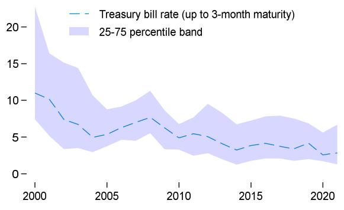

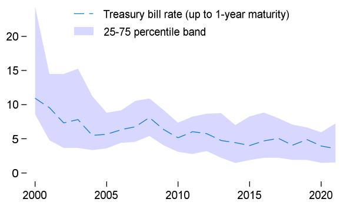

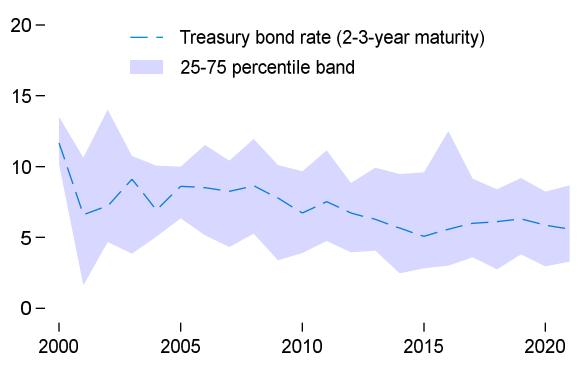  
Source: Authors

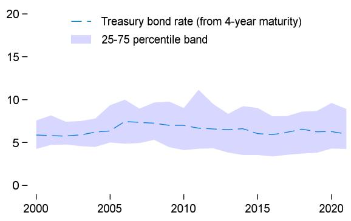

Figure 4. Yield Curve in Selected Years (sample median, percent)  
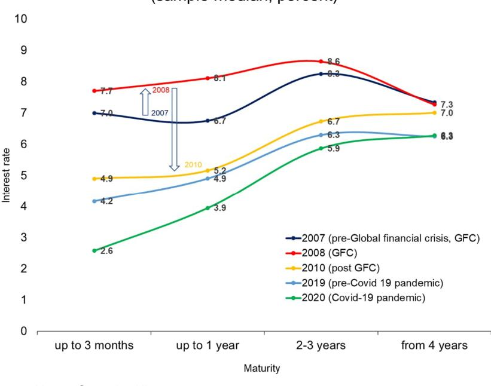

Looking at the median real interest rate, the data suggest that the real cost of government borrowing exhibited significant volatility over the period and across maturities, with the cost of short-term maturities having been the longest in the negative territory (Appendix Figure 1). Real rates on government securities have also been somewhat on the rise during the decade up to 2020 as inflation fell faster than nominal interest rates.

Splitting the sample by income group reveals common but also contrasting trends (Figure 5). Predictably, nominal interest rates on government securities are typically higher for lower income countries. While we observe a downward trend in the nominal rate for short-term maturities across all income groups (and some co-movement between middle and high-income countries), the drop was sharper for low and middle-income countries compared to high-income countries. In contrast, the cost for medium and long-term securities did not decline for low and middle-income countries as it did for high-income countries. When looking at the real interest rates, the volatility in the overall sample is also observable for each country group, albeit more pronounced for low-income countries (Appendix Figure 2). This volatility appears to have subsided in the last few years.

Figure 5. Nominal Interest Rate on Government Securities by Income Group, 2000-20 (sample median, percent)  
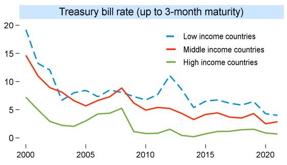

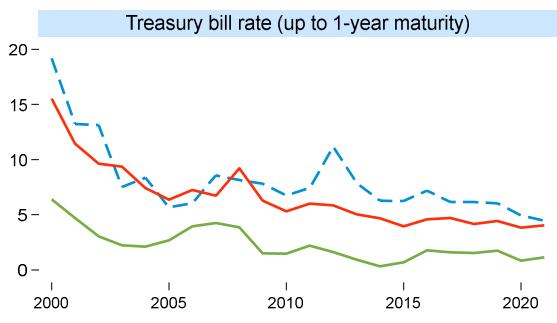

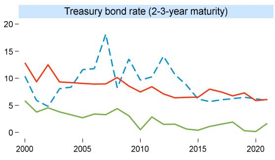

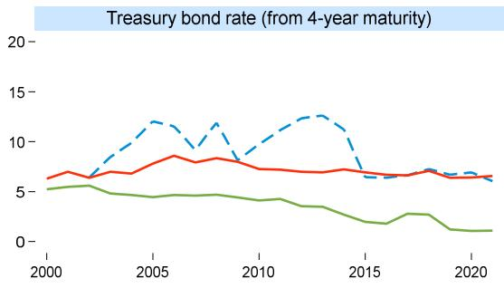

## Natural disasters and climate indicators

Turning to the disaster shock variables, the paper focuses on two sets of indicators commonly used in the literature. First, we use simple dummy variables capturing the occurrence of natural disaster events:

drought, floods and storms (data are provided by the Emergency Events Database (EM-DAT) (Delforge al., 2025). The frequency of floods is the highest, typically over half of disasters, while drought episodes account for 3 to 20 percent of disasters depending on the year. For storms, this figure ranges from 28 to 37 percent of the sample. Second, we use a composite indicator of climate vulnerability measuring country's broad exposure and resilience to climate risks (Notre Dame Global Adaptation Initiative, ND-GAIN). The ND-GAIN aggregates 74 variables into 45 core indicators to measure climate sensitivity and readiness of over 180 countries annually. $^{1}$

## Bivariate correlation

A graphical representation of the bivariate correlation between the average cost of government securities and disaster indicators shows a mixed picture (Figure 6). There is marginally no difference between the cost of government securities for countries that experienced natural disasters and those that didn't. However, a slightly positive correlation emerges for climate vulnerability shocks. The regression settings will allow us to better disentangle this relationship, after controlling for confounding factors, sample heterogeneity and potential statistical biases.

Figure 6. Climate Change and the Cost of Government Domestic Borrowing, 2000-20

Interest rate on government securities in drought episodes (all maturities, sample median, percent)

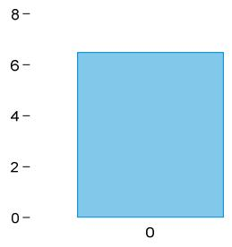

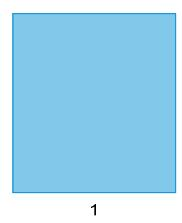  
Interest rate on government securities in flood episodes (all maturities, sample median, percent)

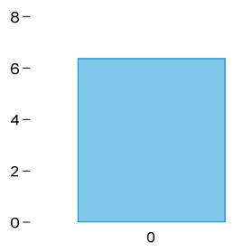

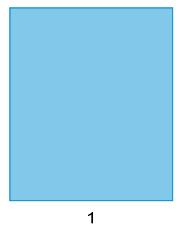  
Interest rate on government securities in storm episodes (all maturities, sample median, percent)  
Interest rate on government securities and climate vulnerability (all maturities, percent)

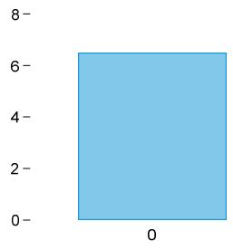

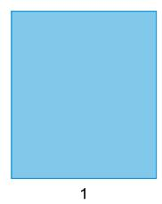

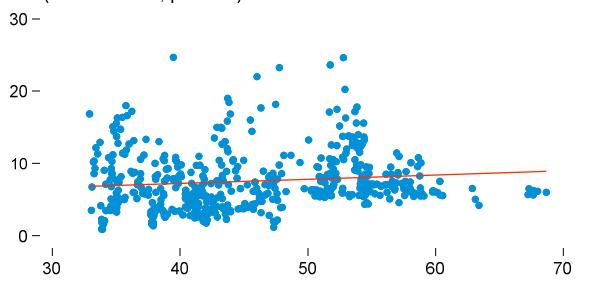

Notes: The dummy variable for drought, flood or storm episodes takes 1 if a country experiences at least one episode of drought, flood or storm, respectively, in a given year, and 0 otherwise. The bar charts show the median interest rates for the two subsamples.

Sources: Delforge et al. (2025) and authors' calculations

## B. The model specification and methodological approach

The empirical model relies on the existing literature to identify the key determinant factors driving the cost of domestic sovereign borrowing, notably domestic macro-fiscal conditions, global environment and institutional quality (see Petrova, Papaioannou and Bellas, 2010; Beirne and Fratzscher, 2013; Beirne et al., 2021b; Nose and Menkulasi, 2025), which are supplemented by natural disasters and climate vulnerability indicators. The specification of the model is as follows:

$$
T r e a s u r y _ {i t} = \alpha_ {0} + \alpha_ {1} D _ {i t} + \sum A X _ {i t} + u _ {i} + v _ {t} + \varepsilon_ {i t}\tag{Eq(1}
$$

where:

\- $Treasury_{it}$ is the average nominal interest rate (yield to maturity) on treasury bills and bonds for country $i$ at time $t$

\- D is either (i) a dummy variable taking 1 when the country is affected by a natural disaster and zero otherwise, or (ii) the climate vulnerability index.

\- X is the set of control variables measuring domestic economic conditions (income per capita, real GDP growth rate, inflation rate), external sustainability (current account balance to GDP, foreign reserve to GDP, exchange rate in national currency per US dollar), global financing conditions (measured by the US 10 year treasury yield), the country's institutional strength (rule of law index) and the average maturity of the debt instrument.

\- $u_{i}$ is the country fixed effects, $v_{t}$ represents the time fixed effects and $\varepsilon_{it}$ is the error term.

A positive coefficient $\alpha_{1}$ is evidence that natural disasters and climate vulnerability exacerbate the cost of government domestic borrowing.

This paper focuses on disaster dummy variables rather than measures of disaster intensity, owing to the endogeneity concerns associated with the latter. A first source of endogeneity arises from potential reverse causality: the severity of disaster impacts may itself be influenced by domestic borrowing conditions. High domestic financing costs can constrain governments' ability to invest in resilient infrastructure, potentially exacerbating the damage caused by natural disasters. A second concern relates to the measurement challenges surrounding disaster intensity indicators—such as economic losses or the number of people affected—which are often subject to reporting errors. Such measurement errors, if correlated with the error term of the equation, could give rise to endogeneity issues. By contrast, disaster dummy variables can reasonably be treated as exogenous, reflecting the essentially random timing of natural disaster events. Nonetheless, we also conduct robustness checks using disaster intensity measures to ensure that the core findings are not sensitive to the measures of disasters.

Regarding the control variables, income per capita and the quality of institutions are expected to be negatively associated with the interest rate on government securities, mirroring higher creditworthiness and lower risk premium. High economic growth and low inflation rate are expected to soften the interest rate on government securities through a similar channel.

Turning to external sustainability indicators, the inclusion of the current account balance in the model aims to capture the impact of terms of trade shocks on government financing needs and bank liquidity. Positive terms of trade shocks should improve public finances, with a favorable effect on T-bill and bond rates, while ample banking liquidity could push rates in the same direction. Low foreign exchange reserves and weaker domestic currency could reflect unsustainable fiscal policy and weaken investors' confidence (thus raising the risk premium). A currency depreciation could also increase inflation expectations, with adverse implications for the cost of government financing.

Accommodating global financing conditions, proxied by the US 10-year treasury yield, enable governments to borrow internationally, thus relaxing pressures on domestic financial markets and interest rates. Finally, we control for the average maturity at the country-year level. Appendix table 2 presents the summary statistics and the correlation matrix of the variables used in the analysis, and Appendix table 3 covers their definitions and data sources.

The model Eq(1) is estimated by a fixed effects estimator (using annual data) with robust standard errors clustered at the country level, allowing to control for time-invariant country-specific factors that may affect the cost of government domestic borrowing, thereby reducing the risk of omitted variables which can give rise to endogeneity issues.

Although the static model delineated in Eq(1) provides valuable insights into the immediate repercussions of the occurrence of disasters, it may not fully capture the dynamic effects or the persistence of shocks. The reaction of domestic interest rates on government papers may be phased over time, making not only the contemporaneous response of a significance importance, but also the responses manifesting in subsequent temporal intervals. In this setting, a natural disaster shock or an increase in climate vulnerability at time t can influence treasury bill and bond rates at time t and extend its impact into future periods (t+1 and beyond), until such effects attenuate once the full macroeconomic impact of the shock materializes, and is internalized by investors.

The local projection (LP) methodology pioneered by Jorda (2005) offers a suitable approach to capture the dynamic lagged effects. The LP relies on an intuitive and flexible approach to estimate the impact of a shock at time t on the dependent variable by generating multi-step forecasts using direct forecasting models that are re-estimated for each forecast horizon. Olea and Plagborg-Møller (2021) demonstrate that the LP robustly handles highly persistent data and the estimation of impulse response functions (IRFs) at long horizons. For Auerbach and Gorodnichenko (2013) and Ramey et al. (2018), the LP easily accommodates non-linearities. As the LP defines impulse responses independently of the unknown data-generating process, it is robust to lag structure misspecification and avoid the need for the identifying restrictions to derive IRFs (Jorda, 2005).

The specification of the LP is as follows:

$$
T r e a s u r y _ {i, t + h} = \beta_ {0} ^ {h} + \beta_ {1} ^ {h} D _ {i t} + \sum B _ {h} X _ {i t} + u _ {i} + v _ {t} + \varepsilon_ {i, t} ^ {h} \quad \text {for h = 0 , ..., H}\tag{Eq(2}
$$

where:

\- The definitions of the variables are the same as in the fixed effects model.

\- $\beta_{1}^{h}$ is the coefficient of interest, denoting the impact of a natural disaster shock or a change in climate vulnerability on the treasury bill and bond rates at the forecast horizon $h$ . For $h = 0$ , Eq(2) is equivalent to Eq(1).

The coefficients $\alpha_{1}$ of Eq(1) and $\beta_{1}^{h}$ of Eq(2) represent the treatment effect of a country having experienced a natural disaster. Chaisemartin and d'Haultfoeuille (2020, 2023), Callaway and Sant'Anna (2021), Goodman-Bacon (2021), and Sun and Abraham (2021) show that the coefficient $\alpha_{1}$ from the standard two-way fixed effects model (Eq(1)) may be incorrectly estimated in the presence of heterogeneous treatment effects across groups and time periods, due to negative weights even if the treatment effect is strictly positive (the so-called no-sign reversal property). $^{2}$ Moreover, the LP is not immune to this issue either, even under the assumption of parallel trends and no anticipation (Chaisemartin and d'Haultfoeuille, 2024), and despite accounting for the dynamic treatment effect.

To address this issue, we rely on the extension of the LP to difference in difference analysis by Dube et al. (2025). The approach consists in estimating a modified version of Eq(2) for each time horizon h in a restricted sample using a “clean control” condition to define appropriate treated and control units. This avoids unclean comparisons whereby previously treated units are used as control for newly treated units, although they might be experiencing dynamic treatment effects. The local projection difference in difference allows to recover the causal effect of a change in the treatment (captured by the series of coefficients $\beta_{1}^{h}$ ) without imposing restrictions on treatment effect dynamics.

In practice, Eq(2) is modified as follows:

$$
\begin{array}{r l r} & & {T r e a s u r y _ {i, t + h} - T r e a s u r y _ {i, t - 1} = \beta_ {0} ^ {h} + \beta_ {1} ^ {h} \Delta D _ {i t} + \sum B _ {h} X _ {i t} + v _ {t} + \varepsilon_ {i, t} ^ {h}} \\ & & {\qquad \mathrm{for} h = - n,..., 0,..., H, \mathrm{and} H \geq 0; h \neq - 1 \qquad \mathsf {E q} (3)} \end{array}
$$

with (i) n representing the horizon of the pre-treatment period

and (ii) a restricted sample to the following observations (the “clean control” conditions):

$$
\left\{ \begin{array}{c} \text {newly treated} \Delta D _ {i, t} = 1 \\ \text {or clean control} D _ {i, t + h} = 0 \text {for} h = - n, \ldots , H \end{array} \right.
$$

Two key assumptions underpin the validity of the estimated average treatment effect (ATE). First, the parallel trends assumption posits that the trend in the outcome variable for both the treated and the control groups is similar during the pre-treatment period. Second, the no anticipation assumption implies that units do not respond in anticipation of a future treatment:

The sample consists of 72 developing countries (low- and middle-income countries) for which data on the yield on treasury bonds and bills are available in our newly compiled dataset. $^{3}$ For this dynamic model, we use quarterly data in most regressions (see discussion in the next section). The motivation behind this is twofold: minimizing sample heterogeneity and tailoring the analysis to the most relevant country group. The descriptive analysis of the dataset shows heterogeneity in the trends in interest rates on government domestic securities between high-income countries and developing economies (the trends in the overall sample are driven by the group of developing countries). Further, our analysis is more relevant for the latter group, most of which experience a segmentation between their domestic and international bond markets. High-income countries are more integrated into the global financial system, and they can track bondholders on a residency basis; therefore, the definition of domestic securities on a currency basis is less relevant. The period of study runs from 2000 to 2020.

## IV. Empirical results

## A. Natural disaster shocks and the domestic sovereign yield curve.

## Fixed effects estimates

Table 1 presents the results, with the natural disasters dummies and the average interest rate on government domestic securities, all maturities combined. The results support the premise that natural disasters exacerbate the cost of government domestic borrowing. Unlike floods, drought and storm episodes are positively associated with higher cost of government borrowing, thus providing evidence of a disaster premium in the pricing of sovereign domestic securities. $^{4}$ The marginal impact is quantitatively large. For instance, a drought or storm episode would result in an 80 to 100 basis point hike on average in the interest rate on government domestic securities compared to a situation with no disaster.

To provide a more granular assessment of how climate shocks affect the domestic sovereign yield curve, we examine the link between natural disasters and the average interest rates on government domestic securities for different maturities. First, we focus on the very short-term government papers (up to 3 months), then the securities with a slightly longer maturity (up to a year), but still classified as short-term instruments, and finally we look at the medium-and long-term securities (2-3 year maturity and from 4 year-maturity beyond). Tables 2, 3, 4 and 5 respectively present the results.

Interestingly, the occurrence of drought and storm episodes predominantly affect the rates of the short-term maturity instruments (up to 3 months, and up to a year, see Tables 2 and 3). In contrast, there seems to be no meaningful impact on the rates for the longer maturity securities (above 2 years, see Tables 4 and 5), probably reflecting the high reliance of governments on short-term financing in many developing countries, particularly when dealing with unanticipated shocks. Another potential rationale could be that domestic investors perceive the fiscal impact of natural disasters as temporary. As such, the fiscal shock can be absorbed without undermining medium to long-term fiscal sustainability. This is consistent with findings in the literature suggesting that the effect of natural disasters is temporary and deteriorates public finance only in the short-term for the emergency relief and the reconstruction of the damaged infrastructure (e.g. Benson and Clay, 2004, Ouattara and Strobl, 2013). However, considering that natural disasters have been more and more frequent, the short-term impact may become protracted. In this setting, domestic investors could be underpricing the risks for public finances when only short-term security interest rates respond to natural disaster shocks.

Table 1. Natural Disaster and Interest Rate on Government Securities, all maturities combined

<table><tr><td></td><td>(1)</td><td>(2)</td><td>(3)</td><td>(4)</td><td>(5)</td><td>(6)</td></tr><tr><td>Drought</td><td>0.762*(0.389)</td><td></td><td></td><td>0.887*(0.475)</td><td></td><td></td></tr><tr><td>Flood</td><td></td><td>-0.030(0.284)</td><td></td><td></td><td>-0.291(0.354)</td><td></td></tr><tr><td>Storm</td><td></td><td></td><td>0.781**(0.313)</td><td></td><td></td><td>1.052***(0.279)</td></tr><tr><td>Per capita constant GDP (log)</td><td>-3.411(2.915)</td><td>-3.479(2.939)</td><td>-3.482(2.913)</td><td>-1.011(3.591)</td><td>-1.045(3.628)</td><td>-1.127(3.574)</td></tr><tr><td>GDP per capita growth rate</td><td></td><td></td><td></td><td>-0.026(0.053)</td><td>-0.027(0.053)</td><td>-0.020(0.052)</td></tr><tr><td>Inflation rate</td><td></td><td></td><td></td><td>0.087**(0.043)</td><td>0.090**(0.043)</td><td>0.089**(0.044)</td></tr><tr><td>Current account balance/GDP</td><td></td><td></td><td></td><td>-0.071**(0.032)</td><td>-0.072**(0.032)</td><td>-0.072**(0.031)</td></tr><tr><td>External reserves/GDP</td><td></td><td></td><td></td><td>-0.030(0.024)</td><td>-0.030(0.024)</td><td>-0.029(0.023)</td></tr><tr><td>Exchange Rate</td><td></td><td></td><td></td><td>0.002(0.001)</td><td>0.002(0.001)</td><td>0.001(0.001)</td></tr><tr><td>US 10-year treasury rate</td><td></td><td></td><td></td><td>2.162***(0.664)</td><td>2.171***(0.671)</td><td>2.188***(0.659)</td></tr><tr><td>Rule of law</td><td></td><td></td><td></td><td>-1.760(1.597)</td><td>-1.750(1.609)</td><td>-1.793(1.623)</td></tr><tr><td>Average maturity</td><td></td><td></td><td></td><td>0.000(0.000)</td><td>0.000(0.000)</td><td>0.000(0.000)</td></tr><tr><td>Constant</td><td>42.333*(21.598)</td><td>43.048*(21.746)</td><td>42.930*(21.572)</td><td>10.352(30.106)</td><td>10.889(30.404)</td><td>11.079(29.931)</td></tr><tr><td>Number of observations</td><td>1006</td><td>1006</td><td>1006</td><td>828</td><td>828</td><td>828</td></tr><tr><td>Number of countries</td><td>72</td><td>72</td><td>72</td><td>61</td><td>61</td><td>61</td></tr><tr><td>R2</td><td>0.24</td><td>0.24</td><td>0.24</td><td>0.29</td><td>0.29</td><td>0.30</td></tr></table>

Notes: fixed effects estimates; robust standard errors in parentheses; \* significant at 10 percent, \*\* significant at 5 percent and \*\*\* significant at 1 percent. Time dummies are included.

Table 2. Natural Disaster and Interest Rate on Short-Term Government Securities, (up to 3-month maturity)

<table><tr><td></td><td>(1)</td><td>(2)</td><td>(3)</td><td>(4)</td><td>(5)</td><td>(6)</td></tr><tr><td>Drought</td><td>1.280**(0.503)</td><td></td><td></td><td>1.262**(0.499)</td><td></td><td></td></tr><tr><td>Flood</td><td></td><td>-0.282(0.374)</td><td></td><td></td><td>-0.589(0.397)</td><td></td></tr><tr><td>Storm</td><td></td><td></td><td>0.687**(0.339)</td><td></td><td></td><td>0.750**(0.301)</td></tr><tr><td>Per capita constant GDP (log)</td><td>-1.479(3.745)</td><td>-1.576(3.812)</td><td>-1.556(3.747)</td><td>1.427(4.002)</td><td>1.272(4.056)</td><td>1.296(3.993)</td></tr><tr><td>GDP per capita growth rate</td><td></td><td></td><td></td><td>-0.012(0.056)</td><td>-0.013(0.055)</td><td>-0.007(0.055)</td></tr><tr><td>Inflation rate</td><td></td><td></td><td></td><td>0.085**(0.042)</td><td>0.088**(0.043)</td><td>0.088**(0.044)</td></tr><tr><td>Current account balance/GDP</td><td></td><td></td><td></td><td>-0.092**(0.039)</td><td>-0.093**(0.039)</td><td>-0.093**(0.038)</td></tr><tr><td>External reserves/GDP</td><td></td><td></td><td></td><td>-0.042(0.026)</td><td>-0.041(0.026)</td><td>-0.037(0.026)</td></tr><tr><td>Exchange Rate</td><td></td><td></td><td></td><td>0.001(0.001)</td><td>0.001(0.001)</td><td>0.001(0.001)</td></tr><tr><td>US 10-year treasury rate</td><td></td><td></td><td></td><td>2.471***(0.632)</td><td>2.478***(0.642)</td><td>2.490***(0.634)</td></tr><tr><td>Rule of law</td><td></td><td></td><td></td><td>-2.685(1.779)</td><td>-2.697(1.802)</td><td>-2.714(1.808)</td></tr><tr><td>Average maturity</td><td></td><td></td><td></td><td>-0.012(0.027)</td><td>-0.007(0.026)</td><td>-0.010(0.026)</td></tr><tr><td>Constant</td><td>27.612(27.866)</td><td>28.867(28.351)</td><td>28.489(27.866)</td><td>-9.855(33.843)</td><td>-8.459(34.351)</td><td>-8.939(33.787)</td></tr><tr><td>Number of observations</td><td>742</td><td>742</td><td>742</td><td>688</td><td>688</td><td>688</td></tr><tr><td>Number of countries</td><td>65</td><td>65</td><td>65</td><td>56</td><td>56</td><td>56</td></tr><tr><td>R2</td><td>0.28</td><td>0.27</td><td>0.27</td><td>0.32</td><td>0.31</td><td>0.32</td></tr></table>

Notes: fixed effects estimates; robust standard errors in parentheses; \* significant at 10 percent, \*\* significant at 5 percent and \*\*\* significant at 1 percent. Time dummies are included.

Table 3. Natural disaster and Interest Rate on Short-Term Government Securities, (up to 1 year maturity)

<table><tr><td></td><td>(1)</td><td>(2)</td><td>(3)</td><td>(4)</td><td>(5)</td><td>(6)</td></tr><tr><td>Drought</td><td>1.034**(0.435)</td><td></td><td></td><td>1.122**(0.471)</td><td></td><td></td></tr><tr><td>Flood</td><td></td><td>0.001(0.367)</td><td></td><td></td><td>-0.369(0.418)</td><td></td></tr><tr><td>Storm</td><td></td><td></td><td>0.883**(0.355)</td><td></td><td></td><td>0.971***(0.334)</td></tr><tr><td>Per capita constant GDP (log)</td><td>-2.083(2.950)</td><td>-2.109(2.979)</td><td>-2.204(2.953)</td><td>1.093(3.416)</td><td>1.017(3.463)</td><td>0.857(3.436)</td></tr><tr><td>GDP per capita growth rate</td><td></td><td></td><td></td><td>-0.030(0.057)</td><td>-0.031(0.057)</td><td>-0.023(0.056)</td></tr><tr><td>Inflation rate</td><td></td><td></td><td></td><td>0.096**(0.046)</td><td>0.099**(0.047)</td><td>0.098**(0.047)</td></tr><tr><td>Current account balance/GDP</td><td></td><td></td><td></td><td>-0.088**(0.035)</td><td>-0.089**(0.035)</td><td>-0.088**(0.034)</td></tr><tr><td>External reserves/GDP</td><td></td><td></td><td></td><td>-0.024(0.033)</td><td>-0.024(0.033)</td><td>-0.022(0.032)</td></tr><tr><td>Exchange Rate</td><td></td><td></td><td></td><td>0.002**(0.001)</td><td>0.002**(0.001)</td><td>0.002*(0.001)</td></tr><tr><td>US 10-year treasury rate</td><td></td><td></td><td></td><td>2.720***(0.664)</td><td>2.734***(0.669)</td><td>2.732***(0.662)</td></tr><tr><td>Rule of law</td><td></td><td></td><td></td><td>-1.578(1.676)</td><td>-1.598(1.693)</td><td>-1.644(1.703)</td></tr><tr><td>Average maturity</td><td></td><td></td><td></td><td>-0.001(0.005)</td><td>-0.001(0.005)</td><td>-0.001(0.005)</td></tr><tr><td>Constant</td><td>33.763(21.876)</td><td>34.286(22.044)</td><td>34.868(21.890)</td><td>-7.939(28.734)</td><td>-6.985(29.122)</td><td>-6.164(28.874)</td></tr><tr><td>Number of observations</td><td>882</td><td>882</td><td>882</td><td>763</td><td>763</td><td>763</td></tr><tr><td>Number of countries</td><td>69</td><td>69</td><td>69</td><td>59</td><td>59</td><td>59</td></tr><tr><td>R2</td><td>0.27</td><td>0.27</td><td>0.27</td><td>0.32</td><td>0.32</td><td>0.32</td></tr></table>

Notes: fixed effects estimates; robust standard errors in parentheses; \* significant at 10 percent, \*\* significant at 5 percent and \*\*\* significant at 1 percent. Time dummies are included.

Table 4. Natural disaster and Interest Rate on Medium-Term Government Securities, (2-to-3-year maturity)

<table><tr><td></td><td>(1)</td><td>(2)</td><td>(3)</td><td>(4)</td><td>(5)</td><td>(6)</td></tr><tr><td>Drought</td><td>-0.044(0.645)</td><td></td><td></td><td>0.282(0.961)</td><td></td><td></td></tr><tr><td>Flood</td><td></td><td>-0.297(0.225)</td><td></td><td></td><td>-0.634(0.409)</td><td></td></tr><tr><td>Storm</td><td></td><td></td><td>0.353(0.593)</td><td></td><td></td><td>0.086(0.580)</td></tr><tr><td>Per capita constant GDP (log)</td><td>-5.840(4.649)</td><td>-5.733(4.669)</td><td>-5.708(4.772)</td><td>-3.132(3.016)</td><td>-3.206(2.987)</td><td>-3.066(3.056)</td></tr><tr><td>GDP per capita growth rate</td><td></td><td></td><td></td><td>-0.122(0.095)</td><td>-0.112(0.098)</td><td>-0.125(0.098)</td></tr><tr><td>Inflation rate</td><td></td><td></td><td></td><td>0.059(0.037)</td><td>0.061*(0.036)</td><td>0.059(0.037)</td></tr><tr><td>Current account balance/GDP</td><td></td><td></td><td></td><td>-0.223**(0.088)</td><td>-0.222**(0.087)</td><td>-0.223**(0.090)</td></tr><tr><td>External reserves/GDP</td><td></td><td></td><td></td><td>-0.024(0.042)</td><td>-0.027(0.041)</td><td>-0.024(0.042)</td></tr><tr><td>Exchange Rate</td><td></td><td></td><td></td><td>0.006***(0.002)</td><td>0.006***(0.002)</td><td>0.006***(0.001)</td></tr><tr><td>US 10-year treasury rate</td><td></td><td></td><td></td><td>1.364*(0.680)</td><td>1.378*(0.695)</td><td>1.382**(0.658)</td></tr><tr><td>Rule of law</td><td></td><td></td><td></td><td>-1.034(2.218)</td><td>-0.960(2.247)</td><td>-1.033(2.246)</td></tr><tr><td>Average maturity</td><td></td><td></td><td></td><td>-0.009**(0.004)</td><td>-0.009**(0.004)</td><td>-0.009**(0.004)</td></tr><tr><td>Constant</td><td>59.313(37.381)</td><td>58.724(37.645)</td><td>58.302(38.497)</td><td>36.930(24.025)</td><td>38.084(23.876)</td><td>36.386(24.515)</td></tr><tr><td>Number of observations</td><td>415</td><td>415</td><td>415</td><td>332</td><td>332</td><td>332</td></tr><tr><td>Number of countries</td><td>48</td><td>48</td><td>48</td><td>37</td><td>37</td><td>37</td></tr><tr><td>R2</td><td>0.13</td><td>0.13</td><td>0.13</td><td>0.32</td><td>0.33</td><td>0.32</td></tr></table>

Notes: fixed effects estimates; robust standard errors in parentheses; \* significant at 10 percent, \*\* significant at 5 percent and \*\*\* significant at 1 percent. Time dummies are included.

We replicate the regressions above, shifting the focus to the climate vulnerability index. Although natural disaster shock and climate vulnerability are two closely related concepts, there is also an important distinction. Natural disaster shocks are sudden events that are time-bound and a consequence of climate change, while climate vulnerability encapsulates the extent to which a country is at risk of being hit by the detrimental effect of climate change. Therefore, it encompasses not only the exposure to natural disaster shocks, but also the resilience of the country to the shocks. A country with high climate vulnerability may be one that experiences frequent climate shocks of average intensity, or one that witnesses less frequent disasters but of extreme intensity. The vulnerability also implies that the human, economic and social impact of climate shocks can be sizeable (even for moderate shocks) and the country lacks the capacity and resources to cope with and adapt to the shocks.

Table 5. Natural disaster and Interest Rate on Long-Term Government Securities, (4-year maturity and beyond)

<table><tr><td></td><td>(1)</td><td>(2)</td><td>(3)</td><td>(4)</td><td>(5)</td><td>(6)</td></tr><tr><td>Drought</td><td>0.187(0.515)</td><td></td><td></td><td>0.308(0.599)</td><td></td><td></td></tr><tr><td>Flood</td><td></td><td>-0.043(0.159)</td><td></td><td></td><td>-0.041(0.255)</td><td></td></tr><tr><td>Storm</td><td></td><td></td><td>0.283(0.257)</td><td></td><td></td><td>0.201(0.252)</td></tr><tr><td>Per capita constant GDP (log)</td><td>-5.755***(1.745)</td><td>-5.790***(1.785)</td><td>-5.708***(1.803)</td><td>-3.658*(2.089)</td><td>-3.712*(2.056)</td><td>-3.640*(2.046)</td></tr><tr><td>GDP per capita growth rate</td><td></td><td></td><td></td><td>-0.078(0.062)</td><td>-0.079(0.063)</td><td>-0.076(0.064)</td></tr><tr><td>Inflation rate</td><td></td><td></td><td></td><td>0.015(0.024)</td><td>0.015(0.024)</td><td>0.016(0.024)</td></tr><tr><td>Current account balance/GDP</td><td></td><td></td><td></td><td>-0.025(0.025)</td><td>-0.025(0.026)</td><td>-0.024(0.025)</td></tr><tr><td>External reserves/GDP</td><td></td><td></td><td></td><td>-0.058*(0.030)</td><td>-0.058*(0.030)</td><td>-0.058*(0.030)</td></tr><tr><td>Exchange Rate</td><td></td><td></td><td></td><td>0.002(0.002)</td><td>0.002(0.002)</td><td>0.002(0.002)</td></tr><tr><td>US 10-year treasury rate</td><td></td><td></td><td></td><td>-0.143(0.322)</td><td>-0.166(0.322)</td><td>-0.154(0.323)</td></tr><tr><td>Rule of law</td><td></td><td></td><td></td><td>-1.289(1.308)</td><td>-1.264(1.323)</td><td>-1.296(1.289)</td></tr><tr><td>Average maturity</td><td></td><td></td><td></td><td>-0.000(0.000)</td><td>-0.000(0.000)</td><td>-0.000(0.000)</td></tr><tr><td>Constant</td><td>52.159***(13.405)</td><td>52.414***(13.657)</td><td>51.741***(13.825)</td><td>38.900**(16.604)</td><td>39.399**(16.351)</td><td>38.711**(16.260)</td></tr><tr><td>Number of observations</td><td>509</td><td>509</td><td>509</td><td>418</td><td>418</td><td>418</td></tr><tr><td>Number of countries</td><td>49</td><td>49</td><td>49</td><td>39</td><td>39</td><td>39</td></tr><tr><td>R2</td><td>0.11</td><td>0.11</td><td>0.11</td><td>0.19</td><td>0.19</td><td>0.19</td></tr></table>

Notes: fixed effects estimates; robust standard errors in parentheses; \* significant at 10 percent, \*\* significant at 5 percent and \*\*\* significant at 1 percent. Time dummies are included.

Table 6 summarizes the results for the ND-GAIN climate vulnerability index. Given that climate vulnerability is subject to endogeneity issues, the index is lagged by one period, and instrumented by its exogenous component, following Kling et al. (2021). $^{5}$ The first-stage regression (Appendix Table 4 and the Cragg-Donald Wald F statistic support the validity of the instrument.

The headline finding shows that climate vulnerability weighs on the cost of government domestic borrowing. A country moving from the 25 $^{th}$ percentile to the median climate vulnerability (a five-point increase in the vulnerability index) would experience a 10 percentage-point increase in the average cost of government securities (using the specification in column 1, table 6). Fortunately, climate vulnerability is a slow-moving variable. In fact, the median climate vulnerability index has only increased by 0.5 points (about half of the within-sample standard deviation) in 20 years, implying a 1 percentage point increase in the interest rate on government securities. From this perspective, the impact seems mild compared to an episode of drought or storm which has a similar effect on interest rates. What sets climate vulnerability apart is the broad-based impact on the interest rates across all maturities (columns 2 to 5, table 6). The coefficient on the vulnerability index is positive and significant in all regressions across security maturities.

Table 6. Climate Vulnerability and Interest Rate on Government Securities

<table><tr><td rowspan="2"></td><td>(1)</td><td>(2)</td><td>(3)</td><td>(4)</td><td>(5)</td></tr><tr><td>All maturities</td><td>(up to 3-month maturity)</td><td>(up to 1 year maturity)</td><td>(2-to-3-year maturity)</td><td>(4-year maturity and beyond)</td></tr><tr><td>Climate vulnerability index (lagged)</td><td>2.015**(1.005)</td><td>2.648*(1.528)</td><td>3.486**(1.430)</td><td>6.033**(2.581)</td><td>2.000**(0.873)</td></tr><tr><td>Per capita constant GDP (log)</td><td>1.734(2.019)</td><td>4.543*(2.545)</td><td>4.958*(2.543)</td><td>12.017(7.693)</td><td>0.866(2.607)</td></tr><tr><td>GDP per capita growth rate</td><td>-0.046(0.035)</td><td>-0.046(0.044)</td><td>-0.061(0.042)</td><td>-0.273**(0.132)</td><td>-0.084*(0.050)</td></tr><tr><td>Inflation rate</td><td>0.072***(0.014)</td><td>0.071***(0.017)</td><td>0.075***(0.017)</td><td>0.055(0.045)</td><td>0.012(0.021)</td></tr><tr><td>Current account balance/GDP</td><td>-0.090***(0.023)</td><td>-0.131***(0.035)</td><td>-0.118***(0.029)</td><td>-0.229***(0.058)</td><td>-0.025(0.023)</td></tr><tr><td>External reserves/GDP</td><td>-0.020(0.021)</td><td>-0.022(0.031)</td><td>-0.014(0.026)</td><td>-0.036(0.039)</td><td>-0.053***(0.017)</td></tr><tr><td>Exchange Rate</td><td>0.000(0.001)</td><td>-0.000(0.001)</td><td>0.000(0.001)</td><td>0.005**(0.003)</td><td>0.001(0.001)</td></tr><tr><td>US 10-year treasury rate</td><td>0.664(0.620)</td><td>0.797(0.769)</td><td>0.944(0.755)</td><td>1.123(1.381)</td><td>0.409(0.586)</td></tr><tr><td>Rule of law</td><td>-2.049**(0.957)</td><td>-3.474***(1.226)</td><td>-2.573**(1.213)</td><td>1.553(2.390)</td><td>-1.501*(0.874)</td></tr><tr><td>Average maturity</td><td>0.000(0.000)</td><td>-0.010(0.021)</td><td>0.007(0.005)</td><td>-0.008**(0.004)</td><td>-0.000(0.000)</td></tr><tr><td>Constant</td><td>-101.535*(56.044)</td><td>-155.213*(82.913)</td><td>-196.958**(79.010)</td><td>-350.336**(169.215)</td><td>-87.119(55.490)</td></tr><tr><td>Number of observations</td><td>796</td><td>657</td><td>732</td><td>326</td><td>406</td></tr><tr><td>Number of countries</td><td>60</td><td>55</td><td>58</td><td>36</td><td>38</td></tr><tr><td>Cragg-Donald Wald F statistic</td><td>27.5</td><td>14.4</td><td>18.3</td><td>12.2</td><td>24.3</td></tr></table>

Notes: Instrumental variable estimations, climate vulnerability index is lagged by one period and instrumented by its exogenous component; robust standard errors in parentheses; \* significant at 10 percent, \*\* significant at 5 percent and \*\*\* significant at 1 percent. Time dummies are included.

In essence, higher climate vulnerability pushes up the entire yield curve, as opposed to the interest rates on short-term maturities only, like in the case of natural disaster shocks. This is probably because a worsening in climate vulnerability is a structural shift that has far reaching implications for the economy and public finances. The increased uncertainty about the economic and fiscal cost of future disasters may undermine the confidence of domestic investors, and as a result, heighten the cost of government domestic financing, even for long-term instruments.

Turning to the control variables in tables 1 to 6, inflation comes out with a positive and significant coefficient, confirming that macroeconomic stability drives down the cost of government domestic financing. The coefficient on the other economic condition factors (GDP per capita and real GDP growth) are surprisingly not significant, probably due to their effects being dominated by the other control variables. The quality of institutions is also significant in only a very few regressions. Among the external sustainability factors, the current account balance emerges as a dominant determinant of the interest rate on government domestic securities. Finally, the results show that in most specifications, domestic interest rates on government T-bills and bonds are highly sensitive to global financing conditions. $^{6}$

## Local projection difference in difference

As underscored in Section III.B, the local projection difference in difference allows us to account for a richer dynamic between climate shocks and the cost of government domestic financing, while addressing potential shortcomings of the fixed effects estimates. Since the local projection difference in difference estimates the model in Eq(3) for each horizon, choosing appropriately the control group, it is a data-demanding procedure. In contrast to the data on the climate vulnerability index, the data on natural disasters is available on a quarterly basis. We also re-compiled our interest rate dataset on a quarterly basis, enabling us to run the local projection difference in difference with quarterly data for the regressions with natural disaster shocks, while keeping the annual data for the climate vulnerability index. $^{7}$ Overall, the results from the local projection difference in difference uphold the earlier findings with the fixed effects estimates.

Specifically, Figure 7 shows the average treatment effect (ATE) of drought on the average interest rate on government domestic securities. It provides evidence of a causal positive impact of drought on the cost of government financing, with the marginal impact increasing over time before reaching a peak 3 quarters after the shock, and then dying out from the 5 $^{th}$ quarter. The marginal effect is comparable to the fixed effects estimate, suggesting that the latter may not be as biased as feared. Looking at the breakdown by maturity (Figure 8), we corroborate the previous conclusions that the interest rates on short-term instruments are the most sensitive to drought episodes in sharp contrast with the interest rates on long-term securities. The model specification without control variables tracks closely the one with the control variables, reflecting the robustness of the results. Where there are large deviations, the finding suggests that not controlling for cross-country characteristics often underestimates the magnitude of the disaster risk premium.

Figure 7. Average Treatment Effect of Drought on the Interest Rate on Domestic Government Securities, all maturities combined  
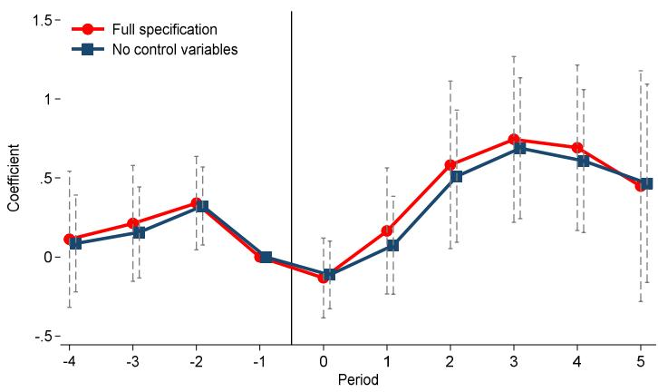  
Notes: The ATEs are estimated using quarterly data; never treated units used a control group; vertical dash lines denote the 90 percent confidence band in the full specification and the one without the control variables.

Figure 8. Average Treatment Effect of Drought on the Interest Rate on Domestic Government Securities by Maturity  
(Up to 3-month maturity)  
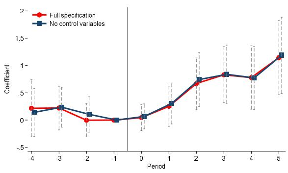

(Up to 1 year maturity)  
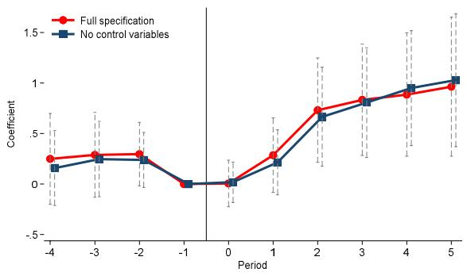

(2-to-3-year maturity)  
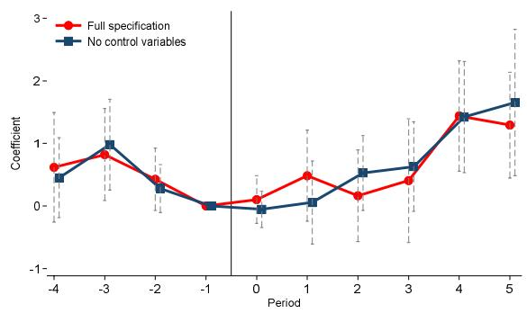

(4-year maturity and beyond)  
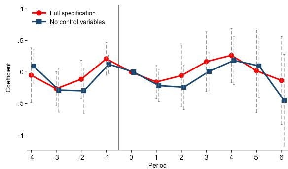  
Notes: The ATEs are estimated using quarterly data; never treated units used a control group; vertical dash lines denote the 90 percent confidence band in the full specification and the one without the control variables.

Figures 9 and 11 replicate the results for storm episodes. Although the conclusions are broadly similar to drought episodes, the response of government security rates is more muted. The ATE is smaller in magnitude and significant only in the first quarter after the shock, and reflects the reaction of the interest rate on government securities with a maturity up to 1 year.

Figure 9. Average Treatment Effect of Storm on the Interest Rate on Domestic Government Securities, all maturities combined.  
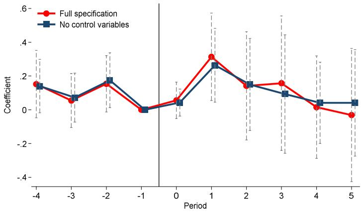  
Notes: The ATEs are estimated using quarterly data; never treated units used a control group; vertical dash lines denote the 90 percent confidence band in the full specification and the one without the control variables.

Under the parallel trend assumption, the disaster risk premium for the treated and control groups should be similar absent a natural disaster. Including the pre-event periods in the analysis shows that the average treatment effect is not significantly different from zero before the onset of the treatment, thus supporting the parallel trend assumption (Figures 7 to 10). There is also no evidence of anticipation effects whereby domestic investors act preemptively by demanding higher interest rates in anticipation of a natural disaster.

With regard to the climate vulnerability index, we created a dummy variable for the purpose of the local projection difference in difference, taking 1 when a country has a climate vulnerability index above the sample median, and 0 otherwise. Although the result should be interpreted with caution due to the limited sample size, they show that higher climate vulnerability weighs on the cost of government domestic financing for both short and long-term maturities, $^{8}$ but the effect takes more time to filter through in comparison to natural disaster shocks (Figure 9 and 10). This is not surprising, given that shifts in climate vulnerability tend to unfold gradually over time. These results hold even if we change the threshold of the dummy variable to the sample average of the vulnerability index or the 25 $^{th}$ percentile of its distribution.

Figure 10. Average Treatment Effect of Storm on the Interest Rate on Domestic Government Securities by Maturity  
(Up to 3-month maturity)  
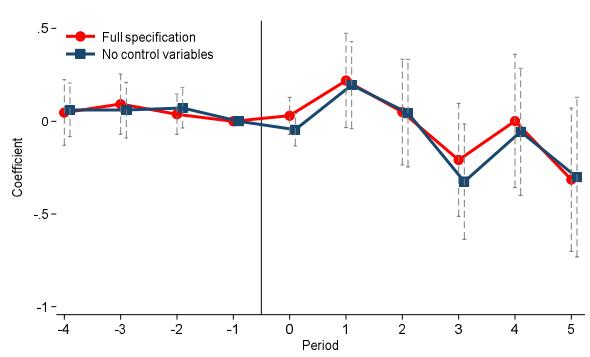

(Up to 1 year maturity)  
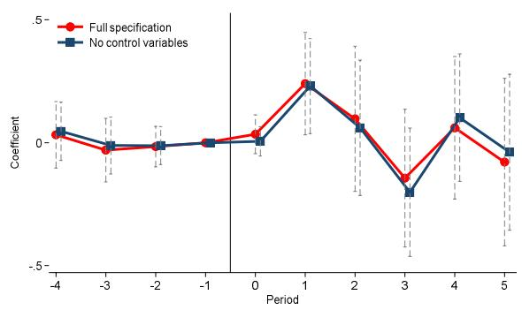

(2-to-3-year maturity)  
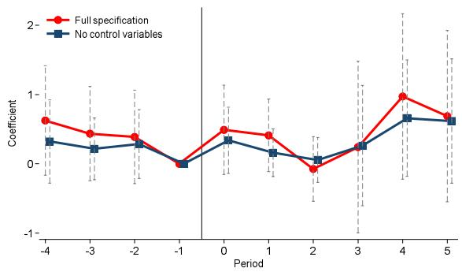

(4-year maturity and beyond)  
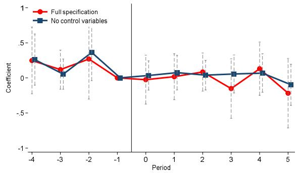

Notes: The ATEs are estimated using quarterly data; never treated units used a control group; vertical dash lines denote the 90 percent confidence band in the full specification and the one without the control variables.  
Figure 11. Average Treatment Effect of Climate Vulnerability on the Interest Rate on Domestic Government Securities, all maturities combined  
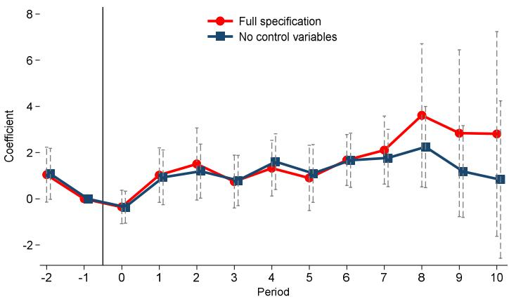  
Notes: The ATEs are estimated using annual data; not yet treated units used a control group; vertical dash lines denote the 90 percent confidence band in the full specification and the one without the control variables.

Figure 12. Average Treatment Effect of Climate Vulnerability on the Interest Rate on Domestic Government Securities by Maturity

(Up to 3-month maturity)

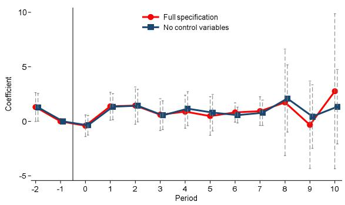  
(2-to-3-year maturity)  
(Up to 1 year maturity)

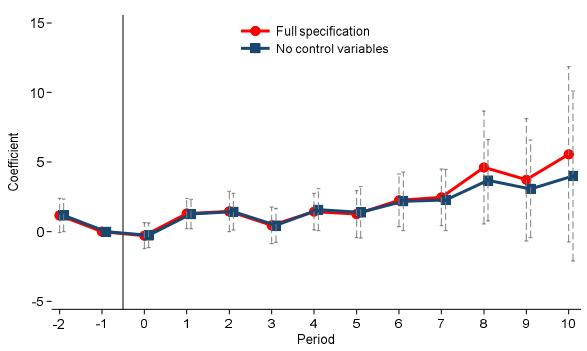  
(4-year maturity and beyond)

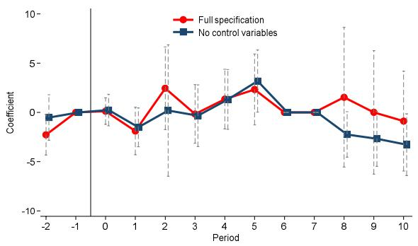

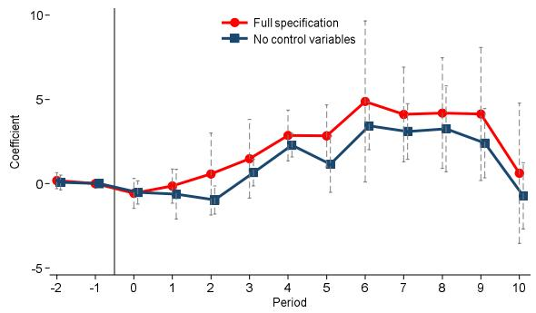  
Notes: The ATEs are estimated using annual data; not yet treated units used a control group; vertical dash lines denote the 90 percent confidence band in the full specification and the one without the control variables.

As a robustness check, we also use two indicators of intensity: (i) the economic damage caused by natural disasters as a proportion of GDP; and (ii) the share of the population affected by disasters. Due to substantial missing data for individual disaster categories, these indicators are used only at the aggregate level for all disasters combined. Further, because these variables are continuous, we apply the standard local projection approach. The corresponding impulse response functions using quarterly data are presented in Appendix Figures 3 and 4, illustrating the response of the interest rate on government securities to shocks related to the size of disaster damage and the proportion of affected population, respectively. Our findings remain consistent and robust across these specifications.

## B. Testing the transmission channels

Section II.B discussed the transmission channels through which natural disaster shocks and climate vulnerability can affect the cost of government domestic financing. In this section, we focus on the empirical investigation of the channels that are easily measurable and straightforward to assess, namely the public debt and monetary policy channels. Further, we tested the financial deepening channel, which is especially relevant for climate vulnerability.

Table 7 shows the results for drought episodes, with column 1 replicating the baseline specification for comparison purposes. As public debt is introduced in the model, its coefficient has a positive sign and is strongly significant (column 2), consistent with the expectation that higher public debt exacerbates the cost of government financing. The coefficient on the drought dummy variable, however, becomes statistically insignificant, thus providing supporting evidence to the public debt channel. Similarly, introducing the policy rate of the central bank in the model (column 3) shows a positive impact on the interest rate on government securities, but renders the coefficient on drought statistically insignificant, suggesting that the monetary policy stance matters in how natural disaster shocks translate in higher government domestic borrowing cost. The findings remain broadly unchanged along the yield curve (see Appendix table 5 for the estimations by maturity).

Table 7. Drought Episodes and Interest Rate on Government Securities (all maturities combined): Transmission Channels

<table><tr><td></td><td>(1)</td><td>(2)</td><td>(3)</td><td>(4)</td></tr><tr><td>Drought</td><td>0.977*(0.549)</td><td>0.878(0.530)</td><td>0.463(0.438)</td><td>0.444(0.430)</td></tr><tr><td>Public debt/GDP</td><td></td><td>0.067***(0.017)</td><td></td><td>0.025(0.016)</td></tr><tr><td>Monetary policy rate</td><td></td><td></td><td>0.380**(0.147)</td><td>0.356**(0.149)</td></tr><tr><td>Per capita constant GDP (log)</td><td>-2.763(4.659)</td><td>-0.465(4.480)</td><td>-0.521(3.809)</td><td>0.015(3.787)</td></tr><tr><td>GDP per capita growth rate</td><td>-0.046(0.074)</td><td>-0.028(0.061)</td><td>-0.057(0.064)</td><td>-0.048(0.060)</td></tr><tr><td>Inflation rate</td><td>0.068(0.043)</td><td>0.062(0.043)</td><td>0.042(0.026)</td><td>0.042(0.028)</td></tr><tr><td>Current account balance/GDP</td><td>-0.095**(0.040)</td><td>-0.090**(0.039)</td><td>-0.084*(0.049)</td><td>-0.084(0.050)</td></tr><tr><td>External reserves/GDP</td><td>-0.021(0.025)</td><td>-0.020(0.025)</td><td>0.006(0.019)</td><td>0.006(0.019)</td></tr><tr><td>Exchange Rate</td><td>0.002*(0.001)</td><td>0.002**(0.001)</td><td>0.001(0.001)</td><td>0.001(0.001)</td></tr><tr><td>US 10-year treasury rate</td><td>1.470**(0.597)</td><td>2.045***(0.616)</td><td>1.139**(0.556)</td><td>1.264**(0.558)</td></tr><tr><td>Rule of law</td><td>-1.674(1.680)</td><td>-1.439(1.505)</td><td>0.820(1.224)</td><td>0.844(1.190)</td></tr><tr><td>Average maturity</td><td>0.000(0.000)</td><td>0.000(0.000)</td><td>0.000(0.000)</td><td>0.000(0.000)</td></tr><tr><td>Constant</td><td>24.427(38.079)</td><td>-0.779(36.972)</td><td>3.504(31.215)</td><td>-3.025(31.181)</td></tr><tr><td>Number of observations</td><td>700</td><td>700</td><td>675</td><td>675</td></tr><tr><td>Number of countries</td><td>54</td><td>54</td><td>54</td><td>54</td></tr><tr><td>R2</td><td>0.21</td><td>0.27</td><td>0.43</td><td>0.44</td></tr></table>

Notes: fixed effects estimates; robust standard errors in parentheses; \* significant at 10 percent, \*\* significant at 5 percent and \*\*\* significant at 1 percent. Time dummies are included.

Table 8 depicts the findings for storm episodes, with mixed results. The public debt channel appears weak since the coefficient on storm barely changes, even though the positive association between public debt and its cost is confirmed. Nevertheless, the monetary policy channel plays out as in the case of drought, with the coefficient on storm decreasing in magnitude, although it remains significant. These results are further supported by the regression analyses conducted for various maturities of government securities, as detailed in Appendix table 6.

Table 8. Storm Episodes and Interest Rate on Government Securities (all maturities combined): Transmission Channels

<table><tr><td></td><td>(1)</td><td>(2)</td><td>(3)</td><td>(4)</td></tr><tr><td>Storm</td><td>1.129***(0.323)</td><td>1.156***(0.312)</td><td>0.831***(0.255)</td><td>0.882***(0.260)</td></tr><tr><td>Public debt/GDP</td><td></td><td>0.068***(0.017)</td><td></td><td>0.026(0.016)</td></tr><tr><td>Monetary policy rate</td><td></td><td></td><td>0.380**(0.146)</td><td>0.354**(0.148)</td></tr><tr><td>Per capita constant GDP (log)</td><td>-2.464(4.572)</td><td>-0.151(4.362)</td><td>-0.471(3.717)</td><td>0.091(3.682)</td></tr><tr><td>GDP per capita growth rate</td><td>-0.040(0.073)</td><td>-0.021(0.060)</td><td>-0.052(0.063)</td><td>-0.042(0.059)</td></tr><tr><td>Inflation rate</td><td>0.070(0.043)</td><td>0.064(0.043)</td><td>0.043(0.026)</td><td>0.042(0.028)</td></tr><tr><td>Current account balance/GDP</td><td>-0.093**(0.040)</td><td>-0.088**(0.039)</td><td>-0.083*(0.049)</td><td>-0.082(0.050)</td></tr><tr><td>External reserves/GDP</td><td>-0.020(0.024)</td><td>-0.019(0.024)</td><td>0.006(0.020)</td><td>0.007(0.019)</td></tr><tr><td>Exchange Rate</td><td>0.002**(0.001)</td><td>0.002**(0.001)</td><td>0.001(0.001)</td><td>0.001(0.001)</td></tr><tr><td>US 10-year treasury rate</td><td>1.500**(0.609)</td><td>2.075***(0.629)</td><td>1.054*(0.557)</td><td>1.180**(0.555)</td></tr><tr><td>Rule of law</td><td>-1.682(1.703)</td><td>-1.443(1.517)</td><td>0.873(1.241)</td><td>0.900(1.205)</td></tr><tr><td>Average maturity</td><td>0.000(0.000)</td><td>0.000(0.000)</td><td>0.000(0.000)</td><td>0.000(0.000)</td></tr><tr><td>Constant</td><td>21.965(37.353)</td><td>-3.455(35.997)</td><td>3.131(30.437)</td><td>-3.735(30.305)</td></tr><tr><td>Number of observations</td><td>700</td><td>700</td><td>675</td><td>675</td></tr><tr><td>Number of countries</td><td>54</td><td>54</td><td>54</td><td>54</td></tr><tr><td>R2</td><td>0.21</td><td>0.28</td><td>0.44</td><td>0.44</td></tr></table>

Notes: fixed effects estimates; robust standard errors in parentheses; \*  
significant at 10 percent, $^{**}$ significant at 5 percent and $^{***}$ significant at 1 percent. Time dummies are included.

Turning to climate vulnerability, we find that the public debt and policy rate channels may matter, but cautious is needed to draw a direct implication that climate vulnerability worsens public debt or triggers a monetary policy response. $^{9}$ More importantly, the results point to financial deepening as a mitigating

factor for the effect of higher climate vulnerability on the cost of government financing. The coefficient on the interaction variable between the private credit to GDP ratio and the climate vulnerability index is negative and significant (Table 9), thus lending support to the financial deepening channel. The results in Appendix tables 6 and 7 indicate that regressions across varying government security maturities yield consistent findings, although the financial deepening channel emerges as especially potent when considering the interest rate on long-term government financing.

Table 9. Climate Vulnerability and Interest Rate on Government Securities (all maturities combined): Transmission Channels

<table><tr><td></td><td>(1)</td><td>(2)</td><td>(3)</td><td>(4)</td><td>(5)</td></tr><tr><td>Climate vulnerability index (lagged)</td><td>2.015**(1.005)</td><td>1.201(0.931)</td><td>1.064(0.872)</td><td>0.655(0.876)</td><td>2.126**(1.004)</td></tr><tr><td>Public debt/GDP</td><td></td><td>0.072***(0.010)</td><td></td><td>0.028***(0.010)</td><td></td></tr><tr><td>Monetary policy rate</td><td></td><td></td><td>0.386***(0.025)</td><td>0.354***(0.027)</td><td></td></tr><tr><td>Private sector credit/GDP</td><td></td><td></td><td></td><td></td><td>0.202(0.154)</td></tr><tr><td>Clim. vul. index (lagged) * Pri. sec. credit/GDP</td><td></td><td></td><td></td><td></td><td>-0.006*(0.004)</td></tr><tr><td>Per capita constant GDP (log)</td><td>1.734(2.019)</td><td>0.597(2.221)</td><td>1.494(1.676)</td><td>0.523(1.952)</td><td>2.257(2.022)</td></tr><tr><td>GDP per capita growth rate</td><td>-0.046(0.035)</td><td>-0.033(0.043)</td><td>-0.042(0.029)</td><td>-0.048(0.038)</td><td>-0.071**(0.035)</td></tr><tr><td>Inflation rate</td><td>0.072***(0.014)</td><td>0.060***(0.016)</td><td>0.048***(0.012)</td><td>0.041***(0.014)</td><td>0.073***(0.015)</td></tr><tr><td>Current account balance/GDP</td><td>-0.090***(0.023)</td><td>-0.098***(0.023)</td><td>-0.074***(0.020)</td><td>-0.090***(0.021)</td><td>-0.082***(0.022)</td></tr><tr><td>External reserves/GDP</td><td>-0.020(0.021)</td><td>-0.009(0.023)</td><td>-0.005(0.018)</td><td>0.010(0.020)</td><td>-0.019(0.020)</td></tr><tr><td>Exchange Rate</td><td>0.000(0.001)</td><td>0.001(0.001)</td><td>-0.000(0.001)</td><td>0.000(0.001)</td><td>0.001(0.001)</td></tr><tr><td>US 10-year treasury rate</td><td>0.664(0.620)</td><td>3.009(2.921)</td><td>0.480(0.511)</td><td>1.937(2.541)</td><td>0.391(0.629)</td></tr><tr><td>Rule of law</td><td>-2.049**(0.957)</td><td>-1.563(1.004)</td><td>0.249(0.834)</td><td>0.844(0.938)</td><td>-1.562(0.977)</td></tr><tr><td>Average maturity</td><td>0.000(0.000)</td><td>0.000(0.000)</td><td>0.000(0.000)</td><td>0.000(0.000)</td><td>0.000(0.000)</td></tr><tr><td>Constant</td><td>-101.535*(56.044)</td><td>-65.652(53.946)</td><td>-59.206(48.192)</td><td>-37.892(50.070)</td><td>-107.034*(55.616)</td></tr><tr><td>Number of observations</td><td>796</td><td>677</td><td>771</td><td>655</td><td>778</td></tr><tr><td>Number of countries</td><td>60</td><td>53</td><td>60</td><td>53</td><td>59</td></tr><tr><td>Cragg-Donald Wald F statistic</td><td>27.5</td><td>28.5</td><td>24.2</td><td>23.9</td><td>13.1</td></tr></table>

Notes: Instrumental variable estimations, climate vulnerability index is lagged by one period and instrumented by its exogenous component; robust standard errors in parentheses; \* significant at 10 percent, \*\* significant at 5 percent and \*\*\* significant at 1 percent. Time dummies are included.

## V. Conclusion

This paper expands the literature on the climate-sovereign risk nexus by examining the presence and magnitude of a disaster of climate risk premium in the pricing of sovereign domestic debt. Complementing the literature that has so far focused on sovereign risk for market access countries, the paper compiles a new dataset on domestic treasury bill and bond yields at different maturities, thus allowing us to assess the effect of natural disaster shocks not only on the average cost of sovereign domestic financing, but also along the entire yield curve. The paper also makes a clear distinction between natural disaster shocks that are sudden and time-bonds events and climate vulnerability that is more structural in nature (a slow-moving event) and encompasses country's efforts to strengthen resilience.

Using a sample of 72 developing economies with data during the period 2000-20 and robust econometric approaches, notably fixed-effects (including with instrumental variables) and local projection difference in difference, the findings consistently point to a disaster premium in sovereign domestic yield. But this varies with the type of shocks considered and the maturity of the government securities. Specifically, natural disasters (droughts and storms) are associated with a higher cost of sovereign domestic borrowing on average, but only at short-term maturities. In contrast, an intensification of climate vulnerability steepens the yield curve across government domestic securities with short, medium and long-term maturities. In estimating the average treatment effect at different horizons, the local projection difference in difference shows that effect of natural disaster shocks filtered through the government security yields relatively quicker as opposed to the more sluggish and protracted effect of climate vulnerability. We also test the various transmission channels and show that public debt and the monetary policy stance are the key channels through which natural disasters and climate vulnerability weigh on sovereign domestic yield. Further, financial deepening plays a critical role in mitigating the climate premium in climate-vulnerable countries.

While sovereign risk on the international bond market has been under the spotlight, these results highlight the importance of paying greater attention to the adverse implications of disaster shocks to the cost of sovereign domestic borrowing. This is crucial for developing economies, the domestic debt of which accounts for about half of total debt; yet, it makes up to 80 percent of their total interest bill. It is critical for policymaking to integrate resilience building into debt management and fiscal policy frameworks, particularly for vulnerable economies facing increasing natural disasters and climate-related threats. In addition, financial deepening should be an integral part of resilience building.

## References

Acevedo, S., Mrkaic, M., Novta, N., Pugacheva, E., and Petia, T., (2020). “The Effects of Weather Shocks on Economic Activity: What are the Channels of Impact?,” Journal of Macroeconomics, Volume 65.

Agarwala, M., Burke, M., Klusak, P., Mohaddes, K., Volz, U., and Zenghelis, D. (2021). “Climate Change and Fiscal Sustainability: Risks and Opportunities,” National Institute Economic Review, 258, 28-46.

Alejos, L. (2021). “What are the fiscal risks from extreme weather events and how can we deal with them?” IDB–Inter-American Development Bank (blog), available at https://blogs.iadb.org/gestion-fiscal/en/what-are-the-fiscal-risks-from-extreme-weather-events-and-how-can-we-deal-with-them/

Aligishiev, M. Z. and Kolpakova, D., (2025). “Building Macroeconomic Resilience to Natural Disasters and Persistent Temperature Changes: The Case of Peru,” IMF Working Paper WP/25/144. International Monetary Fund, Washington D.C.

Auerbach, A.J., and Gorodnichenko, Y. (2013). “Fiscal multipliers in recession and expansion,”. in A. Alesina, and F. Giavazzi (Eds.), Fiscal Policy After the Financial Crisis.

Auffhammer, M. (2018). “Quantifying Economic Damages from Climate Change,” Journal of Economic Perspectives, 32(4), pp.33-52.

Baker, M., Bergstresser, D., Serafeim, G., and Wurgler, J. (2018). “Financing the Response to Climate Change: The Pricing and Ownership of US Green Bonds,” NBER Working Paper No. 25194, National Bureau of Economic Research.

Beirne, J., and Fratzscher, M. (2013). “The Pricing of Sovereign Risk and Contagion During the European Sovereign Debt Crisis,” Journal of international Money and Finance, 34, pp.60-82.

Beirne J., Renzhi N., and Volz U. (2021a). “Bracing for the Typhoon: Climate Change and Sovereign Risk in Southeast Asia,” Sustainable Development, 29(3), pp.1–15

Beirne, J., Renzhi, N., and Volz, U. (2021b). “Feeling the Heat: Climate Risks and the Cost of Sovereign Borrowing,” International Review of Economics and Finance, 76, pp.920-36.

Benson Charlotte and Clay Edward J., (2004). “Understanding the Economic and Financial Impacts of Natural Disasters,” Disaster Risk Management Series No 4, The World Bank

Berlemann, M., and Wenzel, D. (2018). “Hurricanes, Economic Growth and Transmission Channels: Empirical Evidence for Countries on Differing Levels of Development,” World Development, 105, pp.231-247.

Bolton, P., and Kacperczyk, M. (2021). “Global Pricing of Carbon-Transition Risk,” The Journal of Finance, 78(6), pp.3677-3754.

Burke, M., Hsiang, S. M., and Miguel, E. (2015). “Climate and Conflict,” Annual Review of Economics, 7(1), pp.577-617.

Cabezon E., Hunter L., Tumbarello P., Washimi K., Wu Y., and Khor H.E. (2015). “Enhancing Macroeconomic Resilience to Natural Disasters and Climate Change in the Small States of the Pacific,” IMF Working Paper 15/125.

Callaway B. and Sant'Anna PH. (2021). "Difference-in-Differences with Multiple Time Periods," Journal of Econometrics, 225(2), pp.200–30

Cevik, S., and Jalles, J. T. (2022). “This Changes Everything: Climate Shocks and Sovereign Bonds,” Energy Economics, 107.

Chen, C., Noble, I., Hellmann, J., Coffee, J., Murillo, M., and Chawla, N. (2015). “University of Notre Dame Global Adaptation Index Country Index Technical Report,” Notre Dame, University of Notre Dame.

Clevy, J-F. and Evans, C., (2025). “The Macroeconomic Impact of Droughts in Uruguay. A General Equilibrium Analysis Using the Soil Moisture Deficit Index,” IMF Working Paper WP/25/4, International Monetary Fund, Washington, DC.

Dafermos, Y., Nikolaidi, M. and Galanis, G., (2018). “Climate Change, Financial Stability and Monetary Policy,” Ecological Economics, 152(C), pp.219-34.

De Chaisemartin, C., and d'Haultfoeuille, X. (2023). "Two-way Fixed Effects and Differences-in-Differences with Heterogeneous Treatment Effects: A Survey," The Econometrics Journal, 26(3), C1-C30.

De Chaisemartin, C., and d'Haultfoeuille, X. (2024). "Difference-in-Differences Estimators of Intertemporal Treatment Effects," Review of Economics and Statistics, 1-45.

De Chaisemartin, C., and d'Haultfoeuille, X. (2020). "Two-way Fixed Effects Estimators with Heterogeneous Treatment Effects," American Economic Review, 110(9), pp.2964-96.

Delforge, D., Wathelet, V., Below, R., Lanfredi Sofia, C., Tonnelier, M., van Loenhout, J. A. F. and Speybroeck, N. (2025). “EM-DAT: The Emergency Events Database,” International Journal of Disaster Risk Reduction, 105509, https://doi.org/10.1016/j.ijdrr.2025.105509.

Dell, M., B. F. Jones, and Olken, B. A. (2012). “Temperature Shocks and Economic Growth: Evidence from the Last Half Century,” American Economic Journal: Macroeconomics, 4 (3), pp.66–9

Dube, A., Girardi, D., Jorda, O., and Taylor, A. M. (2025). “A Local Projections Approach to Difference-in-Differences,” Journal of Applied Econometrics, available at https://onlinelibrary.wiley.com/doi/10.1002/jae.70000.

Ehlers, T, Packer F. and de Greiff, K. (2022). “The Pricing of Carbon Risk in Syndicated Loans: Which Risks are Priced and Why?,” Journal of Banking and Finance, 136.

Eren, E., Merten, F., and Verhoeven, N. (2022). “Pricing of Climate Risks in Financial Markets: A Summary of the Literature,” BIS Papers No 130, Bank for International Settlements.

Estrella, A. (2005). “Why Does the Yield Curve Predict Output and Inflation?,” The Economic Journal, 115(505), pp.722-44.

Farhi, E., and Gabaix, X. (2015). “Rare Disasters and Exchange Rates,” The Quarterly Journal of Economics, 131, pp.1-52.

Fomby, T., Ikeda, Y. and Loayza, N. 2013. “The Growth Aftermath of Natural Disasters,” Journal of Applied Econometrics, 28(3), pp.412-434.

Fratzscher, M., Grosse-Steffen, C., and Rieth, M. (2020). “Inflation Targeting as a Shock Absorber,” Journal of International Economics, 123.

Goodman-Bacon, A. (2021). “Difference-in-Differences with Variation in Treatment Timing,” Journal of Econometrics, 225(2), pp.254-77.

Hallegatte, S. and Jooste, C. and Mcisaac, F.J., (2022). “Macroeconomic Consequences of Natural Disasters: A Modeling Proposal and Application to Floodsand Earthquakes in Turkey,” Policy Research Working Paper Series 9943, The World Bank.

Hochrainer, S. (2009). “Assessing the Macroeconomic Impacts of Natural Disasters: Are there Any?,” Policy Research Working Paper Series 4968, The World Bank.

Hsiang, S. M., and Burke, M. (2014). “Climate, Conflict, and Social Stability: What Does the Evidence Say?,” Climatic Change, 123, pp.39-55.

Imam, P. A., and Kpodar, K. (2022). Climate Change and Fiscal Sustainability in Sub-Saharan Africa," Revue d'Economie du Developpement, 32(4), pp.89-124.

Institute for Economics and Peace, (2020). “Ecological Threat Register 2020: Understanding Ecological Threats, Resilience and Peace,” ReliefWeb, available at https://reliefweb.int/attachments/973d79e1-3a71-3d43-9f39-2d65abab77f7/ETR\_2020\_web-1.pdf

International Monetary Fund (2020): “Climate Change: Physical Risk and Equity Prices”, April 2020 Global Financial Stability Report, Chapter 5.

IPCC. (2018). Global Warming of 1.5°C, Geneva: Intergovernmental Panel on Climate Change. Available at https://www.ipcc.ch/sr15/

Isoré, M., Szczerbowicz, U. (2017). “Disaster Risk and Preference Shifts in a New Keynesian Model,” Journal of Economic Dynamics and Control, 79, pp.97–125.

Jordà, Ó. (2005). “Estimation and Inference of Impulse Responses by Local Projections,” American Economic Review, 95 (1), pp.161–82.

Kabundi A.N. Mlachila. M. and Yao J., (2022). “How Persistent are Climate-Related Price Shocks? Implications for Monetary Policy,” IMF Working Papers 2022/207, International Monetary Fund.

Kahn, M. E., Mohaddes, K., Ng, R. N., Pesaran, M. H., Raissi, M., and Yang, J. C. (2021). “Long-term Macroeconomic Effects of Climate Change: A Cross-Country Analysis,” Energy Economics, 104.

Kling, G., Lo, Y., Murinde, V. and Volz, U. (2018). “Climate Vulnerability and the Cost of Debt,”. SOAS University of London, mimeo.

Kling, G., Volz, U., Murinde, V., and Ayas, S. (2021). “The Impact of Climate Vulnerability on Firms’ Cost of Capital and Access to Finance,” World Development, 137.

Klomp J. (2017). “Flooded with Debt,” Journal of International Money and Finance, 73, pp.93–103

Klomp, J. (2015). “Sovereign Risk and Natural Disasters,” Emerging Market Finance and Trade, 51, pp.1326–41.

Klomp, J., and Valckx, K. (2014). “Natural Disasters and Economic Growth: A Meta-Analysis,” Global Environmental Change, 26, pp.183-95.

Loayza, N. Olaberría, E., Rigolini, J. and Christiaensen, L. (2012). “Natural Disasters and Growth: Going Beyond the Averages,” World Development, 40(7), pp.1317-36.

Mallucci, E. (2022). “Natural Disasters, Climate Change, and Sovereign Risk,” Journal of International Economics, 139.

Manger, M. S., Mihalyi, D., Panizza, U., Rescia, N., Trebesch, C., & Wong, K. L. (2025). “Africa's domestic debt boom: Evidence from the African Debt Database”, Kiel Working Paper No. 2303.

Marto, R., Papageorgiou, C. and Klyuev, V. (2018). “Building Resilience to Natural Disasters: An Application to Small Developing States,” Journal of Development Economics, 135(C), pp.574-86.

Mbaye, S., Moreno-Badia, M., and Chae. K. (2018). "Global Debt Database: Methodology and Sources," IMF Working Paper, International Monetary Fund, Washington, DC

Mihalyi, D., and Trebesch, C. (2023). “Who Lends to Africa and How? Introducing the Africa Debt Database,” Kiel Working Papers No 2217.

Mohan, P. and Strobl, E. (2020). “The Impact of Tropical Storms on the Accumulation and Composition of Government Debt,” International Tax and Public Finance, 28, pp.483–96.

Nguyen, H.M., Feng, A. and Garcia-Escribano, M., (2025). “Understanding the Macroeconomic Effects of Natural Disasters,” IMF Economic Review, https://doi.org/10.1057/s41308-025-00297-8.

NOAA, (2020). “State of the Climate: Global Climate Report for Annual 2020”, available at https://www.ncdc.noaa.gov/sotc/global/202013.

Nose, M. and Menkulasi, J. (2025). “Fiscal Determinants of Domestic Sovereign Bond Yields in Emerging Market and Developing Economies,” IMF Working Papers WP/25/59.

Noy, I. (2009). “The Macroeconomic Consequences of Disasters,” Journal of Development Economics, 88(2), pp.221-31.

Olea, J.L.M. and Plagborg-Møller, M. (2021). “Local Projection Inference is Simpler and More Robust Than You Think.” Econometrica, 89(4), pp. 1789-1823.

Ouattara, B. and Strobl, E. (2013). “The Fiscal Implications of Hurricane Strikes in the Caribbean,” Ecological Economics, 85, pp.105-15.

Petrova, I., Papaioannou, M. M. G., and Bellas, M. D. (2010). “Determinants of Emerging Market Sovereign Bond Spreads: Fundamentals vs Financial Stress,” IMF Working Paper WP/10/281.

Ramey, V.A., and Zubairy S. (2018). “Government Spending Multipliers in Good Times and in Bad: Evidence from US historical data,” Journal of Political Economy, 126(2), pp.850-901.

Schuler, P., Oliveira, L.E., Mele, L.E. and Antonio, M. (2019). “Managing the Fiscal Risks Associated with Natural Disasters,” in Pigato, M.A. (ed), Fiscal Policies for Development and Climate Action, Washington, DC: World Bank, pp.133–54.

Stock, J. H., and Watson, M. W. (1989). “New Indexes of Coincident and Leading Economic Indicators,” NBER Macroeconomics Annual, 4, pp.351-394.

Sun, L., and Abraham, S. (2021). “Estimating Dynamic Treatment Effects in Event Studies with Heterogeneous Treatment Effects,” Journal of Econometrics, 225(2), pp.175-99.

Volz, U., Beirne, J., Ambrosio Preudhomme, N., Fenton, A., Mazzacurati, E., Renzhi, N., and Stampe, J. (2020). Climate Change and Sovereign Risk. London, Tokyo, Singapore, and Berkeley, CA: SOAS University of London, Asian Development Bank Institute, World Wide Fund for Nature Singapore, and Four Twenty Seven.

Zenios, S. A. (2022). “The Risks from Climate Change to Sovereign Debt,” Climatic Change, 172(3), pp.1-19.

## Annex I. Domestic Sovereign Yield Database

## Context

Elevated public debt worldwide and recurring sovereign debt crises in developing countries have underscored the need for increased debt transparency. In response, the IMF and the World Bank have intensified efforts to consolidate and standardize public debt statistics to facilitate cross-country comparisons and strengthen analytical work on debt vulnerabilities. The IMF's Global Debt Database (GDD, Mbaye et al., 2018), for example, provides historical data on public debt stock for 190 countries, and also includes data on private sector debt liabilities for households and nonfinancial corporations. The Quarterly Public Sector Debt Statistics (QPSD) database, jointly developed by the World Bank and the IMF, offers more granular institutional coverage than the GDD, albeit with a narrower country coverage (106 countries). Beyond higher-frequency reporting, the QPSD includes detailed information on the composition of public debt (short vs. long term maturity), currency composition of debt (foreign vs. domestic) and creditor characteristics (official vs. private creditors, resident vs. nonresident creditors). The World Bank also publishes the International Debt Statistics (IDS) which compiles annual external debt and financial flow statistics for 134 low and middle-income countries, with breakdowns by creditor type and financial instrument.

Besides these institutional databases, several scholars have sought to develop granular loan-level debt datasets to shed light on characteristics of individual debt instruments (amounts, contracting date, creditors, maturities, interest rates, grace periods, etc.). Mihalyi and Trebesch (2023)'s Africa Debt Database, for instance, documents over 7,000 external loans contracted and external bonds issued by African countries between 2000 and 2020. More recently, Manger et al. (2025) expanded this effort to include domestic debt. Their dataset covers over 50,000 debt instruments for 54 African countries from 2000 to 2024, providing information on creditors, currency denomination, maturity structure, interest rates and instrument types.

Our database contributes to ongoing efforts to expand the availability of public debt data by focusing specifically on domestic debt, where information gaps remain particularly acute. Many developing countries continue to face difficulties accessing international capital markets, partly due to investors' heightened perception of risk. At the same time, widening development financing needs have increasingly outpaced the supply of concessional resources, prompting governments to rely more heavily on domestic borrowing—supported by the gradual deepening of local-currency bond markets. The global financial crisis, and more recently, the COVID-19 pandemic accelerated this trend. Consequently, the average domestic debt level in developing countries rose from 22 percent of GDP in 2020 to 34 percent of GDP in 2020, while the share of domestic debt in total public debt increased by about 20 percentage points during the same period, reaching about 50 percent. This shift in the debt structure calls for closer monitoring of domestic debt dynamics and their implications for debt sustainability. However, a major constraint has been the lack of consistent and comparable cross-country and time series data on domestic debt, particularly at the instrument level. An attempt has been made by Manger et al. 2025 as mentioned above, but their coverage is limited to African countries.

## Data compilation

This database advances existing efforts by compiling detailed information on domestic government securities for 99 countries—72 of which are developing economies. While the core coverage spans 2000–21, data for several countries extend back to the late 1970s (see Annex Table 1 for country-specific availability). The database includes information on about 100,000 domestic securities, capturing the issuance date, maturity, and interest rate at issuance or yield to maturity. For about 30 percent of instruments, it also records the minimum and maximum yields observed during auctions. In addition, the amount raised is available for about half of the securities in the dataset.

We carried out extensive manual data collection using online publications from central banks, ministries of finance, debt management offices, and security market authorities in the countries covered (Annex Table 2 provides information on the data sources). These publications include statistical bulletins, market analyses, auction results, and annual reports—often available only in PDF or scanned formats.

To ensure consistency, comparability, and reliability of the information across countries, the data collection process was guided by the following principles:

\- Domestic securities are defined on a currency basis given the challenges in identifying the ultimate holders of security in many developing economies. Domestic securities are therefore defined as those issued by the central government in national currency and placed on the local financial market. For countries in a currency union (e.g. CEMAC and WAEMU), securities issued on the regional market are considered domestic, consistent with national reporting practices.

\- We focused on the interest rate at issuance and the original maturity on the primary market. When secondary market data were available, we recorded the yield to maturity and the remaining maturity. $^{10}$ It should be noted, however, that the database relies almost exclusively on the data from the primary market, given that the secondary market is very thin in most countries covered. The structure of the data does not allow tracking of individual securities over time.

\- The frequency of interest payments can vary across instruments. For example, if coupons are paid semiannually, we convert the rate to its annual equivalent.

\- Data was collected as reported by the authorities, without estimations or interpolations. In cases where multiple sources provided conflicting information, data from the most recent publication were retained. During the cleaning process, we removed securities with missing data on maturity or yield information, those reporting negative or zero yield, and potential outliers (securities with yield exceeding the 99 $^{th}$ percentile of the distribution, typically exceeding 50 percent).

## Stylized facts

Annex Figure 1 shows the number of instruments/observations in the database for each year. The number of instruments steadily increased over time, rising from around 1,000 instruments in 2020 to 6700 in 2020. This increase reflects not only countries' growing reliance on domestic financing, but also greater disclosure of domestic market data by countries (Annex Figure 2). The geographical coverage of the

database is broad as shown in Annex Figure 2, with Sub-Saharan Africa countries representing 37 percent of the sample (37 countries), followed by Europe and Central Asia (18 countries); and Latin America and Caribbean (17 countries). The share of the remaining regions hovers around 10 percent or less.

Annex Figure 1. Number of Instruments, 1977–2021  
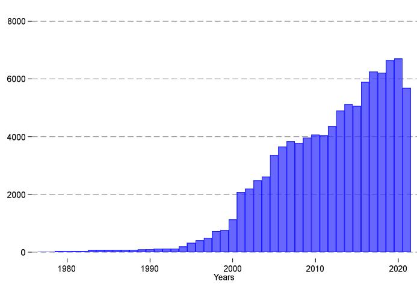  
Source: Authors

Annex Figure 2. Country Coverage by Region, 1977–2021  
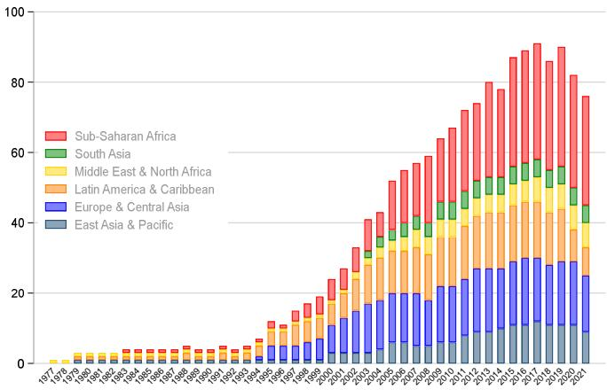  
Source: Authors

Looking at the breakdown by income groups, middle income countries dominate the sample with a 50 percent share (Annex Figure 3). On the other hand, low-income countries account for 30 percent of the sample, while high income countries make up the remaining 20 percent. The figure also highlights the rapid expansion in domestic debt disclosures among middle income countries, with low-income countries also making notable progress.

## Annex Figure 3. Country Coverage by Income Group, 1977–2021

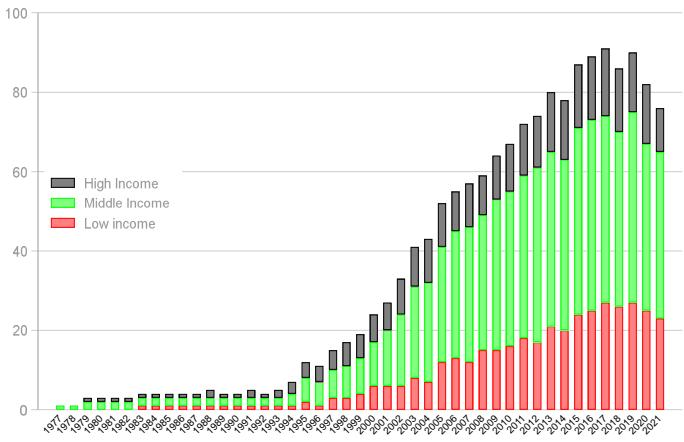

Annex Figure 4 depicts the distribution of the maturity of domestic securities. Predictably, short-term instruments are more common, with securities featuring a maturity of less than 3 months accounting for 22 percent of the total number of instruments. This share increases to 57 percent for securities with up to 1 year maturity, reflecting shallow medium to long-term security markets in the covered countries.

Annex Figure 4. Distribution of Domestic Securities by Maturity  
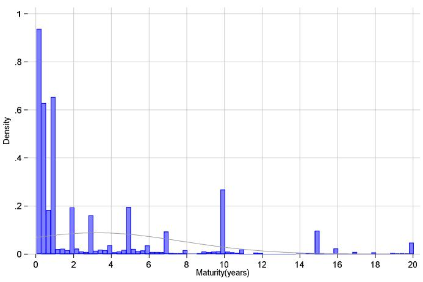  
Source: Authors

Annex Figure 5 presents the distribution of nominal and real interest rates on government securities. The average nominal interest rate is 9 percent, and for the real interest rate (calculated as the difference between nominal interest rate and inflation), the average stands at 2.2 percent. Approximately two thirds of all observations fall within the single digit nominal interest rate range, with the remaining one third comprising double digit rates. Negative real interest rates are more common than one might expect, accounting for one quarter of all observations. On the other hand, 75 percent of securities carry positive real rates, and about 40 percent of the sample exhibits real nominal rates above the typical real return on U.S. government securities (historically in the range of 1-3%).

Annex Figure 5. Distribution of Nominal and Real Interest Rates on Government Securities  
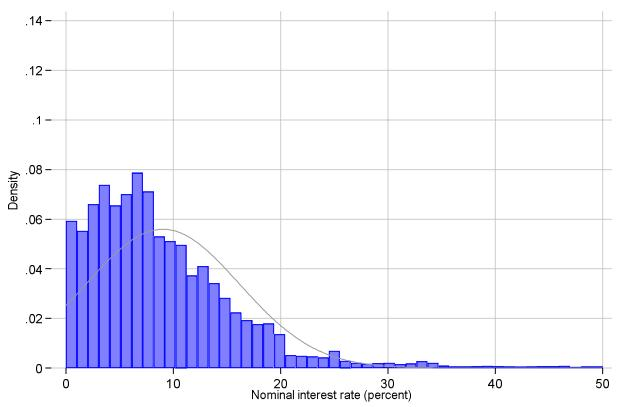  
Source: Authors

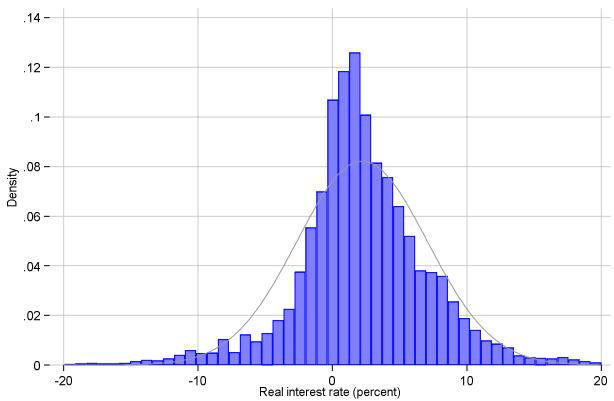

Annex Table 1. Country Sample and Data Coverage

<table><tr><td>Country</td><td>2000</td><td>2001</td><td>2002</td><td>2003</td><td>2004</td><td>2005</td><td>2006</td><td>2007</td><td>2008</td><td>2009</td><td>2010</td><td>2011</td><td>2012</td><td>2013</td><td>2014</td><td>2015</td><td>2016</td><td>2017</td><td>2018</td><td>2019</td><td>2020</td><td>2021</td></tr><tr><td>Algeria</td><td></td><td></td><td></td><td></td><td></td><td></td><td></td><td>X</td><td>X</td><td>X</td><td>X</td><td>X</td><td>X</td><td>X</td><td>X</td><td>X</td><td>X</td><td>X</td><td>X</td><td>X</td><td>X</td><td>X</td></tr><tr><td>Bangladesh</td><td></td><td></td><td></td><td>X</td><td>X</td><td>X</td><td>X</td><td>X</td><td>X</td><td>X</td><td>X</td><td>X</td><td>X</td><td>X</td><td>X</td><td>X</td><td>X</td><td>X</td><td>X</td><td>X</td><td>X</td><td>X</td></tr><tr><td>Belize</td><td></td><td></td><td></td><td></td><td></td><td></td><td></td><td></td><td></td><td>X</td><td>X</td><td>X</td><td>X</td><td>X</td><td>X</td><td>X</td><td>X</td><td>X</td><td>X</td><td>X</td><td>X</td><td>X</td></tr><tr><td>Benin</td><td></td><td></td><td></td><td></td><td></td><td>X</td><td>X</td><td>X</td><td>X</td><td>X</td><td>X</td><td>X</td><td>X</td><td>X</td><td>X</td><td>X</td><td>X</td><td>X</td><td>X</td><td>X</td><td>X</td><td>X</td></tr><tr><td>Bhutan</td><td></td><td></td><td></td><td></td><td></td><td></td><td></td><td></td><td></td><td>X</td><td>X</td><td>X</td><td>X</td><td>X</td><td>X</td><td>X</td><td>X</td><td>X</td><td>X</td><td>X</td><td>X</td><td>X</td></tr><tr><td>Botswana</td><td></td><td></td><td></td><td>X</td><td></td><td></td><td></td><td></td><td>X</td><td>X</td><td>X</td><td>X</td><td>X</td><td>X</td><td>X</td><td>X</td><td>X</td><td>X</td><td>X</td><td>X</td><td>X</td><td>X</td></tr><tr><td>Brazil</td><td>X</td><td>X</td><td>X</td><td>X</td><td>X</td><td>X</td><td>X</td><td>X</td><td>X</td><td>X</td><td>X</td><td>X</td><td>X</td><td>X</td><td>X</td><td>X</td><td>X</td><td>X</td><td>X</td><td>X</td><td>X</td><td>X</td></tr><tr><td>Burkina Faso</td><td></td><td></td><td></td><td>X</td><td></td><td>X</td><td>X</td><td>X</td><td>X</td><td>X</td><td>X</td><td>X</td><td>X</td><td>X</td><td>X</td><td>X</td><td>X</td><td>X</td><td>X</td><td>X</td><td>X</td><td>X</td></tr><tr><td>Burundi</td><td></td><td></td><td></td><td></td><td></td><td></td><td></td><td>X</td><td>X</td><td>X</td><td>X</td><td>X</td><td>X</td><td>X</td><td>X</td><td>X</td><td>X</td><td>X</td><td>X</td><td>X</td><td>X</td><td>X</td></tr><tr><td>Cabo Verde</td><td></td><td></td><td></td><td></td><td></td><td></td><td></td><td></td><td></td><td></td><td></td><td></td><td></td><td></td><td></td><td></td><td></td><td></td><td>X</td><td>X</td><td></td><td></td></tr><tr><td>Cameroon</td><td></td><td></td><td></td><td></td><td></td><td></td><td></td><td></td><td></td><td></td><td></td><td></td><td></td><td></td><td></td><td>X</td><td>X</td><td>X</td><td></td><td>X</td><td>X</td><td>X</td></tr><tr><td>Chad</td><td></td><td></td><td></td><td></td><td></td><td></td><td></td><td></td><td></td><td></td><td></td><td></td><td></td><td></td><td></td><td></td><td>X</td><td>X</td><td></td><td></td><td></td><td></td></tr><tr><td>China</td><td></td><td></td><td></td><td></td><td></td><td></td><td></td><td></td><td></td><td></td><td></td><td></td><td></td><td></td><td></td><td>X</td><td>X</td><td>X</td><td>X</td><td>X</td><td>X</td><td>X</td></tr><tr><td>Colombia</td><td></td><td>X</td><td>X</td><td>X</td><td>X</td><td>X</td><td>X</td><td>X</td><td>X</td><td>X</td><td></td><td>X</td><td>X</td><td>X</td><td>X</td><td>X</td><td>X</td><td>X</td><td>X</td><td>X</td><td>X</td><td>X</td></tr><tr><td>Congo, Rep.</td><td></td><td></td><td></td><td></td><td></td><td></td><td></td><td></td><td></td><td></td><td></td><td></td><td></td><td></td><td></td><td></td><td></td><td></td><td></td><td></td><td>X</td><td>X</td></tr><tr><td>Cote d'lvoire</td><td></td><td></td><td></td><td></td><td></td><td>X</td><td></td><td>X</td><td>X</td><td>X</td><td>X</td><td>X</td><td>X</td><td>X</td><td>X</td><td>X</td><td>X</td><td>X</td><td></td><td>X</td><td>X</td><td>X</td></tr><tr><td>Dominica</td><td></td><td></td><td></td><td></td><td></td><td></td><td></td><td></td><td></td><td></td><td></td><td></td><td>X</td><td>X</td><td>X</td><td>X</td><td>X</td><td>X</td><td>X</td><td>X</td><td></td><td></td></tr><tr><td>Egypt, Arab Rep.</td><td></td><td></td><td>X</td><td>X</td><td>X</td><td>X</td><td>X</td><td>X</td><td>X</td><td>X</td><td>X</td><td>X</td><td>X</td><td>X</td><td>X</td><td>X</td><td>X</td><td>X</td><td>X</td><td>X</td><td>X</td><td>X</td></tr><tr><td>Eswatini</td><td></td><td></td><td></td><td></td><td></td><td></td><td></td><td></td><td></td><td></td><td>X</td><td>X</td><td></td><td>X</td><td>X</td><td>X</td><td>X</td><td>X</td><td>X</td><td>X</td><td>X</td><td>X</td></tr><tr><td>Ethiopia</td><td></td><td></td><td></td><td></td><td></td><td></td><td></td><td></td><td></td><td></td><td></td><td></td><td></td><td></td><td></td><td></td><td></td><td></td><td></td><td>X</td><td>X</td><td>X</td></tr><tr><td>Fiji</td><td>X</td><td>X</td><td>X</td><td>X</td><td>X</td><td>X</td><td>X</td><td>X</td><td>X</td><td>X</td><td>X</td><td>X</td><td>X</td><td>X</td><td>X</td><td>X</td><td>X</td><td>X</td><td>X</td><td>X</td><td>X</td><td>X</td></tr><tr><td>Gabon</td><td></td><td></td><td></td><td></td><td></td><td></td><td></td><td></td><td></td><td></td><td></td><td></td><td></td><td></td><td></td><td>X</td><td>X</td><td>X</td><td></td><td>X</td><td>X</td><td>X</td></tr><tr><td>Gambia, The</td><td></td><td></td><td></td><td></td><td></td><td></td><td></td><td></td><td></td><td></td><td></td><td></td><td></td><td></td><td></td><td></td><td></td><td>X</td><td>X</td><td>X</td><td>X</td><td>X</td></tr><tr><td>Ghana</td><td></td><td></td><td></td><td></td><td></td><td></td><td></td><td></td><td></td><td></td><td></td><td></td><td></td><td>X</td><td></td><td>X</td><td>X</td><td>X</td><td>X</td><td>X</td><td>X</td><td>X</td></tr><tr><td>Grenada</td><td></td><td></td><td></td><td>X</td><td>X</td><td>X</td><td>X</td><td>X</td><td>X</td><td>X</td><td>X</td><td>X</td><td>X</td><td>X</td><td>X</td><td>X</td><td>X</td><td>X</td><td>X</td><td>X</td><td></td><td></td></tr><tr><td>Guinea</td><td></td><td></td><td></td><td></td><td></td><td></td><td></td><td></td><td></td><td></td><td></td><td></td><td></td><td></td><td>X</td><td>X</td><td>X</td><td>X</td><td>X</td><td>X</td><td></td><td></td></tr><tr><td>Guinea-Bissau</td><td></td><td></td><td></td><td></td><td></td><td>X</td><td>X</td><td></td><td></td><td></td><td></td><td></td><td></td><td>X</td><td></td><td>X</td><td>X</td><td>X</td><td>X</td><td>X</td><td>X</td><td>X</td></tr><tr><td>Guyana</td><td>X</td><td>X</td><td>X</td><td>X</td><td>X</td><td>X</td><td>X</td><td>X</td><td>X</td><td>X</td><td>X</td><td>X</td><td>X</td><td>X</td><td>X</td><td>X</td><td>X</td><td>X</td><td>X</td><td>X</td><td>X</td><td>X</td></tr><tr><td>Jamaica</td><td>X</td><td>X</td><td>X</td><td>X</td><td>X</td><td>X</td><td>X</td><td>X</td><td>X</td><td>X</td><td>X</td><td>X</td><td>X</td><td>X</td><td>X</td><td>X</td><td>X</td><td>X</td><td>X</td><td>X</td><td>X</td><td>X</td></tr><tr><td>Jordan</td><td></td><td></td><td></td><td></td><td></td><td></td><td></td><td></td><td></td><td></td><td></td><td></td><td></td><td></td><td></td><td>X</td><td>X</td><td>X</td><td>X</td><td>X</td><td>X</td><td>X</td></tr><tr><td>Kenya</td><td>X</td><td>X</td><td>X</td><td>X</td><td>X</td><td>X</td><td>X</td><td>X</td><td>X</td><td>X</td><td>X</td><td>X</td><td>X</td><td>X</td><td>X</td><td>X</td><td>X</td><td>X</td><td>X</td><td>X</td><td>X</td><td>X</td></tr><tr><td>Lebanon</td><td>X</td><td>X</td><td>X</td><td>X</td><td>X</td><td></td><td>X</td><td>X</td><td>X</td><td>X</td><td>X</td><td>X</td><td>X</td><td>X</td><td>X</td><td>X</td><td>X</td><td>X</td><td>X</td><td>X</td><td>X</td><td>X</td></tr><tr><td>Lesotho</td><td></td><td></td><td></td><td></td><td></td><td></td><td></td><td></td><td></td><td></td><td></td><td></td><td>X</td><td>X</td><td>X</td><td>X</td><td>X</td><td>X</td><td>X</td><td>X</td><td></td><td>X</td></tr><tr><td>Liberia</td><td></td><td></td><td></td><td></td><td></td><td></td><td></td><td></td><td></td><td></td><td></td><td></td><td></td><td>X</td><td>X</td><td>X</td><td>X</td><td>X</td><td>X</td><td>X</td><td></td><td></td></tr><tr><td>Madagascar</td><td></td><td></td><td></td><td></td><td></td><td></td><td></td><td>X</td><td>X</td><td>X</td><td>X</td><td>X</td><td>X</td><td>X</td><td>X</td><td>X</td><td>X</td><td>X</td><td>X</td><td>X</td><td>X</td><td>X</td></tr><tr><td>Malawi</td><td>X</td><td>X</td><td>X</td><td>X</td><td>X</td><td>X</td><td>X</td><td>X</td><td>X</td><td>X</td><td>X</td><td>X</td><td>X</td><td>X</td><td>X</td><td>X</td><td>X</td><td>X</td><td>X</td><td>X</td><td>X</td><td>X</td></tr><tr><td>Maldives</td><td></td><td></td><td></td><td></td><td></td><td></td><td>X</td><td>X</td><td>X</td><td>X</td><td>X</td><td>X</td><td>X</td><td>X</td><td>X</td><td>X</td><td>X</td><td>X</td><td>X</td><td>X</td><td>X</td><td>X</td></tr><tr><td>Mali</td><td></td><td></td><td></td><td></td><td></td><td>X</td><td>X</td><td></td><td>X</td><td></td><td>X</td><td>X</td><td>X</td><td>X</td><td>X</td><td>X</td><td>X</td><td>X</td><td>X</td><td>X</td><td>X</td><td>X</td></tr><tr><td>Mauritania</td><td></td><td></td><td></td><td></td><td></td><td></td><td></td><td></td><td></td><td></td><td></td><td></td><td></td><td></td><td></td><td>X</td><td>X</td><td>X</td><td>X</td><td>X</td><td>X</td><td>X</td></tr><tr><td>Mauritius</td><td>X</td><td>X</td><td>X</td><td>X</td><td>X</td><td>X</td><td>X</td><td>X</td><td>X</td><td>X</td><td>X</td><td>X</td><td>X</td><td>X</td><td>X</td><td>X</td><td>X</td><td>X</td><td>X</td><td>X</td><td>X</td><td>X</td></tr><tr><td>Morocco</td><td></td><td></td><td></td><td></td><td></td><td></td><td>X</td><td>X</td><td>X</td><td>X</td><td>X</td><td>X</td><td>X</td><td>X</td><td>X</td><td>X</td><td>X</td><td>X</td><td>X</td><td>X</td><td>X</td><td>X</td></tr><tr><td>Mozambique</td><td></td><td></td><td></td><td></td><td></td><td></td><td></td><td></td><td></td><td></td><td>X</td><td>X</td><td>X</td><td>X</td><td>X</td><td>X</td><td>X</td><td>X</td><td>X</td><td>X</td><td>X</td><td>X</td></tr><tr><td>Myanmar</td><td></td><td></td><td></td><td></td><td></td><td></td><td></td><td></td><td></td><td></td><td></td><td></td><td></td><td></td><td></td><td></td><td></td><td>X</td><td>X</td><td>X</td><td>X</td><td>X</td></tr><tr><td>Namibia</td><td></td><td></td><td></td><td></td><td></td><td></td><td>X</td><td>X</td><td>X</td><td>X</td><td>X</td><td>X</td><td>X</td><td>X</td><td>X</td><td>X</td><td>X</td><td>X</td><td>X</td><td>X</td><td>X</td><td>X</td></tr><tr><td>Niger</td><td></td><td></td><td></td><td></td><td></td><td>X</td><td>X</td><td></td><td>X</td><td>X</td><td></td><td>X</td><td></td><td>X</td><td></td><td>X</td><td>X</td><td>X</td><td>X</td><td>X</td><td>X</td><td>X</td></tr><tr><td>Nigeria</td><td></td><td></td><td>X</td><td>X</td><td>X</td><td>X</td><td>X</td><td>X</td><td>X</td><td>X</td><td>X</td><td>X</td><td>X</td><td>X</td><td>X</td><td>X</td><td>X</td><td>X</td><td>X</td><td>X</td><td>X</td><td>X</td></tr><tr><td>Pakistan</td><td></td><td></td><td></td><td></td><td>X</td><td>X</td><td>X</td><td>X</td><td>X</td><td>X</td><td>X</td><td>X</td><td>X</td><td>X</td><td>X</td><td>X</td><td>X</td><td>X</td><td>X</td><td>X</td><td>X</td><td>X</td></tr><tr><td>Philippines</td><td></td><td></td><td></td><td></td><td></td><td>X</td><td>X</td><td>X</td><td>X</td><td>X</td><td>X</td><td>X</td><td>X</td><td>X</td><td>X</td><td>X</td><td>X</td><td>X</td><td>X</td><td>X</td><td>X</td><td>X</td></tr><tr><td>Rwanda</td><td></td><td></td><td></td><td></td><td></td><td></td><td></td><td></td><td>X</td><td></td><td>X</td><td>X</td><td>X</td><td>X</td><td>X</td><td>X</td><td>X</td><td>X</td><td>X</td><td>X</td><td>X</td><td>X</td></tr><tr><td>Senegal</td><td></td><td></td><td></td><td></td><td></td><td>X</td><td>X</td><td>X</td><td>X</td><td>X</td><td>X</td><td>X</td><td>X</td><td>X</td><td>X</td><td>X</td><td>X</td><td>X</td><td></td><td>X</td><td>X</td><td>X</td></tr><tr><td>Seychelles</td><td></td><td></td><td></td><td></td><td></td><td></td><td></td><td></td><td></td><td></td><td>X</td><td>X</td><td>X</td><td>X</td><td>X</td><td>X</td><td>X</td><td>X</td><td>X</td><td>X</td><td>X</td><td>X</td></tr><tr><td>Sierra Leone</td><td>X</td><td>X</td><td>X</td><td>X</td><td>X</td><td>X</td><td>X</td><td>X</td><td>X</td><td>X</td><td>X</td><td>X</td><td>X</td><td>X</td><td>X</td><td>X</td><td>X</td><td>X</td><td>X</td><td>X</td><td>X</td><td>X</td></tr><tr><td>Solomon Islands</td><td></td><td></td><td></td><td></td><td></td><td></td><td></td><td></td><td></td><td></td><td></td><td></td><td></td><td></td><td>X</td><td>X</td><td>X</td><td>X</td><td>X</td><td>X</td><td>X</td><td>X</td></tr><tr><td>South Africa</td><td>X</td><td>X</td><td>X</td><td>X</td><td>X</td><td>X</td><td>X</td><td>X</td><td>X</td><td>X</td><td>X</td><td>X</td><td>X</td><td>X</td><td>X</td><td>X</td><td>X</td><td>X</td><td>X</td><td>X</td><td>X</td><td>X</td></tr><tr><td>Sri Lanka</td><td></td><td></td><td></td><td>X</td><td>X</td><td>X</td><td>X</td><td>X</td><td>X</td><td>X</td><td>X</td><td>X</td><td>X</td><td>X</td><td>X</td><td>X</td><td>X</td><td>X</td><td>X</td><td>X</td><td>X</td><td>X</td></tr><tr><td>St. Lucia</td><td></td><td></td><td></td><td></td><td>X</td><td>X</td><td>X</td><td>X</td><td>X</td><td>X</td><td>X</td><td>X</td><td>X</td><td>X</td><td>X</td><td>X</td><td>X</td><td>X</td><td>X</td><td>X</td><td></td><td></td></tr><tr><td>St. Vincent and the Grenadines</td><td></td><td></td><td></td><td>X</td><td>X</td><td>X</td><td>X</td><td>X</td><td>X</td><td>X</td><td>X</td><td>X</td><td>X</td><td>X</td><td>X</td><td>X</td><td>X</td><td>X</td><td>X</td><td>X</td><td></td><td></td></tr><tr><td>Tanzania</td><td>X</td><td>X</td><td>X</td><td>X</td><td>X</td><td>X</td><td>X</td><td>X</td><td>X</td><td>X</td><td>X</td><td>X</td><td>X</td><td>X</td><td>X</td><td>X</td><td>X</td><td>X</td><td>X</td><td>X</td><td>X</td><td>X</td></tr><tr><td>Thailand</td><td>X</td><td>X</td><td>X</td><td>X</td><td>X</td><td>X</td><td>X</td><td>X</td><td>X</td><td>X</td><td>X</td><td>X</td><td>X</td><td>X</td><td>X</td><td>X</td><td>X</td><td>X</td><td>X</td><td>X</td><td>X</td><td>X</td></tr><tr><td>Togo</td><td></td><td></td><td></td><td></td><td></td><td></td><td>X</td><td>X</td><td></td><td>X</td><td></td><td>X</td><td>X</td><td>X</td><td>X</td><td>X</td><td>X</td><td>X</td><td>X</td><td>X</td><td>X</td><td>X</td></tr><tr><td>Turkey</td><td>X</td><td></td><td>X</td><td>X</td><td>X</td><td>X</td><td>X</td><td>X</td><td>X</td><td>X</td><td>X</td><td>X</td><td>X</td><td>X</td><td>X</td><td>X</td><td>X</td><td>X</td><td>X</td><td>X</td><td>X</td><td>X</td></tr><tr><td>Uganda</td><td></td><td></td><td></td><td></td><td></td><td></td><td></td><td></td><td>X</td><td>X</td><td>X</td><td>X</td><td>X</td><td>X</td><td>X</td><td>X</td><td>X</td><td>X</td><td>X</td><td>X</td><td>X</td><td></td></tr><tr><td>Vanuatu</td><td></td><td></td><td></td><td></td><td></td><td>X</td><td>X</td><td>X</td><td>X</td><td>X</td><td>X</td><td>X</td><td>X</td><td>X</td><td>X</td><td>X</td><td>X</td><td>X</td><td>X</td><td>X</td><td>X</td><td>X</td></tr><tr><td>Zambia</td><td>X</td><td>X</td><td>X</td><td>X</td><td>X</td><td>X</td><td>X</td><td>X</td><td>X</td><td>X</td><td>X</td><td>X</td><td>X</td><td>X</td><td>X</td><td>X</td><td>X</td><td>X</td><td>X</td><td>X</td><td>X</td><td>X</td></tr><tr><td>Albania</td><td></td><td></td><td>X</td><td>X</td><td>X</td><td>X</td><td>X</td><td>X</td><td>X</td><td>X</td><td>X</td><td>X</td><td>X</td><td>X</td><td>X</td><td>X</td><td>X</td><td>X</td><td>X</td><td>X</td><td>X</td><td>X</td></tr><tr><td>Armenia</td><td>X</td><td>X</td><td>X</td><td>X</td><td>X</td><td>X</td><td>X</td><td>X</td><td>X</td><td>X</td><td>X</td><td>X</td><td>X</td><td>X</td><td></td><td>X</td><td>X</td><td>X</td><td>X</td><td>X</td><td>X</td><td>X</td></tr><tr><td>Azerbaijan</td><td></td><td></td><td></td><td></td><td></td><td></td><td>X</td><td>X</td><td>X</td><td>X</td><td>X</td><td>X</td><td>X</td><td>X</td><td>X</td><td></td><td>X</td><td>X</td><td>X</td><td>X</td><td>X</td><td>X</td></tr><tr><td>Bulgaria</td><td></td><td>X</td><td>X</td><td>X</td><td>X</td><td>X</td><td>X</td><td>X</td><td>X</td><td>X</td><td>X</td><td>X</td><td>X</td><td>X</td><td>X</td><td>X</td><td>X</td><td>X</td><td></td><td>X</td><td></td><td>X</td></tr><tr><td>Kyrgyz Republic</td><td>X</td><td>X</td><td>X</td><td>X</td><td>X</td><td>X</td><td>X</td><td>X</td><td>X</td><td>X</td><td>X</td><td>X</td><td>X</td><td>X</td><td>X</td><td>X</td><td>X</td><td>X</td><td>X</td><td>X</td><td>X</td><td>X</td></tr><tr><td>Moldova</td><td>X</td><td>X</td><td>X</td><td>X</td><td>X</td><td>X</td><td>X</td><td>X</td><td>X</td><td>X</td><td>X</td><td>X</td><td>X</td><td>X</td><td>X</td><td>X</td><td>X</td><td>X</td><td>X</td><td>X</td><td>X</td><td>X</td></tr><tr><td>Montenegro</td><td></td><td>X</td><td>X</td><td>X</td><td>X</td><td>X</td><td>X</td><td>X</td><td></td><td>X</td><td>X</td><td>X</td><td>X</td><td>X</td><td>X</td><td>X</td><td>X</td><td>X</td><td>X</td><td>X</td><td>X</td><td></td></tr><tr><td>Tajikistan</td><td></td><td></td><td></td><td></td><td></td><td></td><td></td><td></td><td></td><td>X</td><td>X</td><td>X</td><td>X</td><td>X</td><td>X</td><td>X</td><td>X</td><td>X</td><td>X</td><td>X</td><td>X</td><td></td></tr></table>

Source: Authors

## Annex Table 2. Data Sources

<table><tr><td>Country</td><td>Sources</td><td>Links</td></tr><tr><td>Albania*</td><td>Bank of Albania</td><td>https://www.bankofalbania.org/</td></tr><tr><td>Algeria*</td><td>Bank of Algeria, Algier stock exchange</td><td>https://www.bank-of-algeria.dz https://www.sgbv.dz/</td></tr><tr><td>Antigua and Barbuda</td><td>Eastern Caribbean Securities Market (ECSM)</td><td>https://www.ecseonline.com/</td></tr><tr><td>Armenia*</td><td>Central Bank of Armenia, Ministry of Finance</td><td>https://www.cba.am/en/ https://www.minfin.am/en/</td></tr><tr><td>Aruba</td><td>Central Bank of Aruba</td><td>https://www.cbaruba.org/</td></tr><tr><td>Azerbaijan*</td><td>Central Bank of Azerbaijan</td><td>https://www.cbar.az/</td></tr><tr><td>Bahamas, The</td><td>Central Bank of the Bahamas</td><td>https://www.centralbankbahamas.com/</td></tr><tr><td>Bahrain</td><td>Central Bank of Bahrain</td><td>https://www.cbb.gov.bh/</td></tr><tr><td>Bangladesh*</td><td>Central Bank of Bangladesh</td><td>https://www.bb.org.bd/en/</td></tr><tr><td>Barbados</td><td>Central Bank of Barbados</td><td>http://www.centralbank.org.bb/</td></tr><tr><td>Belarus</td><td>National Bank of Republic of Belarus</td><td>https://www.nbrb.by/engl</td></tr><tr><td>Belize*</td><td>Central Bank of Belize</td><td>https://www.centralbank.org.bz/</td></tr><tr><td>Benin*</td><td>BCEAO</td><td>https://www.bceao.int/fr/ https://www.umoatitres.org/en/</td></tr><tr><td>Bermuda</td><td>Government of Bermuda</td><td>https://www.gov.bm/</td></tr><tr><td>Bhutan*</td><td>Ministry of Finance of Bhutan</td><td>https://www.rma.org.bt https://www.mof.gov.bt/</td></tr><tr><td>Botswana*</td><td>Bank of Botswana</td><td>https://www.bankofbotswana.bw/</td></tr><tr><td>Brazil*</td><td>Central Bank of Brazil</td><td>https://www.bcb.gov.br/en/</td></tr><tr><td>Brunei Darussalam</td><td>Brunei Darussalam Central Bank</td><td>https://www.bdcb.gov.bn/</td></tr><tr><td>Bulgaria*</td><td>Ministry of Finance of Bulgaria</td><td>https://www.minfin.bg/en</td></tr><tr><td>Burkina Faso*</td><td>BCEAO</td><td>https://www.bceao.int/fr/ https://www.umoatitres.org/en/</td></tr><tr><td>Burundi*</td><td>Central Bank of Burundi</td><td>https://www.brb.bi/fr/</td></tr><tr><td>Cabo Verde*</td><td>Bank of Cape Verde</td><td>https://www.bvc.cv/</td></tr><tr><td>Cameroon*</td><td>BEAC</td><td>https://www.beac.int/</td></tr><tr><td>Chad*</td><td>BEAC</td><td>https://www.beac.int/</td></tr><tr><td>Chile</td><td>Ministry of Finance</td><td>https://www.hacienda.cl/english/</td></tr><tr><td>China*</td><td>China Foreign Exchange Market</td><td>http://www.chinamoney.com.cn/english/</td></tr><tr><td>Colombia*</td><td>Central Bank of Colombia</td><td>https://www.banrep.gov.co/es/</td></tr><tr><td>Congo, Rep.*</td><td>BEAC</td><td>https://www.beac.int/</td></tr><tr><td>Cote d'lvoire*</td><td>BCEAO</td><td>https://www.bceao.int/fr/ https://www.umoatitres.org/en/</td></tr><tr><td>Croatia</td><td>Croatian National Bank</td><td>https://www.hnb.hr/en/</td></tr><tr><td>Curacao</td><td>National Bank of Curacao</td><td>https://www.centralbank.cw/</td></tr><tr><td>Cyprus</td><td>Ministry of finance</td><td>https://www.mof.gov.cy/</td></tr><tr><td>Dominica*</td><td>Eastern Caribbean Securities Market (ECSM)</td><td>https://www.ecseonline.com/</td></tr><tr><td>Egypt, Arab Rep.*</td><td>Central Bank of Egypt</td><td>https://www.cbe.org.eg/en/</td></tr><tr><td>Eswatini*</td><td>Central Bank of Eswatini</td><td>https://www.centralbank.org.sz/</td></tr><tr><td>Ethiopia*</td><td>National Bank of Ethiopia, ministry of finance</td><td>https://nbe.gov.et/ https://www.mofed.gov.et/</td></tr><tr><td>Fiji*</td><td>Reserve Bank of Fiji</td><td>https://www.rbf.gov.fj/</td></tr><tr><td>Gabon*</td><td>BEAC</td><td>https://www.beac.int/</td></tr><tr><td>Gambia, The*</td><td>Central Bank of Gambia</td><td>https://www.cbg.gm/</td></tr><tr><td>Georgia</td><td>Ministry of Finance</td><td>https://www.mof.ge/en/</td></tr><tr><td>Ghana*</td><td>Bank of Ghana, Ministry of Finance</td><td>https://www.bog.gov.gh/ https://mofep.gov.gh/</td></tr><tr><td>Greece</td><td>Public Debt Management Agency, Ministry of finance.</td><td>https://www.pdma.gr/en/ https://www.minfin.gr/</td></tr><tr><td>Grenada*</td><td>Eastern Caribbean Securities Market (ECSM)</td><td>https://www.ecseonline.com/</td></tr><tr><td>Guinea*</td><td>Central Bank of Guinea</td><td>https://www.bcrg-guinee.org/</td></tr><tr><td>Guinea-Bissau*</td><td>BCEAO</td><td>https://www.bceao.int/fr/ https://www.umoatitres.org/en/</td></tr><tr><td>Guyana*</td><td>Bank of Guyana</td><td>https://bankofguyana.org.gy/</td></tr><tr><td>Hong Kong SAR, China</td><td>Hong Kong Monetary Authority</td><td>https://www.hkma.gov.hk/eng/</td></tr><tr><td>Hungary</td><td>Magyar Nemzeti Bank</td><td>https://www.mnb.hu/en/</td></tr><tr><td>Ireland</td><td>National Treasury Management Agency</td><td>https://www.ntma.ie/</td></tr><tr><td>Israel</td><td>Ministry of Finance</td><td>https://www.gov.il/en/</td></tr><tr><td>Jamaica*</td><td>Bank of Jamaica</td><td>https://view.officeapps.live.com/op/</td></tr><tr><td>Japan</td><td>Ministry of Finance</td><td>https://www.mof.go.jp/english/</td></tr><tr><td>Jordan*</td><td>Central Bank of Jordan</td><td>https://www.cbj.gov.jo/Default/En</td></tr><tr><td>Kenya*</td><td>Central Bank of Kenya</td><td>https://www.centralbank.go.ke/</td></tr><tr><td>Korea</td><td>Ministry of Economy and finance</td><td>https://ktb.moef.go.kr/eng/</td></tr><tr><td>Kosovo</td><td>Ministry of finance</td><td>https://mf.rks-gov.net/</td></tr><tr><td>Kyrgyz Republic*</td><td>National Bank of the Kyrgyz Republic</td><td>https://www.nbkr.kg/</td></tr><tr><td>Lebanon*</td><td>Central Bank of Liban</td><td>https://www.bdl.gov.lb/</td></tr><tr><td>Lesotho*</td><td>Central Bank of Lesotho</td><td>https://www.centralbank.org.ls/</td></tr><tr><td>Liberia*</td><td>Central Bank of Liberia</td><td>https://public.cbl.org.lr/</td></tr><tr><td>Lithuania</td><td>Ministry of finance</td><td>https://finmin.lrv.lt/en/</td></tr><tr><td>Madagascar*</td><td>Banky Foiben'l Madagasikara</td><td>https://www.banky-foibe.mg/</td></tr><tr><td>Malawi*</td><td>Reserve Bank of Malawi</td><td>https://www.rbm.mw/</td></tr><tr><td>Maldives*</td><td>Maldives Monetary Authority</td><td>https://www.mma.gov.mv/</td></tr><tr><td>Mali*</td><td>BCEAO</td><td>https://www.bceao.int/fr/ https://www.umoatitres.org/en/</td></tr><tr><td>Malta</td><td>Central Bank of Malta</td><td>https://www.centralbankmalta.org/</td></tr><tr><td>Mauritania*</td><td>Central Bank of Mauritania</td><td>https://www.bcm.mr/</td></tr><tr><td>Mauritius*</td><td>Bank of Mauritius</td><td>https://www.bom.mu/</td></tr><tr><td>Moldova*</td><td>National Bank of Moldova</td><td>https://www.bnm.md/</td></tr><tr><td>Mongolia</td><td>Central Bank of Mongolia</td><td>https://www.mongolbank.mn/eng/</td></tr><tr><td>Montenegro*</td><td>Central Bank of Montenegro</td><td>https://www.cbcg.me/en/</td></tr><tr><td>Morocco*</td><td>Central Bank of Morocco</td><td>https://www.bkam.ma/</td></tr><tr><td>Mozambique*</td><td>Banco de Moçambique</td><td>https://www.bancomoc.mz/</td></tr><tr><td>Myanmar*</td><td>Central Bank of Myanmar</td><td>https://www.cbm.gov.mm/</td></tr><tr><td>Namibia*</td><td>Bank of Namibia</td><td>https://www.bon.com.na/</td></tr><tr><td>Niger*</td><td>BCEAO</td><td>https://www.bceao.int/fr/ https://www.umoatitres.org/en/</td></tr><tr><td>Nigeria*</td><td>Central Bank of Nigeria</td><td>https://www.cbn.gov.ng/</td></tr><tr><td>Oman</td><td>Central Bank of Oman</td><td>https://cbo.gov.om/</td></tr><tr><td>Pakistan*</td><td>State Bank of Pakistan</td><td>https://www.sbp.org.pk/</td></tr><tr><td>Philippines*</td><td>Bangko Sentral ng Pilipinas</td><td>https://www.bsp.gov.ph/</td></tr><tr><td>Rwanda*</td><td>Central Bank of Rwanda</td><td>https://www.bnr.rw/browse-in/</td></tr><tr><td>Senegal*</td><td>BCEAO</td><td>https://www.bceao.int/fr/ https://www.umoatitres.org/en/</td></tr><tr><td>Seychelles*</td><td>Central Bank of Seychelles</td><td>https://www.cbs.sc/</td></tr><tr><td>Sierra Leone*</td><td>Central Bank Sierra Leone</td><td>https://www.bsl.gov.sl/ https://app.datawarehousepro.com/go/sierraleone</td></tr><tr><td>Solomon Islands*</td><td>Central Bank of Solomon Islands</td><td>https://www.cbsi.com.sb/</td></tr><tr><td>South Africa*</td><td>South African Reserve Bank</td><td>https://www.resbank.co.za/en/</td></tr><tr><td>Sri Lanka*</td><td>Central Bank of Sri Lanka</td><td>https://www.cbsl.gov.lk/en/</td></tr><tr><td>St. Kitts and Nevis</td><td>Eastern Caribbean Securities Market (ECSM)</td><td>https://www.ecseonline.com/</td></tr><tr><td>St. Lucia*</td><td>Eastern Caribbean Securities Market (ECSM)</td><td>https://www.ecseonline.com/</td></tr><tr><td>St. Vincent and the Grenadines*</td><td>Eastern Caribbean Securities Market (ECSM)</td><td>https://www.ecseonline.com/</td></tr><tr><td>Tajikistan*</td><td>National Bank of Tajikistan</td><td>https://www.nbt.tj/en/</td></tr><tr><td>Tanzania*</td><td>Bank of Tanzania</td><td>https://www.bot.go.tz/</td></tr><tr><td>Thailand*</td><td>Bank of Thailand</td><td>https://www.bot.or.th/English/</td></tr><tr><td>Togo*</td><td>BCEAO</td><td>https://www.bceao.int/fr/https://www.umoatitres.org/en/</td></tr><tr><td>Trinidad and Tobago</td><td>Central Bank of Trinidad &amp; Tobago</td><td>https://www.central-bank.org.tt/</td></tr><tr><td>Turkey*</td><td>Central Bank of Turkiye</td><td>https://www.tcmb.gov.tr/</td></tr><tr><td>Uganda*</td><td>Bank of Uganda</td><td>https://www.bou.or.ug/</td></tr><tr><td>Vanuatu*</td><td>Reserve Bank of Vanuatu</td><td>https://www.rbv.gov.vu/</td></tr><tr><td>Zambia*</td><td>Bank of Zambia</td><td>https://www.boz.zm/</td></tr></table>

Notes: The asterisk (\*) indicates the 72 developing countries used in the econometric analysis.

Sources: Authors

Appendix Figure 1. Evolution of the Real Interest Rate on Government Securities, 2000–20 (sample median, percent)  
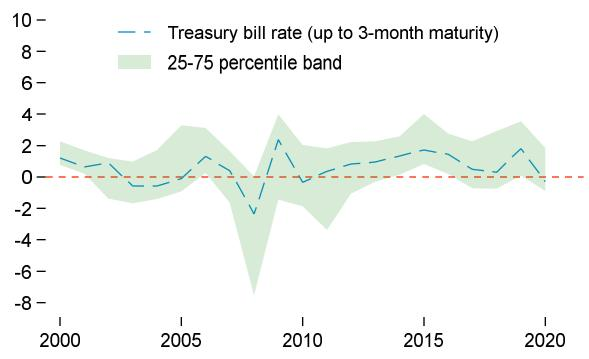

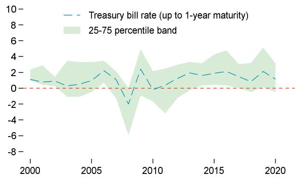

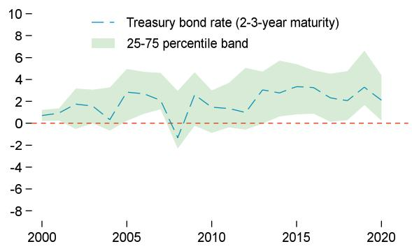

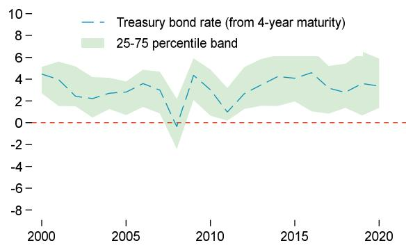  
Notes: Real interest rate is calculated as the difference between nominal interest rate and the CPI inflation rate. Source: Authors

Appendix Figure 2. Real Interest Rate on Government Securities by Income Group (sample median, percent)  
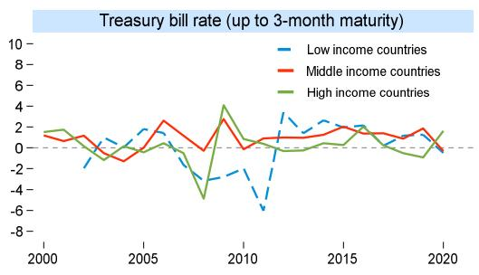

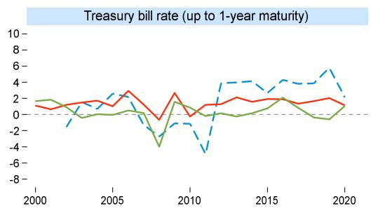

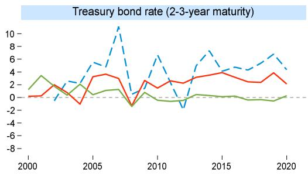

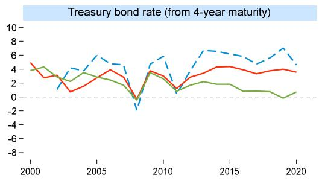  
Notes: Real interest rate is calculated as the difference between nominal interest rate and the CPI inflation rate. Source: Authors

All maturities combined

Up to 3-month maturity

All maturities combined

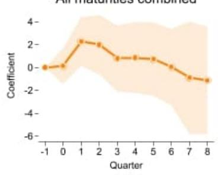

Appendix Figure 3. Impulse Response Function (IRF) of the Interest Rate on Government Securities with respect to Disaster Damage as a Share of GDP  
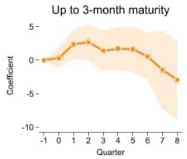

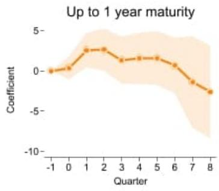

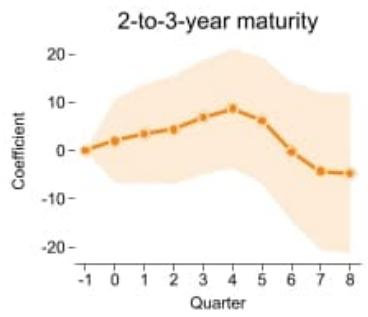

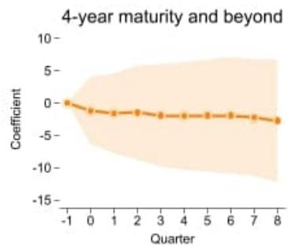  
Notes: IRFs from the local projection estimations of Eq(2) with quarterly data; 90 percent confidence band is shown. Source: Authors  
Appendix Figure 4. Impulse Response Function (IRF) of the Interest Rate on Government Securities with respect to the Share of Affected Population in Total Population

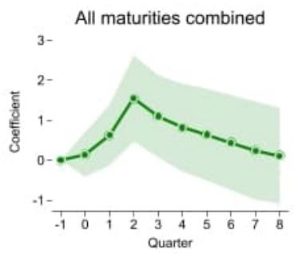

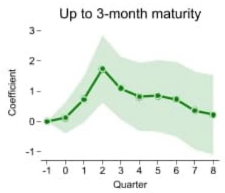

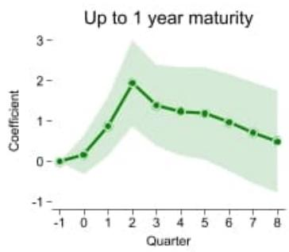

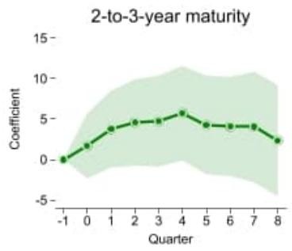

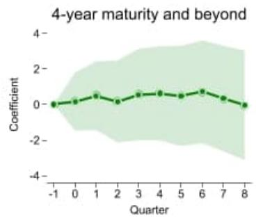  
Notes: IRFs from the local projection estimations of Eq(2) with quarterly data; 90 percent confidence band is shown. Source: Authors

Appendix Table 1. Dataset on Domestic Treasury Bill and Bond Yields: Country Sample

<table><tr><td>Albania*</td><td>Egypt, Arab Rep.*</td><td>Mauritania*</td></tr><tr><td>Algeria*</td><td>Eswatini*</td><td>Mauritius*</td></tr><tr><td>Antigua and Barbuda</td><td>Ethiopia*</td><td>Moldova*</td></tr><tr><td>Armenia*</td><td>Fiji*</td><td>Mongolia</td></tr><tr><td>Aruba</td><td>Gabon*</td><td>Montenegro*</td></tr><tr><td>Azerbaijan*</td><td>Gambia, The*</td><td>Morocco*</td></tr><tr><td>Bahamas, The</td><td>Georgia</td><td>Mozambique*</td></tr><tr><td>Bahrain</td><td>Ghana*</td><td>Myanmar*</td></tr><tr><td>Bangladesh*</td><td>Greece</td><td>Namibia*</td></tr><tr><td>Barbados</td><td>Grenada*</td><td>Niger*</td></tr><tr><td>Belarus</td><td>Guinea*</td><td>Nigeria*</td></tr><tr><td>Belize*</td><td>Guinea-Bissau*</td><td>Oman</td></tr><tr><td>Benin*</td><td>Guyana*</td><td>Pakistan*</td></tr><tr><td>Bermuda</td><td>Hong Kong SAR, China</td><td>Philippines*</td></tr><tr><td>Bhutan*</td><td>Hungary</td><td>Rwanda*</td></tr><tr><td>Botswana*</td><td>Ireland</td><td>Senegal*</td></tr><tr><td>Brazil*</td><td>Israel</td><td>Seychelles*</td></tr><tr><td>Brunei Darussalam</td><td>Jamaica*</td><td>Sierra Leone*</td></tr><tr><td>Bulgaria*</td><td>Japan</td><td>Solomon Islands*</td></tr><tr><td>Burkina Faso*</td><td>Jordan*</td><td>South Africa*</td></tr><tr><td>Burundi*</td><td>Kenya*</td><td>Sri Lanka*</td></tr><tr><td>Cabo Verde*</td><td>Korea</td><td>St. Kitts and Nevis</td></tr><tr><td>Cameroon*</td><td>Kosovo</td><td>St. Lucia*</td></tr><tr><td>Chad*</td><td>Kyrgyz Republic*</td><td>St. Vincent and the Grenadines*</td></tr><tr><td>Chile</td><td>Lebanon*</td><td>Tajikistan*</td></tr><tr><td>China*</td><td>Lesotho*</td><td>Tanzania*</td></tr><tr><td>Colombia*</td><td>Liberia*</td><td>Thailand*</td></tr><tr><td>Congo, Rep.*</td><td>Lithuania</td><td>Togo*</td></tr><tr><td>Cote d&#x27;lvoire*</td><td>Madagascar*</td><td>Trinidad and Tobago</td></tr><tr><td>Croatia</td><td>Malawi*</td><td>Turkey*</td></tr><tr><td>Curacao</td><td>Maldives*</td><td>Uganda*</td></tr><tr><td>Cyprus</td><td>Mali*</td><td>Vanuatu*</td></tr><tr><td>Dominica*</td><td>Malta</td><td>Zambia*</td></tr></table>

Note: The asterisk (\*) indicates the 72 developing countries used in the econometric analysis.

## Appendix Table 2. Summary Statistics and Correlation Matrix

## 2.1 Summary Statistics

<table><tr><td></td><td>Observations</td><td>Mean</td><td>Std. Dev.</td><td>Min</td><td>Max</td></tr><tr><td>Average interest rate on government securities</td><td>1,006</td><td>7.9</td><td>5.9</td><td>0.0</td><td>45.9</td></tr><tr><td>Drought</td><td>1,006</td><td>0.2</td><td>0.4</td><td>0.0</td><td>1.0</td></tr><tr><td>Flood</td><td>1,006</td><td>0.5</td><td>0.5</td><td>0.0</td><td>1.0</td></tr><tr><td>Storm</td><td>1,006</td><td>0.2</td><td>0.4</td><td>0.0</td><td>1.0</td></tr><tr><td>Climate vulnerability index</td><td>927</td><td>47.4</td><td>7.9</td><td>33.8</td><td>68.7</td></tr><tr><td>Per capita constant GDP (log)</td><td>1,006</td><td>7.8</td><td>1.0</td><td>5.6</td><td>9.7</td></tr><tr><td>Public debt/GDP</td><td>844</td><td>53.3</td><td>32.0</td><td>3.2</td><td>210.2</td></tr><tr><td>Monetary policy rate</td><td>969</td><td>10.7</td><td>10.1</td><td>0.0</td><td>60.0</td></tr><tr><td>Current account balance/GDP</td><td>975</td><td>-6.7</td><td>9.4</td><td>-65.0</td><td>33.7</td></tr><tr><td>External reserves/GDP</td><td>879</td><td>21.3</td><td>18.6</td><td>0.1</td><td>133.7</td></tr><tr><td>Exchange Rate (LCU per US dollars)</td><td>1,006</td><td>379.1</td><td>904.1</td><td>0.6</td><td>9183.9</td></tr><tr><td>US 10-year treasury rate</td><td>1,006</td><td>2.9</td><td>1.1</td><td>0.9</td><td>6.0</td></tr><tr><td>Rule of law</td><td>987</td><td>-0.4</td><td>0.5</td><td>-1.6</td><td>1.1</td></tr><tr><td>Average maturity (days)</td><td>985</td><td>1002.6</td><td>1169.9</td><td>28.0</td><td>7305.0</td></tr><tr><td>Inflation rate</td><td>1,006</td><td>6.2</td><td>9.9</td><td>-26.3</td><td>174.9</td></tr><tr><td>Private sector credit/GDP</td><td>982</td><td>35.4</td><td>26.0</td><td>1.0</td><td>182.9</td></tr></table>

2.2 Correlation Matrix

<table><tr><td>Variables</td><td>(1)</td><td>(2)</td><td>(3)</td><td>(4)</td><td>(5)</td><td>(6)</td><td>(7)</td><td>(8)</td><td>(9)</td><td>(10)</td><td>(11)</td><td>(12)</td><td>(13)</td><td>(14)</td><td>(15)</td><td>(16)</td></tr><tr><td>(1) Average interest rate on government securities</td><td>1</td><td></td><td></td><td></td><td></td><td></td><td></td><td></td><td></td><td></td><td></td><td></td><td></td><td></td><td></td><td></td></tr><tr><td>(2) Drought</td><td>0.05*</td><td>1</td><td></td><td></td><td></td><td></td><td></td><td></td><td></td><td></td><td></td><td></td><td></td><td></td><td></td><td></td></tr><tr><td>(3) Flood</td><td>0.14*</td><td>0.17*</td><td>1</td><td></td><td></td><td></td><td></td><td></td><td></td><td></td><td></td><td></td><td></td><td></td><td></td><td></td></tr><tr><td>(4) Storm</td><td>0.00</td><td>0.12*</td><td>0.15*</td><td>1</td><td></td><td></td><td></td><td></td><td></td><td></td><td></td><td></td><td></td><td></td><td></td><td></td></tr><tr><td>(5) Climate vulnerability index</td><td>0.14*</td><td>0.16*</td><td>0.19*</td><td>-0.04</td><td>1</td><td></td><td></td><td></td><td></td><td></td><td></td><td></td><td></td><td></td><td></td><td></td></tr><tr><td>(6) Per capita constant GDP (log)</td><td>-0.31*</td><td>-0.15*</td><td>-0.24*</td><td>0.06*</td><td>-0.73*</td><td>1</td><td></td><td></td><td></td><td></td><td></td><td></td><td></td><td></td><td></td><td></td></tr><tr><td>(7) Public debt/GDP</td><td>0.16*</td><td>-0.09*</td><td>-0.22*</td><td>0.04</td><td>-0.21*</td><td>0.19*</td><td>1</td><td></td><td></td><td></td><td></td><td></td><td></td><td></td><td></td><td></td></tr><tr><td>(8) Monetary policy rate</td><td>0.60*</td><td>0.13*</td><td>0.06*</td><td>0.05</td><td>0.24*</td><td>-0.38*</td><td>0.14*</td><td>1</td><td></td><td></td><td></td><td></td><td></td><td></td><td></td><td></td></tr><tr><td>(9) Current account balance/GDP</td><td>-0.01</td><td>0.05</td><td>0.18*</td><td>0.11*</td><td>-0.05</td><td>0.02</td><td>-0.31*</td><td>-0.14*</td><td>1</td><td></td><td></td><td></td><td></td><td></td><td></td><td></td></tr><tr><td>(10) External reserves/GDP</td><td>-0.29*</td><td>-0.09*</td><td>-0.24*</td><td>-0.04</td><td>-0.28*</td><td>0.31*</td><td>0.23*</td><td>-0.22*</td><td>-0.07*</td><td>1</td><td></td><td></td><td></td><td></td><td></td><td></td></tr><tr><td>(11) Exchange Rate (LCU per US dollars)</td><td>0.05*</td><td>0.03</td><td>0.07*</td><td>0.01</td><td>0.22*</td><td>-0.26*</td><td>-0.05</td><td>0.18*</td><td>-0.03</td><td>-0.03</td><td>1</td><td></td><td></td><td></td><td></td><td></td></tr><tr><td>(12) US 10-year treasury rate</td><td>0.28*</td><td>-0.04</td><td>0.08*</td><td>0.01</td><td>-0.04</td><td>-0.03</td><td>0.11*</td><td>0.19*</td><td>0.06*</td><td>-0.11*</td><td>-0.09*</td><td>1</td><td></td><td></td><td></td><td></td></tr><tr><td>(13) Rule of law</td><td>-0.13*</td><td>-0.02</td><td>-0.17*</td><td>0.03</td><td>-0.34*</td><td>0.56*</td><td>0.05</td><td>-0.13*</td><td>-0.14*</td><td>0.12*</td><td>-0.26*</td><td>0.04</td><td>1</td><td></td><td></td><td></td></tr><tr><td>(14) Average maturity (days)</td><td>-0.14*</td><td>0.05</td><td>0.22*</td><td>0.16*</td><td>-0.19*</td><td>0.21*</td><td>-0.22*</td><td>-0.28*</td><td>0.28*</td><td>0.15*</td><td>0.04</td><td>-0.04</td><td>0.09*</td><td>1</td><td></td><td></td></tr><tr><td>(15) Inflation rate</td><td>0.42*</td><td>0.07*</td><td>0.12*</td><td>-0.02</td><td>0.07*</td><td>-0.16*</td><td>0.01</td><td>0.34*</td><td>0.04</td><td>-0.11*</td><td>0</td><td>0.20*</td><td>-0.09*</td><td>-0.11*</td><td>1</td><td></td></tr><tr><td>(16) Private sector credit/GDP</td><td>-0.36*</td><td>0.01</td><td>-0.10*</td><td>0.19*</td><td>-0.49*</td><td>0.64*</td><td>0.22*</td><td>-0.33*</td><td>-0.04</td><td>0.33*</td><td>-0.19*</td><td>-0.10*</td><td>0.54*</td><td>0.25*</td><td>-0.21*</td><td>1</td></tr></table>

Notes: \* significant at 1, 5 or 10 percent

Appendix Table 3. Variables Definitions and Sources

<table><tr><td>Variables</td><td>Definitions</td><td>Sources</td></tr><tr><td>Average interest rate on government securities</td><td>Average nominal interest rate paid to holders of government securities at issuance or yield to maturity of government securities on the secondary market</td><td rowspan="2">Authors</td></tr><tr><td>Average maturity</td><td>Average maturity of government securities at issuance or remaining maturity for securities traded in the secondary market (expressed in number of days).</td></tr><tr><td>Drought</td><td>A dummy variable taking 1 if a country experiences at least one episode of drought in a given year, and 0 otherwise.</td><td rowspan="3">The Emergency Events Database (EM-DAT)</td></tr><tr><td>Flood</td><td>A dummy variable taking 1 if a country experiences at least one episode of flood in a given year, and 0 otherwise.</td></tr><tr><td>Storm</td><td>A dummy variable taking 1 if a country experiences at least one episode of storm in a given year, and 0 otherwise.</td></tr><tr><td>Climate Vulnerability index</td><td>Propensity of a country to be adversely impacted by climate hazards.</td><td>Notre Dame Global Adaptation Index (ND-GAIN)</td></tr><tr><td>Per capita constant GDP (log)</td><td>Log of per capita Gross Domestic Product constant 2015</td><td></td></tr><tr><td>Public debt/GDP</td><td>Central government gross debt as ratio of GDP</td><td></td></tr><tr><td>Current account balance/GDP</td><td>The current account balance as percentage of GDP</td><td>World Development Indicators (World Bank)</td></tr><tr><td>Private sector credit/GDP</td><td>Credit provided to the private sector by the domestic banking system as a ratio to GDP</td><td></td></tr><tr><td>Inflation rate</td><td>CPI inflation</td><td></td></tr><tr><td>Monetary policy rate</td><td>Main policy rate of the central bank</td><td>Haver Analytics</td></tr><tr><td>External reserves/GDP</td><td>Total foreign exchange reserves (including gold) as ratio of GDP</td><td>International Monetary Fund, International Financial Statistics</td></tr><tr><td>Exchange Rate</td><td>Official exchange rate (local currency unit per US dollar, period average)</td><td>International Monetary Fund, International Financial Statistics</td></tr><tr><td>US 10-year treasury rate</td><td>US 10-year treasury securities interest rates</td><td>US Department of the Treasury.</td></tr><tr><td>Rule of law</td><td>It measures the perceptions of the extent to which agents have confidence in and abide by the rules of society.</td><td>The Worldwide Governance Indicators (WGI)</td></tr></table>

Appendix Table 4. Climate Vulnerability and Interest Rate on Government Securities —First Stage Regression

<table><tr><td>Dependent variable: Climate vulnerability index (lagged)</td><td>(1)</td></tr><tr><td>Exogenous component of climate vulnerability index (lagged)</td><td>30.507***(11.369)</td></tr><tr><td>Per capita constant GDP (log)</td><td>-1.015(0.864)</td></tr><tr><td>GDP per capita growth rate</td><td>0.005(0.011)</td></tr><tr><td>Inflation rate</td><td>0.004*(0.002)</td></tr><tr><td>Current account balance/GDP</td><td>0.011*(0.006)</td></tr><tr><td>External reserves/GDP</td><td>-0.007(0.008)</td></tr><tr><td>Exchange Rate</td><td>0.001***(0.000)</td></tr><tr><td>US 10-year treasury rate</td><td>0.068(0.087)</td></tr><tr><td>Rule of law</td><td>0.350(0.403)</td></tr><tr><td>Average maturity</td><td>-0.000(0.000)</td></tr><tr><td>Constant</td><td>41.238***(9.618)</td></tr><tr><td>Number of observations</td><td>796</td></tr><tr><td>Number of countries</td><td>60</td></tr><tr><td>R2</td><td>0.55</td></tr></table>

Notes: fixed effects estimates; robust standard errors in parentheses; \* significant at 10 percent, \*\* significant at 5 percent and \*\*\* significant at 1 percent. Time dummies are included.

## Appendix Table 5. Drought Episodes and Interest Rate on Government Securities by Maturity: Transmission Channels

## 5.1. Up to 3-month maturity

<table><tr><td></td><td>(1)</td><td>(2)</td><td>(3)</td><td>(4)</td></tr><tr><td>Drought</td><td>1.561***(0.561)</td><td>1.403**(0.543)</td><td>0.970**(0.435)</td><td>0.944**(0.423)</td></tr><tr><td>Public debt/GDP</td><td></td><td>0.067***(0.016)</td><td></td><td>0.015(0.017)</td></tr><tr><td>Monetary policy rate</td><td></td><td></td><td>0.412***(0.128)</td><td>0.397***(0.128)</td></tr><tr><td>Observations</td><td>592</td><td>592</td><td>567</td><td>567</td></tr><tr><td>Countries</td><td>50</td><td>50</td><td>50</td><td>50</td></tr><tr><td>R2</td><td>0.23</td><td>0.29</td><td>0.48</td><td>0.48</td></tr></table>

## 5.2. Up to 1 year maturity

<table><tr><td></td><td>(1)</td><td>(2)</td><td>(3)</td><td>(4)</td></tr><tr><td>Drought</td><td>1.477***(0.552)</td><td>1.378**(0.532)</td><td>0.932**(0.433)</td><td>0.917**(0.423)</td></tr><tr><td>Public debt/GDP</td><td></td><td>0.070***(0.017)</td><td></td><td>0.018(0.019)</td></tr><tr><td>Monetary policy rate</td><td></td><td></td><td>0.421**(0.165)</td><td>0.404**(0.169)</td></tr><tr><td>Observations</td><td>592</td><td>592</td><td>567</td><td>567</td></tr><tr><td>Countries</td><td>50</td><td>50</td><td>50</td><td>50</td></tr><tr><td>R2</td><td>0.23</td><td>0.29</td><td>0.48</td><td>0.48</td></tr></table>

5.3. 2-to-3-year maturity

<table><tr><td></td><td>(1)</td><td>(2)</td><td>(3)</td><td>(4)</td></tr><tr><td>Drought</td><td>-0.260(0.635)</td><td>-0.392(0.687)</td><td>-0.241(0.527)</td><td>-0.364(0.589)</td></tr><tr><td>Public debt/GDP</td><td></td><td>0.124***(0.029)</td><td></td><td>0.103***(0.035)</td></tr><tr><td>Monetary policy rate</td><td></td><td></td><td>0.377***(0.096)</td><td>0.278***(0.091)</td></tr><tr><td>Observations</td><td>296</td><td>296</td><td>286</td><td>286</td></tr><tr><td>Countries</td><td>31</td><td>31</td><td>30</td><td>30</td></tr><tr><td>R2</td><td>0.33</td><td>0.49</td><td>0.44</td><td>0.54</td></tr></table>

## 5.4. 4-year maturity and beyond

<table><tr><td></td><td>(1)</td><td>(2)</td><td>(3)</td><td>(4)</td></tr><tr><td>Drought</td><td>-0.104(0.388)</td><td>-0.239(0.337)</td><td>-0.240(0.344)</td><td>-0.387(0.272)</td></tr><tr><td>Public debt/GDP</td><td></td><td>0.105***(0.020)</td><td></td><td>0.104***(0.030)</td></tr><tr><td>Monetary policy rate</td><td></td><td></td><td>0.282**(0.109)</td><td>0.283***(0.075)</td></tr><tr><td>Observations</td><td>363</td><td>363</td><td>354</td><td>354</td></tr><tr><td>Countries</td><td>33</td><td>33</td><td>33</td><td>33</td></tr><tr><td>R2</td><td>0.24</td><td>0.36</td><td>0.34</td><td>0.46</td></tr></table>

Notes: All control variables and time dummies are included in each of the tables; fixed effects estimates; robust standard errors in parentheses; \* significant at 10 percent, \*\* significant at 5 percent and \*\*\* significant at 1 percent.

## Appendix Table 6. Storm Episodes and Interest Rate on Government Securities by Maturity: Transmission Channels

6.1. Up to 3-month maturity

<table><tr><td></td><td>(1)</td><td>(2)</td><td>(3)</td><td>(4)</td></tr><tr><td>Drought</td><td>0.926***(0.327)</td><td>0.921***(0.291)</td><td>0.648**(0.250)</td><td>0.676***(0.246)</td></tr><tr><td>Public debt/GDP</td><td></td><td>0.068***(0.016)</td><td></td><td>0.017(0.017)</td></tr><tr><td>Monetary policy rate</td><td></td><td></td><td>0.416***(0.129)</td><td>0.399***(0.129)</td></tr><tr><td>Observations</td><td>592</td><td>592</td><td>567</td><td>567</td></tr><tr><td>Countries</td><td>50</td><td>50</td><td>50</td><td>50</td></tr><tr><td>R2</td><td>0.23</td><td>0.29</td><td>0.48</td><td>0.48</td></tr></table>

6.2. Up to 1 year maturity

<table><tr><td></td><td>(1)</td><td>(2)</td><td>(3)</td><td>(4)</td></tr><tr><td>Drought</td><td>1.175***(0.400)</td><td>1.217***(0.384)</td><td>0.800***(0.294)</td><td>0.850***(0.287)</td></tr><tr><td>Public debt/GDP</td><td></td><td>0.071***(0.017)</td><td></td><td>0.020(0.018)</td></tr><tr><td>Monetary policy rate</td><td></td><td></td><td>0.423**(0.164)</td><td>0.404**(0.169)</td></tr><tr><td>Observations</td><td>649</td><td>649</td><td>624</td><td>624</td></tr><tr><td>Countries</td><td>53</td><td>53</td><td>53</td><td>53</td></tr><tr><td>R2</td><td>0.23</td><td>0.29</td><td>0.48</td><td>0.49</td></tr></table>

6.3. 2-to-3-year maturity

<table><tr><td></td><td>(1)</td><td>(2)</td><td>(3)</td><td>(4)</td></tr><tr><td>Drought</td><td>0.016(0.651)</td><td>0.565(0.424)</td><td>0.027(0.469)</td><td>0.474(0.342)</td></tr><tr><td>Public debt/GDP</td><td></td><td>0.125***(0.029)</td><td></td><td>0.105***(0.035)</td></tr><tr><td>Monetary policy rate</td><td></td><td></td><td>0.377***(0.096)</td><td>0.278***(0.091)</td></tr><tr><td>Observations</td><td>296</td><td>296</td><td>286</td><td>286</td></tr><tr><td>Countries</td><td>31</td><td>31</td><td>30</td><td>30</td></tr><tr><td>R2</td><td>0.33</td><td>0.49</td><td>0.44</td><td>0.55</td></tr></table>

## 6.4. 4-year maturity and beyond

<table><tr><td></td><td>(1)</td><td>(2)</td><td>(3)</td><td>(4)</td></tr><tr><td>Drought</td><td>0.268(0.261)</td><td>0.343(0.230)</td><td>0.160(0.270)</td><td>0.238(0.251)</td></tr><tr><td>Public debt/GDP</td><td></td><td>0.105***(0.020)</td><td></td><td>0.104***(0.030)</td></tr><tr><td>Monetary policy rate</td><td></td><td></td><td>0.279**(0.107)</td><td>0.279***(0.077)</td></tr><tr><td>Observations</td><td>363</td><td>363</td><td>354</td><td>354</td></tr><tr><td>Countries</td><td>33</td><td>33</td><td>33</td><td>33</td></tr><tr><td>R2</td><td>0.24</td><td>0.36</td><td>0.34</td><td>0.46</td></tr></table>

Notes: All control variables and time dummies are included in each of the tables; fixed effects estimates; robust standard errors in parentheses; \* significant at 10 percent, \*\* significant at 5 percent and \*\*\* significant at 1 percent.

## Appendix Table 7. Climate Vulnerability and Interest Rate on Government Securities by Maturity: Transmission Channels

## 7.1. Up to 3-month maturity

<table><tr><td></td><td>(1)</td><td>(2)</td><td>(3)</td><td>(4)</td><td>(5)</td></tr><tr><td rowspan="2">Climate vulnerability index (lagged)</td><td>2.648*</td><td>1.648</td><td>1.345</td><td>0.923</td><td>2.343</td></tr><tr><td>(1.528)</td><td>(1.404)</td><td>(1.287)</td><td>(1.311)</td><td>(1.539)</td></tr><tr><td rowspan="2">Public debt/GDP</td><td></td><td>0.070***</td><td></td><td>0.018*</td><td></td></tr><tr><td></td><td>(0.011)</td><td></td><td>(0.011)</td><td></td></tr><tr><td rowspan="2">Monetary policy rate</td><td></td><td></td><td>0.436***</td><td>0.402***</td><td></td></tr><tr><td></td><td></td><td>(0.029)</td><td>(0.030)</td><td></td></tr><tr><td rowspan="2">Private sector credit/GDP</td><td></td><td></td><td></td><td></td><td>-0.006</td></tr><tr><td></td><td></td><td></td><td></td><td>(0.006)</td></tr><tr><td rowspan="2">Clim. vul. index (lagged) * Pri. sec. credit/GDP</td><td></td><td></td><td></td><td></td><td>0.213</td></tr><tr><td></td><td></td><td></td><td></td><td>(0.267)</td></tr><tr><td>Observations</td><td>657</td><td>569</td><td>635</td><td>547</td><td>639</td></tr><tr><td>Countries</td><td>55</td><td>49</td><td>55</td><td>49</td><td>54</td></tr><tr><td>Cragg-Donald Wald F statistic</td><td>14.4</td><td>14.3</td><td>11.8</td><td>11.2</td><td>6.5</td></tr></table>

7.2. Up to 1 year maturity

<table><tr><td></td><td>(1)</td><td>(2)</td><td>(3)</td><td>(4)</td><td>(5)</td></tr><tr><td rowspan="2">Climate vulnerability index (lagged)</td><td>3.486**</td><td>2.448*</td><td>2.006*</td><td>1.530</td><td>3.684***</td></tr><tr><td>(1.430)</td><td>(1.339)</td><td>(1.194)</td><td>(1.255)</td><td>(1.417)</td></tr><tr><td rowspan="2">Public debt/GDP</td><td></td><td>0.076***</td><td></td><td>0.025**</td><td></td></tr><tr><td></td><td>(0.012)</td><td></td><td>(0.011)</td><td></td></tr><tr><td rowspan="2">Monetary policy rate</td><td></td><td></td><td>0.429***</td><td>0.397***</td><td></td></tr><tr><td></td><td></td><td>(0.027)</td><td>(0.031)</td><td></td></tr><tr><td rowspan="2">Private sector credit/GDP</td><td></td><td></td><td></td><td></td><td>-0.004</td></tr><tr><td></td><td></td><td></td><td></td><td>(0.006)</td></tr><tr><td rowspan="2">Clim. vul. index (lagged) * Pri. sec. credit/GDP</td><td></td><td></td><td></td><td></td><td>0.068</td></tr><tr><td></td><td></td><td></td><td></td><td>(0.243)</td></tr><tr><td>Observations</td><td>732</td><td>626</td><td>710</td><td>604</td><td>714</td></tr><tr><td>Countries</td><td>58</td><td>52</td><td>58</td><td>52</td><td>57</td></tr><tr><td>Cragg-Donald Wald F statistic</td><td>18.3</td><td>17.3</td><td>15.1</td><td>13.3</td><td>9.0</td></tr></table>

## 7.3. 2-to-3-year maturity

<table><tr><td></td><td>(1)</td><td>(2)</td><td>(3)</td><td>(4)</td><td>(5)</td></tr><tr><td>Climate vulnerability index (lagged)</td><td>6.033**(2.581)</td><td>8.173***(2.889)</td><td>6.079**(2.482)</td><td>8.345***(2.911)</td><td>11.876**(5.356)</td></tr><tr><td>Public debt/GDP</td><td></td><td>0.238***(0.046)</td><td></td><td>0.231***(0.050)</td><td></td></tr><tr><td>Monetary policy rate</td><td></td><td></td><td>0.346***(0.082)</td><td>0.178*(0.099)</td><td></td></tr><tr><td>Private sector credit/GDP</td><td></td><td></td><td></td><td></td><td>0.018(0.015)</td></tr><tr><td>Clim. vul. index (lagged) * Pri. sec. credit/GDP</td><td></td><td></td><td></td><td></td><td>-0.859(0.640)</td></tr><tr><td>Observations</td><td>326</td><td>294</td><td>315</td><td>284</td><td>315</td></tr><tr><td>Countries</td><td>36</td><td>30</td><td>35</td><td>29</td><td>35</td></tr><tr><td>Cragg-Donald Wald F statistic</td><td>12.2</td><td>10.3</td><td>12.5</td><td>10.3</td><td>2.5</td></tr></table>

7.4. 4-year maturity and beyond

<table><tr><td></td><td>(1)</td><td>(2)</td><td>(3)</td><td>(4)</td><td>(5)</td></tr><tr><td>Climate vulnerability index (lagged)</td><td>2.000**(0.873)</td><td>1.402**(0.665)</td><td>1.057(0.842)</td><td>0.453(0.640)</td><td>2.763***(1.008)</td></tr><tr><td>Public debt/GDP</td><td></td><td>0.120***(0.016)</td><td></td><td>0.110***(0.015)</td><td></td></tr><tr><td>Monetary policy rate</td><td></td><td></td><td>0.218***(0.058)</td><td>0.265***(0.046)</td><td></td></tr><tr><td>Private sector credit/GDP</td><td></td><td></td><td></td><td></td><td>0.007**(0.003)</td></tr><tr><td>Clim. vul. index (lagged) * Pri. sec. credit/GDP</td><td></td><td></td><td></td><td></td><td>-0.405***(0.150)</td></tr><tr><td>Observations</td><td>406</td><td>352</td><td>395</td><td>344</td><td>398</td></tr><tr><td>Countries</td><td>38</td><td>32</td><td>38</td><td>32</td><td>37</td></tr><tr><td>Cragg-Donald Wald F statistic</td><td>24.3</td><td>29.2</td><td>20.0</td><td>23.6</td><td>9.0</td></tr></table>

Notes: All control variables and time dummies are included in each of the tables; Instrumental variable estimations, climate vulnerability index is lagged by one period and instrumented by its exogenous component; robust standard errors in parentheses; \* significant at 10 percent, \*\* significant at 5 percent and \*\*\* significant at 1 percent.

