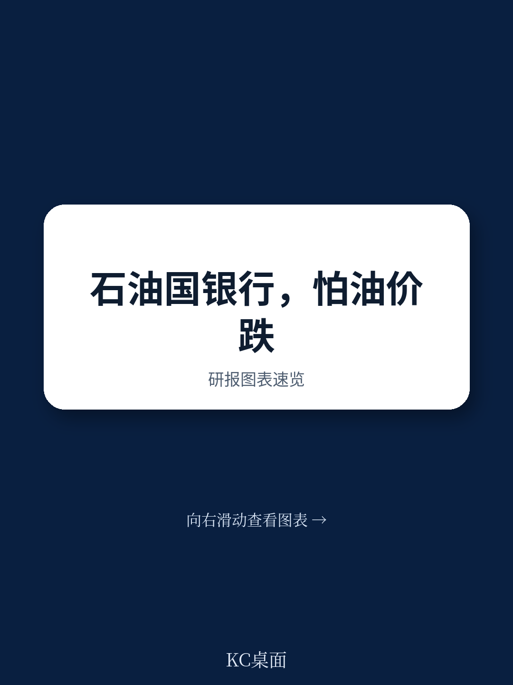
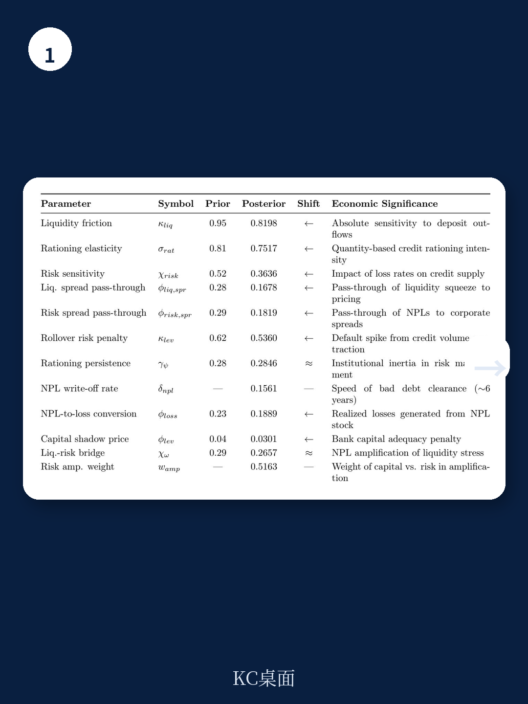
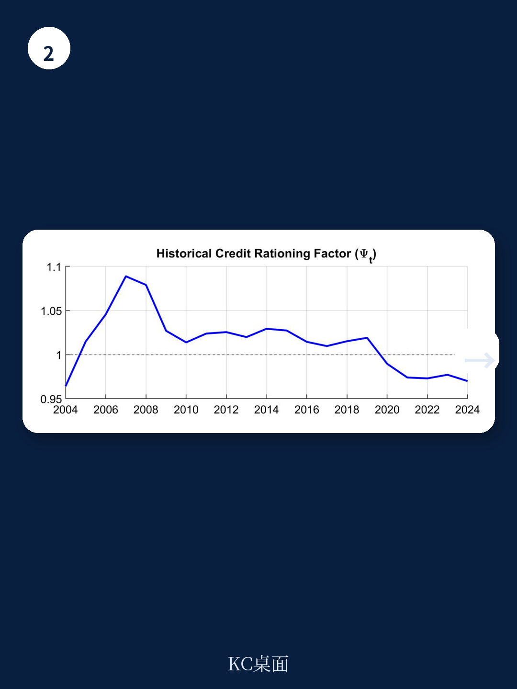

# IMF：石油经济体真正该担心的不是银行破产，而是存款被抽干

石油价格暴跌时，市场习惯性追问银行会不会倒闭。IMF这份以阿曼为案例的最新工作论文给出了一个反直觉的结论：阿曼银行的资本充足率高达17.5%，远高于监管底线，资本缓冲足以吸收典型油价冲击带来的信用损失。真正值得担忧的，是一个被多数人忽略的流动性渠道——当油价下跌，政府同时抽走存款、增发国债，银行体系的可贷资金被双重挤压，私人信贷被系统性挤出，而这与银行自身的资产质量毫无关系。

这份由Yurii Sholomytskyi等人撰写的DSGE模型研究，将阿曼银行业对石油冲击的脆弱性拆解为两个独立渠道：偿债能力渠道，即油价下跌导致企业违约率上升、不良贷款增加；以及流动性渠道，即政府因财政收入骤降而从银行提取存款并发行国债。IMF的定量分解显示，后者才是主导力量——油价冲击解释了非石油GDP波动的54%和信贷波动的53%，而银行资本冲击的贡献不足0.1%。

这意味着，对于阿曼乃至整个海湾地区的石油经济体而言，金融稳定的核心风险不在资产负债表的资产端，而在负债端的政府存款依赖。这是一个完全不同的监管和政策逻辑。

> **KC评论：** 传统银行压力测试主要关注资本充足率和不良贷款率。IMF这份报告暗示，对于石油经济体，压力测试的假设框架需要重写——最危险的情景不是信用风险集中爆发，而是政府同时作为存款人和债券发行人对银行流动性的双向挤压。完整报告中对“流动性缓冲陷阱”的建模，以及主权财富基金在缓冲链条中的角色，值得每一位关注新兴市场金融稳定的读者仔细阅读。

## 1. 银行不缺资本，但缺存款——流动性渠道才是真正的大头

IMF模型最核心的发现是结构性方差分解的结果。在阿曼的经济结构中，油价冲击对非石油GDP波动的贡献率达到54%，对信贷波动的贡献率达到53%。相比之下，银行资本冲击的解释力几乎可以忽略不计——低于0.1%。

这意味着什么？传统上，监管者和投资者关注的是油价下跌是否会导致企业大面积违约、银行不良贷款激增、资本被侵蚀。但数据显示，阿曼银行业在2015年油价暴跌后反而积累了更多资本，资本充足率从15%左右升至17.5%。真正的问题出在负债端：当油价下跌，政府财政收入锐减，它同时做两件事——从银行提取财政存款用于日常支出，并在国内债券市场大量发行国债来弥补赤字。对银行而言，这两个动作的效果是一样的：它们都从银行系统抽走了可贷资金。

IMF将这个机制命名为“双重流动性挤压”。模型通过一个统一的净流动性代理变量来捕捉这一效应，结果清晰地显示：流动性挤压对私人信贷的挤出效应，远远超过信用风险本身对银行资本的影响。

## 2. 政府存款占比超过30%——一个被低估的系统性脆弱点

阿曼银行的负债结构揭示了一个关键事实：超过30%的存款直接来自政府和国有企业。这些存款不是稳定的储蓄，而是“过路资金”——石油收入在进入财政支出之前的暂时停留。

当油价下跌时，这些存款的波动是巨大的。阿曼央行数据证实，政府存款头寸的变化在量级上足以显著影响私人信贷存量。IMF模型进一步揭示了一个悖论：即使在油价上涨的繁荣时期，银行也会出于预防性动机持有超额流动性，以对冲未来油价下跌时政府存款流失的风险。这种“流动性缓冲陷阱”导致银行在繁荣期也压缩对生产部门的信贷投放，形成了结构性信贷抑制。

> **KC评论：** 这一点对于理解海湾国家银行业的真实风险至关重要。如果你只看资本充足率和不良贷款率，阿曼银行看起来相当健康。但如果你看存款结构，这个系统本质上是在用一个高度不稳定的资金来源（政府存款）来支撑信贷投放。完整报告中对“流动性缓冲陷阱”的动态模拟，以及主权财富基金在缓解这一陷阱中的作用，是理解这个问题的关键。

## 3. 信贷分配严重扭曲——个人贷款占比37.5%，中小企业仅2.9%

阿曼的信贷分配结构进一步放大了流动性挤压的负面效应。个人贷款（包括房贷）占全部信贷的37.5%，而中小企业贷款仅占2.9%。同时，央行对个人贷款和房贷设有硬性比例上限，银行实际运作中几乎触及这些上限。

这意味着，当流动性挤压发生时，银行几乎没有调整空间——它们不能减少个人贷款（因为已经接近上限），也不愿意增加中小企业贷款（因为风险高、信息不对称）。唯一的调节变量是减少对企业和制造业的信贷，而这恰恰是经济转型最需要的领域。

IMF模型捕捉到了这一结构性问题：信贷分配的高度偏斜，使得流动性挤压的冲击集中落在生产性部门，而非消费领域。这解释了为什么阿曼的非石油经济对油价冲击的敏感度如此之高——流动性挤压直接抑制了投资和资本形成。

## 4. 伊斯兰金融和Sukuk市场正在改变游戏规则

报告特别提到了一个正在发生的结构性变化：阿曼“2040愿景”推动下的企业金融化，特别是伊斯兰银行和Sukuk（伊斯兰债券）市场的快速发展。

这一变化的意义在于，它正在创造一条脱离政府存款依赖的融资渠道。伊斯兰银行基于风险共担原则运作，其存款基础更多来自私人部门，对政府存款波动的敏感度较低。Sukuk市场则为企业和政府提供了另一种融资工具，减少了对银行信贷的过度依赖。

IMF模型的反事实分析表明，信贷深度和多元化的提升确实能够增强银行体系对油价冲击的韧性。但报告也谨慎指出，这一进程仍处于早期阶段，其稳定性尚未经历完整周期的检验。

> **KC评论：** 伊斯兰金融的快速扩张是海湾国家金融改革中最值得关注的趋势之一。但IMF报告没有完全展开的问题是：伊斯兰银行在流动性管理上是否存在不同于传统银行的脆弱性？Sukuk市场在压力时期能否真正提供流动性，还是会在系统性风险面前同步冻结？这些问题的答案，可能需要读者在完整报告的模型假设和敏感性分析部分寻找线索。

## 5. 模型之外，三个尚未回答的关键问题

IMF这份工作论文在方法论上非常严谨，但作为一项前沿研究，它也留下了几个关键问题没有完全回答。

第一，DSGE模型依赖于小样本的结构估计，识别挑战是内在的。作者坦承，很难将信贷供给侧的“配给效应”与需求侧的“信贷需求萎缩”完全区分开。这意味着，模型对流动性渠道的量化结果可能高估或低估了实际影响——如果油价下跌同时导致企业信贷需求大幅下降，那么流动性挤压的独立效应可能被高估。

第二，主权财富基金（阿曼投资局）的缓解作用取决于其资产配置和变现能力。模型假设SWF能够按规则进行反周期转移，但现实中SWF的资产流动性、政治约束和投资策略都会影响这一机制的有效性。报告没有对不同SWF策略下的缓冲效果进行充分的情景分析。

第三，模型对“流动性缓冲陷阱”的机制分析很有洞察，但缺乏对这一行为是否具有福利成本或政策含义的深入讨论。如果银行在繁荣期主动压缩信贷是为了应对未来的流动性风险，这是否意味着某种形式的“市场失灵”？监管者是否应该通过流动性覆盖率要求或逆周期资本缓冲来干预？

## 沿着未解问题继续深入

IMF这篇工作论文的价值，不仅在于它用结构模型量化了石油经济体银行系统的真实风险来源，更在于它打开了一个新的研究框架：对于资源依赖型经济体，金融稳定的核心不在于资本是否充足，而在于流动性来源是否多元。

但对于实际的投资和决策者而言，真正的挑战在于将这些结构性洞见转化为可操作的观察框架。流动性渠道的量化到底有多敏感于模型假设？伊斯兰金融的扩张能否真正改变这一格局？SWF的反周期能力在极端场景下是否可靠？这些问题的答案，恰恰隐藏在报告正文的模型设定、敏感性分析和附录中。

我们的知识星球社群每日更新国际主流信源的深度解读，汇聚了来自头部券商、PE/VC、投行、并购、hedge fund、资管机构、战略咨询、智库等领域的从业者。如果你对IMF这篇完整报告的模型细节、图表数据以及全球其他石油经济体的比较分析感兴趣，欢迎扫码加入，与我们一同交流这些尚未完全解答的问题，观测全球宏观叙事的边际变化。

Personal reading notes and learning share only. Not investment advice.

