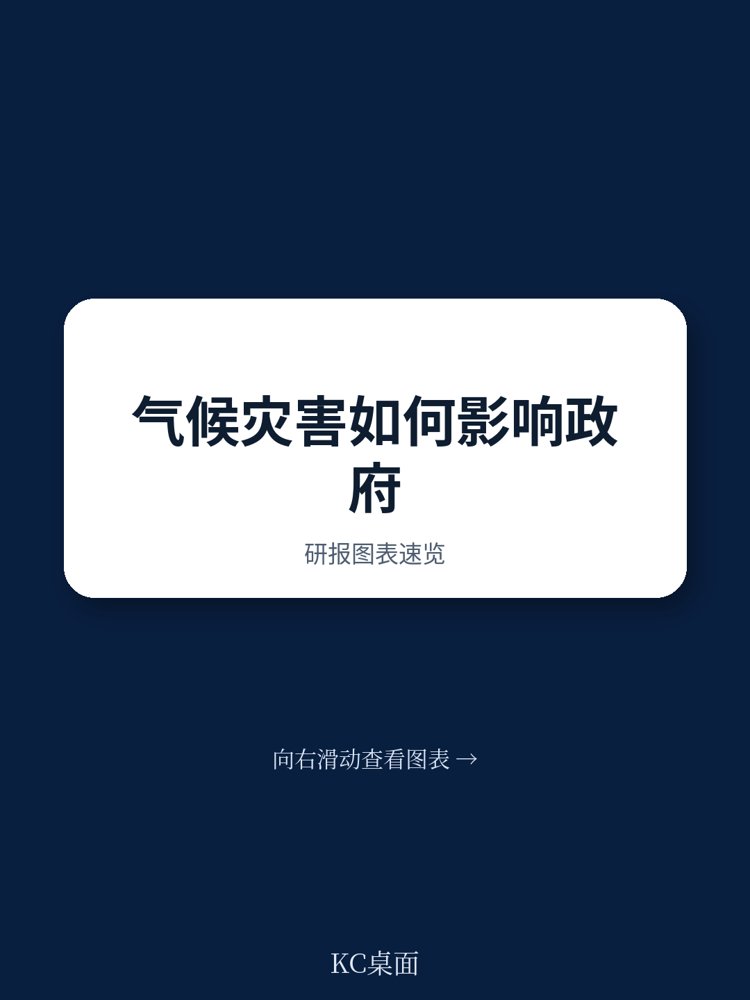
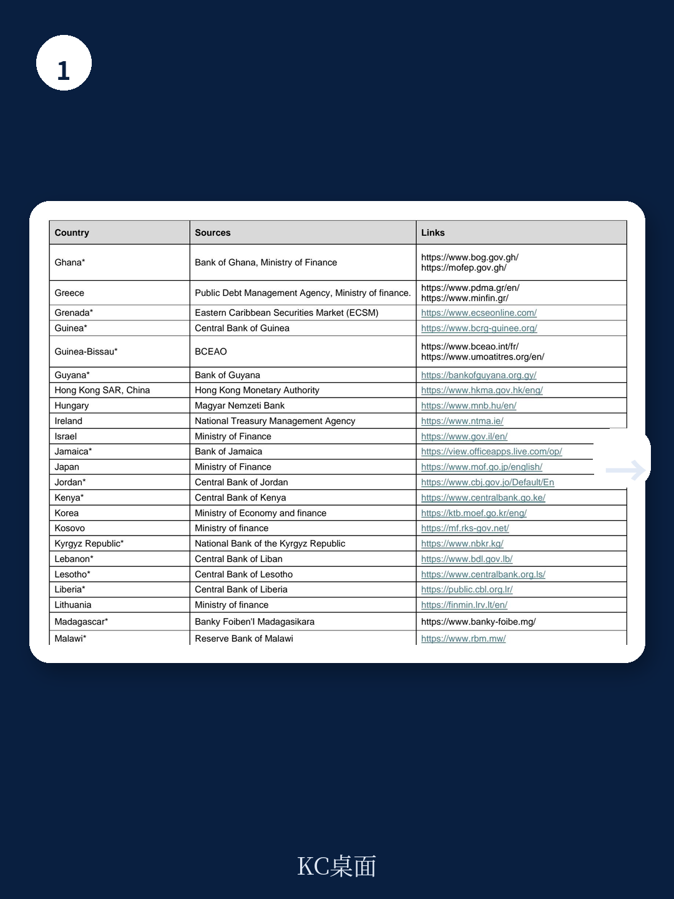

# IMF最新研究：自然灾害正在重塑发展中国家的国债定价

当一场干旱或飓风过后，市场对主权信用的重新定价往往比灾后重建更快。IMF最新工作论文揭示了一个此前被忽视的机制：自然灾害不仅摧毁实体资产，还会直接推高发展中国家的国内国债融资成本，且这种冲击沿着收益率曲线呈现非对称传导——短期利率飙升，长期利率却几乎不受影响。

这份由Kpodar、Drabo和Meyimdjui撰写的研究，基于一个全新的99国国内国债收益率数据库，覆盖2000至2020年间的72个发展中国家。其核心发现值得所有关注新兴市场债务和气候风险的投资者认真审视：气候脆弱性正成为主权信用定价中一个独立的、系统性的风险因子。

## 1. 国内债务市场已成为气候风险传导的“第一现场”

过去二十年，发展中国家的国内公共债务占GDP比重从约22%升至2020年的34%。国内债务占总债务的比例也从世纪初的约30%提升至接近50%。与此同时，国内债务的利率普遍高于外债，这意味着国内利息支出占总利息支出的比例远超其债务占比。

这意味着什么？当自然灾害发生时，政府首先需要融资的场所就是国内债券市场。但恰恰是这一市场，此前几乎没有被系统性地研究过气候风险如何定价。

> **KC评论：** 传统研究聚焦于主权外债利差，但IMF这份报告提醒我们，对发展中国家而言，国内债券市场才是主权信用的“第一定价场所”。外债违约有IMF和双边债权人参与谈判，而国内债务的定价调整是即时、直接且影响更广的。这一点对理解新兴市场债务风险至关重要。

## 2. 灾害冲击只推高短期利率，但气候脆弱性拉平了整个收益率曲线

报告的实证结果呈现出一个清晰且富有洞察力的分化：干旱和风暴等具体灾害事件对国债利率的影响仅限于短期（一年以内）品种。以干旱为例，其对短期利率的推升效应在事件发生后立即显现，并在约两年后逐渐消退。风暴的影响路径类似，但幅度和持续性略有不同。

然而，当研究者将目光从“灾害事件”转向“气候脆弱性”——即一国长期暴露于气候风险且适应能力不足的结构性特征时，结论发生了根本性变化。气候脆弱性指数每上升一个单位，短期、中期（2-3年）和长期（4年以上）国债收益率均出现显著上升，整个收益率曲线被系统性上移。

这一发现的经济学含义非常深刻：市场对单次灾害的定价是“流动性冲击”式的，预期短期内财政压力和货币政策调整会推高短期利率，但长期基本面预期并未根本改变。而对气候脆弱性的定价则是“信用溢价”式的，投资者要求对所有期限的国债都给予更高的风险补偿。

## 3. 两条传导路径：财政压力与货币政策

报告进一步拆解了从灾害到利率的传导机制，识别出两条核心路径。

第一条是财政压力渠道。自然灾害导致税收减少、支出增加（特别是灾后重建），公共债务水平上升。实证结果显示，控制公共债务水平后，灾害对利率的冲击幅度显著下降，说明财政恶化是推高利率的重要中间变量。

第二条是货币政策渠道。灾害可能引发通胀压力或汇率贬值预期，促使央行提高政策利率。数据显示，货币政策利率的变动解释了灾害冲击后短期利率上升的相当一部分。这解释了为什么冲击主要影响短端——货币政策直接作用于短期利率。

> **KC评论：** 这两条传导路径实际上揭示了发展中国家的两难困境。灾害发生后，政府需要更多财政空间来应对，但恰恰是这种需求推高了融资成本。而央行如果为了抑制通胀而加息，又会进一步加重政府的利息负担。报告没有明说但隐含的判断是：气候脆弱性越高，这种“财政-货币负反馈循环”就越容易触发。

## 4. 金融深度是唯一的“减震器”，但作用有限

报告发现，在气候脆弱性对利率的影响中，金融深度（以私人部门信贷占GDP比重衡量）是唯一被证实具有缓解作用的变量。具体而言，在长期国债（4年以上）的回归中，气候脆弱性与金融深度的交互项显著为负，表明金融体系越发达的国家，气候脆弱性对长期利率的推升效应越弱。

这一结果的逻辑是：更深的金融市场意味着更广泛的投资者基础、更强的风险分散能力和更有效的定价机制。当市场参与者能够更好地评估和分散气候风险时，主权信用溢价中的“气候成分”会相应降低。

但需要注意的是，这一缓解效应仅在长期国债中显著，对短期和中期品种并不明显。而且，即使在长期国债中，金融深度也只是部分抵消而非完全消除气候脆弱性的影响。对于大多数发展中国家而言，金融深度的提升是一个漫长的过程，远不能解决当前的燃眉之急。

## 5. 报告尚未完全回答的关键问题：气候适应投资的融资悖论

这份报告的一个隐含但未被充分展开的议题是：气候适应投资本身需要大量资金，而这些资金很大一部分需要通过国内债券市场筹集。那么，当气候脆弱性推高了融资成本时，政府是否陷入了一个“气候投资悖论”——越需要投资适应气候变化的政府，其融资成本越高，越难以负担这些投资？

报告提及，气候减缓和适应政策虽然在长期有助于增强韧性、限制利率上升，但在短期内往往需要更高的政府支出，从而对国内融资成本形成上行压力。这一“短期成本-长期收益”的权衡，对于财政空间本就有限的发展中国家而言尤为棘手。

> **KC评论：** 这正是这份报告最值得追问的地方。如果气候脆弱性本身就是一个独立的利率推升因素，那么发展中国家通过发债融资来进行气候适应，实际上是在用更高的利率去降低未来的利率。这个跨期替代是否划算，取决于利率弹性、投资回报率和时间贴现率。报告没有给出完整的成本收益分析，但这恰恰是读者需要进一步阅读和讨论的方向。

## 6. 对投资者的观察框架：从“灾害冲击”到“气候脆弱性溢价”

基于这份报告的发现，我们可以提炼出一个实用的分析框架。评估一个发展中国家国内债券的风险时，不能只看有没有发生灾害，而要看其气候脆弱性的结构性水平。

具体而言，投资者应关注三个维度：一是该国的气候脆弱性指数及其变化趋势，这决定了整个收益率曲线的基准溢价水平；二是该国的财政空间和债务可持续性，这决定了灾害冲击后利率上行的幅度和持续性；三是央行的货币政策框架和通胀预期管理能力，这决定了短期利率对灾害冲击的敏感度。

对于主权信用分析师而言，将气候脆弱性纳入传统的债务可持续性分析（DSA）框架，已经不再是可选项，而是必选项。IMF这份报告提供了实证基础和工具支持，但如何将其转化为具体的评级调整和定价模型，仍需市场参与者的进一步探索。

---

这份IMF工作论文的价值不仅在于其发现本身，更在于它打开了一个新的研究议程。国内债券市场的气候风险定价、财政-货币政策的负反馈机制、气候投资的融资悖论——这些问题都值得更深入的探讨。完整报告包含了详细的实证图表、稳健性检验结果以及按国家组别和期限结构的细分数据，这些是本文无法一一展开的。

如果你希望获得完整研报解读和原始图表，欢迎加入我们的社群，与来自头部券商、PE/VC、投行、hedge fund、资管机构、战略咨询、智库的朋友们一起，持续追踪国际主流叙事与边际变化，每日更新汇总全球关键数据与图表。

Personal reading notes and learning share only. Not investment advice.

