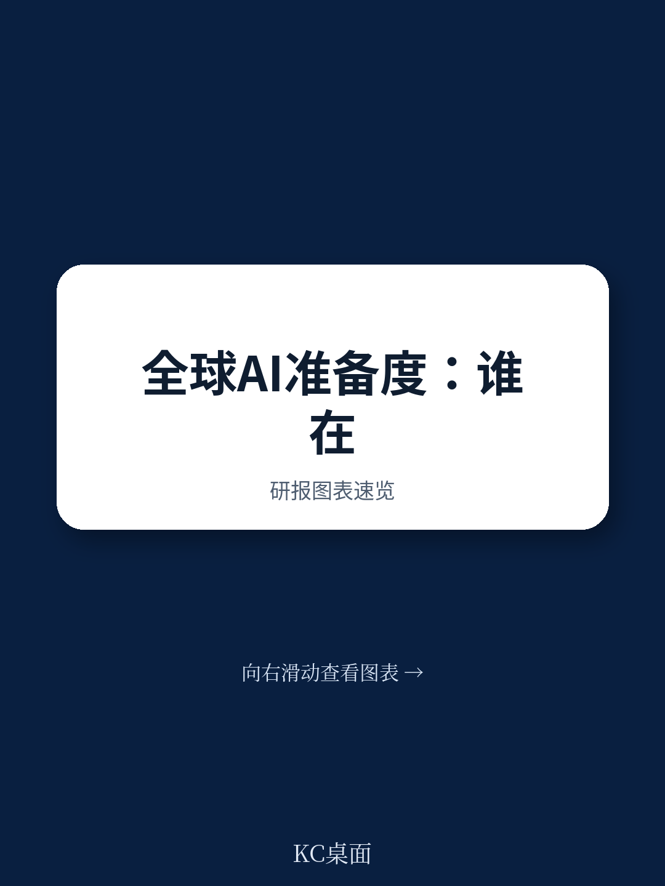
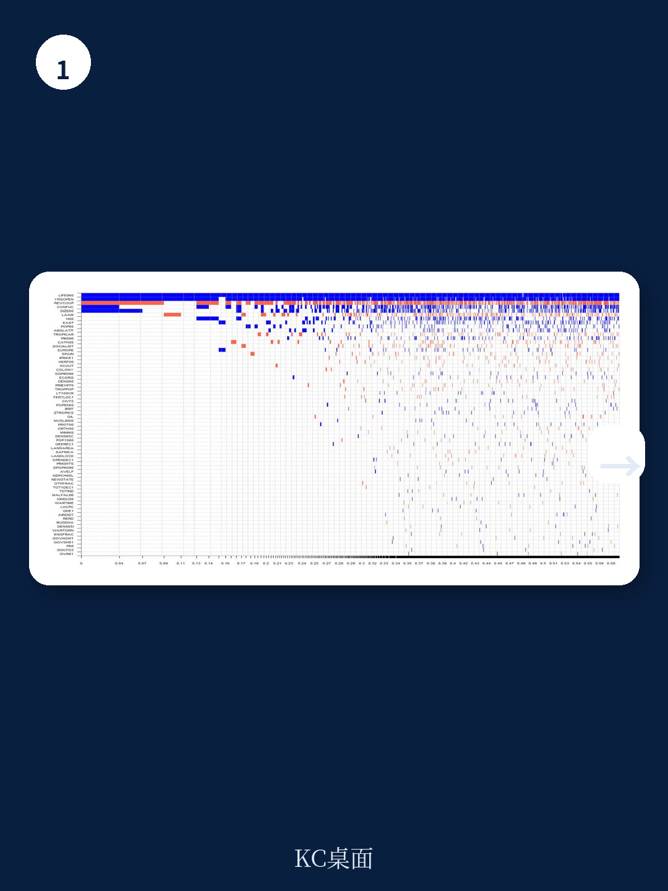
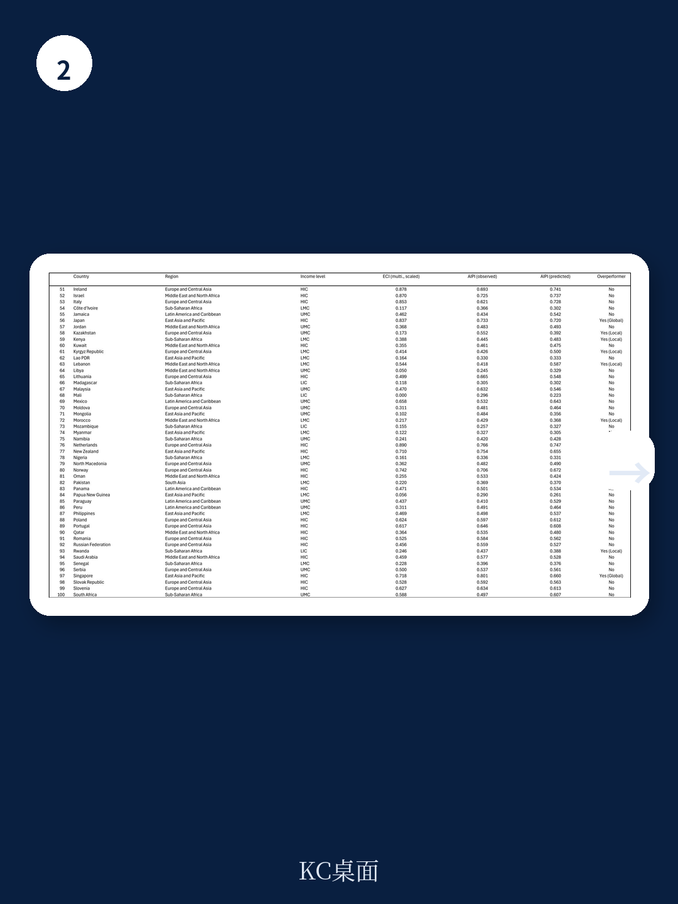

# 世界银行：AI准备度差距的真正分界线，不是算力，而是经济复杂度

当全球目光聚焦在芯片算力、大模型参数和资本开支竞赛时，一个更根本的结构性鸿沟正在被低估。世界银行最新工作论文《Beyond the AI Divide》给出了一个反直觉的结论：决定一个国家能否跨越AI鸿沟的核心变量，并非其拥有的GPU数量或AI初创公司估值，而是其经济复杂度——即经济体生产多样化、高附加值产品与服务的能力。这份基于IMF 2023年AI准备度指数（AIPI）的实证研究，通过对比174个国家的实际AI准备度与基于其经济复杂度的预测值，系统识别出全球和区域层面的“AI超预期者”。这些超预期者并非AI领域的全球领导者，而是那些在经济复杂度给定的条件下，AI准备度显著高于预期的经济体。这一发现为产业决策者提供了一个全新的观察框架：AI竞争的本质，是经济体知识密度的竞争。

## 1. 经济复杂度解释了约75%的AI准备度差异，这远超算力或资本投入的单独解释力

报告的核心实证发现是，在125个样本国家中，经济复杂度指数（ECI）与AI准备度指数（AIPI）之间的相关性高达0.89（未加权），R方达到0.79。这意味着，仅凭一个国家的经济复杂度，就能解释其AI准备度近八成的差异。这一数字远高于任何单一要素——如互联网渗透率、研发支出或STEM教育投入——对AI准备度的单独解释力。

世界银行经济学家Pierre Mandon采用贝叶斯模型平均法（BMA），从67个历史、政治和经济指标中筛选出AI准备度的最稳健预测因子。结果清晰显示：1960年的初始条件——包括预期寿命、高等教育水平和经济规模——以及儒家文化传统和东亚区域虚拟变量，均与AIPI显著正相关。相反，政治不稳定性（以革命和军事政变频率衡量）则呈现显著负相关。

> **KC评论：** 这意味着AI准备度不是短期政策能逆转的。那些1960年代就已奠定人力资本和制度基础的经济体，今天在AI时代的先发优势仍在持续累积。报告没有展开的是，这种初始条件的“锁定效应”在多大程度上可以被突破性政策打破——这恰恰是各国决策者最关心的问题，也是完整报告值得深读的关键。

## 2. 全球AI超预期者集中在北欧、东亚和大洋洲，但名单里没有美国、英国和德国

报告通过两阶段筛选法识别AI超预期者：首先，国家AIPI得分必须高于其所在收入组的加权中位数和均值；其次，实际AIPI得分必须超过基于其经济复杂度的预测值。最终确定的全球超预期者包括：澳大利亚、日本、荷兰、新西兰、三个亚洲四小龙（香港、新加坡、韩国），以及丹麦、芬兰、挪威等北欧国家。

这份名单的意外之处在于，美国、英国、德国、瑞士、瑞典等传统科技强国均未被列为全球超预期者。原因在于，这些国家的经济复杂度极高，其AI准备度预测值相应也高，实际表现并未显著超出预期。换言之，它们属于“达标但不超预期”的类别。而新加坡、韩国等经济体，以相对较低的经济复杂度实现了接近甚至超过发达经济体的AI准备度，这才是真正的“超预期”。

> **KC评论：** 这一方法论框架极具启发。它揭示了一个常被忽视的视角：AI准备度的评价不应仅看绝对得分，而应考虑“单位经济复杂度下的AI效率”。新加坡在ECI低于瑞典的情况下，AIPI达到0.801，高于瑞典的0.748。这一对比对中国的启示尤为直接——中国的ECI为0.493（中等偏上），但AIPI达到0.606，被列为中等偏上收入组的区域超预期者。这背后的驱动因素是什么？报告给出了初步答案，但更细致的政策拆解和国别案例，正是完整报告的核心价值所在。

## 3. 监管与伦理框架是贯穿所有收入组的首要驱动因子，但数字基础设施在高收入组才成为关键

报告对AI超预期者的驱动因素进行了收入组别分解，结果呈现出清晰的梯度结构。在低收入和中等偏低收入国家，监管与伦理框架以及劳动力市场发展是最主要的驱动因素，反映了资源约束下的基础性优先事项。到了中等偏上收入国家，监管和人力资本仍然关键，但数字基础设施的重要性显著上升。而在高收入国家，监管与伦理、数字基础设施和创新系统三者并重，且均处于高水平。

这一发现的政策含义在于：不同发展阶段的国家不应盲目复制高收入国家的AI战略。对于中国、马来西亚、哈萨克斯坦等中等偏上收入国家，当前阶段的AI准备度提升，应优先聚焦于数字基础设施的补强和监管框架的完善，而非过早追求前沿创新。报告特别指出，AI监管和伦理在所有收入组中均稳定地成为AI准备度的首要驱动因素——这强化了“制度先行”的论断。

## 4. 报告尚未完全回答的关键问题：AI超预期者的成功能否被系统复制？

尽管报告通过国别案例——包括新加坡、北欧、马来西亚、哈萨克斯坦、加纳、卢旺达以及中国和印度——展示了资源有限国家如何通过战略投资和协调政策实现AI准备度的超预期表现，但其方法论存在一个尚未解决的逻辑缺口：经济复杂度与AI准备度之间的高相关性，究竟是因果关系还是相关性？如果是前者，那么政策干预可以提升经济复杂度，进而提升AI准备度；如果是后者，那么AI准备度的提升可能更多受制于初始条件，政策空间有限。

报告承认，BMA分析显示1960年的初始条件对当前AI准备度具有显著预测力，但并未提供因果识别策略来区分“历史遗产”与“政策干预”的各自贡献。这意味着，对于政治不稳定或初始人力资本薄弱的国家，AI超预期者的经验可能难以直接复制。这一未解问题，恰恰是读者需要阅读完整报告以获取更深入方法论讨论的伏笔。

## 5. 对产业决策者的观察框架：从“AI准备度得分”转向“AI效率系数”

基于该报告的框架，产业决策者可以构建一个更精细的观察工具：将每个国家的AIPI得分除以ECI得分，得到“AI效率系数”。这一系数衡量的是经济体将自身知识基础转化为AI准备度的效率。新加坡的AI效率系数约为1.21（0.801/0.660），远高于美国的0.96（0.771/0.803）和英国的0.92（0.731/0.792）。这意味着，新加坡在单位经济复杂度下产生的AI准备度，比美国高出约26%。

对于跨国企业而言，这一框架意味着：在评估海外市场或研发中心选址时，不应仅关注AI绝对得分，而应计算AI效率系数。高系数国家意味着政策环境和制度质量在有效放大经济基础的作用，这些市场可能更适合作为AI试点和落地的优先区域。对于中国而言，作为中等偏上收入组的区域超预期者，其AI效率系数为1.23（0.606/0.493），这一数字值得持续跟踪——它既是政策成效的体现，也意味着进一步提升的空间可能更多来自经济复杂度的提升，而非政策面的边际改善。

---

这份世界银行报告提供了一个克制但有力的分析框架，它没有给出简单的“成功配方”，而是提醒我们：AI准备度的竞争，本质上是一场关于经济体知识密度的马拉松。那些在1960年代就开始积累人力资本和制度基础的经济体，今天仍在累积优势。但报告也留下了值得追问的问题：新加坡和韩国如何在相对短的时间内实现了AI准备度的跃升？中国作为人口和经济体量巨大的特例，其AI超预期的核心驱动因素是什么？这些追问，恰恰是完整报告最有价值的部分——它提供了国别案例的详细政策拆解和原始数据图表，而这些，无法在摘要中穷尽。

如果你希望获取完整报告解读、原始数据图表以及更多国际信源的AI政策汇编，欢迎扫码加入我们的社群。这里汇聚了头部券商、PE/VC、投行、并购、hedge fund、资管机构、战略咨询和智库的朋友，每日更新，汇总国际主流叙事、数据和图表，观测边际变化。期待与你交流。

Personal reading notes and learning share only. Not investment advice.

