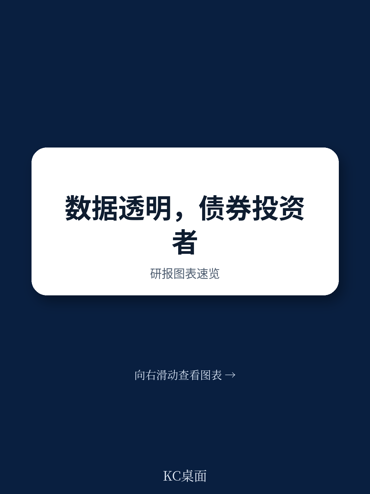
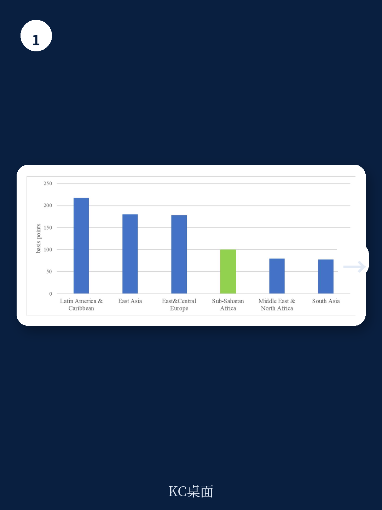
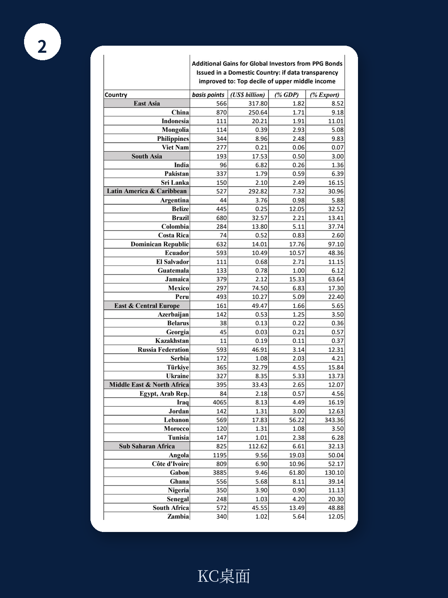

# 世界银行：数据透明是主权债投资者的隐藏回报来源

全球投资者在配置新兴市场主权债券时，通常把注意力集中在信用评级、外债水平、政治风险和全球流动性环境上。但世界银行最新发布的一篇政策研究论文提出了一个被严重低估的变量：数据透明度。

这份由经济学家 Megumi Kubota 撰写的工作论文，首次从债权人（投资者）而非债务人（借款国）的视角，系统检验了数据透明度与主权债券回报之间的关系。结论简洁但有力：在制度质量达到一定门槛的国家，数据透明度的提升可以直接转化为更高的主权债券回报。更关键的是，即使一个国家已经处于高负债状态，增强数据透明度仍然可以部分抵消债务对债券回报的负面拖累。

这不是一个关于“做好事有好报”的道德叙事。这是一份关于主权债券定价中一个被忽略的套利因子的实证分析。对于正在重新评估新兴市场敞口的机构投资者而言，这份报告提供了一个可量化的新观察维度。

## 1. 数据透明度对主权债回报的影响存在明确的制度质量门槛

论文使用固定效应工具变量法（FE-IV），对 76 个国家 1995 年至 2020 年的面板数据进行了回归分析。核心发现是：数据透明度对主权债券回报的正向影响，并非在所有国家都成立。只有当一国的制度质量（以 ICRG 指数衡量）超过一个特定阈值时，透明度改善才能带来债券回报的提升。

这个阈值是多少？论文估计出的 ICRG 指数（取对数后）门槛值稳定在 4.15 左右。换算成原始分数，大约是 63.66 分（满分 100）。这意味着，对于制度质量处于中低水平的国家，单纯提高数据透明度可能无法让投资者直接受益。

> **KC评论：** 这个门槛的存在，解释了为什么很多新兴市场国家即使加入了 IMF 的数据公布标准（SDDS），也没有立刻吸引更多资本流入。投资者真正在乎的不是数据是否“被公布”，而是数据背后的制度环境是否让这些数据可信、可比、可预测。完整报告中的图 1a 到 1d 直观展示了不同透明度维度（总体、方法论、时效性、数据来源）对债券回报的边际影响，值得仔细对比。

## 2. 高负债国家的“透明度溢价”反而更高

论文另一个反直觉的发现是：数据透明度的正向效应，在高负债国家中表现得更为显著。具体而言，当一国的公共债务或外部债务水平较高时，改善数据透明度对主权债券回报的提振作用更大。

从经济学直觉来看，这并不难理解。高负债国家的投资者天然对违约风险更敏感，任何能降低信息不对称的措施——更及时、更准确、更全面的经济数据——都会显著降低投资者的不确定性溢价。换句话说，透明度在风险较高的环境中，其“价值”被放大了。

论文的表 7 提供了一个极其具体的量化结果：如果某个国家将其数据透明度提升到中高收入国家的最高十分位水平，全球投资者能从该国的主权债券中获得多少额外回报？以中国为例，这一改善可以带来 870 个基点的额外回报，对应约 2506 亿美元的价值提升。对于巴西，这个数字是 680 个基点，对应 3257 亿美元。对于俄罗斯，是 593 个基点，对应 4691 亿美元。

> **KC评论：** 这些数字看起来很大，但必须注意前提：这是假设透明度一次性提升到最高水平时的静态估算，且依赖于模型中的特定系数。但即便如此，它提供了一个清晰的框架：投资者在评估高负债新兴市场时，应该把“数据透明度改善的潜力”作为一个独立的 alpha 来源来量化。完整报告的图 2 进一步按区域展示了不同债务水平下透明度改善的边际效应，可以帮助读者校准不同国家的预期。

## 3. 信用评级和外汇储备是重要的调节变量，但报告没有完全回答它们的交互机制

论文在解释变量中引入了标普主权信用评级和总外汇储备。结果显示，信用评级是投资者决策的有用信号，外汇储备也显著影响债券回报。但这里有一个尚未被充分展开的问题：信用评级本身是否已经反映了数据透明度？如果两者高度相关，那么透明度对债券回报的独立解释力有多大？

论文使用了工具变量法来控制内生性，这在一定程度上解决了透明度与债券回报之间的反向因果问题（即高回报国家可能更有动力提高透明度）。但信用评级与透明度之间的共线性问题，论文没有给出详细的诊断结果。对于试图将透明度作为一个独立因子纳入投资模型的读者来说，这仍然是一个需要自行评估的灰色地带。

## 4. 透明度改善的“共享激励”机制可能改变主权债务市场的博弈结构

论文最值得延伸思考的，是它提出的“共享激励”概念。过去的研究几乎全部集中在透明度如何降低借款国的融资成本（即缩小主权利差）。但 Kubota 的研究表明，透明度改善同样让债权人受益——通过提高债券回报。这意味着，投资者有直接的财务动机去推动借款国提高数据质量。

这一逻辑链条如果成立，将改变主权债务市场中的激励机制。传统上，要求借款国提高透明度的主要是多边机构和债权人委员会，其动机是风险管理和道德风险控制。但如果透明度提升能直接提高债券的二级市场回报，那么资产管理公司、养老基金和对冲基金就有了更直接的商业理由去参与这一议程。这可能会催生一种新的“积极所有权”策略：投资者不再只是被动接受披露，而是主动推动披露。

## 5. 报告未完全回答的关键问题：透明度改善的边际成本与政治可行性

尽管论文提供了透明度的回报估算，但它没有讨论一个更实际的问题：提高透明度需要付出什么成本？对于制度质量较低的国家，改善数据基础设施、改革统计体系、接受 IMF 的 SDDS 标准，都需要政治意愿和财政资源。如果这些成本超过了预期收益，借款国可能缺乏改善的动力。

更重要的是，透明度的改善往往与政治周期相关。一些国家在危机时期会暂时提高透明度以吸引资金，但危机过后又可能恢复模糊。论文的数据跨度截至 2020 年，无法捕捉到 2021 年之后全球通胀周期和地缘政治冲突对主权债券市场的新冲击。这些新的宏观变量是否改变了透明度与债券回报之间的基础关系？这需要后续研究来验证。

对于读者而言，这篇报告提供了一个可操作的分析框架，但不是一个可以直接套用的交易策略。真正的价值在于：它让你意识到，在评估主权债券时，你忽略了一个可以量化的变量。而如何将这个变量嵌入到你的投资决策中，取决于你对具体国家制度质量的判断，以及对透明度改善可能性的前瞻性评估。

---

这些未解问题——信用评级与透明度的共线性如何拆解、透明度改善的政治成本与可行性、后疫情时代的新宏观变量是否改变了基础关系——正是完整报告中的图表和回归细节可以帮助你进一步推演的部分。我们的社群每日汇总国际主流机构的研报与数据，涵盖头部投行、PE/VC、对冲基金和战略咨询机构的最新分析，并配有原始图表和数据源。如果你希望获取这篇世界银行报告的完整解读、原始表格以及更多关于主权债定价框架的讨论，欢迎扫码加入，与来自头部券商、资管机构和智库的朋友一起交流。

Personal reading notes and learning share only. Not investment advice.

