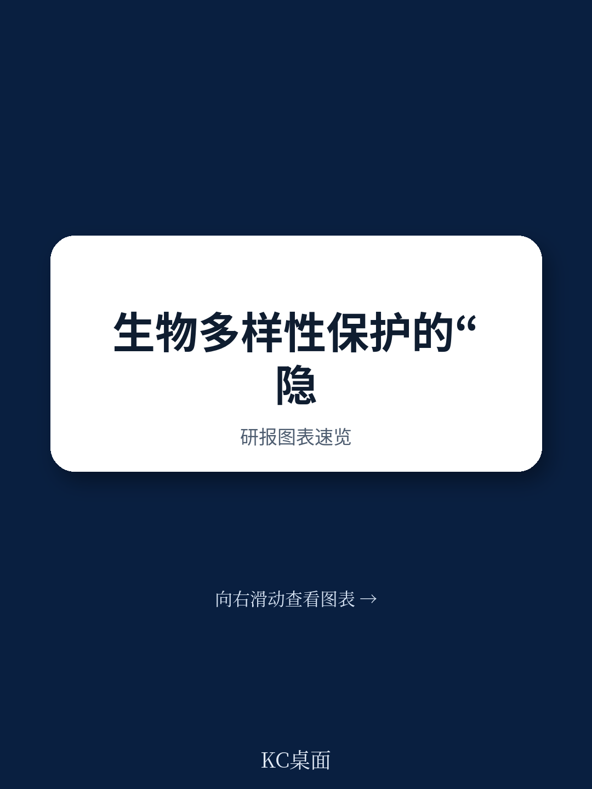
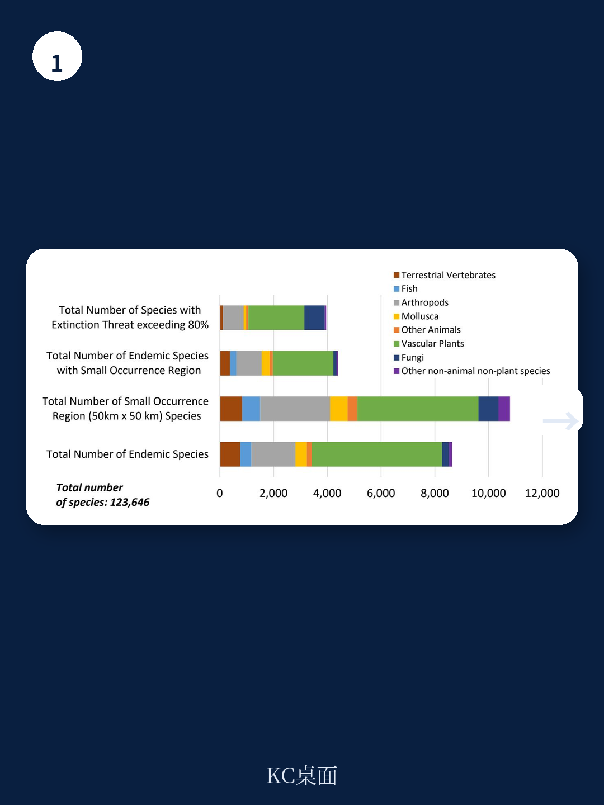
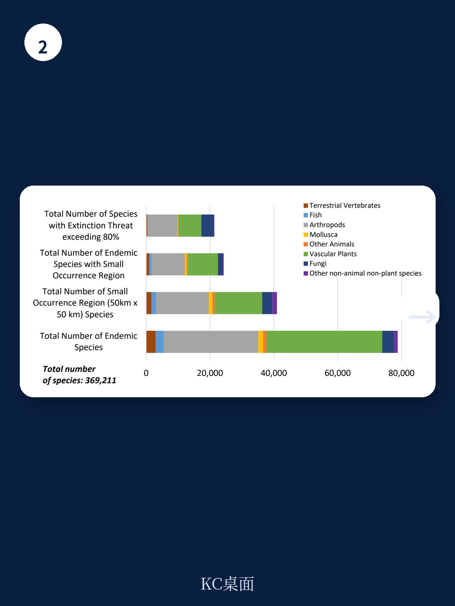

# 世界银行：冲突地带才是生物多样性最被低估的“沉默金库”

当全球目光聚焦于亚马逊雨林和珊瑚礁的生态危机时，世界银行一份2025年初发布的工作论文揭示了一个更棘手但也更具战略意义的盲区：那些被战争撕裂、主权悬而未决、治理几乎真空的地带，恰恰是大量濒危物种的最后庇护所。这个结论本身并不令人意外——人类活动的减少客观上为野生动物创造了喘息空间。但真正值得决策者关注的，是报告提供了一套可操作的数据框架，使得在这些“法外之地”开展基于证据的保育合作成为可能。这不再是一个纯粹的生态议题，而是一个被忽视的地缘政治与可持续发展的交叉点。

这份由世界银行研究团队基于全球生物多样性信息设施(GBIF)逾59万种物种记录生成的研究，系统绘制了35个非定法律地位领土、19个受冲突影响国家、20个脆弱国家、18个海洋联合管辖区以及311个国际河流流域的物种丰富度、特有性和灭绝风险。其核心判断是：在这些治理薄弱区域，生物多样性保护不应被视为冲突解决后的“副产品”，而应被用作建立信任、促成对话的“入场券”。

## 1. 治理真空区不是生态荒漠，而是被低估的物种库

报告最直接的贡献，是用数据证明了一个长期被直觉感知但缺乏量化的现象：全球最不稳定的政治地理单元，恰恰承载着不成比例的生物多样性负担。这并非因为冲突本身有益于生态，而是因为这些区域往往地形复杂、人类开发密度低，客观上保留了相对完整的栖息地。更重要的是，这些区域中许多物种的分布范围极其狭窄——即所谓的“特有物种”——这意味着一旦栖息地被破坏，物种灭绝几乎是不可逆的。

世界银行的数据显示，在这些治理薄弱区域，不仅物种数量可观，而且许多物种面临极高的灭绝风险。以非定法律地位领土为例，这些区域的主权归属存在争议，导致没有任何一方有动力或能力实施长期保育规划。报告虽然没有直接点名，但读者可以轻易联想到诸如克什米尔、西撒哈拉、巴勒斯坦领土等区域。在这些地方，环境数据的缺失本身就是一种政治选择——没有数据，就没有责任；没有责任，就没有行动。

> **KC评论：** 世界银行的这份报告实际上在说：如果你只看亚马逊或刚果盆地，你只看到了问题的一半。另一半藏在那些地图上颜色模糊、主权标注带星号的区域。这些地方的数据缺口，恰恰是保育行动的最大障碍——因为没有基线数据，你甚至无法衡量保护工作的成效。完整报告中包含了这些区域详细的物种清单和分布热力图，是理解全球保育格局的关键拼图。

## 2. 跨境河流流域是“合作实验场”，但数据不对称正在破坏所有努力

如果说主权争议区域是一个“零和博弈”的困境，那么国际河流流域则是一个典型的“囚徒困境”。报告覆盖了311个国际河流流域，这些流域的上下游国家在水资源分配、污染控制和生态保护上存在天然的利益冲突。尼罗河、湄公河、印度河等流域的争端，早已超越了单纯的水资源问题，演变为区域权力博弈的工具。

世界银行的数据揭示了一个关键瓶颈：当各方无法就基础数据达成一致时，任何合作框架都建立在流沙之上。上游国家可能低估其开发活动对下游生态的影响，下游国家可能高估其生态需求以争取更多配额。报告强调，GBIF提供的开放、时间戳记的物种分布数据，可以作为一个中立、可验证的第三方参考系，打破“各说各话”的僵局。

这一点对于中国读者尤其具有现实意义。中国作为众多国际河流的上游国家（如澜沧江-湄公河、雅鲁藏布江-布拉马普特拉河），在跨境水资源管理上面临着复杂的平衡：既要满足国内能源和灌溉需求，又要回应下游国家日益增长的生态关切。世界银行的这份研究提供了一种可能性：用物种分布数据作为“共同语言”，或许比单纯的水量分配谈判更易达成共识。

> **KC评论：** 跨境水资源的博弈往往陷入“你多我就少”的零和思维。但生物多样性是一个“正和”议题——保护了上游的鱼类栖息地，下游的渔业也受益。世界银行的数据提供了一个客观的“锚点”，让各方能够围绕共同关心的物种分布展开讨论，而不是在政治口号上打转。完整报告中对尼罗河、湄公河等关键流域的物种分布图，是理解这一思路如何落地的关键。

## 3. 海洋联合管辖区：被忽视的“蓝色公地”正在面临沉默的崩溃

报告对18个海洋联合管辖区的分析，可能是最容易被忽视但潜在影响最大的部分。这些区域通常位于大陆架边缘、争议海域或公海与专属经济区的过渡带，其法律地位不明确，导致渔业监管、污染防治和海洋保护区建设几乎停滞。

世界银行的数据显示，这些海域的物种丰富度并不低，且包含了大量具有商业价值和生态关键性的物种。然而，由于缺乏统一的监测体系和执法能力，过度捕捞、海底拖网和污染正在造成不可逆的损害。更令人担忧的是，这些区域往往是海洋哺乳动物和迁徙鱼类的关键通道，其生态功能无法被任何单一国家的保护区所替代。

报告虽然没有直接提出政策建议，但其隐含的逻辑清晰：在这些“蓝色公地”上，单边行动是无效的，而多边合作又缺乏数据基础。GBIF提供的物种分布地图，至少让各方知道“我们在保护什么”，这是迈向“如何保护”的第一步。

> **KC评论：** 海洋保护区的概念听起来很美好，但如果你不知道保护区的边界在哪里、里面有什么物种、这些物种的迁徙路线是什么，那这个保护区就只是一个纸面上的方框。世界银行的这份研究，恰恰填补了这些“数据空白”。对于关注海洋经济和蓝色金融的读者，完整报告中关于海洋联合管辖区的物种分布和灭绝风险分析，是评估相关投资环境风险的重要参考。

## 4. 报告尚未完全回答的关键问题：数据有了，谁来执行？

世界银行的研究团队在方法论上做得极为扎实——他们利用机器学习算法处理了海量GBIF数据，生成了覆盖59万种物种的分布图，并通过与专家验证地图的比对验证了准确性。但报告也坦承，数据本身并不能解决治理问题。

这引出了一个更深层的追问：即使有了可靠的数据，在那些连基本安全都无法保障的冲突地带，谁来实施保育措施？报告提到了“信任建设”和“合作对话”，但并未详细说明如何从数据共享过渡到实地行动。例如，在叙利亚或也门这样的全面冲突地区，即使国际组织拿到了物种分布图，也无法派遣实地考察队，更不用说建立保护区。

世界银行自身也承认，其研究受到GBIF数据时空分布不均的限制。许多冲突区域的物种记录稀疏，部分是因为战乱导致数据收集中断，部分是因为这些区域本身生物多样性就较低。这意味着，报告提供的基线数据虽然优于此前的任何公开数据集，但仍存在显著的“数据暗区”。

另一个未解的问题是：这些数据如何转化为可操作的金融工具？生物多样性信贷、碳信用和自然资本核算正在成为全球环境金融的热点，但其前提是可测量、可报告、可核查的数据。世界银行的数据集能否支撑这些金融产品的设计，报告并未展开讨论。

## 5. 决策者应该建立的观察框架：从“物种清单”到“合作路线图”

对于产业决策者和政策制定者，这份报告提供的不仅是一份物种清单，更是一种思维框架。它建议读者从三个维度重新审视“冲突地带与生物多样性”的关系：

第一，将生物多样性视为“合作催化剂”而非“附加议题”。在跨境谈判中，生态议题往往被排在安全、贸易和水资源之后。但世界银行的数据表明，物种分布是一个相对中立、技术性强的切入点，比直接讨论政治争议更容易达成初步共识。

第二，关注“数据主权”问题。在治理薄弱区域，谁掌握了数据，谁就掌握了话语权。GBIF的开放数据模式虽然降低了门槛，但也意味着数据质量依赖于各地合作机构的参与度。对于中国而言，推动“一带一路”沿线国家的生物多样性数据共享，既是软实力的体现，也是降低海外投资环境风险的实际举措。

第三，警惕“保育殖民主义”的陷阱。外部力量以保护生物多样性为名介入冲突区域，可能引发新的主权争议。报告虽然强调“合作”，但未深入讨论如何确保保育行动不被大国政治所绑架。这是任何决策者在引用这份研究时都必须保持的清醒。

世界银行的这份工作论文，本质上是一次“数据基础设施”的建设。它没有给出万能的解决方案，但它给出了一个可靠的起点。对于真正关心全球生态治理和地缘政治交叉领域的读者，完整报告中的物种分布热力图、区域对比表以及方法论细节，是理解这一议题不可或缺的基石。

这些数据背后，是一个被战争、贫困和治理失败所遮蔽的生态世界。而世界银行的研究告诉我们：要拯救这个世界，第一步不是派兵，不是拨款，而是——知道那里有什么。

---

**更多国际信源汇编与评论，欢迎扫码交流。每日更新，汇总国际主流叙事、数据与图表，观测边际变化。社群汇聚了头部券商、PE/VC、投行、并购、hedge fund、资管机构、战略咨询、智库等朋友，期待与你交流。**

Personal reading notes and learning share only. Not investment advice.

