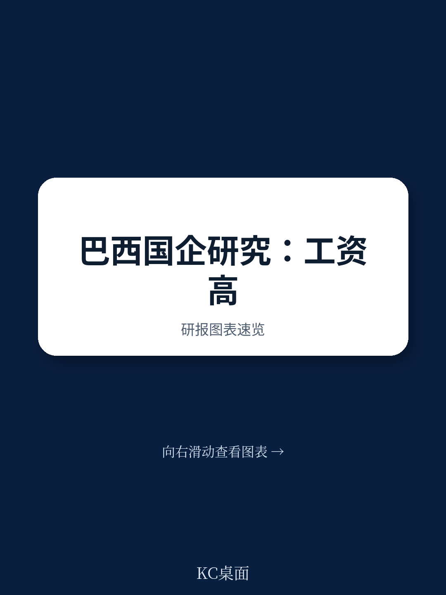
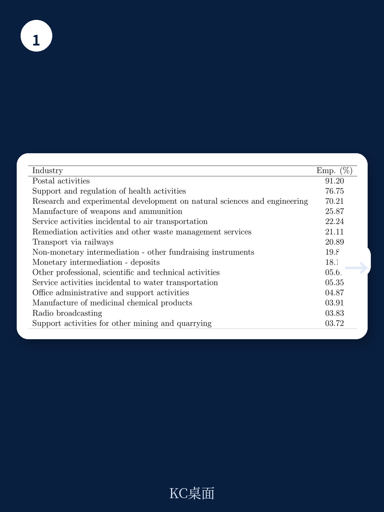
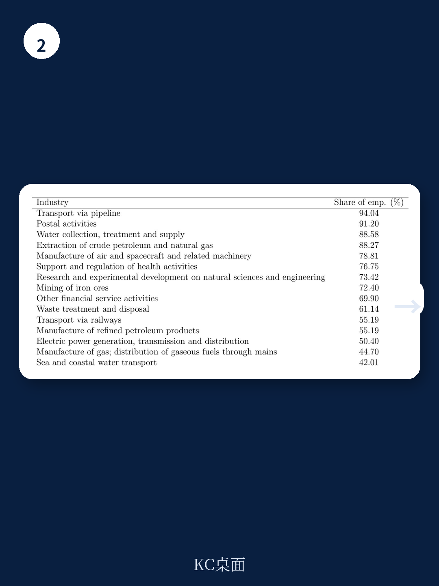

# 世界银行：国企不是就业杀手，但它在悄悄改变市场规则

关于国有企业，一个长期流行的叙事是：它们效率低、拿补贴、挤压民营空间。但世界银行一份针对巴西的最新研究，给出了一个更复杂、也更值得决策者认真对待的判断。

这份题为《巴西的国有企业：对就业和商业活力的影响》的工作论文，利用一个覆盖全巴西正式就业的独特数据集，系统检验了国有及国有参股企业（Businesses of the State, BOS）在经济中的真实角色。结论是：国企确实支付了更高的工资，私有化也确实会压低工人收入。但在就业总量层面，并没有发现私有化导致大规模裁员的稳健证据。更深层的矛盾在于，国企的存在与行业集中度上升、年轻企业占比下降、企业退出率降低同时相关。

这意味着什么？国企不是简单的“好”或“坏”，它正在以一种更隐蔽的方式重塑市场的竞争规则。对于正在讨论“增强国有经济核心功能”与“促进民营经济发展壮大”如何平衡的中国读者，这份报告的视角和方法论，都值得细读。

## 1. 国企支付的工资溢价是真实的，但私有化的冲击同样清晰

报告首先回答了一个基础问题：在巴西，国企是否支付了更高的工资？答案是肯定的。在控制企业和工人特征后，国企的工资溢价约为18.5%。但一旦加入工人固定效应，控制工人自选择进入国企的偏差后，这个溢价下降至4.5%。这意味着，国企高工资很大一部分来自它们吸引了更优秀的工人，而非纯粹的“体制红利”。

更直接的证据来自私有化事件。报告采用事件研究法估计，私有化发生后，留在原企业的工人在头两年内相对工资下降约10%。值得注意的是，私有化企业倾向于解雇教育水平更高、年龄更大、工龄更长的员工。这暗示了私有化后企业的人力资本结构调整：从“养人”转向“用人”。

> **KC评论：** 10%的工资降幅不是一个可以忽略的数字。对于正在推进国企改革的经济体，这意味着私有化不能简单视为“释放效率”，它同时涉及收入分配和人力资本再配置的代价。完整报告中对不同教育水平和工龄群体的异质性分析，值得仔细阅读。

## 2. 国企更善于创新，但它的“大”可能抑制了市场活力

一个反直觉的发现是，国企在创新指标上表现更好。报告使用技术性岗位占比作为创新强度的代理变量，发现国企——特别是国有参股的民营企业——比纯民营企业更“创新密集”。同时，国企规模更大，就业增长也更快。

但这些正面特征的另一面是市场活力的代价。报告发现，在一个行业中，国企的参与度越高，年轻企业的就业占比就越低，企业退出率也越低。这听起来似乎是好事——企业更不容易倒闭了。但经济学家知道，低退出率往往意味着低“创造性破坏”，即市场缺乏优胜劣汰的筛选机制。

更值得警惕的是，国企参与度与市场集中度正相关。这直接指向了竞争格局的固化：国企的存在可能通过规模优势和体制资源，提高了新进入者的门槛。

> **KC评论：** 国企“稳定”的另一面可能是“僵化”。报告没有完全展开的一个关键问题是：国企的“创新”是真正的技术创新，还是在特定政策环境下的“寻租式创新”？这需要结合行业特征和专利数据进一步检验。完整报告中的行业分类分析（竞争性行业、自然垄断行业等）提供了重要的分析框架。

## 3. 就业总量没有下降，但结构已经改变

关于私有化最敏感的问题之一是：它是否会导致失业？报告的答案是“没有稳健证据表明私有化导致总就业下降”。这是一个重要的政策信号。

但“总量稳定”不等于“结构无痛”。报告已经指出，私有化后企业解雇了更多高学历、高龄、长工龄的员工。这意味着，即使企业最终恢复了同等规模的就业，工作岗位的“质量”和“归属”已经发生转移。对于政策制定者而言，需要考虑的不是“会不会裁员”，而是“谁会被裁，以及如何保障”。

此外，报告发现国企参与度与净就业变化正相关——这主要来自更高的岗位创造率和更低的岗位破坏率。但低破坏率本身就是市场活力的隐患：它意味着低效企业没有及时退出，资源无法向高效企业重新配置。

## 4. 一个尚未完全回答的问题：国企的“好”和“坏”如何分离？

报告的核心贡献在于，它同时给出了国企的“正面”和“负面”证据：更高的工资、更强的创新、更快的增长，与更集中的市场、更少的新企业、更低的退出率同时存在。但报告没有回答一个关键问题：这些效应能否分离？

换句话说，是否存在一种“好国企”——它支付溢价、推动创新，但不抑制市场活力？或者，国企的规模效应和体制优势必然导致竞争扭曲？这需要更细粒度的研究，比如区分国企的行业特征、控股比例、治理结构等。报告本身也承认，它只能提供相关性证据，而非因果识别。

> **KC评论：** 这正是完整报告最有价值的地方。它没有给出简单的政策处方，而是提供了一个严谨的分析框架。报告中的图表——包括所有权分布、行业分类、事件研究结果——是理解国企真实影响的第一手材料。加入社群，可以获取完整研报解读与原始图表，与更多从业者一起讨论这些未解问题。

---

国企改革从来不是一道“要还是不要”的选择题，而是一道“如何设计机制”的复杂工程。世界银行的这份报告提醒我们：评估国企的足迹，必须同时考虑它对就业、创新和市场结构的系统性影响。任何单维度的判断，都可能错失问题的全貌。

对于正在思考“国企功能定位”或“竞争政策中性”的读者，这份报告的结论和方法论，都值得纳入你的分析工具箱。更多国际信源汇编与评论，每日更新，汇总国际主流叙事、数据与图表，观测边际变化。我们社群中汇聚了头部券商、PE/VC、投行、并购、hedge fund、资管机构、战略咨询、智库等朋友，期待与你交流。

Personal reading notes and learning share only. Not investment advice.

