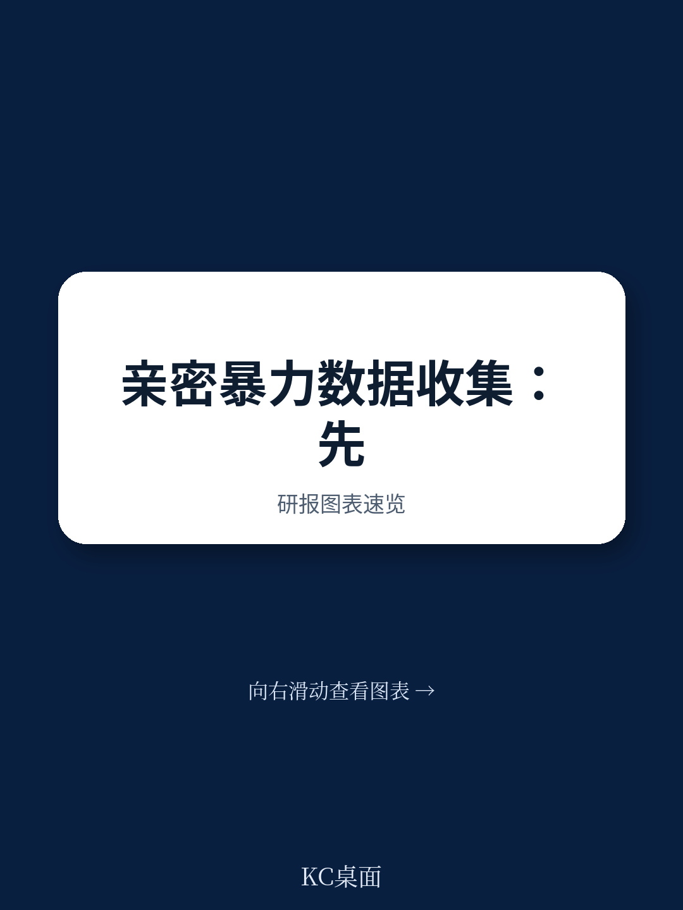
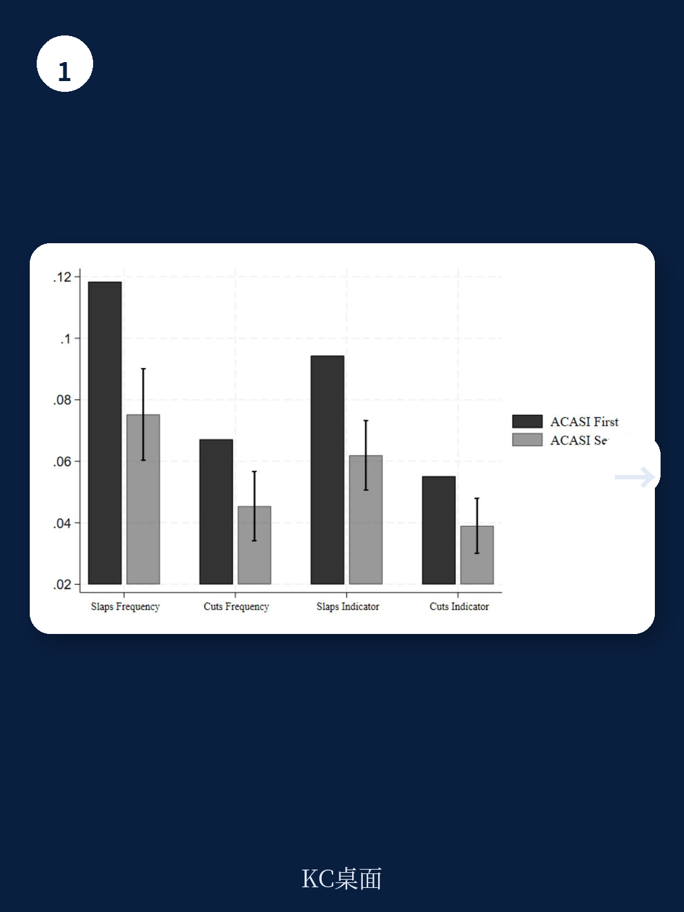
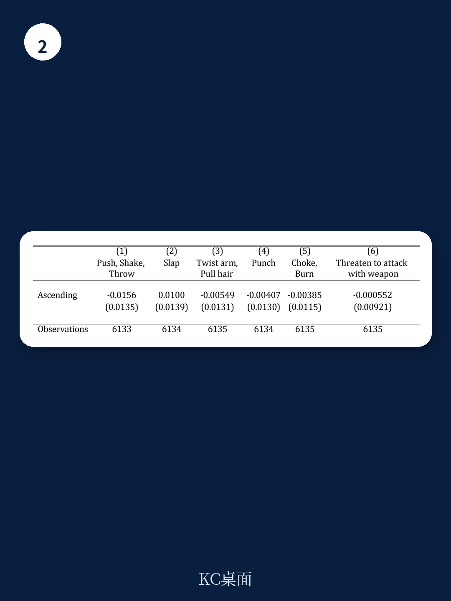

# 世界银行：家暴数据被严重低估，一个简单的问卷顺序改变能提升57%的披露率

在发展中国家，家庭暴力（IPV）的数据收集一直面临一个核心困境：受害者不愿对调查员开口。传统认为，计算机辅助自填问卷（ACASI）能通过匿名性提高披露率，但在文盲率高达93%的农村地区，这种方法可能适得其反——受访者根本看不懂选项。世界银行最新的一份政策研究论文，基于巴基斯坦旁遮普省6135名已婚女性的实地实验，给出了一个反直觉的答案：问题的关键不在于用什么工具，而在于先问什么。当受访者先用ACASI私下回答敏感问题后，再与调查员面对面访谈时，家暴披露率提升了41%到57%。这意味着，数据收集的“第一问”决定了真相的边界。

## 1. 高文盲率不是ACASI的障碍，设计粗糙才是

这份报告的第一个核心判断，直接挑战了此前学界的主流认知。此前，Park等人2021年在利比里亚和马拉维的研究发现，ACASI在农村地区存在严重的理解障碍——约三分之一的受访者连训练题都答错。这导致了一个危险的推论：ACASI提高的披露率可能不是更真实，而是更混乱。

世界银行的团队没有止步于此。他们做了两件事。第一，重新设计了ACASI的视觉界面。他们没有使用抽象的色块或形状，而是与当地调查员合作，开发了与频率选项（“从未”“一两次”“三次以上”）高度关联的图片。第二，他们设计了一个随机实验：对一半受访者，ACASI中的频率选项按升序排列；对另一半，按降序排列。如果受访者只是在“瞎选”第一个选项，那么顺序变化会显著影响结果。

结果令人信服：两个顺序组之间，所有六种暴力类型（推搡、掌掴、扭臂、拳击、窒息、持械威胁）的报告率均无统计显著差异。这意味着受访者真正理解了选项的含义。

> **KC评论：** 这对所有在发展中国家做田野调查的机构是一个明确的提醒。技术工具的失败，往往不是因为用户“不行”，而是设计者没有站在用户视角重新适配。世界银行这篇报告真正有价值的地方，不是ACASI本身，而是它证明了“可理解性”是可以被设计和验证的。完整报告中包含了详细的界面示意图和训练题设计，值得所有做同类研究的团队参考。

## 2. 先私下回答，再面对面披露——顺序本身就是干预

这是整份报告最核心的实验发现。研究团队选取了两个问题：一个关于“丈夫是否掌掴你”，另一个关于“是否因丈夫行为导致割伤或淤青”。他们将受访者随机分为两组：一组先由调查员面对面提问，再用ACASI；另一组则先通过ACASI私下回答，再面对面访谈。

结果令人震惊。在面对面访谈中，先通过ACASI回答的受访者，报告掌掴的频率高出57%，报告割伤/淤青的频率高出47%。在“是否发生过”这个二元指标上，先ACASI组的掌掴报告率高出52%，割伤报告率高出41%。

这些差异不仅仅是统计显著，更是政策意义上的巨大差距。试想，如果一个国家的家暴调查显示3%的妇女遭受过暴力，而另一个调查显示6%——决策者会得出完全不同的资源分配结论。而这两个数字的差异，可能仅仅来自于问卷中两道题的先后顺序。

> **KC评论：** 这个发现的价值在于，它揭示了“信任”的建立机制。当受访者先在完全私密的环境中回答了一次敏感问题，她的大脑已经完成了一次“自我确认”——“我承认这件事发生过”。之后面对调查员时，认知失调的压力会促使她保持一致性，而不是选择隐瞒。这是一个非常巧妙的行为经济学洞察。完整报告中对这一机制有更详细的讨论，包括非敏感问题（如丈夫吃肉频率）的对照组数据，进一步排除了“单纯重复提问”的解释。

## 3. 这个发现对全球家暴调查的伦理和方法论都有深远影响

如果先ACASI后F2F的流程被广泛采纳，它可能改变世界卫生组织、联合国人口基金以及各国统计部门现行的调查标准。目前，大多数大规模调查（如人口健康调查DHS）仍然依赖面对面访谈，或者将ACASI作为一个独立的替代选项。但世界银行的实验表明，ACASI和F2F不是“二选一”的关系，而是可以形成一种“先私后公”的递进式披露机制。

更重要的是，这种设计在伦理上也是更优的。在巴基斯坦农村，由于住房狭小，家庭成员容易听到访谈内容。研究团队在ACASI模块开头加入了几个无关紧要的非敏感问题，并让受访者佩戴耳机。调查员反馈，这有效缓解了其他家庭成员的疑虑——他们听到耳机里播放的是“丈夫吃了多少次肉”之类的问题，就不会再追问敏感内容。这种“伪装”虽然未被随机化验证，但其思路值得推广。

当然，这份报告也有未完全回答的问题。首先是外部有效性：巴基斯坦是一个高度父权的穆斯林社会，这一发现在其他文化背景下是否成立？其次是成本：ACASI设备、耳机、本地化图片开发，对大规模调查而言是一笔不小的开支。最后，也是最关键的：更高的披露率是否意味着更高的干预有效性？如果调查只是让更多受害者“开口”，却没有配套的保护和援助机制，伦理风险依然存在。

## 4. 对读者的观察框架：如何判断一份家暴调查是否可靠

基于这份报告的发现，我们可以提炼出一个简单的评估框架，用于判断任何一份家暴调查报告的质量。第一，看调查工具是否经过本地化适配。如果报告只是简单说“使用了DHS标准模块”，而没有说明如何针对文盲、贫困、多语言环境做调整，那么数据的可信度要打折扣。第二，看披露率的“顺序敏感性”。如果报告没有说明敏感问题是先问还是后问，没有提供不同顺序下的对比数据，那么报告的数字可能严重低估。第三，看是否有“一致性验证”。世界银行的实验通过非敏感问题的F2F与ACASI高一致性（94%-96%），证明了工具本身没有系统偏差。这是判断调查质量的黄金标准。

## 5. 报告尚未完全回答的关键问题：技术方案能否规模化

世界银行这篇论文的样本是6135名已婚女性，来自巴基斯坦一个县的贫困家庭。这个样本足够做严格的因果推断，但不足以回答“如果推广到全国甚至全球会怎样”的问题。更关键的是，ACASI的硬件成本、培训成本、以及数据采集后的伦理处置（如转介服务），在报告中几乎没有展开。这恰恰是政策制定者最关心的部分。此外，报告只测试了两种暴力类型（掌掴和割伤），对于性暴力、情感暴力等更难启齿的议题，ACASI的“预热效应”是否同样有效，目前没有数据支持。

这些未解问题，恰恰是继续深入阅读完整报告的意义所在。报告附录中的实验设计细节、原始问卷截图、以及完整的统计结果，能够帮助读者自己判断这一方法论的稳健性和可复制性。

---

这份报告揭示了一个简单但容易被忽视的真相：在敏感议题的调查中，方法本身不是目的，信任才是。当受访者先在一个安全、私密的环境中完成一次自我确认，她才有勇气在另一个环境中说出真相。对于任何一个需要采集敏感数据的研究者、调查机构或政策制定者，这都是一个值得反复咀嚼的教训。

如果你想获取这份世界银行报告的完整原始图表、实验设计细节，以及更多关于发展中国家调查方法的国际前沿讨论，欢迎加入我们的社群。这里汇聚了头部券商、PE/VC、投行、并购、hedge fund、资管机构、战略咨询、智库等机构的朋友，每日更新国际主流叙事、数据与图表，观测边际变化。扫码交流，期待与你一起探讨。

Personal reading notes and learning share only. Not investment advice.

