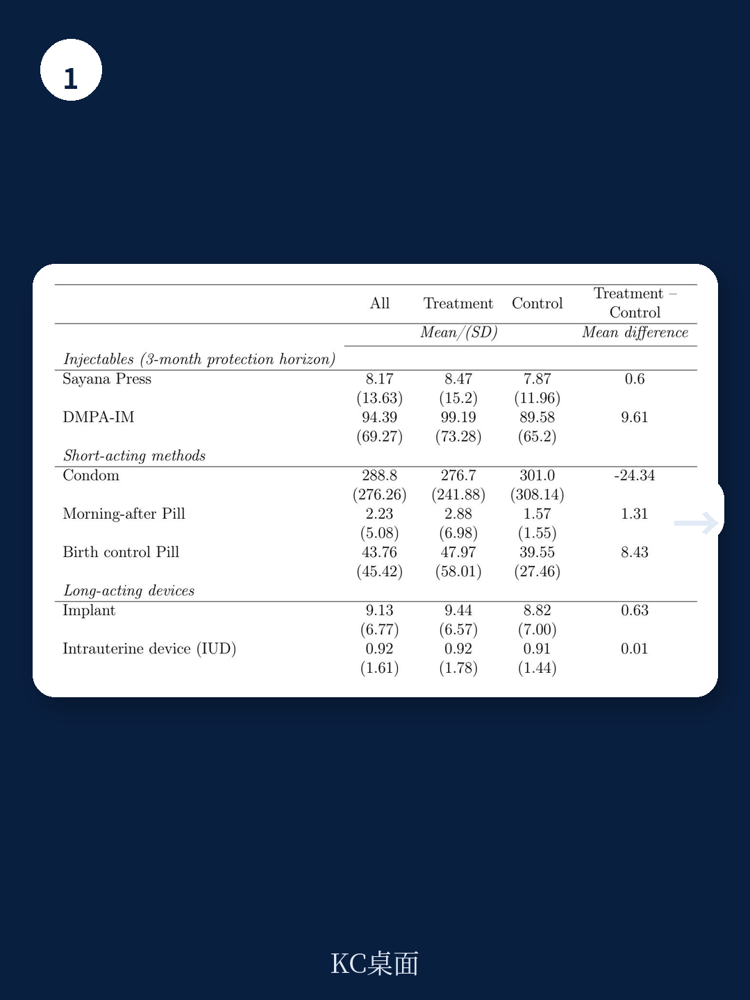

# 世界银行：社区健康工作者推高避孕针用量70%，但总覆盖率未变

一项来自布隆迪农村的随机实验显示，授权社区健康工作者在常规家访中提供新型避孕注射剂，使注射量飙升约70%。然而，这项看似成功的干预并未提升总体避孕覆盖率——因为女性从长效避孕方法（皮下埋植、宫内节育器）显著转向了这种更方便的注射剂。这一发现对全球公共卫生政策和资源分配提出了一个根本性问题：我们追求的是服务可及性，还是实际保护效果？

这份由世界银行研究团队完成的政策研究工作论文（编号11074），通过集群随机对照试验和卫生中心行政数据，揭示了上述反直觉的结论。对于关注新兴市场医疗体系改革、公共卫生项目评估以及行为经济学的读者而言，这份报告提供了一个难得的“自然实验”案例，其结论的严谨性值得深入解读。

## 1. 真正的增量不在“新增用户”，而在“用户迁徙”

这份报告最核心的发现是：干预组卫生中心辖区内的新型避孕注射剂（Sayana Press）月均使用量比对照组高出约13单位，增幅约70%。这一增长在统计学上高度显著，且贯穿了社区健康工作者的理论培训和实践认证两个阶段。在认证后，由社区健康工作者在家访中提供的续针注射量同样出现了强劲且显著的增长。

然而，关键问题在于“所以呢”？当研究者将目光投向所有避孕方法的总体使用量时，发现干预并未产生统计学上的显著变化。这意味着，这70%的增长并非来自新增的避孕用户，而主要是原有用户的方法转换。报告明确指出，观察到了向长效避孕方法（尤其是皮下埋植和宫内节育器）的显著替代效应，月均下降约2.7单位。考虑到不同方法的有效保护时长（Sayana Press为3个月，皮下埋植可达3-5年），探索性估算表明，干预在整个分析期内并未净增加避孕覆盖人月数。

> **KC评论：** 这是典型的“服务可及性改善不等于健康结果改善”案例。对于项目评估者而言，如果只看“注射量”这一个指标，会得出非常积极的结论。但一旦引入“总覆盖率”和“方法转换”的视角，故事就完全不同了。完整报告中对“替代效应”的量化方法和敏感性分析，是理解这一结论稳健性的关键，值得仔细阅读。

## 2. 便捷性提升的“代价”：长效方法的流失

为什么女性会从保护期更长的皮下埋植和宫内节育器转向每三个月就需要注射一次的Sayana Press？报告给出了一个合理的解释链条：社区健康工作者的家访服务极大地降低了获取避孕注射剂的门槛和隐私成本。

在布隆迪农村，女性去卫生中心获取避孕服务面临多重障碍：路途遥远、交通成本、排队等待、儿童看护，以及因被熟人看到进入卫生中心而产生的社会污名。社区健康工作者本身就是社区成员，他们的常规家访服务（包括其他健康服务）使得避孕注射剂的获取变得“隐形”，从而降低了社会环境的“推断”能力。这种便捷性和隐私优势，足以让部分女性放弃需要去卫生中心才能获取的长效方法，转而选择“送到家门口”的短效注射剂。

这引出了一个在公共卫生项目中常被忽视的权衡：当一种新方法在可及性上具有压倒性优势时，它可能“挤出”在医学上更优（保护期更长、依从性要求更低）的既有方法。对于政策制定者而言，这并非简单的“好”或“坏”的判断，而是需要根据目标人群的偏好和项目目标进行精细的成本-效益分析。

## 3. 研究设计的精巧之处：剥离了“新方法”与“新渠道”的效应

这份报告的学术贡献之一在于其研究设计的精巧性。Sayana Press作为一种新型皮下注射剂，其核心优势在于操作简单，可以由较低技能的医护人员安全使用。然而，在布隆迪的既有体系中，Sayana Press在干预前已经可以在卫生中心和少数社区健康促进员（HPO）处获取。

因此，本研究的干预并非引入Sayana Press本身，而是专门授权社区健康工作者在常规家访中提供该注射剂的续针服务。这使得研究者能够将“新渠道”（社区健康工作者家访）的效应从“新方法”（Sayana Press本身）的效应中剥离出来。这种识别策略在实证研究中十分难得，它直接回答了“如果只是把服务送到家门口，而不改变方法本身，会发生什么”这一核心问题。

> **KC评论：** 这个研究设计上的“干净”是这份报告价值所在。它不像许多项目评估那样，把多种干预措施混在一起，让人难以判断究竟是哪个环节起了作用。报告清晰地告诉我们，纯粹是“渠道下沉”带来了使用量的提升，但代价是方法结构的改变。对于任何正在推行“最后一公里”健康服务策略的机构，这个结论都有直接的警示意义。

## 4. 报告未完全回答的关键问题：隐私的量化与长期影响

尽管报告对替代效应提供了有力的证据，但仍有一些关键问题未能完全展开。首先是隐私的量化。报告假设社区健康工作者的家访服务降低了社会污名，但并未直接测量这种隐私改善的程度。女性选择转换方法，究竟多大程度上是因为“更方便”，多大程度上是因为“更私密”？这两者对于项目设计的含义不同：如果是方便，可能需要优化物流和培训；如果是隐私，可能需要调整社区动员策略。

其次是长期影响。研究观察期相对有限，未能追踪女性在后续周期中的方法选择。她们是否会因为Sayana Press需要每三个月注射一次而出现更高的“脱失率”？如果脱失率较高，那么短期的替代效应可能演变为长期的保护缺口。此外，长效方法的减少是否会导致更高的意外怀孕率？这些问题都需要更长时间跨度的跟踪数据来回答。

最后，研究是在布隆迪农村进行的，其结论的外部有效性需要审慎评估。布隆迪的避孕覆盖率极低（2017年仅21.5%），社区健康工作者体系相对成熟。在卫生体系更完善、避孕选择更丰富的国家，类似的干预可能会产生完全不同的结果。

## 5. 对读者的观察框架：如何评估一项“可及性改善”项目

基于这份报告的发现，我们可以提炼出一个评估类似项目的简易框架。当你看到一项旨在提升健康服务可及性的干预时，可以问三个问题：

第一，增量从何而来？是来自“初次使用者”的净增加，还是来自“现有使用者”的方法转换？这需要看总使用量的变化，而不仅仅是目标方法的使用量。

第二，转换的方向是什么？如果用户从“效果更持久、依从性要求更低”的方法转向“效果更短、依从性要求更高”的方法，那么长期健康结果可能并非改善，甚至可能恶化。反之，如果是从“效果差或未使用”转向“效果更好”的方法，则是积极信号。

第三，转换的代价是什么？除了方法本身的成本差异，还需要考虑项目运营成本、培训成本，以及由于方法转换可能带来的脱失风险和意外怀孕风险。只有将所有这些因素纳入考量，才能做出真正明智的资源配置决策。

这份世界银行的报告为上述框架提供了一个教科书级的案例。它提醒我们，在公共卫生领域，“更容易获得”并不总是等同于“更好”。对于决策者而言，理解用户行为背后的权衡，比盲目追求单一指标的提升更为重要。

---

这份报告对替代效应的量化、研究设计的识别策略以及其中包含的详细图表，都未能在这篇导读中完全展开。例如，报告对“理论培训阶段”和“实践认证阶段”的效应分别做了估计，这种分阶段的动态分析对于理解项目推进的节奏非常有价值。

如果你希望获取完整的研报解读、原始图表以及更深入的讨论，欢迎加入我们的社群。这里汇聚了头部券商、PE/VC、投行、并购、hedge fund、资管机构、战略咨询、智库等领域的从业者，每日更新国际主流叙事、数据和图表，共同观测边际变化。扫码交流，期待与你深入探讨这份报告及其对全球健康投资格局的启示。

Personal reading notes and learning share only. Not investment advice.

