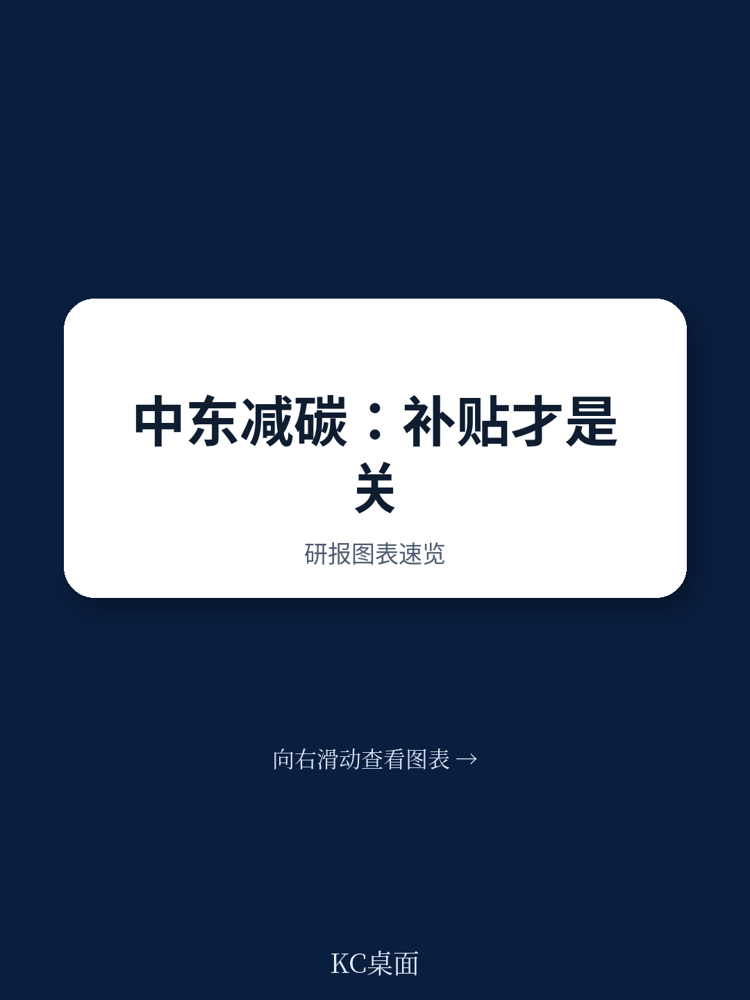
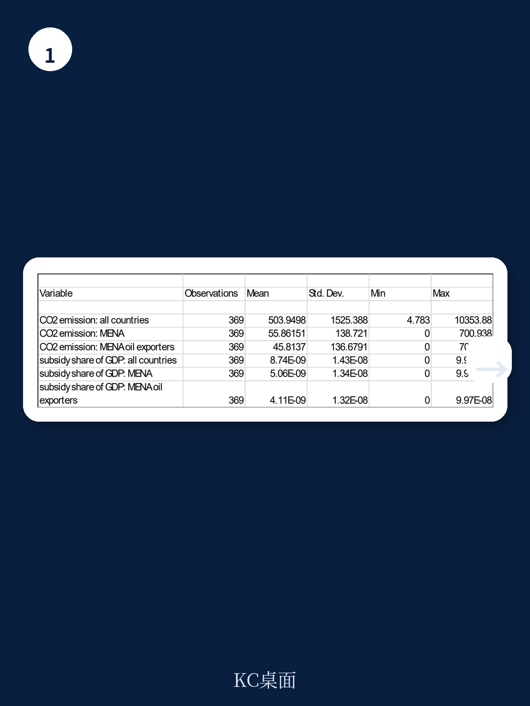
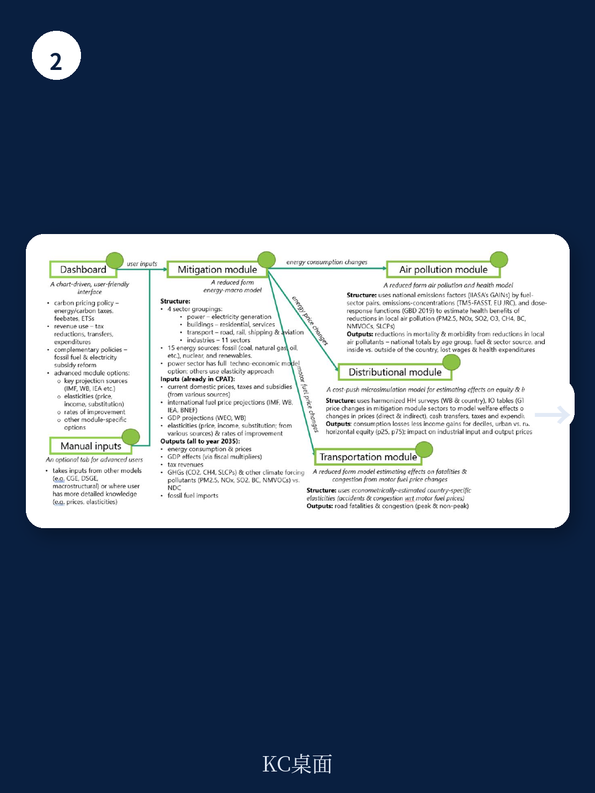

# 世界银行：中东产油国的燃料补贴，正在成为全球减排的最大盲区

全球气候治理的讨论，长期聚焦于碳税、碳市场、可再生能源补贴这些“正面清单”工具。但一份由世界银行发布的最新实证研究，却将矛头指向了一个被严重低估但规模惊人的反向变量：化石燃料补贴。

这份由Hamid Mohtadi和Zeljko Bogetic共同完成的工作论文，基于41个国家2011-2018年的面板数据，对中东和北非（MENA）地区的脱碳政策效果进行了严谨的计量分析。其核心结论极为明确且具有政策颠覆性：在中东产油国，石油补贴不仅直接且显著地推高了二氧化碳排放，更关键的是，**削减这些补贴，并不会对短期或长期的经济增长造成任何可统计的负面影响。**

这意味着，全球气候政策工具箱里，最优先的“低成本高收益”选项，或许不是尚未成熟的碳捕集技术，也不是充满争议的碳边境调节机制，而是直接拆除那些由本国财政支付的、扭曲能源价格的补贴体系。世界银行这份报告，为全球投资者和产业决策者提供了一个重新评估中东资产风险与机遇的硬核分析框架。

> **KC评论：** 这份报告最值得关注的不是“补贴有害环境”这个常识，而是它用数据证明了一个反直觉的结论：对于中东产油国，取消补贴在经济上几乎没有代价。如果这个结论被当地政策制定者接受，整个中东的能源定价逻辑、财政收支结构乃至主权信用评估框架，都可能需要重写。完整报告对样本选择、内生性处理和分组回归的细节，是理解这一结论稳健性的关键。

## 1. 补贴的排放“放大器”效应，只存在于中东产油国，而非全球

报告的第一个核心发现，是石油补贴对碳排放的推动作用具有显著的区域特异性。在全样本（41国）和中东非样本中，石油补贴与二氧化碳排放之间的正相关关系并不显著。但一旦将样本限定为“中东非地区的石油生产国”，这种关系立刻变得强烈且统计显著。

这背后的经济学逻辑，在报告的第二章通过一个精巧的“补贴-租金-排放”理论模型得到了阐释。对于中东产油国而言，其石油生产的边际成本（例如沙特2016年约8.5美元/桶）远低于国际市场价格（约43美元/桶）。政府提供的补贴，本质上是在国际高价与国内低价之间创造了一个巨大的“租金空间”。这个租金不仅惠及国内消费者，更通过压低生产端成本，使得大量本应因经济性不足而被搁置的高成本、高排放生产活动得以持续。

报告进一步指出，这种补贴对碳排放的推动作用，主要通过两条路径实现：一是直接的“能源消费路径”，即补贴降低了能源使用价格，刺激了无效消费；二是在控制了消费效应后，仍然存在一个“直接净效应”，这可能源于补贴对制造业等高耗能产业的隐性支持。报告中的实证分析（Table 2, Column 4）清晰地展示了这一点：在MENA产油国子样本中，石油补贴对碳排放的弹性系数显著为正。

## 2. 削减补贴与经济增长：一个“零成本”的减排选项

如果说补贴推高排放是意料之中，那么报告关于“经济增长”的发现，则构成了其最具政策价值的部分。

报告采用面板自回归分布滞后误差修正模型（ARDL-EC），分别检验了石油补贴对短期和长期经济增长率的影响。结果令人震惊：在所有三个样本组（全样本、MENA、MENA产油国）中，无论是短期还是长期，**石油补贴的系数在统计上均不显著**（Table 4）。这意味着，即便大幅削减甚至取消补贴，也不会对国民经济增速产生可测量的负面冲击。

这一结论，与许多产油国政府长期以来“补贴是稳定民生、促进增长的必要手段”的叙事形成了直接冲突。报告的逻辑在于，补贴在MENA产油国更多体现为一种“租金转移”，而非生产性投资。它扭曲了资源配置，鼓励了低效消费，却并未有效转化为资本积累或全要素生产率的提升。因此，取消补贴只是消除了这种扭曲，并不会伤及经济增长的真正引擎。

> **KC评论：** 这是整份报告最具政策杀伤力的结论。如果“零增长代价”这个结论在更长时间跨度、更多国家样本下依然稳健，那么对于沙特、阿联酋、科威特等正在进行经济多元化转型的国家而言，取消补贴就不再是一个“政治选择”，而是一个“经济理性”问题。报告没有展开的是，这种“零代价”是否依赖于当前的高油价环境？如果油价大幅下跌，补贴削减对增长的冲击是否会显现？这些悬念，正是完整报告值得细读的地方。

## 3. 政策序列：为何“先砍补贴”比“先征碳税”更优？

报告在引言部分提出了一个重要的政策序列问题：在脱碳政策组合中，是先取消化石燃料补贴，还是先征收碳税？

从“次优理论”的角度，报告给出了明确的技术性建议：当存在一个巨大的、扭曲性的补贴时，直接在其之上叠加碳税，只会造成“双重扭曲”，导致更大的效率损失。因此，**对于补贴规模巨大的中东产油国，取消补贴是“第一最优策略”**，而碳税的实施，需要等补贴取消、价格信号理顺之后，再行引入。

这一判断，与欧美和中国的政策实践（先补贴可再生能源，后推行碳定价）形成了有趣的对照。后者更多是基于政治经济学的考量——先通过补贴培育支持脱碳的利益集团，再推行不受欢迎的碳价。而世界银行这份报告，则从纯粹的效率角度，为“先取消补贴”提供了实证支撑。这对于正在设计国内能源价格改革方案的中东国家，具有直接的参考价值。

## 4. 报告的未尽之处：数据边界、世界油价与政治经济学的“黑箱”

尽管报告在实证上做出了重要贡献，但它也留下了几个关键的、尚未完全回答的问题，这恰恰是深度读者可以继续挖掘的领域。

第一，**数据的时间窗口局限。** 样本覆盖2011-2018年，这恰好是一个油价相对平稳且处于中高位的时期。如果我们将时间轴拉长至2020年疫情负油价时期，或者2022年俄乌冲突后的高油价时期，补贴与增长、补贴与排放之间的关系是否会发生变化？报告没有给出答案。

第二，**世界油价的内生性问题。** 报告在理论模型部分已经指出，对于中东产油国，补贴的规模本身会随世界油价波动而变化。但在实证部分，如何干净地分离出“补贴政策变化”与“油价波动”对碳排放和增长的各自影响，仍然是一个计量上的挑战。报告中“价格 x MENA”交互项的引入虽是一种尝试，但其解释力仍有待进一步检验。

第三，**政治经济学的“黑箱”。** 报告明确承认，它忽略了政策的“社会或政治经济学效率”，而只关注减排效果。但现实世界中，补贴之所以难以取消，恰恰是因为它背后捆绑着庞大的既得利益集团（国有石油公司、特权消费阶层）和民生维稳需求。报告没有分析，在何种政治体制和财政条件下，“零增长代价”的结论才能转化为可行的政策行动。

> **KC评论：** 这些未解问题，恰恰是这份报告最有价值的地方。它提供了一个坚实的分析起点，但真正的“投资决策”和“政策判断”，需要读者自己去填补数据之外的信息拼图。比如，沙特主权财富基金PIF的转型投资，是否已经形成了足以对冲补贴取消影响的非油产业？阿联酋的核能与太阳能布局，能否在补贴削减后替代化石燃料的消费缺口？这些问题的答案，不在世界银行这份报告里，但在其提供的分析框架下，我们可以提出更精准的追问。

## 5. 对产业决策者的观察框架：三个需要持续跟踪的信号

基于世界银行这份报告的结论，对于关注中东能源转型、主权信用和地缘政治的读者，可以建立以下三个观察框架：

**第一个信号：国内能源定价机制改革。** 需要跟踪各产油国是否将国内成品油和天然气价格与国际市场挂钩，以及调整的频率和幅度。这是“取消补贴”最直接的量化指标。沙特2016年以来的多次调价，已经走在了这条路上。

**第二个信号：财政预算中“补贴支出”科目的变化。** 报告指出，全球化石燃料补贴在2022年高达7万亿美元。对于中东产油国，其补贴占GDP的比重是衡量改革决心的关键变量。如果这一比重持续下降，且并未伴随社会动荡或经济失速，则说明报告的结论正在被验证。

**第三个信号：非油产业增长对能源消费的替代弹性。** 报告的核心逻辑是，取消补贴不会伤及增长，因为增长引擎正在从补贴驱动的低效消费，转向效率更高的非油产业。因此，需要密切跟踪旅游业、物流业、制造业、金融服务业等多元化产业的增加值增速，是否能覆盖补贴削减带来的短期需求冲击。

世界银行这份报告，为全球气候治理提供了一面清晰的镜子：真正的减排，或许不需要那么多复杂的金融工具和技术突破，而只需要停止那些正在用公共财政“奖励”污染的愚蠢政策。对于中东产油国而言，这既是挑战，也是其经济转型过程中一个不容错过的政策窗口。

---

这份报告还包含了许多未能在此详述的细节，例如不同补贴类型（石油、天然气、电力、煤炭）的异质性影响、天然气放空燃烧对碳排放的贡献、以及不同计量模型（固定效应、系统GMM、ARDL-EC）之间的结果对比与稳健性检验。这些技术细节，对于理解报告的结论边界和潜在争议至关重要。

我们已将世界银行这份完整研究报告（含全部图表、附录和计量结果）的解读与原始图表整理完毕。如果你希望获取更完整的分析框架，并与其他关注全球宏观叙事与资产定价的朋友交流，欢迎扫码加入我们的社群。在这里，我们每日更新并汇总来自头部投行、PE/VC、对冲基金和战略咨询机构的最新研究，观测全球边际变化，期待与你的深度交流。

Personal reading notes and learning share only. Not investment advice.

