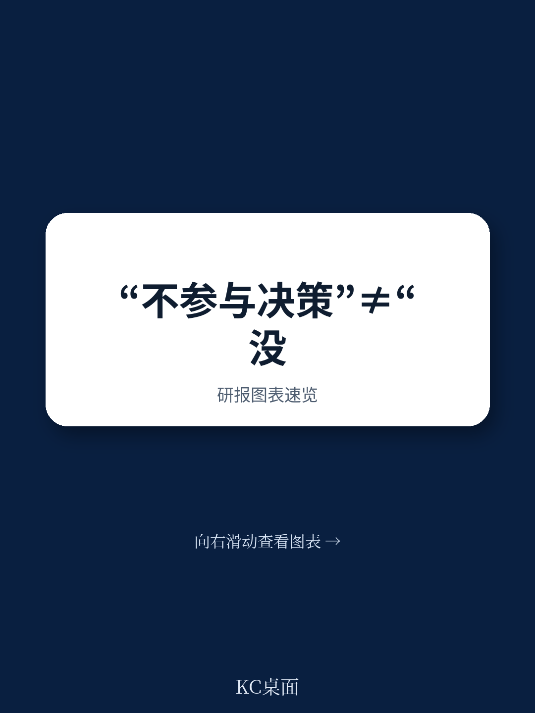
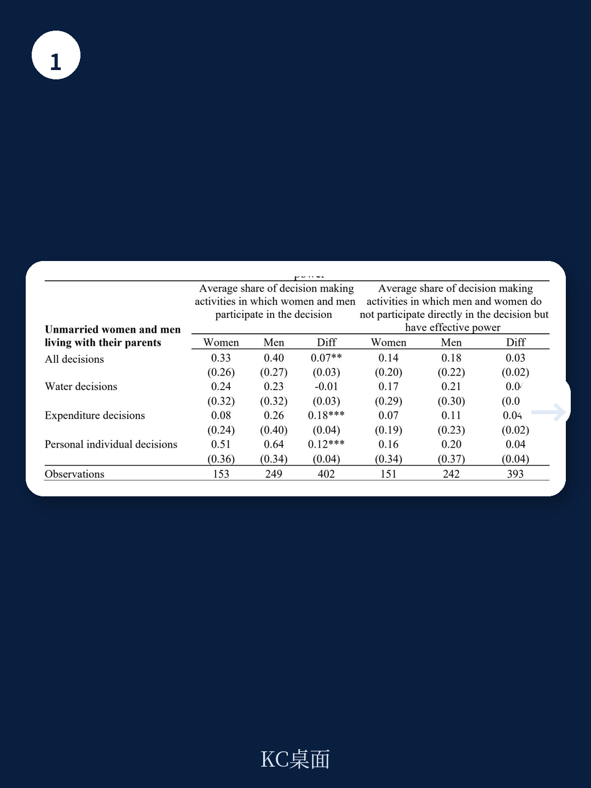
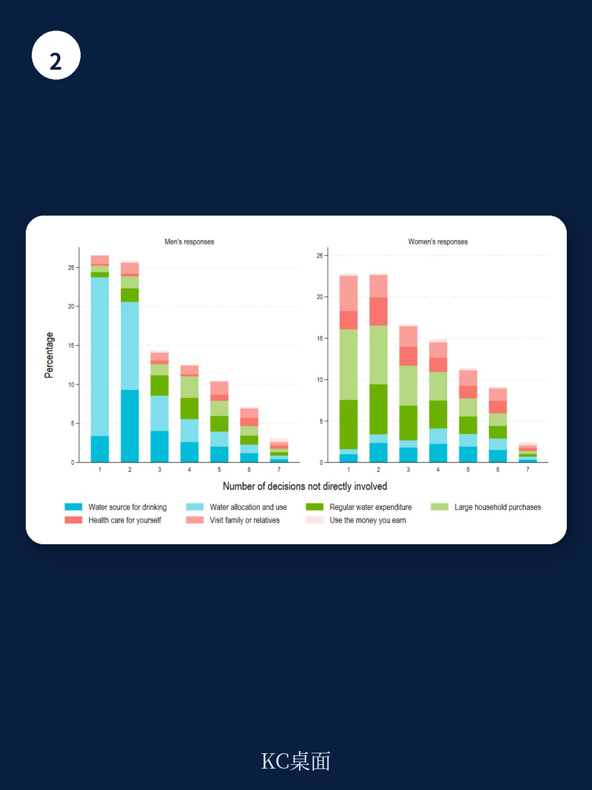

# 世界银行：不参与决策，可能恰恰是权力的体现

在绝大多数关于女性赋权的研究中，参与决策被视为衡量个体能动性的核心指标。一个常见的假设是：如果你没有在决策桌上发言，你就没有权力。但世界银行最新发布的一篇工作论文，基于对肯尼亚基利菲县农村家庭的混合方法研究，提出了一个挑战直觉的判断：**不参与决策，有时恰恰是权力的体现，而非权力缺失的信号。**

这篇论文的标题本身就极具洞察力——“Deciding Not to Decide”（决定不做决定）。它提醒我们，在理解家庭内部的权力动态时，传统的问卷调查可能严重低估了某些成员的真正影响力，尤其是那些无需开口就能让自己的偏好自动得到满足的人。

## 1. 传统的决策参与指标，可能高估了弱势群体的权力，也低估了强势群体的影响力

当我们问“谁决定家庭用水怎么分配”时，如果一个人回答“我没有参与”，研究者通常会将其归为“无权者”。但世界银行的这项研究指出，这种判断存在根本性的盲区。权力不仅仅体现在直接参与决策的过程中，更体现在“有效权力”上——即无论你是否在场，结果都按照你的意愿发生。

在肯尼亚基利菲县的农村家庭中，男性户主往往不需要亲自参与日常的水源选择或家庭开支讨论。他们可能在地里干活，或者在村里闲聊，但家庭用水的最终分配方案，天然地倾向于他们的偏好。这不是因为他们参与了决策，而是因为“默认选项”本身就站在他们一边。长期形成的家庭权力结构和社会规范，使得他们的需求成为家庭的默认设定。

> **KC评论：** 这意味着，当我们用“是否参与决策”来测量权力时，我们实际上是在测量“显性权力”，而忽略了“隐性权力”。对于男性户主而言，不参与决策是一种高效的权力行使方式——他们既节省了时间和精力，又确保了结果符合自己的利益。而对于女性或年轻成员，不参与决策则更可能是“无力参与”。同一个行为“不参与”，背后的权力含义截然不同。

## 2. 有效权力有两种：一种靠“代理”，一种靠“影响”

世界银行的这篇论文将“不直接参与决策时的有效权力”明确区分为两种类型。

第一种是“代理型有效权力”。当一个人确信某个他信任的人会做出符合他利益的决定时，他可以选择主动退出决策，把时间和精力花在更重要的事情上。这类似于企业CEO将日常运营授权给职业经理人。在家庭场景中，丈夫可能把家庭日常开支的决策权“委托”给妻子，因为他知道妻子会做出理性的、符合家庭整体利益的决定，而他则专注于农业生产或其他收入活动。

第二种是“影响型有效权力”。当一个人无法直接参与决策（因为社会规范不允许，或担心遭到排斥和报复），但他通过间接的方式——比如私下沟通、暗示、施加情感压力——来影响决策者，最终让结果符合自己的偏好。这在年轻女性或儿媳妇身上尤为常见。她们可能不会在家庭会议上直接反对婆婆的意见，但会在私下里向丈夫表达自己的需求，或者通过调整自己的行为来间接影响家庭的水资源分配。

> **KC评论：** 这两种权力的区别至关重要。代理型权力是主动的、高效的，通常属于家庭中地位较高的人；而影响型权力是被动的、消耗精力的，往往是弱势群体在结构限制下的策略性选择。问卷如果只问“谁做了决定”，就会完全错过这些微妙的权力运作方式。

## 3. 只关注夫妻二元关系，会忽略家庭权力的真正博弈

许多研究将家庭决策简化为“丈夫 vs 妻子”的二元关系。但世界银行的这项研究揭示了一个更复杂的现实：在肯尼亚基利菲县，超过60%的家庭是几代同堂的扩展家庭。在这样的家庭中，婆婆、儿子、甚至已成年但未婚的兄弟，都可能参与决策。

研究发现，对于已婚女性而言，真正限制她们权力的，往往不是丈夫，而是婆婆。在关于家庭用水和开支的决策中，婆婆往往拥有更大的话语权，而年轻媳妇则处于权力链的底端。当研究者只问“你和你的丈夫谁做决定”时，他们可能完全误判了这位女性的真实处境——她可能既没有对抗丈夫的权力，也没有对抗婆婆的权力，而她的丈夫本身也可能受制于他的母亲。

这一发现对调查方法论有直接的冲击。如果问卷设计只对准夫妻，它就自动忽略了家庭中可能真正掌权的“其他成年人”。世界银行的论文建议，未来在测量家庭内部的权力时，必须扩展受访者范围，覆盖所有同住的成年家庭成员，并明确询问每个人在不同决策领域中的角色和影响力。

## 4. 报告尚未完全回答的关键问题：如何区分“主动不参与”与“被迫不参与”

这篇论文的核心贡献在于，它提出了一个概念框架来区分不同性质的“不参与决策”。但报告本身也坦诚地指出，在实际调查中，区分“主动选择不参与（代理型）”和“被迫无法参与（无力型）”是极其困难的。

当前的问卷设计可以识别出一个人是否参与了决策，也可以询问他/她“为什么没有参与”，但受访者给出的理由往往受到社会期望偏差的影响。一个丈夫可能会说“我信任我妻子”，但这可能掩盖了他对家庭事务的漠不关心或对妻子决策的隐性控制。一个妻子可能会说“我不需要参与”，但这可能是她长期被边缘化后产生的习得性无助。

世界银行的论文提出了一个观察框架：我们需要结合家庭结构、个人生命周期阶段和决策的具体领域来判断。例如，对于家庭用水这样的“女性领域”决策，男性不参与可能更接近“代理型权力”；而对于个人医疗这样的“个人领域”决策，女性不参与则更可能是“无力型”。但这一框架仍需要更大量的实证数据来验证和细化。

## 5. 对研究者和调查设计者的观察框架：走出“参与”的迷思

世界银行的这篇论文对任何从事家庭决策、性别赋权或发展经济学研究的人，都提供了一个重要的方法论警示。它建议未来的调查设计至少做三件事：

第一，不要只问“谁做了决策”，还要问“如果结果不是你想要的，你能改变它吗？”这能更直接地测量个体的“有效权力”。

第二，不要只采访夫妻，要采访家庭中所有成年人。在扩展家庭中，权力可能分布在婆婆、长子、甚至已故长辈的遗愿中。

第三，要将决策领域细分。同一个家庭成员，在“家庭用水”和“个人收入支配”这两个领域中的权力可能完全不同。笼统地构建一个“决策参与指数”可能会掩盖关键的结构性差异。

对于更广泛的读者——无论是关注ESG投资的机构，还是研究社会流动性的学者——这篇报告的启示在于：权力往往沉默地运行。那些最不需要在会议上发言的人，可能恰恰是制度最服务于其利益的人。而真正需要被听到的声音，往往因为“不参与”而被统计口径无声地过滤掉了。

---

**顺着这些未解问题继续读完整报告，你会发现更多关于家庭权力暗流的细节。**

这篇世界银行的论文还提供了详细的问卷设计建议和肯尼亚田野调查的原始数据图表，展示了不同家庭结构下“有效权力”的分布差异。如果你想看到完整的分析框架、方法论附录以及作者对“如何区分代理型与无力型不参与”的进一步讨论，欢迎加入我们的社群。这里汇聚了头部券商、PE/VC、投行、并购、hedge fund、资管机构、战略咨询、智库等朋友，每日更新并汇总国际主流叙事、数据与图表，观测边际变化。扫码交流，领取完整研报解读与原始图表。

Personal reading notes and learning share only. Not investment advice.

