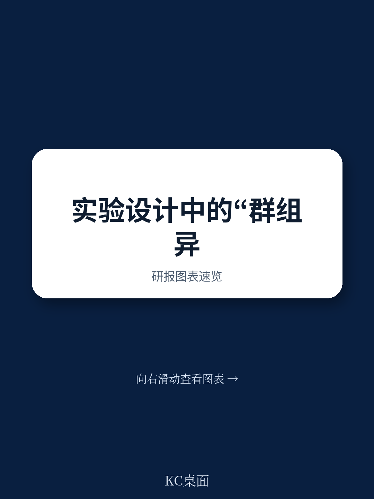
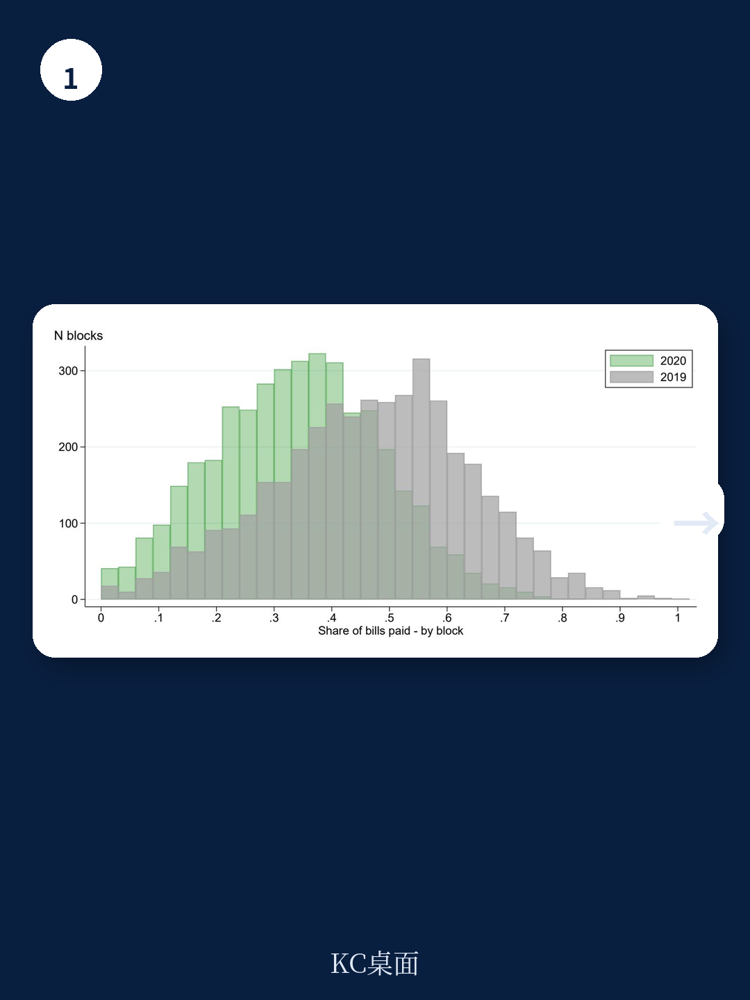
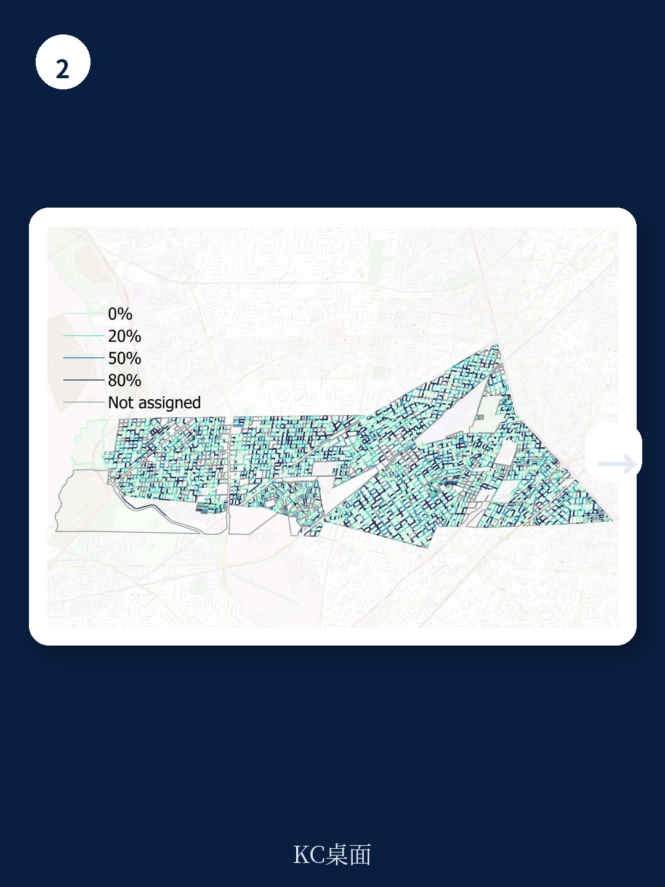

# 世界银行：你低估了集群实验中的“大小不均”代价

如果你正在设计一项涉及社区、学校或企业的随机实验，有一个假设可能正在悄悄侵蚀你的统计功效——而这个假设，很多研究者甚至没有意识到自己在做。

世界银行最新一期政策研究工作论文（编号11059）直面了一个长期被实验设计文献回避的问题：当集群规模不均、且不同集群的结局分布本身就有系统性差异时，你的实验可能远没有你想象的那么有力。

这份报告的核心判断是：**忽略集群异质性，不仅会让实验严重“动力不足”，还会让你对结果的信心建立在错误的标准误估计之上。**

这不是一个纯方法论问题。它直接影响你如何判断一项政策是否有效、需要多大样本才能检测到真实效果、以及你该把资源投放到哪些集群上。

## 1. 集群异质性不是噪音，而是被系统低估的方差来源

我们通常理解集群实验的方差构成时，会想到两个因素：个体观测之间的独立性假设被打破带来的“设计效应”，以及组内相关系数。但这份报告指出，还有两个被广泛忽略的方差来源：集群规模的差异，以及不同集群之间结局分布的系统性差异。

为了说明这一点，报告做了一个简单的数值模拟。假设有200个集群，其中10个大型集群各含100个单位，其余190个小型集群各含25个单位。大型集群的平均结局是1，小型集群是0。组内相关系数设定为0.5。

如果研究者完全忽略集群异质性，按照标准公式计算，在80%统计功效下能检测到的最小效应量是0.29个标准差。但一旦将集群规模差异纳入考量，实际功效降至69%。如果再考虑结局分布的异质性，真实功效只有48%。

换句话说，你自以为设计了一个80%把握的实验，实际上只有不到一半的概率能检测到你想找的效果。

> **KC评论：** 这个数字差距不是边际性的，而是根本性的。对于任何需要在真实世界中分配有限资源的决策者来说，48%对80%意味着你很可能在投入大量资金后得到一个“不显著”的结论，然后错误地认为政策无效。完整报告中的Figure 2直观展示了三条功率曲线的差距，值得仔细对比。

## 2. 标准误被高估，推断变得过度保守

报告的第二项核心发现更反直觉：当集群存在异质性时，常用的集群稳健标准误估计量实际上存在向上的偏误。

直觉上，稳健标准误的设计初衷是为了应对异方差和组内相关，按理说应该更可靠。但报告通过严格的渐近分析证明，在集群异质性存在的情况下，这个估计量系统性高估了真实方差。

这意味着什么？意味着你基于这个标准误做的统计推断是保守的——你的置信区间比它应该有的更宽，你的p值比它应该有的更大。你可能会错过一些真实存在的效应。

但这并不是一个好消息。因为保守不等于安全。在实际操作中，研究者看到“不显著”的结果后，往往会放弃进一步探索，而不是意识到可能是自己的推断工具太钝了。过度保守的推断，和过度激进的推断一样，都会导致错误决策。

> **KC评论：** 这里有一个微妙的权衡。如果你知道标准误被高估，你可能会想“那我用更小的标准误不就行了？”但问题在于，你无法准确知道偏误的大小。报告给出的建议方向是：在设计阶段就充分考虑集群异质性，而不是事后试图修正。这正是为什么这份报告的方法论贡献对实践者有直接价值——它给出了在设计阶段就能用上的方差公式和功效计算公式。

## 3. 最优分配比例：不是简单的50/50

报告在给出方差公式的基础上，进一步推导了最优的集群分配概率。这个问题的核心是：在给定总样本量和预算约束下，你应该把多大比例的集群分配到纯控制组、多大比例分配到不同的处理饱和度？

直观上，你可能会认为应该平均分配。但报告证明，最优分配取决于各处理组之间方差项的相对大小。公式解给出了一个清晰的指引：纯控制组的比例应该与其他处理组的方差加权平方根成反比。

这个结论的实践含义是：如果你的高饱和度处理组方差特别大，你可能需要把更多集群分配到那个组，以稳定估计量；反之，如果纯控制组的方差特别大，你可能需要增加控制组的比例。

这不是一个理论上的细枝末节。在报告后续的实地实验中，他们正是基于这些公式来设计分配方案的。

## 4. 阿根廷房产税实验：溢出效应确实存在，但依赖饱和度

报告的实证部分基于在阿根廷开展的一项大规模实地实验。研究者向随机选中的住宅寄送个性化信件，提醒房产税缴纳信息。实验设计的关键创新在于：他们不仅测量了直接收到信件的人是否更可能缴税，还测量了同一街区内未收到信件的邻居是否也受到影响。

结果清晰：直接收到信件的群体，缴税率显著提高。更重要的是，在同一街区内、未收到信件的邻居，缴税率也高于纯控制街区中的纳税人。溢出效应是真实存在的。

但这个效应的大小高度依赖于处理饱和度。在高饱和度街区（即街区内收到信件的人比例较高），溢出效应更大、估计更精确。具体来说，在历史纳税记录较好的群体中，未收到信件的邻居缴税率提高了2.6个百分点，而直接效应约为5.1个百分点。

这个发现对政策设计的含义很直接：如果你希望通过信息干预产生社区层面的行为改变，你需要达到一定的“临界质量”。零星的干预可能不足以产生可检测的溢出效应。

> **KC评论：** 2.6个百分点的溢出效应，在绝对值上可能看起来不大，但考虑到这是“什么都没收到”的人的行为变化，这个效应已经相当可观。报告没有完全展开的一个问题是：这种溢出效应是通过什么机制传导的？是邻里之间的直接交流，还是观察到对方的行为后产生的社会规范压力？不同的机制意味着不同的政策复制条件。完整报告中对实验设计的细节描述，包括如何定义街区、如何分配饱和度，都值得仔细阅读。

## 5. 报告尚未完全回答的关键问题：异质性来源的分解

这份报告在方法论上做出了重要贡献，但它也留下了一个关键问题：当你发现集群异质性导致功效下降时，你如何判断这种异质性主要来自规模差异还是结局分布差异？

报告给出了一个中间情形——当集群规模不同但结局分布相同时，功效计算可以简化。但在实际应用中，研究者很难事先知道结局分布是否相同。如果错误地假设结局分布相同，你可能会再次陷入低估方差的问题。

另一个未完全展开的问题是：集群异质性的来源本身是否可以被建模和预测？如果大型集群的系统性特征（如更高的平均收入、更好的基础设施）可以解释其结局差异，那么这些特征本身是否应该被纳入实验设计？

报告在结论部分提到了这些方向，但没有给出完整的解决方案。这恰恰是这篇论文之后最值得跟进的研究方向。

## 6. 对实践者的观察框架：三个必须问自己的问题

基于这份报告的核心发现，如果你正在设计或评估一项集群实验，有三个问题值得在开始之前认真回答：

第一，你的集群规模分布是什么样的？不要只看平均值。报告中的Figure 1展示了六个真实实验的集群规模分布，差异巨大。如果你的分布有长尾——少数集群非常大——那么标准公式可能严重低估所需样本量。

第二，不同集群的基线结局是否存在系统性差异？如果你有基线数据，直接比较不同规模集群的均值。如果大型集群的系统性特征与结局相关，你必须将其纳入方差计算。

第三，你的实验是否有足够的“处理饱和度”来检测溢出效应？报告中的实证表明，溢出效应不是自动发生的，它需要一定的处理强度。如果你的设计是稀疏处理——每个集群只处理少数单位——你可能根本没有能力检测到溢出效应，无论样本量多大。

这三个问题都不是理论问题，而是设计决策。回答它们需要数据，但报告给出的公式和模拟工具使得这些计算变得可行。

**这份报告的价值不在于它推翻了什么，而在于它让一个长期被忽略的问题变得可量化、可操作。**

如果你正在设计一项涉及社区、学校或企业的实地实验，或者你正在评估别人设计的实验是否可靠，那么完整报告中的公式推导、模拟结果和实证细节，都是值得你花时间仔细研究的。

更多国际信源汇编与评论，扫码交流。每日更新，汇总国际主流叙事、数据与图表，观测边际变化。社群汇聚了头部券商、PE/VC、投行、并购、对冲基金、资管机构、战略咨询、智库等朋友，期待与你交流。

Personal reading notes and learning share only. Not investment advice.

