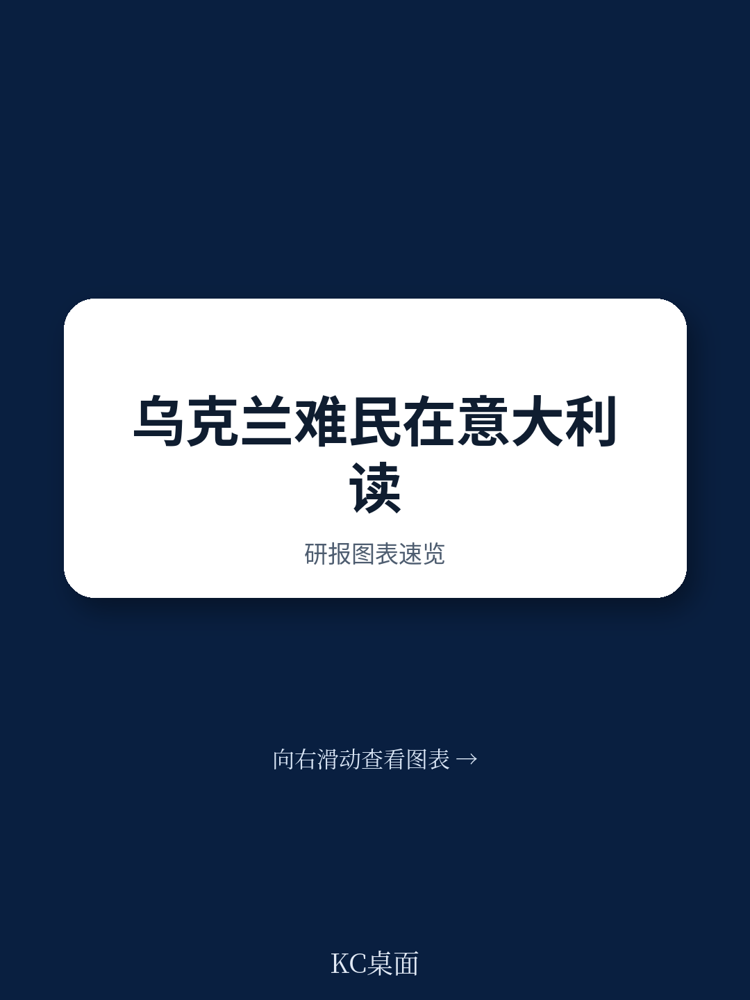
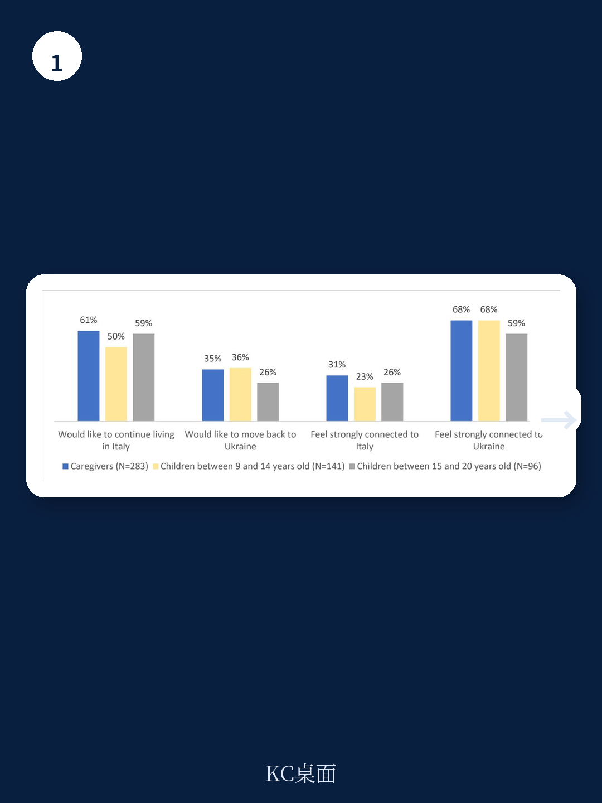
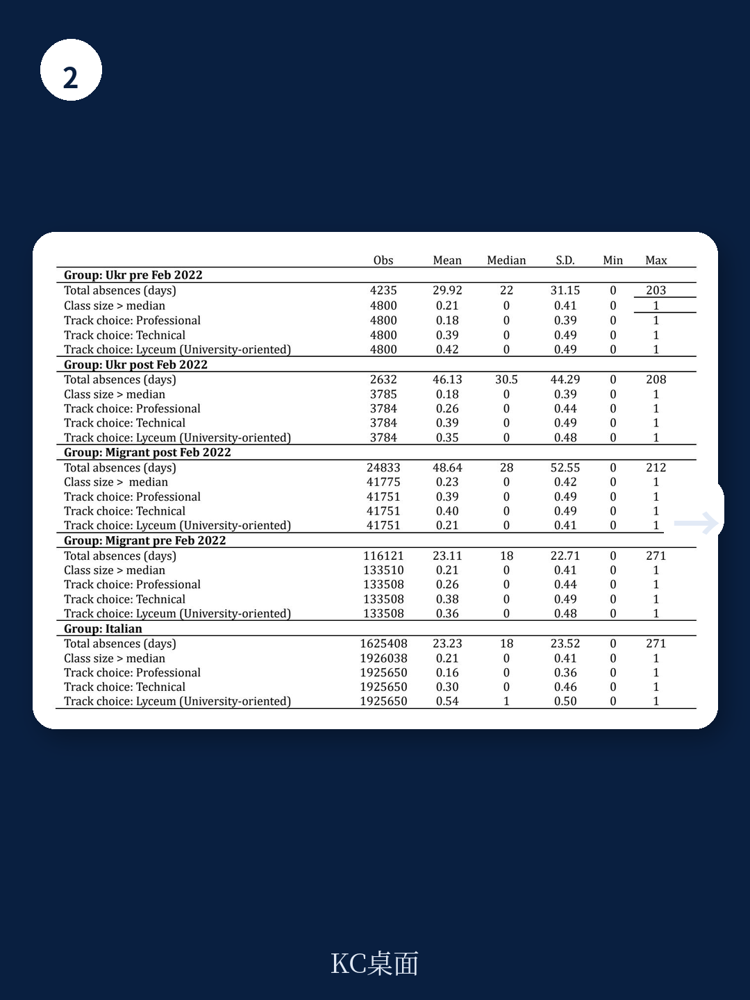

# 世界银行：乌克兰难民学生融入意大利学校，比想象中更难

2022年俄乌冲突爆发后，超过600万乌克兰人被迫流离失所，其中近600万涌入欧盟国家。意大利作为第五大接收国，迎来了约17万乌克兰难民。当这些孩子坐进意大利教室，他们面临的不仅是语言障碍，还有一场关于人力资本能否被挽救的严峻考验。

世界银行最新发布的工作论文《Displaced Learners: Early Integration of Ukrainian Refugee Students into Italy‘s Schools》，利用意大利教育部和INVALSI的行政数据（覆盖2021-22至2023-24学年），首次系统量化了这批特殊学生的教育融入状况。核心判断并不乐观：乌克兰难民学生的入学率显著偏低、缺勤率是本地学生的两倍、语言类科目成绩大幅落后。但报告同时揭示了一个反直觉的发现——尽管成绩不佳，意大利教师却更倾向于推荐乌克兰难民学生进入大学预科方向的高阶教育轨道。

这种“教师乐观主义”能否转化为实际的教育成果，取决于一个关键变量：语言支持与心理干预能否在短期内到位。而世界银行的数据显示，意大利现有的支持体系可能远远不够。

> **KC评论：** 这份报告的价值不在于它揭示了“难民学生成绩差”这个常识，而在于它用行政数据精确量化了差距的规模，并拆解了“教师推荐”与“实际成绩”之间的背离。对于关注欧洲教育政策、移民融入或人力资本投资的读者，这份报告提供了难得的微观证据。完整报告包含了分年级、分科目的详细回归表格，以及教师问卷的一手数据，建议领取原文细读。

## 1. 入学率缺口：不是难民不想上学，而是系统接不住

报告数据显示，在2022-23学年，乌克兰难民学生在意大利中学阶段的注册总数为8012人，仅占同期意大利中学总学生数的0.19%。这个比例看起来不大，但考虑到乌克兰难民儿童总数约为2.3万人（含小学），中学阶段的入学率明显偏低。

更值得关注的是年级分布。乌克兰难民学生集中在较低年级：Grade 6至Grade 9四个年级合计占比约69%，而Grade 12和Grade 13合计仅占9.4%。对比之下，其他外国移民学生（2022年2月后抵达）的年级分布更为均匀。这种“低年级集中”的现象，反映出两个问题：一是高年级学生面临更大的学业衔接困难，可能直接放弃入学；二是家庭可能更倾向于让年幼的孩子接受教育，而让年长的孩子帮助家庭生计或等待局势变化。

与战前就已居住在意大利的乌克兰学生（约1.06万人）相比，难民学生的入学率下降更明显。战前乌克兰学生在各年级的分布相对均衡，而难民群体在高中阶段（Grade 10以上）的缺口尤其刺眼——Grade 13仅有275名难民学生注册，而战前乌克兰学生有900人。

> **KC评论：** 入学率数据的背后是一个残酷的现实：高年级难民学生正在被系统性地“漏掉”。他们可能已经错过了最佳的语言学习窗口，也可能因为对未来缺乏确定性而放弃长期投入。完整报告中包含按省份和城市类型拆分的入学率数据，能帮助判断哪些地区的接收压力最大、政策效果最差。

## 2. 缺勤率翻倍：这不是“逃学”，是多重困境的信号

世界银行的数据显示，2022-23学年，乌克兰难民学生平均缺勤46.13天，而意大利本地学生仅为23.23天，战前乌克兰学生为29.92天。即便与其他同期抵达的外国移民学生（48.64天）相比，乌克兰难民学生的缺勤率也处于高位。

缺勤率背后是多重因素的叠加。语言障碍导致课堂参与度低，学生可能产生逃避心理；心理创伤——许多孩子亲历了战争、分离和流离失所——直接影响他们的学习意愿和能力；家庭的临时安置状态（频繁更换住所、父母在找工作中）也使得规律上学变得困难。

报告特别指出，缺勤率在高中阶段（Grade 9以上）显著更高。这并不意外：高中课程对语言能力的要求更高，学业压力更大，学生更容易产生“跟不上就放弃”的循环。

## 3. 语言是最大的坎，但数学成绩暴露了另一个问题

在标准化测试（INVALSI）中，乌克兰难民学生的表现呈现鲜明的科目分化。

意大利语成绩：难民学生比本地学生低约11.7分（标准化分数），差距在统计上显著。英语成绩：低约16.4分，同样显著。数学成绩：仅低约4.5分，且统计上不显著——这意味着在数学科目上，乌克兰难民学生与本地学生的差距并不明显。

这个结果既令人欣慰，也值得警惕。数学成绩相对较好，说明乌克兰难民学生并非“学习能力不足”，他们拥有良好的基础教育背景（乌克兰的教育体系以数学和科学见长）。但语言类科目的巨大差距，意味着如果不在语言支持上加大投入，这些孩子的数学优势也会随着年级升高而逐渐丧失——因为高阶数学同样需要语言能力来理解题目和表达思路。

> **KC评论：** 数学成绩的“相对优势”是一个典型的“窗口期”信号。如果意大利学校能在1-2年内提供高强度语言辅导，这批学生完全有可能追上来；如果错过这个窗口，语言差距会演变成全面的学业落后。完整报告中有按年级和性别拆分的详细成绩对比，能更精确地判断哪个年级是干预的关键节点。

## 4. 教师推荐与成绩的背离：乐观主义能改变结果吗？

报告最反直觉的发现来自教师推荐数据。在Grade 8（相当于初中毕业）时，意大利教师需要为学生推荐高中教育方向（大学预科/技术/职业）。按常理，成绩较差的学生应该被推荐到技术或职业方向，但数据显示：乌克兰难民学生被推荐进入大学预科方向（Lyceum）的比例，不仅高于其他同期抵达的外国移民学生，甚至略高于战前乌克兰学生。

报告将这个现象解释为“教师对乌克兰学生潜力的乐观评估”。教师们似乎认为，语言障碍是暂时的，只要克服了这一关，乌克兰学生的学业表现会快速提升。

这种乐观有道理吗？从数学成绩来看，教师们的判断并非毫无根据。但风险同样明显：如果语言支持跟不上，这些被推荐到大学预科方向的学生可能会在高年级遭遇更大的挫败感，反而导致辍学率上升。教师的善意，需要配套的政策来兑现。

## 5. 报告没有完全回答的关键问题：干预的“剂量”和“时机”

世界银行的这份报告提供了扎实的描述性证据，但它在几个关键问题上留下了空白。

第一，语言干预的“有效剂量”是多少？报告指出语言障碍是核心瓶颈，但没有给出具体建议——每周需要多少小时的意大利语辅导？持续多久？是融入课堂还是单独设班？

第二，心理支持的覆盖面如何？报告提到心理创伤是障碍之一，但意大利学校的心理支持资源极为有限，且难民学生可能因为文化差异而不愿求助。

第三，教师推荐与实际升学结果之间是否存在落差？报告只追踪到推荐阶段，没有后续的升学数据。如果教师推荐了大学预科方向，但学生因为成绩跟不上而最终转入技术学校，那这种“乐观”就变成了“误导”。

第四，长期来看，这些学生能否在意大利劳动力市场中实现人力资本的转化？教育融入只是第一步，就业融入才是最终目标。报告没有涉及这个维度。

> **KC评论：** 这些未解问题恰恰是这份报告最有价值的地方——它指明了下一步研究和政策设计的方向。对于关注教育公平或移民政策的读者，完整报告中的教师问卷数据和分学校类型的分析，能提供更细致的干预思路。

## 6. 对决策者的观察框架：五个指标判断融入进程

基于世界银行的数据和逻辑，我们提炼出五个可追踪的关键指标，用来判断乌克兰难民学生的教育融入是否在朝正确方向走。

指标一：入学率的变化斜率。如果入学率在2023-24学年出现明显反弹，说明接收系统的“吸收能力”在提升；如果继续停滞甚至下降，说明结构性障碍未被解决。

指标二：语言成绩的追赶速度。INVALSI意大利语成绩的年度变化，是衡量语言干预效果的最直接指标。如果差距在缩小，说明措施有效；如果差距扩大，说明需要调整策略。

指标三：缺勤率的分化。如果难民学生的缺勤率逐渐接近本地学生水平，说明他们的社会融入在改善；如果缺勤率居高不下，需要排查家庭经济状况和心理支持是否到位。

指标四：教师推荐的“兑现率”。被推荐到大学预科方向的学生，实际升入该方向的比例，以及后续的学业完成情况，是检验教师判断是否准确的关键。

指标五：高中阶段的流失率。Grade 10以上的难民学生数量，是衡量整个教育系统“留人能力”的终极指标。如果高年级学生大量流失，说明前期投入的效果在后期被抵消了。

## 结语：一场关于人力资本的“时间赛跑”

世界银行的这份报告，本质上是在回答一个问题：当一个国家突然接收大量因战争流离失所的学龄儿童时，教育系统能否在短期内完成“吸收”和“追赶”的双重任务？

对于意大利而言，答案尚不明朗。乌克兰难民学生拥有较好的基础教育底子（数学成绩证明了这一点），但语言障碍、心理创伤和不确定的未来，正在侵蚀他们的学习动力和机会。教师的乐观主义是一个积极信号，但如果没有配套的语言支持和心理干预，这种乐观可能变成一种“不负责任的期待”。

这场赛跑的最终结果，不仅关乎8000多名乌克兰难民学生的个人命运，也将影响欧洲各国未来如何应对大规模人口流动时的教育政策设计。世界银行的数据已经敲响了警钟，但警报声能否转化为行动，取决于政策制定者是否愿意在“短期成本”和“长期收益”之间做出正确的权衡。

---

**更多关于乌克兰难民学生教育融入的详细数据、分科目成绩对比、以及教师问卷的一手分析，已收录在我们的完整研报解读中。欢迎扫码加入社群，领取完整报告原文与解读图表，与来自头部券商、PE/VC、投行、战略咨询、智库的朋友一起，追踪全球教育政策与人力资本投资的边际变化。**

Personal reading notes and learning share only. Not investment advice.

