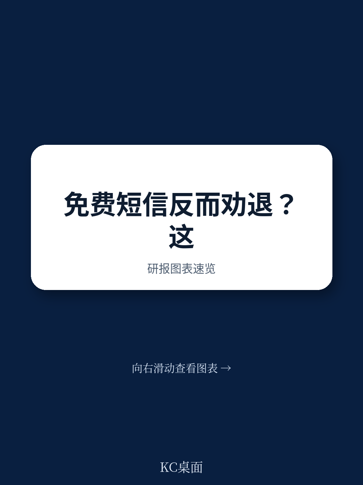
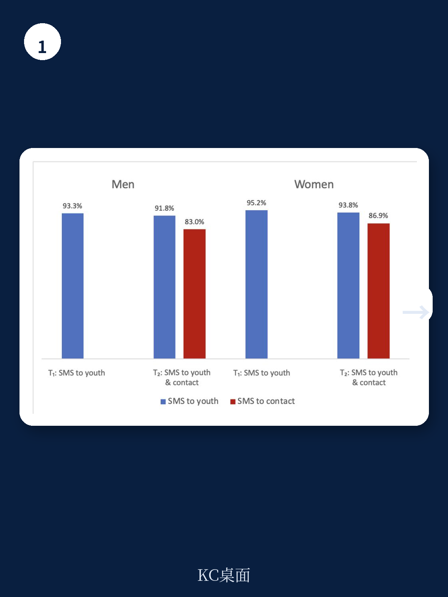
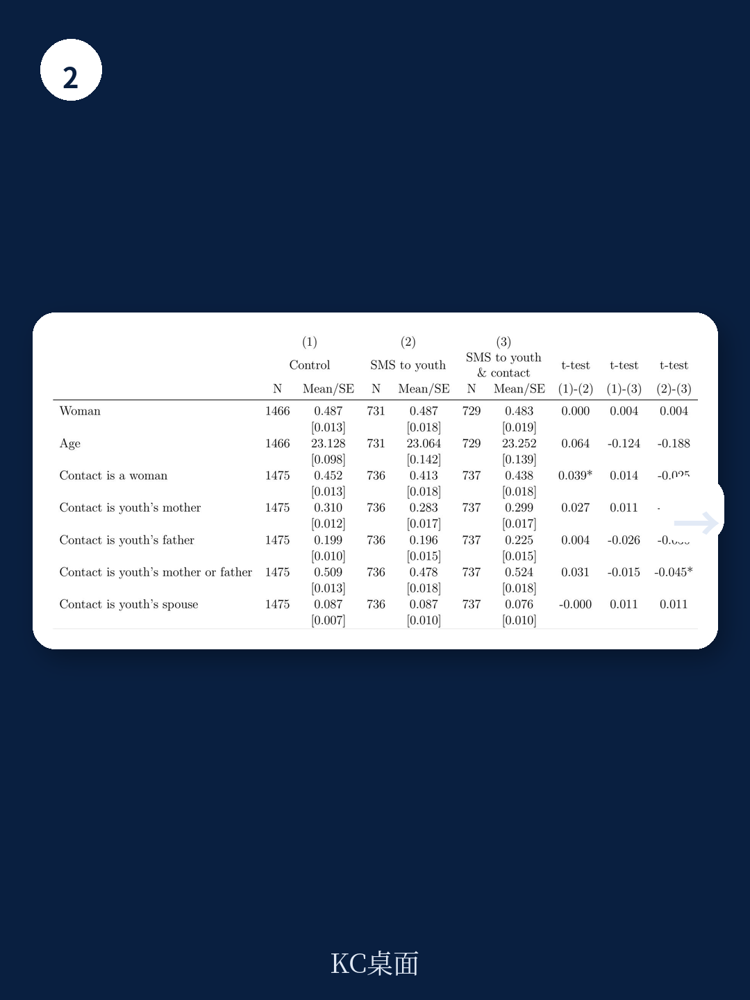

# 世界银行：免费短信反而劝退，就业项目招生的“信任悖论”

一个旨在提升青年就业项目参与率的短信提醒，最终却让报名率下降了超过40%。这不是技术故障，而是世界银行一份最新政策研究工作论文揭示的“信任悖论”：当你告诉潜在受益者一个项目“完全免费”时，对于那些不了解你、不信任你的人而言，这句话听起来更像是一个陷阱，而不是一个机会。

这份由Jeannie Annan等六位研究者完成的随机实验，在科特迪瓦针对一个青年就业培训项目PRO-Jeunes进行。实验设计直接且精妙：将2,926名已表达参与意愿的合格青年随机分为三组——第一组仅向青年本人发送“项目免费”的短信提醒；第二组同时向青年及其事先指定的联系人发送相同短信；第三组为对照组，不发送任何短信。结果令人意外：仅联系青年本人几乎没有效果，但一旦将短信同时发送给联系人，男性青年的报名率从43.8%骤降至25.2%，降幅达42.4%；女性青年的报名率也从38.5%降至30.7%，降幅20.2%。

这组数据背后，是一个在发展中国家政策实施中常被忽视、却至关重要的变量：信任。

## 1. “免费”信号在信息不对称的环境下可能反向触发质量怀疑

经济学中有一个经典悖论：当消费者缺乏对产品的充分了解时，低价或免费可能被解读为低质量的信号。Bagwell和Riordan在1991年的经典论文中已经论证了这一机制——高价格可以传递产品质量信号，而免费则可能适得其反。

这份世界银行的研究将这一理论从消费品市场延伸到了公共政策领域。在科特迪瓦的语境下，青年和他们的联系人对于“免费培训”的直觉反应不是“太好了”，而是“为什么免费？是不是没有价值？是不是骗局？”

研究中的定性访谈提供了关键证据：受访者明确表示，短信中“免费”这个信息本身是正面的，但它同时引发了两种负面联想——要么是项目质量低劣，要么是诈骗。多位受访者建议，短信应该强调提供项目的组织是否可信，而不是价格标签。换言之，在信任基础设施薄弱的环境中，价格信号被扭曲了。

> **KC评论：** 这对所有在发展中国家运营的社会项目、公益组织和商业机构都是一个警示。当你试图用“免费”或“低价”作为获客手段时，必须同时解决“为什么免费”的信任问题。否则，营销投入可能不仅无效，还会产生反效果。完整报告中的定性访谈摘录和具体受访者原话，比这个总结更为生动，值得细读。

## 2. 联系人机制的双刃剑效应：信任的放大器，也是怀疑的扩散器

这项研究最独特的贡献在于揭示了“联系人”这一信息传递渠道的复杂作用。许多发展项目试图通过“关键联系人”或“意见领袖”来扩大信息覆盖面，但这份报告证明了这一策略的风险。

当短信仅发送给青年本人时，由于他们已经参加过项目的预登记说明会，对实施组织——国际救援委员会——有了一定的了解和信任，因此“免费”信息没有产生负面效果。但当短信同时发送给联系人时，这些联系人并没有参加过任何说明会，他们对项目的了解仅限于这条“免费”短信。在缺乏信任基础的情况下，联系人反而成为了怀疑情绪的放大器。

研究数据显示，约一半的青年将父母列为联系人，另有9%将配偶列为联系人。定性访谈进一步揭示，青年选择联系人时往往基于亲密关系或对方的职业经验，并期待他们提供“重要指导”。当这些“指导者”对项目产生怀疑时，他们的负面态度直接转化为对青年报名的劝阻。

这引出一个关键问题：在推广社会项目时，信息传递的“中间人”是否经过信任校准？如果中间人本身对项目缺乏了解和信任，他们不仅不是助力，反而会成为阻力。

## 3. 性别与信任的交叉点：女性联系人为何能抵消负面效应

研究最细腻的发现来自性别维度的分析。当将联系人按性别分组后，一个清晰的模式浮现出来：所有男性青年，无论其联系人是男性还是女性，在同时收到短信后报名率都显著下降。但对于女性青年，情况更为复杂——只有当联系人是男性时，报名率才显著下降（降幅30.3%）；当联系人是女性时，下降效应完全消失，统计上不显著。

这组数据意味着什么？研究者提出了两种可能的解释：第一，女性联系人可能对青年女性面临的就业市场限制有更清醒的认识，因此对“免费培训”的怀疑程度低于男性联系人；第二，女性联系人可能更了解项目的实际价值，或者更信任实施组织。但研究者也坦诚指出，这些发现受限于“联系人选择偏差”——选择女性联系人的青年本身可能与选择男性联系人的青年存在系统性差异。

> **KC评论：** 这里的性别差异不是简单的“女性更信任”，而是揭示了信任在特定社会关系网络中的分布不均匀。完整报告中对这一结果的稳健性检验和讨论更为深入，包括将分析限制在“联系人是父母”的子样本后，结论是否仍然成立。这些细节对于设计针对不同性别的沟通策略至关重要。

## 4. 报告尚未完全回答的关键问题：信任如何被构建，而不是被假设

这份研究的价值不仅在于它揭示了一个反直觉的现象，更在于它提出了一个更根本的问题：在政策实施中，我们是否过度假设了“信息传递”的有效性，而忽视了“信任构建”的必要性？

报告明确指出，未来研究需要回答几个关键问题：第一，如何在推广前系统性地构建信任，而不仅仅是依赖项目本身的声誉？第二，联系人选择背后的偏差如何影响我们对性别效应的解读？第三，不同的信息框架——例如强调项目质量而非免费——是否能产生不同的效果？

报告附录中提到了一个有趣的线索：另一种强调项目长期收益的短信，在发送给青年和联系人时，对男性产生了抑制效应，但对女性却产生了促进效应。这一结果因统计显著性不足而未在正文中展开，但它暗示了一个方向：信息框架的性别适配可能比我们想象的更为重要。

## 5. 对读者的观察框架：三个维度评估任何“免费”推广策略

基于这份世界银行的研究，我们可以提炼出一个适用于评估任何“免费”推广策略的三维框架：

第一，信任基础设施维度。目标受众对实施主体是否有预先了解和信任？如果没有，免费策略需要搭配信任构建的前置环节。研究中的青年之所以对仅发送给自己的短信没有负面反应，正是因为他们已经参加过预登记说明会。

第二，信息中介维度。信息是否通过第三方传递？这些第三方对项目的信任程度如何？如果第三方缺乏信任，他们可能成为怀疑的放大器而非信息的扩散器。

第三，性别与社会网络维度。目标受众和中介的性别组合是否影响了信息解读？研究显示，女性-女性的组合可能是唯一不受负面效应影响的群体，这提示我们需要更精细地理解社会网络中的信任分布。

这三个维度不是孤立的，而是相互作用的。一个在信任基础设施薄弱地区、通过不信任项目的男性联系人、向男性青年传递“免费”信息的策略，几乎必然会失败。

## 6. 从“信息传递”到“信任设计”：政策沟通的下一个前沿

这份世界银行的研究最终指向了一个更大的范式转换：政策沟通不应被视为“信息传递”问题，而应被视为“信任设计”问题。在发展中国家，尤其是在社会信任资本较低的环境中，一个项目的成功不仅取决于其内容的质量，还取决于受众是否相信这个内容是真实的。

研究者提出的建议——在强调免费之前先建立信任、利用现有的信任网络（如宗教或教育机构）、针对不同受众定制信息——看似常识，但在实际政策实施中往往被忽略。原因很简单：信任构建需要时间和资源，而大多数项目面临的是紧迫的时间表和有限的预算。

但这份研究的数据给出了一个清晰的成本收益信号：错误的沟通策略不仅浪费资源，还会产生负面的净效果。与其花预算发送可能适得其反的短信，不如将资源投入到更早期的信任构建活动中。

> **KC评论：** 这份报告最值得深思的，不是“免费不好”这个结论，而是它揭示了“信任”在政策实施中作为一种生产要素的存在。就像经济学家谈论人力资本、社会资本一样，信任资本也需要被测量、被投资、被管理。完整报告中关于定性访谈的细节、不同信息框架的对比实验、以及研究方法的严谨性讨论，都是理解这一结论深度的必要背景。

***

这份世界银行的研究论文为我们提供了一个罕见的视角：一个设计精良的随机实验，如何揭示出政策实施中那些被忽视的“软变量”——信任、社会关系、性别动态——对项目效果的巨大影响。它提醒我们，在追求规模化和效率的同时，不能忽视那些无法被快速复制的社会基础设施。

如果你对如何将这份研究的洞察应用到实际项目设计、投资评估或政策分析中感兴趣，欢迎加入我们的社群。我们每天汇总国际主流信源的最新研究与数据，涵盖世界银行、IMF、各大投行和智库的前沿成果。社群中已有来自头部券商、PE/VC、投行、并购、对冲基金、资管机构、战略咨询和智库的朋友们，期待与你交流如何从这些研究中提炼出可操作的判断框架。

Personal reading notes and learning share only. Not investment advice.

