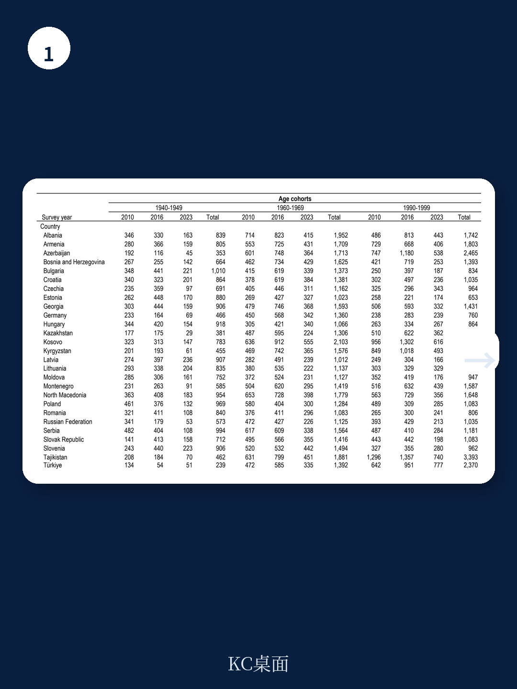
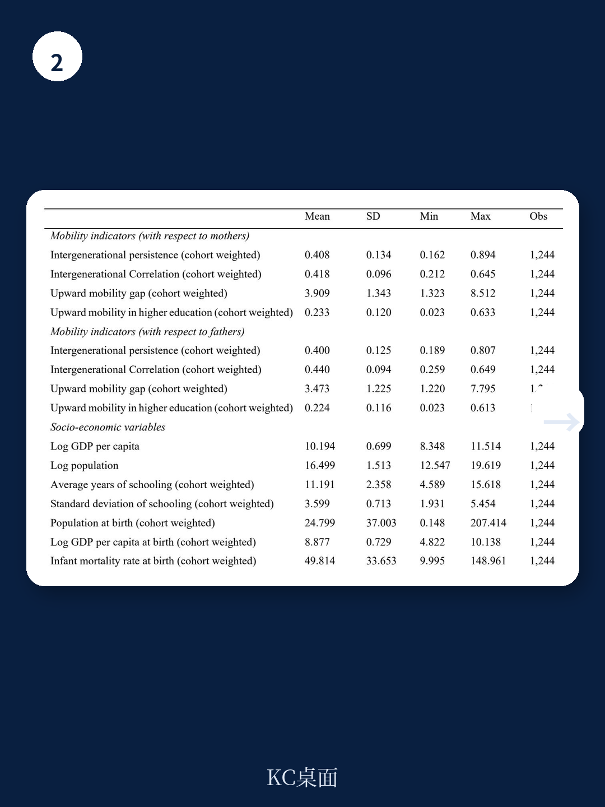

# 世界银行：社会流动性未必直接拉动经济增长，真正起作用的是“谁在向上流动”

社会流动性越高，经济就越发达——这似乎是直觉上最合理的假设。如果一个社会能让更多底层孩子凭借才华而非出身改变命运，人才配置效率提高，创新和增长理应加速。世界银行最新发布的工作论文《Does Social Mobility Affect Economic Development?》却给出了一个远更复杂、甚至反直觉的答案：用不同方式测量社会流动性，得出的结论截然不同。有些情况下，更高的相对流动性反而与更低的收入水平相伴出现。

这份覆盖68个国家、跨越2000至2020年面板数据的研报，真正有价值的判断并非“社会流动性是否重要”，而是“在什么发展阶段、用什么指标衡量，社会流动性与经济增长的关系才成立”。对于正在制定人才政策、教育投资或区域发展战略的决策者来说，这一区分比泛泛谈论“促进社会流动”要关键得多。

---

## 1. 欧洲与中亚地区：只有“高等教育向上流动”与经济增长显著正相关

世界银行将68个国家划分为四个区域进行分组回归，结果差异显著。在欧洲与中亚地区，无论是用代际教育持久性（IP）还是代际教育相关性（IC）来衡量的相对流动性指标，都与人均GDP没有统计上显著的关系。真正与经济增长正相关的，只有一个特定的绝对流动性指标——高等教育向上流动概率（UMHE），即父母未受过高等教育的子女完成高等教育的概率。

这意味着，在欧洲与中亚，社会整体是否“公平”并不直接转化为经济产出。真正产生经济回报的，是那些原本没有高等教育背景的家庭中，子女通过教育实现了向上跃迁的那部分人群。这背后的逻辑是：这批人往往是边际收益最高的群体——他们从低技能岗位转向高技能岗位的劳动生产率提升幅度，远大于高知家庭子女的教育延续。

> **KC评论：** 这个发现对政策制定者意味着一个重要的取舍：与其追求整个教育体系的“公平度”，不如将有限资源精准投向那些“第一代大学生”的获取门槛。提高这批人的高等教育完成率，对经济增长的拉动效果可能远大于降低全社会的教育基尼系数。完整报告中还比较了不同时间窗口的滞后效应，值得关注的是，这一正相关关系在更长的时间跨度下是否仍然成立，或者是否会衰减。

---

## 2. 拉丁美洲的悖论：相对流动性越高，收入反而越低

拉丁美洲和加勒比地区的回归结果，是整份报告中最具冲击力的部分。数据显示，当用IP或IC这类相对流动性指标衡量时，社会流动性越高，人均GDP反而越低。这一负相关关系在统计上显著，且在不同模型设定下稳健。与此同时，绝对流动性指标（如UMHE）与收入的正相关关系在欧洲与中亚地区同样成立。

如何理解这一悖论？研报给出的解释方向是：在拉美，较高的相对流动性可能并非源于底层向上流动的改善，而是因为中层或上层家庭的子女出现了教育向下流动。换句话说，如果富裕家庭的孩子受教育的年限在缩短，代际相关性会下降，但这并不意味着贫困家庭的孩子在上升。这种“虚假流动性”不仅不促进增长，反而可能伴随着人力资本整体水平的下降。

> **KC评论：** 这个发现对新兴市场的投资者和政策观察者来说是一个重要提醒。不要只看“流动性指数”是否在改善，要拆开看：是底层在上升，还是顶层在下降？如果是后者，流动性改善可能是一个危险信号而非积极信号。报告中对拉美数据做了多个稳健性检验，包括贝叶斯模型平均分析，来确认这一负相关关系的可靠性。但报告也承认，目前的数据还不足以完全排除遗漏变量导致的内生性问题——比如，是否某些共同因素（如宏观经济波动）同时导致了流动性上升和收入下降。

---

## 3. 新测量工具的引入：“定向流动性缺口”比传统指标更敏感

世界银行在这份报告中首次实证应用了一种新的社会流动性测量方法——定向流动性缺口（Oriented Mobility Gap）。与传统指标相比，这一方法有两大优势：第一，它区分了向上流动和向下流动的方向，而不仅仅是计算整体“变动量”；第二，它包含了流动的“距离”，即子女与父母教育年限的绝对差距，而不仅仅是是否跨越某个门槛。

在实证结果中，这一新指标在多个区域都表现出了与传统指标不同的模式。例如，在欧洲与中亚，定向流动性缺口与经济增长的关系在统计上并不显著，而高等教育向上流动概率却是显著的。这说明，新指标虽然更精细，但并非在所有情境下都更能预测经济增长。研报也坦承，这是该指标的首次应用，其在不同发展水平和数据质量下的表现仍需进一步验证。

> **KC评论：** 对于关注政策评估和指标设计的读者来说，这份报告的方法论部分本身就是一篇值得细读的独立文献。它展示了为什么“用什么指标衡量”有时比“是否在改善”更重要。完整报告中详细讨论了定向流动性缺口的公理基础，以及与现有指标的对比表格，这些内容在公开摘要中几乎没有展开。

---

## 4. 报告尚未完全回答的关键问题：因果方向与机制路径

尽管世界银行使用了面板数据和多种稳健性检验，但这份报告并未宣称建立了社会流动性与经济增长之间的因果关系。目前的分析仍然主要停留在“关联性”层面，而非“因果性”。具体而言，有三个关键问题尚未解决：

第一，反向因果的可能性。经济增长本身可能通过增加教育投入、改善公共基础设施，从而提升社会流动性。如果是这样，那么观察到的正相关关系可能主要反映的是增长对流动性的影响，而非流动性对增长的驱动。

第二，遗漏变量问题。社会流动性高和经济增长快的国家，可能同时受益于其他因素——如制度质量、法治水平、开放程度——而这些因素才是真正的增长引擎。报告虽然做了包含区域固定效应和时变控制变量的回归，但无法完全排除这一可能性。

第三，机制路径的模糊性。即使接受社会流动性促进增长这一方向，其传导机制究竟是“更有效的人才配置提高了全要素生产率”，还是“社会流动性降低了社会不满和政治风险进而改善了投资环境”，抑或是其他路径？报告没有提供机制检验。

---

## 5. 对观察者的框架：不要只看一个指标，要区分“谁在流动”和“向哪里流动”

综合世界银行的发现，对于跟踪全球经济发展和社会政策变化的读者来说，可以建立一个更清晰的观察框架。

第一步，区分绝对流动性和相对流动性。绝对流动性关注的是“是否有更多人实现了教育水平的代际提升”，相对流动性关注的是“家庭背景对教育结果的影响是否减弱”。两者可能朝相反方向变化。

第二步，在绝对流动性中，重点关注“底层向上流动”而非“整体平均流动”。报告表明，真正与增长挂钩的是那些原本处于教育劣势群体的向上突破，而非全社会教育年限的普遍提升。

第三步，注意区域异质性。同一指标在不同地区可能指向完全不同的经济含义。拉美和欧洲的对比说明，在解释社会流动性数据时，必须结合当地的教育结构、劳动力市场特征和发展阶段。

第四步，警惕“虚假流动性”。当相对流动性改善时，要追问：是底层在上升，还是顶层在下降？如果是后者，这可能意味着人力资本存量的流失，而非效率的提升。

---

这些框架和方法，在公开摘要中只能点到为止。完整报告提供了68个国家的详细数据、多种模型设定的回归结果、以及针对不同时间窗口和样本分组的稳健性检验。对于希望深入理解“社会流动性的经济价值究竟在哪里”的决策者和研究者来说，这些细节远比一个笼统的结论更有价值。

---

Personal reading notes and learning share only. Not investment advice.

