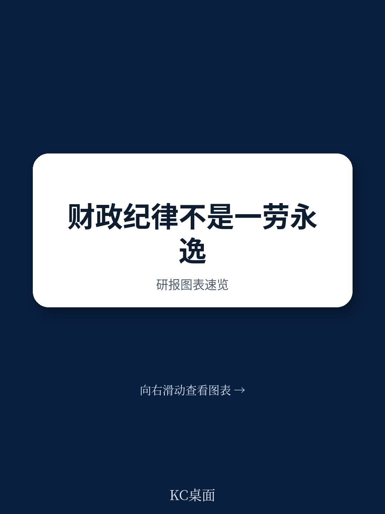
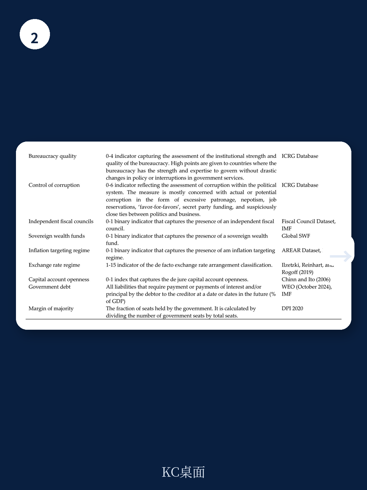

# 世界银行：财政规则的效果，取决于你是在什么时刻定下的

一个被全球108个国家实践了数十年的政策工具，其效果并不总是如预期般线性累积。世界银行最新发布的工作论文，通过对1984年至2012年间跨国数据的细致分析，给出了一个反直觉的结论：财政规则能否真正约束政府行为，不仅取决于规则本身的设计，更取决于它是在什么经济与政治背景下被“按下启动键”的。

这份报告的核心判断值得所有关注宏观政策与主权信用的人认真对待：**财政规则的长期有效性，高度依赖其采纳时的初始条件。** 在发达经济体和制度质量高的国家，规则的效果会随时间不断增强；但在新兴市场和发展中经济体，尤其是那些制度薄弱的国家，规则的效果往往在经历短期提振后便逐渐衰减。这意味着，对于许多正在或准备引入财政规则的国家而言，真正重要的不是是否拥有规则，而是规则诞生时那个“原点”的状态。

## 1. 财政规则并非一劳永逸：效果随时间分化的两个路径

报告首先确认了一个基础结论：财政规则的采纳确实会改善初级财政余额。在十年时间窗口内，初级余额平均改善幅度约为GDP的1%。但这只是一个整体均值，掩盖了背后深刻的异质性。

当研究者将样本区分为发达经济体与新兴市场和发展中经济体时，分化的图景立刻显现。在发达经济体中，规则的效果呈现出一种“信任积累”的特征：初期改善幅度有限，但随着时间推移，效果持续增强。这符合直觉——规则的公信力需要时间来建立，市场参与者、选民和官僚机构对约束的适应与内化是一个渐进过程。

而在新兴市场和发展中经济体，情况截然不同。规则在采纳后的头几年确实带来了明显的财政改善，但这种积极效应在中期开始减弱，并在长期几乎完全消失。报告将此归因于制度质量的差异。进一步分析证实：在制度质量高的国家，无论其发展阶段如何，财政规则都能持续发挥作用；而在制度薄弱的环境中，规则只能带来短期改善，无法转化为持久的纪律。

> **KC评论：** 这告诉我们，财政规则本身不是“制度替代品”，而是“制度放大器”。如果一国的预算透明度、法治水平、官僚体系执行力本身不足，规则就容易被绕过或沦为形式。完整报告中包含了对制度质量与规则效果交互作用的详细图表分析，这些图表直观展示了不同制度水平下效果曲线如何分化。

## 2. 经济困境中匆忙上马的规则，往往难逃“衰退-放松”循环

报告最具政策洞察力的发现之一，是关于初始经济条件的影响。研究者发现，在经济疲弱时期引入的财政规则，其长期效果明显更差。这背后有一个合乎逻辑的机制：当经济处于下行周期时，政府面临巨大的逆周期支出压力，此时强行引入财政约束，往往是为了满足外部融资条件或应对危机，而非出于自主的财政整固意愿。

在这种情况下，规则的“生存环境”极为恶劣。经济复苏需要财政空间，而规则恰恰限制了这个空间。当增长压力超过纪律约束时，规则要么被暂停，要么被实质性违反。这种“衰退-放松”循环一旦形成，规则的公信力就会受到永久性损伤。

相反，在经济稳定或繁荣时期主动引入的规则，因其背后反映了更成熟的决策和更强的政治承诺，更有可能被长期遵守。这类似于企业改革中的“顺周期改革悖论”：最需要改革的时候往往是最难推行改革的时候。

> **KC评论：** 这对当前许多面临财政压力的新兴市场国家是一个重要警示。如果财政规则是在IMF救助计划或债务重组压力下被动接受的，那么它可能只是“纸面上的纪律”。完整报告详细展示了不同经济周期阶段引入规则的效果差异，并提供了具体的统计检验结果。

## 3. 政治权力的集中度，意外成为规则有效性的“隐形开关”

另一个出人意料的发现涉及政治权力的分配。报告显示，当执政党在议会中拥有压倒性多数席位时（即政治权力高度集中），财政规则的有效性反而较低。而当政府与反对党之间的席位分配更加均衡时，规则的效果更好。

这个发现挑战了“强政府才能强执行”的传统直觉。报告给出的解释是：政治权力高度集中时，政府可以轻易修改或绕过规则，因为缺乏有力的制衡力量。规则的存在更多是一种政治姿态，而非真正的约束。相反，在权力相对分散的格局下，任何试图违反规则的行为都需要面对更大的政治成本和更广泛的监督，这反而增强了规则的执行力。

这实际上揭示了财政规则的一个深层悖论：它最需要被约束的对象（强势政府）恰恰最有能力摆脱约束。而需要规则来提供公信力的弱势政府，反而更容易被规则“绑架”。

> **KC评论：** 这一发现对理解某些国家财政规则的“名存实亡”现象提供了新视角。完整报告还讨论了政治预算周期与规则效果的交互作用，以及如何通过制度设计来缓解这一悖论。

## 4. 报告尚未完全回答的关键问题：规则的“死亡”与“重生”

尽管这份报告在动态效果和初始条件方面提供了重要洞见，但它也留下了一些未解问题，其中最核心的是：当财政规则效果衰减后，会发生什么？

报告展示了规则效果在制度薄弱国家会随时间“消失”，但它没有深入探讨这种“消失”的具体路径。是规则被正式废除？是被系统性违反但未受惩罚？还是通过会计手段被“创造性遵守”？这些不同路径对市场预期和主权信用的含义截然不同。

此外，报告没有充分讨论规则的“复活”机制。如果一个国家在制度薄弱时引入规则并经历了效果衰减，那么当制度质量改善后，是否有可能重新激活规则的效果？或者，旧规则的失败经历会永久性损害新规则的可信度？这些都是政策制定者需要回答的现实问题。

另一个未充分展开的维度是规则之间的互动。许多国家同时运行多重规则（如债务规则、赤字规则、支出规则），这些规则之间可能存在协同或冲突。报告主要关注了“是否拥有任何规则”的二元变量，对规则组合效应的分析有限。

## 5. 一个更实用的观察框架：如何判断一个财政规则能否“活下来”

基于报告的发现，我们可以提炼出一个评估财政规则可持续性的三要素框架：

**第一，看时机。** 规则是在经济扩张期还是衰退期引入的？如果是在衰退期，那么它很可能是外部压力下的“危机产物”，长期效果存疑。反之，繁荣期引入的规则更可能反映内生承诺。

**第二，看制度。** 一国的预算透明度、法治水平、审计机构独立性如何？这些制度基础设施决定了规则能否被有效执行。报告的数据表明，制度质量是区分规则效果“增强型”与“衰减型”的关键变量。

**第三，看政治。** 引入规则时的政治权力格局是集中还是分散？如果执政党拥有压倒性多数，那么规则可能只是装饰；如果存在有效的政治制衡，规则更可能成为真正的约束。

这个框架的价值在于，它帮助决策者和投资者避免一个常见误区：仅仅因为一个国家“有财政规则”就认为其财政纪律值得信赖。真正需要追问的是：这个规则是在什么条件下诞生的？它背后的制度支撑和政治生态是否足以让它存活并发挥作用？

## 结语：规则不是终点，而是起点

世界银行这份报告的核心启示，或许可以概括为一句话：财政规则的效果，更多取决于规则诞生时的“土壤”而非规则本身。对于正在考虑引入或改革财政规则的国家而言，这意味着政策努力不应只聚焦于设计“完美”的规则文本，更应关注创造有利于规则长期存续的经济、制度和政治条件。

报告留下的那些未解问题——规则的“死亡”路径、复活机制、规则组合效应——恰恰指向了下一步研究的方向。而对于关注全球宏观和主权信用的读者来说，这些问题的答案，很可能藏在那些尚未被充分挖掘的跨国数据细节和案例之中。

如果你想深入了解这份报告的全貌，包括完整的计量模型设定、108个国家的样本分布、以及不同规则类型（支出规则 vs 赤字规则 vs 债务规则）的效果差异对比，欢迎加入我们的社群。在这里，我们汇聚了来自头部券商、PE/VC、投行、并购、hedge fund、资管机构、战略咨询、智库等专业领域的同行，每日更新汇总国际主流信源、数据与图表，观测边际变化。扫描下方二维码，领取完整研报解读与原始图表，与我们一起探讨财政规则背后的真实逻辑。

Personal reading notes and learning share only. Not investment advice.

