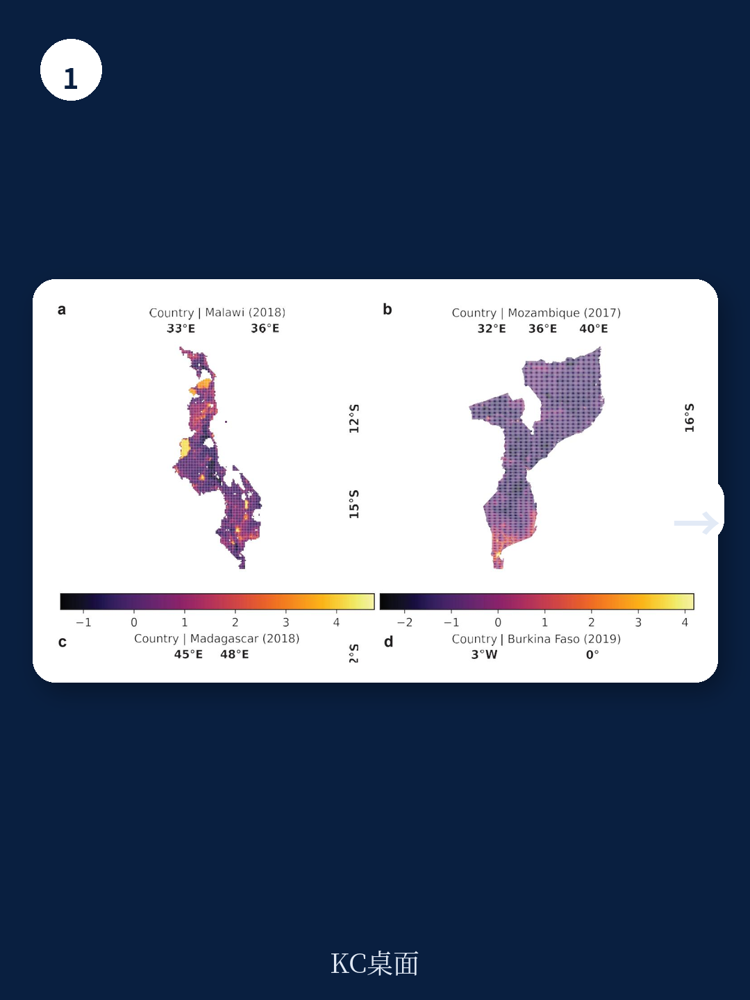
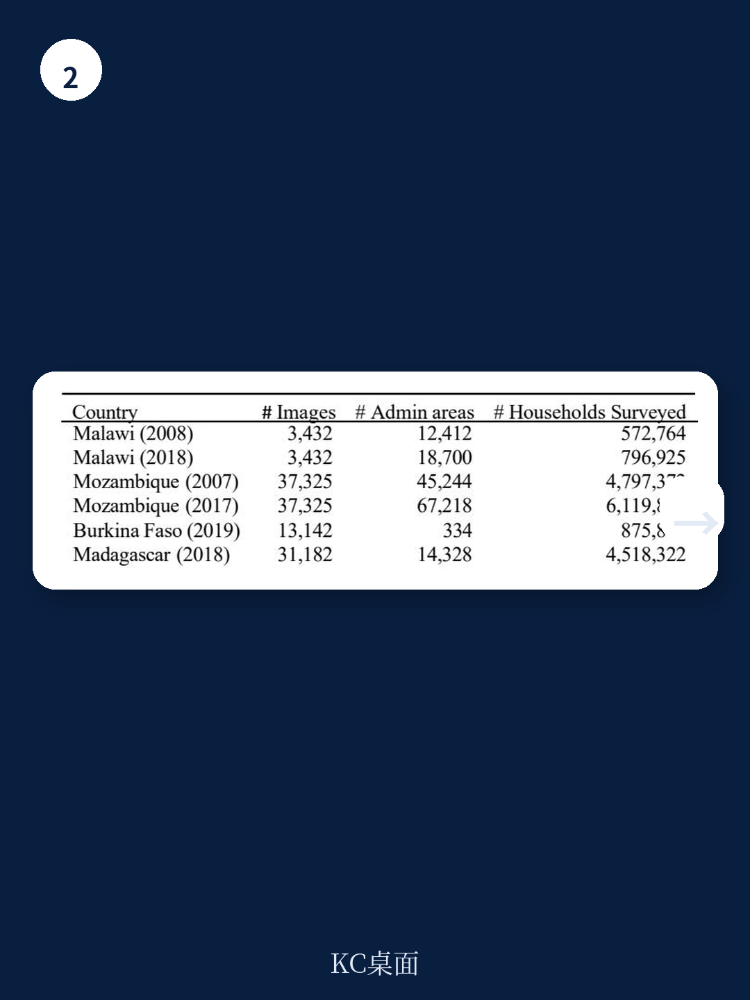

# 世界银行：卫星+AI正在解决一个核心测量难题

当国际组织、各国政府和慈善基金会试图追踪“贫困是否在减少”时，他们面临一个几乎无解的矛盾：最需要数据的地方，恰恰最缺少数据。

传统家庭调查耗时、昂贵，在非洲许多国家，十年才能更新一次。而当你终于拿到数据，它可能已经过时了。更棘手的是，这些调查通常只能在省级层面代表总体，无法告诉你某个村庄或街区的真实状况——而反贫困干预恰恰需要落到这个级别。

世界银行联合斯坦福大学发布的最新政策研究工作论文，试图用卫星影像、公开地理特征和新型深度学习架构，回答一个关键问题：在数据稀缺的环境中，我们能否以低成本、高频率、街区级精度来测量家庭财富？

答案是：可以，而且比以往任何时候都更接近实用化。

这份报告的核心判断是：基于Transformer架构的深度学习模型，在四个非洲国家的测试中，不仅能够精准捕捉国家内部的财富空间差异，还能预测十年间的财富变化。更令人意外的是，仅需每个行政区域10户家庭的样本数据，模型就能达到接近全样本训练的精度。

这不仅仅是技术论文的进展。它意味着，对于全球数以亿计生活在数据空白地带的人口，我们终于有了一个可行的、动态的财富监测工具。

## 1. 传统测量方法正在成为发展目标的“瓶颈”

联合国可持续发展目标1“消除贫困”的2030年截止日期正在逼近。但一个尴尬的现实是，对于许多低收入国家，我们甚至无法准确知道贫困是否在减少。

家庭调查是官方贫困测量的基石。但它的局限性正在被越来越多地讨论：调查需要专业能力、后勤支持，往往只能在较大地理尺度上代表总体。这意味着，在村庄或街区层面——反贫困干预最需要精准定位的地方——传统调查几乎无能为力。

更关键的是，调查的频率。在许多非洲国家，全国性的家庭调查每五到十年才进行一次。这种时间分辨率，无法捕捉经济冲击、气候灾害或政策干预带来的快速变化。

报告明确指出，这些测量缺口正在成为监测和实现减贫目标的核心障碍。而卫星遥感数据和机器学习的结合，在过去几年已经显示出替代或补充传统调查的潜力。从2016年Neal Jean等人开创性地用卫星影像和CNN预测贫困，到后来使用更高分辨率影像和更多地理特征，这条路正在变得越来越清晰。

但此前的研究存在三个关键盲区：缺乏高精度、大样本的“黄金标准”训练数据；无法验证模型在街区级尺度的预测能力；以及无法评估模型对财富变化的时间预测能力。世界银行这份报告，正是瞄准这三个缺口而来。

> **KC评论：** 对于关注发展经济学或ESG投资的读者，这里的核心含义是：财富测量的“分辨率”正在从省级提升到街区级，从年度提升到近乎实时。这意味着，未来对减贫效果的评估、对社会项目的精准瞄准，将不再依赖于滞后的、粗颗粒的统计。完整报告中的实验设计部分，详细展示了如何通过限制数据量来模拟真实世界的数据稀缺场景，这些方法论细节对理解模型的鲁棒性至关重要。

## 2. 12万家庭数据揭示：Transformer架构显著优于传统方法

这项研究构建了一个前所未有的数据集：来自马拉维、莫桑比克、布基纳法索和马达加斯加四个非洲国家的全国人口普查数据，覆盖超过1200万家庭。更重要的是，这些数据包含精确的地理位置信息，以及同一地点在十年间的重复测量——这是此前任何研究都缺乏的两个特征。

研究团队测试了多种模型架构：传统的卷积神经网络、XGBoost集成学习模型，以及基于Swin Transformer的视觉Transformer模型。结果清晰而有力。

在国家层面的财富预测中，Transformer模型在马拉维、莫桑比克和马达加斯加的表现全面领先。仅使用Landsat卫星影像（30米分辨率），Transformer就能解释这些国家内财富变异的62%到83%。相比之下，CNN模型的解释力通常低10到15个百分点。

在布基纳法索，由于有效的训练样本量较小（只有334个行政单元），XGBoost结合卫星影像和地理特征取得了最佳表现。但即便如此，仅使用卫星影像的Transformer模型仍然具有竞争力。

这个对比的意义在于：对于希望大规模应用这些技术的公共组织来说，理解不同模型和输入数据之间的性能权衡至关重要。如果仅使用公开可得的卫星影像就能达到足够精度，那么部署成本将大幅降低。

## 3. 10户样本就能接近全样本精度：数据效率的革命性提升

数据收集是财富测量的主要成本。如果模型需要每个区域成百上千户家庭的样本才能训练，那么它相对于传统调查的优势就会大打折扣。

研究团队做了一个关键的实验：他们人为限制训练样本量，将每个行政区域的家庭样本数从全部家庭减少到仅10户。结果令人惊讶。

以马拉维为例，全样本训练需要约23%的普查家庭数据。当使用10户样本（约占全部家庭的2%）时，模型性能仅下降3个百分点——从82%降到79%。相比之下，如果将训练样本数量减少到25%（但保持每个区域的全样本），性能下降高达12个百分点。

这意味着什么？当每个区域至少有10户家庭样本时，在更多区域收集少量样本，比在少数区域收集大量样本更有效。换句话说，地理覆盖广度比深度更重要。

> **KC评论：** 这一发现对实际操作有直接指导意义。如果你是一个国际组织或国家统计部门，计划在数据稀缺地区部署卫星财富测量系统，最优策略不是集中资源在少数地区做深度调查，而是尽可能扩大样本的地理覆盖范围。完整报告中的数据效率分析部分，还进一步探讨了“10%训练样本”作为性能拐点的发现，以及不同国家之间的差异。这些细节对制定实际的数据收集计划至关重要。

## 4. 城市内部也能测：街区级财富预测精度超预期

城市内部的财富差异往往比城乡之间更加细微且复杂。富裕社区和贫困社区可能仅隔一条街，但生活条件天差地别。传统调查无法捕捉这种微观差异，而卫星影像能否做到？

研究团队利用马拉维两个城市（利隆圭和布兰太尔）的精确地理定位普查数据，测试了不同分辨率卫星影像的预测能力。结果再次超出预期。

使用SkySat卫星（0.5米分辨率）影像训练的Transformer模型，能够解释城市内部财富变异的相当大一部分。即使使用较低分辨率的PlanetScope（3米）或Landsat（30米）影像，模型仍然表现出令人惊讶的预测能力。

这意味着，卫星影像确实能够捕捉到与财富相关的视觉线索——屋顶材质、建筑密度、绿地覆盖率、道路类型等——即使在高度异质的城市环境中。而且，这些视觉线索在不同分辨率下都能被有效提取。

对于城市管理者、社会项目设计者和房地产投资者来说，这一发现打开了新的可能性。从识别非正规住区，到评估城市更新项目的效果，再到动态监测城市贫困的空间分布，卫星+AI提供了一个前所未有的工具。

## 5. 十年财富变化也能预测：动态监测不再是幻想

如果说预测静态的财富空间分布已经足够令人兴奋，那么预测财富随时间的变化则是真正的“圣杯”。

此前的研究几乎无法回答这个问题，因为缺乏同一地点的重复测量数据。但世界银行这份报告拥有马拉维（2008-2018）和莫桑比克（2007-2017）的十年间重复普查数据。

结果令人振奋：使用全样本训练的深度学习模型，能够捕捉马拉维十年间财富变化的52%，莫桑比克的42%。Transformer模型在莫桑比克的表现优于CNN，在马拉维则与CNN相当。

这些数字意味着什么？虽然模型无法解释全部变化（财富变化受到太多不可观测因素的影响），但能够解释一半左右的变异，已经具有重要的实用价值。当传统调查无法提供年度或季度更新时，卫星模型可以提供一个合理的近似。

研究还发现，与静态预测类似，减少训练样本的地理覆盖范围比减少每个区域的样本量对性能的损害更大。这一模式在时间预测中同样成立。

> **KC评论：** 时间预测能力是这份报告最接近“突破”的发现。如果模型只能预测静态分布，它的价值主要是一次性的地图绘制。但如果能可靠地预测变化，它就可以成为真正的监测工具——用于评估政策干预效果、预警经济恶化、或跟踪自然灾害后的恢复进程。完整报告中的图3详细展示了不同数据稀缺场景下的性能变化，这些图表对于理解模型在实际部署中的局限性至关重要。

## 6. 报告尚未完全回答的关键问题

尽管这份报告在多个维度上推进了卫星财富测量的边界，但仍有几个关键问题尚未被充分回答。

第一，模型的可迁移性。研究团队在每个国家分别训练模型，没有测试跨国家迁移的效果。如果一个在马拉维训练的模型，直接应用于坦桑尼亚，性能会下降多少？报告提到，不同国家的财富指数不可直接比较，这意味着跨国家应用可能需要额外的校准。

第二，时间预测的驱动因素。模型能够捕捉42%到52%的财富变化，但剩下的变化来自哪里？是经济冲击、政策变化、气候事件，还是卫星影像无法捕捉的社会因素？理解这些驱动因素，对于将预测转化为政策行动至关重要。

第三，极端情况的识别。模型在预测平均财富时表现良好，但对于极端贫困或极端富裕的区域，是否存在系统性偏差？报告没有详细分析预测误差的空间分布，而这对于精准瞄准最需要帮助的人群至关重要。

第四，从资产财富到消费贫困的桥梁。报告预测的是资产财富指数，而官方贫困测量通常基于消费支出。两者相关但不相等。如何将卫星预测的资产财富转化为消费贫困估计，仍然是一个开放问题。

## 从数据稀缺到数据普惠

这份世界银行的报告，与其说是一篇技术论文，不如说是一份“数据民主化”的宣言。它证明了一个判断：当深度学习遇上卫星影像，财富测量的成本、频率和精度可以同时得到改善。

对于决策者来说，这意味着反贫困干预可以更加精准、及时。对于投资者来说，这意味着对新兴市场的经济动态有了新的观测窗口。对于技术从业者来说，这意味着Transformer架构在遥感领域的潜力远未被充分挖掘。

当然，从研究到大规模部署，还有很长的路。模型的可迁移性、成本效益分析、与传统调查的整合策略，都需要更多验证。但方向已经清晰：在数据稀缺的世界里，卫星和AI正在打开一扇新的大门。

这些未解问题，正是我们持续追踪这份报告及其后续研究的动力。更多关于模型架构细节、数据效率实验、以及不同卫星传感器的性能对比，都在完整报告中。

Personal reading notes and learning share only. Not investment advice.

