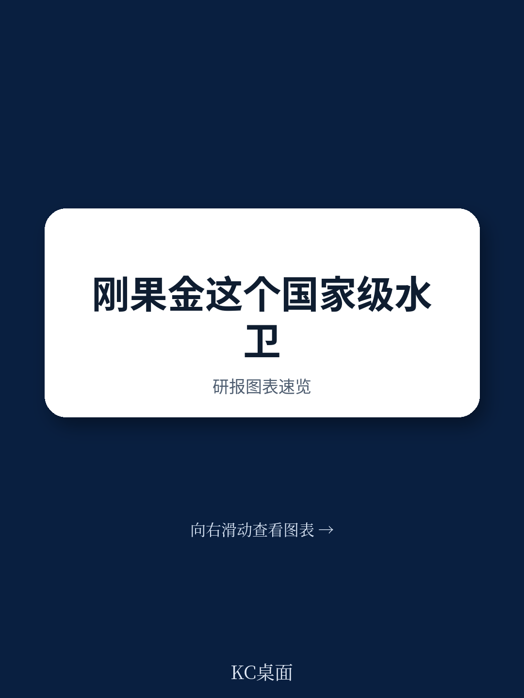
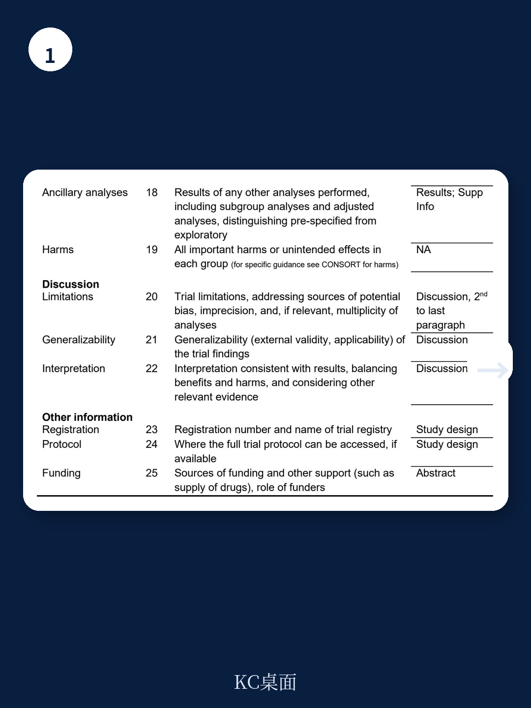
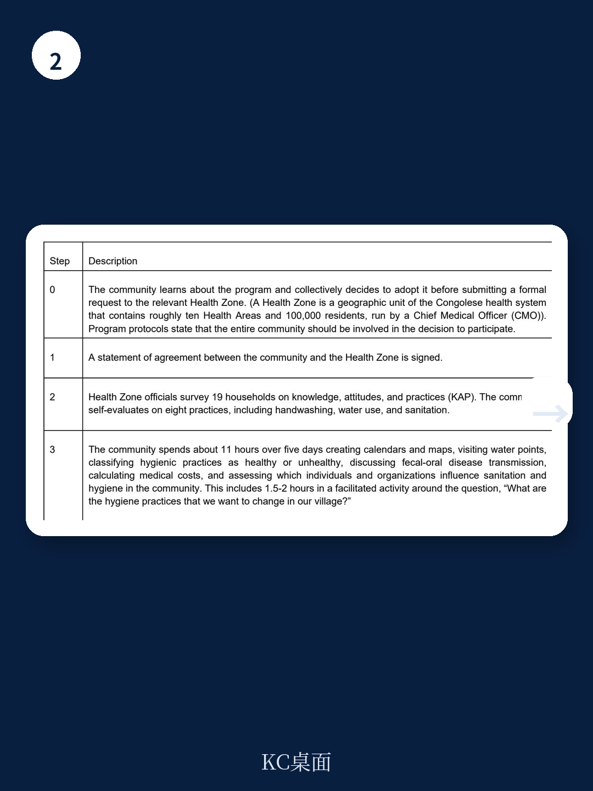

# 世界银行：刚果金农村WASH项目改善了设施，但未能减少儿童腹泻

一份来自世界银行的随机对照试验，评估了刚果民主共和国国家级农村水、环境卫生与个人卫生项目的实际效果。结论清晰且令人深思：项目成功建立了村级WASH委员会，提升了改善水源和卫生设施的使用率，但这些变化并未转化为儿童腹泻率的下降或身高发育的改善。这不仅仅是关于一个项目的评估，它挑战了国际发展领域一个核心的因果假设：基础设施改善是否必然带来健康改善。

## 1. 项目本身是成功的：社区机构与基础设施确实得到了有效改善

这份报告最坚实的结论在于，干预措施在“过程指标”上取得了显著成效。在项目实施3.6年后，干预组村庄的WASH机构指数得分比对照组高出0.4分。更具体地说，干预组中拥有活跃WASH委员会的村庄比例比对照组高出21个百分点。家庭层面，使用改善水源的比例提高了24个百分点，使用改善卫生设施的比例提高了18个百分点。居民对水治理的感知也更为积极。这些数据表明，一个设计良好的社区驱动项目，在冲突频发、治理薄弱的刚果金农村地区，能够有效地建立起可持续的社区治理结构和基础设施。

> **KC评论：** 这意味着，对于许多发展项目而言，最大的挑战往往不是“做什么”，而是“如何做”才能落地并持续。刚果金的这个项目证明了，通过社区动员、资金支持和制度建设的组合拳，可以在复杂环境中实现机构和设施的实质性改变。但这也引出了更关键的问题：这些改变是否足够？

## 2. 健康结果未改善：基础设施与健康之间的“黑箱”依然存在

尽管过程指标亮眼，但研究的核心健康指标——儿童腹泻患病率和身长别年龄Z评分——在干预组和对照组之间没有统计学上的显著差异。这是一个典型的“过程成功，结果失败”案例。报告本身并未给出确切的解释，但结合更广泛的WASH研究文献，我们可以推测几个关键原因。首先，干预措施可能未能有效切断所有粪口传播途径。家庭用水和卫生设施的改善，并不能保证社区公共环境、食物链或儿童玩耍区域的卫生。其次，改善后的水源和设施可能在使用过程中存在二次污染。再次，行为改变可能不够深入或持久。虽然项目包含行为改变活动，但从知晓到形成习惯，再到足以影响健康结果，中间存在巨大的鸿沟。最后，也是该研究承认的，刚果金农村地区极高的基线环境粪口暴露水平，可能意味着需要更大幅度的改善才能突破健康阈值。

## 3. 报告未完全回答的关键问题：改善的“剂量”与“纯度”是否足够？

这份报告留下了几个悬而未决的关键问题，正是这些问题的答案，决定了我们如何理解这一结果。第一，干预的“剂量”是否足够？每个村庄约7000美元的投入，用于基础设施、人员培训和实施，相对于社区规模和基线污染水平，这笔投入是否足以产生可测量的健康效益？第二，设施和用水的“纯度”如何？报告确认了“改善水源”和“改善卫生设施”的使用率上升，但“改善”的定义本身存在弹性。一个受保护的井眼可能优于开放式水塘，但其微生物安全性是否能与受严格监管的管网供水相提并论？第三，社区WASH委员会的可持续性究竟如何？报告显示3.6年后其活跃度更高，但其职能是否仅限于维护设施，还是能够持续推动社区层面的行为规范和环境改善？这些问题的答案，决定了我们是将此案例视为“方法失效”，还是“剂量不足”。

> **KC评论：** 报告本身提供了高质量的证据，但它的价值恰恰在于揭示了“我们知道什么”和“我们不知道什么”之间的边界。对于政策制定者和投资者而言，一个有效的WASH项目，其“有效”的定义必须被精确审视。是有效于建造厕所，还是有效于预防疾病？这两者之间的差距，正是未来研究和项目设计需要填补的空白。

## 4. 对决策者的观察框架：从“建了什么”转向“改变了什么”

对于关注非洲发展和公共卫生的读者，这份报告提供了一个重要的分析框架。评估一个WASH项目，不能只看投入和产出（如修建了多少厕所、培训了多少人），而必须追问中间结果（使用率、持续性、水质）和最终结果（健康指标）。刚果金的案例表明，即使中间结果成功，最终结果也可能落空。这要求决策者在项目设计时，就必须将“健康结果”作为核心目标，并为实现这一目标设计更复杂、更长期的干预包，例如结合营养干预、加强环境清洁、或采用更严格的水质标准。同时，研究者需要更精细化的测量工具，来捕捉基础设施改善后，社区实际的病原体暴露水平是否真正下降。

## 5. 未解的问题与下一步：需要更精细的证据链

这份世界银行的报告，像一面镜子，映照出国际发展领域一个深刻的困境。我们擅长建造，但不一定擅长治愈。我们能够教会社区成立委员会，但未必能教会病原体停止传播。报告没有告诉我们，为什么同样的社区驱动模式，在孟加拉国等地的社区主导全面卫生项目中取得了显著健康效果，而在刚果金却未能复制。是环境差异（如更高的基线污染）、实施强度差异，还是文化行为差异？这些未解问题，恰恰是未来研究和项目优化的方向。完整的报告中包含了更详细的异质性分析、成本效益数据以及对冲突环境影响的深入探讨，这些内容对于理解这一悖论至关重要。

我们无法在一篇文章中穷尽这份报告的洞察。更深入的图表、对异质性结果的讨论、以及与其他WASH研究的对比，都留在了完整版研报解读中。这些内容能帮助您构建更立体的判断框架。

加入我们的社群，领取完整研报解读与原始图表。这里汇聚了来自头部券商、PE/VC、投行、并购、hedge fund、资管机构、战略咨询、智库等机构的朋友，每日更新汇总国际主流叙事、数据与图表，观测边际变化。我们期待与您继续交流。

Personal reading notes and learning share only. Not investment advice.

