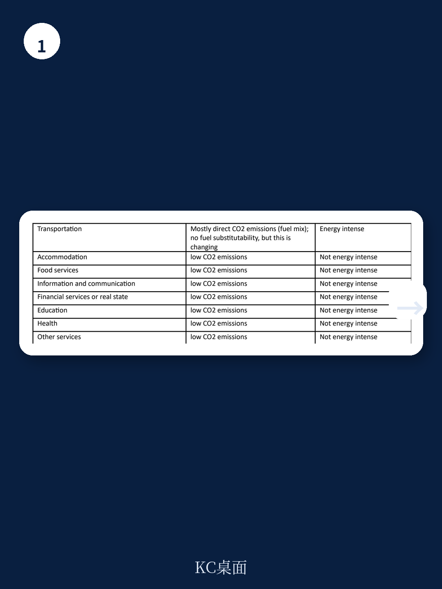
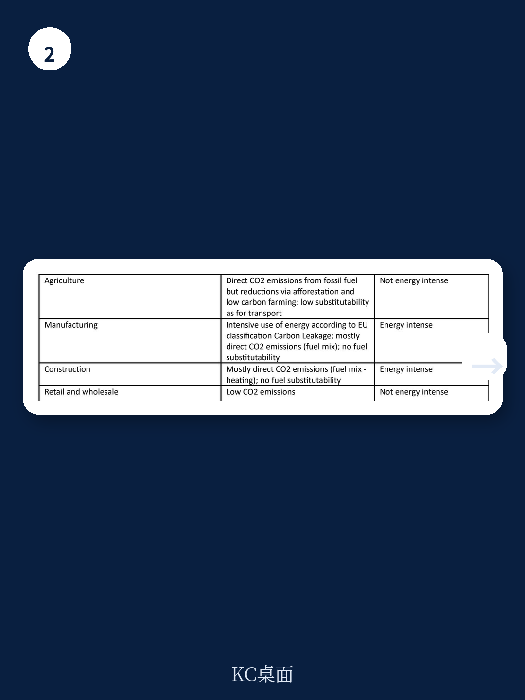

# 世界银行：电价上涨1%，高能耗无节能措施企业裁员1.5%

2019年到2023年，全球经历了疫情冲击、供应链断裂、俄乌冲突引发的能源价格剧烈波动。当各国政府忙着发放能源补贴、央行盯着通胀数据时，一个被忽视的问题正在发展中国家蔓延：电价上涨正在悄悄改变企业的雇佣决策，而大多数企业并没有做好准备。

世界银行最新政策研究论文给出了一个极具政策含义的发现：电价每上涨1%，那些处于高能耗行业且没有采取节能措施的企业，就业规模会减少约1.5%。这个数字不是理论推演，而是基于24个新兴市场和发展中经济体、超过6万家企业数据的实证结果。

更值得关注的是，这份报告揭示了一个反直觉的现象：同一批企业在电价上涨后，其销售额和劳动生产率反而可能上升。这意味着企业并非被动承受冲击，而是通过两种方式调整——将成本转嫁给消费者，以及用资本替代劳动力。但问题是，那些没有节能措施的高能耗企业，在就业端的代价最为惨烈。

这不是一个关于能源转型的远期故事，而是当下正在发生的结构性调整。对于投资新兴市场、关注全球供应链的企业决策者而言，理解这种调整的传导机制，比猜测下一个季度GDP数据更有价值。

## 1. 电价冲击的传导路径：不是所有企业都受伤，但受伤的企业很致命

报告的核心贡献在于区分了两种异质性：行业层面的能源强度和企业层面的节能措施。这种“交叉分类”让分析从泛泛而谈的“能源涨价影响企业”推进到可操作的判断层面。

基准回归结果相当清晰。在控制国家、时间、行业和规模等固定效应后，电价每上涨1%，整体样本中企业的销售额和劳动生产率反而显著上升。这听起来像是好消息，但报告特意指出，这个正向效应在加入不同稳健性检验后并不稳定。更关键的是，当引入行业能源强度和企业节能措施两个交互项后，真实的图景才浮现出来。

高能耗行业的企业在电价上涨后确实实现了销售额和劳动生产率的提升，幅度约为1.4-1.7个百分点。但与此同时，那些既属于高能耗行业、又没有采取节能措施的企业，其就业规模遭受了约1.5个百分点的显著收缩。而处于低能耗行业的企业，无论是否节能，就业影响都不显著。

这意味着什么？电价上涨正在倒逼企业做出选择：要么提高效率、保持竞争力；要么削减成本中最灵活的部分——劳动力。在发展中国家，后者往往是更现实的选择。

> **KC评论：** 很多讨论把能源涨价简单等同于成本上升、利润压缩。但这份报告展示了一个更精细的机制：企业可以通过涨价消化成本，前提是需求缺乏弹性；也可以通过投资节能设备来降低单位能耗。真正受伤的是那些既无法转嫁成本、又无法调整技术的企业，而它们往往雇佣了大量低技能劳动力。读懂这个机制，才能理解为什么能源价格波动对就业结构的影响远比对企业利润的影响更持久。

## 2. 节能措施不是锦上添花，而是就业的“保险单”

报告中最具政策实践意义的发现是：节能措施在就业端的保护效应非常显著。那些实施了节能技术的企业，即使身处高能耗行业，在电价上涨时也并未出现就业的显著缩减。

具体来看，回归结果中的三重交互项（电价x高能耗x无节能措施）在就业方程中显著为负，系数约在-0.4到-0.7之间。这意味着，对于高能耗行业中没有节能措施的企业，电价每上涨1%，就业减少幅度比有节能措施的同行多出约0.5-0.8个百分点。考虑到样本中电价波动范围从每千瓦时0.03美元到0.38美元，这种差异在实践中是巨大的。

报告引用了Bloom等学者的研究来支撑这一逻辑：企业层面的创新，包括能效改进，是维持经济转型期竞争力的关键。但世界银行的数据显示，在发展中国家，节能措施的普及率仍然很低。样本中仅有一小部分企业报告实施了LED照明、ISO 14001/50001认证或碳交易等节能实践。

> **KC评论：** 这里有一个容易被忽略的细节：报告使用的节能措施数据来自企业自报，而非第三方认证。这意味着实际节能水平可能比数据体现的更低——因为自报本身就存在夸大倾向。如果连自报的比例都不高，真实情况可能更严峻。对于在新兴市场做投资或运营的读者，这个发现意味着：评估一家企业的能源风险，不能只看行业标签，更要看它是否已经采取了可验证的节能行动。完整报告中的Table A4列出了具体的节能措施分类，值得仔细对照。

## 3. 补贴的悖论：短期止痛药，长期麻醉剂

报告在数据部分专门讨论了化石燃料补贴问题，这是一个容易被正文忽略但极具洞察力的切入点。根据Black等学者2023年的估算，2023年全球化石燃料补贴达到了创纪录的7万亿美元。各国政府试图通过补贴来保护消费者和企业免受能源价格冲击，但这种做法可能适得其反。

世界银行的数据显示，样本国家中除塔吉克斯坦外，几乎所有国家都存在电力补贴，幅度从GDP的0.04%到9.76%不等。石油补贴的范围则为0.00004%到3.58%的GDP。这些补贴在短期内确实起到了缓冲作用，但报告引用了Bovenberg和de Mooij、Parry等学者的研究指出：补贴会延迟企业和家庭将环境成本纳入消费和投资决策，进而推迟节能技术和可持续实践的采用。

换言之，补贴在保护就业的同时，也在保护低效。当补贴不可持续或被迫取消时，那些依赖补贴的企业将面临更剧烈的调整冲击。报告虽然没有直接测算补贴取消后的就业效应，但其逻辑链条已经足够清晰：补贴维持了现状，但现状恰恰是就业脆弱性的根源。

## 4. 一个尚未完全回答的关键问题：销售增长是否可持续？

报告最引人注目的发现之一是：电价上涨后，高能耗企业的销售额和劳动生产率反而上升。作者给出的解释是：企业通过将成本转嫁给消费者（在需求缺乏弹性的市场中）以及采用节能技术来提高效率。但报告在稳健性检验部分诚实指出，这个正向效应并非在所有规格下都成立。

当使用国家-年份固定效应、改变聚类标准误层级、剔除印度样本或使用三个月移动平均电价时，销售额和劳动生产率的正向效应要么消失，要么变得不显著。相比之下，就业的负向效应在所有稳健性检验中几乎都保持显著。

这种不对称性本身就是一个重要信号：销售端的“增长”可能更多反映了价格效应而非实际产出增长，或者是样本选择偏差——那些能够存活下来的企业本身就更有定价权。报告没有深入讨论这个问题，但正是这种未完全回答的问题，让完整阅读报告变得必要。如果销售增长不可持续，那么当前看到的“效率提升”可能只是企业在耗尽劳动力缓冲后的短暂平衡。

## 5. 对决策者的观察框架：三个必须追问的变量

基于报告的实证发现，无论是企业管理者、投资者还是政策制定者，在评估能源价格风险时，都需要建立一个新的分析框架。这个框架不是看宏观能源价格走势，而是追问三个具体变量。

第一，行业能源强度。报告使用的CPRS分类框架考虑了排放强度、燃料可替代性和转型风险，而非简单的能耗占比。一个行业可能能耗不高，但如果其燃料可替代性极低（例如某些化工过程），其对电价上涨的敏感度可能远高于直观判断。

第二，企业节能措施的真实水平。报告显示，节能措施是就业保护的关键变量。但投资者不能只看企业是否宣称有节能计划，而要看是否有可验证的认证（如ISO 50001）、是否有具体的设备投资记录。在发展中国家，很多企业的“节能措施”可能只是更换了LED灯泡，而非系统性的能效改造。

第三，劳动力市场的弹性。报告聚焦于就业数量，但未讨论工资调整、工作时长调整或非正式用工等维度。在正式就业保护较强的国家，企业可能更多通过工资冻结或减少加班来应对，而非直接裁员。而在发展中国家，大量非正式就业的存在可能使就业数据的波动被低估。

> **KC评论：** 这三个变量构成了一个简易的压力测试框架。对于任何面临电价波动风险的企业或投资组合，可以按行业、节能水平和劳动力弹性三个维度打分，识别出最脆弱的部分。完整的报告还提供了按国家、行业和规模分组的描述性统计（Table A1），以及各行业能源强度的具体分类（Table A3），这些表格本身就是构建这个框架的基础素材。但报告没有进一步给出综合评分方法，这正是我们可以在社群中继续讨论的方向。

## 6. 报告没有完全展开的两个延伸问题

第一个是电价上涨的分配效应。报告聚焦于企业层面的就业和产出，但没有追踪被裁员的工人去了哪里。在发展中国家，这些工人很可能会流入非正规部门或更低生产率的行业，从而拉低整体经济效率。如果考虑这种一般均衡效应，电价上涨的实际社会成本可能远高于企业层面的估算。

第二个是政策组合的时间序列问题。报告指出补贴可能延迟节能投资，但政策制定者面临的是动态权衡：今天取消补贴可能导致立即的失业，而维持补贴则可能延缓结构调整。报告没有给出最优政策路径，但它的实证结果暗示了一个方向：与其维持普遍补贴，不如将资源定向用于支持企业节能改造——这样既能保护就业，又能为未来的能源价格波动建立缓冲。

这两个问题都不是报告的缺陷，而是其价值所在——它用严谨的实证研究提出了更值得追问的问题。对于关注新兴市场、全球供应链和能源转型的决策者来说，这份报告提供了一个从宏观叙事下沉到微观机制的分析起点。

---

以上讨论只是世界银行这篇论文的冰山一角。完整报告中包含了详细的数据描述、多重稳健性检验、不同能源价格指标的对比分析，以及按国家、行业和规模分组的异质性结果。这些内容无法在一篇导读中完全展开，但正是理解“电价如何重塑就业结构”这一核心问题的关键。

如果你希望获得完整报告的解读版本、原始图表以及我们社群成员对上述未解问题的深入讨论，欢迎扫码加入我们的知识星球。这里汇聚了来自头部券商、PE/VC、投行、并购、对冲基金、资管机构、战略咨询和智库的朋友，每日更新国际主流信源的汇编与评论，追踪全球能源、经济和市场的边际变化。我们期待与你交流。

Personal reading notes and learning share only. Not investment advice.

