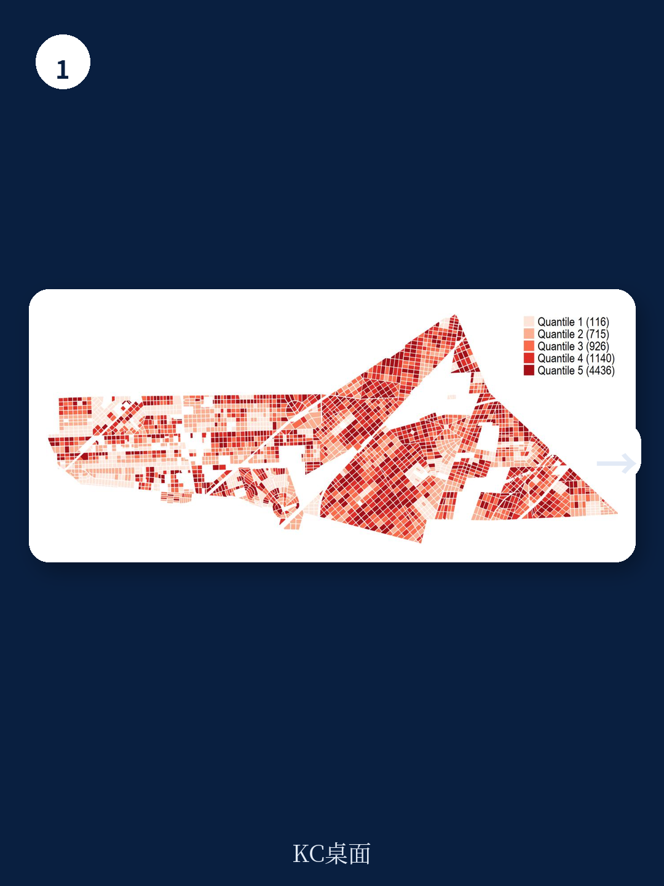
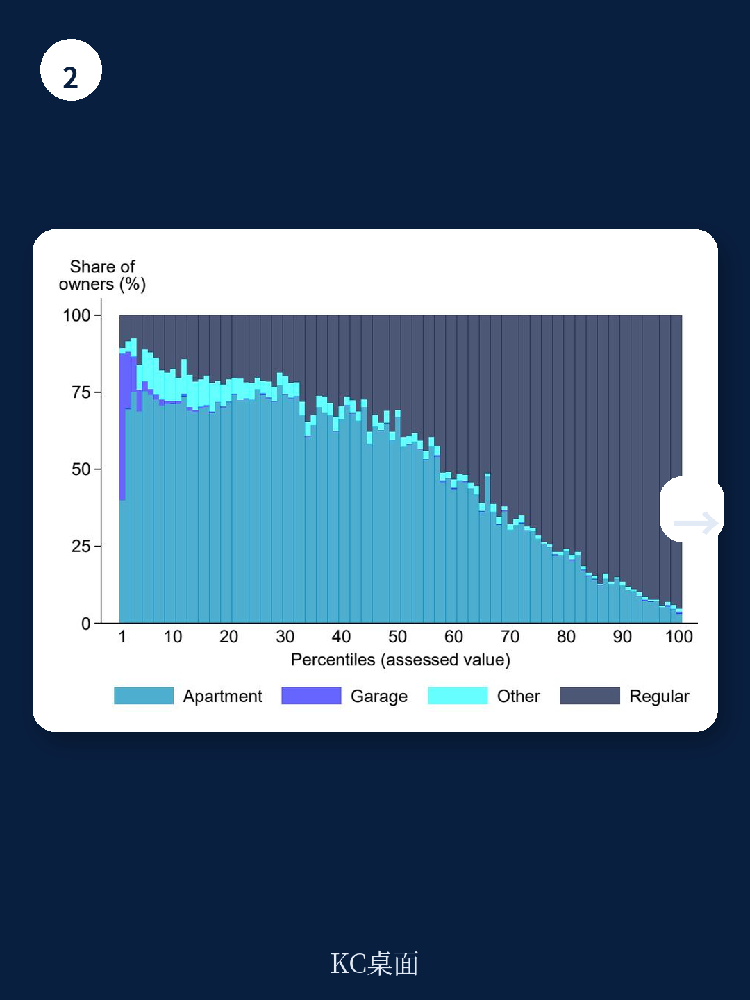

# 世界银行：女性在高端房产的拥有率不足20%，但税收政策对她们更不公平

世界银行最新发布的一份基于阿根廷大型城市行政税收数据的研究，揭示了一个在财产税讨论中常被忽视的维度：性别。这份报告的核心发现并非简单的“女性缴税更少”或“女性更守规矩”，而是一个更微妙、更具政策含义的判断：在财产所有权上存在显著的性别财富差距，但现行的财产税制度，因其累退性结构，反而对拥有较低价值房产的女性群体构成了更高的有效税率。税收执法的软性干预措施，如催缴信，对男女效果相似，并未展现出显著的性别差异。这意味着，解决财产税领域的性别公平问题，重点不在于调整执法手段，而在于审视税制设计本身，以及更根本的财富创造与分配结构。

## 1. 财产所有权的性别鸿沟在高端市场急剧拉大，低端市场相对均衡

报告利用阿根廷特雷斯德费布雷罗市超过10万条房产的行政数据，首次在拉美地区清晰描绘了财产所有权与房产价值分布之间的性别关系。研究将房产所有者分为女性、男性和共同所有三类。在房产价值分布的最底端40%区间，所有权分布相当均衡，女性、男性和共同所有各占约三分之一。然而，一旦越过这个分水岭，女性所有权的比例便急剧下降。在房产价值最高的前1%区间，共同所有占50%，男性占约30%，而女性的所有权比例跌至20%以下。

这一发现印证了全球范围内关于性别财富差距的普遍认知，但其贡献在于用精确的行政数据而非抽样调查，量化了这一差距在财产税这一具体税种上的表现。报告没有深入探讨造成这一差距的根源——是女性创业和职业发展受限导致的收入差距，还是信贷获取上的性别歧视，抑或是继承和赠与中的性别偏好——但它为后续研究指明了方向。对于政策制定者而言，这意味着单纯关注税收执法无法触及财富分配的源头问题。

> **KC评论：** 这份报告最重要的贡献之一，是它用数据证明了“财产税领域的性别不平等，首先不是一个税收问题，而是一个财富创造和分配问题”。女性在高端房产上的缺席，暗示着在税基形成之前，市场和社会结构已经产生了筛选。完整报告中对所有权差距的进一步分解，包括按年龄、婚姻状况的交叉分析，值得仔细阅读。

## 2. 男女纳税遵从度无显著差异，但女性面临更高的有效税率

在纳税行为上，报告得出了一个反直觉的结论：在控制房产价值后，男性和女性的财产税缴纳率几乎完全相同。整个样本的平均逃税率高达46%，且在不同价值区间的房产中，男女的按时支付率保持平行。这意味着，不存在“女性更守规矩”或“男性更爱逃税”的简单叙事。在阿根廷这个低税收执行力的环境下，男女的纳税动机和行为模式是高度一致的。

然而，报告的另一个关键发现是，女性实际上承担了更高的有效税率。这并非因为税收政策对女性有任何歧视性条款，而是源于税制的累退性结构。该市的财产税包含一个按房产价值计算的浮动部分和一个固定的服务费。对于低价值房产，固定服务费占税负总额的比例极高（在最低十分位房产中高达65%），导致整体税率呈现累退性。由于女性更多地集中在低价值房产的所有权上，她们平均缴纳的有效税率反而高于男性。这是一个典型的“结构性不公”：制度本身是中性的，但因其设计特征，与既有的社会不平等结构叠加，产生了对特定群体的负面效应。

## 3. 软性催缴信对男女均有效，但男性响应更快，低端市场效果差异明显

报告还利用一项2020年10月开展的随机实验，评估了发送个性化催缴信对税收遵从度的影响。结果显示，催缴信显著提高了按时支付率，且对男女的总体提升幅度相近——女性提升4.2个百分点，男性提升4.7个百分点。这再次表明，在响应温和的执法干预时，性别并非一个显著的决定性变量。

但报告在细节中揭示了有趣的差异。首先，男性对催缴信的反应更迅速，在截止日期前就出现了明显的支付高峰；而女性的支付行为则更分散，在截止日期后仍有大量补缴。其次，按房产价值分位数来看，催缴信的效果在男性群体中呈现出随价值上升而递减的趋势。在最低价值分位，催缴信使男性的按时支付率提升了8个百分点，是女性提升幅度的两倍。这一差异暗示，在最低收入群体中，男性的可支配现金流或对信息的反应速度可能优于女性，尽管报告并未对此给出明确解释。

> **KC评论：** 催缴信实验的结果为税收管理部门提供了重要参考：统一的、温和的提醒策略是有效的，且无需针对性别进行差异化设计。但男性在低端市场的更强反应，以及男女在响应速度上的差异，提示我们可能需要更精细地分析“支付能力”和“信息处理能力”这两个变量。完整报告中关于实验设计的细节，包括信件的具体内容和随机化过程，是理解这一结论可靠性的关键。

## 4. 疫情冲击下男女纳税行为同步恶化，宏观经济冲击无性别偏好

报告利用研究时段恰好覆盖新冠疫情的特点，考察了宏观经济冲击对男女纳税行为的差异化影响。分析发现，在2020年3月疫情封锁措施实施后，整体财产税支付率大幅下降了约25个百分点，但男女的下降幅度和模式几乎完全一致。这一发现进一步强化了报告的核心论点：在财产税这一特定领域，男女的纳税行为对重大经济冲击的反应是趋同的，而非分化的。

这或许可以解释为，财产税作为一种与房产捆绑的、相对刚性的支出，其支付决策更多地取决于家庭整体的流动性状况，而非个体所有者的性别特质。当宏观经济下行导致家庭收入普遍受损时，男女都会面临同样的支付困难。这再次提醒我们，任何试图通过税收执法来解决性别不平等的政策，如果忽略了宏观经济背景和家庭财务结构，都可能收效甚微。

## 5. 报告尚未完全回答的关键问题：低端市场男性响应为何更强？

尽管报告数据详实、论证严谨，但它也留下了一个重要的未解之谜：为什么在最低价值房产中，催缴信对男性的支付提升效果是女性的两倍？报告提到了几个可能的解释方向，如男性可能有更高的可支配收入、更强的风险厌恶（担心欠税后果）或更便捷的支付渠道，但并未给出定论。这一现象背后，可能隐藏着更深层的家庭内部资源分配机制：在低收入家庭中，女性可能更倾向于将有限的资金用于食品、教育等日常开支，而将房产税这类“可延期”的刚性支出排在后面；男性则可能对官方信函的威慑力更为敏感。

这个问题的答案，对于设计更精准、更具包容性的税收救助政策至关重要。例如，是否可以针对低收入女性业主提供更灵活的支付计划或更直接的减免？报告没有给出答案，但这恰恰是后续研究和政策讨论的起点。

## 6. 一个观察框架：从“执法公平”转向“税制公平”和“财富公平”

综合世界银行这份报告的全部证据，我们可以为读者提炼一个观察同类问题的框架。当讨论财产税与性别时，不应仅仅停留在“男女是否同等地被收税”或“男女是否同等地逃税”这些表面问题上。一个更有效的分析框架需要包含三个层次：

第一层是**执法公平**：男女是否受到同等力度的执法对待？本报告给出的答案是“是”，软性干预效果相似。

第二层是**税制公平**：税制设计本身是否对不同群体产生不成比例的影响？本报告给出的答案是“否”，累退性税制使低价值房产所有者——女性居多——承担了更高的有效税率。

第三层是**财富公平**：税收政策能否成为调节性别财富差距的工具？本报告揭示的严峻现实是，在财产税税基形成的那一刻，性别鸿沟已经根深蒂固。税收本身无法创造财富，也无法自动纠正财富创造过程中的不平等。

因此，对于决策者和投资者而言，与其执着于寻找“针对女性的神奇税收杠杆”，不如将目光投向更上游：如何通过信贷政策、产权保护、创业支持等手段，提升女性在高端资产中的拥有率。税收政策的作用，应更多体现在确保税制本身不加剧已有的不平等，并为那些因结构性原因处于不利地位的群体提供缓冲。

报告的这些深刻洞察，远非一篇导读所能穷尽。关于阿根廷财产税的制度细节、实验设计的完整逻辑、以及更多按年龄和婚姻状况的交叉分析，都在原始报告和配套的图表中。这些细节，是理解结论边界和进行跨国比较的宝贵素材。

如果您希望获取这份世界银行报告的中文解读全文、原始图表以及我们团队对拉美税收政策的持续跟踪分析，欢迎加入我们的专属社群。社群汇聚了来自头部券商、PE/VC、投行、战略咨询、智库等机构的朋友，每日更新国际主流叙事、数据和图表，共同观测全球宏观经济与政策的边际变化。在这里，您将获得比一篇公众号文章更完整、更深入的洞察。期待与您交流。

Personal reading notes and learning share only. Not investment advice.

