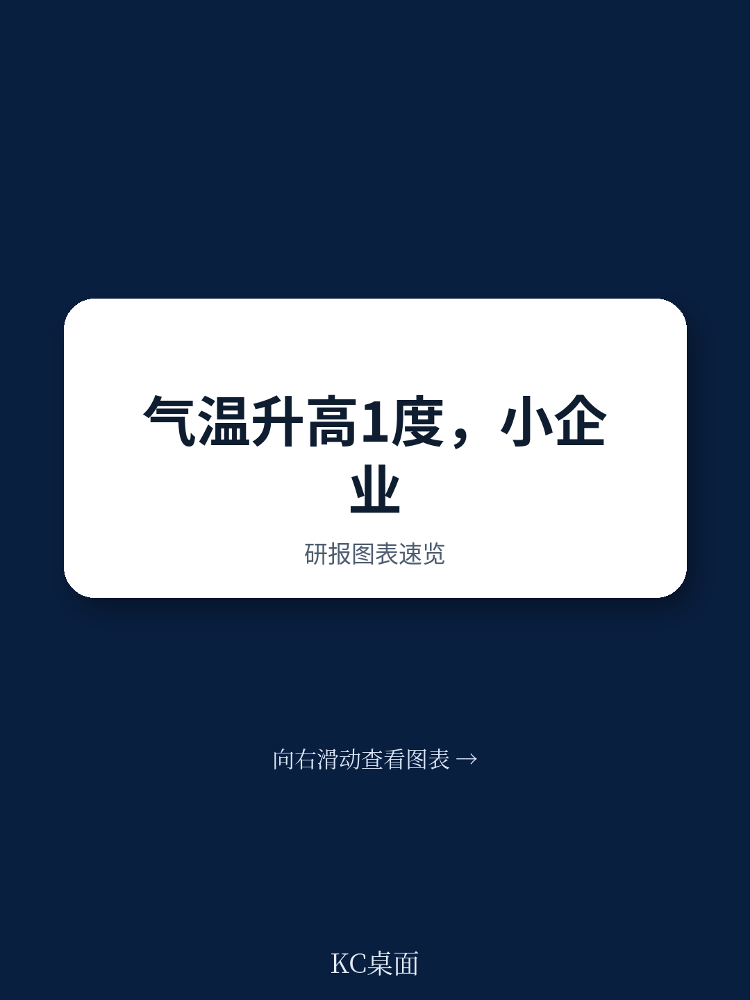
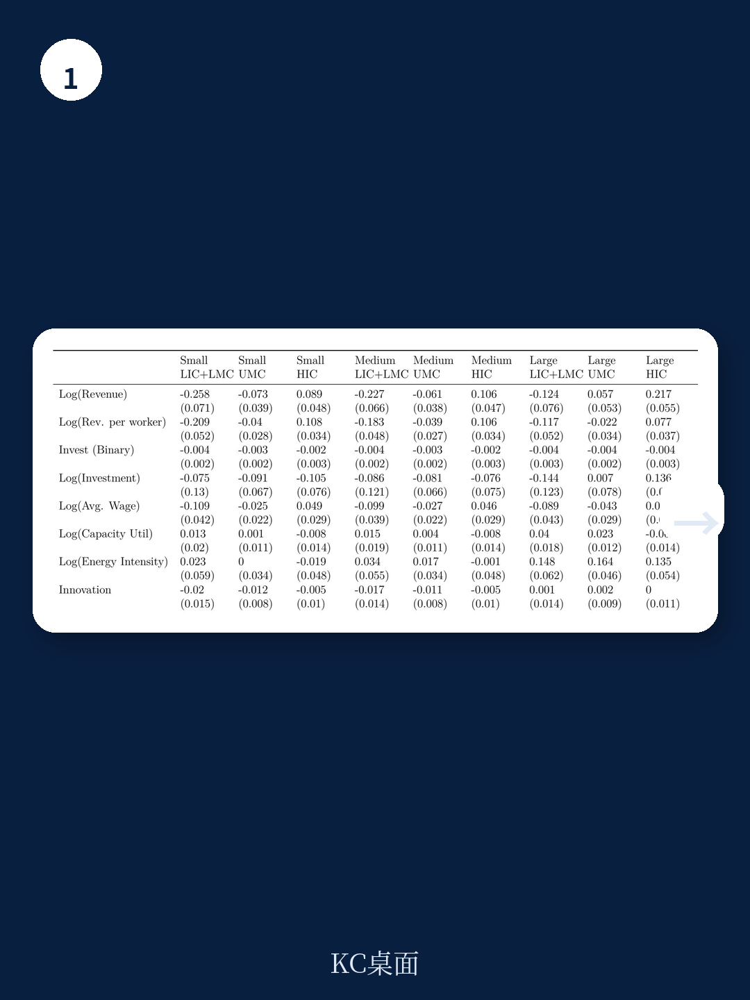
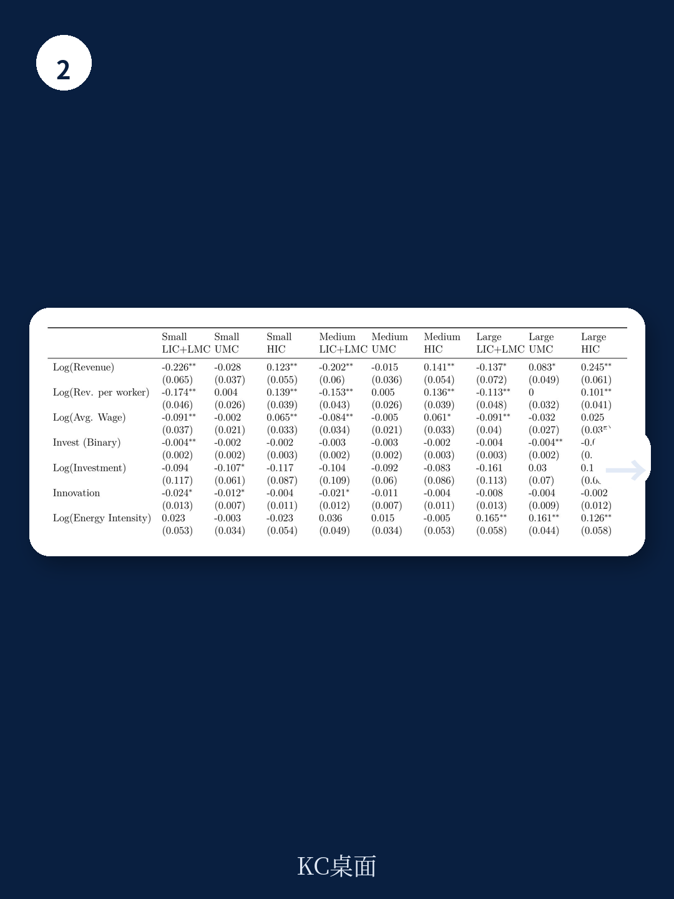

# 世界银行：全球16万家企业数据揭示，气候适应力正在制造新的贫富分化

气候变化的讨论长期集中在宏观预测——升温多少度，GDP下降几个百分点。但真正的问题不在宏观，而在微观：当温度比历史均值高出0.5度时，一家具体的企业会发生什么？它的收入会减少多少？它有没有能力做出调整？如果调整不了，是谁的错？

世界银行最新发布的政策研究工作论文《Firm-Level Climate Change Adaptation: Micro Evidence from 134 Nations》，用近16万家企业、覆盖134个国家、跨越15年的数据，给出了一个冷峻但可以被政策改变的答案。这份报告的核心判断是：市场不完善正在阻碍低收入和中等收入国家的企业适应气候变化，而适应能力的差距，正在制造一种新的结构性不平等——不是国家之间的，而是企业之间的。

## 1. 温度偏离历史均值0.5度，中小企业收入下降12%

报告最核心的发现是一个具体到令人不安的数字。在低收入和中低收入国家，当年度平均温度比历史均值高出0.5摄氏度时，中小企业的收入平均下降12%。这个数字不是理论推演，而是来自将卫星气象数据与企业调查数据在空间上精确匹配后的回归结果。

为什么是0.5度？因为报告测量的是温度偏离，而不是绝对温度。一个常年30度的热带城市，如果某年温度上升到30.5度，其经济影响可能比一个从5度上升到10度的温带城市更严重。关键在于偏离——企业、工人、基础设施都是基于历史气候模式来设计的，当模式被打破，调整成本就出现了。

12%的收入下降意味着什么？对于利润率通常在5%-10%之间徘徊的中小企业来说，这相当于一整年的利润被抹掉，甚至可能直接触发现金流断裂。报告同时指出，这种冲击不是一次性的——随着全球变暖加速，温度偏离的频次和幅度都在增加，企业面临的不是单次冲击，而是系统性压力。

> **KC评论：** 0.5度听起来很小，但请记住这是年度平均温度的偏离。实际影响是通过极端高温天数的累积来实现的。报告中的完整数据表显示，在低收入国家，热浪天数（超过历史95分位的高温日）的偏离均值已经达到每年数十天。完整报告对此有更细致的分国家、分行业的表格拆解，值得仔细对照。

## 2. 制造业和服务业同样脆弱，劳动力生产率是核心传导渠道

一个常见的直觉是：气候变化主要影响农业和户外作业，制造业和服务业有厂房、空调、室内环境，应该相对免疫。世界银行的数据推翻了这一假设。

报告发现，温度冲击对制造业和服务业企业的影响“同样显著”。这不是因为工厂没有空调，而是因为劳动力生产率在高温下系统性下降。工人效率降低、缺勤率上升、错误率增加，这些微观层面的变化最终汇总到企业收入上。值得注意的是，报告还发现工资也随之下降——这意味着工人承担了部分成本，但企业也没有完全逃脱损失。

这一点对于全球供应链的决策者尤其重要。许多跨国公司在低收入国家设有制造基地或服务外包中心，如果这些地区的温度持续偏离历史均值，其成本结构将面临隐性侵蚀。不是关税，不是汇率，而是气温——正在成为供应链竞争力的新变量。

## 3. 热敏感行业和低韧性企业，承受了不成比例的冲击

报告进一步区分了不同类型企业的脆弱性。热敏感行业——食品加工、交通运输、建筑、部分服务业——受到的冲击更大，这符合直觉。但更有价值的发现是“韧性”指标的作用。

报告中的“韧性”是一个复合指标，衡量企业生产流程的灵活性和冗余度，包括是否有多元化供应商、是否有备用能源、是否有应急生产方案。韧性较低的企业，在温度冲击下收入下降幅度显著更大。这意味着，适应能力不是抽象概念，而是可以被测量、被投资、被提升的具体能力。

> **KC评论：** 这里有一个政策含义值得追问：韧性投资需要资本，而最容易遭受冲击的中小企业恰恰最缺资本。报告提到了“有限融资”是约束企业适应能力的关键因素，但没有完全展开。完整报告中有关于融资约束、监管负担、安全状况等政策变量与企业适应能力的交互分析，这些图表和回归结果是理解“为什么市场失灵”的关键材料。

## 4. 收入水平是最大的调节变量：富国企业为什么能“免疫”

报告中最具政策张力的发现是：收入水平显著“压平”了温度-收入曲线。在高收入国家，即使是中小企业，温度偏离对收入的影响也远小于低收入国家。这不是因为高收入国家天气更凉爽，而是因为它们的市场更完善、基础设施更可靠、融资渠道更畅通。

换句话说，适应能力本身就是一种发展成果。高收入国家的企业之所以能够“免疫”，不是因为它们更聪明，而是因为它们所处的生态系统提供了缓冲：稳定的电力供应让空调持续运转；发达的金融市场让企业可以贷款购买冷却设备；有效的监管环境让企业不必在合规上消耗额外精力。

这反过来意味着，低收入国家的企业面临的是双重困境：它们不仅承受更大的气候冲击，还缺乏调整的工具。而报告明确指出，这些政策约束——有限融资、繁重监管、不安全环境——是可以通过政策改革来缓解的。气候适应不完全是自然科学的命题，更是制度经济学的命题。

## 5. 报告尚未完全回答的关键问题：适应投资的回报周期与融资缺口

报告在政策建议层面留下了几个未完全展开的问题，这恰恰是读者继续深入阅读完整报告的最大理由。

第一，适应投资的回报周期。企业投资备用发电机、改造厂房隔热、建立冗余供应链，这些都需要前期资本支出。在低收入国家，资本成本高企、融资期限偏短，企业的投资回报预期可能无法满足内部收益率门槛。报告提到了融资约束，但没有给出具体的回报率测算。

第二，适应投资的“搭便车”问题。如果一家企业投资了韧性设施，但其所在区域的电网、道路、排水系统等公共基础设施没有同步改善，单个企业的投资效果会大打折扣。这指向了一个更深层的问题：气候适应需要公共品和私人品的协同投资，但目前缺乏协调机制。

第三，温度冲击的累积效应。报告使用的是年度数据，测量的是单一年份的温度偏离。但气候变化是一个累积过程——连续三年温度偏高，企业的适应能力是否会耗尽？报告中的稳健性检验涉及了这一问题，但完整报告中的异质性分析表格提供了更细致的视角。

这些未解问题不是报告的缺陷，而是报告的价值所在。它把气候适应从一个宏大的、不可操作的概念，拆解成了可以被政策干预的具体环节——融资、监管、基础设施、企业韧性。接下来的工作，是如何把诊断转化为行动。

---

这份世界银行报告提供了134个国家、近16万家企业、15年跨度的微观证据，其核心判断是：气候适应正在制造新的企业间分化，而政策干预可以缩小这一差距。但报告中的完整图表——包括分国家、分行业、分企业规模、分政策约束维度的异质性分析——以及详细的回归结果表格，无法在一篇导读中穷尽。

如果你希望获取完整报告的原始图表、关键回归结果的数据解读，以及更多国际信源对气候适应与企业竞争力的交叉分析，欢迎加入我们的社群。我们每日更新，汇总世界银行、IMF、各大投行及智库的最新研究，聚焦可操作的边际变化。社群中已经汇聚了头部券商、PE/VC、投行、并购、对冲基金、资管机构、战略咨询、智库等领域的从业者，期待与你交流。

Personal reading notes and learning share only. Not investment advice.

