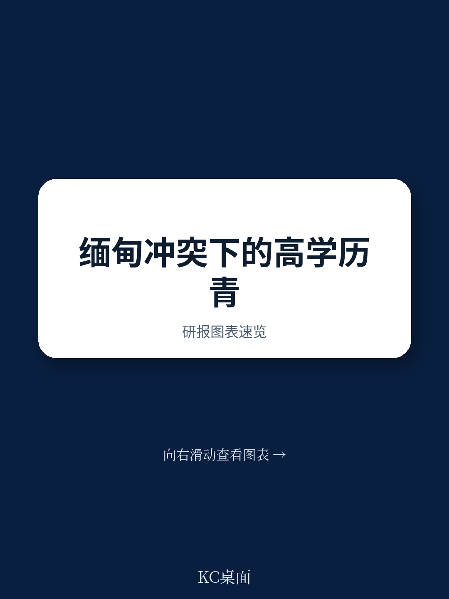
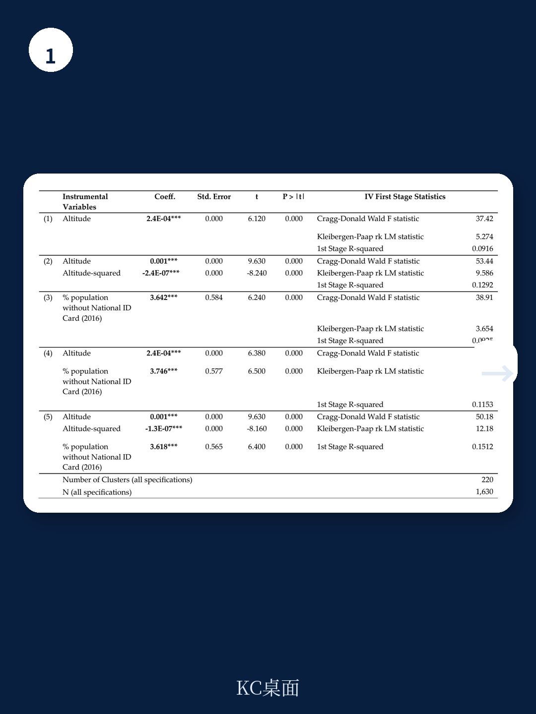
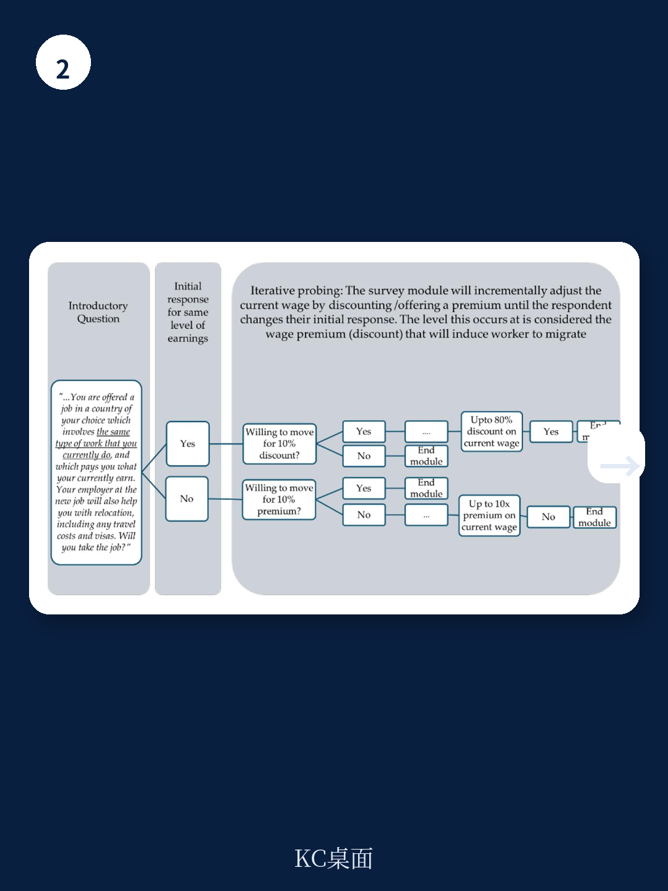

# 世界银行：冲突如何迫使高技能人才主动“降级”求职

这份世界银行最新工作论文揭示了一个反常识的结论：当冲突加剧时，高技能人才非但没有因为稀缺性而更挑剔工作，反而更愿意接受低于自身资历的岗位。这不是简单的“生存优先”，而是安全需求对人力资本定价机制的结构性重塑。

## 1. 冲突让高技能人才愿意为“低就”接受更低的工资溢价

传统经济学假设，劳动者会对不适合自己资历的工作要求额外补偿——即“补偿性工资差异”。世界银行这份针对缅甸高技能青年的实验研究表明，当冲突强度上升一个标准差，劳动者为接受低技能工作所要求的额外溢价会下降约7-9个百分点。这意味着，冲突地区的人才正在用职业尊严换取安全。

这个发现的关键不在于“冲突导致移民”，而在于它改变了移民质量。通常，经济移民是为了获取更高的技能匹配回报，而冲突驱动的移民却在出发前就已经接受了人力资本的折价。这批人到了目的地后，更可能长期停留在低技能岗位，形成代际传递的贫困陷阱。

> **KC评论：** 这份报告的核心洞察不是“冲突让人想移民”，而是“冲突让人愿意以更低的价格出卖自己的技能”。如果你关注全球劳动力市场或东南亚产业链转移，这个发现意味着流入泰国、马来西亚等国的缅甸劳动力，其实际生产力可能远低于其教育水平，这会压低当地低技能岗位的均衡工资，同时也意味着这些移民的人力资本被系统性浪费。完整的实验设计和数据分组在报告中有更详细的拆解。

## 2. 冲突的边际效应在女性、少数民族和语言弱势群体中放大三倍

报告最值得关注的异质性分析显示，冲突对职业降级意愿的影响并非平均分布。女性群体受冲突影响的边际效应是男性的2-3倍；英语能力“不足好”的群体，其效应显著，而英语能力“好”的群体效应不显著；家中没有海外社会网络的群体，效应更加明显。

这些发现指向一个残酷的现实：冲突不仅制造了“降级移民”，而且优先惩罚那些本来就处于劳动力市场弱势地位的群体。女性在冲突环境中面临更高的安全风险，因此更愿意接受任何能离开的工作；语言弱势意味着在目的地找到匹配岗位的概率更低，因此他们在出发前就已经把预期调低。

从政策角度看，这意味着目的地国家的移民融合政策需要区分“经济移民”和“冲突移民”，因为后者的初始谈判地位完全不同。如果按照统一标准评估技能、提供岗位匹配服务，可能会错过对最脆弱群体的定向干预窗口。

> **KC评论：** 报告没有展开的是，这些异质性效应在多大程度上可以被目的地国家的政策抵消。例如，如果泰国或马来西亚为缅甸移民提供语言培训或职业认证转化服务，能否在移民抵达后修复这种“出发前就已经形成的降级倾向”？报告原文的附录表格提供了更细维度的分组回归结果，包括按家庭收入、债务状况、是否已有人移民等交叉分析，这些数据对设计干预措施至关重要。

## 3. 领土争夺区和征兵令是驱动降级意愿的两个关键机制

报告通过两个自然实验验证了“安全优先于经济”的机制。首先，冲突效应主要由居住在“领土争夺区”的受访者驱动——这些地区政府军与地方武装反复拉锯，安全环境最为不确定。其次，在调查期间缅甸突然实施征兵令后，符合条件的年轻男性受访者对降级工作的接受度显著上升。

这两个机制说明，不是所有冲突都同等影响职业降级意愿。只有当冲突直接威胁到个人安全（而非仅仅是宏观经济恶化）时，人才才会系统性地降低对工作匹配的要求。这解释了为什么一些战乱国家（如叙利亚）的难民在目的地普遍从事低技能工作，而经济制裁下的国家（如伊朗）的人才移民则更多保持技能匹配。

这意味着，对于政策制定者而言，评估冲突对人力资本的影响不能只看GDP增速或失业率，而需要关注安全感知的微观变化。征兵令、宵禁、检查站密度等指标，可能比宏观数据更能预测移民质量的恶化。

## 4. 报告尚未回答的关键问题：这种降级倾向是可逆的吗？

报告聚焦于“出发前”的决策阶段，但留下了几个关键问题。第一，这些在冲突环境中形成的降级倾向，在移民抵达安全目的地后，能否通过时间或政策干预逆转？第二，报告测量的“职业降级意愿”是否真实转化为实际的降级就业？实验情境与真实决策之间可能存在差距。第三，如果冲突持续多年，“降级移民”是否会形成新的社会规范，让原本不愿意降级的人也逐渐接受？

这些问题之所以关键，是因为它们关系到目的地国家的长期劳动力市场结构。如果降级倾向是暂时的、可修复的，那么政策重点应该是抵达后的技能认证和培训；如果它是持久的，那么目的地国家可能需要面对一代人的人力资本损失。

## 5. 对观察者的框架：用“补偿性工资差异”重新审视全球人才流动

这份报告提供了一套可迁移的分析框架。任何关注全球人才流动的读者，都可以用“补偿性工资差异”这个概念来重新审视其他冲突地区（如乌克兰、苏丹、阿富汗）的移民数据。具体而言，可以关注三个信号：

第一，观察移民群体的平均教育水平与就业岗位的技能要求之间的差距。如果差距在冲突爆发后迅速扩大，说明“出发前降级”正在发生。第二，关注女性移民的就业分布。报告显示女性对冲突更敏感，因此女性移民的降级程度可以作为冲突影响的早期指标。第三，注意移民来源地的安全动态而非仅仅是经济数据。征兵令、宵禁等政策变化可能比失业率更能预测移民质量的转折点。

对于投资东南亚劳动力市场的机构而言，这个框架意味着：缅甸冲突持续的时间越长，流入邻国的劳动力质量就越低，这既会压低低端服务业的工资成本，也会降低这些移民在制造业中的潜在生产力提升空间。这是一个被宏观叙事掩盖的结构性变化。

---

以上分析基于世界银行政策研究工作论文11075号的实验设计和核心发现。如果你希望获取完整的回归表格、异质性分析的分组数据，以及我们对东南亚劳动力市场变化的持续跟踪解读，欢迎加入我们的社群。这里汇聚了头部券商、PE/VC、投行、并购、对冲基金、资管机构、战略咨询和智库的朋友，每日更新国际主流叙事、数据与图表，观测边际变化。扫码交流，领取完整研报解读与原始图表。

Personal reading notes and learning share only. Not investment advice.

