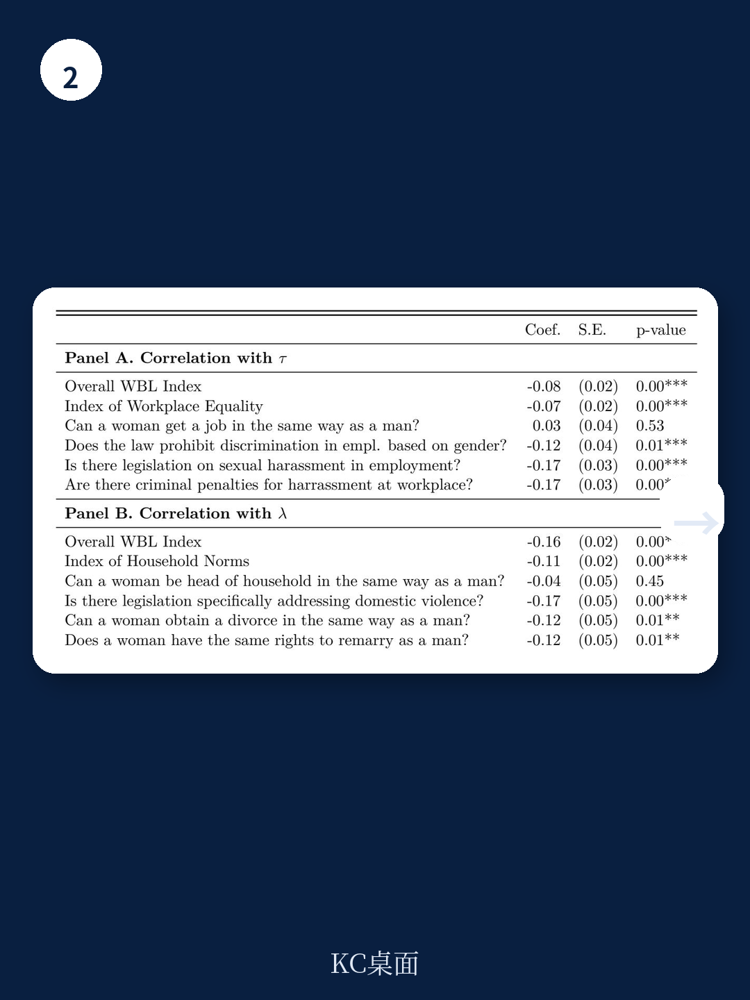

# 世界银行：性别壁垒下降贡献了全球28%的人均GDP增长，但印度是反例

当全球大部分经济体在过去五十年经历了女性劳动参与率的显著上升时，一个更深层的经济问题被忽略了：性别壁垒的消融，不仅仅是社会进步的标志，更是结构性转型和经济增长的独立驱动力。世界银行最新发布的工作论文，基于91个国家、跨越五个十年（1970-2018）的微观数据，给出了一个量化的答案：性别壁垒的下降，平均解释了样本国家28%的人均GDP增长。但这一数字背后，隐藏着国家间的巨大分化——从巴西的超过50%，到印度的负贡献。

这份报告的价值不在于重复“女性参与经济有益”的常识，而在于它首次系统性地拆解了性别壁垒、结构性转型与经济增长之间的因果链条。更关键的是，它揭示了一个反直觉的发现：制造业的“去工业化”并非完全是技术或贸易的结果，性别壁垒的下降本身就在推动劳动力向服务业转移。

## 1. 女性就业路径与男性迥异：制造业不是女性的目的地

传统结构性转型理论认为，随着经济发展，劳动力会从农业流向制造业，再流向服务业。但世界银行的这份报告发现，这一经典路径主要适用于男性。女性的就业转型遵循完全不同的轨迹。

在低发展阶段，女性离开农业后，主要流向是“退出劳动力市场”，而非进入制造业。只有当经济发展到更高阶段，女性才重新进入劳动力市场，且几乎全部集中在服务业。女性的制造业就业比例在所有发展水平上都保持低位，这一模式与男性形成鲜明对比。

这意味着什么？如果一个经济体试图通过发展制造业来吸纳女性劳动力，可能从一开始就选错了方向。女性的就业选择更多受到社会规范、职业隔离和家庭责任的约束，而非单纯的产业结构变化。这一发现对发展中国家制定产业政策和就业战略具有直接的警示意义。

> **KC评论：** 许多发展中国家的政策制定者仍然将制造业视为女性就业的主要出路，但这份报告的数据表明，女性在制造业的参与度从未随发展水平提高而显著上升。真正拉动女性就业的是服务业，尤其是专业和管理岗位。这提示我们，与其补贴制造业用工，不如消除服务业中阻碍女性进入的隐性壁垒。完整报告中的图1和图2详细展示了这一跨国家的性别就业模式差异，值得仔细比对。

## 2. 性别壁垒的量化：从“规范”到“歧视”的双重维度

报告构建了一个包含职业和部门选择的理论模型，将性别壁垒拆分为两个可量化的维度：一是“性别规范”，即女性在特定职业-部门组合中工作所承担的额外效用成本（例如社会偏见、家庭责任）；二是“工资歧视”，即女性每单位人力资本获得的报酬低于男性。

通过对印度、印尼、巴西、墨西哥、加拿大和美国这六个主要经济体的结构性估计，报告发现了三个关键模式。第一，性别规范在过去五十年中显著下降，尤其在服务业以及专业、管理和文职岗位中。第二，工资歧视也在所有部门和职业中有所下降，但专业岗位的改善幅度相对较小。第三，国别差异巨大：巴西、墨西哥、加拿大和美国经历了性别壁垒的大幅下降，印尼改善甚微，而印度的性别壁垒反而恶化了。

这一量化框架的贡献在于，它区分了“经济机制”（如技术进步、收入效应、教育提升）和“性别壁垒”对就业和工资变化的独立影响。以往的研究往往将两者混为一谈，而这份报告通过反事实模拟，清晰地分离出了性别壁垒变化的净效应。

> **KC评论：** 报告中最值得关注的图表是估计出的性别壁垒随时间变化的曲线。你会看到，印度的性别壁垒在1970年代到2010年代不仅没有下降，反而在部分职业中上升。这与印度同期女性劳动参与率持续下降的宏观事实高度吻合。报告没有展开的是，印度性别壁垒恶化的具体原因——是宗教文化因素、法律缺失，还是产业结构本身不利于女性？这恰恰是完整报告中值得深入挖掘的部分。

## 3. 反事实模拟：性别壁垒下降贡献了28%的增长，但印度是拖累

报告的核心贡献在于反事实模拟。假设性别壁垒停留在1970年代的水平，而其他所有变量（技术、技能分布等）按实际路径演变，那么六个经济体的增长路径会是什么样？

结果令人震撼。平均而言，性别壁垒的变化解释了样本国家28%的实际人均GDP增长。其中，巴西超过50%，加拿大和墨西哥约40%，美国约28%，印尼约10%。而印度，由于性别壁垒恶化，实际经济增长本可以更高——也就是说，印度因性别壁垒的固化而损失了潜在增长。

更细致的分解显示，性别壁垒下降对制造业和服务业的就业增长贡献了40%-45%，对这两个部门的产出增长贡献了20%-35%。特别值得注意的是，性别壁垒下降是服务业快速扩张的一个重要但此前被忽视的驱动力。这一发现为理解发展中国家“过早去工业化”现象提供了全新视角：服务业吸纳了从农业和制造业转移出来的女性劳动力，这种转移本身就在加速制造业的相对萎缩。

**“所以呢”的含义：** 对投资者和产业决策者而言，这意味着评估一个国家的增长潜力时，不能只看资本积累和技术进步，性别壁垒的现状和趋势正在成为越来越重要的变量。一个性别壁垒顽固的经济体，可能正在系统性地损失其潜在增长率。

## 4. 报告尚未完全回答的关键问题：因果方向与政策工具

尽管报告的量化分析令人信服，但它留下了几个悬而未决的问题，这些恰恰是决策者最关心的。

第一，因果识别的挑战。报告通过模型将性别壁垒的变化视为外生冲击，但这在现实中很难成立。性别规范的改变本身可能就是经济增长、教育普及和城市化等过程的内生结果。报告承认了这一局限，但未能提供令人信服的工具变量或自然实验来直接识别因果关系。

第二，政策工具的模糊性。报告告诉我们性别壁垒下降很重要，但几乎没有讨论“如何下降”。是立法禁止歧视更有效，还是提供育儿补贴、灵活工作安排？不同国家文化背景下，哪些干预措施能最有效地降低性别规范带来的效用成本？报告没有提供答案。

第三，工资歧视与性别规范的相对重要性因模型设定而异。在基准模型中，性别规范对增长的贡献大于工资歧视；但在另一种偏好设定下，结果反转。这一技术细节实际上暗示了政策取向的困难：如果主要是规范在起作用，政策重点应该是社会观念和家庭分工；如果主要是歧视在起作用，政策重点应该是劳动执法和企业监管。

> **KC评论：** 报告第7.2节专门讨论了不同模型设定下两种壁垒的相对重要性。这一部分技术性较强，但恰恰是理解政策含义的关键。如果你只能读完整报告的一节，我建议读这一节。它会让你明白，为什么同样一份数据，不同的理论假设会推导出截然不同的政策优先级。

## 5. 一个值得持续跟踪的观察框架

这份报告为关注全球经济增长和劳动力市场的读者提供了一个可操作的观察框架：在评估任何一个经济体的中长期增长前景时，应当系统性地纳入性别壁垒的维度。

具体而言，可以关注三个指标。第一，女性劳动参与率的趋势及其与男性参与率的差距——这一指标最容易获取，但需要结合部门结构来看。第二，专业和管理岗位中女性的占比变化——这比总体参与率更能反映性别规范的改善程度。第三，同一职业-部门组合内的性别工资差距——这直接度量了工资歧视的残余程度。

将这些指标与人均GDP增长、服务业占比等宏观变量交叉分析，可以帮助投资者和政策制定者提前识别那些正在释放或抑制女性经济潜力的经济体。巴西的性别壁垒改善与增长红利正相关，印度的恶化与增长损失正相关，这并非巧合。

## 6. 未解问题与继续探索的方向

世界银行的这份报告打开了一扇门，但门后的许多房间仍然黑暗。性别壁垒下降的具体传导机制——是通过提升人力资本配置效率，还是通过扩大总劳动供给，抑或是通过改变家庭消费结构——尚未被充分拆解。不同发展阶段的国家的“最优性别壁垒下降速度”是多少？是否存在“过快”导致社会成本过高的风险？

更重要的是，这份报告聚焦于六个主要经济体，但其方法论完全可以扩展到更多国家。中国、韩国、日本、德国等经济体的性别壁垒演变如何？它们对增长的贡献是否也类似？这些问题在报告中只是被提及，但没有展开。

**这些未解问题，恰恰是完整报告中最值得深读的部分。** 原文中包含了91个国家的就业数据、六个核心经济体的详细工资数据、模型的结构性估计参数，以及多种稳健性检验。只有阅读完整报告，你才能理解这些反直觉结论背后的数据支撑和模型假设。

---

我们每天汇总国际主流信源、数据和图表，追踪全球头部机构的研究框架与边际变化。社群汇聚了来自头部券商、PE/VC、投行、并购、hedge fund、资管机构、战略咨询、智库等领域的朋友，期待与你交流。扫码加入，领取完整研报解读与原始图表。

Personal reading notes and learning share only. Not investment advice.

