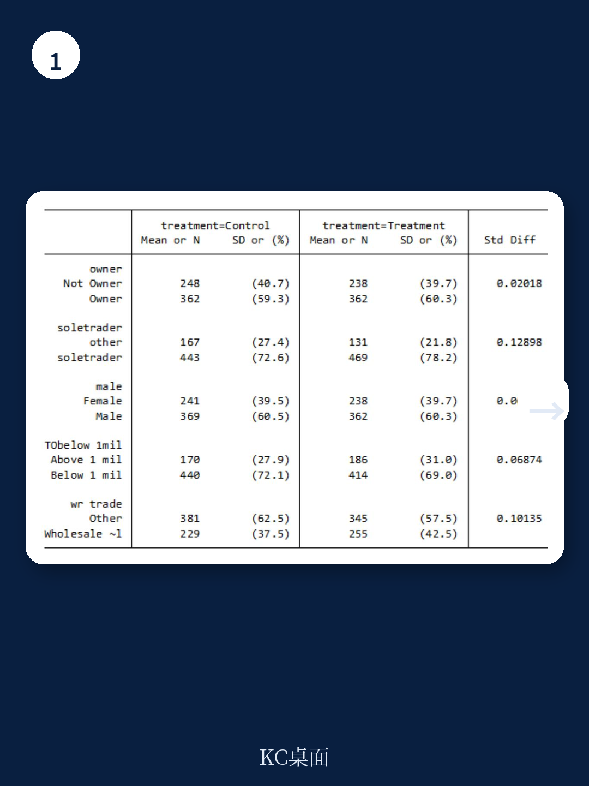
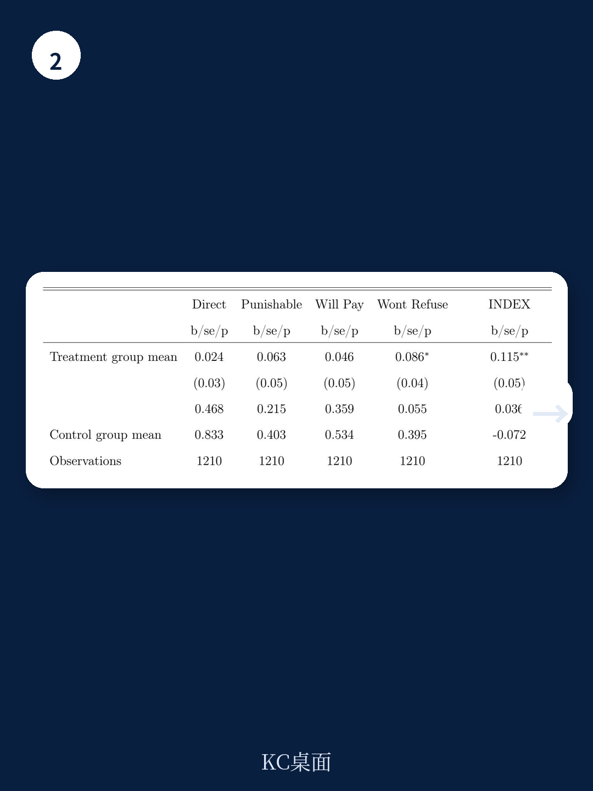

# 世界银行：中小企业怕的不是税务官，而是“税务官来了又走”

坦桑尼亚的税务局官员跟着调查员一起入户走访，这件事本身听起来像一场“突袭检查”。但世界银行一份基于随机对照实验的最新工作论文给出了一个反直觉的结论：税务官员的短期在场，并没有显著提升中小企业的整体纳税遵从度。真正值得关注的，不是“有没有人管”，而是“管完之后还管不管”。

这份研究由世界银行与坦桑尼亚税务局联合实施，在119个城市和城郊区域随机抽取一半的社区，让税务官员陪同独立调查公司进行面对面访谈。这相当于一次人为制造的、短暂但真实的税务官在场率提升。研究团队随后结合调查问卷和行政申报数据，追踪了这些企业对税务的态度和实际纳税行为的变化。

如果你以为“只要税务官多露脸，企业就会乖乖交税”，那这份报告可能会让你重新思考。它揭示了一个更深层的治理难题：短期震慑有效，但不可持续；长期信任的建立，需要的不是一次性的“帮忙”，而是可预期的、公平的制度环境。

## 1. 税务官在场对纳税遵从的整体影响并不显著，但存在明显的区域分化

这是整个实验最核心的发现。从全样本看，无论是“是否纳税”（广度）还是“纳税金额”（深度），处理组和控制组之间没有统计上的显著差异。换句话说，让税务官跟着调查员走一圈，并没有让整个社区的中小企业突然变得老实。

但细分之后，故事出现了转折。在坦桑尼亚的经济中心达累斯萨拉姆（Eastern区域），处理组企业在实验后的第一个季度（2023年第一季度）中，无论是纳税概率还是纳税金额都出现了显著的短期提升。而在其他地区，这种效应并不存在。

这意味着什么？达累斯萨拉姆是税务局总部所在地，税务官的日常可见度本来就远高于其他地区。当实验进一步提高了这种可见度，企业感知到的执法可信度被推高到了某个“临界点”，从而触发了短期行为改变。而在税务官平时就很少出现的地区，一次性的露面反而可能被企业视为“作秀”，不足以改变其纳税决策。

> **KC评论：** 这个区域分化告诉我们一个重要的管理学常识——边际效应递减的反面也存在“边际效应门槛”。对于执法力量本就薄弱的地区，一次性的集中行动可能只是“打水漂”。真正有效的策略，是让企业形成“税务官随时可能来”的稳定预期，而不是“税务官今天来了”。

## 2. 短期合规提升的驱动力是“震慑可信度”，而非“服务获得感”

研究团队在实验结束16个月后（2024年4-5月）进行了一次追访调查，试图拆解企业行为变化背后的心理机制。问卷设计了两个维度的测量：一是企业对税务局执法严厉程度的感知（震慑），二是企业对税务局服务态度和信任度的感知（服务）。

结果很清晰：在达累斯萨拉姆，短期合规提升与“震慑可信度”的上升高度相关，而与“服务获得感”没有显著关联。而在其他地区，虽然“服务获得感”的测量指标有所改善，但这并没有转化为实际纳税行为的改变。

这个发现对全球范围内正在推行的“服务型税务管理”改革提出了一个尖锐的拷问：当税务局试图从“执法者”转型为“服务者”时，企业真的买账吗？至少在这份实验中，短期内的答案是否定的。企业更倾向于把税务官的到场理解为“来查我”，而不是“来帮我”。

这并不意味着服务导向的改革没有价值。它可能是一个更长期、更缓慢的信任重建过程，无法通过一次性的干预在几个月内见效。但决策者必须清醒地认识到，在短期内，“看得见的执法”比“摸得着的服务”更能驱动行为改变。

## 3. 企业可能在“对税务官撒谎”——这是实验设计本身揭示的最大陷阱

这份实验最巧妙也最残酷的设计在于：它同时收集了调查问卷中的“自我报告”数据和税务局行政系统中的“实际申报”数据。这两套数据的对比，揭示了一个可能的系统性偏差。

在调查问卷中，处理组企业报告了更高的“纳税道德”（tax morale），即更认同纳税义务、更愿意配合税务局。但行政数据却显示，除了达累斯萨拉姆的短期效应外，整体纳税行为并未改善。研究团队给出了两种可能的解释：要么是企业的态度真的变好了，只是行为还没来得及跟上；要么是企业“对税务官说了谎”——当着税务官的面，谁会说“我不想交税”？

> **KC评论：** 这就是为什么“满意度调查”有时会误导决策。当被调查者知道“谁在看着”时，他们的回答天然会偏向社会期望。这份实验最宝贵的贡献之一，就是量化了这种“在场偏差”的大小。完整报告中详细展示了调查问卷与行政数据之间的具体差异幅度，以及如何通过计量方法进行校正——这些细节对于任何从事政策评估或市场调研的读者来说，都是极具参考价值的工具箱。

研究团队更倾向于第二种解释——企业“lying to the taxman”。但这仍然是一个需要更多证据验证的假设。报告本身也坦诚，目前的数据还无法完全排除第一种可能性。

## 4. 实验的“溢出效应”几乎为零，这解释了为什么整体效果不显著

一个关键的设计细节是：税务官只陪同调查员访问了社区内随机抽取的部分企业，而不是所有企业。理论上，如果税务官的在场产生了“溢出效应”，即没有被访问的企业因为看到邻居被访问而改变行为，那么整个社区的纳税数据都应该发生变化。

但追访调查显示，这种溢出效应微乎其微。没有被税务官直接接触的企业，其纳税态度和行为几乎没有变化。这意味着，一次性的、局部的税务官露面，其影响力高度局限于被直接接触的企业，而且这种影响力本身也极其短暂。

这对于税务管理的资源配置具有直接的指导意义。如果税务局希望通过增加基层人员来提升整体合规率，那么“撒胡椒面”式的短期行动是无效的。真正需要的是系统性的、持续性的、覆盖所有企业的常态化执法存在，而不是一次性的“运动式”走访。

## 5. 报告尚未完全回答的关键问题：长期信任如何建立？

这份实验的观察窗口主要集中在干预后的几个季度，最长的追访也只有16个月。它很好地刻画了“短期震慑”的边界，但对于“长期信任”的建立路径，几乎没有给出答案。

报告中提到的“Door to Door”倡议和纳税人教育项目，在逻辑上属于“服务导向”的长期策略。但实验本身的设计——一次性的税务官陪同走访——无法模拟这种策略的累积效应。一个核心的未解问题是：如果税务官不是“来了就走”，而是“定期来、持续来、公平地来”，企业的反应会不会完全不同？

另一个悬而未决的问题是：达累斯萨拉姆的短期合规提升，在后续季度中是否能够维持？报告没有提供2023年第二季度及之后的数据。如果这种提升只是“脉冲式”的，那么它对于财政收入的贡献就是一次性的，甚至可能因为后续的“反弹效应”而得不偿失。

这些问题的答案，可能需要一个更长周期、更多轮次的实验来回答。而这份报告的价值，恰恰在于它清晰地划出了“已知”和“未知”的边界。

---

对于关注新兴市场税务改革、中小企业政策或行为公共管理的读者来说，这份世界银行的工作论文提供了非常扎实的实验证据和思考框架。但正如报告本身所承认的，一个临时性的、外生的、基于服务导向的税务官在场干预，其因果效应并不清晰。

真正值得继续深读的，是报告中关于实验设计的详细说明——包括如何随机分配、如何平衡处理组和控制组、如何通过追访调查验证机制——以及附录中完整的平衡性检验表格和计量结果。这些细节是理解“为什么一次性的干预没有用”以及“未来什么样的干预可能有用”的关键。

我们已经在社群中分享了这份报告的完整原文、核心图表的中文解读，以及我们基于报告逻辑推演的“税务管理改革优先级矩阵”。如果你对上述任何一个未解问题有自己的判断，欢迎扫码加入社群，与来自头部券商、PE/VC、投行、战略咨询和智库的朋友们一起讨论。

Personal reading notes and learning share only. Not investment advice.

