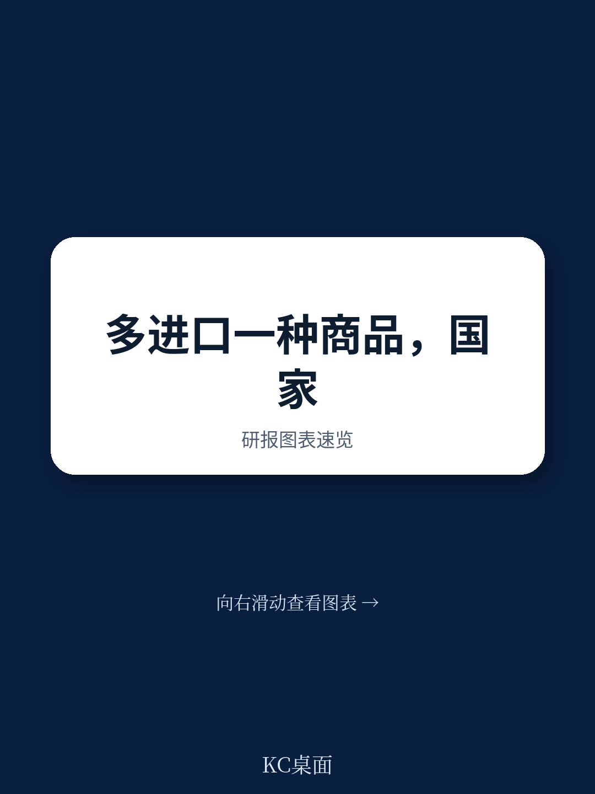
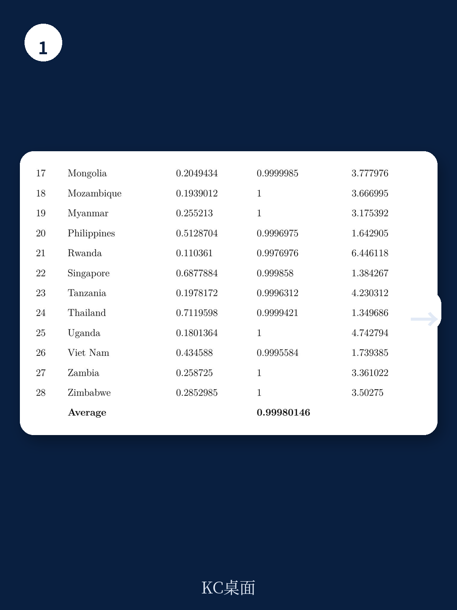
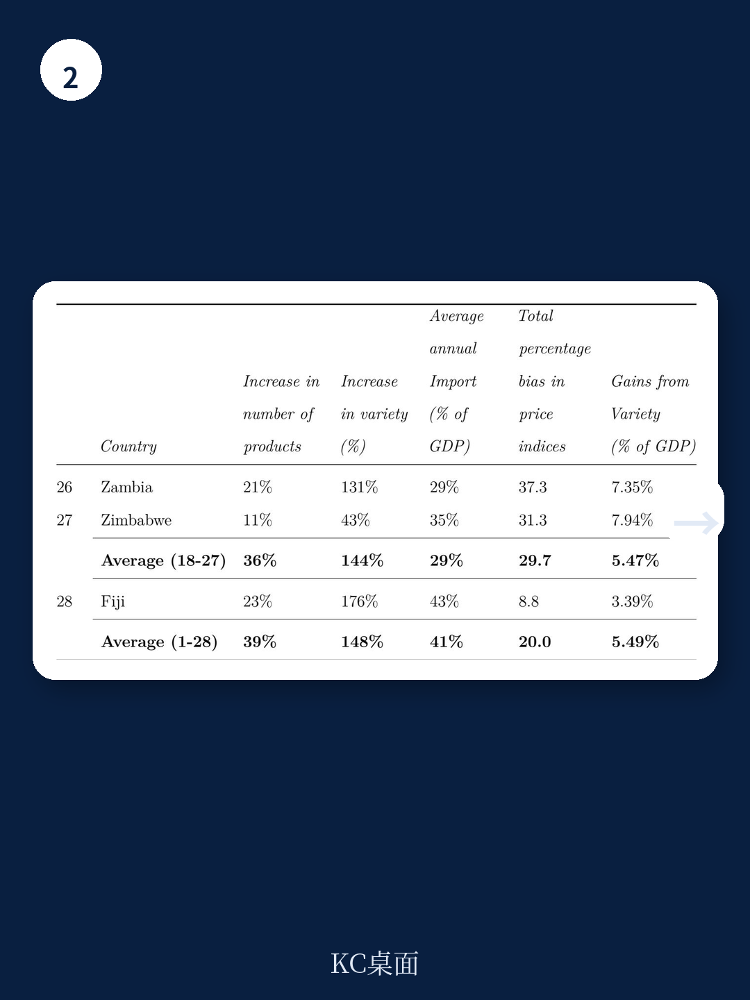

# 世界银行：小国正在从全球化中收获超预期的福利，但多数人忽视了这一点

全球化的批评声浪在过去十年持续高涨。从供应链脱钩到关税壁垒，从地缘政治碎片化到国内分配不均，质疑经济一体化益处的论述几乎成为主流叙事。然而，世界银行最新发布的工作论文（Policy Research Working Paper 11072）提供了一个被当前舆论场严重低估的视角：对于新兴市场和发展中经济体，尤其是那些规模较小、正在转型的经济体，国际贸易带来的品种扩张仍在创造可观的福利收益，其幅度远超多数人的直觉。

这篇由Enkhmaa Battogtvor、Socrates Kraido Majune和Angella Faith Montfaucon完成的报告，估算了28个东亚和东非国家在1995年至2021年间因进口商品种类增长所带来的福利变化。结论清晰而有力：非洲国家平均获得了相当于GDP 5.47%的福利增益（年均0.20%），亚洲国家（不含不丹）则为3.46%（年均0.13%）。不丹、蒙古、卢旺达和莫桑比克是样本期间获益最高的国家。

这不是一篇关于“贸易总量增长”的报告，而是一篇关于“贸易结构变化如何影响消费者真实福利”的严谨量化分析。它提醒我们，在宏观辩论之外，微观层面的品种扩张——一个中国消费者能买到智利红酒、一个卢旺达农民能用上日本农机——所释放的福利改善，可能远比我们想象得更加显著。

## 1. 进口品种的爆炸式增长，比贸易额增长更能衡量真实福利

传统贸易福利分析往往聚焦于进口总额的变化，即所谓的“集约边际”。但世界银行这份报告指出，这种视角严重低估了福利改善的真实幅度。真正关键的变量是“广延边际”——即进口商品种类和来源国数量的增长。

报告采用Armington（1969）的定义，将“品种”界定为：同一六位HS编码商品来自不同出口国即视为不同品种。这意味着，一瓶来自法国的气泡酒和一瓶来自智利的气泡酒，在消费者效用函数中是两个独立的品种。这种定义虽然严格，却更贴近现实世界中消费者对差异化的真实偏好。

数据揭示的变化令人震撼。从1995年到2021年，样本国家进口品种总数平均增长了3.5倍。其中，卢旺达增长了超过10倍，蒙古增长了8倍，柬埔寨7倍，莫桑比克6倍，不丹5倍。即使是中国这样的大型经济体，平均每个产品的来源国数量也从16个增加到33个。这些数字背后，是一个发展中国家消费者可接触到的世界商品版图急剧扩张的真实图景。

> **KC评论：** 这组数据提醒我们，讨论贸易福利时不能只看“买贵了还是买便宜了”。品种扩张本身就是一种福利改善——消费者用同样预算可以匹配到更符合偏好的商品。报告中的“品种”定义虽然技术化，但核心逻辑很简单：选择越多，效用越高。完整报告中对每个国家品种增长的细分图表，值得仔细阅读。

## 2. 弹性估计揭示：小国和转型经济体才是品种扩张的最大受益者

报告的核心方法论继承自Feenstra（1994）和Broda & Weinstein（2006）的经典框架。研究者估算了超过10万个产品层面的替代弹性，并据此构建了精确价格指数来衡量品种变化带来的福利效应。这一方法的精妙之处在于：替代弹性越低，意味着产品差异化程度越高，新品种带来的边际福利改善就越大。

研究发现，样本国家的平均替代弹性中位数为4.1，而均值为13.0。这种差异本身就说明：大量进口商品具有高度差异化特征，新品种的引入能够显著提升消费者效用。

更值得关注的是福利增益的国别分布。非洲国家平均获益5.47%的GDP，高于亚洲国家的3.46%（不含不丹）。不丹以惊人的福利增益位居榜首，其进口产品数量从1995年的519个增长到2021年的1,537个，几乎翻了三倍，品种数量更是从883个激增至5,152个。蒙古、卢旺达和莫桑比克同样表现突出。

这些国家的共同特征是什么？经济体量小、初始贸易联系薄弱、正处于经济转型期。对于这些国家而言，建立和扩展贸易联系本身就是一个巨大的福利改善来源——它们从“几乎无法获得某些品类”到“能够从多个来源国进口”，这一跨越带来的效用提升远大于那些已经高度融入全球贸易体系的大型经济体。

## 3. 大型经济体的“品种福利悖论”：为什么中国和日本的增益反而较小？

报告的一个反直觉发现是：经济体量越大、初始贸易网络越发达的国家，从品种扩张中获得的福利增益反而越小。日本、韩国、中国香港等经济体的福利增益相对温和。这一现象并非首次被观察到——Mohler和Seitz（2012）对欧盟国家的研究同样发现，法国和德国这两个最大的经济体出现了“负的品种增益”。

这背后的逻辑并不复杂。大型经济体在样本期初就已经拥有高度多样化的进口品种结构。它们的进口篮子已经接近“全覆盖”，新品种的边际贡献自然递减。而对于不丹或卢旺达这样的国家，从“只能从1-2个国家进口某类产品”到“可以从10个以上国家进口”，福利改善的幅度是天壤之别。

这一发现对当前关于全球化的讨论具有重要含义。当发达国家或大型新兴经济体的政策制定者开始质疑贸易自由化的收益时，他们忽略了一个事实：全球贸易体系对小型经济体的赋能效应仍然巨大。从某种意义上说，贸易自由化的“边际受益者”正在从大型经济体转向小型经济体。

## 4. 报告尚未完全回答的关键问题：品种扩张的代价与分配效应

世界银行这份报告在量化福利增益方面做得极为出色，但它也坦诚地指出了几个尚未完全解决的问题。

首先，报告将所有进口商品视为最终消费品，沿用了Broda & Weinstein（2006）的处理方式。但在现实中，大量进口商品是中间品和资本品，它们通过提升国内生产率和促进技术扩散来产生福利增益。这意味着报告的估计可能低估了品种扩张的真实效益——如果考虑中间品渠道，福利增益可能更高。

其次，报告没有系统评估品种扩张的潜在成本。贸易自由化在创造福利的同时，也可能导致特定群体的收入损失、财政税收减少等调整成本。报告在结论部分明确提到了这一方向，认为未来的研究需要同时考虑这些潜在损失以及相应的政策应对。

> **KC评论：** 这是阅读任何贸易福利研究时必须保持的批判性视角。品种扩张带来的福利增益是“总量”层面的结果，但“分配”层面的问题同样重要。谁从更多进口品种中获益？谁在竞争和调整中受损？报告没有展开这一讨论，但完整报告中关于替代弹性估计的方法论细节，恰恰是理解这些分配效应的技术基础。

## 5. 一个被低估的政策含义：贸易联系的扩展本身就是发展战略

当前全球政策讨论中，“产业政策”“战略自主”“供应链安全”成为高频词汇。世界银行这份报告提供了一个被忽视但至关重要的补充视角：对于小型发展中经济体，主动建立和扩展贸易联系本身就是一种发展战略。

报告指出，“建立和扩展贸易联系可以成为福利的来源，特别是对于小型和转型经济体——这一点在关于全球化和经济一体化积极影响的讨论中偶尔被忽视。”这句话写于2025年，在当前逆全球化情绪高涨的背景下，其分量格外沉重。

对于政策制定者而言，这意味着：即使在讨论供应链多元化和经济安全时，也不应忽视贸易开放对消费者福利和生产率提升的基础性作用。对于投资者而言，这意味着：那些正在经历贸易联系快速扩张的经济体——如报告中的不丹、蒙古、卢旺达——可能蕴含着被低估的增长机会。

## 6. 读者可以建立自己的观察框架

基于这份报告的分析逻辑，我们可以提炼出三个用于观察贸易福利变化的框架性指标：

第一，品种扩张速度与贸易额增速的差值。如果一国的进口品种增速持续快于进口总额增速，说明该国仍处于“贸易联系建立”的早期阶段，福利改善潜力较大。反之，如果品种增速放缓而总额增长，则福利改善可能更多来自价格效应而非品种效应。

第二，替代弹性的行业分布。报告估计了超过10万个产品层面的替代弹性。低弹性行业（如差异化消费品、专用设备）的品种扩张对福利改善的贡献更大。关注这些行业的进口来源国数量变化，可以更精准地判断福利改善的来源。

第三，初始贸易网络的密度。报告反复证明：初始贸易联系越薄弱的经济体，从品种扩张中获得的边际福利增益越大。这意味着，观察那些目前贸易品种较少但正在加速融入全球体系的经济体，可能捕捉到最大的福利改善空间。

---

世界银行这份报告用严谨的量化分析证明：全球化的福利故事远未结束，只是主角正在切换。当大型经济体开始质疑贸易自由化的收益时，小型转型经济体正在以前所未有的速度享受品种扩张带来的福利改善。这一事实不应被当前的政策讨论所淹没。

然而，这份报告也留下了几个值得继续追问的问题：品种扩张的福利增益如何在不同收入群体之间分配？中间品和资本品的品种扩张是否带来了更大的生产率提升？在供应链重构的背景下，这些增益是否可持续？这些问题，正是完整报告中最值得深入阅读的部分——包括具体的替代弹性估计结果、每个国家的品种变化轨迹、以及方法论中的技术细节。

**更多国际信源汇编与评论，欢迎扫码交流。每日更新，汇总国际主流叙事、数据与图表，观测边际变化。社群汇聚了头部券商、PE/VC、投行、并购、对冲基金、资管机构、战略咨询、智库等机构的朋友，期待与你交流。**

Personal reading notes and learning share only. Not investment advice.

