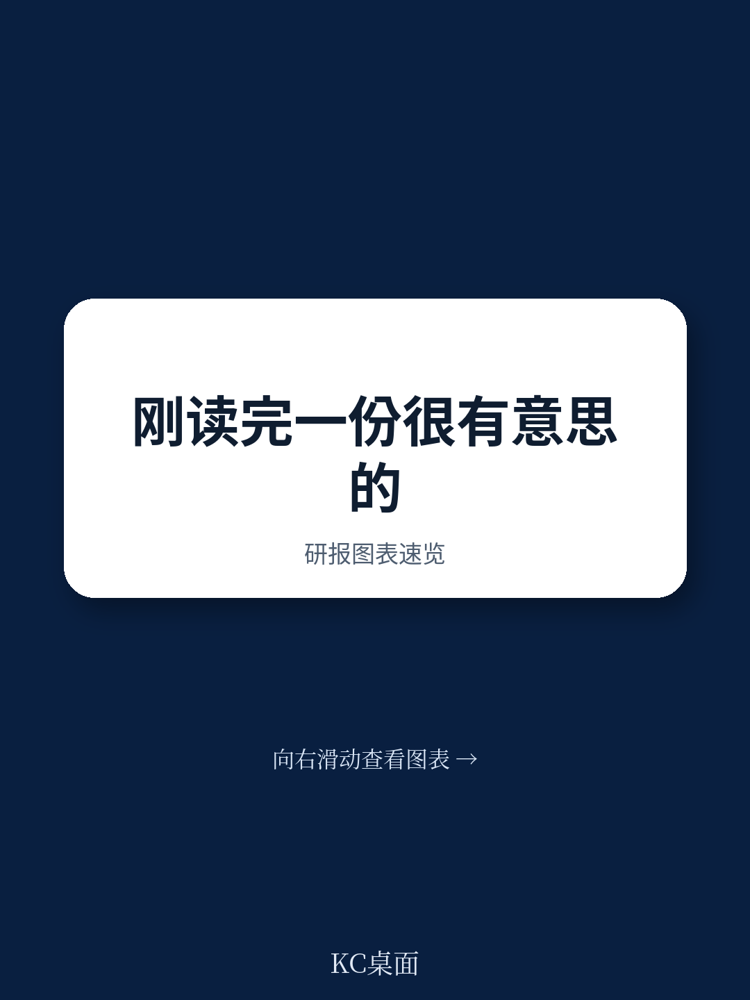
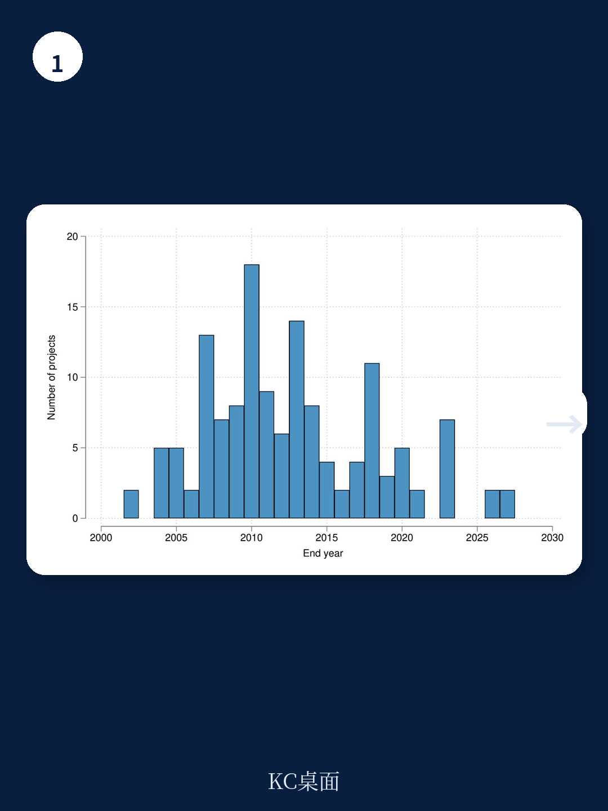
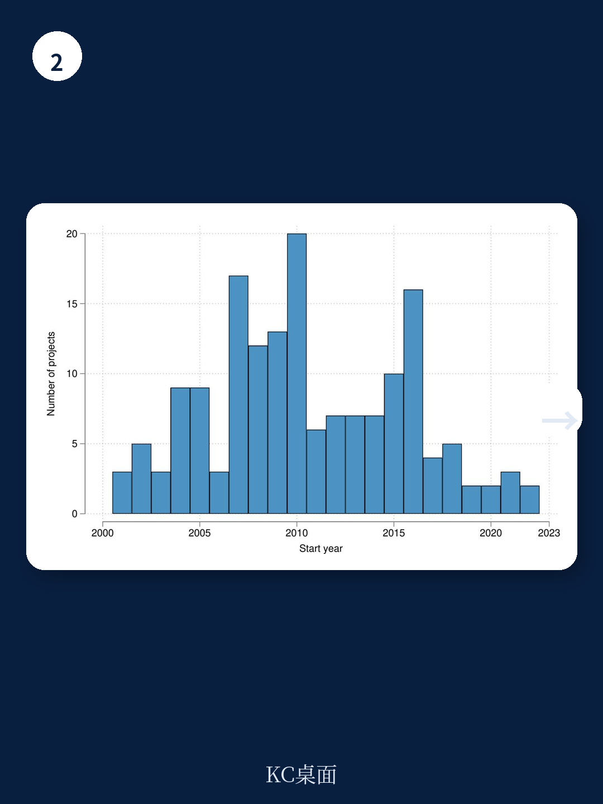

# 世界银行：刚果金的道路修复带来了和平，但这份红利只有三年有效期

当一个国家有超过120个武装组织活跃在东部，而70%的暴力事件发生在公路附近时，修复一条道路究竟是带来和平，还是为冲突提供更便捷的通道？世界银行最新发布的工作论文给出了一个既令人振奋又令人不安的答案：道路修复确实能显著降低暴力事件，降幅达到5到10个百分点。但这个“和平红利”的有效期只有三年。三年后，随着道路质量退化，暴力会重新回到修复前的水平。

这份报告的价值不在于简单回答“修路是好是坏”，而在于它用刚果金过去二十年的数据，揭示了一个被国际援助界长期忽略的关键变量——维护。没有系统性维护的基础设施投资，本质上是在购买一张有期限的和平保单。

## 1. 道路修复对暴力的抑制效应是真实的，但也是短暂的

研究团队收集了刚果金自2003年第二次刚果战争结束以来的192个大型城际道路投资项目，结合高分辨率卫星图像和机器学习算法，对道路质量变化进行了纵向追踪。核心发现清晰且有力：道路修复项目完成后，项目所在区域的暴力事件发生率显著下降5到10个百分点，其中针对平民的暴力下降最为明显。

但动态效应分析揭示了另一个残酷的事实：这种和平效应在项目完成三年后基本消失。暴力水平会反弹至修复前的状态。研究团队通过遥感数据测算出一个关键指标——道路年退化系数为0.735。这意味着修复后的道路，每年质量下降约26.5%，三年后平均质量下降超过60%。当道路重新变得难以通行，武装组织重新获得了对“不可达区域”的控制权，暴力也随之回归。

> **KC评论：** 这是整篇报告最值得记住的一个数字：三年。对于任何在冲突地区规划基础设施投资的决策者来说，这个时间窗口意味着必须把项目预算的30%以上留给后期维护，否则前期的和平投资本质上是在“租用”和平，而不是“购买”和平。完整报告里有一张动态效应图，清晰展示了暴力在修复完成后的下降和反弹曲线，建议仔细看。

## 2. 道路与暴力的关系并非简单的“好路带来好治理”

这篇报告最精彩的部分在于它没有回避问题的复杂性。学术界对道路与暴力的关系存在两种截然相反的理论。一种认为道路密度代表国家控制力，好路让政府军能够抵达“无法治地带”，从而抑制叛乱；另一种认为好路同样便利了武装分子的后勤，甚至可能成为暴力争夺的焦点。

刚果金的数据支持了哪一种？答案是“都支持，但取决于时间窗口”。在修复完成后的短期内，道路改善确实带来了和平——政府军和维和部队的机动性提升，经济活动恢复，民众出行成本下降，这些因素共同抑制了暴力。但随着时间的推移，当维护缺位导致道路退化，武装组织重新获得了对偏远地区的控制，暴力又回来了。

更微妙的是，研究还发现道路项目并没有刻意选择和平地区进行投资。恰恰相反，控制冲突风险后，道路修复对暴力的抑制效应反而更强。这意味着国际社会“通过修路促进稳定”的策略在刚果金确实产生了预期效果，只是这个效果没能持续。

> **KC评论：** 这里有一个容易被忽略的洞察：道路修复的和平效应在“针对平民的暴力”上表现最显著，而非政府军与武装组织之间的直接冲突。这提示我们，道路改善的首要价值可能在于恢复了平民的流动自由和市场经济活动，而不是改变了军事力量的平衡。完整报告中对不同暴力类型的分类回归结果值得深读。

## 3. 维护缺位：一个被系统性低估的“和平折旧率”

报告最具有政策冲击力的部分是对“维护”这个变量的定量分析。刚果金从比利时殖民时期继承的13万公里道路网络，在1960年独立后短短几个月内就有60%无法使用，到1965年只剩下5000公里处于良好状态。原因很简单：独立后刚果人立即放弃了强制劳役式的道路维护，而殖民时期根本没有建立可持续的维护体系。

这个历史教训在今天依然适用。研究团队发现，世界银行在刚果金的多个道路项目都出现了严重延期，平均延期超过28个月。原因包括：承包商能力不足、采购流程缓慢、社会环境标准合规问题、政府改组导致项目管理层更替。这些因素共同导致项目完工后几乎没有剩余资金用于长期维护。

更值得深思的是，报告引用了世界银行自己的项目完成报告，其中明确写道：“道路项目的变革理论假设的是‘永久影响’，但实际上修复后的道路因缺乏维护而迅速退化。”这个假设偏差可能是整个国际发展援助领域最昂贵也最普遍的认知错误之一。

> **KC评论：** 把道路投资的和平效应理解为“一次性购买”而非“持续订阅”，这是很多冲突地区基础设施项目失败的根本原因。完整报告附录B.5列出了世界银行多个项目的延迟原因原文，包括“因性别暴力管理不合规而暂停拨款”“地方政府选举导致项目管理层全部更换”等真实案例，这些细节比任何理论分析都更有说服力。

## 4. 报告尚未完全回答的关键问题：谁的路？谁的和平？

尽管这份报告在实证方法上非常扎实，它仍然留下了一些值得追问的问题。首先，道路修复带来的和平红利在不同类型的道路上是否存在差异？报告主要关注的是大型城际道路，但在刚果金东部，70%的政府军路障设在国道和省道上，而79%的叛军路障设在乡村支线上。如果和平效应主要来自主干道，那么大量投资支线道路的策略可能需要重新评估。

其次，道路修复与矿产资源的交互效应没有被充分拆解。刚果金东部的暴力与矿产资源争夺高度相关，而道路修复恰好便利了矿产运输。报告承认了矿区和道路投资的内生性问题，但未能完全分离“修路降低了暴力”和“修路增加了矿产收入从而改变了暴力动机”这两个渠道。

最后，也是最现实的：三年和平红利之后怎么办？报告给出了“提高道路耐久性和系统性维护”的建议，这在逻辑上完全正确，但在刚果金这样的国家，维护资金从哪来、谁来执行、如何确保不被挪用——这些问题远比识别退化系数要复杂得多。

这些未解问题恰恰说明，刚果金的案例不是一个孤立的学术问题，而是一面镜子，映射出全球所有冲突地区基础设施投资的共同困境。如果你正在关注非洲基础设施投资、冲突经济学、或者国际发展援助的有效性，这份报告提供的数据和框架值得深入研读。

报告中的完整图表、动态效应回归结果、以及世界银行项目延迟的原始文档摘录，我们在社群内做了详细的中文解读和图表演示。更多国际信源汇编与评论，欢迎扫码交流，每日更新，汇总国际主流叙事、数据与图表，观测边际变化。社群汇聚了头部券商、PE/VC、投行、并购、hedge fund、资管机构、战略咨询、智库等朋友，期待交流。

Personal reading notes and learning share only. Not investment advice.

