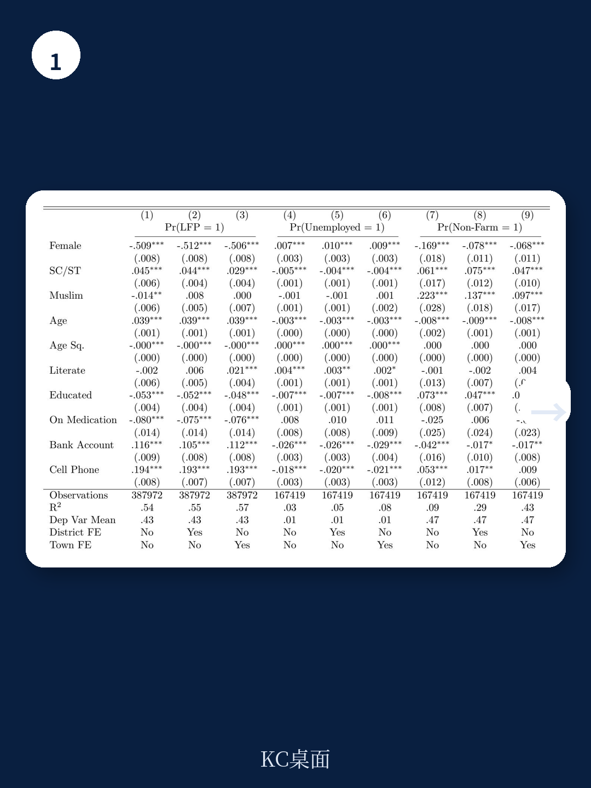
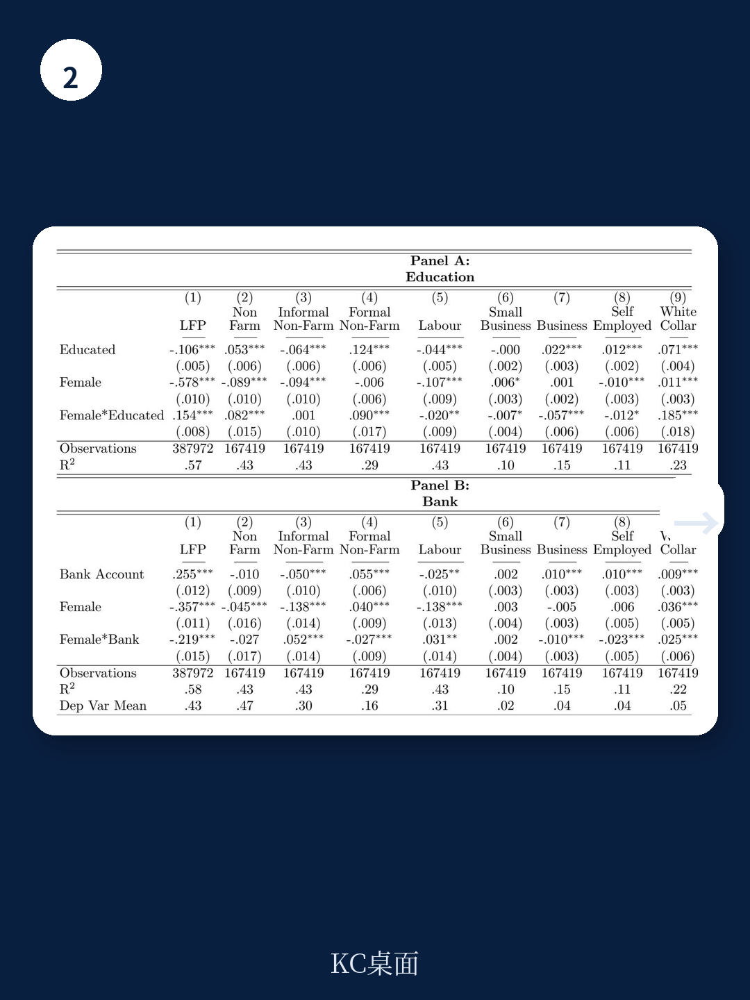

# 世界银行：印度农村非农就业的真正瓶颈不是技能，是结构

一份来自世界银行的最新工作论文，聚焦印度拉贾斯坦邦的农村非农就业，给出了一个既符合直觉又令人不安的判断：教育确实能打开非农就业的大门，但门后的世界并非对所有受教育者一视同仁。对于女性、低种姓群体以及偏远地区居民而言，即使拥有了中学学历，他们进入高薪正规非农岗位的概率仍然远低于同等条件的男性或高种姓群体。这份报告的核心贡献不在于重复“教育重要”的老生常谈，而在于量化了“教育之外的结构性壁垒”究竟有多顽固。

这并非一份关于印度某个邦的孤立研究。拉贾斯坦邦的困境——农业受气候制约、土地细碎化、非农就业增长但质量分化——在多数发展中国家具有高度代表性。当中国读者关注国内乡村振兴与县域经济时，这份报告提供的分析框架和实证方法，恰好回答了一个普遍问题：为什么同样的政策工具，在不同地区、不同人群身上效果差异巨大？

## 1. 中学教育是入场券，但女性与低种姓群体拿到的不是同一张

报告基于1999年至2011年四轮全国家庭调查数据，以及2015年的最新抽样数据，对拉贾斯坦邦农村个体的非农就业参与进行了回归分析。结论清晰且稳健：完成中学教育（secondary education）是个体进入非农部门，尤其是正规服务业岗位的最强预测因子。与仅有小学学历者相比，中学学历者获得正规非农工作的概率高出数倍。

然而，交互项分析揭示了关键的不平等。当模型加入“女性”与“中学学历”的交互项后，教育对女性的正向效应显著弱于男性。换言之，一个受过中学教育的农村女性，进入正规非农就业的概率仍然低于同等学历的男性。同样，表C2显示，对于表列种姓和表列部落（SC/ST）群体而言，即使完成了中学教育，他们进入正规非农就业的概率也显著低于同等学历的高种姓群体，反而更可能滞留在非正规非农部门或农业劳工中。

> **KC评论：** 这意味着，单纯增加教育供给并不能自动解决就业质量不平等。教育更像是一张“准入券”，但“入场后能坐到哪里”，还取决于性别、种姓和地区基础设施。报告中的交互项系数是整篇论文最值得关注的数字——它们量化了结构性歧视的“折扣率”。完整报告里还有一张按地区拆分的异质性分析表，展示了同样学历在不同县的效果差异，值得细看。

## 2. 正规非农就业显著提升家庭福利，但非正规非农与农业劳工差异不大

报告进一步考察了非农就业对家庭福利的影响，以人均消费支出作为衡量指标。结果印证了“非农就业有益”的宏观判断，但提供了重要的微观分层：只有正规（regular）非农就业，尤其是服务业岗位，才与显著更高的家庭消费水平相关。从事非正规（casual）非农工作的家庭，其福利水平与农业劳工家庭几乎没有统计上的显著差异。

这一发现对政策制定者而言意味着，推动农村劳动力从农业向非农转移本身不是终点。如果转移的终点是非正规的建筑小工、低端零售或家庭作坊，其福利改善效果可能极为有限。真正能带来阶层跃迁的，是那些有劳动合同、有稳定收入、有社保覆盖的正规就业岗位。而恰恰是这类岗位，对女性、低种姓和偏远地区居民的准入门槛最高。

> **KC评论：** 这解释了为什么许多发展中国家农村贫困率下降缓慢——大量劳动力确实“转移”了，但只是从贫困的农业部门转移到了同样贫困的非正规非农部门。报告中的消费回归表（Table 5）给出了不同就业类型对消费的边际贡献，其中正规服务业的系数是非正规非农的3到5倍。这个差距，才是政策需要瞄准的“福利鸿沟”。

## 3. 农村企业的真正瓶颈：不是缺钱，而是缺需求

报告利用企业层面的微观调查数据，对拉贾斯坦邦农村非农企业的经营约束进行了分析。结果显示，企业主自报的最大障碍并非通常认为的“融资难”，而是“本地需求不足”。在多项列举的约束中，缺乏本地市场需求被排在第一，其次是信贷获取困难，然后是基础设施（电力、道路）和技能短缺。

这一发现具有重要的政策含义。长期以来，发展中国家农村非农发展政策过度集中于供给侧——提供小额贷款、技能培训、基础设施建设。但报告的数据提示，需求侧的约束可能更为根本。在一个农村人口外流、本地购买力有限、距离城市市场较远的地区，即使企业获得了贷款和培训，产品和服务也找不到足够买家。这导致大量农村微小型企业停留在“生存型”状态，无法实现规模扩张和就业吸纳。

报告进一步区分了企业经营年限与增长意愿。新进入的企业更可能报告“融资约束”，而存续超过5年的企业则更关注“需求约束”。这意味着，企业生命周期不同阶段面临的瓶颈不同，政策干预需要因时制宜。

> **KC评论：** 这个发现对中国的县域经济和小微企业扶持政策同样有借鉴意义。许多地方热衷于建产业园、给补贴、搞培训，但如果本地居民收入上不去、人口持续外流，这些供给端的投入最终可能变成闲置产能。报告里有一张企业约束的排序表，按行业和地区拆分了不同约束的权重，完整版里可以对比拉贾斯坦邦东西部企业的差异。

## 4. 报告尚未完全回答的关键问题：技术变革如何改变非农就业的“游戏规则”

这份世界银行报告在方法和数据上相当扎实，但也坦诚指出了几个尚未充分展开的维度，其中最值得关注的是技术变革的影响。报告在引言中承认，虽然数字技术正在快速渗透农村地区，但关于“数字化如何改变非农就业机会和企业绩效”的系统性证据仍然匮乏。

具体而言，至少有三个问题悬而未决：

第一，移动互联网和数字支付是否降低了女性参与非农就业的社交壁垒？报告发现女性参与率低的一个重要原因是文化规范限制其外出工作。如果数字平台允许女性在家完成客服、数据标注、内容创作等远程工作，是否会绕过这一结构性障碍？

第二，数字化是否加剧了“正规-非正规”的分化？一方面，平台经济可能创造新的正规就业（如配送、网约车）；另一方面，它也可能将更多劳动力推向没有社保的零工经济。拉贾斯坦邦农村的实际情况更接近哪一端，报告没有给出答案。

第三，农村企业的“需求约束”能否通过电商平台缓解？如果本地需求不足，但产品可以通过互联网触达城市甚至全国市场，那么电商基础设施的普及可能成为需求侧突破的关键。报告中的数据来自2010-2011年，那时印度的电商渗透率还很低。如果用2020年后的数据重新检验，结论可能不同。

这些未解问题，恰恰是读者在读完这份报告后最想继续追问的方向。报告本身提供了一个严谨的分析框架和基线事实，但政策启示需要结合更动态的视角。

## 5. 对决策者的观察框架：从“平均效应”转向“异质性诊断”

综合报告的实证发现，我们可以提炼出一个对政策制定者和投资者都有用的观察框架：不要只看非农就业的“平均增长率”，而要关注三个维度的异质性。

第一，就业质量异质性。同样是非农就业，正规与非正规的福利差异巨大。政策目标应从“增加非农就业人数”转向“增加正规非农就业占比”。衡量指标不应只是就业率，还应包括劳动合同签订率、社保覆盖率、工资水平中位数。

第二，人群异质性。教育的边际回报在不同性别、种姓、地区之间差异显著。这意味着“一刀切”的技能培训政策可能反而扩大不平等。有效的干预需要识别出那些“教育回报率最低”的群体，针对其面临的额外结构性障碍（如通勤安全、信贷歧视、社会网络缺失）进行配套设计。

第三，企业生命周期异质性。新企业与成熟企业面临的约束不同。初创期需要融资和孵化支持，成长期需要市场拓展和供应链对接，衰退期可能需要转型辅导。政策工具箱需要按企业阶段进行匹配，而非统一发放。

这份报告的价值不仅在于它回答了“拉贾斯坦邦的非农就业现状如何”，更在于它提供了一个可复用的分析框架——如何用微观数据诊断结构性不平等，以及如何区分“表面瓶颈”与“真实瓶颈”。对于关注中国县域经济、印度农村市场或发展中国家劳动力转型的读者而言，这份报告是难得的方法论范本。

然而，报告受限于数据年份（最新数据为2015年）和地理范围（仅一个邦），其结论的外部有效性仍需更多研究检验。尤其是2016年印度废钞令、2017年GST税改以及新冠疫情对农村非农就业的冲击，报告未能覆盖。这些“自然实验”为检验既有结论的稳健性提供了机会，也为更新政策启示创造了空间。

更多国际信源汇编与评论，欢迎扫码交流。每日更新，汇总国际主流叙事、数据与图表，观测边际变化。社群汇聚了头部券商、PE/VC、投行、并购、hedge fund、资管机构、战略咨询、智库等朋友，期待与你交流。

Personal reading notes and learning share only. Not investment advice.

