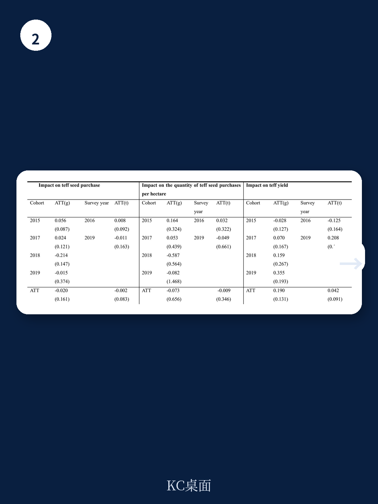

# 世界银行：种子市场化改革让埃塞俄比亚玉米增产18%，但小麦为何失效？

## 一份来自世界银行的实证研究，揭示了“放松管制”在农业领域的真实效果与边界

农业是埃塞俄比亚经济的命脉，但低下的作物生产率长期制约着这个东非国家的发展。核心症结之一，是农民对改良种子的采用率极低——到2019年，全国仅有不到四分之一的小农户使用改良品种。问题出在供给端：埃塞俄比亚的种子市场长期由国有企业垄断，从品种培育、种子繁殖到最终分销，整个链条几乎不给私营部门留出空间。这种高度集中的体制带来了需求预测失准、供应错配、库存积压、配送延迟等一系列问题。

2011年，埃塞俄比亚政府启动了一场被称为“直接种子营销”（DSM）的实验性改革，试图打破这种僵局。DSM的核心逻辑很简单：允许种子生产商（无论是国有还是私营）直接向农民销售种子，绕过政府主导的行政分销体系。这不仅是渠道的简化，更是整个种子市场运行机制的深层变革——从“计划驱动”转向“市场驱动”。

世界银行最新发布的工作论文《Seeds of Change: The Impact of Ethiopia's Direct Seed Marketing Approach on Smallholders' Seed Purchases and Productivity》，首次对这一改革进行了严格的定量评估。研究结论清晰而微妙：DSM确实有效，但它的效果高度依赖作物品种的生物学特性。对于杂交玉米，改革带来了显著的生产率提升；但对于自花授粉的小麦，效果几乎为零。

这份报告的价值不仅在于它为非洲农业政策提供了实证依据，更在于它揭示了一个普遍性的问题：市场化改革并非万能药，其成效取决于改革对象的内在属性。对于正在探索农业转型的发展中国家，以及关注新兴市场农业投资机会的机构，这份报告都提供了值得深挖的洞见。

## 1. 直接种子营销：一次“去中心化”的精准实验

要理解DSM为什么有效，首先需要理解它到底改变了什么。在改革之前，埃塞俄比亚的种子供应体系是一个典型的“自上而下”模式：政府机构在地方层面收集需求预测，逐级汇总到国家层面，然后由国有种子企业根据这些预测安排生产，再通过行政渠道层层分发回农民手中。这个体系的问题在于，需求预测往往是“拍脑袋”的，导致要么供不应求，要么大量积压。更关键的是，种子生产商与最终用户——农民——之间没有任何直接联系，他们不知道农民真正需要什么品种、什么品质的种子，也没有动力去改进。

DSM的核心变革在于“授权”。它允许国有和私营种子生产商自主进行市场需求评估，然后根据自己对市场的判断来决定生产什么、生产多少、卖给谁。种子生产商可以通过多种渠道直接销售：农民合作社、个体经销商、甚至自己的零售点。这实质上是在种子分销的“最后一公里”引入了竞争机制。

这种改革带来的好处是多维度的。首先是信息效率的提升：生产商直接接触市场，需求信号更准确。其次是交易成本的降低：中间环节被压缩，农民能以更低的价格获得种子。第三是责任机制的建立：生产商直接对农民负责，种子质量出了问题，农民可以直接找生产商，而不是找政府推广员。这对推广员也是一种解脱——他们不再需要为劣质种子的分发背“声誉风险”。

> **KC评论：** DSM的本质不是“私有化”，而是“专业化分工”。它让种子生产商专注于生产和销售，让政府推广员回归技术服务的本职。这种“让专业的人做专业的事”的思路，对于任何试图改革公共服务体系的决策者都有启发。报告的完整版本中包含了DSM从2011年到2019年的详细扩张路径——从2个试点县到290个县，从1种作物到10种作物——这个扩张过程本身就是一个关于“改革如何从试点走向规模化”的经典案例。

## 2. 玉米的胜利：杂交优势与市场激励的完美契合

DSM在玉米上的效果令人瞩目。研究采用准实验的双重差分法，发现DSM使得购买玉米种子的农户比例提高了15个百分点，每公顷玉米种子购买量增加了45%，玉米单产提高了18%。这些数字在统计上都是高度显著的。

为什么玉米能如此受益？答案藏在玉米的生物学特性里。埃塞俄比亚推广的改良玉米品种主要是杂交种。杂交玉米有一个关键特点：它的增产优势——即“杂种优势”——只在第一代表现出来。如果农民从上一季收获的玉米中留种再种，产量会大幅下降。这意味着，使用杂交玉米的农民必须每个季节都购买新的种子。这种“强制回购”特性创造了一个稳定的、可预期的市场需求，对种子生产商形成了强大的商业激励。

在DSM框架下，种子生产商看到了这个市场机会，愿意投入资源去推广杂交玉米种子、建立分销网络、提供售后服务。而农民也看到了杂交种子的增产效果，愿意为此付费。DSM搭建的市场平台，让这种供需双方的正向循环得以形成。

> **KC评论：** 玉米的案例说明了一个原理：市场化改革在“重复购买”型产品上最容易见效。如果一种产品的使用需要持续投入，市场机制就能自动运转起来。报告中包含的详细计量模型和稳健性检验，为这个判断提供了严谨的统计支撑。对于那些试图理解“什么样的农业技术最容易通过市场推广”的读者，原始报告中的异质性分析部分值得细读。

## 3. 小麦的困局：自花授粉作物的市场失灵

如果说玉米的成功是DSM的“高光时刻”，那么小麦的平淡表现则为这场改革画上了一个清醒的注脚。研究显示，DSM对小麦种子购买量和单产的影响在统计上均不显著。换句话说，改革在小麦市场上几乎没起作用。

原因同样在于生物学特性。小麦是自花授粉作物，其改良品种通常是“纯系品种”。纯系品种的遗传性状在自花授粉过程中可以稳定遗传，这意味着农民可以从上一季收获的小麦中留种，来年继续种植，产量不会明显下降。一个农民在购买了一次改良小麦种子后，可能连续三到五年都不需要再买新种子。

这种“一次性购买”特性，从根本上削弱了市场机制的作用。对于种子生产商来说，小麦种子市场是一个“一锤子买卖”的市场，缺乏持续的收入流，因此缺乏投入资源去推广的动力。对于农民来说，既然留种也能获得不错的收成，为什么要每年花钱买新种子？DSM虽然打通了销售渠道，但无法改变这个基本的经济逻辑。

> **KC评论：** 小麦的案例揭示了一个容易被忽视的问题：市场化改革不能改变产品的“复购率”。报告在讨论部分指出，这种作物间的差异“表明需要差异化的政策响应、制度安排和市场发展战略”。原文中关于小麦和玉米的对比分析图表，清晰地展示了这种差异。完整报告还进一步探讨了开放授粉玉米（OPV）的情况——它的表现介于杂交玉米和小麦之间，这进一步印证了“生物学特性决定市场可行性”的核心判断。

## 4. 报告尚未完全回答的关键问题：改革能走多远？

DSM的成效已经得到验证，但报告也留下了一些值得深思的未解问题。

第一个问题是：DSM的成功在多大程度上依赖于政府的“主动退出”？在改革过程中，政府不仅允许私人部门进入，还主动将推广员从种子分销中抽离出来，让他们专注于技术服务。这种“政府主动让位”的做法，在其他发展中国家并不常见。如果政府没有这种改革决心，或者改革遇到既得利益集团的阻力，DSM的模式还能复制吗？

第二个问题是：DSM对种子质量的影响如何？报告主要关注了“购买行为”和“产量”，但没有系统评估DSM是否改善了种子质量。理论上，直接销售让种子生产商直接对农民负责，应该会提升质量。但实践中，如果监管不到位，也可能出现“劣币驱逐良币”的现象。报告在讨论部分提到DSM“可能改善种子可追溯性”，但这只是一个推测，缺乏实证检验。

第三个问题是：DSM的长期效应是什么？报告覆盖的时间段是2012-2019年，这还不足以观察改革的长期影响。例如，DSM是否会改变农民的品种更换频率？是否会促进私营种子企业的研发投入？是否会改变种植结构？这些问题都需要更长时间的数据来回答。

## 5. 对读者的观察框架：如何评估一场市场化改革

基于这份报告，我们可以提炼出一个评估类似改革的观察框架，用于分析其他发展中国家的农业市场化改革，甚至更广义的公共服务改革。

第一，看改革对象的“复购属性”。如果改革涉及的产品或服务具有“重复购买”特性，市场化改革更容易成功；如果是“一次性购买”或“可替代性高”的产品，则需要配套其他政策工具。

第二，看政府的“退出意愿”。市场化改革不仅仅是引入私人部门，更是政府主动让渡权力和资源。政府是否愿意将推广员从商业活动中抽离？是否愿意打破既有的利益格局？这往往是改革成败的关键。

第三，看市场的“竞争结构”。DSM引入了大量私人经销商——从2012年的29个增加到2019年的约1400个。这种“百花齐放”的竞争格局，是改革效果的重要保障。如果改革只是用一个新的垄断者替代旧的垄断者，效果会大打折扣。

第四，看监管的“配套能力”。市场化不等于去监管。种子质量、品种认证、知识产权保护等都需要一个有效的监管框架。报告中提到埃塞俄比亚在2006年通过了《植物育种者权利法》，这为私营企业的品种创新提供了法律保障。缺乏配套制度的市场化改革，往往会走向混乱。

## 结语：改革没有终点

世界银行的这份报告为“种子市场化改革是否有效”提供了迄今为止最严谨的答案。答案是：有效，但有条件。对于杂交玉米这类具有“天然复购属性”的作物，市场化改革能显著提升生产率和产量。但对于小麦这类自花授粉作物，市场化改革本身不足以改变其低迷的种子采用率。

这个结论看似简单，却有着深远的政策含义。它意味着，决策者不能简单地套用“市场化”这个万能公式，而必须根据作物的生物学特性、市场结构、政府能力等具体条件，设计差异化的政策组合。对于小麦，可能需要政府直接补贴种子购买、提供品种更换的激励、或者通过合作社等组织降低农民的购买成本。

这份报告没有给出所有答案，但它提供了一个清晰的思考框架。对于关注非洲农业投资、新兴市场改革、以及国际发展政策的读者，这份报告的完整版本还包含了更多细节：DSM在不同地区的异质性效果、对小麦和苔麸等作物的具体分析、以及作者提出的六项政策建议。这些内容，值得在完整报告中深入阅读。

---

> **更多国际信源汇编与评论，扫码交流。每日更新，汇总国际主流叙事、数据与图表，观测边际变化。社群汇聚了头部券商、PE/VC、投行、并购、hedge fund、资管机构、战略咨询、智库等朋友，期待与你交流。**

Personal reading notes and learning share only. Not investment advice.

