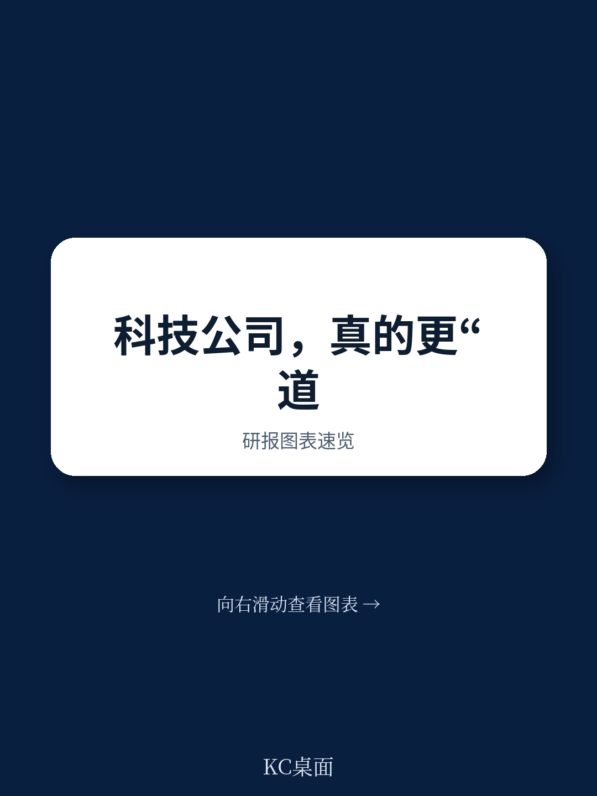
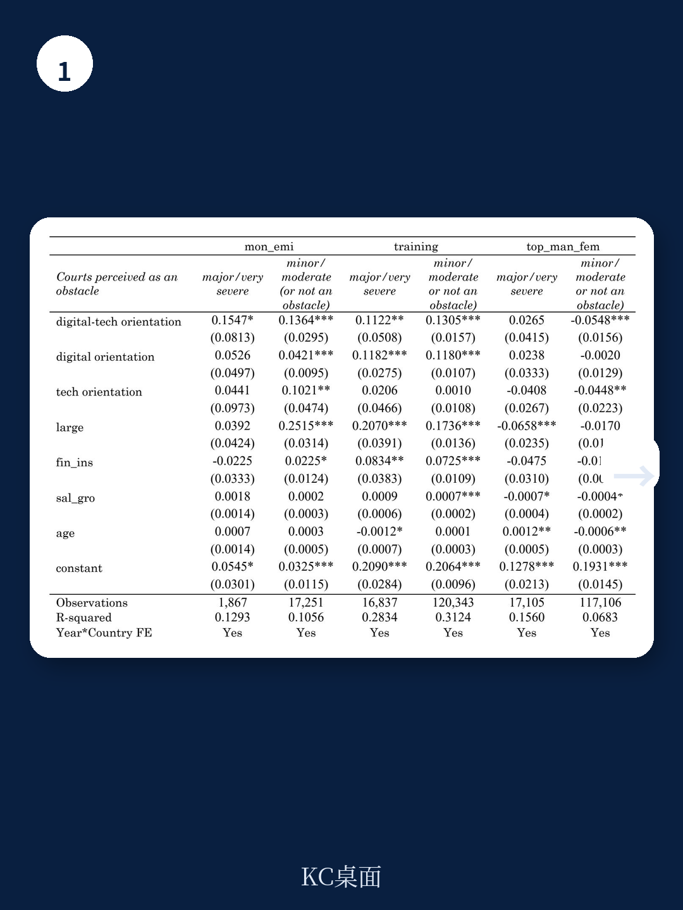
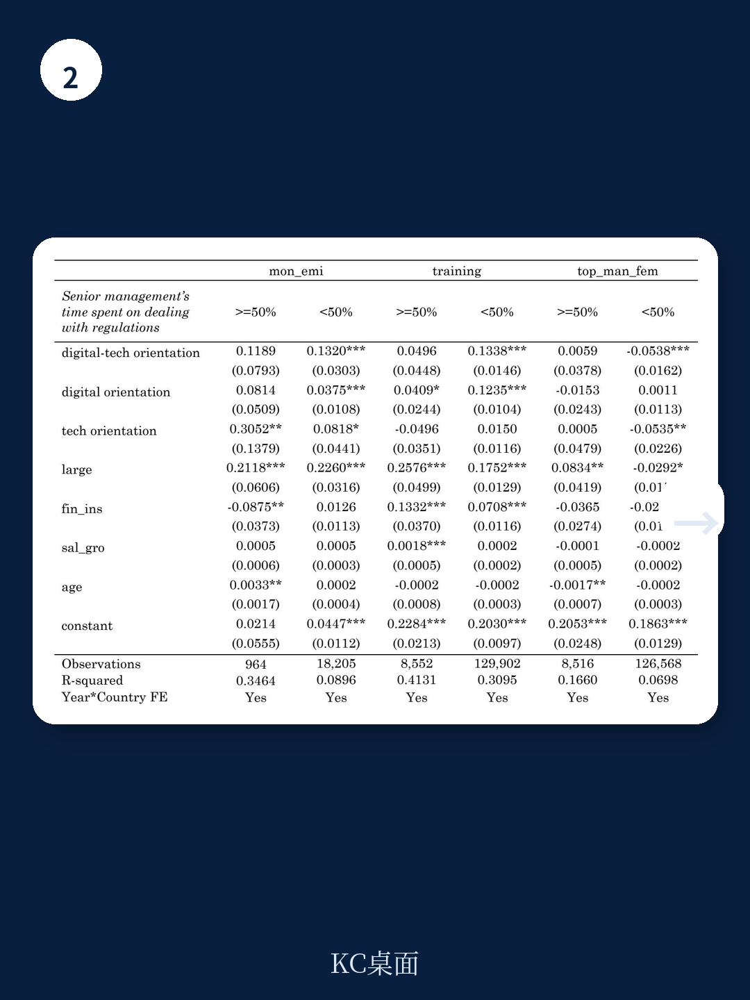

# 世界银行：数字化企业更环保、更培训，但更少女性高管

数字科技公司常常被描绘成未来商业的引领者——更敏捷、更透明、更注重社会责任。然而，世界银行一份覆盖158个国家、近20万家企业的研究报告揭示了一个远比想象中复杂的真相：技术的伦理效应并非单向的绿灯，而是一幅充满张力与矛盾的图景。

这份基于2006年至2023年企业调查数据的工作论文，核心发现可以概括为一个判断句：数字科技企业在环境和社会维度上表现更优，但在公司治理的性别维度上，却显示出显著的倒退。这不是一个简单的“科技向善”或“科技作恶”的故事，而是一个关于文化土壤、制度环境与商业激励机制如何共同塑造企业伦理行为的复杂叙事。

我们来看数据究竟说了什么，以及这些发现对产业决策者和投资者意味着什么。

## 1. 数字科技企业在环保和员工培训上确实表现更好，但这并非理所当然

研究选取了三个指标来刻画企业的伦理行为：是否监测二氧化碳排放（环境维度E）、是否为员工提供正式培训（社会维度S）、以及是否聘用女性高管（治理维度G）。在控制了企业规模、融资渠道、销售增长、企业年龄和国家人均GDP后，结果清晰显示：同时具备技术密集度和数字化在线存在（拥有网站或社交媒体页面）的企业，在监测碳排放和提供员工培训上的概率显著高于其他企业。

这个结果听起来符合直觉，但其背后的逻辑值得深究。报告指出，数字科技企业之所以更倾向于监测碳排放，并非仅仅因为“它们更环保”，而是因为技术本身提供了更低成本的监测手段。同样，数字化培训工具使得员工技能提升变得可规模化、可追踪。换句话说，伦理行为的“成本曲线”因技术而下降，从而激励了企业采取这些行动。

> **KC评论：** 这意味着，对于政策制定者而言，推动企业环境和社会责任的关键杠杆之一，可能是降低技术工具的采用门槛，而非单纯依靠惩罚或道德呼吁。对于投资者而言，一家企业是否在环境和社会维度上表现良好，可能与其技术基础设施的先进程度高度相关，而非仅仅取决于其“价值观声明”。

然而，这一逻辑在治理维度上并未延续。当我们将目光转向女性高管这一指标时，结论出现了令人不安的转向。

## 2. 数字科技企业在性别治理上表现更差，这暴露了技术中立的幻觉

这是整份报告最具冲击力的发现。数据显示，数字科技企业聘用女性高管的概率显著低于其他类型的企业。在控制了所有可观测因素后，这一负相关关系依然稳健。

报告试图从两个角度解释这一现象。其一，是STEM（科学、技术、工程、数学）教育领域的性别差距，导致技术密集型行业中的合格女性候选人“池子”天然较小。其二，是文化因素的调节作用——在“男性气质”较强、长期导向较弱的国家，数字科技企业的性别差距更为明显。

但这里有一个更深层的问题值得追问：如果技术本身是中性的，为什么它在环境和社会维度上“赋能”，却在性别治理上“固化和扩大差距”？报告没有直接给出答案，但它提供了一条线索：当我们将文化因素纳入模型后，数字科技与女性高管之间的负相关关系在不同国家间存在显著差异。换言之，技术并没有自动消除文化偏见，反而在某些情况下放大了它们。

> **KC评论：** 这一发现对投资者来说是一个明确的警示信号。ESG评级中，治理（G）维度往往被简化为董事会独立性、审计委员会结构等技术性指标，而性别多样性是其中关键的一项。如果数字科技企业在这一指标上系统性落后，那么单纯从“科技行业”标签出发的ESG投资策略，可能隐藏着未被充分定价的治理风险。完整报告中包含按国家、行业细分的回归结果，可以帮助读者识别哪些地区的数字科技企业性别治理风险尤为突出。

## 3. 商业监管环境对数字科技企业的伦理行为有非对称影响

研究进一步考察了商业监管环境——包括监管负担和法院作为商业障碍的感知——如何调节数字科技企业的伦理行为。结果再次呈现出非对称性。

在环境和社会维度上，当监管负担较低时，数字科技企业监测碳排放和提供员工培训的倾向更强。这符合直觉：过度的官僚程序会消耗管理层的精力，削弱企业采取主动伦理战略的意愿。

但在治理维度上，情况完全相反。研究发现，当监管负担降低时，数字科技企业聘用女性高管的概率反而进一步下降。报告给出的解释是，女性高管可能花费更多时间处理监管要求，因此当监管负担减轻时，这一“隐性优势”消失，性别差距反而扩大。同样，当法院不被视为商业障碍时，数字科技企业的性别差距也更大。

这一发现极具政策启示。它意味着，旨在简化商业环境、降低企业成本的改革，在性别平等这一目标上可能产生意想不到的负面效果。这不是说监管越重越好，而是提醒政策制定者和企业管理者：结构性改革的影响从来不是线性的，必须在不同伦理维度上进行权衡评估。

## 4. 文化是技术伦理效应的“放大器”，而非“矫正器”

报告中使用了霍夫斯泰德的五维文化框架，以检验文化如何调节数字科技企业的伦理行为。结果进一步强化了前述判断：技术并未超越文化，而是嵌入在文化之中。

具体而言，在个人主义较强、长期导向较高的国家，数字科技企业监测碳排放的倾向更强。在权力距离较低、不确定性规避较低的国家，数字科技企业提供员工培训的倾向更强。而在男性气质较强、长期导向较低的国家，数字科技企业的性别差距更为显著。

这些发现意味着，同样的技术采用，在不同文化土壤中会结出截然不同的伦理果实。对于跨国企业和全球投资者而言，这意味着无法用一套统一的“最佳实践”来管理全球子公司的ESG表现。技术工具可以全球复制，但其伦理效应却高度本地化。

> **KC评论：** 这份报告虽然没有直接给出投资建议，但它提供了一个分析框架：评估一家数字科技企业的ESG表现时，不能只看其总部所在国的文化或监管环境，而必须审视其核心运营所在国的文化特征。完整报告中的异质性分析部分，按国家群组展示了不同文化维度下的回归系数，对于制定区域化ESG投资策略具有直接参考价值。

## 5. 报告尚未完全回答的关键问题：因果机制与长期动态

尽管这份世界银行的工作论文在实证上做出了重要贡献，但它也留下了几个关键问题并未完全解决。

第一，是因果识别问题。研究采用了截面数据与企业固定效应模型，虽然能够控制大量可观测和不可观测的异质性，但依然难以完全排除反向因果和遗漏变量偏误。例如，是否更注重环保的企业本身就更倾向于数字化？或者说，性别治理较差的企业是否因为其他未被观测到的因素（如创始人文化、风险偏好）而同时更倾向于技术密集？报告承认了这一局限性，并呼吁未来研究采用更严格的因果识别策略。

第二，是长期动态问题。数据覆盖2006年至2023年，但研究主要基于截面比较。技术变革、监管演进和性别观念的变化是动态过程，数字科技企业在不同时间段的伦理行为是否有显著变化？报告没有提供时间序列上的趋势分析。

第三，是治理维度的单一指标问题。报告用“是否有女性高管”来衡量治理维度，这虽然是一个常用且可比较的指标，但无法捕捉治理质量的全貌。例如，女性高管是否真正拥有决策权？董事会层面的性别构成如何？这些更深层的治理问题有待进一步研究。

**这些未解问题，恰恰是值得继续深挖的方向。** 完整报告包含了详细的变量定义表、描述性统计、相关矩阵以及多项稳健性检验的回归结果。对于希望深入理解技术、文化与制度如何共同塑造企业伦理行为的读者，这些图表和假设检验提供了不可替代的原始素材。

***

如果您希望获取这份世界银行工作论文的完整解读与原始图表，欢迎加入我们的社群。这里汇聚了来自头部券商、PE/VC、投行、并购、对冲基金、资管机构、战略咨询、智库等领域的专业人士，每日更新国际主流信源汇编与评论，观测全球宏观与产业的边际变化。扫码交流，期待与您一起讨论这些未解问题。

Personal reading notes and learning share only. Not investment advice.

