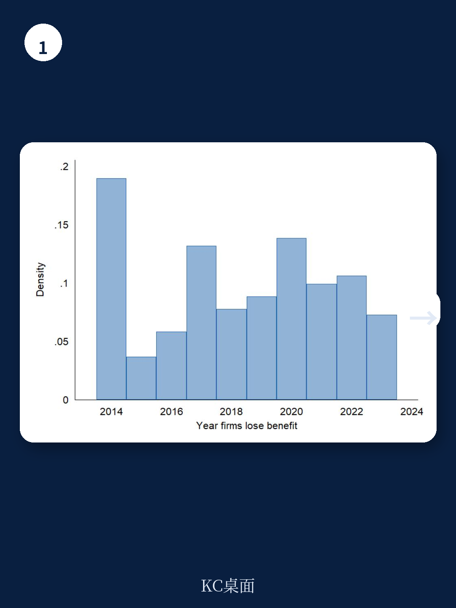
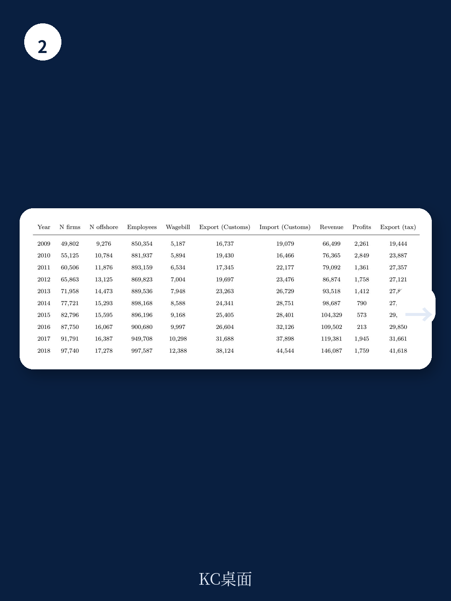

# 世界银行：减税救不了实体经济，别再迷信企业税收优惠了

税收优惠是全球政府吸引投资最常用的工具。OECD数据显示，2022年87%的发展中经济体至少提供一种企业所得税减免。世界银行的研究估计，2021年全球企业税收减免规模相当于全球GDP的1.4%、全球税收收入的7.8%。

但一个根本问题始终悬而未决：这些动辄占GDP数个百分点、耗资巨大的优惠政策，真的带来了就业、产出和投资增长吗？

世界银行最新发布的工作论文《The Elusive Impact of Corporate Tax Incentives》，用突尼斯出口企业税收优惠改革的自然实验，给出了一个反直觉但严谨的答案：税收优惠能吸引企业注册，但注册数量的增加并不转化为真实经济活动。换言之，大量政策投入可能只是在“制造公司壳子”，而非创造经济价值。

这份研究对当前中国地方政府招商引资、产业园区政策设计，以及全球税制改革讨论，都有直接借鉴意义。

> **KC评论：** 世界银行这篇论文的核心判断是，企业税收优惠对经济的拉动作用远低于政策制定者的预期。它区分了两个概念：企业注册数量和经济活动总量。前者对税收敏感，后者几乎不敏感。这意味着，如果政策目标只是让更多公司出现在工商登记簿上，减税确实有效；但如果目标是增加就业、提高工资、扩大产出，减税可能不是最优工具。完整报告提供了详实的因果识别策略和稳健性检验，值得仔细推敲其方法论边界。

## 1. 突尼斯实验：一个罕见的“干净”政策冲击

世界银行选择突尼斯作为研究场景，是因为这里发生了一次罕见且近乎理想的政策变动。突尼斯长期实行“离岸”与“在岸”双轨税制：出口企业（离岸）享受零企业所得税，内销企业（在岸）面临30%税率。这个离岸免税政策自1972年实施以来，历经多次延期，企业早已将其视为永久性安排。

2014年，突尼斯政府终于打破惯例，将离岸企业税率从0%提高到10%，同时在岸税率从30%降至25%。更重要的是，出口企业享有的其他优惠——如免税进口、简化海关流程、外币账户——完全保持不变。

这就创造了一个难得的“单一变量变化”场景：只有企业所得税率变了，其他制度环境不变。研究者可以相对干净地识别税收对经济行为的影响。

利用突尼斯全国企业注册、社保、海关和税务的行政数据，研究团队构建了2009-2018年近150万家企业的大面板数据，采用双重差分法比较离岸与在岸企业在改革前后的表现差异。

## 2. 注册数量骤降，但经济活动纹丝不动

研究结果呈现出一种看似矛盾的格局。

在“企业数量”这个维度，改革效果立竿见影。改革前四年，离岸和在岸企业数量同步增长。改革后第一年即2014年，两条曲线急剧分化。相比在岸企业的增长趋势，离岸企业数量在四年后累计下降了20%。

分解来看，这个下降几乎完全由新企业进入减少驱动，而非现有企业退出增加。换言之，潜在创业者看到税率上升，选择不注册离岸公司了。

但核心发现出现在经济产出维度。无论就业、工资总额还是营业收入，离岸部门在改革后均未出现统计显著的下降。即便只看制造业——离岸企业最集中的行业——也只有微弱的正向影响，且统计精度不足。

为什么企业数量下降，经济活动却不受影响？研究通过更细颗粒度的数据分析给出了解释：新进入企业通常规模极小，而离岸部门的经济活动高度集中在少数大型在位企业手中。这些大企业在改革后继续正常运营，其经济贡献足以抵消新企业减少的影响。

> **KC评论：** 这是整篇论文最具洞察力的发现。它意味着，税收优惠吸引来的主要是“边际企业”——规模小、对成本敏感、可能随时进出的创业者。真正贡献就业和产出的核心企业，其决策更多取决于基础设施、劳动力成本、政治稳定性和市场规模等因素，税收只是次要变量。完整报告中有详细的行业集中度分析和在位企业面板回归结果，可以帮助读者理解这个结论的稳健性。

## 3. 为什么税收优惠的效果被高估了？

世界银行的这项发现并非孤证。论文系统梳理了已有文献，指向一个正在凝聚的共识。

Frick和Rodriguez-Pose对多国经济特区企业管理层的访谈发现，基础设施、劳动力成本和政治稳定性远比税收优惠重要。Gordon和Li的研究指出，对企业风险承担最重要的税收条款是亏损处理机制（如允许从工资税中抵扣亏损），而非降低税率本身。Harju等人在芬兰的企业减税研究中，也未发现减税对投资水平的显著影响。

Gechert和Heimberger对42项研究的元分析结论更为直接：企业减税对经济增长的影响极其有限，如果有的话。

当然，也存在相反证据。Ohrn发现美国制造业有效税率每降低1个百分点，投资增加超过4%。Zwick和Mahon证明加速折旧政策确实能刺激资本支出，尤其对小企业有效。

世界银行的贡献在于，它提供了一个调和这些矛盾发现的框架：企业税收变化确实会影响企业注册和收入归集行为，但这不等于创造了新的经济活动。企业可能只是从非公司形式转为公司形式，或者将利润从高税率地区转移至低税率地区——这些都是“纸面效应”，而非实体经济效应。

Damgaard等人的研究直接印证了这一点：他们区分了“幽灵FDI”（投资进入空壳公司，与本地实体经济无关）和“真实FDI”，发现低税率确实能吸引更多FDI总量，但对真实FDI影响为零。

## 4. 报告未完全回答的关键问题

尽管这篇论文在方法论上相当严谨，但仍有几个关键问题值得进一步追问。

第一，研究场景是突尼斯这样一个中低收入国家，其制度环境、执法能力和企业行为模式与发达经济体或中国存在显著差异。突尼斯离岸企业享受的特殊待遇——外币账户、简化海关——在其他国家可能并不存在。因此，税收优惠效果为零的结论能否推广到其他制度环境，尚需验证。

第二，研究聚焦于企业所得税，但现实中企业激励政策往往是“组合拳”。如果税收优惠与其他政策（如土地、补贴、人才）捆绑实施，效果可能不同。论文并未回答“最优政策组合”是什么。

第三，研究考察的是2014-2018年的短期至中期影响。税收优惠对长期经济增长、技术外溢和产业升级的影响，需要更长时间窗口的观察。特别是，如果新企业进入减少意味着未来潜在的大企业减少，长期影响可能被低估。

第四，研究没有深入讨论“为什么在位企业不因税率上升而收缩”。一个可能的解释是，在位企业已经进行了沉没投资，退出成本高；另一个可能是，10%的税率仍然远低于在岸企业的25%，相对优势依然存在。如果是后者，那么当税率进一步趋同（突尼斯2021年已统一为15%）时，效果可能不同。

> **KC评论：** 这些未解问题恰恰是完整报告的精华所在。研究团队在附录中进行了大量稳健性检验，包括使用Rambachan和Roth的“Honest DID”方法评估平行趋势假设的敏感性。结果显示，企业进入数量下降的结论对平行趋势违背相当稳健，但经济活动无影响的结论则敏感得多。这些技术细节对从事因果推断的研究者极具参考价值，完整报告中有详细图表和代码说明。

## 5. 对中国产业政策的启示

虽然研究背景是突尼斯，但对中国当前的政策讨论有直接启发。

中国各地产业园区、开发区普遍提供企业所得税减免、租金补贴、人才奖励等优惠政策。这些政策是否真的带来了预期的就业和产出增长？是否存在大量企业注册后“空转”或“套利”的现象？

世界银行的研究提供了一个分析框架：区分“企业注册效应”和“实体经济效应”。如果政策目标只是增加注册企业数量，税收优惠确实有效；但如果目标是促进就业、提高工资、扩大产出，可能需要重新审视政策工具的选择。

更具体地说，研究暗示了三个政策方向：第一，与其提供普遍性的税收减免，不如针对性地解决企业面临的实际瓶颈——融资约束、人才短缺、基础设施不足；第二，政策评估应关注“经济产出”而非“企业数量”，避免被注册数据误导；第三，对于已经享受优惠的在位企业，取消优惠可能不会导致经济产出大幅下降，这为政策退出提供了空间。

当然，这些启示需要结合中国具体制度环境进行检验。中国的地方政府竞争、国有企业角色、产业政策执行方式，都与突尼斯有本质差异。但世界银行的研究至少提醒决策者：不要高估税收优惠的力量，也不要低估其他因素的权重。

---

这篇世界银行工作论文的核心数据、因果识别策略和稳健性检验图表，在完整版报告中均有详细呈现。我们已将报告全文、关键图表和代码附录整理为中文导读版。

如果你希望：获取完整研报原文及图表，与更多关注全球宏观与产业政策的朋友交流，每日接收国际主流信源的精选汇编与评论，欢迎扫码加入我们的知识星球社群。这里汇聚了头部券商、PE/VC、投行、并购基金、对冲基金、资管机构、战略咨询公司和智库的朋友，期待与你一起观察全球经济的边际变化。

Personal reading notes and learning share only. Not investment advice.

