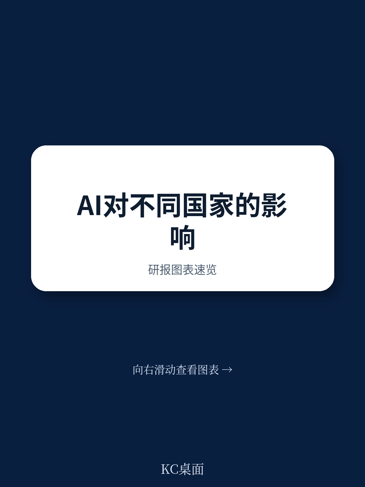
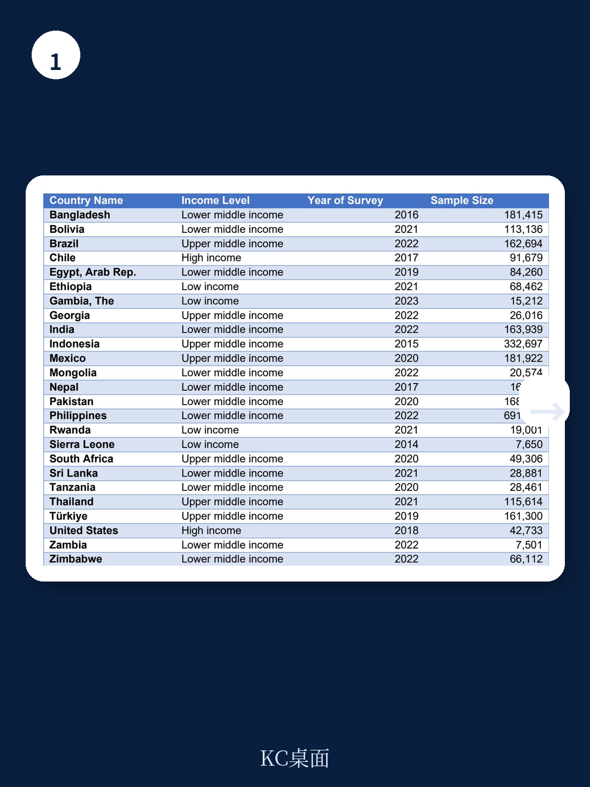
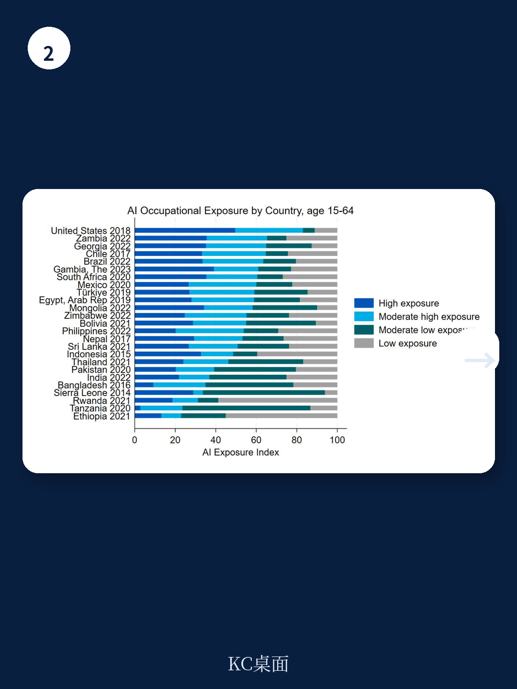

# 世界银行：AI对低收入国家劳动力的冲击，可能远小于市场预期

当全球资本市场的注意力几乎全部集中在生成式AI如何颠覆高收入国家白领工作时，一份来自世界银行的最新研究却指向了一个被严重忽视的方向：对于占全球人口近一半的低收入和中等收入国家，AI的劳动力市场冲击可能远比想象中有限。

这份由Gabriel Demombynes、Jörg Langbein和Michael Weber撰写的政策研究工作论文，分析了覆盖35亿人口的25个国家的微观数据，得出了一个与主流叙事形成鲜明对比的核心判断：AI的暴露度与国家收入水平呈正相关，且低收入国家的基础设施瓶颈——尤其是电力供应的缺乏——构成了AI渗透的实质性物理天花板。

这不是一份关于“AI将如何消灭发展中国家工作岗位”的悲观预测，而是一份冷静的、基于数据的结构性分析。它告诉我们，在谈论AI对全球劳动力的影响时，必须首先区分“可能性”与“现实性”。

## 1. 一个反直觉的事实：国家越穷，AI暴露度越低

报告的核心发现建立在一个精心构建的AI职业暴露指数（AIOE）之上。该指数将每个职业的AI暴露度标准化为0到100的区间。结果呈现出清晰的阶梯状分布：美国作为高收入国家的代表，平均暴露度高达62；上中等收入国家为49；下中等收入国家为44；而低收入国家仅为37。

这意味着什么？在低收入国家，只有约12%的劳动力处于高AI暴露度的职业中，而在高收入国家，这一比例接近四分之一。这种差异不是统计噪声，而是经济结构的系统性反映。低收入国家的就业结构仍然以农业和低技能服务业为主，这些领域的任务构成与当前AI的能力边界之间存在显著鸿沟。

> **KC评论：** 市场常常将“AI替代工作”视为一个全球统一的线性进程。但世界银行的这份报告提醒我们，AI的冲击首先是一个结构性现象，而非技术现象。对于投资新兴市场的决策者而言，这意味着短期内不应高估AI对当地劳动力成本优势的侵蚀，也不应低估传统产业（如农业、建筑业）在AI时代的韧性。

## 2. 性别、教育与地理：AI暴露度的三重分化

报告利用微观数据的优势，在控制了其他变量后，揭示了AI暴露度在不同人口群体中的系统性差异，这些差异对于理解AI的社会影响至关重要。

**性别维度：** 在所有收入水平的国家中，女性工人的AI暴露度都高于男性。但在高收入国家，这一差距被显著放大。在美国，女性的平均暴露度为65，男性为59。这一差距在低收入国家则几乎消失。这意味着，AI对性别就业差距的影响将呈现“倒U型”曲线：随着经济发展，女性在知识密集型岗位的集中度提高，反而使其更易受到AI冲击。

**教育维度：** 教育水平与AI暴露度之间存在强烈的正相关。在中等收入国家，拥有高等教育学历的工人，其AI暴露度比仅完成初等教育的工人高出近4个指数点。这印证了AI首先冲击的是“认知型”工作，而非“体力型”工作。对于正在大规模投资教育的发展中国家而言，这是一个值得深思的信号：培养更多的白领劳动力，可能意味着创造了一个更易被AI影响的人群。

**地理维度：** 城市工人的AI暴露度普遍高于农村工人。这一点在低收入国家尤为明显，城市工人的平均暴露度为44，而农村工人仅为32。城市作为知识密集型产业和服务业的聚集地，天然成为AI渗透的前沿阵地。

> **KC评论：** 这三重分化共同指向一个核心洞察：AI冲击的不是“最脆弱的”人群，而是“最连接的”人群。对于政策制定者而言，应对AI挑战的关键或许不在于保护特定职业，而在于增强所有劳动者的适应能力——尤其是那些目前暴露度较低、但未来可能被间接影响的群体。

## 3. 电力瓶颈：被忽视的AI物理天花板

报告的另一个重要贡献在于，它首次将AI暴露度与基础设施数据——特别是电力接入——进行了交叉分析。这一分析揭示了一个关键但常被忽略的约束条件：即使一个职业在理论上具有高AI暴露度，如果工人无法获得可靠的电力供应，这种暴露也仅仅是理论上的。

在低收入国家，农村地区有超过50%的人口无法获得电力。这意味着，即使AI技术被证明能够极大提升农业或低端制造业的生产效率，其实际部署也面临根本性的物理障碍。报告的数据显示，当同时考虑职业暴露度和电力接入时，低收入国家劳动力的“有效暴露度”进一步下降。

这一发现具有深远的投资和政策含义。它意味着，在讨论AI对发展中国家的影响时，不能简单地将发达国家的分析框架套用过来。对于许多低收入国家而言，当前最紧迫的挑战不是如何应对AI带来的就业替代，而是如何建设AI能够发挥作用的基础设施。

## 4. 报告尚未完全回答的关键问题：暴露度不等于替代率

尽管报告提供了迄今最全面的发展中国家AI暴露度分析，但它也坦诚地指出了几个关键局限，这些局限恰恰构成了读者需要继续深入挖掘的方向。

首先，也是最关键的，AI暴露度并不等于就业替代率。报告明确区分了“增强”（augmentation）和“自动化”（automation）两种可能路径。高暴露度的职业可能意味着工人的生产力得到极大提升，而非被完全取代。例如，一个法律助理使用AI进行文档审查，其工作效率可能翻倍，但工作岗位并未消失。报告没有提供足够的数据来区分这两种效应在发展中国家可能呈现的不同比例。

其次，报告的AI暴露指数基于美国O*NET职业分类系统，并将其映射到国际标准职业分类。这种映射在发达国家可能较为准确，但在发展中国家，许多职业的任务构成可能与美国存在显著差异。一个在尼日利亚的“会计”和一个在纽约的“会计”，其日常任务可能截然不同，AI对前者的影响可能远小于后者。

第三，报告没有考虑AI对劳动力需求的间接效应。即使AI直接替代的岗位有限，它也可能通过改变产业结构、供应链布局和资本流向，间接影响发展中国家的就业。例如，如果AI使得发达国家能够将部分服务业回流，那么发展中国家的业务流程外包产业将受到冲击。这种动态的、一般均衡的效应，超出了当前静态暴露度分析的能力范围。

## 5. 一个观察框架：如何追踪AI对新兴市场的真实影响

基于世界银行报告的发现，我们可以构建一个更实用的观察框架，用于追踪和评估AI对新兴市场劳动力市场的真实影响，而非仅仅停留在抽象的暴露度讨论上。

**第一层：基础设施门槛。** 首先观察目标国家的电力覆盖率、互联网渗透率和移动数据成本。这些是AI落地的物理前提。如果一个国家仍有30%以上的人口缺乏稳定电力，那么谈论AI对大部分劳动力的影响就是过早的。

**第二层：产业结构。** 分析该国就业结构在农业、制造业和服务业之间的分布。AI对知识密集型服务业的冲击最大，对农业和低端制造业的直接冲击最小。一个以农业为主的国家，其AI冲击曲线将显著不同于一个以IT外包为主的国家。

**第三层：教育存量。** 考察中等和高等教育的普及率。AI暴露度与教育水平高度相关，这意味着教育程度越高的劳动力市场，越需要为AI冲击做好准备。但这也意味着，这些市场的“AI红利”可能更大——前提是工人能够与AI协作而非被替代。

**第四层：政策响应。** 关注该国政府是否在制定AI相关的劳动力政策，包括再培训计划、社会保障体系改革和数字基础设施建设。政策响应的速度和方向，将决定AI冲击的最终结果。

> **KC评论：** 世界银行的这份报告提供了一个宝贵的起点，但它更像是一张地图，而非导航。地图告诉我们哪里有山、哪里有河，但如何穿越，取决于我们自己的判断和持续的信息更新。对于关注新兴市场投资和产业趋势的读者而言，真正的价值不在于记住几个暴露度数字，而在于理解这些数字背后的结构性逻辑，并据此建立自己的分析框架。

---

世界银行的这份报告揭示了一个被市场叙事所遮蔽的真相：AI对全球劳动力的影响，不是均匀分布的浪潮，而是高度结构化的涟漪。低收入国家面临的根本挑战，不是如何应对AI对现有工作的替代，而是如何跨越基础设施和人力资本的鸿沟，以便在AI时代不被落下。

报告中关于电力接入与AI暴露度的交叉分析、不同收入国家间的职业结构差异、以及性别与教育维度的分化，都值得进一步深入拆解。完整报告包含了25个国家的详细数据表格、多变量回归分析结果，以及关于AI暴露度与工作“互补性”的深入讨论——这些内容在本文中因篇幅所限未能完全展开。

如果你希望获取完整报告的原始图表、关键数据提取，以及来自全球头部投行和咨询机构对AI劳动力影响的最新跟踪分析，欢迎加入我们的社群。这里汇聚了来自头部券商、PE/VC、投行、并购、对冲基金、资管机构、战略咨询和智库的朋友，我们每日更新国际主流叙事、数据和图表，观测边际变化，共同探讨AI时代的新兴市场投资逻辑。

Personal reading notes and learning share only. Not investment advice.

