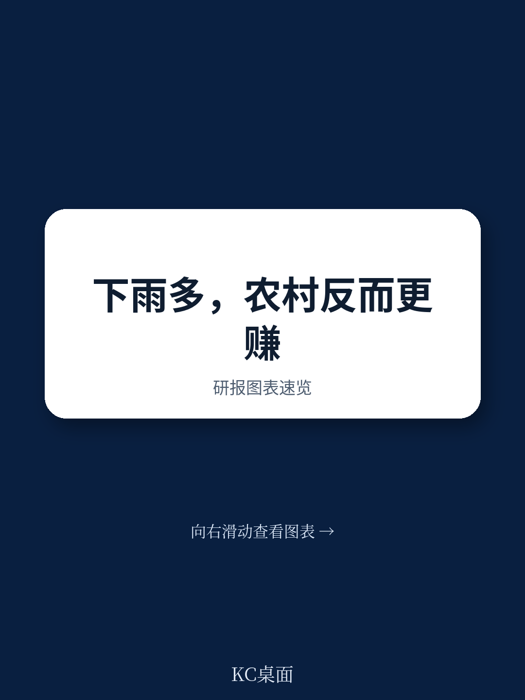

# 世界银行：一场降雨如何重塑印度农村经济的全部链条

一份来自世界银行的最新研究，以印度最大的农业邦拉贾斯坦邦为样本，系统拆解了降雨冲击如何沿着“农业产出——非农企业——家庭消费”这条链条逐级传导，并最终放大或收缩整个农村经济的总产出。研究结论清晰且有力：降雨冲击对非农企业收入和增值的影响，远大于对农业本身的直接影响。这一发现，对于所有关注新兴市场农村经济、气候变化适应能力以及农业政策设计的人来说，都构成了一次认知上的必要升级。

这份报告的核心判断不是“降雨影响农业”——这早已是共识。它的真正贡献在于，用严格的因果识别方法，量化了降雨冲击通过农业这个“放大器”，如何对看似无关的农村零售、服务等非农部门产生数倍于农业的冲击力。这意味着一场旱灾摧毁的不仅是庄稼，更是整个乡村经济体系的购买力、就业机会和抗风险能力。反过来，一场好雨带来的繁荣，也远不止是粮仓丰满那么简单。

## 1. 正面降雨冲击让农业产出提升7%，但灌溉设施是关键的“减震器”

研究首先确认了一个基础事实：相较于负面降雨冲击，正面降雨冲击能够使拉贾斯坦邦的农业综合生产率提升约7%。这个数字本身并不令人意外，但报告揭示了一个关键的调节变量——灌溉基础设施。灌溉面积占比越高的地区，降雨冲击对农业生产率的影响就越小。换句话说，灌溉不仅是在干旱年份保产，更是在所有年份中平滑掉农业产出的剧烈波动，让农民的收入预期更加稳定。

这7%的提升，是后续所有连锁反应的起点。它意味着农民和农业相关从业者口袋里的钱变多了。而这笔增量收入，不会全部存起来，它必然流向消费和投资。这正是理解农村经济循环的关键入口。

> **KC评论：** 7%这个数字看似不大，但它是一个“平均效应”。对于没有灌溉条件的雨养农业区，这个冲击的实际影响可能远超7%。报告在此处埋下了一个重要伏笔：既然灌溉能大幅缓冲冲击，那么政策制定者在思考气候适应时，就不能只关注“抗旱”，更要关注“灌溉覆盖率”这一结构性变量。完整报告中包含了不同灌溉水平下的异质性分析图表，这些图表对于评估具体区域的政策优先级至关重要。

## 2. 非农企业才是降雨冲击的真正“放大器”：收入激增25.7%

报告最核心的发现出现在非农企业层面。当正面降雨冲击发生时，农村非农企业的总收入平均增长25.7%，而企业增加值（即收入减去运营成本后的毛利）更是飙升30.3%。这一增幅是农业产出增幅的3到4倍。换言之，农业部门每多产出1块钱，非农部门就能多赚接近4块钱。

这背后的传导机制非常清晰：正面降雨冲击提高了农业收入，这部分增量收入迅速转化为对本地非农商品和服务的需求。报告特别指出，零售贸易类企业是最大的受益者。农民在丰收后，会更多地购买日用品、服装、工具和简单的娱乐消费。这些商品大多是非贸易品，无法从外地大规模输入，因此本地零售商、小作坊、运输服务等非农企业就成了最大的受益方。

这一发现彻底改变了我们对农村经济的理解。过去，人们往往认为非农部门是独立于农业的“第二增长极”。但这份研究证明，在拉贾斯坦邦的农村，非农部门高度依赖农业部门的“需求溢出”。农业是发动机，非农是挂在上面的车厢。一旦发动机熄火，车厢的停滞速度会更快。

> **KC评论：** 25.7%和30.3%这两个数字，对于任何关注印度农村市场消费潜力的企业或投资者来说，都是极其重要的信号。它意味着，农村消费市场的景气度，本质上是由“老天爷的脸色”决定的。如果一家快消品公司想下沉到拉贾斯坦的农村，它的库存策略和营销投入，必须与季风预报深度绑定。报告中对不同行业（零售、制造、服务）的异质性拆解，以及企业规模（自有账户企业 vs 雇佣企业）的差异分析，在完整报告中都有详细图表。这些细节是制定精准市场策略的关键。

## 3. 消费端的变化指向“奢侈品”而非必需品：需求结构揭示经济逻辑

为了验证“需求溢出”这一传导渠道，研究进一步分析了农村家庭消费结构的变化。结果非常清晰：在正面降雨冲击下，农村家庭人均月消费支出增加了6%。但这一增长并非均匀分布——它几乎全部由“奢侈品”支出的增加所驱动，而非必需品支出。

报告将消费细分为“必需品”和“奢侈品”。必需品包括食品、基本衣物等刚性支出；奢侈品则包括娱乐、外出就餐、非必需消费品、耐用消费品等。数据显示，正面降雨冲击对必需品支出没有显著影响，但对奢侈品支出带来了5.2%的显著增长。这完全符合经济学直觉：当农民收入增加时，他们首先满足的是那些被压抑的非必需需求。这也解释了为什么非农企业中的零售贸易类企业受益最大——因为它们正是提供这些“奢侈品”的主要渠道。

这一消费结构的变化，反过来又印证了非农企业收入暴增的“需求侧”逻辑。它不是由农业部门向非农部门“输血”（如购买化肥、农机），而是由农业家庭的“消费升级”所拉动。这是一个纯粹的内生增长循环：好天气——好收成——多花钱——非农繁荣。

## 4. 报告尚未完全回答的关键问题：灌溉的“公平性”与政策的“精准度”

尽管这份报告提供了极其清晰的因果链条，但它也留下了一些值得深入追问的问题，而这些问题的答案，恰恰决定了政策建议的有效性。

首先，灌溉设施在拉贾斯坦邦的分布是否公平？研究证明灌溉能缓冲冲击，但拥有灌溉设施的往往是相对富裕、土地规模更大的农户。对于占农村人口大多数的边际农户和小农而言，他们既没有灌溉设施，也无法从正面降雨冲击中获得等比例的收益。那么，这部分人群的消费和非农企业需求，是否可能因为收入分配不均而无法被充分激活？报告没有深入探讨灌溉设施的持有结构，这构成了一个重要的未解问题。

其次，政策应该如何精准地“对冲”这种风险？既然非农企业的脆弱性来自农业需求，那么传统的农业保险（只赔付作物损失）是否足够？是否需要设计一种“农村收入保险”或“非农企业收入平滑工具”？报告指出了问题的性质，但没有给出具体的政策工具包。这恰恰是决策者最需要的内容。

> **KC评论：** 报告的实证工作极为扎实，但在政策建议层面留出了巨大的讨论空间。例如，是否可以通过发展农村电商，将部分非贸易品转化为可贸易品，从而降低本地经济对单一农业需求的依赖？或者，是否可以通过提供小额信贷，帮助非农企业在丰年囤积库存、在歉年维持运营？这些“二阶”的政策设计，需要结合报告中的异质性分析以及更详尽的微观数据才能回答。完整报告附录中包含了关于企业信贷获取、注册状态等维度的丰富交叉分析，这些数据是构建精准政策方案的基础。

## 5. 对读者的观察框架：如何用“降雨冲击”视角重新审视新兴市场农村经济

这份报告的价值不仅在于其结论本身，更在于它为我们提供了一套可迁移的分析框架。对于任何关注新兴市场、尤其是南亚和东南亚农村经济的读者，都可以用以下三个问题来构建自己的观察：

第一，本地经济的“农业-非农”联动系数是多少？这需要理解一个地区的农业收入波动，在多大程度上会转化为本地非农需求的波动。拉贾斯坦邦的系数是3-4倍，其他地区可能更高或更低，取决于市场开放度和产业结构。

第二，本地消费结构是否具备“韧性”？如果一个地区农村家庭的必需品支出占比过高（例如超过70%），那么即使农业丰收，其向非农部门的溢出效应也会非常有限。反之，如果“奢侈品”或非必需消费的弹性较大，那么溢出效应就会非常显著。

第三，本地的基础设施（尤其是灌溉和交通）是否足以充当“减震器”？灌溉能缓冲农业冲击，而交通基础设施则能帮助非农企业从更远的市场采购或销售，从而降低对本地农业需求的单一依赖。这两个变量，是判断一个农村经济体脆弱性的核心指标。

## 6. 顺着这些未解问题，继续读完整报告

上述分析只是这份世界银行研究报告的冰山一角。报告还深入探讨了不同所有制企业（自有账户企业 vs 雇佣企业）、不同行业（零售、制造、服务）对降雨冲击的差异化反应，以及城市地区是否也具有类似的传导链条（答案是否定的，城市经济对降雨冲击的免疫力更强）。这些异质性分析，对于理解“谁最脆弱”以及“谁最受益”至关重要。

此外，报告在实证方法上采用了严谨的固定效应模型，并进行了大量的稳健性检验。对于关注因果推断方法论的读者而言，报告的技术附录同样值得细读。

我们已经在社群中完整整理了这份报告的全文、核心图表、数据来源以及我们的精读笔记。如果你希望获得这份报告的全貌，并与其他关注新兴市场、气候经济学和农村发展的朋友一起讨论，欢迎扫码加入我们的社群。在这里，我们每日更新来自世界银行、IMF、各大投行和国际智库的前沿研究，汇聚了来自头部券商、PE/VC、投行、并购、对冲基金、资管机构、战略咨询和智库的朋友，期待与你交流。

Personal reading notes and learning share only. Not investment advice.

